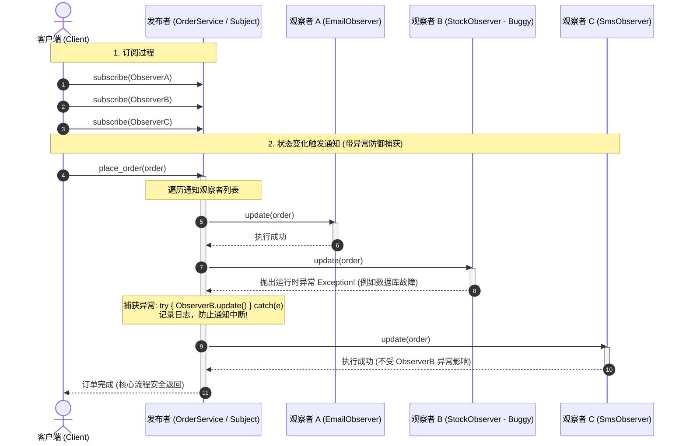
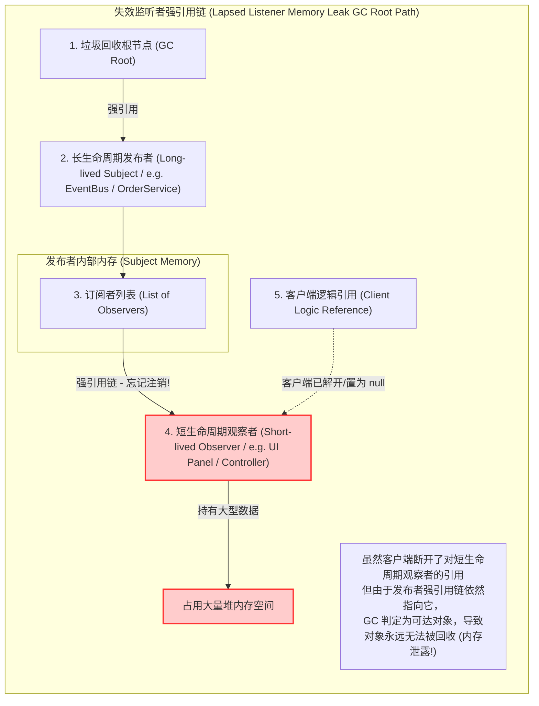

import GlossaryTerm from '@site/src/components/GlossaryTerm';
import GuidedExercise from '@site/src/components/GuidedExercise';
import ResearchNote from '@site/src/components/ResearchNote';
import ChapterMeta from '@site/src/components/ChapterMeta';
import PyRunner from '@site/src/components/PyRunner';
import TradeoffExplorer from '@site/src/components/TradeoffExplorer';
import QuizCard from '@site/src/components/QuizCard';

# M4L7 · 观察者模式

<ChapterMeta
  time="约 2 小时"
  prereqs={[{label: 'M4L3 DIP', href: './solid-lsp-isp-dip'}, {label: 'M2L10 通信与解耦', href: '../system-design-bridge/communication-decoupling'}]}
  outcome="能用观察者/发布订阅让“一件事发生 → 通知多方”解耦：发布者不认识订阅者，订阅者可随时增减。"
  howToUse="先看“下单后要做五件事”硬编码的耦合，再用观察者解耦，最后做 lab。"
/>

:::tip 观察者模式，是“事件驱动架构”在代码层的雏形
[M2L10](../system-design-bridge/communication-decoupling) 你学过事件驱动让服务解耦。观察者模式就是它在**一个进程内**的对应物：发布者发一个事件，所有订阅者各自响应，发布者完全不必知道有谁在听。
:::

## 一、下单后要做的事越来越多

下单成功后，你要：发确认邮件、加积分、更新库存、推荐系统打点、发短信……于是 `place_order()` 末尾堆了五行直接调用。每加一个“下单后动作”，你就改一次 `place_order`——它认识了所有下游，**强耦合、违反开闭、还越来越胖（[上帝函数](./solid-srp-ocp)）**。变化点是：“关心下单这件事的人”会不断增减。

```mermaid
flowchart TD
  subgraph HardcodedCoupling["1. 硬编码耦合结构 (Tight Coupling - violates OCP)"]
    direction TB
    OrderService1["下单核心业务 <br/>(OrderService.place_order)"]
    
    OrderService1 -->|直接调用| EmailService1["邮件服务 <br/>(EmailService.send)"]
    OrderService1 -->|直接调用| PointsService1["积分服务 <br/>(PointsService.add)"]
    OrderService1 -->|直接调用| StockService1["库存服务 <br/>(StockService.update)"]
    OrderService1 -->|直接调用| SmsService1["短信服务 <br/>(SmsService.send)"]
  end

  subgraph ObserverDecoupling["2. 观察者解耦结构 (Observer Decoupled - OCP compliant)"]
    direction TB
    OrderService2["下单发布者 <br/>(OrderService / Subject)"] -->|只维护和调用列表| ObserverInterface["观察者抽象接口 <br/>(OrderObserver Interface)"]
    
    EmailObserver["邮件观察者 <br/>(EmailObserver)"] -.->|实现 update(order)| ObserverInterface
    PointsObserver["积分观察者 <br/>(PointsObserver)"] -.->|实现 update(order)| ObserverInterface
    StockObserver["库存观察者 <br/>(StockObserver)"] -.->|实现 update(order)| ObserverInterface
    SmsObserver["短信观察者 <br/>(SmsObserver)"] -.->|实现 update(order)| ObserverInterface
  end
```

## 二、三个核心概念（分层）

### 基础：观察者 / 发布订阅

<GlossaryTerm term="Observer Pattern" definition="观察者模式：一个对象（subject/发布者）维护一组观察者（订阅者），当自身状态变化时逐个通知它们。发布者只依赖“观察者接口”，不认识具体订阅者，实现一对多解耦。">观察者模式</GlossaryTerm>：发布者（<GlossaryTerm term="Subject" definition="发布目标 (Subject)：观察者模式中的核心主题对象（也称 Observable）。负责维护订阅者列表（Observers），并在自身状态发生变化时发出通知（Notify）。">Subject</GlossaryTerm>）维护一个**订阅者列表**，事情发生时**逐个通知**。发布者只调用统一的“通知接口”，不认识任何具体订阅者——订阅者可以随时 `subscribe`/`unsubscribe`，发布者一行不改。

### 进阶：subject、observer 与松耦合

- **subject（发布者）**：管理订阅列表、负责 `notify`，只依赖“观察者有 `update()`”这个抽象（[DIP](./solid-lsp-isp-dip)）。
- **observer（订阅者）**：实现统一接口，自己决定收到通知后干什么。
- 好处：加“下单后发短信”= 写一个新订阅者并 `subscribe`，`place_order` 完全不动（开闭）。



### 深入（选学）：观察者的真实陷阱

观察者很优雅，但有坑：(1) **通知顺序**——多个订阅者的执行顺序通常不该被依赖；(2) **一个订阅者抛异常**会不会中断其余通知？要不要隔离？(3) <GlossaryTerm term="Lapsed Listener" definition="失效监听者问题：订阅者没有取消订阅就被丢弃，发布者仍持有它的引用，导致内存泄漏（对象无法被回收）。是观察者模式最常见的 bug。">失效监听者</GlossaryTerm>导致内存泄漏（忘了 unsubscribe）；(4) **同步 vs 异步**——同步通知会让发布者被慢订阅者拖住，所以大规模系统会把它升级成[消息队列](../data-cache-queue/message-queues)做异步解耦。这些正是从“进程内观察者”走向“分布式事件驱动”([M2L10](../system-design-bridge/communication-decoupling))要解决的问题。



<ResearchNote
  title="一对多依赖：状态变了，关心的人自动收到"
  source="Gamma, Helm, Johnson & Vlissides (GoF, 1994), Design Patterns — Observer；事件驱动架构（EDA）"
  href="https://en.wikipedia.org/wiki/Observer_pattern"
  insight="GoF 的观察者定义了“一对多依赖”：当一个对象状态改变，所有依赖它的对象自动得到通知。它把“谁关心这件事”从发布者中解耦出去，是 MVC、<GlossaryTerm term='Event Bus' definition='事件总线 (Event Bus)：一种发布订阅模式的集中实现形式。充当所有组件之间传输事件的中央通信枢纽，发布者和订阅者只需与总线对接，实现完全解耦。'>事件总线 (Event Bus)</GlossaryTerm>、响应式编程、分布式事件驱动的共同基石。"
  application="凡是“一件事发生 → 多个互不相关的动作要触发”，就用观察者/发布订阅。进程内用观察者，跨服务/要异步就升级成消息队列。注意失效监听者（内存泄漏）和订阅者异常隔离。"
/>

## 三、跟我做一遍：下单事件的发布订阅

<PyRunner
  rows={26}
  expect="加订阅者不改发布者"
  code={`class OrderService:                 # subject / 发布者
    def __init__(self):
        self._observers = []
    def subscribe(self, fn):        # 订阅：登记一个观察者
        self._observers.append(fn)
    def unsubscribe(self, fn):      # 取消订阅（避免失效监听者）
        self._observers.remove(fn)
    def place_order(self, order):
        # 发布者只管“下单”这件核心事，然后通知所有订阅者
        print("订单已创建:", order)
        for fn in self._observers:  # 逐个通知，不认识具体是谁
            fn(order)

# 各个订阅者：互不相关，各做各的
def send_email(order): print("  -> 发确认邮件:", order)
def add_points(order): print("  -> 增加积分:", order)
def update_stock(order): print("  -> 扣减库存:", order)

svc = OrderService()
svc.subscribe(send_email)
svc.subscribe(add_points)
svc.place_order("iPhone")

# 加“下单后发短信”：只新增一个订阅者，place_order 一行不改（开闭）
def send_sms(order): print("  -> 发短信:", order)
svc.subscribe(send_sms)
print("--- 加了短信订阅后 ---")
svc.place_order("iPad")
print("加订阅者不改发布者")`}
/>

`place_order` 只负责“下单 + 通知”，不认识 email/积分/短信——加一个下游就 `subscribe` 一个，核心不动。**试试**：`unsubscribe(add_points)` 后再下单，看积分不再触发；想想忘了 unsubscribe 会怎样（失效监听者）。

## 四、动手 Lab（必做）

打开 `labs/month04/m4l7_observer/`：

```bash
python labs/month04/m4l7_observer/test_observer.py
```

实现一个支持 subscribe/unsubscribe/notify 的发布者，订阅者可随时增减且互不影响。

<GuidedExercise
  title="练习指引：实现发布订阅"
  goal="把“一对多通知 + 解耦”做成代码——发布者不认识订阅者，订阅者可增减。"
  hints={[
    'subject 维护一个观察者列表。',
    'subscribe/unsubscribe 增减观察者；notify 逐个调用。',
    '发布者只依赖“观察者可被调用/有 update”这个抽象。',
    '想想：一个订阅者抛异常，要不要影响其它订阅者？'
  ]}
  steps={[
    '实现 EventBus/Subject：_observers、subscribe、unsubscribe、notify(event)。',
    'notify 逐个调用观察者，把事件传给它们。',
    '写几个订阅者（记录收到的事件）。',
    '写测试：多个订阅者都收到、unsubscribe 后不再收到、加订阅者不改发布者。'
  ]}
  checks={[
    '你能识别“一事发生 → 多动作”的变化点。',
    '你的发布者不认识具体订阅者（解耦）。',
    '你能 subscribe/unsubscribe 而不改发布者。',
    '你能说出观察者和消息队列/事件驱动的关系。'
  ]}
/>

## 架构师深潜（Staff+ 视角）

### 1. 进程内观察者 vs 分布式事件

<TradeoffExplorer
  title="“通知多方”的实现层次"
  dimensions={['解耦程度', '可靠性', '异步/抗慢', '复杂度', '适用规模']}
  options={[
    {
      name: '直接调用（硬编码）',
      scores: [1, 3, 1, 5, 2],
      note: '发布者直接调每个下游。简单，但强耦合、加一个改一次。',
      whenToUse: '下游极少且稳定（1-2 个）时。'
    },
    {
      name: '进程内观察者',
      scores: [4, 2, 1, 4, 3],
      note: '一对多解耦、可增减订阅者。但通常同步、订阅者崩溃/慢会影响发布者、不跨进程。',
      whenToUse: '单进程内解耦、订阅者轻量可靠时。'
    },
    {
      name: '消息队列（分布式事件）',
      scores: [5, 5, 5, 2, 5],
      note: '跨服务、异步、可靠（重试/DLQ）、可独立扩展消费者。但要引入中间件、运维复杂。',
      whenToUse: '跨服务、要异步/抗慢/可靠、订阅者多时。'
    }
  ]}
/>

### 2. 观察者是“事件驱动”的种子

同一思想在不同尺度反复出现：函数回调 → 进程内观察者 → [跨服务消息队列](../data-cache-queue/message-queues) → [事件驱动架构](../system-design-bridge/communication-decoupling)。**“发布者不认识订阅者”是从代码到架构的解耦核心。** 当你的观察者需要可靠、异步、跨进程时，它就该升级为消息队列——同一个模式，换了基础设施。

### 3. 真实案例：从前端事件到后端总线

浏览器的 `addEventListener`、React 状态变更触发重渲染、后端的领域事件总线、[下单触发一连串下游](../data-cache-queue/consistency-patterns)——全是观察者/发布订阅。掌握它，你就理解了现代系统“松耦合、可扩展”的底层套路。

### 4. 架构师深问（给自己 30 分钟）

- 你的“下单后动作”现在是硬编码还是发布订阅？哪些该留在进程内、哪些该走消息队列？
- 一个订阅者很慢或抛异常，会不会拖垮/中断发布者？你怎么隔离（异步、try/catch、超时）？
- 怎么避免失效监听者导致的内存泄漏？（提示：使用 <GlossaryTerm term="Weak Reference" definition="弱引用 (Weak Reference)：一种不阻碍对象被垃圾回收器 (GC) 自动回收的特殊引用。在观察者模式中，Subject 可通过弱引用集合持有 Observer，从而即使忘记显式注销订阅，Observer 依然能在外部无引用时被 GC 回收，防止失效监听者内存泄露。">弱引用 (Weak Reference)</GlossaryTerm>、显式 unsubscribe、生命周期绑定。）

## 自检清单

- [ ] 我能识别“一对多通知”的变化点。
- [ ] 我的 lab 发布者不认识订阅者、可增减。
- [ ] 我理解观察者的陷阱（顺序、异常、失效监听者、同步阻塞）。
- [ ] 我能说出观察者何时该升级为消息队列。

## 常见误解

- **"观察者模式（Observer Pattern）天生就是异步的，发布者在 notify 之后就可以不管了，完全不会拖累主业务接口的性能"**: 这是非常严重的实战误解。GoF 经典的进程内观察者模式在绝大多数语言（如 Java/Python/JS/C++）默认都是**单线程同步阻塞调用**的。即发布者在 `place_order` 中必须等待每一个订阅者的 `update` 函数全部顺序执行完毕后，才能最终返回。一旦有某一个订阅者做高延时网络 I/O（如调用短信服务商 API），整个接口响应就会慢得无法忍受。要实现真正的异步，必须通过线程池转发或者升级为外部消息队列。
- **"当一个观察者生命周期结束（如 React/Vue 组件卸载、或者临时控制器销毁）时，直接置为 null 丢弃即可，不需要特意去调用 unsubscribe"**: 垃圾回收机制中极其普遍的隐形内存泄漏大坑（失效监听者 Lapsed Listener 问题）。发布者（如全局事件总线 EventBus）一直对订阅者保持着强引用。即使你的局部组件已经被框架销毁，由于强引用链未断开，垃圾回收器 (GC) 永远无法收回它的内存，随着业务积聚会导致系统可用内存不断降低直到 OOM 崩溃。
- **"观察者模式只不过是对回调函数（Callback）加了个列表，并没有带了什么实质性的解耦提升"**: 忽视了高内聚与动态扩展的工程价值。普通回调函数一般是“一对一”且“编译期或静态硬编码”的；而观察者模式通过统一接口实现了“一对多”的动态可变绑定。最重要的是，观察者解开了发布者的知识依赖，发布者对订阅者的个数、具体子类职责完全是一无所知的，为日后新增或废弃特定下游（如追加打点、删除积分逻辑）提供了零改动（OCP）支持。

## 常见误解自测

<QuizCard
  questions={[
    {
      q: '在观察者模式（Observer Pattern）中，最经典且最隐蔽的内存泄漏 Bug 叫什么？它的成因是什么？',
      options: [
        '叫作‘失效监听者’ (Lapsed Listener) 问题。这是因为 Subject（发布者）的订阅列表中强引用了 Observer（订阅者）实例，即使客户端不再使用该 Observer 并在外部释放了对它的所有引用，垃圾回收器 (GC) 依然会由于 Subject 强引用链的存在而无法回收它，最终导致内存泄漏。',
        '叫作‘空指针异常’ (Null Pointer Leak)。起因是观察者列表中含有大量空对象。',
        '叫作‘死锁阻塞’ (Thread Deadlock)。起因是观察者和发布者发生了死锁。'
      ],
      answer: 0,
      explain: '失效监听者（Lapsed Listener）问题是观察者模式最经典的陷阱。成因是强引用的存活时间不对等：发布者通常生命周期很长，而订阅者可能只是临时页面组件。如果不显式执行 unsubscribe，订阅者就永远不会被 GC 回收。'
    },
    {
      q: '当我们在进程内使用观察者模式设计核心业务流（如 OrderService 下单后通知积分、库存系统）时，如果其中一个订阅者在执行 update() 时抛出了未捕获的运行时异常，通常应该如何处理以防止破坏系统的可靠性？',
      options: [
        '应当不加任何处理，直接让异常向上抛出，中断后续所有订阅者的通知，甚至导致整个下单事务回滚。',
        '在 Subject 的 `notify()` 循环调用中引入 try-catch 块，对每个订阅者的调用进行隔离捕获，并在内部记录日志或进行补偿，确保某一个订阅者的异常不会导致整个通知链条断裂，避免牵连其他正常的订阅者。',
        'DIP 原则禁止在通知循环中添加 try-catch。'
      ],
      answer: 1,
      explain: '异常隔离是保证发布订阅可靠性的关键。若无 catch，前面的订阅者抛出异常会导致后续正常的订阅者全部收不到通知。所以在通知链的循环中对每个 observer 调用做 try-catch 隔离是优秀软件设计的标准实践。'
    },
    {
      q: '如果业务发展到超大规模，进程内的同步观察者模式（Subject 依次调用 Observer.update()）会面临什么严重的系统架构挑战？我们应当如何演进它？',
      options: [
        '会面临 CPU 主频无法提升的挑战，只能通过更换更高性能的 CPU 来解决。',
        '同步调用会被任何一个耗时较长、网络阻塞的慢订阅者拖死，导致发布者的主业务线程发生卡顿甚至超时崩溃。此时应当将观察者模式升级为分布式事件驱动架构（EDA），引入专业的中间件（如 Kafka/RocketMQ/RabbitMQ）进行异步解耦与削峰填谷。',
        '同步观察者会导致数据库连接数无限翻倍。'
      ],
      answer: 1,
      explain: '同步观察者与异步 MQ 的权衡。进程内的观察者大多是在主线程中同步依次调用的。如果有订阅者做发短信等网络 IO，主接口响应会慢如蜗牛。这时候必须要向异步/分布式消息队列架构演进，把同步耦合解开。'
    }
  ]}
/>

## 延伸阅读

- [Observer Pattern (Wikipedia)](https://en.wikipedia.org/wiki/Observer_pattern)
- [M2L10 通信与解耦](../system-design-bridge/communication-decoupling)
- [下一课：适配器与装饰器](./adapter-decorator)
