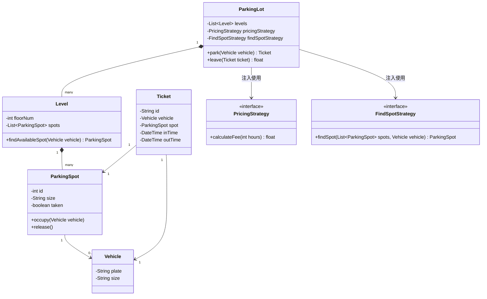
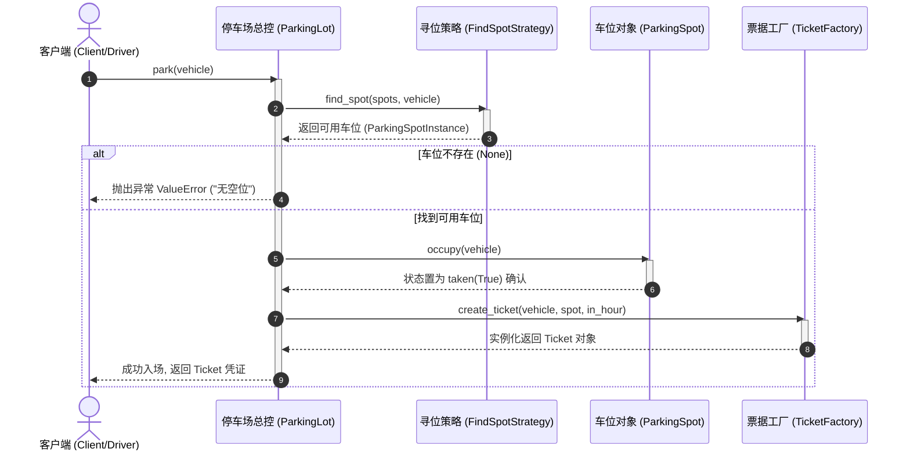
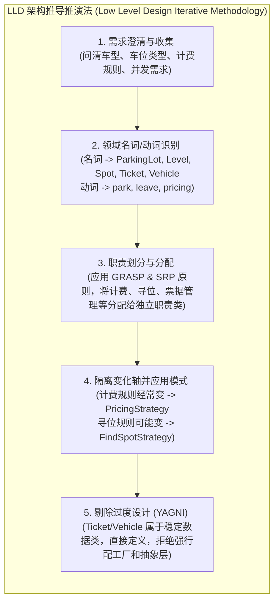

import GlossaryTerm from '@site/src/components/GlossaryTerm';
import GuidedExercise from '@site/src/components/GuidedExercise';
import ResearchNote from '@site/src/components/ResearchNote';
import ChapterMeta from '@site/src/components/ChapterMeta';
import PyRunner from '@site/src/components/PyRunner';
import TradeoffExplorer from '@site/src/components/TradeoffExplorer';
import QuizCard from '@site/src/components/QuizCard';

# M4L10 · LLD 实战：停车场

<ChapterMeta
  time="约 2.5 小时"
  prereqs={[{label: 'M2L9 LLD 方法', href: '../system-design-bridge/lld-classes'}, {label: 'M4L5 策略', href: './strategy-pattern'}, {label: 'M4L6 工厂', href: './factory-pattern'}]}
  outcome="能从一句模糊需求出发，做出一个干净的停车场 LLD：识别实体与职责、用合适的原则/模式落地，并写出可跑代码。"
  howToUse="跟着“需求→实体→职责→选模式→编码”的流程走一遍，再做 lab 补全计费策略。"
/>

:::tip <GlossaryTerm term="LLD" definition="详细设计/低级设计 (LLD/Low Level Design)：面向对象设计与类层面的具体实现方案。重点包括面向对象分析与设计 (OOAD)、类职责划分、设计模式应用及代码级模块关联拓扑。">LLD (低级设计)</GlossaryTerm> 面试考的不是“你会几个模式”，是“你怎么从需求推导出干净的设计”
“设计一个停车场”是经典面试题。面试官想看的是：你能不能问清需求、找出核心实体和职责、在该用模式的地方用对模式、不该用的地方保持简单。这一课把本月所学全部串起来实战。
:::

## 一、从一句话需求开始

需求就一句：“设计一个停车场系统。” 别急着写代码——先像 [M2L1 设计方法论](../system-design-bridge/design-methodology) 那样**问清楚**：

- 有几种车位（小/中/大、残障、充电）？车分几类（摩托/轿车/巴士）？
- 怎么计费（按时？分段？会员？节假日）？怎么找空位（最近？任意？同层）？
- 容量多大？要并发吗（多入口同时进车）？

这些问题的答案，直接决定哪些地方“会变”、需要用模式留扩展点（[M4L1](./change-driven-design)）。

## 二、三步把需求变成设计



### 基础：识别实体与职责（名词找类、动词找方法）

从需求里抓名词当候选类、动词当候选行为（[回扣 M2L9](../system-design-bridge/lld-classes)）：

- **实体**：`ParkingLot`（总控）、`Level`（楼层）、`ParkingSpot`（车位，有大小）、`Vehicle`（车，有类型）、`Ticket`（票，记录进出时间）。
- **职责**（按 [SRP](./solid-srp-ocp) 分）：找空位是一个职责、计费是另一个职责、发票/管车位各一个——别全堆进 `ParkingLot` 这个[上帝类](./solid-srp-ocp)。

### 进阶：在“会变的地方”用模式

- **车位分配怎么选**会变（最近优先？同层优先？）→ <GlossaryTerm term="Strategy Pattern" definition="策略模式：把可替换的算法封装成对象，运行时可换。这里用来封装“如何选空位”的不同策略。">策略模式</GlossaryTerm>封装“找空位策略”。


- **计费规则**会变（按时/分段/会员/节假日）→ 策略模式封装“计费策略”。
- **建票/建车**的创建逻辑 → <GlossaryTerm term="Factory Pattern" definition="工厂模式：集中封装对象的创建逻辑，使用方面向接口拿对象，不依赖具体类。这里用来按车型创建车辆/票据。">工厂</GlossaryTerm>。
- **车位状态**（空/占用/预留）→ 简单的[状态](./state-machine-elevator)管理。

### 深入（选学）：别过度设计

经典陷阱：把每个名词都做成接口 + 工厂 + 抽象基类，搞出几十个类（违反 <GlossaryTerm term="YAGNI" definition="YAGNI (You Aren't Gonna Need It)：‘你不会需要它’。极力提倡拒绝在当下为未来设想的‘潜在改变’做过度抽象设计，只为已知的变化轴保留多态扩展点。">YAGNI (拒绝过度设计)</GlossaryTerm> 原则）。**架构师的判断**：只在真正会变的轴（计费、找位策略）上用模式，`Ticket`、`Vehicle` 这种稳定数据结构保持朴素即可。**好的 LLD = 恰当的简单 + 关键处的可扩展。**



<ResearchNote
  title="LLD：从领域名词到对象职责"
  source="Booch / Larman, Applying UML and Patterns（GRASP 职责分配）；Martin, Clean Code"
  href="https://en.wikipedia.org/wiki/GRASP_(object-oriented_design)"
  insight="面向对象设计的核心是“职责分配”（<GlossaryTerm term='GRASP' definition='GRASP (General Responsibility Assignment Software Patterns)：通用职责分配软件模式。一组分配类职责（如信息专家、创造者、低耦合、高内聚、多态）的指导性设计准则。'>GRASP</GlossaryTerm>）：谁该拥有哪个数据、谁该负责哪个行为。停车场题考的正是这个——把找位、计费、发票、车位管理等职责，合理地分到内聚的类上，而不是堆进一个大类。"
  application="做任何 LLD：先抓名词/动词得到候选类与职责 → 按 SRP 分配职责、按高内聚低耦合调整 → 在会变的轴上用策略/工厂等模式 → 其余保持简单。这套流程对停车场、电梯、图书馆、电商购物车都通用。"
/>

## 三、跟我做一遍：停车场骨架 + 可替换计费

<PyRunner
  rows={30}
  expect="停车计费完成"
  code={`# 计费策略（会变 → 策略模式）：签名统一 fee(hours) -> float
def flat_rate(hours): return hours * 10                 # 每小时 10
def tiered_rate(hours):                                  # 首小时 15，之后每小时 8
    return 15 + max(0, hours - 1) * 8

class ParkingSpot:
    def __init__(self, spot_id, size):
        self.id = spot_id; self.size = size; self.taken = False

class Ticket:
    def __init__(self, plate, spot, in_hour):
        self.plate = plate; self.spot = spot; self.in_hour = in_hour

class ParkingLot:
    def __init__(self, spots, pricing):
        self.spots = spots
        self.pricing = pricing          # 注入计费策略（DIP + 策略）
    def find_spot(self, size):          # 找位职责（可换成策略）
        for s in self.spots:
            if not s.taken and s.size == size:
                return s
        return None
    def park(self, plate, size, in_hour):
        spot = self.find_spot(size)
        if spot is None: raise ValueError("无空位")
        spot.taken = True
        return Ticket(plate, spot, in_hour)
    def leave(self, ticket, out_hour):
        ticket.spot.taken = False        # 释放车位
        return self.pricing(out_hour - ticket.in_hour)   # 委托计费策略

lot = ParkingLot([ParkingSpot(1, "S"), ParkingSpot(2, "M")], flat_rate)
t = lot.park("京A123", "M", in_hour=9)
print("入场, 车位:", t.spot.id)
print("停 3 小时费用(flat):", lot.leave(t, out_hour=12))

# 换计费策略：停车场逻辑一行不改（开闭）
lot.pricing = tiered_rate
t2 = lot.park("京B456", "S", in_hour=9)
print("停 3 小时费用(tiered):", lot.leave(t2, out_hour=12))
print("停车计费完成")`}
/>

`ParkingLot` 把计费**委托**给注入的策略，换计费规则、找位规则都不动核心逻辑。**试试**：加一个 `member_rate`（打 8 折）策略注入进去；再把 `find_spot` 也改成可注入的策略，体会“会变的轴都留了扩展点”。

## 四、动手 Lab（必做）

打开 `labs/month04/m4l10_parking/`：

```bash
python labs/month04/m4l10_parking/test_parking.py
```

补全停车场：找空位、停车/离场、可替换计费策略，且无空位/非法操作要正确处理。

<GuidedExercise
  title="练习指引：实现停车场 LLD"
  goal="把需求落成内聚的类 + 在会变处用策略，做出可跑、可扩展的停车场。"
  hints={[
    '按职责分类：车位管理、找位、计费分开（SRP）。',
    '计费用策略注入（fee(hours)），换规则不改 ParkingLot。',
    'park 找不到空位要明确报错；leave 要释放车位。',
    '保持简单：Ticket/Spot 是朴素数据类，别过度抽象（YAGNI）。'
  ]}
  steps={[
    '实现 ParkingSpot（id/size/taken）、Ticket（plate/spot/in_hour）。',
    '实现 ParkingLot(spots, pricing)：find_spot、park、leave。',
    'park：找位→占用→发票；无位 raise。leave：释放→按策略计费。',
    '写测试：成功停车计费、无空位报错、换计费策略结果不同、离场后车位可再用。'
  ]}
  checks={[
    '你的类职责清晰（找位/计费/车位管理分开）。',
    '你在会变的轴（计费/找位）用了策略、其余保持简单。',
    '你的非法操作（无空位）被正确处理。',
    '你能向面试官讲清这个设计的取舍。'
  ]}
/>

## 架构师深潜（Staff+ 视角）

### 1. LLD 的“恰当抽象”光谱

<TradeoffExplorer
  title="停车场设计的抽象程度"
  dimensions={['可扩展', '可读/简单', '过度设计风险', '面试表现', '维护成本']}
  options={[
    {
      name: '一个大 ParkingLot 类',
      scores: [1, 4, 5, 1, 1],
      note: '所有逻辑堆一起。简单但是上帝类，计费/找位一变就动全身。',
      whenToUse: '玩具demo；面试会被追问到崩。'
    },
    {
      name: '按职责拆 + 关键处用策略（推荐）',
      scores: [4, 4, 3, 5, 4],
      note: '车位/找位/计费分开，会变的轴用策略。清晰、可扩展、好讲。',
      whenToUse: '面试与真实系统的标准答案。'
    },
    {
      name: '处处接口+工厂+抽象',
      scores: [5, 1, 1, 2, 2],
      note: '极致灵活但类爆炸、难读。为不会变的东西也抽象，过度设计。',
      whenToUse: '几乎从不——典型的用力过猛。'
    }
  ]}
/>

### 2. 把 LLD 流程内化成肌肉记忆

停车场、电梯、图书馆、电商购物车、订票系统——所有 LLD 题都是同一套流程：**问清需求 → 名词找类/动词找职责 → SRP 分配 → 会变处用模式 → 其余保持简单 → 讲清取舍**。这套流程比记住任何单个题的“标准答案”都值钱，因为它能迁移到任何新题和真实设计。

### 3. 真实案例：业务系统就是放大的 LLD

电商的订单/库存/优惠、出行的订单/派单/计价，本质都是“实体 + 职责 + 会变的策略”的放大版。停车场练的“找位策略、计费策略、状态管理”，正是这些系统里“派单策略、定价策略、订单状态机”的微缩模型。LLD 功底直接决定你能否把大系统的每个服务设计干净。

### 4. 架构师深问（给自己 30 分钟）

- 把停车场扩展到“多入口并发进车”，`find_spot` + 占位会有竞态吗？怎么用锁/原子操作（[回扣 L8 并发](../foundations/concurrency-basics)）保证不超卖车位？
- 计费要支持“会员 + 节假日 + 分段”的组合，单一策略不够——怎么用[装饰器](./adapter-decorator)叠加计费规则？
- 如果车位状态要持久化、支持崩溃恢复，你会怎么把它和[状态机](./state-machine-elevator)、存储结合？

## 自检清单

- [ ] 我能从模糊需求问出关键约束。
- [ ] 我能用名词/动词推出内聚的类与职责。
- [ ] 我在会变的轴用了策略/工厂，其余保持简单。
- [ ] 我的 lab 停车场可跑、计费可换、非法操作被处理。

## 常见误解

- **"低级设计（LLD）的精髓在于使用尽可能多的设计模式，设计出的类图越复杂、套用的模式越花哨就说明水平越高"**: 典型的过度设计泥潭。LLD 考察的根本不是设计模式的堆砌数量，而是**合理的职责分配（GRASP/SRP）**和**恰当的复杂度控制**。如果给本来逻辑固定的实体（如 Ticket 凭证）强行制造泛型工厂和虚基类，除了增加成倍的样板代码、降低运行性能外毫无益处。优秀的架构师应当遵循 **YAGNI** 原则，只在真正的“变化轴”（如不同的计费计算、寻车位分配算法）上预留策略多态，其余结构一律保持最简明了。
- **"停车场是一个经典的简单题，面试时直接闭着眼睛开始敲代码写类实现就行了"**: LLD 面试的第一大杀手。面试官给出一句模糊的“设计停车场”，真正考察的是你**澄清系统边界与搜集需求**的架构分析能力。如果你不先问清楚“有几种车位与车型”、“寻位是就近还是任意分配”、“计费策略需不需要支持会员或节假日折扣”，写出来的代码即便再漂亮也极大概率偏离了核心变化点。先澄清需求，划分出稳定部分与易变轴，再开始写类设计，才是合格的工程流程。
- **"把所有业务逻辑（寻找空位、更新车位状态、票据生成、计费规则、日志记录）全部塞进一个 ParkingLot 大类里是最方便的，反正它叫总控类"**: 上帝类（God Class）的温床。这严重违背了 **单一职责原则 (SRP)**。当你的计费规则发生变化、或者寻位策略（从 First-Fit 升级到最邻近优先）需要调整时，你不得不频繁去修改 ParkingLot 这个核心类，从而导致其他稳定业务（如停车/离场流程）遭遇破坏。应当将计算费用委托给独立的 PricingStrategy，寻位委托给 FindSpotStrategy，让 ParkingLot 仅扮演业务流的“协调者（Coordinator）”，实现高内聚低耦合。

## 常见误解自测

<QuizCard
  questions={[
    {
      q: '在进行低级设计（LLD/详细设计）时，我们应该如何依据 GRASP 原则对‘计算停车费用’这一行为分配职责？',
      options: [
        '直接写在 `Vehicle`（车辆）类里，因为车辆知道自己开进去了多久。',
        '直接写在 `Ticket`（票据）类里，因为票据记录了进场和出场的时间。',
        '应该将‘计费算法’抽离成独立的策略类接口（PricingStrategy），并由 ParkingLot 或 BillingSystem 持有。因为计费规则属于强变化轴（如按小时、 tiered 阶段费率、会员折扣、节假日），抽离可使核心业务实体免受业务规则变化频繁改动的骚扰，符合 SRP 和开闭原则。'
      ],
      answer: 2,
      explain: '职责分配（GRASP/SRP）与扩展性的权衡。虽然票据拥有时间数据（信息专家），但计费规则变动非常剧烈，若直接耦合在 Ticket 内，会导致其不断被修改。将变化轴封装为独立的 PricingStrategy 是标准的 LLD 做法。'
    },
    {
      q: '在 LLD 面试中，过度设计（Over-engineering）最常表现为哪种现象？我们该如何应用 YAGNI 原则进行权衡？',
      options: [
        '表现为没有写任何单元测试，直接把逻辑塞在 main 函数里。',
        '表现为把每一个业务名词（如 Ticket, Vehicle）都强行套上 Interface、Abstract Class 并配置专属工厂类，创造了大量冗余类。应该只在真正的‘变化轴’（如计费、找车位策略）上预留策略多态，对数据稳定的类（如 Ticket 数据载体）保持最简结构，不为未来可能并不存在的变化写抽象。',
        '表现为把整个系统的代码都写在同一个文件里。'
      ],
      answer: 1,
      explain: '拒绝过度设计与 YAGNI。在 LLD 中，如果对没有任何变化预期的对象（如普通的票据属性）进行了层层抽象隔离，不仅增加了阅读和排错成本，也制造了不必要的样板代码。只有能被预见到的、驱动业务变化的轴，才值得引入设计模式。'
    },
    {
      q: '在实现一个多入口、多通道的高并发停车场系统时，针对车位分配策略（find_spot）在高并发多线程请求下可能发生的‘重票/车位抢占’冲突，应该如何在 LLD 层面进行并发控制？',
      options: [
        '完全依赖前端 UI 界面控制，禁止并发点击。',
        '在分配车位逻辑（如 find_spot 并执行 spot.occupy()）上使用临界区互斥锁（如线程互斥锁 Mutex 或对车位列表分配块加锁），或者在数据库层面利用 CAS/乐观锁/行锁保护車位 occupancy 标志的并发写安全性，保证‘找位-锁定’是原子的。',
        '由于多入口停车场很大，车位很多，因此不需要任何锁，并发概率可以忽略不计。'
      ],
      answer: 1,
      explain: '高并发环境下的车位竞争控制。多入口并发抢车位是真实系统中的经典问题。‘找空位’到‘锁定车位’如果是非原子的，就会导致两个入口同时把同一车位分给不同的车。引入原子加锁或悲观/乐观并发锁是确保 LLD 健壮性的关键。'
    }
  ]}
/>

## 延伸阅读

- [GRASP 职责分配 (Wikipedia)](https://en.wikipedia.org/wiki/GRASP_(object-oriented_design))
- [M2L9 LLD 方法论](../system-design-bridge/lld-classes)
- [下一课：坏味道与重构](./code-smells-refactoring)
