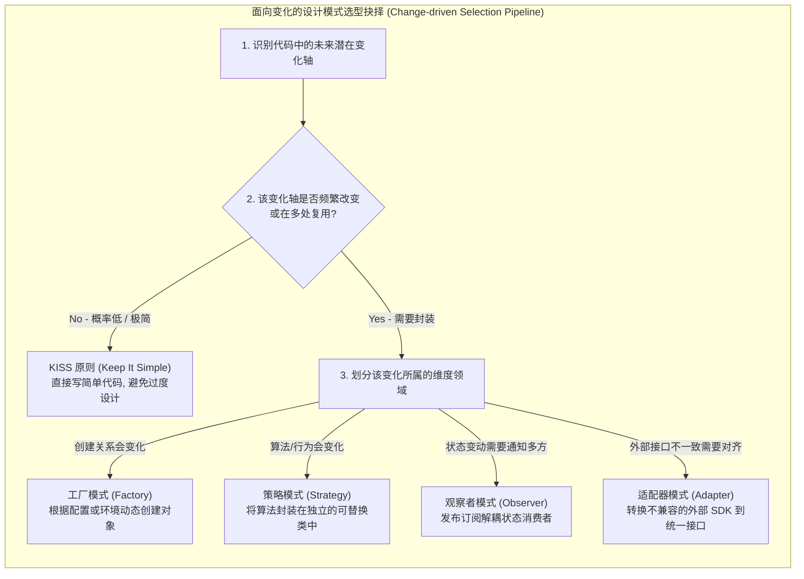
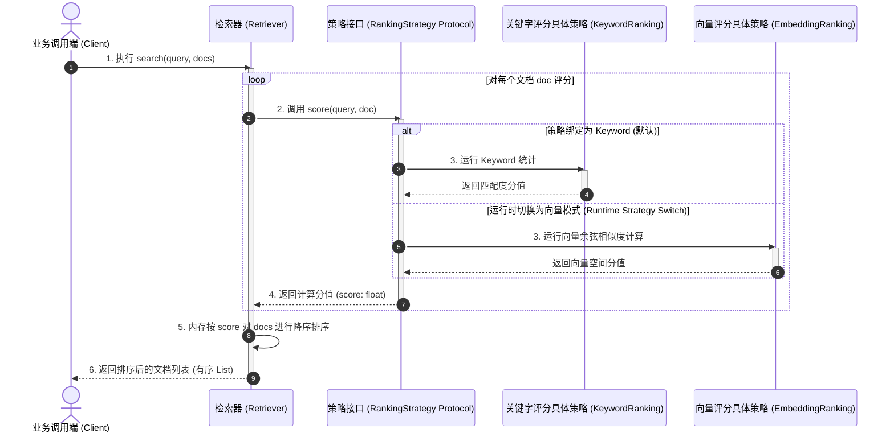
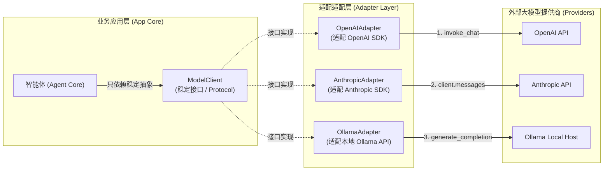

import GlossaryTerm from '@site/src/components/GlossaryTerm';
import GuidedExercise from '@site/src/components/GuidedExercise';
import ResearchNote from '@site/src/components/ResearchNote';
import QuizCard from '@site/src/components/QuizCard';
import TradeoffExplorer from '@site/src/components/TradeoffExplorer';

# Month 4 - 从变化理解设计模式

设计模式不是一组需要背诵的名称，而是一组处理变化的经验。初学者更应该问：“这里未来最可能变化的是什么？”而不是“这里能不能套一个模式？”

<ResearchNote
  title="模式语言的真正价值"
  source="Design Patterns: Elements of Reusable Object-Oriented Software"
  href="https://www.pearson.com/en-us/subject-catalog/p/design-patterns-elements-of-reusable-object-oriented-software/P200000009103"
  insight="经典设计模式的价值不在于固定代码模板，而在于给常见设计问题命名，让工程师能讨论对象创建、组合、状态变化和行为变化。"
  application="在 AI 系统里，模型 provider、向量库、工具协议和评测策略都会变化；模式帮助你把变化隔离在清楚的边界里。"
/>

## 学习目标

- 能用变化点解释设计模式。
- 能把 Factory、Strategy、Observer、Adapter 写成简单代码。
- 能判断什么时候不需要设计模式。



## 变化点视角

| 变化点 | 常见模式 | 例子 |
|---|---|---|
| 创建哪种对象会变化 | <GlossaryTerm term="Factory Pattern" definition="工厂模式：一种创建型设计模式。通过定义公共创建接口，将对象的实例化延迟到子类或工厂函数中进行，使得客户端代码不与具体产品的构造器强耦合，易于扩展新产品类型。">Factory (工厂模式)</GlossaryTerm> | 根据模型供应商创建不同 LLM client |
| 算法策略会变化 | <GlossaryTerm term="Strategy Pattern" definition="策略模式：一种行为型设计模式。定义一系列算法，把它们一个个封装起来，并且使它们可以相互替换。本模式使得算法可独立于使用它的客户端而变化，满足开闭原则。">Strategy (策略模式)</GlossaryTerm> | 缓存淘汰策略、排序策略、检索策略 |
| 状态变化要通知多个对象 | <GlossaryTerm term="Observer Pattern" definition="观察者模式：一种行为型设计模式。定义对象间的一种一对多的依赖关系，当一个对象的状态发生改变时，所有依赖于它的对象都得到通知并被自动更新，实现观察者与被观察者解耦。">Observer (观察者模式)</GlossaryTerm> | 订单状态通知、Agent event tracing |
| 外部接口不一致 | <GlossaryTerm term="Adapter Pattern" definition="适配器模式：一种结构型设计模式。将一个类的接口转换成客户希望的另外一个接口，使得原本由于接口不兼容而不能一起工作的那些类可以一起工作。">Adapter (适配器模式)</GlossaryTerm> | OpenAI、Anthropic、本地模型统一接口 |

<TradeoffExplorer
  title="应对变化的设计策略抉择"
  dimensions={['扩展性', '开发成本', '运行开销', '代码直观性', '解耦程度']}
  options={[
    {
      name: '极简主义 (KISS - 直接硬编码)',
      scores: [1, 5, 5, 5, 1],
      note: '对于绝不改变的小逻辑, 简单硬编码是开发效率最高、运行最快的方式。',
      whenToUse: '原型开发或非常明确后续不会更改的行为逻辑。'
    },
    {
      name: '面向对象多态与模式 (SOLID)',
      scores: [5, 3, 4, 3, 5],
      note: '通过工厂/策略/观察者模式彻底解耦。代码清晰对齐变化，但增加了中间类和心智负担。',
      whenToUse: '行为有多种可选项, 且未来可能会继续追加新选项（符合开闭原则）。'
    },
    {
      name: '全动态编排 / 元编程',
      scores: [4, 1, 3, 1, 4],
      note: '使用动态配置、反射或元编程。极其灵活，可以在不重新编译/发布下调整，但难以调试和维护。',
      whenToUse: '复杂低代码引擎, 或需要由外部配置动态拼装业务行为的超大型平台。'
    }
  ]}
/>

## Strategy 示例

```python
from typing import Protocol

class RankingStrategy(Protocol):
    def score(self, query: str, document: str) -> float:
        ...

class KeywordRanking:
    def score(self, query: str, document: str) -> float:
        query_terms = set(query.lower().split())
        doc_terms = set(document.lower().split())
        return len(query_terms & doc_terms) / max(len(query_terms), 1)

class Retriever:
    def __init__(self, ranking: RankingStrategy):
        self.ranking = ranking

    def search(self, query: str, documents: list[str]) -> list[str]:
        return sorted(documents, key=lambda doc: self.ranking.score(query, doc), reverse=True)
```

这里的变化点是 ranking 方法。未来你可以把 `KeywordRanking` 换成 embedding ranking，而不重写 `Retriever`。



## AI Architect 里的设计模式

AI 系统里设计模式会重新出现：

- Factory：创建不同模型 client。
- Adapter：统一不同模型、向量库、工具协议。



- Observer：记录 Agent 的每一步事件。
- Strategy：切换检索、rerank、prompt、评测策略。
- Circuit Breaker：模型服务或第三方工具不稳定时保护系统。

这里的关键词是 <GlossaryTerm term="Abstraction Boundary" definition="把可替换实现藏在稳定接口后面的边界。边界设计得好，系统可以从本地模型切到云模型，而上层业务不需要重写。">Abstraction Boundary (抽象边界)</GlossaryTerm>。设计边界本质上是实现 <GlossaryTerm term="Separation of Concerns" definition="关注点分离：软件设计核心原则。将程序划分成互不重叠的模块，每个模块只关注单一职责（如模型创建、模型调用、业务调度），从而降低认知负荷，防止局部修改扩散为全局级灾难。">Separation of Concerns (关注点分离)</GlossaryTerm>。没有边界时，你会在业务代码里到处写 `if provider == "openai"` 或 `if vector_db == "qdrant"`；项目小的时候能跑，项目大时就会变成难以替换的依赖网。

## 常见误解

- **"使用模式和间接层越多越显得专业，哪怕是极小项目也应该把 Strategy、Factory 强行套上"**: 这是初学者极易陷入的“过度设计模式病 (Pattern-itis)”。设计模式引入了额外的接口和抽象边界，这些间接层在带来扩展性的同时，也会使代码结构碎片化、增加首屏理解成本。如果某个业务逻辑在未来 12 到 24 个月内完全没有被修改或替换的任何可能，保持 KISS 原则（简单直接）是更好的工程实践。
- **"设计模式只适合 Java / C# 这种强类型、支持严格继承的静态编译面向对象语言，Python/JS 等动态脚本语言不需要模式"**: 完全是井底之蛙之见。大名鼎鼎的设计模式是对“变化轴”的抽象分类，不绑定任何特定语言。在 Python、JavaScript 中，由于鸭子类型 (Duck Typing) 以及函数一等公民的特性，部分模式（如 Strategy、Command）的实现可能会简化为一个函数或 Protocol 协议，但“解耦创建”、“屏蔽外部 API 不一致适配”等面向变化的设计思维依然是 AI 架构设计的核心。
- **"统一底层不同模型 API 的接口，不需要用 Adapter 模式，直接在代码中通过 if-else 简单判断最干净"**: 忽视了扩展性灾难。如果没有稳定统一的抽象边界，业务层代码中的每个节点（例如：Prompt 渲染、Tool 调用、日志监控）都会散落着 `if provider == "openai"` 的分支判断。当底层模型供应商接口发生升级迭代或新增本地千亿模型时，需要逐行重构并测试整个业务系统，极易产生大面积逻辑漏洞。

## 常见误解自测

<QuizCard
  questions={[
    {
      q: '在面向对象与系统设计中，设计模式的本质作用是什么？',
      options: [
        '设计模式是编写更多类和接口的模板，能显著增加代码量。',
        '设计模式的本质是为了‘隔离变化，解耦依赖’。通过引入抽象边界（如接口或协议），将未来易于变化的实现（如算法、对象创建、第三方 API）封装起来，使上层稳定业务逻辑在变化发生时无需修改代码，达到开闭原则（OCP）。',
        '设计模式能够物理加速程序的 CPU 执行效率。'
      ],
      answer: 1,
      explain: '设计模式的本质作用。初学者常犯过度设计（Over-engineering）的错误。模式不是炫技，而是对变化点的封装。只有当系统存在明确的“变化轴”时，模式带来的间接层和复杂度才是划算的。'
    },
    {
      q: '在设计 AI Gateway 时，如果需要统一 OpenAI、Anthropic 以及本地 Llama 模型的接口，最适合采用哪种设计模式？',
      options: [
        '观察者模式 (Observer Pattern)',
        '适配器模式 (Adapter Pattern)，通过定义统一的内部接口（如 ModelClient ），并为每个第三方 SDK 编写各自的适配器类，将它们千差万别的输入参数和返回格式映射为内部统一格式，从而使上层 Agent 业务不感知供应商差异。',
        '单例模式 (Singleton Pattern)'
      ],
      answer: 1,
      explain: '适配器模式在 AI 适配中的应用。第三方大模型供应商的 API 接口极度零碎且经常迭代，使用 Adapter 包装它们是业界主流做法。这样能够轻松做到在切换底层模型时业务零修改。'
    },
    {
      q: '如果我们要为大模型检索系统设计一个动态切换重排（Rerank）算法的逻辑，且该重排算法会在 BM25、Vector Sim、CrossEncoder 之间频繁切换，我们应该选择什么模式？',
      options: [
        '策略模式 (Strategy Pattern)，定义统一的 RerankStrategy 接口，将不同的重排算法封装成不同的策略具体实现类，以便在运行时根据配置动态切换算法而不需要修改 Retriever 主体调用逻辑。',
        '工厂模式 (Factory Pattern) 负责对重排结果进行复制。',
        '装饰器模式 (Decorator Pattern) 用于直接在网络层拦截重排结果。'
      ],
      answer: 0,
      explain: '策略模式。策略模式非常适合处理“算法/行为会发生变化”的场景。它使得算法的变化独立于使用它的客户端，满足关注点分离的设计要求。'
    }
  ]}
/>

## 练习

1. 用 Factory 写一个 `create_model_client(provider)`，支持 `local` 和 `cloud` 两种 provider。
2. 用 Adapter 统一两个假模型接口：一个叫 `complete(prompt)`，另一个叫 `invoke(messages)`。
3. 解释为什么这个例子需要或不需要设计模式。

<GuidedExercise
  title="练习指引：统一两个模型接口"
  goal="通过 Adapter 练习把不一致的外部接口包成稳定的内部接口。"
  hints={[
    '先定义你希望业务代码看到的统一接口，例如 generate(prompt: str) -> str。',
    '假设本地模型只有 complete(prompt)，云端模型只有 invoke(messages)。',
    'Adapter 的职责是转换输入输出，不要把业务逻辑写进去。',
    'Factory 只负责选择创建哪个 Adapter，不负责调用模型。'
  ]}
  steps={[
    '定义一个 ModelClient Protocol，只有 generate(prompt) 方法。',
    '写 LocalModelAdapter，内部调用 local.complete(prompt)。',
    '写 CloudModelAdapter，把 prompt 转成 messages，再调用 cloud.invoke(messages)。',
    '写 create_model_client(provider)，provider 为 local 时返回 LocalModelAdapter。',
    '写一个 summarize(text, model_client) 函数，只调用 generate，不关心 provider。',
    '最后解释：如果未来接入第三个 provider，需要改哪些文件，不需要改哪些文件。'
  ]}
  checks={[
    '业务函数里没有 provider 判断。',
    'Adapter 只做接口转换。',
    'Factory 只做创建选择。',
    '新增 provider 时不需要重写 summarize。'
  ]}
/>

## 延伸阅读

- [senghoo/golang-design-pattern](https://github.com/senghoo/golang-design-pattern)
- [liu-jianhao/Cpp-Design-Patterns](https://github.com/liu-jianhao/Cpp-Design-Patterns)
- [mohuishou/go-design-pattern](https://github.com/mohuishou/go-design-pattern)
