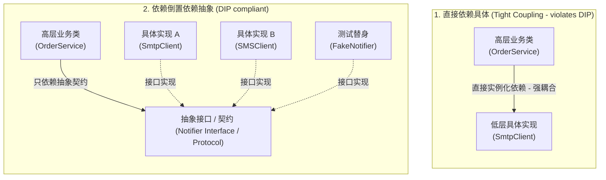
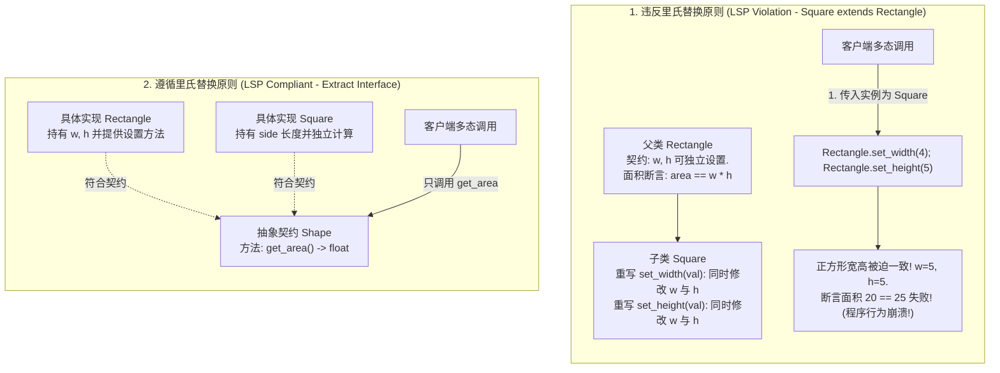
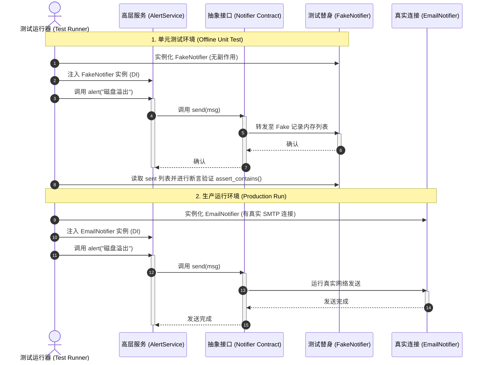

import GlossaryTerm from '@site/src/components/GlossaryTerm';
import GuidedExercise from '@site/src/components/GuidedExercise';
import ResearchNote from '@site/src/components/ResearchNote';
import ChapterMeta from '@site/src/components/ChapterMeta';
import PyRunner from '@site/src/components/PyRunner';
import TradeoffExplorer from '@site/src/components/TradeoffExplorer';
import QuizCard from '@site/src/components/QuizCard';

# M4L3 · SOLID（下）：LSP / ISP / DIP

<ChapterMeta
  time="约 2 小时"
  prereqs={[{label: 'M4L2 SRP/OCP', href: './solid-srp-ocp'}, {label: 'M2L9 面向接口', href: '../system-design-bridge/lld-classes'}]}
  outcome="能用里氏替换判断继承是否合理、用接口隔离避免臃肿接口、用依赖倒置让高层可测可替换。"
  howToUse="先看三个违反原则的反例，再用依赖倒置做 lab，体会“依赖抽象”的威力。"
/>

:::tip 后三条 SOLID，核心是"依赖关系"
SRP/OCP 管"怎么拆"；LSP/ISP/DIP 管"拆开后怎么连"——子类型要能安全替换（LSP）、接口要小而专（ISP）、高层要依赖抽象而非具体（DIP）。最值钱的是 DIP，它让你的代码可测、可换。
:::

## 一、三个常见的"连接"错误

- **LSP 违反**：你让 `Square` 继承 `Rectangle`，结果"设置宽度"在正方形上行为诡异，调用方拿到 Rectangle 却不能当 Rectangle 用。
- **ISP 违反**：一个 `Machine` 接口塞了 print/scan/fax，逼着只会打印的简单打印机也实现 scan/fax（抛异常）。
- **DIP 违反**：你的 `OrderService` 里直接 `email = SmtpClient()`——写死了具体实现，没法测试（真发邮件）、没法换（换短信要改它）。



## 二、三个核心概念（分层）

### 基础：里氏替换原则（LSP）

<GlossaryTerm term="Liskov Substitution Principle" definition="里氏替换原则（LSP）：子类型必须能替换其父类型而不破坏程序的正确性。如果用子类替换父类后行为变怪，说明这个继承关系是错的。">LSP</GlossaryTerm>：**子类必须能无差别地替换父类**。正方形-长方形是经典反例：数学上正方形是长方形，但代码里让它继承会破坏"宽高可独立设置"的契约。LSP 告诉你：**"is-a"在现实成立，不代表在代码契约上成立**。



### 进阶：接口隔离（ISP）与依赖倒置（DIP）

- <GlossaryTerm term="Interface Segregation Principle" definition="接口隔离原则（ISP）：不要把一大堆方法塞进一个接口，逼实现者实现用不到的方法。宁可多个小而专的接口。">ISP</GlossaryTerm>：**接口要小而专**，别逼实现者实现用不到的方法（回扣 [L2 契约要小](../foundations/modules-and-contracts)）。
- <GlossaryTerm term="Dependency Inversion Principle" definition="依赖倒置原则（DIP）：高层模块不应依赖低层模块的具体实现，二者都应依赖抽象（接口）。具体实现通过注入提供。">DIP</GlossaryTerm>：**依赖抽象，不依赖具体**。高层不要直接 `new` 低层，而是依赖一个接口、由外部把具体实现**注入**进来，即运用 <GlossaryTerm term="Dependency Injection" definition="依赖注入 (DI)：一种将依赖项的创建与使用分离开来的设计模式。具体的服务实现（如 SmtpClient）在运行时被传递给依赖它们的对象（如 OrderService），而不是在对象内部直接实例化它。">依赖注入 (Dependency Injection)</GlossaryTerm>。

### 深入（选学）：DIP 是可测试性的根

DIP 最实际的价值是**可测试**和**可替换**：`OrderService` 依赖一个 `Notifier` 接口，测试时注入一个假的 <GlossaryTerm term="Test Double" definition="测试替身：在单元测试中，用于替换真实外部依赖（如数据库、第三方 API、网络服务）的轻量级对象。包括 Fake, Mock, Stub 等。能有效实现测试运行的幂等性与隔离性。">测试替身 (Test Double)</GlossaryTerm>（不真发邮件，[L13 测试替身](../foundations/testing-and-tdd)），生产注入真的。换渠道（邮件→短信）也只是注入不同实现，`OrderService` 一行不改（[OCP](./solid-srp-ocp)）。**DIP + 接口，是 [L2 信息隐藏](../foundations/modules-and-contracts)、[M2L9 面向接口](../system-design-bridge/lld-classes)、[M3 可替换存储](../data-cache-queue/cache-patterns) 背后的同一根支柱。**



<ResearchNote
  title="子类型该满足什么，才算“是一种”"
  source="Barbara Liskov & Jeannette Wing (1994), A Behavioral Notion of Subtyping；Liskov (1987), Data Abstraction and Hierarchy"
  href="https://dl.acm.org/doi/10.1145/197320.197383"
  insight="Liskov 给出了子类型的 <GlossaryTerm term='Behavioral Subtyping' definition='行为子类型：面向对象设计中判断继承是否合理的严格理论。要求子类对象除了满足静态的类型签名对齐外，必须在运行时行为上完全遵循父类所声称的契约断言，不可有越轨或收窄的越界行为。'>行为子类型 (Behavioral Subtyping)</GlossaryTerm> 定义：子类型对象必须满足父类型的所有可观察行为契约（前置条件不能更强、后置条件不能更弱）。这把“is-a”从直觉变成了可检验的行为契约。"
  application="继承前先问：子类真的能在所有用到父类的地方安全替换吗？若不能（如正方形/长方形），就别用继承——改用组合（下一课）。LSP 是判断“继承是否合法”的标尺。"
/>

## 三、跟我做一遍：依赖倒置

<PyRunner
  rows={20}
  expect="同一服务，注入不同实现"
  code={`# 高层服务依赖"抽象"（这里用鸭子类型：任何有 send 的对象）
class AlertService:
    def __init__(self, notifier):     # 注入依赖（DIP）
        self.notifier = notifier
    def alert(self, msg):
        self.notifier.send("[ALERT] " + msg)

# 低层实现们：都满足"有 send(msg)"这个契约
class EmailNotifier:
    def __init__(self): self.sent = []
    def send(self, msg): self.sent.append(("email", msg))

class SMSNotifier:
    def __init__(self): self.sent = []
    def send(self, msg): self.sent.append(("sms", msg))

# 同一个 AlertService，注入不同实现 —— 它自己一行不用改
email = EmailNotifier()
AlertService(email).alert("磁盘满了")
print("邮件:", email.sent)

sms = SMSNotifier()
AlertService(sms).alert("磁盘满了")
print("短信:", sms.sent)
print("同一服务，注入不同实现")`}
/>

`AlertService` 不知道也不关心是邮件还是短信——它只依赖"有 `send`"这个抽象。换渠道、测试时注入假的，它都不用改。**试试**：写一个 `FakeNotifier` 只记录不发送，注入它来"测试" AlertService——这就是 DIP 带来的可测试性。

## 四、动手 Lab（必做）

打开 `labs/month04/m4l3_dip/`：

```bash
python labs/month04/m4l3_dip/test_dip.py
```

实现一个依赖抽象的服务，能注入不同的通知实现（含一个测试用的假实现）。

<GuidedExercise
  title="练习指引：用依赖倒置解耦"
  goal="把“高层依赖抽象、具体实现注入”做成代码——这是可测试、可替换架构的根。"
  hints={[
    'AlertService 构造时接收一个 notifier，自己不创建具体实现。',
    'notifier 只需满足"有 send(msg)"——这就是抽象契约（ISP：接口要小）。',
    '写多个实现（Email/SMS/Fake），都能注入同一个 AlertService。',
    '测试时用 Fake 实现，不触发真实副作用（L13 测试替身）。'
  ]}
  steps={[
    '实现 AlertService(notifier)，alert(msg) 调用 notifier.send("[ALERT] " + msg)。',
    '实现 EmailNotifier 和 SMSNotifier（各自记录 sent）。',
    '实现 FakeNotifier 供测试用。',
    '写测试：注入不同实现都能工作；AlertService 不依赖任何具体类。'
  ]}
  checks={[
    '你能判断一个继承是否违反 LSP。',
    '你能解释 ISP 为什么要小接口。',
    '你的 AlertService 依赖抽象、可注入、可测试。',
    '你能说出 DIP 怎么带来可测试性和可替换性。'
  ]}
/>

## 架构师深潜（Staff+ 视角）

### 1. 继承 vs 接口/组合

<TradeoffExplorer
  title="复用与多态怎么实现"
  dimensions={['复用强度', 'LSP 安全', '灵活性', '耦合度(越低越好)', '可测试性']}
  options={[
    {
      name: '实现继承（extends 具体父类）',
      scores: [4, 2, 2, 1, 2],
      note: '能复用父类代码，但易违反 LSP、强耦合父类实现、难测。',
      whenToUse: '真正的"is-a"且行为完全兼容时——比想象的少。'
    },
    {
      name: '接口 + 依赖注入（DIP）',
      scores: [3, 5, 5, 5, 5],
      note: '依赖抽象、实现可换可测、松耦合。需要多写接口。',
      whenToUse: '需要多实现、可测试、可替换时——绝大多数场景。'
    }
  ]}
/>

### 2. DIP 是整门课的支柱

回看这条主线：[L2 契约/信息隐藏](../foundations/modules-and-contracts) → [M2L9 面向接口](../system-design-bridge/lld-classes) → [M3 可替换存储/缓存](../data-cache-queue/cache-patterns) → DIP。**它们是同一件事：让高层依赖稳定的抽象，把易变的具体实现挡在接口后、用注入提供。** 这是可测试、可演进系统的共同地基。

### 3. 架构师深问（给自己 30 分钟）

- 你代码里有没有"高层直接 new 低层"（如 service 里 new 数据库客户端）？怎么用 DIP 改造让它可测？
- 正方形/长方形之外，再举一个"现实是 is-a 但代码不该继承"的例子。
- 一个 10 个方法的大接口，怎么按使用者拆成几个小接口（ISP）？

## 自检清单

- [ ] 我能用 LSP 判断继承是否合理。
- [ ] 我能把臃肿接口按 ISP 拆小。
- [ ] 我的 lab 服务依赖抽象、可注入、可测试（DIP）。
- [ ] 我能说出 DIP 怎么贯穿 L2/M2L9/M3。

## 常见误解

- **"既然数学里正方形属于长方形，那么在代码里继承它就理所当然，至于契约被破坏用 if-else 判断类型修复就行"**: 这是继承复用中极其普遍且危险的毒瘤思维。在面向对象设计中，继承的前提必须满足行为子类型 (Behavioral Subtyping) 约束，即子类在任何时候都能安全地无缝替换父类。如果用 `if isinstance(rect, Square)` 这样的运行时判断来修补继承漏洞，不仅直接推翻了多态的价值，还引入了严重的代码耦合，甚至违反了开闭原则。
- **"接口隔离原则 (ISP) 要求接口越小越好，那我应该把所有方法都拆成只含有 1 个方法的超微接口"**: 属于过度拆分接口的极端偏执。接口的设计粒度应当以“服务消费者（Client）”的最小使用边界为基准。如果一个客户端确实需要同时执行 Print 和 Scan，且这二者在业务上高度内聚不可分割，将它们合并在一个接口中是完全合理且好维护的。盲目拆成单个方法接口，会导致接口数量暴增，使类型依赖关系变得极其混乱和繁杂。
- **"依赖倒置原则 (DIP) 只是为了炫技增加代码复杂度，多写一个接口并没有带来任何可见的业务收益"**: 极其短浅的实战目光。在现代软件工程中，DIP 带来两个无价的回报：一是“完全可替换性”，例如在不碰核心业务代码前提下直接将数据层从 MySQL 切换到 MongoDB；二是“极强的本地单元测试能力”，高层能够彻底剥离对网络、磁盘或数据库的直接物理连接，使用轻量测试替身（Mock/Fake）实现毫秒级的测试回归。

## 常见误解自测

<QuizCard
  questions={[
    {
      q: '以下哪一项说明了里氏替换原则 (LSP) 的工程核心目标？',
      options: [
        '正方形数学上是长方形，所以在代码中正方形类必须继承自长方形类。',
        '子类型（子类）必须能够无差别、安全地替换其父类型，且不能破坏程序原有的正确性与契约（前置条件不能强于父类，后置条件不能弱于父类）。如果替换后原有的基类断言发生怪异失败，说明继承关系不成立。',
        '子类必须完全重写父类的所有 private 方法。'
      ],
      answer: 1,
      explain: '里氏替换原则的定义。LSP 是面向对象中继承合理性的唯一判尺。它打破了直觉上的“分类学继承”（is-a），代之以“行为契约继承”，这能有效防范由于子类行为越轨在多态调用中引入隐蔽 bug。'
    },
    {
      q: '依赖倒置原则 (DIP) 提倡‘高层不应依赖低层，二者都应依赖抽象’。在进行单元测试时，DIP 为什么能带来绝佳的可测试性？',
      options: [
        '因为它能将所有测试用例的运行时间缩短为零。',
        '高层业务逻辑只与稳定的抽象接口（如 Notifier）交互。在测试时，我们可以注入一个轻量级、无网络副作用的测试替身（FakeNotifier），从而使高层单元测试摆脱对真实 SMTP 服务、数据库等外部硬件依赖的强耦合，实现快速且幂等的离线测试。',
        '因为它不需要编写任何 Mock 类即可直接拦截真实网络发送。'
      ],
      answer: 1,
      explain: 'DIP 与单元测试。没有 DIP 意味着硬编码 new，测试时必须真的去调用真实数据库或发短信，使得自动化测试极慢且不可控。引入依赖注入是单元测试能够流畅展开的前提底座。'
    },
    {
      q: '接口隔离原则 (ISP) 主张‘接口要小而专’。如果将 Print、Scan、Fax 三个截然不同的职责全部打包在一个巨大的 IMachine 接口中，会导致什么后果？',
      options: [
        '导致接口非常轻量易读。',
        '强迫那些只需要 Print 功能的简单打印机子类，也不得不编写空白的 Scan / Fax 占位方法或者强行抛出 NotImplementedException。这导致高层客户端对多余方法产生不必要的物理依赖，一旦 Scan/Fax 接口定义改动，简单打印机也需要被迫重新编译和部署。',
        '程序在执行时由于方法太多而直接产生内存溢出。'
      ],
      answer: 1,
      explain: '接口隔离原则 (ISP)。ISP 是对接口臃肿的批判。它让契约变得最小化。小而专的接口使得消费者和实现者都只背负最轻的依赖，降低了变更的波及面。'
    }
  ]}
/>

## 延伸阅读

- [Liskov & Wing, Behavioral Subtyping](https://dl.acm.org/doi/10.1145/197320.197383)
- [下一课：组合优于继承](./composition-over-inheritance)
