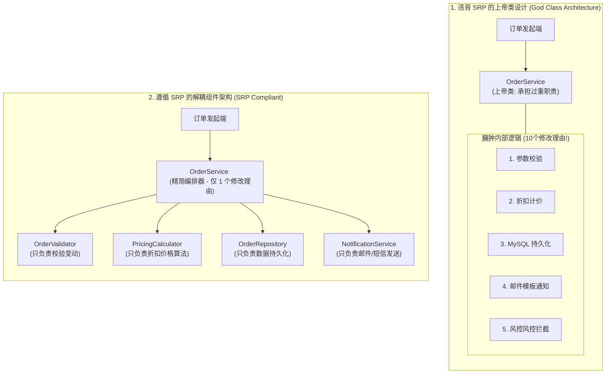
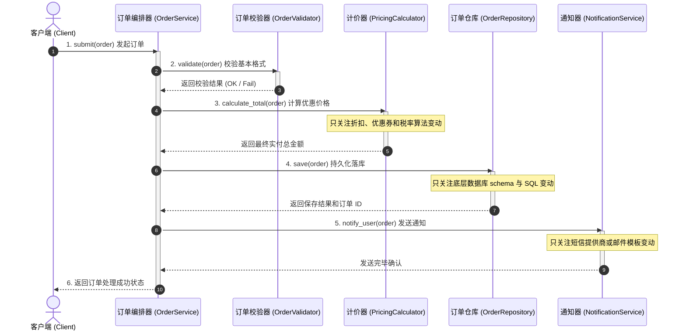
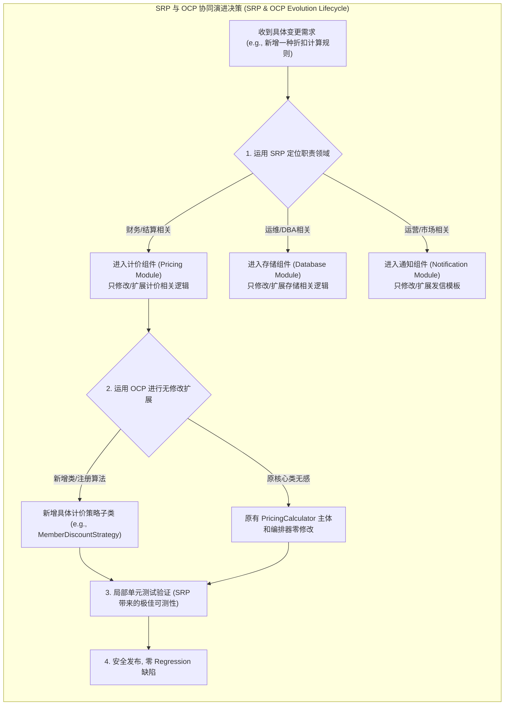

import GlossaryTerm from '@site/src/components/GlossaryTerm';
import GuidedExercise from '@site/src/components/GuidedExercise';
import ResearchNote from '@site/src/components/ResearchNote';
import ChapterMeta from '@site/src/components/ChapterMeta';
import PyRunner from '@site/src/components/PyRunner';
import TradeoffExplorer from '@site/src/components/TradeoffExplorer';
import QuizCard from '@site/src/components/QuizCard';

# M4L2 · SOLID（上）：SRP 与 OCP

<ChapterMeta
  time="约 2 小时"
  prereqs={[{label: 'M4L1 变化驱动设计', href: './change-driven-design'}, {label: 'L2 内聚与耦合', href: '../foundations/modules-and-contracts'}]}
  outcome="能识别“上帝类/上帝函数”，用单一职责拆分它，并用开闭原则让它对扩展开放。"
  howToUse="先看一个“什么都干”的函数为什么难维护，再把它按职责拆开，最后做 lab。"
/>

:::tip SOLID 不是教条，是减少"改动波及"的五条经验
SOLID 五原则的共同目标只有一个：**让需求变化时，要改的代码尽量少、尽量局部。** 这一课讲前两条，也是最重要的两条：单一职责（S）和开闭（O）。
:::

## 一、一个类干了十件事

你的 `OrderService` 里：校验输入、算价格、存数据库、发邮件、写日志、调风控……全挤在一起。结果：改邮件模板要动它、改价格规则要动它、换数据库还要动它——**它有十个"改动的理由"，每次改都可能碰坏别的功能**。这就是<GlossaryTerm term="God Class" definition="上帝类/上帝函数：承担了过多职责的庞大类或函数。任何一个职责变化都要改它，牵一发动全身，是最常见的坏味道。">上帝类</GlossaryTerm>坏味道。



## 二、三个核心概念（分层）

### 基础：单一职责原则（SRP）

<GlossaryTerm term="Single Responsibility Principle" definition="单一职责原则（SRP）：一个模块/类/函数应该只有一个“变化的理由”——即只对一个利益相关者/一类需求负责。">SRP</GlossaryTerm>：一块代码应该**只有一个变化的理由**。把校验、算价、存储、通知拆成各自独立的部分，改邮件就只动通知部分，互不波及。这能实现极高的 <GlossaryTerm term="Cohesion" definition="内聚度：模块内部各元素彼此结合的紧密程度。SRP 拆分使得每个小模块只包含紧密相关的逻辑，达成高内聚。">高内聚 (High Cohesion)</GlossaryTerm> 并降低模块间的 <GlossaryTerm term="Coupling" definition="耦合度：模块与模块之间相互关联 and 依赖的程度。降低耦合可以确保修改一个类时不会波及其他无关的类。">低耦合 (Low Coupling)</GlossaryTerm>（这正是 [L2 高内聚与低耦合](../foundations/modules-and-contracts) 的延续）。



### 进阶：开闭原则（OCP）

[M4L1](./change-driven-design) 学过的 <GlossaryTerm term="Open-Closed Principle" definition="开闭原则：对扩展开放、对修改关闭——加新功能靠新增代码，而非修改已有代码。">开闭</GlossaryTerm> 在类层面同样适用：加一种新折扣、新支付方式，应该是**新增一个类**，而不是改已有的核心类。SRP 让你拆得开，OCP 让你扩得动——两者配合。

### 深入（选学）：SRP 的"变化的理由"要看利益相关者

SRP 常被误解为"一个类只做一件事"。更准确的表述（Robert Martin）：**一个模块应该只对一类利益相关者负责**。算价规则由财务定、邮件模板由市场定、存储由 DBA 定——它们是不同的人、会因不同原因变化，所以该分开。把"会因不同原因、被不同人改动"的东西分开，就是 SRP 的精髓（一路通向 [Conway 定律](../system-design-bridge/lld-classes) 和微服务边界）。



<ResearchNote
  title="SOLID：让面向对象代码经得起变化"
  source="Robert C. Martin, SOLID 原则 / Clean Architecture"
  href="https://blog.cleancoder.com/uncle-bob/2020/10/18/Solid-Relevance.html"
  insight="Robert Martin 把 SRP/OCP/LSP/ISP/DIP 五条原则系统化为 SOLID。它们都服务于一个目标：让软件在需求变化时，改动范围最小、最不易引入回归。其思想根源可追溯到 Parnas 的信息隐藏（L2）。"
  application="SOLID 不是用来“打分”的教条，而是一组“闻坏味道”的嗅觉：一个类有多个改动理由（违反 SRP）、加功能要改核心（违反 OCP），就是重构信号。这能有效降低修改代码时破坏已有稳定逻辑的风险，防止 <GlossaryTerm term='Regression Test' definition='回归测试：重新运行已通过的测试，以确保最近的代码更改没有在现有功能中引入新的缺陷或 Bug。SRP 能将影响面局部化，极大缩短回归测试周期。'>回归测试 (Regression Test)</GlossaryTerm> 发现大面积崩溃。先有痛点，再用原则诊断。"
/>

## 三、跟我做一遍：拆掉上帝函数

<PyRunner
  rows={20}
  expect="各司其职"
  code={`# 上帝函数：算价 + 折扣 + 税 全混在一起，改任何规则都要动它
def total_bad(items, discount, tax):
    s = 0
    for i in items:
        s += i["price"] * i["qty"]
    s = s * (1 - discount)
    s = s * (1 + tax)
    return s

# SRP 版：每个函数只有一个变化的理由
def subtotal(items):
    return sum(i["price"] * i["qty"] for i in items)

def apply_discount(amount, pct):
    return amount * (1 - pct)

def apply_tax(amount, rate):
    return amount * (1 + rate)

def total(items, discount=0.0, tax=0.0):     # 只负责编排
    return apply_tax(apply_discount(subtotal(items), discount), tax)

items = [{"price": 10, "qty": 2}, {"price": 5, "qty": 1}]
print("小计:", subtotal(items))               # 可单独测、单独改
print("总价:", total(items, discount=0.1, tax=0.08))
print("各司其职")`}
/>

拆开后，"折扣规则变了"只动 `apply_discount`、"税率算法变了"只动 `apply_tax`，互不影响，而且每个都能单独测试（[回扣 L13](../foundations/testing-and-tdd)）。**试试**：给 `apply_discount` 加一个"满减"逻辑，看你只需改它一处。

## 四、动手 Lab（必做）

打开 `labs/month04/m4l2_srp/`：

```bash
python labs/month04/m4l2_srp/test_pricing.py
```

把一个混合职责的计价逻辑，拆成单一职责的函数，再编排起来。

<GuidedExercise
  title="练习指引：按职责拆分计价"
  goal="练习 SRP：让每个函数只有一个变化的理由，且能独立测试。"
  hints={[
    '每个函数只做一件事：小计、折扣、税，分开。',
    'total 只负责"编排"这几步，自己不含计算细节。',
    '每个函数都应能单独测试（这是 SRP 的好处之一）。',
    '想想：如果折扣规则变了，你需要改几个函数？（应该只有一个。）'
  ]}
  steps={[
    '实现 subtotal(items)：Σ price×qty。',
    '实现 apply_discount(amount, pct) 和 apply_tax(amount, rate)。',
    '实现 total(items, discount, tax)：编排三步。',
    '写测试：分别测三个单一职责函数 + 测 total 的组合结果。'
  ]}
  checks={[
    '你的每个函数只有一个变化的理由。',
    '你能单独测试每个职责。',
    '你能解释 SRP 和 OCP 怎么配合。',
    '你能识别一段代码是不是"上帝类/函数"。'
  ]}
/>

## 架构师深潜（Staff+ 视角）

### 1. SRP 的粒度：拆多细？

<TradeoffExplorer
  title="职责拆分的粒度"
  dimensions={['单点可维护', '可测试性', '可复用', '过度拆分风险', '可读性']}
  options={[
    {
      name: '上帝类（不拆）',
      scores: [1, 1, 1, 5, 2],
      note: '所有逻辑一坨。改一处动全身、难测、难复用。',
      whenToUse: '几乎从不——除了一次性脚本。'
    },
    {
      name: '按"变化理由"拆（推荐）',
      scores: [5, 5, 4, 4, 4],
      note: '把会因不同原因变化的职责分开。可维护、可测、可复用，粒度合理。',
      whenToUse: '默认做法：识别变化轴，沿轴拆分。'
    },
    {
      name: '拆到极碎（每行一个类）',
      scores: [3, 4, 3, 1, 1],
      note: '过度拆分，类爆炸、跳来跳去读不懂。抽象成本压倒收益。',
      whenToUse: '几乎从不——这是 SRP 用力过猛。'
    }
  ]}
/>

### 2. SRP 从函数一直延伸到服务边界

同一条原则，在不同尺度反复出现：函数（一个函数一件事）→ 类（一个类一个职责）→ 服务（一个微服务一个业务能力，[回扣 M2L9/Conway](../system-design-bridge/lld-classes)）。**"把会因不同原因变化的东西分开"是从代码到架构的统一原则。**

### 3. 真实案例：边界清晰才能小团队驾驭大系统

[WhatsApp 的极简、单一聚焦](../atlas/whatsapp.mdx)（只做消息）本质就是产品级的 SRP；它让架构、团队、复杂度都可控。**职责清晰是"少改、少错、能并行开发"的前提**——这也是 SOLID 的终极目的。

### 4. 架构师深问（给自己 30 分钟）

- 找你代码里一个"上帝类"，列出它有几个"变化的理由"，按理由把它拆开。
- SRP 说"一个变化理由"，但拆得太碎会类爆炸。你怎么找那个"刚好"的粒度？
- 一个 `User` 类既管认证、又管资料、又管计费——该拆成几个？依据是什么（谁会改它）？

## 自检清单

- [ ] 我能识别上帝类/函数。
- [ ] 我能按"变化的理由"把职责拆开。
- [ ] 我的 lab 每个函数单一职责、可独立测试。
- [ ] 我能解释 SRP 和 OCP 如何配合。

## 常见误解

- **"单一职责原则 (SRP) 就是一个类或一个函数只能做一件事"**: 极大的工程误区。SRP 的发明人 Bob 大叔明确澄清，其本质是“一个模块/类应该只有一个变化的理由”，而这个理由来自于特定的“利益相关者”。如果把“做一件事”当成金科玉律，会导致把简单的算价逻辑拆成二三十个极碎的微型类，产生严重的类爆炸，使系统极其支离破碎、阅读困难。
- **"软件架构既然要追求高灵活性，就必须无条件地严格落地 SOLID 原则的所有细节，哪怕是极小项目"**: 忽视了抽象成本。SOLID 原则不是国家法律，它是一组帮助你“嗅探代码坏味道”并“局部化改动波及范围”的经典经验总结。在一个生命周期仅为几个月的一次性脚本或类型极为稳定且确知不会扩展的简单系统里，盲目强套 SOLID 接口策略，属于典型的过度工程，得不偿失。
- **"编写业务代码时，只要把所有方法和逻辑提取到单独的辅助类中，核心类本身就算满足了单一职责，可以直接发布"**: 并没有真正解耦。如果核心编排类依然对各个辅助类的“具体实现”强耦合，当辅助类的方法签名或逻辑发生变化时，核心编排类依然会被连带修改（违反 OCP/SRP）。我们必须通过接口抽象或动态分发机制，切断核心编排器与具体实现的直接耦合，这正是 DIP（依赖倒置）与 SRP 配合的价值。

## 常见误解自测

<QuizCard
  questions={[
    {
      q: '单一职责原则 (SRP) 最准确的释义是以下哪一项？',
      options: [
        '一个函数只能有且仅有 1 行代码。',
        '一个模块/类/函数应该只有一个变化的理由（即只对一类特定需求或一类利益相关者负责）。这有利于将市场、财务、DBA 等不同领域的变更范围完全隔离开来。',
        '所有的业务逻辑都应该塞入同一个全局控制类中，避免分散在不同文件里。'
      ],
      answer: 1,
      explain: 'SRP 的真正释义。Bob 大叔指出，SRP 不是指“只做一件事”，而是指“变化的理由”。比如计算工时和打印报表，如果混在 Employee 类里，因为财务定工时、人事定报表，这就是两个不同的利益相关者，应该拆开。'
    },
    {
      q: '当系统违反了单一职责原则（SRP），形成臃肿的上帝类（God Class）时，会产生什么样的典型危害？',
      options: [
        '系统会自动触发硬件过载报警并阻断服务器运行。',
        '牵一发动全身。任何局部职责（例如仅仅是更改一个发送邮件的模板）都需要修改、测试和部署整个上帝类，导致该类中无关的其他功能（例如数据库保存、算价规则）极易引入未知的回归缺陷（Regression Bug）。',
        '开发效率会极大提升，因为代码高度集中。'
      ],
      answer: 1,
      explain: '上帝类的工程隐患。上帝类是重构的第一大敌，代码行数动辄几千行。多次修改后没人敢动它，每一次改动都会引发噩梦般的回归缺陷。'
    },
    {
      q: '单一职责原则 (SRP) 和开闭原则 (OCP) 在面向对象 LLD 设计中是如何协同工作的？',
      options: [
        'SRP 帮助我们将庞杂的职责‘拆得开、理得清’，确保每一块只有单一职责；OCP 帮助我们在具体的职责上‘扩得动、不改旧’，如使用策略模式将具体折扣算法扩展出去，无需修改计价主流程。',
        'SRP 负责将代码变长，OCP 负责将类完全隐藏起来。',
        '这两者完全是互斥的，在实际业务编码中不可兼得。'
      ],
      answer: 0,
      explain: 'SRP 与 OCP 协同。SRP 是基础，它把大包大揽的怪兽拆成各司其职的小组件；OCP 是目标，它让这些小组件在面对未来类型暴增时可以低成本多态扩容。两者配合是 SOLID 的核心。'
    }
  ]}
/>

## 延伸阅读

- [Robert C. Martin, SOLID Relevance](https://blog.cleancoder.com/uncle-bob/2020/10/18/Solid-Relevance.html)
- [下一课：SOLID（下）LSP/ISP/DIP](./solid-lsp-isp-dip)
