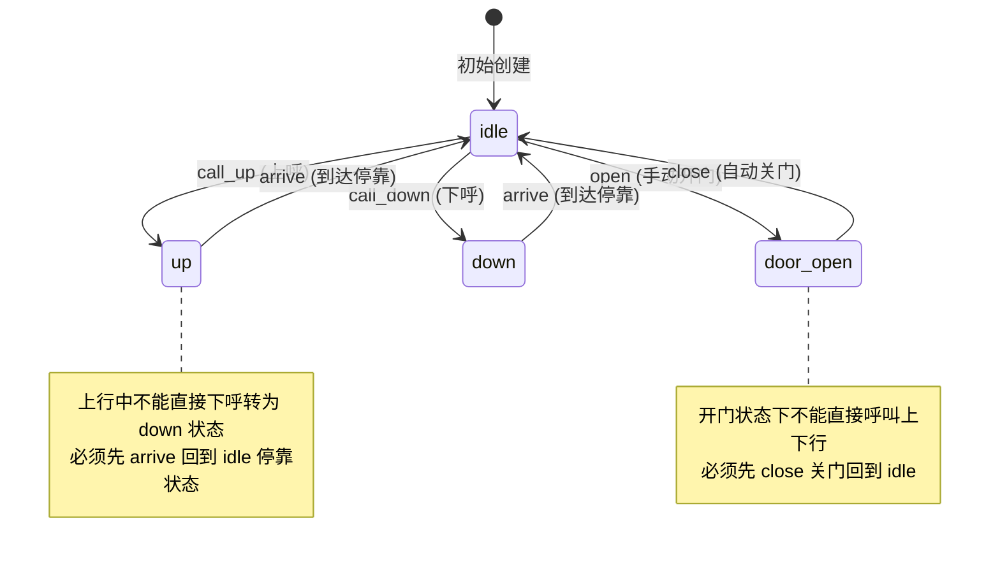
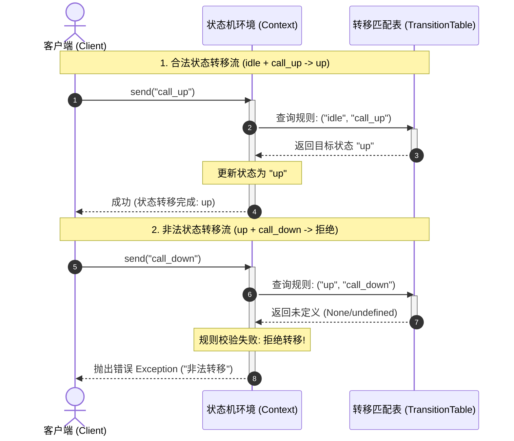
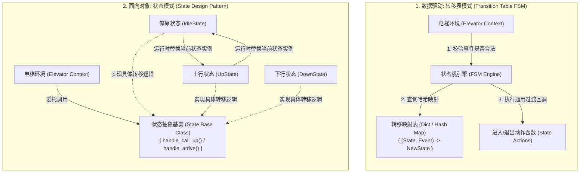

import GlossaryTerm from '@site/src/components/GlossaryTerm';
import GuidedExercise from '@site/src/components/GuidedExercise';
import ResearchNote from '@site/src/components/ResearchNote';
import ChapterMeta from '@site/src/components/ChapterMeta';
import PyRunner from '@site/src/components/PyRunner';
import TradeoffExplorer from '@site/src/components/TradeoffExplorer';
import QuizCard from '@site/src/components/QuizCard';

# M4L9 · 状态机与电梯

<ChapterMeta
  time="约 2.5 小时"
  prereqs={[{label: 'M4L5 策略模式', href: './strategy-pattern'}, {label: 'L6 幂等与状态', href: '../foundations/idempotency'}]}
  outcome="能用有限状态机建模“有状态、有合法转移规则”的对象（电梯/订单/连接），并用 State 模式或转移表实现它。"
  howToUse="先看到处 if 判断状态的乱，再用状态机把转移规则集中，最后做电梯 lab。"
/>

:::tip 凡是“它现在处于某种状态、且只能按规则切换”，都该想到状态机
订单（待付款→已付款→已发货→已完成/已取消）、电梯（停→上行→下行→开门）、TCP 连接、播放器……它们的复杂不在“做什么”，而在“**什么状态下允许做什么、能转到哪个状态**”。状态机就是管这件事的利器。
:::

## 一、满屏的 `if status == ...` 和布尔标志

订单逻辑里你写了 `if status == "paid" and not shipped and not cancelled ...`，状态一多，布尔标志和判断组合爆炸，还经常漏掉“已取消的订单不能发货”这种非法转移，导致脏数据。**根因：你把“状态”和“允许的转移规则”散落在各处 if 里，没有一个集中的地方说清楚“谁能转到谁”。**



## 二、三个核心概念（分层）

### 基础：有限状态机（FSM）

<GlossaryTerm term="Finite State Machine" definition="有限状态机（FSM）：系统在任一时刻处于有限个状态之一，只能通过预先定义的“合法转移”从一个状态切换到另一个。把状态和允许的转移集中描述，非法转移被显式拒绝。">有限状态机</GlossaryTerm>：明确列出所有**状态**和**合法转移**（事件 + 当前状态 → 新状态）。最直接的实现是一张<GlossaryTerm term="Transition Table" definition="转移表：用一张数据结构（如字典）集中描述“(当前状态, 事件) → 新状态”的所有合法转移。查表即转移，非法转移直接拒绝。">转移表</GlossaryTerm> `{(状态, 事件): 新状态}`——进行 <GlossaryTerm term="State Transition" definition="状态转移 (State Transition)：系统从当前拥有的某个特定状态，响应特定触发事件 (Event) 后切换到新目标状态的行为。状态转移由合法性规则严格管辖。">状态转移 (State Transition)</GlossaryTerm> 就是查表，查不到就是非法转移，直接拒绝。



### 进阶：State 模式——把每个状态做成对象

当“每个状态下的行为”很不一样时，用<GlossaryTerm term="State Pattern" definition="状态模式（GoF）：把每个状态做成一个对象，对象自己知道“在本状态下各事件怎么处理、该转到哪个状态”。context 把请求委托给当前状态对象，换状态=换对象，消除大量 if-else。">State 模式</GlossaryTerm>：每个状态是一个对象，**自己知道本状态下各事件怎么响应、该转到哪**。状态机的持有者即 <GlossaryTerm term="Context" definition="上下文环境 (Context)：状态机模式中维护当前状态实例的宿主对象。它负责对外暴露业务接口，并在内部将具体行为委托给当前所处的具体状态对象执行。">Context (上下文环境)</GlossaryTerm> 把请求委托给“当前状态对象”，切换状态 = 换一个对象。这其实就是 [策略模式](./strategy-pattern) 的近亲——只不过策略换的是“算法”，State 换的是“状态”，且状态之间会互相转移。

### 深入（选学）：转移表 vs State 模式怎么选

- **状态多、每状态行为简单**（主要就是“能不能转”）→ **转移表**最省事、最一目了然。
- **每状态行为复杂、差异大**（不同状态对同一事件做完全不同的事）→ **State 模式**更清晰，避免巨型 if。
- 真实系统常**混合**：用表管转移合法性，用对象/函数管每状态的动作。关键是：**把“合法转移”这件事集中到一个可审查的地方**，而不是散落在判断里——这才是状态机的核心价值。



<ResearchNote
  title="把控制流变成可检查的状态与转移"
  source="Gamma et al. (GoF, 1994), Design Patterns — State；自动机理论（有限自动机）"
  href="https://en.wikipedia.org/wiki/Finite-state_machine"
  insight="有限状态机源自自动机理论，是计算机科学最基础的模型之一。GoF 的 State 模式把它落到面向对象：状态对象封装“本状态的行为 + 转移”，让 context 通过替换状态对象改变行为，消除散落的条件分支。"
  application="协议栈（TCP）、工作流引擎、订单/审批流、游戏 AI、UI 流程，都是状态机。用它能把“非法操作”在设计层就堵死（查不到转移=拒绝），极大减少脏状态 bug。"
/>

## 三、跟我做一遍：电梯状态机（转移表）

<PyRunner
  rows={26}
  expect="非法转移被拒绝"
  code={`# 状态：idle(停) / up(上行) / down(下行)；事件：call_up / call_down / arrive
transitions = {
    ("idle", "call_up"):   "up",
    ("idle", "call_down"): "down",
    ("up", "arrive"):      "idle",
    ("down", "arrive"):    "idle",
}

class Elevator:
    def __init__(self):
        self.state = "idle"
    def send(self, event):
        key = (self.state, event)
        if key not in transitions:        # 查不到 = 非法转移，拒绝
            raise ValueError("非法转移: %s 状态下不能 %s" % (self.state, event))
        self.state = transitions[key]
        return self.state

e = Elevator()
print("初始:", e.state)
print("call_up ->", e.send("call_up"))   # idle -> up
print("arrive ->", e.send("arrive"))     # up -> idle

# 非法转移被显式拒绝（上行中不能再 call_down 直接切，需先 arrive）
e.send("call_up")
try:
    e.send("call_down")
except ValueError as err:
    print("拒绝:", err)
print("非法转移被拒绝")`}
/>

所有“谁能转到谁”都集中在 `transitions` 一张表里，一眼可审查；非法操作（上行中直接转下行）被直接拒绝，杜绝脏状态。**试试**：加一个 `door_open` 状态和 `open/close` 事件，只改这张表，`Elevator` 逻辑不动——这就是状态机的可扩展性。

## 四、动手 Lab（必做）

打开 `labs/month04/m4l9_elevator/`：

```bash
python labs/month04/m4l9_elevator/test_elevator.py
```

用转移表实现一个电梯/订单状态机：合法转移成功、非法转移被拒绝。

<GuidedExercise
  title="练习指引：实现状态机"
  goal="把“状态 + 合法转移”集中成一张表/一组状态对象，让非法转移被显式拒绝。"
  hints={[
    '先列清楚所有状态和合法转移（画个状态图）。',
    '用 {(state, event): new_state} 转移表集中描述。',
    'send(event)：查表转移；查不到就 raise（非法转移）。',
    '想想：哪些非法操作过去靠零散 if 才能挡，现在表自动挡掉了？'
  ]}
  steps={[
    '定义状态与事件，写出转移表。',
    '实现 Machine：state、send(event) 查表转移、非法则 raise。',
    '可选：把某状态的“进入动作”做成函数（混合 State）。',
    '写测试：合法转移序列正确、非法转移被拒绝、终态不可再转。'
  ]}
  checks={[
    '你能把一个有状态对象画成状态图。',
    '你的转移规则集中在一处、可审查。',
    '你的非法转移被显式拒绝（不产生脏状态）。',
    '你能说出转移表和 State 模式各自适用场景。'
  ]}
/>

## 架构师深潜（Staff+ 视角）

### 1. 状态机的几种实现

<TradeoffExplorer
  title="状态机怎么实现"
  dimensions={['状态多时清晰', '每状态行为复杂时', '可审查转移', '扩展成本', '实现复杂度']}
  options={[
    {
      name: '散落的 if/标志位',
      scores: [1, 1, 1, 1, 5],
      note: '没有集中模型。状态一多就组合爆炸、易漏非法转移、产生脏状态。',
      whenToUse: '几乎从不——只在状态极少（2 个）时勉强可用。'
    },
    {
      name: '转移表（推荐起步）',
      scores: [5, 2, 5, 4, 4],
      note: '所有转移集中一张表，一目了然、易审查、易扩展。状态行为复杂时表外要补动作。',
      whenToUse: '状态多、每状态行为相对简单（主要管“能不能转”）。'
    },
    {
      name: 'State 模式（状态即对象）',
      scores: [4, 5, 4, 3, 2],
      note: '每状态一对象，封装本状态行为+转移。行为复杂时最清晰，但类多。',
      whenToUse: '每个状态对同一事件做完全不同的复杂动作时。'
    }
  ]}
/>

### 2. 状态机是“把非法操作在设计层堵死”的思维

新手用运行时 if 一个个挡非法操作，总有漏网；架构师用状态机，让“合法转移”成为唯一可能——**查不到转移就是非法，根本无法发生**。这是从“事后检查”到“结构上不可能”的跃迁，也呼应 [L3 让非法状态不可表示](../foundations/input-validation) 的思想。订单、支付、审批流用状态机，能消灭一大类“状态错乱”的生产事故。

### 3. 真实案例：协议与工作流的骨架

TCP 连接（[L9/L11](../foundations/api-and-http)）、[消息消费的 ack 状态](../data-cache-queue/message-queues)、[订单/Saga 流程](../data-cache-queue/consistency-patterns)、CI/CD 流水线、游戏角色 AI——核心都是状态机。把业务流程显式建成状态机，是大型系统可维护、可审计的关键手段。

### 4. 架构师深问（给自己 30 分钟）

- 把你系统里一个“有状态”的对象（订单/任务/连接）画成状态图，列出所有非法转移。现在它们靠什么挡住？
- 状态的“进入/退出动作”（如进入 shipped 要发通知）放哪里？怎么和转移表配合？
- 分布式下状态机的转移要持久化、要幂等（[L6](../foundations/idempotency)）——崩溃恢复后怎么保证状态不乱？

## 自检清单

- [ ] 我能把有状态对象建模成状态机。
- [ ] 我的 lab 把合法转移集中、非法转移被拒绝。
- [ ] 我能区分转移表和 State 模式的适用场景。
- [ ] 我理解状态机能从结构上消灭非法操作。

## 常见误解

- **"给对象设计状态时，用 `is_paid`、`is_shipped`、`is_cancelled` 等几个布尔标志位组合判断非常简单，根本不需要引入状态机引擎或状态模式"**: 这是引发脏状态灾难的典型泥潭。随着业务演进，布尔值数量增加，会带来可怕的 $2^N$ 状态空间组合爆炸。很多组合在逻辑上是完全矛盾的（例如 `is_shipped == True` 同时 `is_cancelled == True`），并且由于校验规则分散在无数个业务 if 语句中，漏掉某处防御就会导致核心数据发生逻辑冲突。状态机则强制将状态空间收敛为有限且排他的主轴状态，结构上消灭了矛盾组合。
- **"状态模式（State Pattern）把状态做成类，只不过是把原本属于 Context 的 if-else 拆分到了各个具体的状态子类中，代码并没有减少，因此完全是过度设计"**: 混淆了“控制逻辑内聚”与“代码行数”的度量。状态模式的价值绝不在于减少总代码行数，而是在于实现 **开闭原则（OCP）** 和 **单一职责原则（SRP）**。如果不采用状态模式，每当新增一种状态（如“部分退款”），你必须在 Context 类里的每个动作方法（如 `ship()`、`cancel()`、`refund()`）中都去翻改 if-else。而在状态模式下，你只需要新增一个 State 子类，并在此子类内实现本状态下的少量特定事件逻辑，Context 类的所有主干动作代码均无需做任何改动。
- **"既然我们使用了状态机，那么高并发分布式架构下的‘状态一致性’和‘防状态回退’问题就自然解决了，不需要在数据库加锁"**: 这是一个极度危险的安全误解。经典的内存状态机（包括 GoF 的 State 模式与转移表）只管“进程内”的转移逻辑是否合法。在分布式场景中，多个请求可能并发抵达不同的服务实例，同时试图修改同一个订单的持久化状态。如果只在内存中走状态机校验，随后进行无锁 update，必然会发生并发覆写（如已支付状态被并发的超时取消请求覆写）。在持久化层设计**乐观锁（版本号 / 状态前置条件 `status = expected_status`）** 或分布式排他锁，是状态机在工业级落地中不可分割的底层防卫。

## 常见误解自测

<QuizCard
  questions={[
    {
      q: '在面向对象设计中，State 模式（状态模式）与 Strategy 模式（策略模式）的类图结构几乎完全一致，那么它们的最核心区别是什么？',
      options: [
        '区别在于意图与状态流转：策略模式各个策略算法之间是完全独立、互不感知的，通常在初始化时选定一个就不会再变；而状态模式的各个状态子类之间通常需要相互了解，并且会在执行行为时发生‘自我状态流转’，即动态地将 Context 对象的当前状态指针替换为另一个状态对象。',
        '策略模式只支持单例，而状态模式必须每次实例化新对象。',
        '策略模式只能在后台运行，状态模式可以用在前端 UI。'
      ],
      answer: 0,
      explain: '状态模式与策略模式的差异。虽然它们的骨架非常相似，都是把行为委托给被组合的子类对象，但策略模式是单次静态分流（如选折扣），状态模式则是动态状态切换序列，状态之间存在显式的状态转移流转逻辑。'
    },
    {
      q: '为什么在订单、审批流、网络连接等高并发高可靠的后端系统中，建议使用‘转移表（Transition Table）’而不是散落在各处的 if-else 标志位来管理状态转移？',
      options: [
        '因为 if-else 会导致 CPU 分支预测失败，从而使性能降低几千倍。',
        '因为转移表把所有的‘(当前状态, 事件) -> 新状态’合法流转规则集中定义在一处（如哈希表/配置表），易于进行代码审查和可视化，并且通过查不到对应的 key 就能直接拒绝非法转移（防卫设计），防止因为零散判断漏洞导致账目数据不一致。',
        '转移表能自动把 Python 代码转换成 C++ 代码运行。'
      ],
      answer: 1,
      explain: '状态转移的可审查性与防卫设计。在实际工程中，漏掉某些非法状态转移（如‘已退款的订单还能点击确认收货’）是灾难性的。将所有转移规则集中到一张表上，不仅能让团队一眼看清整个生命周期，还能在引擎底层提供统一的拒绝逻辑，杜绝脏状态注入。'
    },
    {
      q: '如果在一个高并发分布式系统中（如电商订单服务），多台服务器实例同时处理同一个订单的状态变更请求，如何在使用状态机的同时避免并发冲突或‘状态回退’？',
      options: [
        '使用分布式锁或者乐观锁（基于数据库的版本号或当前状态作为 SQL 更新的 Where 条件：`where id = :id and status = :current_status`），并在变更状态前校验是否属于状态机定义的合法转移路径，防止并发修改导致旧状态覆盖新状态。',
        '状态机只允许单线程运行，不允许分布式多实例处理。',
        '只要状态机是用 State 模式写的，操作系统就会自动在物理层加锁。'
      ],
      answer: 0,
      explain: '分布式环境下的状态一致性。在分布式架构中，仅在内存中跑状态机是不够的，必须配合数据库级别的锁（如 `update order set status = :new_state, version = version + 1 where id = :id and status = :expected_state`）来进行状态防回退与冲突拦截，这属于状态一致性设计的核心常识。'
    }
  ]}
/>

## 延伸阅读

- [Finite-state machine (Wikipedia)](https://en.wikipedia.org/wiki/Finite-state_machine)
- [State Pattern (Wikipedia)](https://en.wikipedia.org/wiki/State_pattern)
- [下一课：LLD 实战 · 停车场](./parking-lot-lld)
