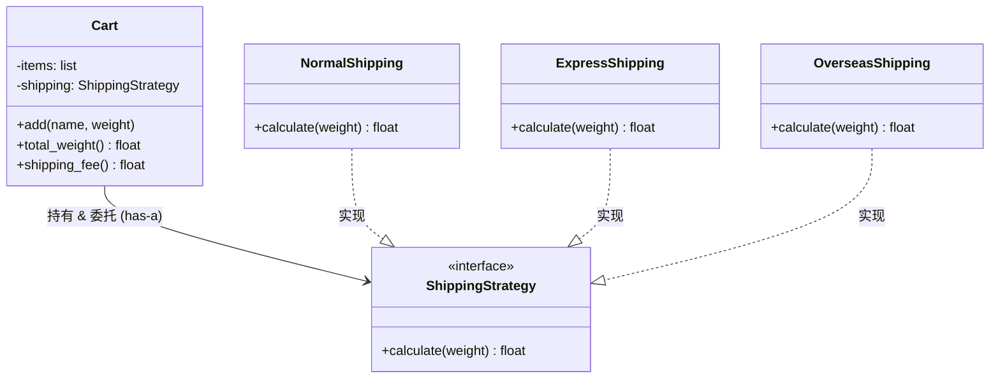
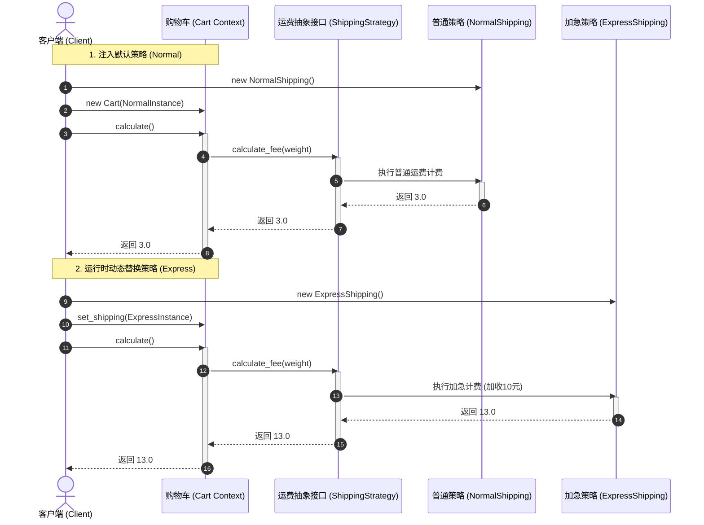
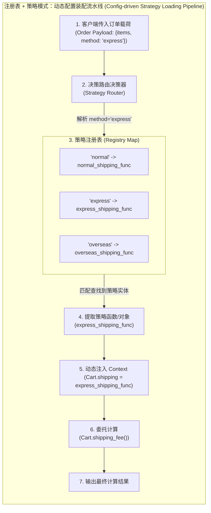

import GlossaryTerm from '@site/src/components/GlossaryTerm';
import GuidedExercise from '@site/src/components/GuidedExercise';
import ResearchNote from '@site/src/components/ResearchNote';
import ChapterMeta from '@site/src/components/ChapterMeta';
import PyRunner from '@site/src/components/PyRunner';
import TradeoffExplorer from '@site/src/components/TradeoffExplorer';
import QuizCard from '@site/src/components/QuizCard';

# M4L5 · 策略模式

<ChapterMeta
  time="约 2 小时"
  prereqs={[{label: 'M4L4 组合优于继承', href: './composition-over-inheritance'}, {label: 'M4L1 封装变化', href: './change-driven-design'}]}
  outcome="能识别“同一动作有多种可替换算法”的变化点，用策略模式把算法抽成可注入、可运行时切换的对象。"
  howToUse="先看 if-else 选算法的反例，再把每种算法抽成策略对象，最后做 lab。"
/>

:::tip 策略模式 = 上一课“组合可替换行为”的正式命名
M4L4 你已经在做策略模式了——把“会变的行为”抽成部件、组合进来、运行时可换。这一课给它一个正式的名字和结构：**定义一族可互换的 <GlossaryTerm term="Algorithm Family" definition="算法族 (Algorithm Family)：在策略模式中，针对同一个业务目标（如运费计算、重排算法）的一组具有相同接口契约的可互换算法具体实现集合。">算法族 (Algorithm Family)</GlossaryTerm>，把每个封装起来，让它们可以自由替换。**
:::

## 一、一个函数里塞了三种算法

你的结算函数要支持多种运费算法：普通、加急、海外。于是里面又是 `if method == "normal" ... elif "express" ... elif "overseas" ...`。每加一种运费方式就改这个函数（违反 [开闭，M4L2](./solid-srp-ocp)），而且没法在运行时按用户等级动态切换算法。**问题的变化点很清楚：“怎么算运费”这个算法本身会变、会增、要能换。**



## 二、三个核心概念（分层）

### 基础：什么是策略模式

<GlossaryTerm term="Strategy Pattern" definition="策略模式：定义一族可互换的算法，把每个算法封装成独立对象，让它们可以在运行时自由替换。使用者持有一个策略、委托它执行，而不写死某一种算法。">策略模式</GlossaryTerm>：把“同一件事的不同做法”各自封装成一个**策略对象**，使用者 <GlossaryTerm term="Context" definition="上下文 (Context)：策略模式中的核心类，扮演算法消费者的角色。它持有一个抽象策略的引用，负责接收数据并委托给当前策略去运行，自身不感知具体算法实现。">上下文 (Context)</GlossaryTerm> 持有一个策略、把活儿**委托**给它。换算法 = 换一个策略对象，使用者一行不用改。

### 进阶：context 与 strategy 的分工

- **策略（strategy）**：只负责“怎么算”——每种算法一个对象，接口统一（如都有 `cost(weight)`）。
- **上下文（context）**：持有一个策略，负责“什么时候用、用它算什么”，自己不含算法细节。
- 这项设计能实现极其健康的 <GlossaryTerm term="Loose Coupling" definition="松耦合：系统设计核心追求，模块与模块之间的依赖度极低。在策略模式中表现为 Context 仅依赖 Strategy 抽象接口，即使后续大范围修改或新增具体策略类，Context 代码也完全无感知。">松耦合 (Loose Coupling)</GlossaryTerm>（这正是 [DIP（M4L3）](./solid-lsp-isp-dip)：context 依赖“策略抽象”，具体算法注入进来）。



### 深入（选学）：策略模式与“一等函数”

在 Python/JS 这类有<GlossaryTerm term="First-class Function" definition="一等函数：函数可以像普通值一样被传递、赋值、存进变量或数据结构。在这类语言里，一个简单的策略往往直接用函数就够了，不必为它建一个类。">一等函数</GlossaryTerm>的语言里，一个简单策略**直接传函数**就够了，不必为它造一个类（回扣 [M4L1 KISS](./change-driven-design)）。只有当策略需要自己的状态、配置或多个方法时，才升级成类。GoF 的类版策略，在动态语言里常退化成“传个函数”——这不是偷懒，是语言特性带来的简化。



<ResearchNote
  title="把算法做成可互换的对象"
  source="Gamma, Helm, Johnson & Vlissides (GoF, 1994), Design Patterns — Strategy"
  href="https://en.wikipedia.org/wiki/Strategy_pattern"
  insight="GoF 的策略模式把“一族算法”各自封装、让它们可互换，从而把“选哪种算法”的变化从使用者中剥离。它是“封装变化 + 组合 + 面向接口”三条原则的直接产物。"
  application="凡是看到“同一动作要按情况切换不同算法/规则”（运费、排序、定价、压缩、限流），就考虑策略模式。在动态语言里，简单策略用函数、复杂策略用类——本质都是把算法注入进来。"
/>

## 三、跟我做一遍：可替换的运费策略

<PyRunner
  rows={22}
  expect="换策略不改 context"
  code={`# 一族可互换的算法（每个就是一个“策略”）
def normal(weight): return weight * 1.0
def express(weight): return weight * 1.0 + 10      # 加急 +10
def overseas(weight): return weight * 3.0 + 20     # 海外更贵

class Cart:
    def __init__(self, shipping):      # 注入策略（DIP）
        self.items = []
        self.shipping = shipping
    def add(self, name, weight): self.items.append((name, weight))
    def total_weight(self): return sum(w for _, w in self.items)
    def shipping_fee(self):            # 委托给策略，自己不含算法
        return self.shipping(self.total_weight())

cart = Cart(normal)
cart.add("书", 2); cart.add("杯子", 1)
print("普通运费:", cart.shipping_fee())

cart.shipping = express             # 运行时换策略 —— Cart 一行不改
print("加急运费:", cart.shipping_fee())

cart.shipping = overseas
print("海外运费:", cart.shipping_fee())
print("换策略不改 context")`}
/>

`Cart` 永远只调 `self.shipping(...)`——加一种运费方式只需**写一个新函数并注入**，`Cart` 不动（开闭）。**试试**：加一个“会员免运费”策略（`lambda w: 0`），赋给 cart，看它立刻生效。

## 四、动手 Lab（必做）

打开 `labs/month04/m4l5_strategy/`：

```bash
python labs/month04/m4l5_strategy/test_strategy.py
```

用策略模式实现可替换的运费/折扣计算：context 持有策略并委托，换算法不改 context。

<GuidedExercise
  title="练习指引：实现可替换的策略"
  goal="把“一族可互换算法 + context 委托”做成代码——加新算法时 context 一行不改。"
  hints={[
    '每种算法是一个策略（函数或对象），接口统一（如 fee(weight)）。',
    'context（Cart）持有一个策略，shipping_fee 委托给它。',
    '换策略 = 替换持有的对象，context 不改（开闭 + DIP）。',
    '简单策略用函数即可，别强行造类（KISS）。'
  ]}
  steps={[
    '定义几种运费策略：normal/express/overseas（统一签名）。',
    '实现 Cart(shipping)：add、total_weight、shipping_fee（委托策略）。',
    '支持运行时替换 shipping 策略。',
    '写测试：不同策略算出不同运费、运行时切换生效、加新策略不改 Cart。'
  ]}
  checks={[
    '你能识别“同一动作的多种算法”这个变化点。',
    '你的 context 委托策略、不含算法细节。',
    '你能不改 context 就加一种新策略。',
    '你能说出策略模式和组合/DIP 的关系。'
  ]}
/>

## 架构师深潜（Staff+ 视角）

### 1. 策略模式 vs if-else vs 配置

<TradeoffExplorer
  title="“选算法”怎么实现"
  dimensions={['加算法成本', '运行时可换', '可测试性', '可读性', '过度设计风险']}
  options={[
    {
      name: 'if-else 选算法',
      scores: [1, 2, 2, 4, 5],
      note: '直白，但每加一种都要改核心、难单独测、运行时切换笨拙。',
      whenToUse: '算法极少（2 个）且稳定时。'
    },
    {
      name: '策略对象/函数（推荐）',
      scores: [4, 5, 5, 4, 3],
      note: '每个算法独立、可注入、可运行时换、可单独测。',
      whenToUse: '算法会增、要切换、要单测时——大多数情况。'
    },
    {
      name: '注册表 + 策略（按 key 选）',
      scores: [5, 5, 5, 3, 2],
      note: '策略注册进表、按配置/key 选，可插件化。最灵活但更复杂。',
      whenToUse: '策略很多、要配置驱动或第三方扩展时。'
    }
  ]}
/>

### 2. 策略模式是“开闭原则”的招牌实现

回看主线：[M4L1 封装变化](./change-driven-design) → [M4L2 开闭](./solid-srp-ocp) → [M4L4 组合](./composition-over-inheritance) → 策略。**策略模式就是“把会变的算法封装成可注入对象”这一思想的标准形态。** 真实系统里，限流算法（[L15](../foundations/performance-and-latency)）、缓存淘汰策略（[M3L5](../data-cache-queue/cache-patterns)）、负载均衡算法、推荐排序，全是策略模式。

### 3. 架构师深问（给自己 30 分钟）

- 你代码里有没有“按类型选算法”的大 if-else？用策略重构它，并让算法能配置切换。
- 什么时候策略该用类、什么时候用函数？（提示：策略要不要自己的状态/配置/多方法。）
- 策略很多时怎么管理？（提示：注册表 + 按 key 选，呼应 M4L1。）

## 自检清单

- [ ] 我能识别“同一动作多种算法”的变化点。
- [ ] 我的 lab 用策略对象/函数 + context 委托。
- [ ] 我能不改 context 就加新策略。
- [ ] 我知道动态语言里简单策略可直接用函数。

## 常见误解

- **"既然策略模式是为了消灭 if-else，那么我代码里只要出现任何 if-else 分支，都应当强行改写成策略类"**: 典型的过度设计与生搬硬套。如果业务逻辑中的算法极少（例如仅有 2 个稳定分支），且未来几乎没有任何变化和新增可能性，直接使用 if-else 是符合 KISS（Keep It Simple, Stupid）原则的最优解。强行抽取策略类反而会导致类文件数量爆炸，增加了认知负载和维护成本。
- **"策略模式在动态语言（如 Python / JS）中非常繁琐，还要去写 Abstract Class 并继承实现"**: 这是对动态语言特性的严重无视。在支持一等函数（First-class Functions）的语言中，每一个“策略”都可以直接退化成一个普通函数。Context 只需要接收函数作为参数并直接调用即可，完全不需要去定义冗余的抽象类和多态子类，极大地精简了模板代码。
- **"把算法写死在 Context 里运行速度最快，使用策略模式会因为多了一层‘持有 + 委托’的多态调用而导致严重的系统性能瓶颈"**: 这纯属脱离工程实际的微观性能强迫症。在现代硬件和虚拟机（JIT）优化下，多态或函数委托调用的时间开销在纳秒级，而实际业务中无论是查库、调 RPC 还是大模型网关路由，网络和磁盘 I/O 都在毫秒级。用几乎忽略不计的微小调用开销，换取系统极佳的可替换性、开闭原则支持和极高的单元测试价值，是完全稳赚不赔的工程置换。

## 常见误解自测

<QuizCard
  questions={[
    {
      q: '在策略模式中，上下文（Context）与策略（Strategy）的核心分工是什么？',
      options: [
        'Context 负责所有具体的算法计算；Strategy 负责在屏幕上渲染计算结果。',
        'Strategy 负责封装具体的算法逻辑（‘怎么做’），提供统一的方法签名；Context 负责持有 Strategy 的引用并维护业务流程上下文（‘何时做，用什么数据做’），通过‘委托’机制调用 Strategy，自己对算法的具体实现细节一无所知。',
        'DIP 规则禁止 Context 和 Strategy 进行任何交互。'
      ],
      answer: 1,
      explain: 'Context 与 Strategy 的分工。Context 扮演的是统筹与协调者的角色（比如购物车 Cart 负责维护商品列表和总重），具体的算法逻辑（如普通、加急或海外运费计算）被完全封装进 Strategy 内部。这彻底贯彻了关注点分离的设计思想。'
    },
    {
      q: '在 Python / JavaScript 等支持一等函数（First-class Functions）的动态语言中，实现策略模式有什么独特的优势？',
      options: [
        '可以完全不编写任何业务类，直接通过把‘策略函数’作为一等公民参数进行传递，避免了为了套用设计模式而强行编写繁多‘抽象接口类’与‘具体策略子类’的八股样板代码，使得代码极其扁平与 KISS。',
        '动态语言能够将策略函数自动编译成汇编指令，提速 100 倍。',
        '一等函数能免去编写测试替身的必要。'
      ],
      answer: 0,
      explain: '一等函数与策略模式。在 C++/Java 中，哪怕是最简单的策略，也必须先定义一个 Interface 并在外部编写 concrete class。在支持高阶函数的语言中，任何满足参数特征的普通函数直接就可以充当策略传入，代码更加简洁和直白。'
    },
    {
      q: '如果我们将‘注册表模式 (Registry Pattern)’与‘策略模式 (Strategy Pattern)’结合使用（如 Registry + Strategy），会带来什么额外的工程利益？',
      options: [
        '这消除了所有的内存调用开销。',
        '这实现了策略的‘动态插拔与配置驱动’。策略实现类只需往全局注册表中 register(key, strategy)，上下文便可通过动态配置文件中的 key 字符串直接从注册表拉取并装配策略，上层服务完全实现了对第三方策略的黑盒热插拔扩展。',
        '这将导致系统无法进行本地调试。'
      ],
      answer: 1,
      explain: '注册表与策略的强强结合。这种模式（如 Registry + Strategy）是现代框架（如大模型路由网关、支付网关等）的常见架构基础。它将策略从直接的代码 new 中彻底解放出来，变成配置或插件化扩展。'
    }
  ]}
/>

## 延伸阅读

- [Strategy Pattern (Wikipedia)](https://en.wikipedia.org/wiki/Strategy_pattern)
- [下一课：工厂模式](./factory-pattern)
