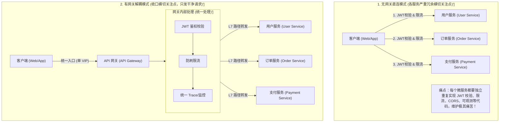
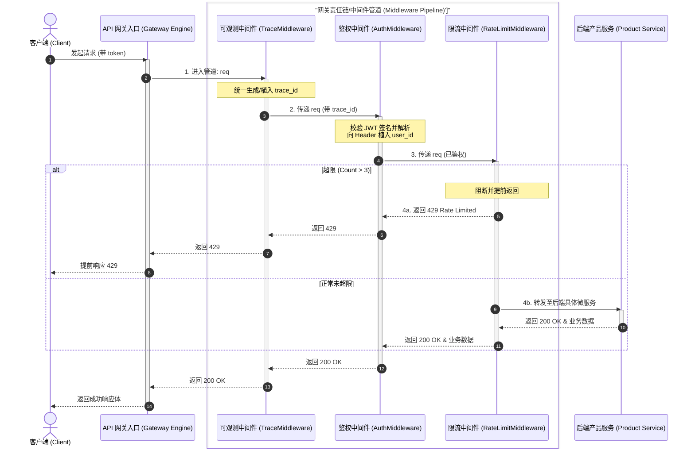
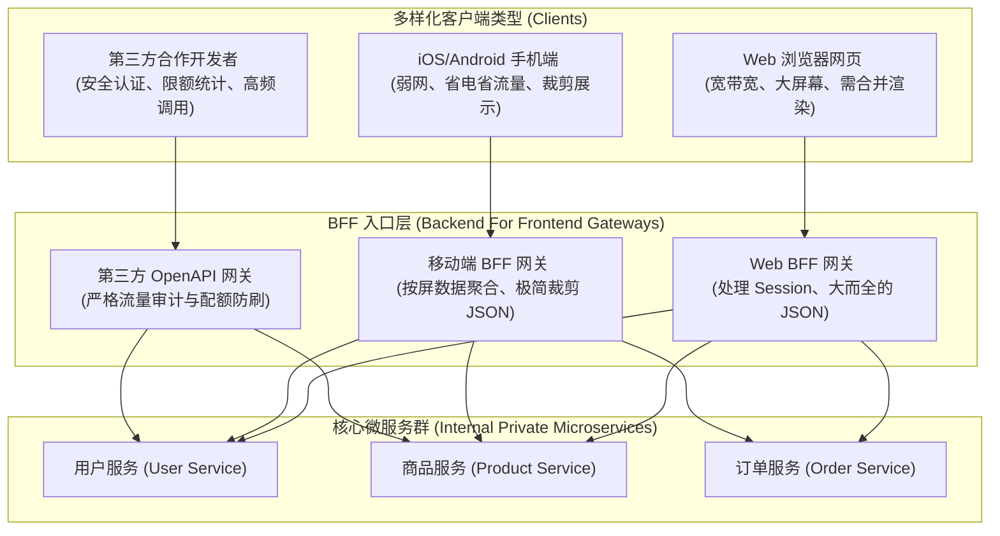

import GlossaryTerm from '@site/src/components/GlossaryTerm';
import GuidedExercise from '@site/src/components/GuidedExercise';
import ResearchNote from '@site/src/components/ResearchNote';
import ChapterMeta from '@site/src/components/ChapterMeta';
import PyRunner from '@site/src/components/PyRunner';
import TradeoffExplorer from '@site/src/components/TradeoffExplorer';
import QuizCard from '@site/src/components/QuizCard';

# M5L2 · API 网关

<ChapterMeta
  time="约 2 小时"
  prereqs={[{label: 'M5L1 负载均衡', href: './load-balancing'}, {label: 'M4L8 装饰器/中间件', href: '../design-patterns-lld/adapter-decorator'}, {label: 'L10 请求路径', href: '../foundations/request-path'}]}
  outcome="能说清 API 网关的职责边界（横切能力）、它和负载均衡/BFF 的关系，以及哪些东西绝不该塞进网关。"
  howToUse="先看“每个服务各自做认证限流”的重复，再看网关怎么收口，最后做网关中间件链 lab。"
/>

:::tip 网关是“横切能力”的家，不是业务逻辑的垃圾桶
当你有几十个微服务，认证、限流、日志、CORS 这些**每个服务都要做**的事，不该在每个服务里重写一遍。把它们收口到一个入口层——API 网关。但要警惕：它很容易膨胀成"什么都管"的巨石，把业务逻辑塞进去就毁了。
:::

## 一、每个服务都在重复做同样的事

你有订单、商品、用户、支付十几个服务。结果发现：每个服务都自己写了一遍 <GlossaryTerm term="JSON Web Token" definition="JSON Web Token (JWT)：一种开放标准 (RFC 7519)，用于在各方之间以 JSON 对象安全地传输信息。常用于微服务无状态分布式认证，网关校验签名后将用户 ID 等明文以 Header 传给下游服务。">JWT 校验</GlossaryTerm>、每个都自己接了限流、每个都自己配 CORS 和日志格式……**这些“<GlossaryTerm term='Cross-cutting Concern' definition='横切关注点 (Cross-cutting Concern)：指在软件系统中普遍存在且散落在多个业务模块中的公共功能（如安全性校验、日志监控、统一限流、事务处理）。如果不做抽取，它们会导致代码重复和高耦合度。'>横切关注点</GlossaryTerm>”（[M4L8](../design-patterns-lld/adapter-decorator)）在十几处重复**，改一个鉴权规则要动十几个服务。还有：客户端要调十几个不同地址、各服务协议还不一样。需要一个统一入口收口这些。

## 二、三个核心概念（分层）

### 基础：网关的职责 = 横切能力



<GlossaryTerm term="API Gateway" definition="API 网关：位于客户端与后端服务之间的统一入口，集中处理认证、路由、限流、日志、协议转换、聚合等横切能力，让后端服务专注业务。" >API 网关</GlossaryTerm>把这些**与具体业务无关、却人人都要**的能力收口到一处：

- **认证/鉴权**：统一校验 token，后端只接收已认证请求。
- **路由**：按路径/域名把请求转发到对应服务（L7，[M5L1](./load-balancing)）。
- **限流/熔断**：在入口挡住过量流量（[M5L5](./rate-limiting)/[M5L6](./circuit-breaker)）。
- **可观测**：统一打 trace id、访问日志、指标（[L12](../foundations/observability)）。
- **协议转换/TLS 终止**：对外 HTTPS、对内 HTTP/gRPC。

### 进阶：网关 vs 负载均衡 vs BFF

- **负载均衡**关注"分到哪台"（[M5L1](./load-balancing)）；**网关**关注"做哪些横切处理 + 路由到哪个服务"。生产中网关常自带 L7 负载均衡。


- <GlossaryTerm term="BFF" definition="Backend for Frontend：为特定前端（Web/iOS/Android）量身定制的网关层，按该端需求聚合/裁剪后端数据，避免一个通用 API 迁就所有端。">BFF（Backend for Frontend）</GlossaryTerm>：给不同前端（Web/App）各配一个量身定制的网关，按该端需要聚合、裁剪数据，避免一个通用 API 迁就所有端。



### 深入（选学）：网关的反模式——别让它变成巨石

网关最大的陷阱是**职责蔓延**：今天加点订单逻辑、明天塞点优惠计算，慢慢它就成了一个"什么都懂"的[上帝服务](../design-patterns-lld/solid-srp-ocp)，所有团队改它都要排队、它一挂就会演变成致命的“<GlossaryTerm term="Single Point of Failure" definition="单点故障 (SPOF - Single Point of Failure)：系统中的某一个组件或节点，一旦失效会导致整个系统完全停止运转。统一的 API 网关极易因为臃肿或配置失误变成全站的 SPOF，因此需要保持轻量化、去业务化及做冗余部署。">单点故障 (SPOF)</GlossaryTerm>”全站崩。守则：**网关只做与业务无关的横切能力；任何"懂某个业务"的逻辑都该在对应服务里。** 网关内部用[中间件/装饰器链](../design-patterns-lld/adapter-decorator)（鉴权→限流→日志→路由）保持每个关注点独立、可插拔——这正是 M4L8 装饰器的工业应用。

<ResearchNote
  title="网关：把横切关注点收口到入口"
  source="Chris Richardson, Microservices Patterns — API Gateway / BFF；Netflix Zuul / Edge Gateway 实践"
  href="https://microservices.io/patterns/apigateway.html"
  insight="微服务架构里，API 网关模式把认证、限流、聚合等横切能力从各服务上移到统一入口，降低客户端复杂度和重复。BFF 变体则为不同前端定制入口。但网关必须保持“瘦”，避免成为耦合所有服务的中心化瓶颈。"
  application="设计微服务入口：网关做横切能力 + 路由 + 必要的聚合；业务逻辑留在服务。用中间件链组织网关功能。前端差异大时用 BFF。始终警惕网关膨胀成单点巨石。"
/>

## 三、跟我做一遍：网关中间件链

<PyRunner
  rows={30}
  expect="请求通过网关管道"
  code={`# 网关 = 一串中间件（装饰器/责任链），逐层处理后转发到服务
# 每个中间件：拿到 request(dict)，做自己的事，再交给下一个

def auth(req, nxt):
    if not req.get("token"):
        return {"status": 401, "body": "未认证"}     # 在入口就挡掉
    req["user"] = "u-" + req["token"]
    return nxt(req)

def rate_limit(state):
    def mw(req, nxt):
        state["count"] = state.get("count", 0) + 1
        if state["count"] > 3:
            return {"status": 429, "body": "限流"}
        return nxt(req)
    return mw

def trace(req, nxt):
    req["trace_id"] = "t-123"                        # 统一打 trace（L12）
    return nxt(req)

# 后端服务：只接收已认证、已限流、带 trace 的干净请求
def product_service(req):
    return {"status": 200, "body": "product for %s (trace=%s)" % (req["user"], req["trace_id"])}

def build_gateway(service, middlewares):
    handler = service
    for mw in reversed(middlewares):                  # 从里到外包装成管道
        handler = (lambda m, n: (lambda r: m(r, n)))(mw, handler)
    return handler

gw = build_gateway(product_service, [trace, auth, rate_limit({})])
print(gw({"token": "abc"}))               # 通过
print(gw({}))                             # 401 未认证
for _ in range(4): last = gw({"token": "abc"})
print(last)                               # 429 限流
print("请求通过网关管道")`}
/>

鉴权、限流、trace 各是一个独立中间件，按顺序串成管道；后端服务只收到干净、已处理的请求。**试试**：加一个 `cors` 中间件，或调整中间件顺序（限流放鉴权前后效果不同），体会"横切能力可插拔"。

## 四、动手 Lab（必做）

打开 `labs/month05/m5l2_gateway/`：

```bash
python labs/month05/m5l2_gateway/test_gateway.py
```

实现一个可插拔的网关中间件链：鉴权、限流、trace 各自独立，可组合、可调序。

<GuidedExercise
  title="练习指引：实现网关中间件链"
  goal="把网关的横切能力做成可组合的中间件链（责任链/装饰器），后端服务只收干净请求。"
  hints={[
    '每个中间件签名统一：(req, next) -> response。',
    '中间件可以提前返回（如鉴权失败 401），也可改写 req 后调 next。',
    'build_gateway 把中间件从里到外包成一个调用链。',
    '这就是 M4L8 装饰器/责任链的工业应用。'
  ]}
  steps={[
    '实现 auth：无 token 返回 401，否则注入 user 并 next。',
    '实现 rate_limit：超过阈值返回 429。',
    '实现 trace：注入 trace_id 并 next。',
    '实现 build_gateway(service, middlewares) 串成管道。',
    '写测试：正常通过、未认证 401、超限 429、中间件顺序生效。'
  ]}
  checks={[
    '你能说出网关该做/不该做什么。',
    '你的中间件独立可组合、可调序。',
    '你能区分网关、负载均衡、BFF。',
    '你能解释网关为什么不能塞业务逻辑。'
  ]}
/>

## 架构师深潜（Staff+ 视角）

### 1. 网关的部署形态

<TradeoffExplorer
  title="入口层怎么组织"
  dimensions={['客户端简单', '横切收口', '膨胀风险', '团队自治', '运维复杂度']}
  options={[
    {
      name: '无网关（客户端直连服务）',
      scores: [1, 1, 5, 4, 2],
      note: '客户端要认识所有服务、各服务自做横切。简单系统可以，微服务下很痛。',
      whenToUse: '服务很少、或内部系统。'
    },
    {
      name: '单一 API 网关',
      scores: [5, 5, 1, 2, 3],
      note: '统一入口收口横切。客户端简单，但易膨胀成瓶颈、跨团队改它要排队。',
      whenToUse: '多数微服务系统的标准选择——但要严守“瘦网关”。'
    },
    {
      name: '多个 BFF',
      scores: [4, 4, 3, 5, 4],
      note: '每个前端一个定制网关，团队自治、按端裁剪。但网关数量多、有重复。',
      whenToUse: '前端形态差异大（Web/iOS/Android/开放 API）时。'
    }
  ]}
/>

### 2. 网关是中心化和去中心化的拉锯

网关收口横切能力（好），但也天然中心化（坏）。架构演进的张力就在这：太薄则各服务重复造轮子，太厚则成为耦合一切的瓶颈。成熟做法是**网关只留"真正横切且稳定"的能力**（鉴权、限流、路由、可观测），把易变的、业务相关的下放到服务或 [service mesh sidecar]——后者把横切能力下沉到每个服务旁，避免单一网关瓶颈。

### 3. 真实案例：Netflix Zuul 与 sidecar 演进

Netflix 早期用 Zuul 做统一边缘网关处理路由/弹性；随规模增长又引入更细的边缘服务和 mesh。这条演进印证：**横切能力的"收口程度"要随规模调整**——从"每服务自做"到"统一网关"到"网关 + sidecar 分层"。你设计入口时，要预判它会不会成为下一个瓶颈。

### 4. 架构师深问（给自己 30 分钟）

- 你系统里哪些能力是"真横切"（该进网关）、哪些是"伪横切"（其实属于某业务，不该进）？
- 网关聚合多个后端（一个请求 fan-out 调 5 个服务再合并）有什么好处和风险（[回扣尾延迟](../foundations/performance-and-latency)）？
- 网关挂了全站崩——你怎么让网关本身高可用、并避免它成为变更瓶颈？

## 自检清单

- [ ] 我能列出网关的核心横切职责。
- [ ] 我的 lab 网关用可组合中间件链实现。
- [ ] 我能区分网关、负载均衡、BFF。
- [ ] 我理解网关膨胀成巨石的风险与对策。

## 常见误解

- **"API 网关本质上也就是另外一种称呼的四层/七层负载均衡器，直接用 Nginx 转发一下就足够了，没有必要单独设计一层网关"**: 模糊了职责定位。负载均衡器（Load Balancer）主要关注的是底层流量的分发与网络包路由（L4/L7 转发，关注 IP/端口及 HTTP 基本头部）；而 API 网关（API Gateway）作为**入口横切能力收口层**，承载了大量的应用层业务无关关注点，如 JWT 签名安全校验、OAuth 统一鉴权、多级弹性限流、跨域（CORS）头注入、以及协议转换。它们分属不同的架构职责，尽管现代网关常内置 LB 能力。
- **"既然网关是提取公共代码的好地方，那我们应该把‘计算订单折扣优惠’、‘校验商品库存’等全站微服务都要调用的业务逻辑统统塞进网关，减少代码重复"**: 灾难性的上帝网关反模式。这直接把 API 网关变成了耦合全站所有微服务业务的“新单体巨石”。当业务变动时，网关团队成为全站发布的最大瓶颈；任何一处业务 Bug 甚至内存泄露，都可能直接拖垮整个入口，沦为致命的 **单点故障 (SPOF)**。网关必须保持“绝对瘦且不含任何特定业务的决策”，业务逻辑必须下沉到具体微服务。
- **"我们在公司里用一个统一的超级大网关就足够应对网页端、App 手机端和外部开放 API 接口的所有需求了"**: 忽视了多端流量在带宽、屏幕展现及协议诉求上的剧烈分歧。一个大网关包揽一切会导致接口字段为了妥协手机弱网进行无意义的数据裁剪，或者为了 Web 端返回巨大的冗余 JSON 浪费手机带宽。在多终端高并发微服务场景下，更佳实践是引入 **BFF (Backend for Frontend)** 模式，针对不同前端各配置一个定制网关，在网关内进行按屏接口聚合和裁剪，提升客户端响应效率。

## 常见误解自测

<QuizCard
  questions={[
    {
      q: '在微服务架构设计中，为什么强烈反对在 API 网关中编写‘优惠券折扣计算’、‘订单状态校验’等业务逻辑？',
      options: [
        '因为网关没有数据库连接权限，无法直接读取业务表。',
        '这会破坏网关作为‘横切关注点收口层’的单一职责定位，导致网关演变成一个耦合了全站所有微服务逻辑的、膨胀的中心化单点巨石（Monolithic Gateway），使得各微服务团队失去发布自治权，且任何业务代码 Bug 都可能导致网关崩溃全站瘫痪。',
        '因为网关是用 Nginx 写的，无法运行任何计算代码。'
      ],
      answer: 1,
      explain: '防范网关职责蔓延的反模式。网关的初衷是抽取公共横切面（鉴权、路由、限流）。一旦塞入业务，网关的变更频率就会和全站发布对齐，开发团队在网关处遭遇排队，违背了微服务去中心化的核心初衷。'
    },
    {
      q: '网关中间件链（Middleware Pipeline）在处理请求时，为什么将‘限流’与‘鉴权’中间件的执行顺序颠倒会带来截然不同的安全与性能表现？',
      options: [
        '因为鉴权中间件不需要消耗 CPU，所以放在哪里都一样。',
        '如果将限流放在鉴权之后，恶意攻击者可以通过并发打爆没有 Token 的伪造请求，从而在未鉴权拦截前耗尽鉴权微服务/外部 Redis 的查询算力；而将粗粒度的 IP 限流放在最外层，可以优先拦截恶意大流量，保护内层的高开销鉴权和业务处理器。',
        '限流放在后面是因为这样可以针对不同用户的 VIP 等级做更精准的限流，必须先拿到用户信息。因此，在没有大流量攻击防刷防护时，直接无脑放后面是唯一的正确做法。'
      ],
      answer: 1,
      explain: '中间件管道顺序的架构权衡。安全防刷（IP限流/漏桶）应该尽量靠外，以阻断无效的高并发流量打爆后端的计算与鉴权库；而基于用户级别（User Quota）的精细限流则必须在提取身份（Auth）后执行。在实际高安全网关中，通常会做两层限流配合。'
    },
    {
      q: 'BFF（Backend for Frontend，服务于前端的后端）网关模式的核心解决痛点和价值是什么？',
      options: [
        '为了让前端开发人员直接编写数据库 SQL 语句进行前端渲染。',
        '由于不同终端（如 App、Web、小程序）在屏幕展示面积、网络带宽、甚至接口格式上诉求截然不同。BFF 作为专属网关，按特定端的要求将后端微服务的多个细粒度接口进行‘数据裁剪’和‘接口聚合’，避免客户端发起多次网络往返（RTT），同时解耦了前端展示与后端核心微服务的业务演进。',
        '主要是为了在前端和网关之间增加一层负载均衡器以提升并发量。'
      ],
      answer: 1,
      explain: 'BFF 模式的真实应用场景。在移动端等弱网环境下，一个页面如果需要调 10 个微服务才能渲染，网络往返延迟是灾难性的。BFF 在内网低延迟环境下进行聚合，并裁剪掉冗余的 JSON 字段，能极大地优化客户端体验。'
    }
  ]}
/>

## 延伸阅读

- [Microservices.io: API Gateway](https://microservices.io/patterns/apigateway.html)
- [Backend for Frontend (Sam Newman)](https://samnewman.io/patterns/architectural/bff/)
- [下一课：服务发现与注册](./service-discovery)
