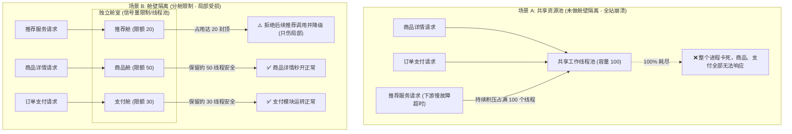
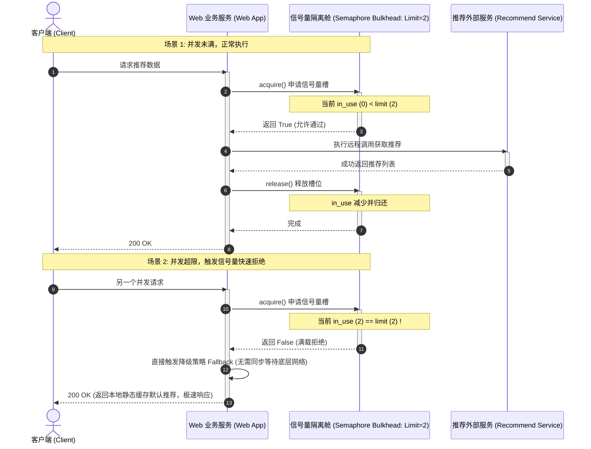

import GlossaryTerm from '@site/src/components/GlossaryTerm';
import GuidedExercise from '@site/src/components/GuidedExercise';
import ResearchNote from '@site/src/components/ResearchNote';
import ChapterMeta from '@site/src/components/ChapterMeta';
import PyRunner from '@site/src/components/PyRunner';
import TradeoffExplorer from '@site/src/components/TradeoffExplorer';
import QuizCard from '@site/src/components/QuizCard';

# M5L8 · 隔离与舱壁

<ChapterMeta
  time="约 2 小时"
  prereqs={[{label: 'M5L6 熔断', href: './circuit-breaker'}, {label: 'M5L7 重试超时', href: './retry-backoff-timeout'}, {label: 'L8 并发', href: '../foundations/concurrency-basics'}]}
  outcome="能用舱壁（资源分舱）限制故障爆炸半径，区分它和熔断的分工，并理解隔离在容错体系里的位置。"
  howToUse="先看“一个依赖耗尽全部线程拖垮所有功能”的痛，再用舱壁分舱隔离，最后做信号量舱壁 lab。"
/>

:::tip 舱壁的名字来自轮船：一个舱进水，不该让整艘船沉
轮船船体被分成多个**水密舱**，撞破一个舱，水只灌进那一个舱，船还能浮着。软件同理：把资源（线程、连接、配额）按依赖/租户**分舱**，一个依赖出故障耗尽它那一舱的资源，**其它功能照常运转**。这就是 bulkhead（舱壁）。
:::

## 一、一个慢依赖，耗尽全进程的线程

你的服务用一个共享线程池处理所有请求。推荐服务变慢，调它的请求全卡住，慢慢把线程池**全部占满**。结果：调用商品、订单、用户的请求也拿不到线程，**整个服务挂了**——明明只有推荐这一个依赖出问题。[熔断（M5L6）](./circuit-breaker)能在失败率高后跳闸，但在跳闸之前、或对"还没到阈值但已经占满资源"的情况，你需要更前置的防线：**从一开始就不让任何单个依赖能用光全部资源。**



## 二、三个核心概念（分层）

### 基础：舱壁——资源分舱

<GlossaryTerm term="Bulkhead" definition="舱壁隔离：把资源（线程池、连接数、并发配额）按依赖或租户切分成独立的“舱”，每个舱有自己的上限。一个舱被耗尽不影响其它舱，从而限制故障的爆炸半径。" >舱壁（Bulkhead）</GlossaryTerm>：给每个依赖（或每类请求、每个租户）分配**独立、有上限的资源舱**。推荐服务最多用 10 个并发槽，用完了它的请求就被拒——但商品、订单各有自己的舱，不受影响。实现方式：独立线程池，或更轻量的**信号量（semaphore）**限制每个依赖的并发数。

### 进阶：爆炸半径与故障隔离

```mermaid
flowchart TD
  subgraph Scale3["宏观部署物理层: 单元化架构 (Cell-based deployment)"]
    CellA["Cell 1("服务A + 数据库A") <br/>承载 0% ~ 25% 用户"]
    CellB["Cell 2("服务B + 数据库B") <br/>承载 26% ~ 50% 用户"]
    CellC["Cell 3("服务C + 数据库C") <br/>承载 51% ~ 100% 用户"]
    style CellA fill:#f9f,stroke:#333
    style CellB fill:#bbf,stroke:#333
    style CellC fill:#bbf,stroke:#333
    note3["💥 故障边界：Cell 1 彻底瘫痪，全网仅 25% 用户受影响，其余 75% 绝对安全"]
    CellA -.-> note3
  end

  subgraph Scale2["中观租户层: 多租户隔离 (Tenant quota & pool)"]
    SaaS["SaaS 控制器"] --> TenantA["大客户 VIP 专属隔离池"]
    SaaS --> TenantB["小客户共享配额池"]
    note2["💥 故障边界：某个小客户流量突增被打满，只阻塞小客户池，VIP 资源毫发无损"]
    TenantB -.-> note2
  end

  subgraph Scale1["微观进程内: 依赖级舱壁 (Thread pool / Semaphore isolation)"]
    Process["Web 进程"] --> BulkheadA["推荐服务专用信号量舱 (限额 20)"]
    Process --> BulkheadB["订单服务专用线程池舱 (容量 50)"]
    note1["💥 故障边界：推荐慢导致舱打满，其他商品详情线程完全不受波及"]
    BulkheadA -.-> note1
  end
```

舱壁的本质是控制<GlossaryTerm term="Blast Radius" definition="爆炸半径：一个故障能波及的范围。好的隔离设计让单点故障的爆炸半径尽可能小——只伤及局部，而非整个系统或所有用户。" >爆炸半径（blast radius）</GlossaryTerm>：让单个依赖/租户/分区的故障，只影响一小块，而非全局。这个思想贯穿多个尺度：
- **依赖级**：每个下游一个并发舱（本课）。
- **租户级**：大客户和小客户的资源隔离，防止一个租户的突发拖垮所有人（<GlossaryTerm term="Noisy Neighbor" definition="吵闹邻居效应 (Noisy Neighbor)：在多租户共享计算资源的环境下，由于某个租户突然爆发海量并发请求，过度耗尽了共享带宽、CPU 或连接池，从而导致同一物理机或集群上的其他租户遭遇严重响应缓慢甚至服务中断的负面影响。">“吵闹的邻居”</GlossaryTerm>问题）。
- **部署级**：[分区/<GlossaryTerm term="Cell-based Architecture" definition="单元化架构 (Cell-based Architecture)：将整个大型分布式部署系统，物理隔离切分为多个独立、自闭环、完全对等的部署单元（Cells/单元），用户流量按 ID 进行哈希或按地域划分路由。每个单元独立承载一定比例的用户流量，局部单元故障决不影响全站其他单元的业务安全。">单元化（cell-based）</GlossaryTerm>](./partitioning-sharding)，把用户分到独立的部署单元，一个单元故障只影响那部分用户。

### 深入（选学）：隔离的取舍——利用率 vs 安全

隔离不是免费的。共享资源池利用率最高（弹性好），但没有隔离；严格分舱安全，但每个舱要预留余量、整体利用率下降、可能某舱闲着某舱不够用。架构师要在**资源利用率**和**故障隔离**之间权衡：
- 关键 + 易故障的依赖 → 独立舱（值得为安全牺牲一点利用率）。
- 大量轻量同质的请求 → 可共享池（利用率优先）。
- 信号量舱壁（限并发数）比<GlossaryTerm term="Thread Pool Isolation" definition="线程池隔离 (Thread Pool Isolation)：舱壁隔离的具体实现方式之一。为每个依赖服务配置独立且有固定大小的线程池，使调用方的并发执行完全运行在专用线程池中。它提供了物理线程层面的强制超时打断和排队等待能力，但线程上下文切换开销较大。">独立线程池</GlossaryTerm>**开销小**，但线程池能额外提供超时中断和排队——按需选。配合[熔断](./circuit-breaker) + [超时](./retry-backoff-timeout) + [负载卸载](./rate-limiting)，舱壁是韧性组合拳里"限制爆炸半径"的那一拳。

<ResearchNote
  title="舱壁：限制故障的爆炸半径"
  source="Michael Nygard, Release It! — Bulkhead；Netflix Hystrix（线程池/信号量隔离）；AWS cell-based architecture"
  href="https://learn.microsoft.com/en-us/azure/architecture/patterns/bulkhead"
  insight="Nygard 把舱壁列为核心稳定性模式：按依赖隔离资源，使一个依赖的故障无法耗尽全部资源。Hystrix 用每依赖独立线程池/信号量实现。AWS 进一步推广到单元化（cell-based）架构，把爆炸半径限制在一个 cell 内。"
  application="给每个易故障/关键依赖分配独立资源舱（线程池或信号量并发上限）。在多租户系统按租户隔离资源。在大规模系统用单元化把用户分舱。目标始终是：让局部故障只伤局部。"
/>

## 三、跟我做一遍：信号量舱壁



<PyRunner
  rows={32}
  expect="一个依赖打满不影响另一个"
  code={`class Bulkhead:
    def __init__(self, name, limit):
        self.name = name
        self.limit = limit
        self.in_use = 0
    def acquire(self):
        if self.in_use >= self.limit:
            return False          # 这个舱满了，拒绝（但不影响别的舱）
        self.in_use += 1
        return True
    def release(self):
        self.in_use = max(0, self.in_use - 1)

# 给每个依赖一个独立的舱
rec = Bulkhead("recommend", limit=2)   # 推荐：最多 2 个并发
prod = Bulkhead("product", limit=5)    # 商品：独立 5 个并发

# 推荐服务变慢，并发请求把它的舱占满
print("rec 槽1:", rec.acquire())   # True
print("rec 槽2:", rec.acquire())   # True
print("rec 槽3:", rec.acquire())   # False —— 推荐舱满，拒绝（快速失败，可走降级）

# 但商品服务的舱完全不受影响，照常工作
print("product 槽1:", prod.acquire())  # True
print("product 槽2:", prod.acquire())  # True
print("商品舱可用槽:", prod.limit - prod.in_use)

rec.release()                       # 推荐有请求完成，腾出一个槽
print("rec 释放后再取:", rec.acquire())  # True
print("一个依赖打满不影响另一个")`}
/>

推荐服务的舱被占满后，新的推荐请求被立刻拒绝（可走[降级](./circuit-breaker)），但**商品服务的舱毫发无损**——故障被关在一个舱里。**试试**：再加一个共享舱版本（所有依赖共用一个池），模拟推荐打满后商品也拿不到槽，对比"分舱"的隔离效果。

## 四、动手 Lab（必做）

打开 `labs/month05/m5l8_bulkhead/`：

```bash
python labs/month05/m5l8_bulkhead/test_bulkhead.py
```

实现信号量舱壁：每依赖独立并发上限、满则拒绝、释放后可再用、一个舱满不影响其它舱。

<GuidedExercise
  title="练习指引：实现信号量舱壁"
  goal="把“每依赖独立并发上限 + 满则快速失败”做成代码，验证故障被隔离在一个舱内。"
  hints={[
    'Bulkhead 维护 in_use 和 limit。',
    'acquire：未满则占用返回 True，满则返回 False（不阻塞、不影响别的舱）。',
    'release：归还一个槽（注意别变负）。',
    '不同依赖用不同 Bulkhead 实例 —— 这就是隔离。'
  ]}
  steps={[
    '实现 Bulkhead(name, limit)：acquire / release。',
    '验证占满后 acquire 返回 False。',
    '验证 release 后又能 acquire。',
    '写测试：占满拒绝、释放可用、两个舱互不影响、release 不越界为负。'
  ]}
  checks={[
    '你能解释舱壁怎么限制爆炸半径。',
    '你的 lab 一个舱占满不影响另一个舱。',
    '你能区分舱壁（隔离资源）和熔断（快速失败）。',
    '你能说出隔离在利用率和安全间的取舍。'
  ]}
/>

## 架构师深潜（Staff+ 视角）

### 1. 隔离的粒度

<TradeoffExplorer
  title="资源隔离的粒度"
  dimensions={['资源利用率', '故障隔离', '弹性应对突发', '实现复杂度', '爆炸半径']}
  options={[
    {
      name: '全共享池（不隔离）',
      scores: [5, 1, 5, 5, 1],
      note: '利用率最高、最弹性。但一个依赖/租户能耗尽全部资源，爆炸半径=整体。',
      whenToUse: '请求同质、依赖都很可靠时——但风险高。'
    },
    {
      name: '按依赖/租户分舱',
      scores: [3, 4, 3, 3, 4],
      note: '每依赖/租户独立上限，局部故障只伤局部。要预留余量，利用率略降。',
      whenToUse: '有易故障依赖或多租户时——常用默认。'
    },
    {
      name: '单元化（cell-based）',
      scores: [2, 5, 2, 1, 5],
      note: '把用户分到独立部署单元，爆炸半径最小。但架构复杂、有冗余成本。',
      whenToUse: '超大规模、对可用性要求极高时（如核心金融/云平台）。'
    }
  ]}
/>

### 2. 隔离是"纵深防御"的最外层

韧性组合拳的完整图景：**限流**[（M5L5）](./rate-limiting)挡过量 → **超时 + 退避重试**[（M5L7）](./retry-backoff-timeout)应对抖动 → **熔断**[（M5L6）](./circuit-breaker)对持续故障快速失败 → **降级**给兜底 → **舱壁**限制爆炸半径。前几个是"针对单次/单依赖的处理"，舱壁是"即使前面都失守，故障也跑不出这个舱"的最后兜底。架构师设计时要分层布防，而非指望单一机制。

### 3. 真实案例：吵闹的邻居与单元化

多租户 SaaS 最怕"吵闹的邻居"——一个租户的异常流量拖垮所有租户。解法就是按租户做舱壁（资源配额隔离）。更极致的是 AWS 等的**单元化架构**：把用户分到多个独立 cell，每个 cell 是完整的小系统，一个 cell 出事只影响其中一部分用户，且可以逐 cell 灰度发布、限制变更爆炸半径。这是把"舱壁"思想从进程内放大到整个部署拓扑。

### 4. 架构师深问（给自己 30 分钟）

- 你的服务现在是共享线程池还是按依赖分舱？哪个依赖最该有独立舱（最易故障或最关键）？
- 信号量舱壁 vs 独立线程池，在你的场景各有什么优劣（开销、超时中断、排队能力）？
- 如果做多租户，怎么防止大客户的突发流量饿死小客户？配额怎么分、怎么动态调整？

## 自检清单

- [ ] 我能解释舱壁怎么限制爆炸半径。
- [ ] 我的 lab 实现了每依赖独立并发上限、互不影响。
- [ ] 我能区分舱壁、熔断、限流的分工。
- [ ] 我理解隔离在利用率与安全间的取舍。

## 常见误解

- **"既然我们已经对所有的服务接口配置了熔断器（Circuit Breaker），那么我们就完全不需要再单独设计资源舱壁（Bulkhead）了"**: 这是对两者协作流程的重大误解。熔断器必须依靠**“不断的调用失败并累计失败率达到阈值”**才会跳闸，在跳闸前的统计时间窗内，由于下游慢卡死，调用方早就有可能因为同步等待而耗尽了所有的工作线程，导致全站崩溃。而**舱壁（Bulkhead）在第一微秒起就强行划定了资源使用边界**（例如最多占用 10% 线程数），即使下游从一开始就卡死，它也绝对无法越界污染其他共享资源。因此两者属于前置划界与后置切断的黄金互补。
- **"要做舱壁隔离就必须为每个依赖接口都新建一个物理线程池，这会导致线程开销过大、严重拖累系统性能"**: 混淆了“隔离的概念”与“具体的实现”。舱壁的本质是**“划定上限上限”**以限制爆炸半径。如果担心线程切换开销，完全可以使用 **信号量隔离（Semaphore Isolation）**。信号量只在内存中通过原子计数器（AtomicInteger/Semaphore）限制最大并发数，开销趋近于零，几乎不产生多余的线程切换。
- **"资源隔离是一种对计算资源的极度浪费，应该尽量保持所有微服务都共享同一个大线程池，这最符合弹性原则"**: 架构设计中典型的“以效率换安全”短视行为。全共享池在系统一切正常时，弹性最好、利用率极佳；然而一旦某一个极细微的非核心组件（例如通知服务、广告接口）发生稍微的阻塞，就会在几秒钟内抽干全站的共享线程池，拖垮交易和登录等核心主链路。**舱壁是用局部的资源余量开销，去换取系统整体的绝对生存权**，是任何 Staff+ 级别架构师必须坚定推行的稳定性取舍。

## 常见误解自测

<QuizCard
  questions={[
    {
      q: '在服务容错设计中，舱壁隔离（Bulkhead）最核心解决的是什么痛点？它是如何缩减‘爆炸半径’的？',
      options: [
        '它解决了数据库 CPU 占用过高的问题，通过自动读写分离来实现隔离。',
        '它解决了‘慢依赖耗尽共享线程资源拖死无关功能’的痛点。通过将系统资源（如线程池、网络连接池、信号量槽数）按不同的依赖服务或业务板块划分为独立‘资源舱’，使任一下游慢故障最多只扣光它分配的本舱资源，而绝不可能无限制抽干其他核心模块的运行算力，从而成功将故障限制在局部。',
        '它专门用于拦截恶意的外部流量攻击，等同于轻量级防火墙。'
      ],
      answer: 1,
      explain: '舱壁隔离的精髓在于‘分舱限额’。好的架构不会假设下游一定不故障，而是假设下游即便完蛋，也不能动摇我的核心家底（独立资源舱）。'
    },
    {
      q: '在进程内实现舱壁隔离时，‘线程池隔离（Thread Pool Isolation）’与‘信号量隔离（Semaphore Isolation）’有何技术上的取舍？',
      options: [
        '线程池隔离只支持 HTTP 协议，信号量隔离只支持 gRPC 协议。',
        '线程池隔离为每个依赖配备专门的异步执行线程池，额外提供真正的物理线程级超时切断和排队等待能力，但线程上下文切换开销大；信号量隔离则是一个内存计数器，开销极低、实现简便，但由于它直接运行在调用方线程内，一旦下游卡死，调用方线程本身也会被堵住，无法实现快速的强制中断。',
        '信号量隔离可以完全替代物理服务器的多副本部署。'
      ],
      answer: 1,
      explain: '线程池与信号量的经典取舍。Resilience4j 和 Hystrix 都实现了这两种隔离。信号量没有上下文切换，是超高频场景下的绝佳选择；线程池则适合隔离慢长耗时、且需要绝对超时打断的网络依赖。'
    },
    {
      q: '将舱壁思想放大到全局物理部署拓扑时，‘单元化架构（Cell-based Architecture）’是如何控制故障爆炸半径的？',
      options: [
        '通过把所有的微服务打包在同一个 Docker 镜像内以减少网络延迟。',
        '将超大规模集群切分为若干个物理上完全对等、数据自治的微小部署单元（Cells/单元），用户按路由 Key（如 ID 哈希）被绑定划分到不同的 Cells 中。这样即便某个 Cell 发生硬件损坏、数据损坏或配置变更失误导致彻底崩溃，也只会伤及该 Cell 内的局部用户（如 5%），全网其他单元依旧稳如磐石。',
        '单元化架构强制要求所有用户只能在一台服务器上运行以防止爆炸。'
      ],
      answer: 1,
      explain: '单元化架构（Cell-based/Shard-based）是大型大厂（如 AWS、Netflix、支付宝）的标配抗灾体系。用部署隔离替代单集群共享，是架构演进的高级形态。'
    }
  ]}
/>

## 延伸阅读

- [Azure: Bulkhead Pattern](https://learn.microsoft.com/en-us/azure/architecture/patterns/bulkhead)
- [AWS: Cell-based Architecture](https://docs.aws.amazon.com/wellarchitected/latest/reducing-scope-of-impact-with-cell-based-architecture/)
- [下一课：复制](./replication)