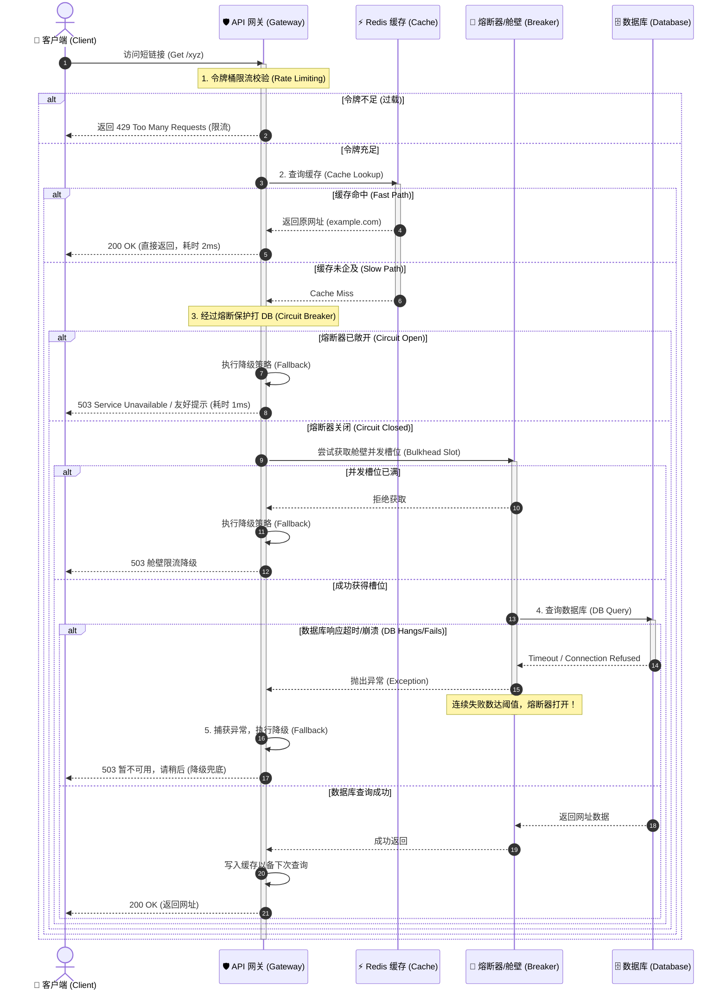

import GlossaryTerm from '@site/src/components/GlossaryTerm';
import GuidedExercise from '@site/src/components/GuidedExercise';
import ResearchNote from '@site/src/components/ResearchNote';
import ChapterMeta from '@site/src/components/ChapterMeta';
import PyRunner from '@site/src/components/PyRunner';
import TradeoffExplorer from '@site/src/components/TradeoffExplorer';
import QuizCard from '@site/src/components/QuizCard';

# M5L12 · Capstone：设计高可用服务

<ChapterMeta
  time="约 3.5 小时"
  prereqs={[{label: 'Month 5 全部', href: './overview'}]}
  outcome="能把本月所有构件组装成一个完整的高可用、可扩展服务设计，量化 SLO/容量，并讲清每个构件挡住哪种故障。"
  howToUse="把它当一道完整系统设计题：给定一个服务，逐层加上扩展和可靠性构件，并用数字论证。"
/>

:::tip 月末综合题：把零散的构件，组装成一个“打不死”的服务
这个月你逐个学了负载均衡、网关、限流、熔断、复制、分片、共识。现在要把它们**组装**起来：给定一个真实服务（比如一个商品详情 API），设计它的完整扩展 + 可靠性方案，并用 SLO 和容量估算证明它真的扛得住。
:::

## 一、需求：设计一个扛得住的"短链接服务"

复用 [M3L8 的短链接服务](../data-cache-queue/url-shortener)，但这次目标是**高可用 + 可扩展**：

- 规模：日活 1 亿、读写比 100:1（读远多于写）、要求读 p99 < 50ms。
- 可用性目标：99.95%（每月停机 ≤ ~22 分钟）。
- 任何单台机器、甚至单个可用区故障，服务不能整体挂。

先识别需要哪些构件（本月每一课对应一种故障/瓶颈的解药）。

## 二、逐层组装：每个构件挡一种故障

```mermaid
flowchart TD
  Client["👤 客户端 (Client)"] -->|1. DNS 路由| LB["⚖️ 多活负载均衡器 (LB/健康检查)"]
  
  subgraph GatewayLayer["入口网关层 (API Gateway - 限流防护)"]
    LB -->|2. 反向代理| GW["🛡️ 网关 (限流熔断防护)"]
    TokenBucket["Token Bucket <br/>(令牌桶防过载)"] <--> GW
  end
  
  subgraph AppLayer["业务应用层 (无状态 App 集群 - 故障隔离)"]
    GW -->|3. 点查路由| App1["💻 App 实例 1"]
    GW -->|3. 点查路由| App2["💻 App 实例 2"]
    
    App1 & App2 -.->|超时/退避重试/熔断保护| DB_Conn["🔌 舱壁隔离通道"]
  end

  subgraph CacheLayer["高速缓存层 (Redis Cluster - 读扩展)"]
    App1 & App2 -->|4. 读缓存 (99%)| Redis["("⚡ 读缓存组 (Consistent Hash)")"]
  end

  subgraph DBLayer["分片数据层 (Sharded DB - 写扩展/强一致)"]
    DB_Conn -->|5. 缓存 Miss 写路由| Master1["("🗄️ Shard 1 主库 (Write)")"]
    DB_Conn -->|5. 缓存 Miss 写路由| Master2["("🗄️ Shard 2 主库 (Write)")"]
    
    Master1 ====>|强同步/半同步复制| Follower1["("🗄️ Shard 1 从库 (Read)")"]
    Master2 ====>|强同步/半同步复制| Follower2["("🗄️ Shard 2 从库 (Read)")"]
    
    etcd["("🌐 etcd 共识集群 <br/>(选主与分片元数据)")"] <--> Master1 & Master2
  end
```

### 基础：流量入口与读扩展

- **入口**：[DNS → 负载均衡器（M5L1）](./load-balancing) 把流量分到一组无状态 API 实例；LB 本身多活、配[健康检查 + 服务发现（M5L3）](./service-discovery) 自动摘除坏实例。
- **网关**：[API 网关（M5L2）](./api-gateway) 做认证、[限流（M5L5）](./rate-limiting)、trace。
- **读扩展**：短链解析是读密集——前面挂 [CDN/缓存（M5L4）](./reverse-proxy-cdn) + Redis（[M3L5](../data-cache-queue/cache-patterns)），绝大多数读不落库。

### 进阶：数据层的可扩展与高可用

- **分片（M5L10）**：短码空间按 [一致性哈希/固定虚拟分片](./partitioning-sharding) 分到多个库，突破单库容量和写吞吐。
- **复制（M5L9）**：每个分片再做[主从复制](./replication)，主写从读 + 故障转移；选主用[共识/etcd（M5L11）](./consensus-coordination) 避免脑裂。
- **可靠调用**：服务间调用配置全套的<GlossaryTerm term="Resilience" definition="系统韧性 (Resilience)：系统在面临局部故障（硬件损坏、网络断连、流量超载）时，能够自我防御、阻断故障级联扩散，保障核心业务依然基本可用的自愈和防御能力。">系统韧性</GlossaryTerm>构件——包含 [超时与退避重试（M5L7）](./retry-backoff-timeout) + [熔断与降级（M5L6）](./circuit-breaker) + [舱壁隔离（M5L8）](./bulkhead-isolation)。

### 深入（选学）：用数字证明它扛得住

```mermaid
flowchart TD
  subgraph MetricsLayer["数据观测层 (SLIs - 量化关键指标)"]
    SLI_Success["SLI 1: 请求成功率 <br/>(成功请求数 / 总请求数)"]
    SLI_Latency["SLI 2: 页面响应延迟 <br/>(p99 延迟值)"]
  end

  subgraph ObjectiveLayer["服务目标层 (SLOs - 可靠性对赌契约)"]
    SLO_Success["SLO 1: 30天内成功率 >= 99.95%"]
    SLO_Latency["SLO 2: 30天内读 p99 < 50ms"]
    
    SLI_Success -->|对齐并限定| SLO_Success
    SLI_Latency -->|对齐并限定| SLO_Latency
  end

  subgraph BudgetLayer["错误预算层 (Error Budget - 允许的失败余量)"]
    Budget["每月可用错误预算: 0.05% <br/>(折合可用性故障停机约 22 分钟)"]
    SLO_Success -->|100% - SLO =| Budget
  end

  subgraph Actions["运维控制环 (SRE 自动响应)"]
    Budget -->|预算充足 (Error Budget > 0)| FastTrack["✅ 加速业务新功能研发与部署上线"]
    Budget -->|预算耗尽 (Error Budget <= 0)| StabilityFreeze["🚨 立即执行部署冻结，全员主攻系统稳定性"]
  end
```

设计不能只画框，要量化（[回扣 M2L3 容量估算](../system-design-bridge/capacity-estimation)、[L15 延迟](../foundations/performance-and-latency)）：
- **容量**：1 亿日活、读写 100:1 → 基于<GlossaryTerm term="Capacity Estimation" definition="容量估算 (Capacity Estimation)：根据业务量指标（日活、写比例、存储保留期等）运用粗略物理估算推算出系统所需的带宽、每秒查询率(QPS)、内存量及磁盘存储空间的量化过程，是决定系统分片数、机器规模的依据。">容量估算</GlossaryTerm>推导 QPS 峰值 → 倒推需要几个缓存节点、几个分片、几个副本（带余量）。
- **SLO 与错误预算**：<GlossaryTerm term="SLO" definition="服务等级目标（Service Level Objective）：对某项 SLI（如成功率、p99 延迟）设定的目标值，如“30 天内 99.95% 请求成功”。它把“高可用”变成可度量、可对赌的具体数字。" >SLO</GlossaryTerm> = 99.95% 成功 + 读 p99 < 50ms；它建立在 <GlossaryTerm term="SLI" definition="服务等级指标 (Service Level Indicator, SLI)：系统运行状况的关键量化指标，例如请求成功率、响应时间百分位数等，是设定 SLO 的底层观测指标。">SLI</GlossaryTerm> 之上；而 <GlossaryTerm term="Error Budget" definition="错误预算：1 减去 SLO 得到的允许失败额度（如 99.95% 对应每月约 0.05% ≈ 22 分钟）。用完了就冻结上线、专注稳定性，是平衡迭代速度与可靠性的机制。" >错误预算</GlossaryTerm> ≈ 每月 22 分钟，用它平衡迭代和稳定。
- **故障演练**：逐个问"挂了会怎样"——挂一个 API 实例（LB 摘除，无感）、挂一个缓存节点（一致性哈希只丢 1/N 命中、回源压力可控吗）、挂一个分片主库（故障转移多久、丢多少写）、挂一个可用区（跨区副本顶上吗）。这就是 [混沌工程（M2L11）](../system-design-bridge/reliability-fault-tolerance) 的思路。

<ResearchNote
  title="高可用是设计 + 量化 + 演练的总和"
  source="Google SRE Book — SLO / Error Budget / Handling Overload；Kleppmann, DDIA（复制+分区组合）"
  href="https://sre.google/sre-book/service-level-objectives/"
  insight="可靠的系统不是靠单个银弹，而是把扩展（LB/缓存/分片/复制）和韧性（限流/熔断/重试/隔离）构件分层组合，并用 SLO + 错误预算量化目标、用容量估算确定规模、用故障演练验证每个单点都有冗余。"
  application="设计任何高可用服务：① 画出流量与数据路径；② 在每一层放对应构件挡住对应故障；③ 用容量估算定规模、用 SLO 定目标；④ 逐个单点做“挂了会怎样”的演练。这套方法对任何系统设计题都通用。"
/>

## 三、跟我做一遍：组合可靠性构件保护一次调用



<PyRunner
  rows={36}
  expect="降级保住核心、限流挡住过载"
  code={`# 把本月几个构件串起来：限流 -> 熔断 -> 降级，保护一次“取短链目标”的调用
class Bucket:
    def __init__(self, cap): self.cap = cap; self.tokens = cap
    def allow(self):
        if self.tokens > 0: self.tokens -= 1; return True
        return False

class Breaker:
    def __init__(self, thr): self.thr = thr; self.fails = 0; self.open = False
    def call(self, fn):
        if self.open: raise RuntimeError("OPEN")
        try:
            r = fn(); self.fails = 0; return r
        except Exception:
            self.fails += 1
            if self.fails >= self.thr: self.open = True
            raise

cache = {"abc": "https://example.com"}     # 缓存命中绝大多数读
def db_lookup(code):
    raise RuntimeError("DB 挂了")          # 模拟数据库故障

def resolve(code, bucket, breaker):
    if not bucket.allow():
        return {"status": 429, "body": "限流"}          # 入口限流
    if code in cache:
        return {"status": 200, "body": cache[code]}     # 命中缓存（最快路径）
    try:
        return {"status": 200, "body": breaker.call(lambda: db_lookup(code))}
    except Exception:
        return {"status": 503, "body": "暂不可用，请稍后"}  # 熔断/失败 -> 降级兜底

b = Bucket(3); cb = Breaker(thr=2)
print(resolve("abc", b, cb))      # 命中缓存 200
print(resolve("xyz", b, cb))      # miss -> DB 挂 -> 降级 503
print(resolve("xyz", b, cb))      # 再失败 -> 熔断打开
print(resolve("abc", b, cb))      # 仍能命中缓存（熔断不影响缓存路径！）
for _ in range(5): last = resolve("abc", b, cb)
print("限流后:", last)            # 令牌用完 -> 429
print("降级保住核心、限流挡住过载")`}
/>

注意关键设计：熔断只挡住"打 DB"那条路，**缓存命中的快路径不受影响**——故障被隔离在最小范围，核心读路径始终可用。**试试**：给它加上 [舱壁](./bulkhead-isolation)（限制并发打 DB 的请求数）和[重试](./retry-backoff-timeout)（对瞬时失败退避重试），看可靠性进一步增强。

## 四、动手 Lab（必做）

打开 `labs/month05/m5l12_resilient/`：

```bash
python labs/month05/m5l12_resilient/test_resilient.py
```

把限流 + 缓存 + 熔断 + 降级组装成一个高可用读服务：缓存命中最快、过载限流、依赖故障降级、缓存路径不受熔断影响。

<GuidedExercise
  title="练习指引：组装高可用读服务"
  goal="把本月韧性构件组合成一个 resolve(code) 服务，让它在过载和依赖故障下仍提供有损服务。"
  hints={[
    '顺序：先限流（挡过载）→ 查缓存（最快路径）→ miss 才经熔断打 DB → 失败降级。',
    '熔断只包住打 DB 的调用，别让它影响缓存命中路径。',
    '限流耗尽返回 429，依赖故障/熔断返回降级响应（503 或兜底）。',
    '可选：加舱壁限制并发打 DB、加重试应对瞬时失败。'
  ]}
  steps={[
    '实现/复用 令牌桶、熔断器（可直接调用前几课的实现思路）。',
    '实现 resolve(code)：限流 → 缓存 → 熔断调用 DB → 降级。',
    '保证缓存命中路径不受熔断状态影响。',
    '写测试：缓存命中 200、限流 429、DB 故障降级、连续失败后熔断、熔断期间缓存仍可用。'
  ]}
  checks={[
    '你能为一个服务设计完整的扩展 + 可靠性方案。',
    '你能说出每个构件挡住哪种故障。',
    '你的故障被隔离在最小范围（缓存路径不受影响）。',
    '你能用 SLO/容量数字论证设计。'
  ]}
/>

## 架构师深潜（Staff+ 视角）

### 1. 可用性预算怎么花

<TradeoffExplorer
  title="提升可用性的手段（投入产出）"
  dimensions={['可用性提升', '成本', '复杂度', '见效速度', '通用性']}
  options={[
    {
      name: '消除单点 + 健康检查',
      scores: [5, 3, 2, 5, 5],
      note: '每个组件至少 2 副本 + 自动摘除坏实例。性价比最高的第一步。',
      whenToUse: '任何要高可用的系统的起点。'
    },
    {
      name: '韧性模式（限流/熔断/重试/隔离）',
      scores: [4, 2, 3, 4, 5],
      note: '防止局部故障级联放大。代码层投入，回报大。',
      whenToUse: '所有跨服务调用——默认标配。'
    },
    {
      name: '多可用区 / 多区域',
      scores: [5, 5, 5, 2, 3],
      note: '抗整个机房/区域故障。可用性天花板最高，但成本和复杂度大。',
      whenToUse: '可用性要求极高、能承担跨区成本时。'
    }
  ]}
/>

### 2. 高可用是"没有单点 + 故障不放大 + 可量化验证"

回看本月主线：**没有单点**（LB/服务/缓存/数据库每层都冗余 + [复制](./replication)/[共识选主](./consensus-coordination)）+ **故障不放大**（[限流](./rate-limiting)/[熔断](./circuit-breaker)/[重试纪律](./retry-backoff-timeout)/[隔离](./bulkhead-isolation)阻断级联）+ **可量化验证**（SLO/错误预算/容量估算/故障演练）。这三句话就是高可用的全部。任何一句话缺失，系统都会在某次故障中暴露。架构师的价值，就是在设计阶段就把这三件事想全、并用数字说话。

### 3. 真实案例：本月构件就是每个大厂系统的标配

你打开任何一个大规模服务（电商、社交、支付、[本月的短链/feed](../data-cache-queue/feed-fanout)），它的骨架都是这套：多活入口 + 网关限流 + 服务间熔断重试隔离 + 分片复制的数据层 + 共识管控制面 + 全链路可观测 + SLO 驱动运维。Month 5 给了你一套"通用的高可用系统设计模板"——这正是系统设计面试和真实架构评审考的核心。

### 4. 架构师深问（给自己 30 分钟）

- 给你的短链服务画出完整架构图，标出每一层的冗余和对应的韧性构件。哪里还有单点？
- 用容量估算：1 亿日活、读写 100:1，峰值 QPS 大概多少？需要几个缓存节点、几个分片、几个副本（带余量）？
- 做一次"故障演练"：依次假设挂掉 LB/一个 API 实例/一个缓存节点/一个分片主库/一个可用区，分别会发生什么、用户感知如何、多久恢复？

## 自检清单

- [ ] 我能把本月构件组装成完整的高可用服务设计。
- [ ] 我能说出每个构件挡住哪种故障。
- [ ] 我的 lab 把限流/缓存/熔断/降级正确组合、故障隔离在最小范围。
- [ ] 我能用 SLO + 容量估算量化论证设计。

## 常见误解

- **"高可用就是把限流、熔断、降级、分片、复制这些本月学过的构件全部无脑堆叠到系统里，系统自然就能防范一切故障了"**: 极其肤浅。高可用是体系化工程，构件之间会互相制约甚至起反作用。例如，不当的重试机制与错误的熔断阈值结合会形成“重试风暴”，直接把刚恢复的数据库瞬间压瘫。如果不经过体系化的 **故障演练（Chaos Engineering）** 与数字量化，盲目堆砌组件只会带来极高的系统复杂性与更多的未知故障隐患。
- **"可用性（Availability）和 SLO 越趋近 100% 越完美，架构师的目标就是做全网 99.999% 永不宕机系统"**: 典型的工程师思维黑洞。99.999% 的可用性（每年故障停机小于 5 分钟）需要极度昂贵的多活多区域强同步架构、海量冗余机器和难以想象的运维复杂性，其成本呈指数级飙升。如果你的业务只是个日活几万的普通短链系统，99% 成功率就足够了，把资源浪费在不必要的稳定性上，不如留给业务的敏捷开发。**必须根据业务实际价值，利用错误预算（Error Budget）平衡稳定与迭代效率。**
- **"网关处的限流器和应用层内部的熔断器是完全独立工作的，它们各管各的就行，不需要联动配合"**: 缺乏全局架构视野。它们是防御链条上的组合拳。如果网关限流器判定流量超载并拦截（429），这部分被成功拦截的流量根本不该进入下游应用实例，更不该计入下游熔断器的错误率计数中。如果限流流量导致下游熔断器误判为服务故障而 trips open，就会错误地大范围封杀正常用户的合法请求，导致整个降级范围被无端放大。

## 常见误解自测

<QuizCard
  questions={[
    {
      q: '在高可用短链接服务设计中，当数据库（MySQL）的单机写性能和磁盘容量达到极限，且读流量也极高时，最佳的系统架构组合设计是什么？',
      options: [
        '直接将所有读写流量全部路由给单个 etcd 节点，依靠 etcd 的强一致性抗写压力。',
        '入口层通过 API 网关进行请求限流；读路径引入 Redis 缓存挡掉 99% 的读流量；数据层采用固定数量虚拟分片（Pre-sharding）将短码打散到多个物理分片以分担写压力；各分片内部采用主从复制高可用，利用 etcd 协调服务保障自动选主。',
        '放弃数据库，全部数据存储在应用服务器本地内存中并使用同步机制。'
      ],
      answer: 1,
      explain: '高可用架构的经典拼图。限流挡过载、缓存抗并发读、分片抗写并发与容量限制、副本防丢失、共识做管控，多层构件各司其职，联合保障整个系统的高可用性。'
    },
    {
      q: '为什么在架构设计中要将‘熔断器（Circuit Breaker）’的保护范围局限在‘打数据库的慢路径’上，而不是包住整个服务解析函数？',
      options: [
        '因为熔断器放在缓存路径上会导致 Redis 内存溢出。',
        '为了实现‘有损服务/降级容灾’。如果包住整个函数，一旦数据库发生短暂故障引发熔断器打开，所有的请求（包括原本可以通过缓存成功返回的 99% 的读请求）都将被一刀切拦截降级。正确的做法是仅在缓存未命中打 DB 失败时触发熔断，保障已命中的缓存快速返回，使故障影响最小化。',
        '因为熔断器不支持在多级组件中嵌套使用。'
      ],
      answer: 1,
      explain: '故障隔离（Fault Isolation）的最核心实践。熔断是为了切断慢依赖（如挂起的数据库查询），保障快依赖（如内存缓存）和本地状态能够继续服务，这也是微服务容灾的核心。'
    },
    {
      q: '如果你的服务 SLO 成功率目标设定为 99.95%，当你的错误预算（Error Budget）被近期频繁的线上故障完全耗尽时，团队在 SRE 规范下应当采取什么行动？',
      options: [
        '继续加速研发并上线新功能，寄希望于新功能能够掩盖旧系统的稳定性缺陷。',
        '团队必须立即‘冻结（Freeze）’一切非紧急的新功能部署，将研发重心全面转向系统架构加固、故障排查治理、增加监控告警和自动化降级容灾等稳定性专项，直到服务质量回升并积累了新的错误预算。',
        '直接将 SLO 指标手动降低至 99.5%，以避免被绩效扣分。'
      ],
      answer: 1,
      explain: '错误预算（Error Budget）的科学指挥棒作用。它不再是空洞的指标，而是客观约束：当预算充裕时，团队可以大胆试错推进迭代；预算用光时，研发和运维必须停手主攻稳定性，实现业务敏捷度与高可用之间的平衡。'
    }
  ]}
/>

## 延伸阅读

- [Google SRE: Service Level Objectives](https://sre.google/sre-book/service-level-objectives/)
- [AWS Well-Architected: Reliability Pillar](https://docs.aws.amazon.com/wellarchitected/latest/reliability-pillar/welcome.html)
- [Month 5 总览](./overview)
- [进入 Month 6：云原生与工业软件](../cloud-enterprise-industrial/overview)