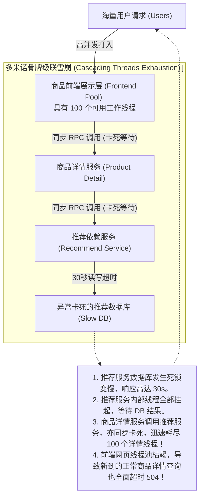
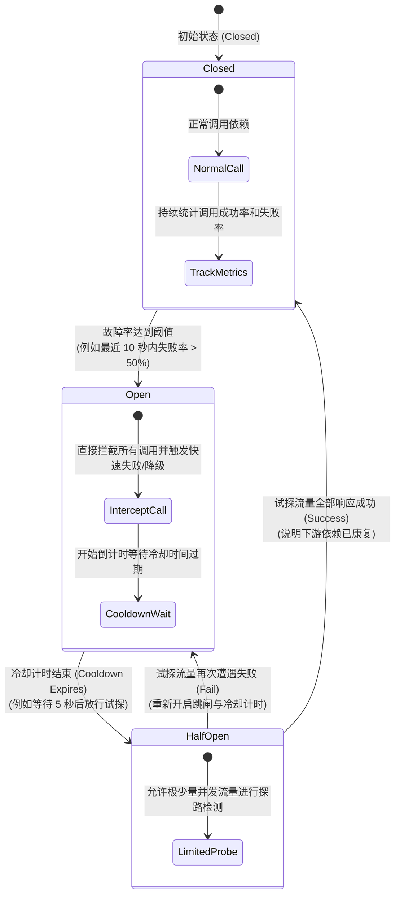
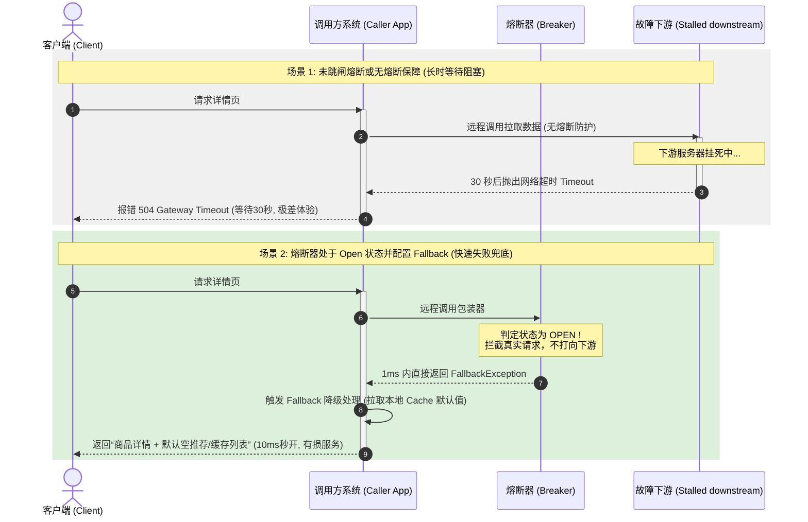

import GlossaryTerm from '@site/src/components/GlossaryTerm';
import GuidedExercise from '@site/src/components/GuidedExercise';
import ResearchNote from '@site/src/components/ResearchNote';
import ChapterMeta from '@site/src/components/ChapterMeta';
import PyRunner from '@site/src/components/PyRunner';
import TradeoffExplorer from '@site/src/components/TradeoffExplorer';
import QuizCard from '@site/src/components/QuizCard';

# M5L6 · 熔断与降级

<ChapterMeta
  time="约 2.5 小时"
  prereqs={[{label: 'M5L5 限流', href: './rate-limiting'}, {label: 'M2L11 容错', href: '../system-design-bridge/reliability-fault-tolerance'}]}
  outcome="能实现熔断器三态机、说清它和限流的区别，并用降级（fallback）让依赖故障时系统仍能提供有损服务。"
  howToUse="先看“依赖变慢拖垮调用方”的级联失败，再用熔断器快速失败止血，最后做三态熔断器 lab。"
/>

:::tip 限流挡的是“外面来的过量”，熔断挡的是“里面坏的依赖”
[限流（M5L5）](./rate-limiting) 保护你不被上游打垮；熔断保护你不被**下游**拖垮。当你依赖的某个服务持续失败或变慢，继续调它只会浪费资源、堆积等待、最终拖死自己。熔断器的思路像家里的保险丝：**坏了就先断开，快速失败，过会儿再试。**
:::

## 一、一个慢依赖，拖垮整条调用链

商品详情页要调推荐服务。推荐服务出故障变得极慢（每次 30 秒超时）。结果：每个商品详情请求都卡在等推荐服务上，线程被占住、连接池耗尽，**整个商品详情页都挂了**——只因为一个本可以降级的非核心依赖。这就是<GlossaryTerm term="Cascading Failure" definition="级联失败：一个组件的故障通过依赖关系扩散，拖垮调用它的组件，进而层层扩散，最终导致大范围崩溃。慢依赖比直接报错更危险，因为它会占住资源。">级联失败</GlossaryTerm>。慢，比直接报错更可怕——因为它占着资源不放。



## 二、三个核心概念（分层）

### 基础：熔断器三态



<GlossaryTerm term="Circuit Breaker" definition="熔断器：包在远程调用外的一个状态机。统计失败率，失败过多就“跳闸”（Open）快速失败、不再真正调用；过一段时间放几个试探请求（Half-Open）探测依赖是否恢复，恢复则关闭（Closed）。" >熔断器（Circuit Breaker）</GlossaryTerm>是一个包在远程调用外的状态机：

- **Closed（关闭，正常）**：请求正常通过，同时统计失败次数。失败率超阈值 → 跳到 Open。
- **Open（打开，熔断）**：**不再真正调用**依赖，直接快速失败（或走降级）。省下等待、给依赖喘息。等一段冷却时间 → 跳到 Half-Open。
- **Half-Open（半开，试探）**：放几个试探请求过去。成功 → 回到 Closed；失败 → 回到 Open 再等。

### 进阶：降级（fallback）——熔断后给什么



熔断后不能只是报错。<GlossaryTerm term="Fallback" definition="降级/兜底：当依赖不可用（如熔断打开）时，返回一个合理的替代结果（缓存的旧数据、默认值、空列表），保证核心功能可用，而非整体失败。" >降级（fallback）</GlossaryTerm>给一个合理的替代：推荐服务挂了就返回**缓存的旧推荐或空推荐**，商品详情照常显示。区分**核心依赖**（挂了只能报错）和**可降级依赖**（挂了给兜底）是设计的关键——商品基础信息是核心，推荐是可降级的。

### 深入（选学）：熔断的参数与陷阱

熔断器的难点在调参和边界：
- **失败阈值与统计窗口**：用"最近 N 次里失败 M 次"或"滑动窗口失败率"，而非简单连续计数（避免偶发抖动误熔断）。
- **半开试探的并发控制**：Half-Open 时只放**极少量**试探，否则依赖刚要恢复又被一拥而上打回去。
- **超时是熔断的前提**：没有[超时（下一课）](./retry-backoff-timeout)，慢依赖根本不会被算作"失败"，熔断器永远不跳闸。**熔断 + 超时 + 降级 + [<GlossaryTerm term="Bulkhead Isolation" definition="舱壁隔离 (Bulkhead Isolation)：借鉴轮船水密舱设计，将资源（如线程池、内存、连接池）按依赖服务作隔离划分。当其中一个下游依赖挂起变慢时，只会耗尽分配给它的专用资源池，而不扩散影响到全站其他不相关的正常路由。">隔离（M5L8）</GlossaryTerm>](./bulkhead-isolation)** 是一套组合拳，缺一不可。
- 区分熔断与限流：限流按"请求量"拒绝（保护自己不被打垮），熔断按"依赖健康度"快速失败（保护自己不被拖垮）——两者正交、常一起用。

<ResearchNote
  title="熔断器：用快速失败阻断故障扩散"
  source="Michael Nygard, Release It!（Circuit Breaker / Bulkhead）；Martin Fowler, CircuitBreaker；Netflix Hystrix"
  href="https://martinfowler.com/bliki/CircuitBreaker.html"
  insight="Nygard 在《Release It!》提出熔断器等稳定性模式：当远程调用持续失败，熔断器跳闸、快速失败，避免调用方资源被慢依赖耗尽。Fowler 细化了三态机。Netflix Hystrix 把它（+ 隔离 + 降级）做成大规模实践标准。"
  application="对每个跨服务/跨网络调用包熔断器 + 超时 + 降级。区分核心与可降级依赖。熔断阻断级联失败，降级保住有损服务，隔离限制故障爆炸半径——这套组合是分布式系统韧性的基础。"
/>

## 三、跟我做一遍：三态熔断器

<PyRunner
  rows={34}
  expect="熔断后快速失败、恢复后关闭"
  code={`class CircuitBreaker:
    def __init__(self, fail_threshold=3, cooldown=5.0):
        self.fail_threshold = fail_threshold
        self.cooldown = cooldown
        self.state = "closed"
        self.fails = 0
        self.open_since = 0.0

    def call(self, fn, now):
        if self.state == "open":
            if now - self.open_since >= self.cooldown:
                self.state = "half_open"      # 冷却够了，试探
            else:
                raise RuntimeError("熔断中，快速失败")  # 不真正调用
        try:
            result = fn()
        except Exception:
            self.fails += 1
            if self.state == "half_open" or self.fails >= self.fail_threshold:
                self.state = "open"           # 失败过多/试探失败 -> 跳闸
                self.open_since = now
            raise
        # 成功
        if self.state == "half_open":
            self.state = "closed"             # 试探成功 -> 恢复
        self.fails = 0
        return result

cb = CircuitBreaker(fail_threshold=3, cooldown=5.0)
def bad(): raise ValueError("依赖挂了")
def good(): return "ok"

# 连续失败 3 次 -> 跳闸
for i in range(3):
    try: cb.call(bad, now=0)
    except Exception: pass
print("3 次失败后状态:", cb.state)            # open

# Open 期间直接快速失败，不调用依赖
try: cb.call(good, now=1)
except RuntimeError as e: print("Open 期间:", e)

# 冷却后半开试探，依赖已恢复 -> 关闭
print("冷却后调用:", cb.call(good, now=6))     # half_open -> 成功 -> closed
print("恢复后状态:", cb.state)
print("熔断后快速失败、恢复后关闭")`}
/>

连续失败跳闸后，Open 期间所有调用瞬间失败（不再傻等慢依赖）；冷却后半开试探，依赖恢复就关闭。**试试**：让 `good` 在半开时也失败一次，观察它立刻退回 Open 并重新计时——避免依赖没真恢复就被打回去。

## 四、动手 Lab（必做）

打开 `labs/month05/m5l6_circuit_breaker/`：

```bash
python labs/month05/m5l6_circuit_breaker/test_breaker.py
```

实现三态熔断器：失败跳闸、Open 快速失败、冷却后半开试探、成功恢复。

<GuidedExercise
  title="练习指引：实现三态熔断器"
  goal="把 closed/open/half-open 三态机做成代码——这是阻断级联失败的核心稳定性模式。"
  hints={[
    'closed：正常调用 + 计失败；失败达阈值跳 open。',
    'open：冷却期内直接快速失败，不调依赖；冷却够了转 half_open。',
    'half_open：放试探；成功转 closed、失败转 open 并重新计时。',
    '成功要重置失败计数。'
  ]}
  steps={[
    '实现 CircuitBreaker(fail_threshold, cooldown)。',
    'call(fn, now)：按状态决定快速失败 / 真调用 / 试探。',
    '正确处理三态转移与失败计数重置。',
    '写测试：连续失败跳闸、Open 快速失败、冷却后半开、半开成功恢复、半开失败退回。'
  ]}
  checks={[
    '你能解释级联失败为什么“慢比错更可怕”。',
    '你的熔断器三态转移正确。',
    '你能区分熔断和限流。',
    '你能说出熔断为什么必须配超时和降级。'
  ]}
/>

## 架构师深潜（Staff+ 视角）

### 1. 故障时的应对策略

<TradeoffExplorer
  title="依赖故障时怎么办"
  dimensions={['止血速度', '保护调用方', '用户体验', '实现复杂度', '适用依赖']}
  options={[
    {
      name: '什么都不做（一直等/一直重试）',
      scores: [1, 1, 1, 5, 1],
      note: '慢依赖占住资源，级联拖垮调用方。最危险。',
      whenToUse: '几乎从不。'
    },
    {
      name: '超时 + 熔断（快速失败）',
      scores: [5, 5, 2, 3, 5],
      note: '及时止血、保护调用方资源。但熔断期间该依赖功能不可用。',
      whenToUse: '所有跨网络调用的基础保护。'
    },
    {
      name: '熔断 + 降级（兜底）',
      scores: [5, 5, 4, 2, 4],
      note: '止血的同时给替代结果，核心功能照常。最佳，但要设计 fallback。',
      whenToUse: '可降级依赖（推荐/广告/非核心数据）。'
    }
  ]}
/>

### 2. 韧性是“组合拳”，不是单个模式

熔断不是孤立的。一个健壮的远程调用通常层层包裹：**超时**（不傻等）→ **重试 + 退避**（[下一课](./retry-backoff-timeout)，应对瞬时抖动）→ **熔断**（持续失败就快速失败）→ **降级**（给兜底）→ **隔离**（[M5L8](./bulkhead-isolation)，限制爆炸半径）。架构师设计服务间调用时，要把这套组合当成默认模板，而不是出事后才补。这正是 [M2L11 容错](../system-design-bridge/reliability-fault-tolerance) 落到代码层的样子。

### 3. 真实案例：Hystrix 与韧性工程

Netflix 的 Hystrix 把熔断 + 隔离 + 降级做成大规模标准，让单个依赖故障不会拖垮整个 API。虽然 Hystrix 已停止开发（被 Resilience4j、service mesh 等取代），但它确立的理念——**每个依赖都要有熔断、超时、降级、隔离**——已成为微服务韧性的共识。现代 service mesh（Istio/Envoy）把这些能力下沉到 sidecar，让业务代码无感获得。

### 4. 架构师深问（给自己 30 分钟）

- 列出你服务的所有外部依赖，标出哪些是核心（挂了只能报错）、哪些可降级（给什么兜底）？
- 熔断的失败阈值和冷却时间怎么定？太敏感会误熔断、太迟钝起不到保护——你怎么权衡和验证？
- Half-Open 时大量请求一拥而上把刚恢复的依赖又打挂，怎么避免（提示：限制试探并发）？

## 自检清单

- [ ] 我能画出熔断器三态及转移条件。
- [ ] 我的 lab 熔断器跳闸/快速失败/半开/恢复都正确。
- [ ] 我能区分熔断（护下游拖累）和限流（护上游冲击）。
- [ ] 我能为依赖设计核心/降级分级和 fallback。

## 常见误解

- **"熔断和限流是同一种控制手段，我们在网关配了限流器，就等于给全站加上了熔断保障"**: 经典概念混淆。限流是**“防外部攻击与负荷过载”**（守门，针对流量大小决定是否拒绝，以防我被冲垮）；熔断是**“防内部下游依赖故障”**（割肉，针对下游节点健康度决定是否熔断调用，以防被它拖死）。它们应对的故障方向和实施维度完全正交。
- **"一旦发生熔断，系统也只能简单粗暴地向客户端抛出报错页面，这对用户而言毫无实际意义"**: 忽略了降级 Fallback 的精髓。熔断跳闸后，正确的工程设计必须伴随 **优雅降级** 逻辑：例如推荐系统熔断时，自动回退并返回本地缓存的“热门商品”静态列表或返回空集合，商品详情照样可以浏览购买。这远比整个商品网页直接卡死白屏超时 504 强百倍。
- **"只要我们在远程调用上配置了三态熔断器，就算不设置底层的 HTTP/RPC 网络超时时间（Timeout），系统也绝对不可能发生级联故障"**: 逻辑破产。熔断器判定跳闸的依据是“最近调用失败率超限”。如果底层没有设置 Timeout，当下游服务发生卡顿延迟时，所有调用方连接都将无限期卡住挂起（线程处于 Block 状态），而熔断器会因为没有产生“明确的异常/失败”而一直保持 Closed 闭合。因此，**“超时”是激活熔断器统计的前置钥匙**，不设超时的熔断是一层虚设的纸盾。

## 常见误解自测

<QuizCard
  questions={[
    {
      q: '在分布式系统韧性设计中，为什么说‘响应极其缓慢的下游依赖（慢依赖）’要比‘直接秒退报错的下游依赖（故障依赖）’对调用方系统的杀伤力大得多？',
      options: [
        '因为慢依赖会占用更多的数据库存储空间。',
        '因为秒退报错的依赖能触发快速失败，调用方可以立即返回或走降级；而慢依赖会导致调用方的请求线程长久挂起（Block），积压等待，在极短时间内占满调用方的服务器线程池及连接池，从而产生‘级联故障’把整条上游调用链路拖垮崩溃。',
        '慢依赖不需要配置任何网络超时时间。'
      ],
      answer: 1,
      explain: '级联故障的本质。慢调用在云原生微服务中是头号杀手。快速失败（Fail-Fast）是最好的容错策略，慢依赖会默默抽干调用方的线程算力，造成线程池枯竭，引发雪崩式崩溃。'
    },
    {
      q: '在熔断器三态状态机中，半开状态（Half-Open）切换回关闭状态（Closed）或打开状态（Open）的过渡条件和保护设计是什么？',
      options: [
        '半开状态只要经历冷却时间就会自动关闭。',
        '在半开状态下，熔断器只会放过极少量的试探流量打向下游；如果这几笔试探调用全部成功，说明下游服务已真实康复，熔断器将闭合（Closed）恢复正常；如果其中有任意一次失败，熔断器会立刻判定下游未康复，退回打开状态（Open）并重新开始冷却，以防大量并发把刚喘过气的下游依赖再次打死。',
        '半开状态必须由人工运维手动切回关闭状态。'
      ],
      answer: 1,
      explain: '半开状态的精密试探机制。为了防范下游服务因大流量二次崩溃，半开（Half-Open）通过精细控制并发量进行探路，是一项保护下游和自我防护的黄金法则。'
    },
    {
      q: '在构建分布式微服务的防线时，‘熔断（Circuit Breaking）’与‘限流（Rate Limiting）’分别侧重防卫哪个方向的故障？',
      options: [
        '熔断负责保护数据库，限流负责保护网关。',
        '限流主要用于‘自我保护’（面向外来或上游超过额度的突发流量），在入口处阻断并返回 429 保护我不被冲垮；熔断主要用于‘免受连累’（面向我所依赖的下游慢服务/死节点），阻断对该下游的实际调用以防被它拖死，两者正交配合。',
        '限流和熔断的代码是完全相同的，只是参数不同。'
      ],
      answer: 1,
      explain: '限流与熔断的核心职责差异。这也是初学者极易混淆的经典概念：限流是防大流量从外打入；熔断是防下游故障被我调用时倒灌回来。一攻一守，筑起高可用基石。'
    }
  ]}
/>

## 延伸阅读

- [Martin Fowler: Circuit Breaker](https://martinfowler.com/bliki/CircuitBreaker.html)
- [Netflix Hystrix Wiki](https://github.com/Netflix/Hystrix/wiki)
- [下一课：重试、退避与超时](./retry-backoff-timeout)
