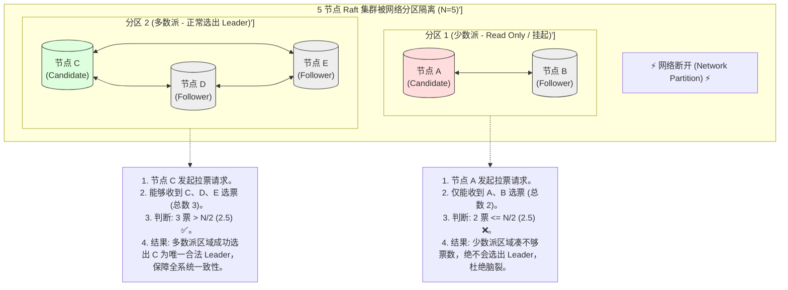
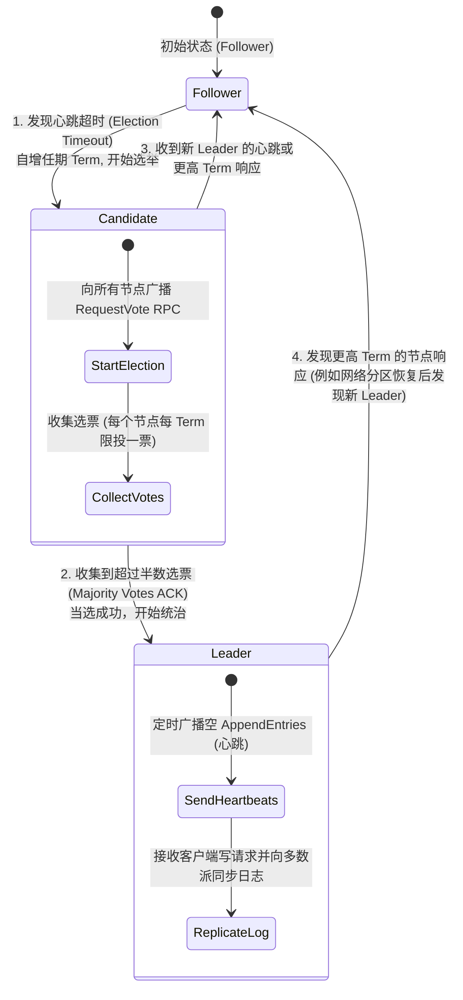
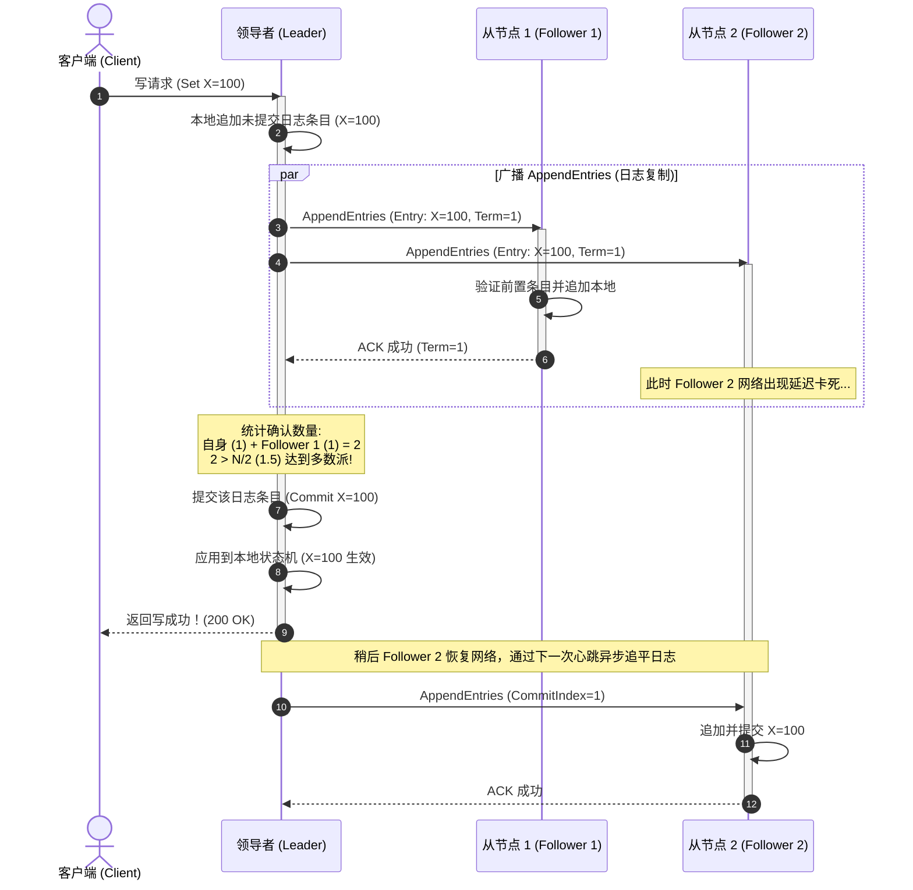

import GlossaryTerm from '@site/src/components/GlossaryTerm';
import GuidedExercise from '@site/src/components/GuidedExercise';
import ResearchNote from '@site/src/components/ResearchNote';
import ChapterMeta from '@site/src/components/ChapterMeta';
import PyRunner from '@site/src/components/PyRunner';
import TradeoffExplorer from '@site/src/components/TradeoffExplorer';
import QuizCard from '@site/src/components/QuizCard';

# M5L11 · 共识与协调

<ChapterMeta
  time="约 3 小时"
  prereqs={[{label: 'M5L9 复制', href: './replication'}, {label: 'M2L6 CAP', href: '../system-design-bridge/cap-consistency'}, {label: 'M3L11 一致性模式', href: '../data-cache-queue/consistency-patterns'}]}
  outcome="能解释共识要解决什么、Raft 的领导者选举 + 多数派 + 复制日志，并知道 ZooKeeper/etcd 这类协调服务用在哪。"
  howToUse="先看“主从复制里主挂了谁说了算”的难题，再理解 Raft 怎么用多数派选主，最后做领导者选举 lab。"
/>

:::tip 分布式系统最难的问题：让一群会失败的节点对一件事达成一致
[主从复制（M5L9）](./replication)里，主挂了要选新主——可如果两个从都觉得自己该当主呢（脑裂）？谁来裁定一个值最终是多少？在节点会崩溃、网络会延迟丢包的现实里，让多个节点对"谁是主""日志到第几条"达成**一致且不矛盾**，是分布式系统最核心、最难的问题。解决它的算法叫**共识（consensus）**。
:::

## 一、主挂了，谁来当新主？

主从复制看似简单，故障转移时却暗藏杀机：
- 主"看起来挂了"（其实只是网络分区，它还活着），从们选了新主——现在**两个主**都在接收写（<GlossaryTerm term="Split-brain" definition="脑裂：网络分区导致系统出现两个都认为自己是主的节点，各自接收写入，造成数据冲突和不一致。是故障转移最危险的失败模式。" >脑裂</GlossaryTerm>），数据冲突。
- 三个从同时发现主挂了，各自宣布"我当主"——选谁？
- 选主的决定本身存在多个节点上，这些节点又怎么对"选了谁"达成一致？

这是个"鸡生蛋"难题：要靠一致来选主，选主又是为了实现一致。共识算法（Paxos/Raft）就是来打破这个循环的。

## 二、三个核心概念（分层）

### 基础：共识与多数派



<GlossaryTerm term="Consensus" definition="共识：让分布式系统中的多个节点对某个值（如谁是主、日志的下一条是什么）达成一致，即使部分节点失败或网络延迟，也保证所有正常节点最终认同同一个不矛盾的结果。" >共识（consensus）</GlossaryTerm>要保证：即使部分节点崩溃、网络延迟，所有正常节点最终认同**同一个**值，且**不会出现两个矛盾的结果**。核心机制是<GlossaryTerm term="Quorum/Majority" definition="多数派：N 个节点中超过半数（N/2+1）。任何两个多数派必然有交集，所以“需多数派同意”能保证不会同时存在两个互相矛盾的决议——这是共识避免脑裂的关键。" >多数派（majority，N/2+1）</GlossaryTerm>：任何决定都要**超过半数**节点同意才生效。因为任意两个多数派必然相交，所以不可能同时存在两个矛盾的多数派决议——这从根上杜绝了脑裂。这也是为什么共识集群通常是**奇数个**（3、5）节点。

### 进阶：Raft 的领导者选举与复制日志



<GlossaryTerm term="Raft" definition="Raft：一种为可理解性设计的共识算法。把共识分解为领导者选举、日志复制、安全性三部分。系统选出一个 leader 统一接收写并复制日志给多数派，term（任期）+ 多数派投票保证任意时刻最多一个有效 leader。" >Raft</GlossaryTerm>把共识拆成几块，比 Paxos 易懂：

- **领导者选举**：每个节点有<GlossaryTerm term="Term" definition="任期：Raft 中单调递增的逻辑时钟。每次选举开启一个新 term。一个 term 内最多选出一个 leader，节点拒绝旧 term 的请求，从而保证不会有两个有效 leader。" >任期（term）</GlossaryTerm>。follower 等待心跳，超时没收到就发起选举（自增 term、给自己投票、拉票）；**拿到多数派选票**就成为该 term 的 leader。一个 term 内最多一个 leader（每个节点每 term 只投一票 + 多数派相交）。
- **日志复制**：leader 接收所有写、追加到自己的日志，复制给 follower；**多数派确认后**该条目才"提交"（commit）。
- **安全性**：只有日志足够新的节点能当选 leader，保证已提交的条目不丢。

### 深入（选学）：共识很贵，所以只用在"关键决定"上

共识需要多轮网络往返 + 多数派确认，**慢**（每个决定至少一个 RTT × 到多数派）。所以系统**不会**用共识同步每一条业务数据，而是：
- 用共识管"**少量但关键的元数据**"：谁是主、集群成员、配置、分布式锁、[分片映射](./partitioning-sharding)——这正是 <GlossaryTerm term="Coordination Service" definition="协调服务：如 ZooKeeper、etcd、Consul，内部用共识算法（ZAB/Raft）维护少量关键元数据（leader、配置、锁、成员），为其它系统提供可靠的选主、配置、服务发现能力。" >ZooKeeper / etcd</GlossaryTerm> 的职责。
- 业务数据量大，用[复制 + quorum（M5L9）](./replication)或弱一致，而非全程共识。
- Kafka 选 controller、Kubernetes 存集群状态（etcd）、数据库选主，背后都是"用一个共识服务管关键决定，其余走更轻的复制"。这是性能与一致的务实分层。
- FLP 不可能定理告诉我们：纯异步网络下共识无法同时保证安全和活性——Raft 用超时（<GlossaryTerm term="Randomized Election Timeout" definition="随机选举超时 (Randomized Election Timeout)：Raft 算法用来保障活性的一项核心设计。将每个节点的选举超时时间设为随机范围内的非固定值（例如 150ms ~ 300ms）。这样，当旧 leader 宕机时，几乎必然有一个节点最先超时并率先升为候选人发起投票，从而避免了多台机器齐步走发起选举、均分选票（Split Votes）而导致选举死锁。">随机选举超时</GlossaryTerm>）在工程上规避，代价是分区时可能短暂无 leader（[CAP 的 CP 取舍](../system-design-bridge/cap-consistency)）。

<ResearchNote
  title="Raft：让共识变得可理解"
  source="Ongaro & Ousterhout (2014), In Search of an Understandable Consensus Algorithm (Raft)；Lamport, Paxos；Chandra et al., Paxos Made Live"
  href="https://raft.github.io/raft.pdf"
  insight="Raft 把共识分解为领导者选举、日志复制、安全性三个相对独立的子问题，用 term + 多数派投票 + 日志新旧比较，保证任意时刻最多一个 leader、已提交日志不丢。它在等价于 Paxos 的安全性下大幅提升了可理解性，成为 etcd、Consul、TiKV 等的基础。"
  application="需要强一致的“关键决定”（选主、成员、配置、锁、元数据）用共识（直接用 etcd/ZooKeeper，别自己实现）。海量业务数据用复制 + quorum。理解多数派为什么避免脑裂、为什么集群要奇数节点、分区时为什么可能短暂不可写。"
/>

## 三、跟我做一遍：Raft 领导者选举（多数派投票）



<PyRunner
  rows={34}
  expect="多数派选出唯一 leader"
  code={`class Node:
    def __init__(self, nid):
        self.id = nid; self.term = 0; self.voted_for = None; self.role = "follower"

def request_vote(voter, candidate_id, term):
    # 收到拉票：term 更高、且本 term 还没投过票 -> 投赞成
    if term > voter.term:
        voter.term = term; voter.voted_for = candidate_id; return True
    if term == voter.term and voter.voted_for in (None, candidate_id):
        voter.voted_for = candidate_id; return True
    return False   # 旧 term 或本 term 已投别人 -> 拒绝

def elect(nodes, candidate):
    candidate.term += 1                      # 自增任期，发起选举
    candidate.role = "candidate"
    candidate.voted_for = candidate.id       # 先投自己
    votes = 1
    for n in nodes:
        if n is candidate: continue
        if request_vote(n, candidate.id, candidate.term):
            votes += 1
    if votes > len(nodes) // 2:              # 拿到多数派
        candidate.role = "leader"
        return "节点 %s 当选 leader (term=%d, %d/%d 票)" % (candidate.id, candidate.term, votes, len(nodes))
    return "选举失败，未达多数派"

nodes = [Node("A"), Node("B"), Node("C")]
print(elect(nodes, nodes[0]))                # A 发起，拿 A/B/C 多数 -> 当选

# 同一 term 里 B 也想当 leader：拿不到多数（大家本 term 已投 A）
print(elect(nodes, nodes[1]))                # B 自增 term 后能选上吗？看冲突
print("多数派选出唯一 leader")`}
/>

候选人自增任期、拉票，拿到多数派（>N/2）才当选；每个节点每个 term 只投一票，保证一个 term 最多一个 leader。**试试**：模拟"网络分区"——只让 A 能联系到 B（2 节点）、C 被隔离，看少数派那边（C 自己）永远选不出 leader（达不到多数派），从而避免脑裂。

## 四、动手 Lab（必做）

打开 `labs/month05/m5l11_raft_election/`：

```bash
python labs/month05/m5l11_raft_election/test_election.py
```

实现 Raft 领导者选举核心：term 投票规则、多数派当选、一个 term 最多一个 leader、少数派选不出。

<GuidedExercise
  title="练习指引：实现领导者选举"
  goal="把“term + 多数派投票 + 一票制”做成代码，亲手验证它如何保证唯一 leader、杜绝脑裂。"
  hints={[
    '每个节点有 term 和 voted_for；选举自增 term。',
    'request_vote：term 更高则投；term 相等且本 term 没投过(或投的就是它)才投。',
    '票数 > N//2 才当选。',
    '少数派（如分区后只剩 1/3 节点）永远凑不齐多数派，选不出 leader。'
  ]}
  steps={[
    '实现 Node（term/voted_for/role）。',
    '实现 request_vote(voter, candidate_id, term) 的投票规则。',
    '实现 elect(nodes, candidate)：自增 term、拉票、判断多数派。',
    '写测试：正常选出 leader、一个 term 最多一个 leader、更高 term 可重新选、少数派选不出。'
  ]}
  checks={[
    '你能解释共识要解决什么、脑裂怎么发生。',
    '你的选举靠多数派保证唯一 leader。',
    '你能说出为什么共识集群用奇数节点。',
    '你知道共识只用于关键元数据、业务数据走复制。'
  ]}
/>

## 架构师深潜（Staff+ 视角）

### 1. 一致性手段的谱系

<TradeoffExplorer
  title="从弱到强的一致性手段"
  dimensions={['一致性强度', '写性能', '可用性(分区时)', '实现/运维复杂度', '适用数据量']}
  options={[
    {
      name: '异步复制',
      scores: [2, 5, 5, 2, 5],
      note: '主写完就返回。快、高可用，但会丢未同步写、读到旧值。',
      whenToUse: '能容忍少量丢失/旧读的海量业务数据。'
    },
    {
      name: 'Quorum (W+R>N)',
      scores: [3, 3, 4, 3, 5],
      note: '可调一致、抗节点故障。无固定主、写冲突需补偿。',
      whenToUse: '高可用 + 可调一致的大规模数据（Dynamo 风格）。'
    },
    {
      name: '共识 (Raft/Paxos)',
      scores: [5, 2, 2, 5, 1],
      note: '强一致、线性化、无脑裂。但慢、分区时少数派不可写、运维复杂。',
      whenToUse: '少量关键元数据：选主、配置、锁、成员（用 etcd/ZK）。'
    }
  ]}
/>

### 2. 不要自己实现共识——但要懂它

共识算法实现极易出错（边界、持久化、成员变更），业界血泪共识是：**用成熟的 etcd/ZooKeeper/Consul，不要自己写 Raft**。但你必须**理解**它，才能：正确配置集群（奇数节点、跨可用区摆放）、理解"分区时少数派那侧为什么不可写"（CP）、知道把什么放进协调服务（关键元数据）、什么不放（海量业务数据）。这是"懂原理以正确使用"的典型——和你不会自己写数据库、但要懂索引一样。

### 3. 真实案例：协调服务是分布式系统的"大脑"

Kubernetes 用 etcd 存整个集群状态（Pod、Service、配置）；Kafka 早期用 ZooKeeper 选 controller、管元数据（新版用自带的 KRaft——把 Raft 内建）；很多数据库用共识做主选举和强一致复制组（Spanner 的 Paxos 组、TiDB 的 Raft）。这些系统把"难而关键的一致性决定"集中到一个共识核心，外围用更轻的复制/缓存承载流量——这种"共识管控制面、复制管数据面"的分层，是大型分布式系统的通用骨架。

### 4. 架构师深问（给自己 30 分钟）

- 你的系统在哪里需要"强一致的关键决定"（选主/分布式锁/配置）？该用 etcd/ZK 还是数据库的选主能力？
- 3 节点共识集群能容忍几个故障？5 节点呢？为什么是奇数？跨 3 个可用区怎么摆放？
- 网络分区时，共识集群的少数派那侧不可写（CP）。这对你的业务可接受吗？还是该选 AP 的 quorum 方案（[回扣 CAP](../system-design-bridge/cap-consistency)）？

## 自检清单

- [ ] 我能解释共识要解决什么、脑裂怎么发生。
- [ ] 我能讲清 Raft 的选举 + 多数派 + 复制日志。
- [ ] 我的 lab 用多数派投票选出唯一 leader、少数派选不出。
- [ ] 我知道共识用于关键元数据、业务数据走复制。

## 常见误解

- **"强共识算法（如 Raft/Paxos）是完美的分布式解决方案，我们应当将业务中的用户数据、订单明细等全部写入 Raft 强一致集群"**: 严重背离性能常识。共识算法为了确保绝对一致和防脑裂，引入了多轮网络 RPC 交互、多数派写盘确信、串行化投决等极重度的开销。其整体写吞吐量（QPS）往往只有几千级别，远远无法承载海量高并发业务写入。正确的分布式架构是：**共识仅用于管控面元数据（选主、锁、元数据路由），而实际的数据面业务数据则采用主从复制加 Quorum 仲裁**。
- **"我们可以部署一个 2 节点的 Raft 集群来节约服务器成本，同时获得高可用能力"**: 逻辑常识破产。Raft 的核心基石是多数派（Quorum）机制。由 $N=2$ 个节点组成的集群，其多数派数量为 $2/2 + 1 = 2$。也就是说，一旦其中任意 1 个节点发生宕机，剩余的 1 个节点将永远无法凑齐 2 票赞成（小于多数派），整个集群将瞬间陷入不可用状态。2 节点集群相比单机，高可用性不仅没有提升，反而因为双节点出故障概率翻倍而降低了。**共识集群的节点数必须是奇数且最小为 3**。
- **"我是一名高级后端工程师，为了展示自己的技术实力，我应当在生产系统中自己手写一套 Raft 算法实现"**: 灾难级别的工程自傲。分布式共识协议中存在海量难以穷尽的网络延迟边缘状态、单点崩溃日志对齐、成员动态变更死锁等设计巨坑。强如 etcd、ZooKeeper 的官方实现，也是经过全行业数年高强度压测和无数次线上故障才逐渐被打磨稳定。**在工业级生产中，不要自己实现共识，必须使用 etcd/etcd-raft 等现成的工业库，业务的核心挑战在于“正确配置、防范分区、合理建模”。**

## 常见误解自测

<QuizCard
  questions={[
    {
      q: '在 Raft 共识算法中，为什么说‘多数派（Majority, N/2+1）投票机制’能够彻底杜绝‘脑裂（Split-Brain）’异常？',
      options: [
        '因为多数派机制会通过物理切断非领导者节点的电源来防止其写入数据。',
        '根据抽屉原理（鸽巢原理），任意两个多数派集合必定在物理上重合至少一个节点。因此在同一个任期（Term）内，任何节点由于一票制（每人每任期限投一票），两个相互独立的候选人绝不可能同时集齐超过半数的赞成票，这从数学上排除了同时选出两个有效 Leader 的可能性。',
        '因为 Raft 在发生分区时会自动转换成主从复制模式，主库负责解决投票冲突。'
      ],
      answer: 1,
      explain: '多数派不相交定理是共识的基石。在 N=5 的集群中，任何多数派都必须包含至少 3 个节点，因此两个大小为 3 的集合必定有交集。这保证了同一时刻决议的唯一性。'
    },
    {
      q: 'FLP 不可能定理（FLP Impossibility Theorem）在理论上限制了分布式共识，Raft 算法在工程实践上是如何规避这一限制以保障‘活性（Liveness）’的？',
      options: [
        'Raft 通过引入‘随机选举超时（Randomized Election Timeout）’来打散节点发起选举的时间，避免候选人持续瓜分选票（Split Votes）而导致选举陷入无限僵局，从而在极大概率下确保了选举能够迅速收敛出唯一 Leader。',
        'Raft 抛弃了网络通信，全部改用物理共享内存来实现状态一致。',
        'Raft 强制要求集群中所有的服务器时钟必须实现 100% 绝对纳秒级同步。'
      ],
      answer: 1,
      explain: '随机选举超时的巧妙设计。FLP 定理指出，在纯异步网络中，哪怕只有一个节点可能失效，也不存在能百分百保证一致性且可终结的确定性共识算法。Raft 用随机超时这一非确定性机制打破了选票被均分的无限循环，是工程落地上的神来之笔。'
    },
    {
      q: '在生产高可用系统架构中，为什么我们几乎从不使用 Raft 或 Paxos 这类强共识算法来直接同步海量的用户订单或业务数据，而是通常用它存储哪些数据？',
      options: [
        '因为强共识算法代码实现非常简单，无法体现核心业务数据的复杂性。',
        '因为共识算法需要多轮网络 RTT 交互和多数派强同步，写吞吐非常低（通常在几千 QPS 级别），无法应对海量业务写。因此架构上通常将共识用于存储‘少量且关键的元数据’（如 ZooKeeper/etcd 中的配置、分布式锁、成员列表、分片路由表），而海量业务数据则采用主从异步复制或更轻量的 Quorum 读写方案。',
        '强共识服务只支持存储字符串，不支持存储 JSON 或二进制对象。'
      ],
      answer: 1,
      explain: '共识分层与务实取舍。共识服务是高可用架构的‘大脑’或‘仲裁者’。用 etcd 决定谁是写入主节点，再由该主节点用高性能的主从复制同步业务订单数据，是业界公认的高性能一致性分层设计模式。'
    }
  ]}
/>

## 延伸阅读

- [Raft Paper (Ongaro & Ousterhout, 2014)](https://raft.github.io/raft.pdf)
- [The Raft 可视化](https://raft.github.io/)
- [下一课：Capstone 设计高可用服务](./capstone-resilient-service)