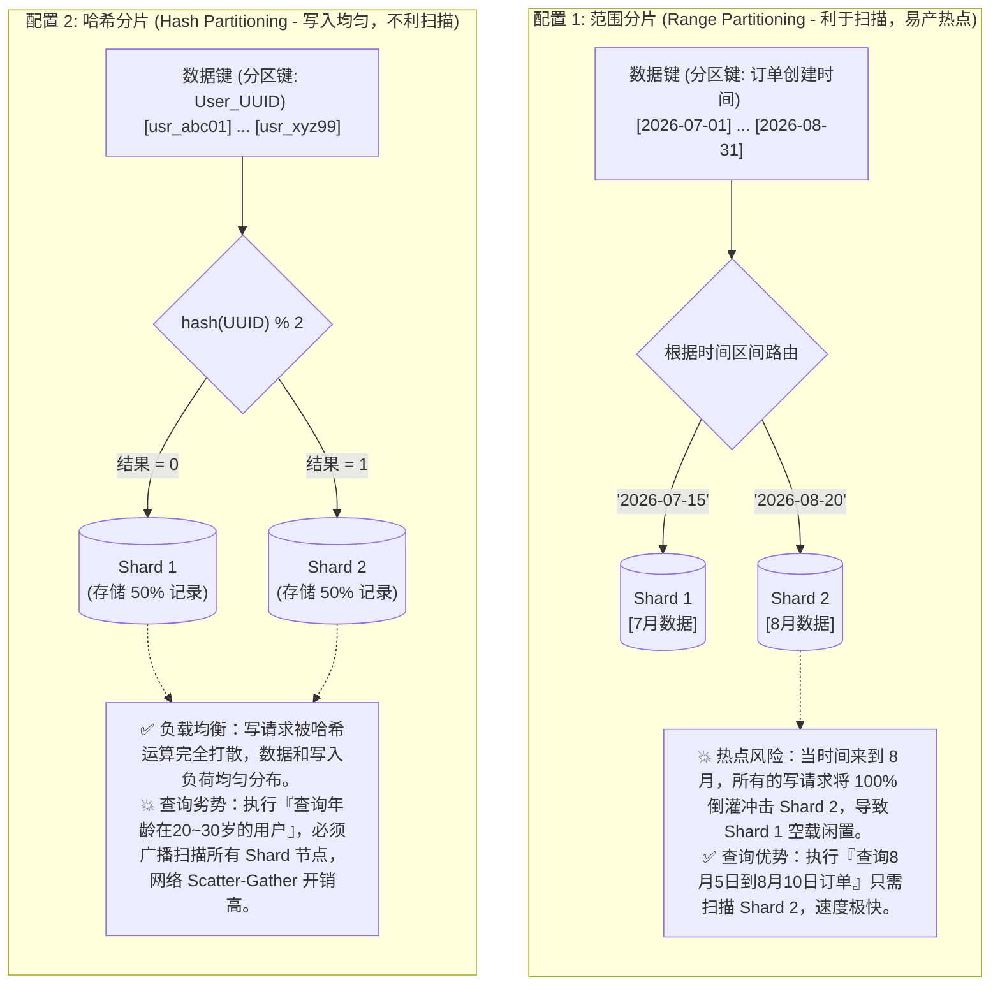
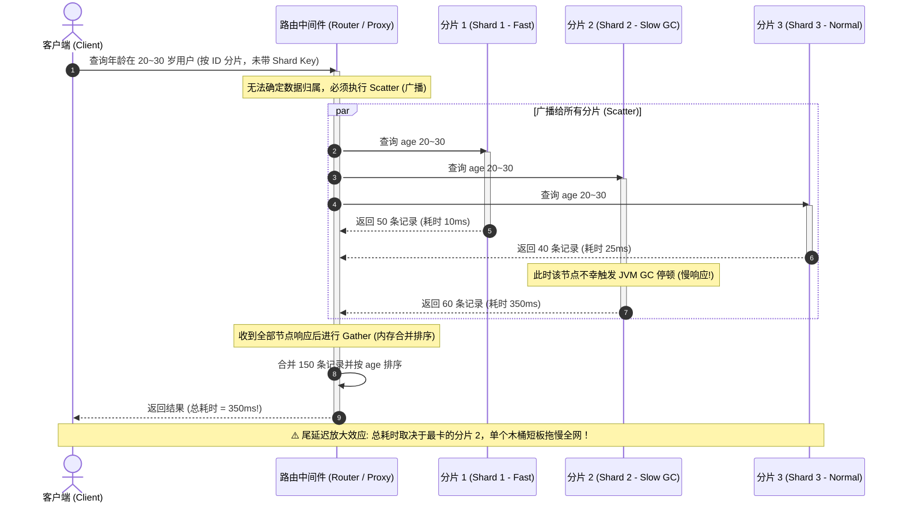

import GlossaryTerm from '@site/src/components/GlossaryTerm';
import GuidedExercise from '@site/src/components/GuidedExercise';
import ResearchNote from '@site/src/components/ResearchNote';
import ChapterMeta from '@site/src/components/ChapterMeta';
import PyRunner from '@site/src/components/PyRunner';
import TradeoffExplorer from '@site/src/components/TradeoffExplorer';
import QuizCard from '@site/src/components/QuizCard';

# M5L10 · 分区与分片

<ChapterMeta
  time="约 2.5 小时"
  prereqs={[{label: 'M5L1 一致性哈希', href: './load-balancing'}, {label: 'M5L9 复制', href: './replication'}, {label: 'M3L4 SQL/NoSQL', href: '../data-cache-queue/sql-vs-nosql'}]}
  outcome="能用哈希/范围分片把数据分到多台、识别热点与数据倾斜、用一致性哈希支持平滑再平衡，并理解分片对查询的影响。"
  howToUse="先看“单库放不下、写不动”的痛，再对比哈希/范围分片，最后做分片路由 + 再平衡 lab。"
/>

:::tip 复制解决“同一份数据放几份”，分片解决“数据多到一台放不下”
[复制（M5L9）](./replication)把**整份**数据拷到多台——但每台还是存了全量，单台的容量和写吞吐仍是上限。当数据大到一台装不下、或写多到一台扛不住，就要**分片（sharding）**：把数据**切开**，不同部分放不同机器。复制和分片正交，真实系统两者并用。
:::

## 一、单库的容量和写吞吐到顶了

你的订单表涨到 10 亿行、单库磁盘快满、写入开始变慢。加从库（复制）只能扩**读**——写还是全压在主库一台上，容量也还是一台的上限。唯一的出路：**把数据按某个 key 切成多片（shard/partition），分到多台机器**，每台只存一部分、只处理一部分写。问题随之而来：按什么切？切了之后怎么找数据？某片特别热怎么办？加机器时怎么搬数据？

## 二、三个核心概念（分层）

### 基础：哈希分片 vs 范围分片



<GlossaryTerm term="Sharding" definition="分片/分区：把一个大数据集按某个分区键切成多个子集（shard），分布到不同节点。每个节点只存一部分数据、处理一部分负载，从而突破单机容量和吞吐上限。" >分片（sharding）</GlossaryTerm>的两种基本切法：

- <GlossaryTerm term="Hash Partitioning" definition="哈希分片：对分区键做哈希再决定归属节点，数据分布均匀、不易热点。但范围查询要扫所有分片（数据被打散）。" >哈希分片</GlossaryTerm>：对 key 哈希决定归属。**分布均匀、不易热点**，但相邻 key 被打散——**范围查询要扫所有分片**。
- <GlossaryTerm term="Range Partitioning" definition="范围分片：按分区键的区间切分（如按时间、按字母段）。范围查询高效（连续数据在同一分片），但容易产生热点（如最新时间段的写全压在一个分片）。" >范围分片</GlossaryTerm>：按 key 区间切（如按时间/字母）。**范围查询高效**（连续数据在一片），但**容易热点**（如"最新订单"全压在最后一片）。

### 进阶：热点、数据倾斜与一致性哈希再平衡

```mermaid
flowchart TD
  subgraph SimpleHash["方案 A: 简单取模 hash(key) % N (扩容大地震)"]
    direction TB
    KeysA["旧节点数 N=3 时分配示例: <br/>key1->0, key2->1, key3->2, key4->0"]
    MigrateA{"节点数变为 N=4 (扩容)"}
    KeysA --> MigrateA
    MigrateA -->|"重新计算取模 hash(key) % 4"| ResultA["💥 结果: (3-1)/3 = 66% 以上的数据哈希路由改变！<br/>几乎全表数据都必须跨机器进行物理迁移，造成网络和磁盘彻底瘫痪！"]
  end

  subgraph PreSharding["方案 B: 固定虚拟分片/预分片 (Pre-sharding - 平滑再平衡)"]
    direction TB
    KeysB["数据键 (固定映射)"] -->|hash(key) % 1024| Slots["1024 个虚拟分片 (Slots 0~1023) <br/>映射关系永恒不变"]
    
    subgraph Allocation["路由拓扑分配与迁移"]
      Slots -->|0~340| Node1["节点 1 (扩容前)"]
      Slots -->|341~680| Node2["节点 2 (扩容前)"]
      Slots -->|681~1023| Node3["节点 3 (扩容前)"]
      
      NewNode["新节点 4 (扩容后)"]
      Node1 & Node2 & Node3 -.->|仅抽调部分 Slots 并搬迁其数据| NewNode
    end
    
    noteB["✅ 优势：每个键归属的 Slot 绝不漂移。扩容时，仅在后台迁移受影响的局部 Slots (如从各节点搬 85 个 Slot 到节点 4)。未搬迁的 75% 槽位读写正常，无需全量重排。"]
    NewNode -.-> noteB
  end
```

- <GlossaryTerm term="Hotspot" definition="热点：某个分片承担了远超其它分片的负载（如某个大V、某个爆款商品、最新时间段），成为瓶颈，抵消了分片的好处。" >热点（hotspot）</GlossaryTerm>/<GlossaryTerm term="Data Skew" definition="数据倾斜 (Data Skew)：在分布式系统分片存储中，由于 Shard Key 选择不佳，导致海量数据极度不均匀地囤积在极少数节点上，导致某些节点存储空间和 CPU 压力暴增，而其他节点却处于闲置状态，违背了分布式扩展的初衷。">数据倾斜</GlossaryTerm>：某片特别热（大V、爆款、最新时段），成为瓶颈。对策：更细的分区键、给热 key 加随机后缀打散、热点单独处理。
- **再平衡（rebalancing）**：加机器时怎么搬数据？朴素 `hash%N` 会让几乎所有数据重新分布（[M5L1 已证](./load-balancing)）。用<GlossaryTerm term="Consistent Hashing" definition="一致性哈希：把节点和键映射到哈希环，增删节点只迁移相邻一小段数据（~1/N），是分片平滑再平衡的基础（详见 M5L1）。" >一致性哈希</GlossaryTerm>（[M5L1](./load-balancing)）则只搬 ~1/N。生产系统还常用**固定数量的虚拟分片**（如预分 1024 个 partition，再把 partition 映射到物理节点），扩容时只迁移整个 partition、不重算哈希。

### 深入（选学）：分片把"简单操作"变难

分片的代价是查询和事务变复杂：
- **跨分片查询/聚合**：`SELECT ... ORDER BY` 跨所有分片要"分散-聚合"（scatter-gather），慢且放大[尾延迟](../foundations/performance-and-latency)。


- **跨分片事务**：单分片内可用本地事务，跨分片需分布式事务/[Saga（M3L11）](../data-cache-queue/consistency-patterns)，代价高——所以**分区键的选择极关键**：尽量让常一起访问的数据落在同一分片（如同一用户的所有订单同片）。
- **二级索引**：按非分区键查询很难，需要全局二级索引或按分区键反范式（[回扣 M3L2 索引](../data-cache-queue/indexing)）。
- **路由层**：客户端/代理要知道"key 在哪片"——靠分片映射表或一致性哈希计算。

<ResearchNote
  title="分区：突破单机上限的代价是查询复杂度"
  source="Kleppmann, DDIA 第 6 章 Partitioning；Google Bigtable（范围分片 tablet）；Amazon Dynamo（一致性哈希分区）"
  href="https://dataintensive.net/"
  insight="DDIA 指出分区的两种主流方式——按 key 范围（利于范围查询、易热点）和按 key 哈希（分布均匀、不利范围查询）——以及热点、再平衡、二级索引、请求路由四大难题。Bigtable 用范围分片（tablet 可分裂），Dynamo 用一致性哈希分区。"
  application="选分区键要兼顾“分布均匀”和“常一起访问的数据同片”。范围分片利于时间序/范围查询但要防热点；哈希分片均匀但范围查询贵。用一致性哈希或固定虚拟分片支持平滑再平衡。分片后尽量避免跨分片事务。"
/>

## 三、跟我做一遍：分片路由 + 平滑再平衡

<PyRunner
  rows={32}
  expect="再平衡只搬一小部分"
  code={`import hashlib, bisect
def h(s): return int(hashlib.md5(str(s).encode()).hexdigest(), 16)

# 固定虚拟分片法：预分 P 个 partition（key->partition 永不变），
# 再用“一致性哈希环”把 partition 分配到节点 —— 增删节点只迁移 ~1/N
P = 64
def partition_of(key): return h(key) % P          # key -> 固定 partition

def build_ring(nodes, vnodes=50):                  # 节点环（含虚拟节点）
    ring = {}
    for n in nodes:
        for v in range(vnodes):
            ring[h("%s#%d" % (n, v))] = n
    return sorted(ring), ring

def node_of(p, sorted_pts, ring):                  # partition 顺时针归属节点
    hp = h("partition-%d" % p)
    idx = bisect.bisect_left(sorted_pts, hp)
    if idx == len(sorted_pts): idx = 0
    return ring[sorted_pts[idx]]

def owner(key, sp, rg): return node_of(partition_of(key), sp, rg)

keys = ["order%d" % i for i in range(2000)]
sp3, rg3 = build_ring(["N1", "N2", "N3"])
before = {k: owner(k, sp3, rg3) for k in keys}

sp4, rg4 = build_ring(["N1", "N2", "N3", "N4"])    # 扩容一台
moved = sum(1 for k in keys if owner(k, sp4, rg4) != before[k])
print("扩容后迁移:", moved, "/", len(keys))         # ~1/4，远小于全量

from collections import Counter
print("分布:", dict(Counter(owner(k, sp4, rg4) for k in keys)))
print("再平衡只搬一小部分")`}
/>

key 到 partition 的映射**永不变**，扩容只改变"partition 到节点"的映射、只迁移少量 partition——这就是平滑再平衡。**试试**：把分区键从 `order_id`（哈希、均匀）换成"按 user_id 前缀范围"，构造一个大用户制造热点，观察某节点负载飙升。

## 四、动手 Lab（必做）

打开 `labs/month05/m5l10_sharding/`：

```bash
python labs/month05/m5l10_sharding/test_sharding.py
```

实现固定虚拟分片的路由：key 稳定映射到 partition、partition 映射到节点、扩容只迁移少量、检测热点。

<GuidedExercise
  title="练习指引：实现分片路由 + 再平衡"
  goal="把“固定 partition + 节点映射 + 平滑再平衡”做成代码，验证扩容只搬一小部分。"
  hints={[
    'partition_of(key) = hash(key) % P，P 固定，永不随节点数变。',
    'assign(nodes)：把 P 个 partition 分配给节点（只在节点变时重算）。',
    'owner(key) = node of partition_of(key)。',
    '扩容/缩容只改 partition->node 映射，key->partition 不变。'
  ]}
  steps={[
    '实现 partition_of(key, P)。',
    '实现 ShardRouter(nodes, P)：维护 partition->node，owner(key)。',
    '实现 rebalance(new_nodes)：重算映射并报告迁移量。',
    '写测试：同 key 稳定归属、扩容迁移远小于全量、分布大致均匀、检测某分片热点。'
  ]}
  checks={[
    '你能区分哈希分片和范围分片及取舍。',
    '你的再平衡只迁移一小部分数据。',
    '你能解释热点/数据倾斜及对策。',
    '你能说出分片为什么让跨分片查询/事务变难。'
  ]}
/>

## 架构师深潜（Staff+ 视角）

### 1. 分区策略对比

<TradeoffExplorer
  title="分区策略"
  dimensions={['分布均匀', '范围查询高效', '防热点', '再平衡平滑', '实现复杂度']}
  options={[
    {
      name: '范围分片',
      scores: [2, 5, 1, 3, 4],
      note: '按区间切。范围/排序查询高效，但最新数据易成热点。',
      whenToUse: '时间序、需要范围扫描的场景（日志、监控）。'
    },
    {
      name: '哈希分片',
      scores: [5, 1, 4, 3, 4],
      note: '哈希打散、分布均匀、不易热点。但范围查询要扫全部分片。',
      whenToUse: '点查为主、要均匀分布时——最常用。'
    },
    {
      name: '一致性哈希/固定虚拟分片',
      scores: [4, 1, 4, 5, 3],
      note: '哈希均匀 + 再平衡只搬 ~1/N。生产分片系统标配。',
      whenToUse: '需要频繁、平滑扩缩容时。'
    }
  ]}
/>

### 2. 分区键是分片系统最重要的设计决策

分区键一旦选错，后面全是痛：选了低基数键（如"省份"）→ 数据倾斜；选了不常一起查的键 → 处处跨分片查询/事务；选了单调递增键（如自增 ID/时间）→ 写热点全压最后一片。好的分区键要同时满足：**基数高（分得开）、分布均匀（不倾斜）、贴合访问模式（常一起访问的同片）**。这和 [L7 按查询建模](../foundations/data-modeling) 是同一思想在分布式层的延伸——**为访问模式设计数据布局**。

### 3. 真实案例：分库分表与原生分片

传统做法是应用层"分库分表"（按 user_id 取模路由到不同库），简单但再平衡痛苦、跨片查询要自己拼。现代做法是用原生支持分片的系统：Cassandra/DynamoDB（一致性哈希分区）、MongoDB（chunk + 范围/哈希）、Vitess（MySQL 分片中间件）、TiDB（Region 范围分片自动分裂迁移）。它们把路由、再平衡、跨片查询的复杂度下沉到存储层。理解原理，你才能用好它们、并知道它们的边界（跨片事务/查询仍贵）。

### 4. 架构师深问（给自己 30 分钟）

- 你最大的表该按什么分区键分片？它基数够高、分布够均、贴合查询吗？会不会有大 key 热点？
- 有个"按时间范围查 + 按用户查"的双重需求，单一分区键满足不了——你怎么办（二级索引/反范式/双写）？
- 分片 + 复制怎么组合？（每个分片再做主从复制：先分片再各自复制，扩容和故障转移分别怎么发生？）

## 自检清单

- [ ] 我能区分哈希分片和范围分片及取舍。
- [ ] 我的 lab 实现了稳定路由 + 平滑再平衡。
- [ ] 我能识别热点/数据倾斜并给出对策。
- [ ] 我理解分片让跨分片查询/事务变难，分区键是关键。

## 常见误解

- **"数据库分片路由很简单，直接在业务层代码使用 hash(key) % N 取模路由即可，不需要搞复杂的一致性哈希"**: 严重低估了生产环境下扩容/缩容（Rebalancing）的灾难性代价。使用简单取模时，一旦节点数 $N$ 发生变化，全网哈希映射将大范围错乱漂移，导致高达 $(N-1)/N$（如 3 变 4 时为 75%）的已有数据必须跨节点迁移。这不仅吞噬集群网络带宽，更可能引发数据库大面积宕机。因此生产分片系统必须使用 **一致性哈希** 或 **固定数量的预分片（Pre-sharding）** 技术实现平滑再平衡。
- **"数据库分片（Sharding）是完全透明的，分片之后我们的 SQL 查询和事务操作可以照旧写，不用管分区键是什么"**: 盲目乐观。分片后，如果你的 SQL 查询没有带上分区键（Shard Key），路由中间件就无法定位数据所在的分片，只能被迫向全网所有物理节点广播该查询（Scatter-Gather），性能暴跌且极度放大尾延迟。此外，跨分片的事务需要昂贵的 **分布式事务（如两阶段提交 2PC）** 或 Saga 补偿机制，其写入吞吐会跌落几个数量级。分区键的设计决定了分片系统的成败。
- **"既然哈希分片可以将数据打散，那么只要我们用了哈希分片，就绝对不可能再出现任何热点（Hotspot）与数据倾斜"**: 忽略了应用层“大 key”或“单点集中度”的客观事实。哈希分片虽然能保证不同的 Key 均匀分布在不同分片，但如果系统内存在极个别超高流量的单点 Key（例如微博上的热点大 V 用户、爆款抢购商品），该 Key 的所有读写依旧会被 100% 路由到同一个物理分片上，从而把那台机器瞬间打挂。**大 Key 热点必须在应用层打散（如拼随机后缀）或单独缓存处理**。

## 常见误解自测

<QuizCard
  questions={[
    {
      q: '在分片数据库设计中，范围分片（Range Partitioning）与哈希分片（Hash Partitioning）对‘范围查询（Range Query）’和‘写热点控制（Hotspot Prevention）’的权衡关系是什么？',
      options: [
        '范围分片会导致全局所有节点发生死锁，而哈希分片性能在任何查询下都比范围分片好。',
        '范围分片利于范围查询（相邻数据落在同一个分片内，只需扫描一片），但易产生写热点（如按自增 ID 或时间写入，最新数据全挤在末尾分片）；哈希分片能将写请求均匀分散到各个节点防范热点，但由于相邻键被打散，范围查询必须扫描所有分片（分散-聚集），代价昂贵。',
        '范围分片不支持添加二级索引，而哈希分片天然支持分布式事务。'
      ],
      answer: 1,
      explain: '分布式分片的经典取舍。没有完美的物理分区方式，选择 Shard Key 实质是在‘读的集中度’（Scatter-Gather 开销）与‘写的分散度’（防止热点）之间做平衡。'
    },
    {
      q: '当分片集群需要扩容添加新物理节点时，为什么在生产中极力避免使用最简单的 hash(key) % N 路由算法？应当如何优化？',
      options: [
        '因为哈希模 N 运算在 CPU 上的计算开销太大，会导致节点死机。',
        '因为当 N 从 3 变为 4 时，几乎所有既有数据的哈希路由地址都会发生漂移，触发全网大范围（高达 (N-1)/N = 75%）的数据大搬迁，导致网络和磁盘 I/O 瞬间过载崩溃。应当引入‘一致性哈希’或使用‘固定数量虚拟分片（Pre-sharding）’，只搬迁相邻一小段（~1/N）的数据。',
        '模 N 路由无法支持跨地域的多机房冗余备份部署。'
      ],
      answer: 1,
      explain: '再平衡（Rebalancing）的物理代价。大厂数据库扩容时，全量搬迁数据意味着长时间服务中断。虚拟分片（如 ElasticSearch 的 primary shards 映射，Redis Cluster 的 16384 插槽）或一致性哈希是平滑扩容的黄金基石。'
    },
    {
      q: '在分片架构中，什么是‘分散-聚集（Scatter-Gather）’查询？它对系统性能有何隐患？',
      options: [
        'Scatter-Gather 指客户端先下载全表，然后在本地浏览器内使用 JavaScript 进行数据聚合的低效过程。',
        '当查询过滤条件没有包含分区键（Shard Key）时，路由代理无法确定数据具体在哪个分片，只能被迫将请求广播发送给全部物理分片执行（Scatter），然后再将各片结果收集合并（Gather）。这种查询极度消耗集群算力，且查询的总延迟由响应最慢的那台‘慢节点’决定，严重放大尾延迟（Tail Latency）。',
        'Scatter-Gather 是专门用来修复发生损坏的分片数据库一致性的一种工具。'
      ],
      answer: 1,
      explain: 'Scatter-Gather 的尾延迟放大效应。木桶理论在分布式查询中的体现：广播查询的耗时由最卡的那台机器决定（比如恰好碰上 GC 暂停的那台），且广播严重破坏了分片水平扩展的初衷。'
    }
  ]}
/>

## 延伸阅读

- [DDIA 第 6 章: Partitioning](https://dataintensive.net/)
- [Google Bigtable (2006)](https://research.google/pubs/bigtable-a-distributed-storage-system-for-structured-data/)
- [下一课：共识与协调](./consensus-coordination)
