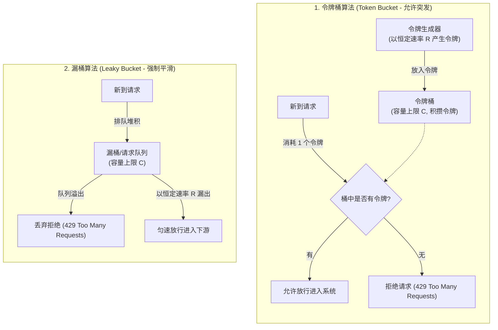
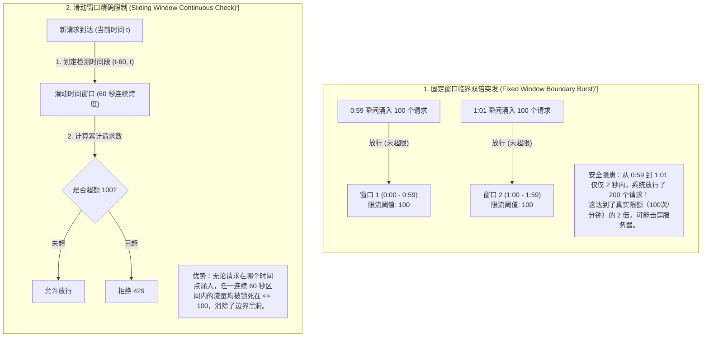
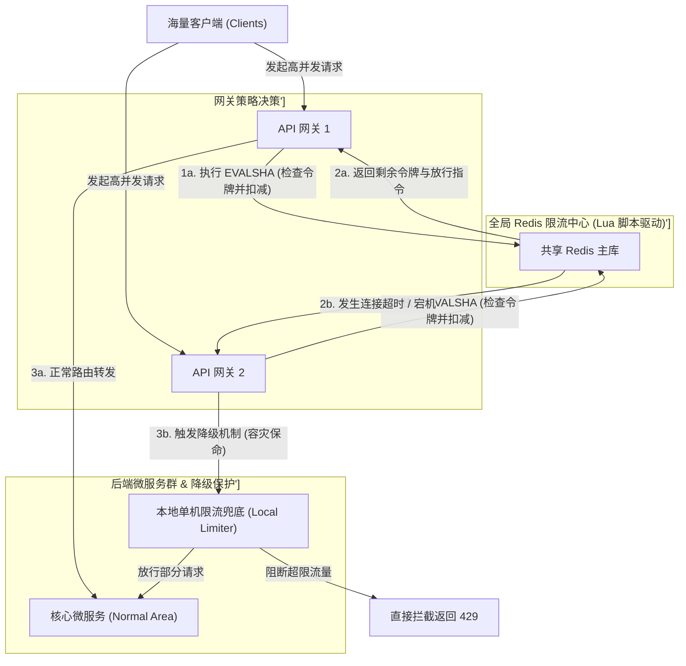

import GlossaryTerm from '@site/src/components/GlossaryTerm';
import GuidedExercise from '@site/src/components/GuidedExercise';
import ResearchNote from '@site/src/components/ResearchNote';
import ChapterMeta from '@site/src/components/ChapterMeta';
import PyRunner from '@site/src/components/PyRunner';
import TradeoffExplorer from '@site/src/components/TradeoffExplorer';
import QuizCard from '@site/src/components/QuizCard';

# M5L5 · 限流

<ChapterMeta
  time="约 2.5 小时"
  prereqs={[{label: 'M5L2 API 网关', href: './api-gateway'}, {label: 'L11 队列与背压', href: '../foundations/sync-async-timeout'}]}
  outcome="能用令牌桶/漏桶/滑动窗口实现限流，理解“允许突发 vs 平滑整形”的区别，并知道限流该放在哪一层。"
  howToUse="先看“突发流量打垮系统”的痛，再理解几种限流算法，最后做令牌桶 lab。"
/>

:::tip 限流不是把用户拒之门外，是让系统“活着拒绝”而不是“躺平崩溃”
当流量超过系统能力，你只有两个选择：要么主动丢弃一部分请求（限流），让其余请求正常服务；要么不管不顾全部接收，最后**所有人**都得到超时和错误。架构师选前者——**有损服务好过无服务。**
:::

## 一、一波突发流量，整个系统陪葬

促销开始、热点新闻、爬虫失控、上游重试风暴……流量瞬间冲到平时的 10 倍。没有限流，系统会照单全收：线程池占满、内存爆、数据库连接耗尽，然后**雪崩**——不仅扛不住的请求失败，连本来能服务的请求也一起死。限流的作用：**在入口处设一个闸，超过容量的请求快速拒绝（返回 <GlossaryTerm term="429 Too Many Requests" definition="429 Too Many Requests：HTTP 协议规定的状态码 (RFC 6585)，表示客户端发送的请求速率已超过限制。常伴随 Retry-After 头部告知调用方应该退避多久再重试。">429 状态码</GlossaryTerm>），保住系统对其余请求的服务能力。**

## 二、三个核心概念（分层）

### 基础：令牌桶——允许突发



<GlossaryTerm term="Token Bucket" definition="令牌桶：以固定速率往桶里放令牌（桶有上限），每个请求要拿走一个令牌才放行，拿不到就拒绝。平时攒下的令牌允许短时突发，长期速率受放令牌速率约束。" >令牌桶（Token Bucket）</GlossaryTerm>：以固定速率往桶里加令牌（桶有容量上限），每个请求消耗一个令牌，没令牌就拒绝。**妙处**：空闲时攒下的令牌，允许之后来一波**突发**（burst）；但长期平均速率仍被加令牌的速率限制住。这是最常用的限流算法。

### 进阶：漏桶 vs 滑动窗口



- <GlossaryTerm term="Leaky Bucket" definition="漏桶：请求进入一个固定容量的桶（队列），以恒定速率“漏出”被处理，桶满则丢弃。强制平滑输出速率，不允许突发。" >漏桶（Leaky Bucket）</GlossaryTerm>：请求排进固定容量的桶，以**恒定速率**漏出处理，桶满则丢。强制平滑、不允许突发——适合保护下游需要稳定速率的场景。
- <GlossaryTerm term="Sliding Window" definition="滑动窗口限流：统计最近一段时间窗口内的请求数，超过阈值则拒绝。比固定窗口更平滑，避免窗口边界处的双倍突发问题。" >滑动窗口</GlossaryTerm>：统计"最近 N 秒"内的请求数，超阈值就拒。比固定窗口计数更平滑（避免窗口边界的双倍突发）。

### 深入（选学）：单机限流 vs 分布式限流

单机限流（每个实例自己一个桶）简单，但有 10 个实例、每个限 100 <GlossaryTerm term="Queries Per Second" definition="每秒查询率 (QPS - Queries Per Second)：用来衡量系统在 1 秒内所能处理的读写请求/查询量的量化指标。在高并发限流场景中，QPS 常被设为限制的阈值单位。">QPS</GlossaryTerm>，全局其实放过了 1000 QPS——而且实例数一变全局阈值就漂。要**全局精确限流**，得把计数放到共享存储（如 Redis：`INCR` + 过期，或 Redis 实现的令牌桶），所有实例查同一个桶。代价是每次限流判断多一次网络往返（[回扣延迟](../foundations/performance-and-latency)）和对 Redis 的依赖。常见折中：**入口网关层做全局限流 + 各服务做单机兜底**。还要决定超额时是**拒绝（reject）**还是**排队等待（throttle）**——前者快速失败，后者削峰但增加延迟（[回扣 L11 背压](../foundations/sync-async-timeout)）。



<ResearchNote
  title="限流：用可控的拒绝换系统的存活"
  source="Google SRE Book — Handling Overload；Token Bucket / Leaky Bucket（流量整形经典算法）"
  href="https://sre.google/sre-book/handling-overload/"
  insight="Google SRE 强调过载时必须主动卸载（load shedding）和限流，否则会级联失败。令牌桶允许突发、漏桶强制平滑、滑动窗口精确计数——它们是流量整形的标准工具，最初源自网络 QoS。"
  application="任何对外接口都该有限流（按用户/IP/API key/全局多维度）。入口网关做粗粒度全局限流，服务内做细粒度兜底。选令牌桶（允许突发）还是漏桶（平滑）取决于下游能否吃突发。配合优先级，过载时优先保住高价值请求。"
/>

## 三、跟我做一遍：令牌桶限流

<PyRunner
  rows={30}
  expect="突发被允许、持续超速被限"
  code={`class TokenBucket:
    def __init__(self, rate, capacity):
        self.rate = rate          # 每秒加多少令牌
        self.capacity = capacity  # 桶容量（允许的突发上限）
        self.tokens = capacity    # 初始装满
        self.last = 0.0

    def allow(self, now, cost=1):
        # 按经过的时间补充令牌（不超过容量）
        self.tokens = min(self.capacity, self.tokens + (now - self.last) * self.rate)
        self.last = now
        if self.tokens >= cost:
            self.tokens -= cost
            return True           # 放行
        return False              # 拒绝（429）

# 限速 2 令牌/秒，桶容量 5（允许一次最多 5 个的突发）
tb = TokenBucket(rate=2, capacity=5)
# t=0 时一次性来 6 个请求：前 5 个有攒下的令牌 -> 放行，第 6 个被拒
res = [tb.allow(0) for _ in range(6)]
print("突发 6 个:", res)            # 5 True, 1 False

# 1 秒后补充了 2 个令牌
print("1 秒后:", tb.allow(1.0))     # True（又有令牌了）
print("紧接着:", tb.allow(1.0))     # True
print("再一个:", tb.allow(1.0))     # False（这秒的令牌用完）
print("突发被允许、持续超速被限")`}
/>

桶里攒下的令牌让"偶尔突发"被允许，但持续超过 2/秒就会被拒——既不一刀切扼杀突发，又守住长期速率。**试试**：把 `capacity` 调成 1（不允许突发，退化成严格匀速）；再实现一个漏桶对比"平滑输出"的差异。

## 四、动手 Lab（必做）

打开 `labs/month05/m5l5_rate_limit/`：

```bash
python labs/month05/m5l5_rate_limit/test_rate_limit.py
```

实现令牌桶限流器：按时间补充令牌、允许受控突发、超额拒绝。

<GuidedExercise
  title="练习指引：实现令牌桶限流"
  goal="把“按时间补令牌 + 突发 + 拒绝”做成代码——这是最常用的限流算法。"
  hints={[
    'tokens 按 (now - last) * rate 补充，但不超过 capacity。',
    'allow(now)：先补令牌，够就扣 1 放行，不够就拒绝。',
    'capacity 决定允许的突发大小；rate 决定长期速率。',
    '别忘了更新 last = now。'
  ]}
  steps={[
    '实现 TokenBucket(rate, capacity)，初始装满。',
    'allow(now, cost=1)：补令牌→判断→扣减或拒绝。',
    '写测试：初始突发可放 capacity 个、之后被拒、隔一段时间又能放、长期速率不超 rate。',
    '（选做）再实现一个漏桶 LeakyBucket，对比突发行为。'
  ]}
  checks={[
    '你能解释限流为什么是“有损服务好过无服务”。',
    '你的令牌桶允许受控突发、超额拒绝。',
    '你能区分令牌桶（允许突发）和漏桶（强制平滑）。',
    '你能说出单机限流和分布式限流的差异。'
  ]}
/>

## 架构师深潜（Staff+ 视角）

### 1. 限流算法怎么选

<TradeoffExplorer
  title="限流算法对比"
  dimensions={['允许突发', '输出平滑', '实现简单', '内存开销', '精确度']}
  options={[
    {
      name: '固定窗口计数',
      scores: [3, 1, 5, 5, 2],
      note: '每窗口计数清零。简单省内存，但窗口边界可能放过 2 倍突发。',
      whenToUse: '粗粒度、能容忍边界误差时。'
    },
    {
      name: '令牌桶',
      scores: [5, 3, 4, 4, 4],
      note: '允许攒令牌后突发，长期受 rate 限制。最通用。',
      whenToUse: '默认选择：既要限速又要容忍合理突发。'
    },
    {
      name: '漏桶',
      scores: [1, 5, 4, 4, 4],
      note: '恒定速率漏出、强制平滑、不允许突发。保护脆弱下游。',
      whenToUse: '下游只能吃稳定速率（如写第三方限速 API）。'
    },
    {
      name: '滑动窗口日志',
      scores: [3, 4, 2, 1, 5],
      note: '记录每个请求时间戳、最精确。但内存随请求数增长。',
      whenToUse: '需要高精度、量不大的限流。'
    }
  ]}
/>

### 2. 限流是过载保护的一环，要配合卸载与优先级

限流（拒绝超额）只是过载保护的第一步。完整的过载策略还包括：<GlossaryTerm term="Load Shedding" definition="负载卸载：系统接近过载时主动丢弃部分请求（通常优先丢低价值/低优先级的），以保住核心请求的服务质量，避免全面崩溃。">负载卸载</GlossaryTerm>（接近过载时优先丢低价值请求）、**优先级队列**（保住付费/核心请求）、[背压（L11）](../foundations/sync-async-timeout)（把压力反馈给上游让它慢下来）。架构师要让系统在过载时**优雅降级**（degrade）而非崩溃——这是 [M2L11 容错](../system-design-bridge/reliability-fault-tolerance) 的核心能力。

### 3. 真实案例：每个公共 API 背后都有限流

你调用任何云 API、支付接口、第三方服务，都会遇到 429 和 `Retry-After`——那就是限流。平台用它防滥用、保公平、控成本。自己做平台时，限流维度通常是多层的：全局、每租户、每 API key、每 IP、每接口。理解限流，你才能既保护自己的系统，又在调用别人时正确地[退避重试（下下课）](./retry-backoff-timeout)。

### 4. 架构师深问（给自己 30 分钟）

- 你的接口该按什么维度限流（用户/IP/key/全局）？突发容量设多大才既防攻击又不误伤正常用户？
- 10 个实例要全局限流到 1000 QPS，用 Redis 集中计数 vs 每实例 100 QPS，各有什么问题？实例扩缩容时呢？
- 超额时你选"立即拒绝 429"还是"排队等待"？分别适合什么场景（[回扣背压](../foundations/sync-async-timeout)）？

## 自检清单

- [ ] 我理解限流是"有损服务好过无服务"。
- [ ] 我的 lab 令牌桶允许突发、超额拒绝、长期受 rate 限制。
- [ ] 我能区分令牌桶/漏桶/滑动窗口。
- [ ] 我知道单机限流与分布式限流的差异和取舍。

## 常见误解

- **"限流操作会对用户体验造成不良影响，一个优秀的架构师应当通过无限自动水平扩容来承载一切突发流量，而不是生硬地返回 429 错误"**: 极度危险的理想化思维。在促销爆发、重试风暴或遭恶意 DDoS 攻击时，系统的并发可能会瞬间拉升数倍乃至数十倍，扩容速度根本跟不上流量上涨速率；此外，下游数据库或某些单点写锁服务根本无法做到无限扩容。如果不设防线，全站数据库打爆会让 100% 的用户陷入绝望。限流是**“有损服务好过全网瘫痪”**的生还艺术。
- **"令牌桶和漏桶本质上都是通过水桶进行流量控速的，它们完全是一回事，可以无脑互相替代"**: 混淆了核心流量整形特性。**令牌桶（Token Bucket）** 关注的是控制长期平均发送速率，但允许在短期内将此前积攒下来的令牌瞬间消费掉，即**允许合理的突发流量（Burst）**；而 **漏桶（Leaky Bucket）** 则像一个漏斗，强制所有进入请求排队，并以**绝对恒定的平滑速率**漏出，绝不允许任何突发流量。漏桶常用于保护极其脆弱、一冲就跨的下游（如慢速物理写磁盘或慢速第三方支付 API）。
- **"单机限流足够简单且无网络延迟，我们只需要在 10 个实例上各自限 100 QPS，就能完美实现全局 1000 QPS 的限流目的，不需要引入 Redis 分布式限流中心"**: 忽视了集群流量分布不均与拓扑变化的动态效应。在实际生产环境中，由于负载均衡分配不均，可能某台机器已经分到 150 QPS（触发本地 429），而另外几台机器只有 10 QPS（闲置），导致全局请求量远未达到 1000 QPS 就有正常用户被错误拦截。此外，当实例缩容到 5 台或扩容到 20 台时，全局限速阈值会发生剧烈漂移。要想实现**高精度全局额度控制**，必须使用共享存储（如 Redis Lua 脚本）维护全局计数。

## 常见误解自测

<QuizCard
  questions={[
    {
      q: '在微服务网关限流方案中，‘令牌桶（Token Bucket）’与‘漏桶（Leaky Bucket）’最核心的流量整形特性差异是什么？在何种业务场景下必须使用漏桶？',
      options: [
        '令牌桶不能限制长期速率，漏桶可以限制。',
        '令牌桶允许一定程度的突发流量（由于可以攒令牌），而漏桶强制将输出流量平滑为绝对恒定的速率。如果下游微服务非常脆弱、或者对接的是有严格频率限制的第三方支付 API（如每秒最多打10次），此时必须使用漏桶平滑流量，防止突发流量击崩下游。',
        '漏桶可以存储令牌，所以能提供更高的瞬间 QPS。'
      ],
      answer: 1,
      explain: '令牌桶与漏桶的经典取舍。令牌桶的攒令牌设计极适合应对网络偶发抖动或正常业务突发；漏桶则是一个彻底的‘队列整形器’，它用恒定漏出速度熨平任何洪峰，但对客户端来说排队等待延迟较长。'
    },
    {
      q: '固定窗口计数限流（Fixed Window Counter）在什么情况下会失效，导致实际进入系统的流量达到预设限额的 2 倍？滑动窗口是如何解决这一缺陷的？',
      options: [
        '当网络延迟过大时，固定窗口失效。',
        '在窗口边界点附近出现高并发流量暴涨。如果限制每分钟 100 次，攻击者在第 59 秒发送 100 个请求，在下一分钟的第 1 秒又发送 100 个请求。对于两个固定窗口而言都没超额，但在连续的 2 秒内系统却承受了 200 次请求。滑动窗口通过维护一个连续滑动的区间（如记录历史请求时间戳），精准过滤掉任何跨窗口边界的累积超额流量。',
        '固定窗口通过 Redis 存储容易发生数据丢失，导致计数器被重置。'
      ],
      answer: 1,
      explain: '固定窗口的临界点双倍突发（Boundary Burst）缺陷。滑动窗口（Sliding Window）通过细分微窗口或记录滑动区间日志，平滑地消除了时间临界点的统计偏差，是更精确的限流计数方式。'
    },
    {
      q: '在进行分布式集群限流（Distributed Rate Limiting）时，使用共享 Redis 存储（基于 Lua 脚本或 INCR）进行全局限流判断，可能带来哪些工程代价？架构师应如何做容灾？',
      options: [
        '会导致客户端完全无法建立 TCP 连接。',
        '每次限流判定都要与 Redis 进行网络交互，增加了整体接口的网络延迟（RTT），且 Redis 本身可能成为高并发下的新性能瓶颈与 SPOF 单点。容灾策略应包括：网关内部进行‘限流降级保护’，一旦 Redis 发生连不上或超时，自动退化为各网关单机的局部限流（Local Rate Limiter），确保网关本身不挂。',
        'Redis 会因为频繁调用 Lua 脚本导致内存直接溢出崩溃。'
      ],
      answer: 1,
      explain: '分布式限流的延迟与可用性妥协。网络交互开销和 Redis 高可用是核心架构问题。设计优良的系统必须提供‘降级机制’，当分布式限流层失效时，能自动兜底并以本地单机限流继续守护，保证系统生还。'
    }
  ]}
/>

## 延伸阅读

- [Google SRE: Handling Overload](https://sre.google/sre-book/handling-overload/)
- [Stripe: Rate Limiters](https://stripe.com/blog/rate-limiters)
- [下一课：熔断与降级](./circuit-breaker)
