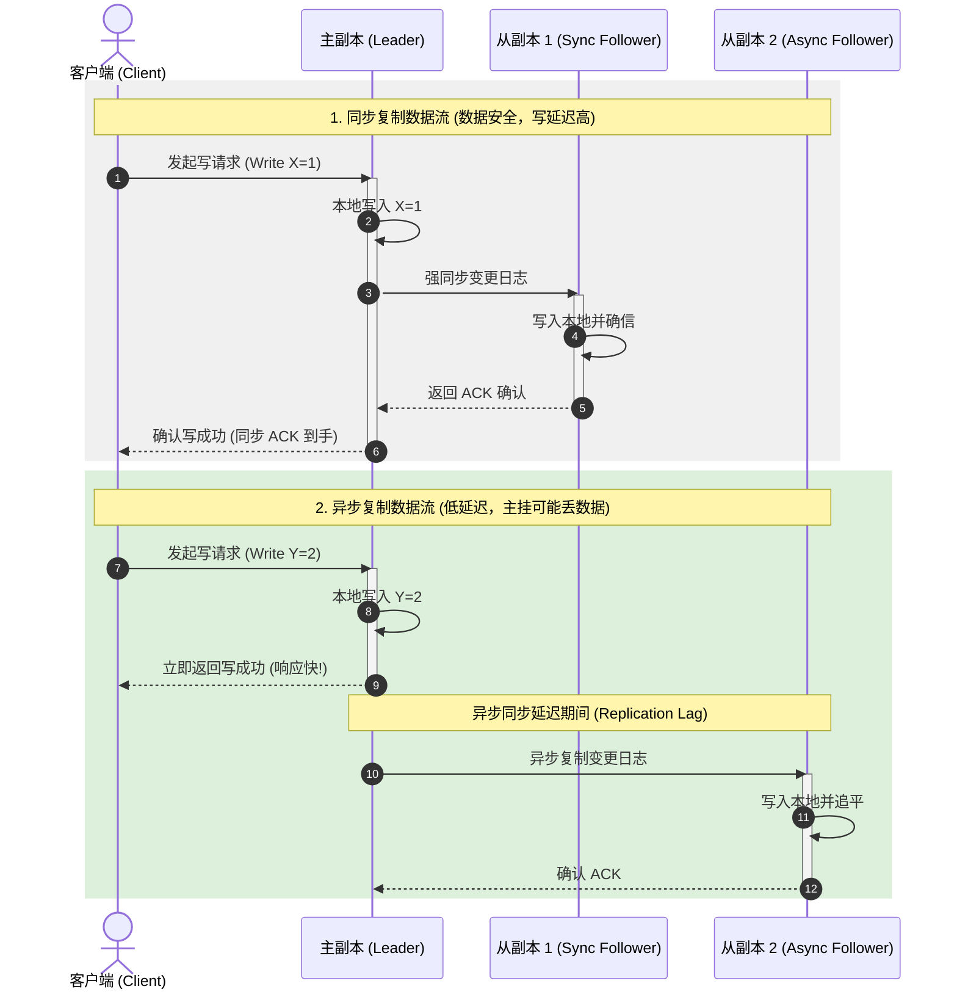
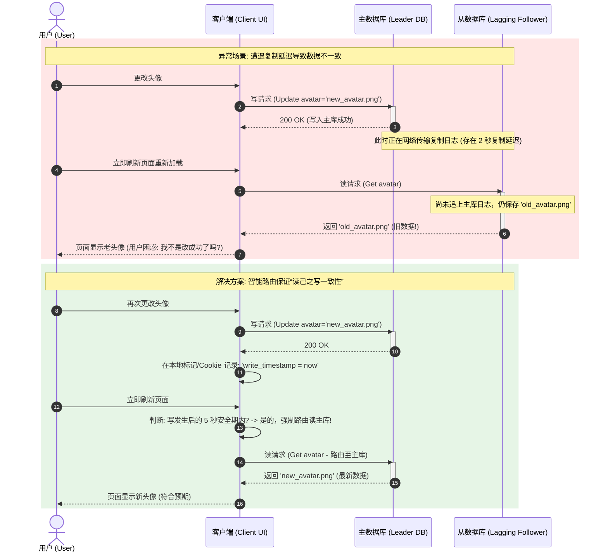
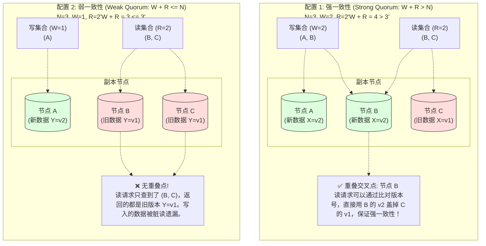

import GlossaryTerm from '@site/src/components/GlossaryTerm';
import GuidedExercise from '@site/src/components/GuidedExercise';
import ResearchNote from '@site/src/components/ResearchNote';
import ChapterMeta from '@site/src/components/ChapterMeta';
import PyRunner from '@site/src/components/PyRunner';
import TradeoffExplorer from '@site/src/components/TradeoffExplorer';
import QuizCard from '@site/src/components/QuizCard';

# M5L9 · 复制

<ChapterMeta
  time="约 2.5 小时"
  prereqs={[{label: 'M2L6 CAP 与一致性', href: '../system-design-bridge/cap-consistency'}, {label: 'M3L11 一致性模式', href: '../data-cache-queue/consistency-patterns'}]}
  outcome="能区分主从/多主/无主复制、解释复制延迟和读己之写问题，并用读写法定人数（quorum）在一致性和可用性间取舍。"
  howToUse="先看“单库一挂全完”的痛，再理解三种复制拓扑，最后做 quorum 读写 lab。"
/>

:::tip 复制是高可用和可扩展读的基础，但它让“数据有几份”这件事变复杂
把数据只放一台机器，它一挂就丢数据、停服务。所以要**复制（replication）**到多台。但一旦数据有多份，新问题就来了：写哪份？读哪份？多份不一致怎么办？一台落后了算不算还活着？复制是分布式数据的起点，也是 [CAP（M2L6）](../system-design-bridge/cap-consistency) 真正落地的地方。
:::

## 一、单库的三个死穴

数据只在一台机器上：
1. **它挂了 = 服务停**（没有备份顶上）。
2. **它磁盘坏了 = 数据永久丢失**。
3. **所有读都压在它身上**，读扩展不了。

复制同时解决这三个：多副本提供**故障切换**（高可用）、**数据冗余**（防丢）、**读扩展**（读分散到副本）。代价是引入"多副本如何保持一致"的复杂度。

## 二、三个核心概念（分层）

### 基础：主从复制（leader-follower）

最常见的拓扑：<GlossaryTerm term="Leader-Follower Replication" definition="主从复制：一个主副本（leader）接收所有写，把变更按日志同步给多个从副本（follower）；读可以走任意副本。主挂了需选出新主。是最常见的复制拓扑。" >主从复制</GlossaryTerm>。一个**主（leader）**接收所有写，把变更（复制日志，[回扣 M2L10 日志](../system-design-bridge/communication-decoupling)）同步给多个**从（follower）**；读可以走任意副本。主挂了，从里选一个升为新主（[故障转移](./service-discovery)）。优点：写有单一权威、无写冲突；缺点：主是写的单点瓶颈、故障转移有窗口。

### 进阶：同步 vs 异步复制、复制延迟



- <GlossaryTerm term="Synchronous Replication" definition="同步复制：主必须等从确认收到变更后才向客户端返回成功。不丢数据（从有最新），但写延迟高、从挂了会拖住主。" >同步复制</GlossaryTerm>：主等从确认才返回。不丢数据，但写慢、从故障会拖主。
- <GlossaryTerm term="Asynchronous Replication" definition="异步复制：主写完本地就返回，变更稍后才传给从。写快、主不被从拖累，但主崩溃时尚未同步的写会丢失，从也可能读到旧数据。" >异步复制</GlossaryTerm>：主写完就返回，稍后再同步给从。写快，但主崩溃可能丢未同步的写。
- 由此产生<GlossaryTerm term="Replication Lag" definition="复制延迟：从副本落后于主副本的时间差。异步复制下从可能读到旧数据，导致“读己之写”（刚写完读自己却读到旧值）等异常。" >复制延迟（replication lag）</GlossaryTerm>：从落后于主。典型 bug：用户改完资料（写主），刷新页面（读从）却看到旧值——**<GlossaryTerm term="Read-Your-Writes Consistency" definition="读己之写一致性 (Read-Your-Writes Consistency)：亦称‘写后读一致性’。指系统必须保证，当某个用户发起数据写操作成功后，该用户后续发起的所有读取操作，都必须能读到自己刚刚写入的最新值，而绝不能读到过期的旧版本。">读己之写（read-your-writes）</GlossaryTerm>**问题。解法如"自己的写后一段时间读主"。



### 深入（选学）：多主、无主与法定人数

- <GlossaryTerm term="Multi-Leader Replication" definition="多主复制：多个副本都能接收写（如多数据中心各有一个主），再互相同步。写延迟低、可跨区域写，但会产生写冲突，需要冲突解决策略。" >多主（multi-leader）</GlossaryTerm>：多个副本都能写（如跨数据中心），互相同步。可就近写、抗区域故障，但会有**写冲突**，需冲突解决（last-write-wins、CRDT 等）。
- <GlossaryTerm term="Leaderless Replication" definition="无主复制：没有固定主，客户端直接向多个副本读写，用法定人数（quorum）保证一致性（Dynamo 风格）。高可用、抗故障，但一致性较弱，需读修复等机制。" >无主（leaderless，Dynamo 风格）</GlossaryTerm>：没有固定主，客户端直接向多个副本读写，靠<GlossaryTerm term="Quorum" definition="法定人数：N 个副本中，写要至少 W 个确认、读要至少 R 个响应。当 W + R > N 时，读集合与写集合必有交集，从而读到最新写——这是无主复制的一致性保证。" >法定人数（quorum）</GlossaryTerm>保证一致：N 个副本，写需 W 个确认、读需 R 个响应，只要 **W + R > N**，读写集合必有交集，就能读到最新写。调 W/R 即在一致性、延迟、可用性间滑动——这正是 [CAP/PACELC](../system-design-bridge/cap-consistency) 的工程旋钮。



<ResearchNote
  title="复制：从主从到无主仲裁"
  source="Kleppmann, DDIA 第 5 章 Replication；DeCandia et al. (2007), Dynamo（quorum、读修复）"
  href="https://www.allthingsdistributed.com/files/amazon-dynamo-sosp2007.pdf"
  insight="DDIA 系统梳理了三种复制：单主（简单、无冲突、有故障转移窗口）、多主（可多写、需解决冲突）、无主（quorum 读写、高可用、弱一致）。Dynamo 用 W+R>N 的法定人数 + 读修复 + 提示移交，在可用性优先的前提下提供可调一致性。"
  application="选复制拓扑：默认单主（绝大多数关系库）；跨区域低延迟写考虑多主（接受冲突解决）；要极高可用、可调一致用无主 quorum。始终要处理复制延迟带来的“读己之写”等异常。"
/>

## 三、跟我做一遍：Quorum 读写（W + R > N）

<PyRunner
  rows={32}
  expect="quorum 保证读到最新"
  code={`class Replica:
    def __init__(self, name): self.name = name; self.store = {}; self.up = True
    def write(self, key, value, version):
        if not self.up: raise RuntimeError("副本宕机")
        self.store[key] = (value, version)
    def read(self, key):
        if not self.up: raise RuntimeError("副本宕机")
        return self.store.get(key, (None, -1))

class QuorumDB:
    def __init__(self, replicas, W, R):
        self.replicas = replicas; self.W = W; self.R = R; self.version = 0
    def write(self, key, value):
        self.version += 1
        acks = 0
        for r in self.replicas:
            try: r.write(key, value, self.version); acks += 1
            except RuntimeError: pass
        if acks < self.W: raise RuntimeError("写未达 quorum W")
        return "写成功 (%d/%d 确认)" % (acks, len(self.replicas))
    def read(self, key):
        results = []
        for r in self.replicas:
            try: results.append(r.read(key))
            except RuntimeError: pass
        if len(results) < self.R: raise RuntimeError("读未达 quorum R")
        return max(results, key=lambda vv: vv[1])  # 取版本最高的（最新）

reps = [Replica("A"), Replica("B"), Replica("C")]
db = QuorumDB(reps, W=2, R=2)   # N=3, W+R=4>3 -> 强一致
print(db.write("x", "v1"))
reps[0].up = False              # 挂一台 A
print(db.write("x", "v2"))      # 仍能写（B、C 达 W=2）
print("读到:", db.read("x"))    # 读 B、C 仍能拿到最新 v2
print("quorum 保证读到最新")`}
/>

W+R>N 保证读集合和写集合必有交集，即使挂一台也能读到最新写。**试试**：把 W、R 都调成 1（W+R=2 ≤ N=3），制造"写到 A、读到 B"读不到最新的场景，体会弱 quorum 的不一致。

## 四、动手 Lab（必做）

打开 `labs/month05/m5l9_quorum/`：

```bash
python labs/month05/m5l9_quorum/test_quorum.py
```

实现 quorum 读写：W/R 可配、容忍部分副本宕机、读返回最新版本、不达 quorum 报错。

<GuidedExercise
  title="练习指引：实现 quorum 读写"
  goal="把“W+R>N 的法定人数读写”做成代码，亲手验证它在副本宕机下仍保证一致。"
  hints={[
    '每个副本存 (value, version)；写带递增版本号。',
    '写：向所有副本写，统计成功 ack，< W 则失败。',
    '读：从所有可读副本收集，< R 则失败；返回 version 最大的。',
    '宕机副本读写抛错，不计入 ack/结果。'
  ]}
  steps={[
    '实现 Replica：write/read，可标记 up=False 模拟宕机。',
    '实现 QuorumDB(replicas, W, R)：write 统计 ack、read 取最新版本。',
    '不达 quorum 抛错。',
    '写测试：W+R>N 挂一台仍一致、达不到 W/R 报错、读返回最新版本。'
  ]}
  checks={[
    '你能区分主从/多主/无主复制。',
    '你的 quorum 在 W+R>N 时保证读到最新。',
    '你能解释复制延迟和读己之写问题。',
    '你能说出调 W/R 如何在一致性/可用性间滑动。'
  ]}
/>

## 架构师深潜（Staff+ 视角）

### 1. 复制拓扑对比

<TradeoffExplorer
  title="复制拓扑"
  dimensions={['写简单/无冲突', '写可用性', '跨区域低延迟写', '读扩展', '一致性强度']}
  options={[
    {
      name: '单主（leader-follower）',
      scores: [5, 3, 1, 4, 4],
      note: '唯一写入点、无冲突、有故障转移。但主是写瓶颈、切换有窗口。',
      whenToUse: '绝大多数场景（MySQL/PostgreSQL 默认）。'
    },
    {
      name: '多主（multi-leader）',
      scores: [2, 5, 5, 4, 2],
      note: '多点可写、可就近、抗区域故障。但有写冲突要解决，一致性弱。',
      whenToUse: '多数据中心、离线编辑、需就近低延迟写时。'
    },
    {
      name: '无主（quorum）',
      scores: [3, 5, 4, 5, 3],
      note: '高可用、可调一致（W/R）、抗节点故障。一致性需读修复等补偿。',
      whenToUse: '要极高可用 + 可调一致（Cassandra/DynamoDB 风格）。'
    }
  ]}
/>

### 2. 复制把 CAP 从理论变成旋钮

[M2L6 CAP](../system-design-bridge/cap-consistency) 说分区时要在 C 和 A 之间选。复制就是那个选择发生的地方：同步复制偏 C（等确认，慢但不丢/一致）、异步复制偏 A（快但可能丢/读旧）、quorum 的 W/R 让你**连续调节**这个旋钮。架构师设计存储时，要明确："这份数据丢一条能接受吗？读到 1 秒前的旧值能接受吗？"——答案决定你的复制和 quorum 配置。

### 3. 真实案例：从 MySQL 主从到 Spanner

绝大多数业务用 MySQL/PostgreSQL 主从 + 异步复制 + 读写分离（主写、从读）扛过去，配合"关键读走主"解决读己之写。要跨区域强一致，则是 Google Spanner 那类（TrueTime + Paxos 复制组）——用[共识（下一课）](./consensus-coordination)在多副本间达成强一致。理解复制的谱系，你才能在"够用的主从"和"昂贵的强一致"之间为业务选对档位。

### 4. 架构师深问（给自己 30 分钟）

- 你的核心数据用同步还是异步复制？主崩溃时你能接受丢失最近多少秒的写（RPO）？切换要多久（RTO）？
- 读写分离后，用户"改完看到旧值"怎么解（读己之写）？哪些读必须走主？
- 跨区域部署时你会用多主（接受冲突）还是单主 + 跨区域只读副本？冲突怎么解决？

## 自检清单

- [ ] 我能区分主从/多主/无主复制及取舍。
- [ ] 我的 lab quorum 在 W+R>N 时保证读到最新。
- [ ] 我理解复制延迟和读己之写问题。
- [ ] 我能用 W/R 在一致性和可用性间调节。

## 常见误解

- **"给数据库配置了主从副本（Followers）后，系统就彻底告别数据丢失、实现绝对的写高可用了"**: 极其乐观的幻想。如果配置的是 **异步复制**，主库在本地写完便立刻返回给客户端响应，在日志尚未传输到从库前主库宕机，这部分最新数据就会发生 **永久丢失**。如果配置的是 **强同步复制**，只要任意一台从副本因为网络阻塞挂起，主库的写就会被强行卡死，这不仅没有提升可用性，反而使得写的可用性降低了。
- **"Quorum 机制下只要设定了 W+R > N，客户端读写就不需要任何版本号或冲突协商，天然就能直接拿到最新值"**: 逻辑不严密。Quorum $W+R>N$ 仅从数学上保证了“读请求查询的节点集合”与“写确认的节点集合”**必然存在至少一个重叠节点**。但客户端查出的 R 个响应中，可能既有包含最新值（来自重叠节点）的，也有包含落后旧值的。系统必须在读路径上依靠 **最新版本号或高精度时间戳** 进行比对，筛选出最新的那条数据，甚至触发 **读修复（Read Repair）** 将新值写回旧节点，强一致性才算成立。
- **"主从模式下主库如果挂了，故障转移（Failover）是毫无代价且瞬间完成的，对业务没有任何影响"**: 忽略了主从切换的多重代价。第一是 **脑裂（Split-Brain）** 风险，原主库可能只是网络慢抖动，若此时又选出新主库，两台主库同时接收写操作将彻底污染数据。第二是 **数据丢失**（异步复制下未同步的脏数据会被新主库强制抛弃覆盖）。第三是 **选举耗时**，在发现故障、共识达成、重新路由期间，全网写服务将至少中断数秒甚至数分钟。

## 常见误解自测

<QuizCard
  questions={[
    {
      q: '在异步主从复制拓扑中，客户端更新个人资料（写主库）后立即刷新页面，却发现页面上显示的依然是老数据。这种异常在分布式系统里被称为什么？架构上通常如何解决？',
      options: [
        '这被称为‘读己之写’（Read-Your-Writes）不一致。可以通过‘在写操作发生后的限定时间内，该用户的读请求强制路由至主库’，或者‘读取时附带最新变更的版本戳/时间戳，若从库落后则强制拉取最新数据’来解决。',
        '这被称为‘多写冲突’。必须使用 CRDT 算法在客户端浏览器内进行数据合并。',
        '这属于硬件磁盘损坏导致的数据丢失。只能通过回融主库的 binlog 日志到前一天来修复。'
      ],
      answer: 1,
      explain: '读己之写（Read-Your-Writes）是一致性保障的经典挑战。用户对自己的更新最敏感，如果写完立刻读到旧值会觉得系统坏了。强制路由写后短时读主库是成本最低、效果最好的工程解法。'
    },
    {
      q: '在 Dynamo 风格的无主复制系统中，设定总副本数 N=3，写成功人数 W=2，读响应人数 R=2。这种配置为什么能实现‘强一致性（Strong Consistency）’？',
      options: [
        '因为 W + R = 4 > N(3)，根据抽屉原理（鸽巢原理），读请求查询的 2 个副本集合与写成功确认的 2 个副本集合在物理上必定存在至少 1 个重合的副本。读操作通过比对该重合副本上最新的版本号，即可保证获取最新写数据。',
        '因为系统会自动锁定这 3 个副本，禁止在读取期间发生任何并发写入。',
        '因为无主复制下，R=2 会触发系统自动将数据持久化到本地内存，所以读取速度极快。'
      ],
      answer: 1,
      explain: 'Quorum Legal Quorum (W + R > N) 的数学基石。只要读写集合有交集，就能通过最新版本号/时间戳盖掉旧数据。这是 Dynamo / Cassandra 等无主系统调和读写吞吐与一致性的核心筹码。'
    },
    {
      q: '在主从复制中，同步复制（Synchronous Replication）虽然保证了‘数据零丢失’，但在实际工业生产的大规模高并发写场景中极少被作为默认配置，其最根本的瓶颈是什么？',
      options: [
        '同步复制无法提供读扩展性，从库无法分担读流量。',
        '它的写延迟取决于最慢的那台从库；而且一旦任意一台从库挂起或网络阻塞，都会直接将主库的写操作挂起卡死，导致整个系统的写入不可用。这严重牺牲了写吞吐和可用性。',
        '同步复制会使得磁盘的物理写入次数翻倍，极易把从库的固态硬盘磨损死。'
      ],
      answer: 1,
      explain: '同步复制的吞吐与可用性妥协。在现实分布式系统中，我们很少使用纯全同步复制。通常采用‘异步复制’，或‘半同步复制’（只要有一台从副本确认即返回），以在数据可靠性与网络写延迟之间取得折中。'
    }
  ]}
/>

## 延伸阅读

- [DDIA 第 5 章: Replication](https://dataintensive.net/)
- [Amazon Dynamo (2007)](https://www.allthingsdistributed.com/files/amazon-dynamo-sosp2007.pdf)
- [下一课：分区与分片](./partitioning-sharding)