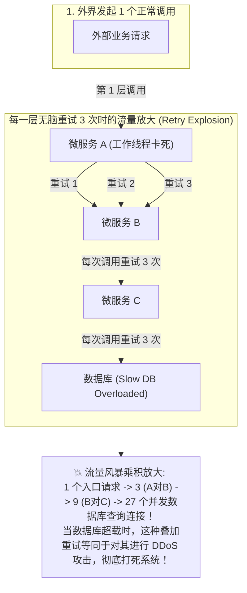
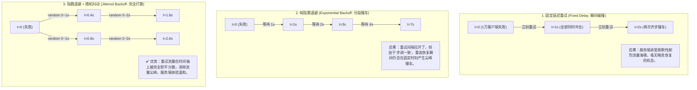
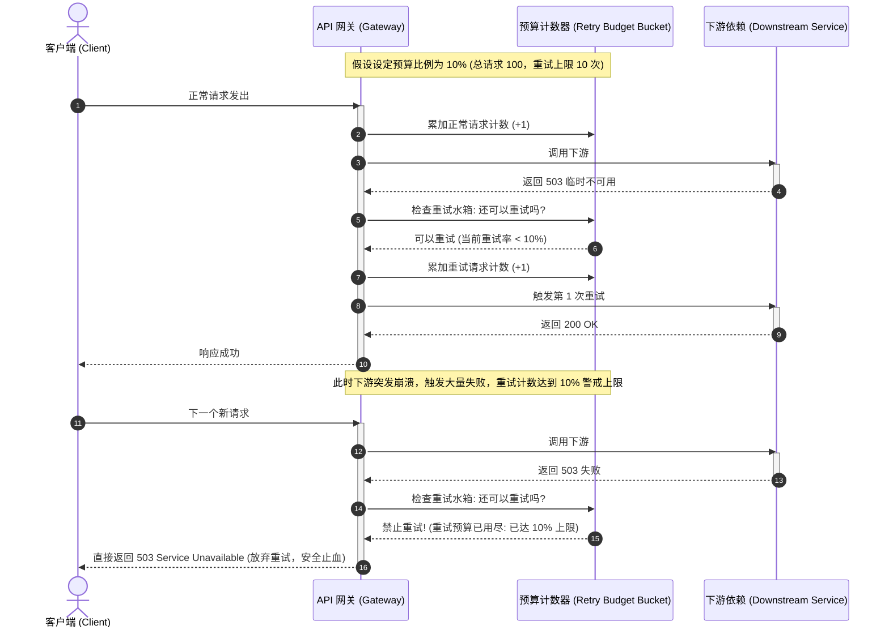

import GlossaryTerm from '@site/src/components/GlossaryTerm';
import GuidedExercise from '@site/src/components/GuidedExercise';
import ResearchNote from '@site/src/components/ResearchNote';
import ChapterMeta from '@site/src/components/ChapterMeta';
import PyRunner from '@site/src/components/PyRunner';
import TradeoffExplorer from '@site/src/components/TradeoffExplorer';
import QuizCard from '@site/src/components/QuizCard';

# M5L7 · 重试、退避与超时

<ChapterMeta
  time="约 2.5 小时"
  prereqs={[{label: 'M5L6 熔断', href: './circuit-breaker'}, {label: 'L6 幂等', href: '../foundations/idempotency'}, {label: 'L11 超时', href: '../foundations/sync-async-timeout'}]}
  outcome="能正确设计重试：设超时上限、指数退避 + 抖动、限制重试次数与预算、只对幂等操作重试，避免重试风暴。"
  howToUse="先看“无脑重试引发雪崩”的反例，再逐步加上超时/退避/抖动/预算，最后做退避算法 lab。"
/>

:::tip 重试不是“失败就再来一次”，那是把火浇上油
瞬时抖动（一次网络丢包、一次 GC 停顿）确实该重试。但**重试用错了会放大故障**：一个服务慢了，所有调用方开始重试，流量翻倍，服务更慢，更多重试……雪崩。安全重试是一门有纪律的手艺：超时、退避、抖动、预算、幂等，缺一不可。
:::

## 一、无脑重试 = 给摇摇欲坠的系统再踹一脚

最朴素的重试：失败就立刻再试，试 5 次。平时没事，故障时致命：服务因过载变慢 → 请求超时失败 → 立刻重试 → 流量瞬间 ×5 → 服务彻底崩 → 所有重试也失败。**重试在系统健康时帮你扛过瞬时抖动，在系统生病时却会要它的命。** 区别就在于：你的重试有没有"纪律"。

## 二、三个核心概念（分层）

### 基础：超时是一切的前提



没有<GlossaryTerm term="Timeout" definition="超时：给一次调用设定最长等待时间，超过就主动放弃。没有超时，慢依赖会无限占住调用方的线程/连接，是级联失败的根源。" >超时（timeout）</GlossaryTerm>，重试无从谈起——你得先能判定"这次失败了"才能重试。永远不要无限等待：给每次远程调用设一个合理超时（参考依赖的 [p99 延迟](../foundations/performance-and-latency)，留点余量）。超时太长则慢依赖拖死你；太短则正常请求被误杀。超时也是[熔断（M5L6）](./circuit-breaker)能识别"慢=失败"的前提。

### 进阶：指数退避 + 抖动



- <GlossaryTerm term="Exponential Backoff" definition="指数退避：每次重试的等待间隔成倍增长（如 1s、2s、4s、8s），给故障的依赖越来越多的喘息时间，而不是密集冲击。" >指数退避</GlossaryTerm>：重试间隔逐次翻倍（1s→2s→4s），给依赖喘息，而不是密集冲击。
- <GlossaryTerm term="Jitter" definition="抖动：在退避间隔上加入随机扰动，打散原本会同时重试的客户端，避免“重试惊群”（所有客户端在同一时刻一起重试）。" >抖动（jitter）</GlossaryTerm>：在退避时间上加随机量。**为什么关键**：如果一万个客户端同时失败、又用相同的退避，它们会在同一时刻一起重试（惊群），制造周期性流量尖峰。抖动把它们打散开。

### 深入（选学）：重试预算、幂等与"该不该重试"

- <GlossaryTerm term="Retry Budget" definition="重试预算：限制重试流量占总流量的比例（如重试不超过正常请求的 10%）。一旦故障导致重试激增触顶，就停止重试，防止重试本身把系统压垮。" >重试预算</GlossaryTerm>：限制重试占总流量的比例（如 ≤10%）。单纯"最多重试 3 次"在大故障时仍可能让总流量翻倍；预算从**全局**封顶重试量，触顶就不再重试。


- **只对<GlossaryTerm term="Idempotency" definition="幂等性 (Idempotency)：一个操作不论被执行多少次，其产生的副作用与执行一次都是完全相同的。在重试场景下，只有具备幂等性的写接口或天然只读查询，才能安全发起多次请求而不会引起数据污染或重复扣款。">幂等</GlossaryTerm>操作重试**（[L6](../foundations/idempotency)）：重试一个"扣款"请求可能扣两次！读操作天然可重试；写操作必须配 [idempotency key](../foundations/idempotency) 才能安全重试。
- **区分可重试错误**：超时、503、连接失败 → 可重试（瞬时）；400 参数错、401 鉴权失败 → 重试无意义（确定性错误），别浪费。
- **别让重试在每一层叠加**：A→B→C 每层各重试 3 次，最底层会被放大 3×3=9 倍。通常**只在最接近用户的一层重试**，或用预算全局控制。

<ResearchNote
  title="退避 + 抖动：把重试风暴打散"
  source="AWS Architecture Blog — Exponential Backoff and Jitter；Google SRE — Addressing Cascading Failures"
  href="https://aws.amazon.com/blogs/architecture/exponential-backoff-and-jitter/"
  insight="AWS 的实验表明：纯指数退避仍会让客户端在相同时刻聚集重试，加入随机抖动（尤其是“完全抖动”sleep=random(0, base*2^n)）能显著降低冲突和服务端峰值负载。Google SRE 则强调重试预算和只在单层重试，避免放大。"
  application="实现重试时：指数退避 + 抖动是标配；设最大重试次数 + 全局重试预算；只重试幂等且可重试的错误；避免多层叠加重试。这套纪律让重试在抖动时救你、在故障时不害你。"
/>

## 三、跟我做一遍：指数退避 + 完全抖动

<PyRunner
  rows={32}
  expect="退避递增且被抖动打散"
  code={`import random

def backoff_delays(base, attempts, cap=None):
    # 纯指数退避：base * 2^n
    return [base * (2 ** n) for n in range(attempts)]

def jittered_delays(base, attempts, cap, seed=1):
    # 完全抖动：sleep = random(0, min(cap, base*2^n))
    rng = random.Random(seed)
    out = []
    for n in range(attempts):
        ceiling = min(cap, base * (2 ** n))
        out.append(round(rng.uniform(0, ceiling), 3))
    return out

print("纯指数退避:", backoff_delays(1, 5))            # [1,2,4,8,16] —— 都一样，会惊群
print("完全抖动:", jittered_delays(1, 5, cap=16))      # 随机散开

# 模拟“1000 个客户端同时失败”：纯退避全挤在同一秒，抖动则分散
def retry_with_policy(do_call, policy, max_attempts):
    for n in range(max_attempts):
        ok = do_call(n)
        if ok:
            return "成功(第%d次)" % (n + 1)
        # 真实代码这里 sleep(policy[n])；演示中略过
    return "放弃(达上限)"

calls = [False, False, True]   # 第 3 次成功（模拟瞬时故障恢复）
print(retry_with_policy(lambda n: calls[n], jittered_delays(0.1, 3, 2), 3))
print("退避递增且被抖动打散")`}
/>

纯指数退避所有客户端步调一致（惊群）；完全抖动把重试时刻随机散开，削平服务端峰值。**试试**：实现"等额抖动"（`base*2^n/2 + random(0, base*2^n/2)`）对比"完全抖动"的分散效果；再加一个"不可重试错误立即放弃"的判断。

## 四、动手 Lab（必做）

打开 `labs/month05/m5l7_retry/`：

```bash
python labs/month05/m5l7_retry/test_retry.py
```

实现带指数退避 + 抖动 + 最大次数 + 可重试判断的重试器（用注入的"睡眠/随机"使其可测）。

<GuidedExercise
  title="练习指引：实现有纪律的重试"
  goal="把“超时→退避→抖动→上限→只重试可重试错误”做成代码——安全重试的完整纪律。"
  hints={[
    '退避间隔 = base * 2^n，再上限封顶（cap）。',
    '抖动：实际等待在 [0, 间隔] 间随机（完全抖动）。',
    '把 sleep 和 random 作为可注入依赖，测试才能确定性（DIP，回扣 M4L3）。',
    '只对“可重试错误”重试；不可重试（如 400）立即放弃。'
  ]}
  steps={[
    '实现 compute_delay(base, n, cap)：指数 + 封顶。',
    '实现 retry(call, max_attempts, is_retryable, sleeper, rng)。',
    '成功立即返回；不可重试错误立即抛；达上限抛最后错误。',
    '写测试：第 k 次成功则返回、达上限放弃、不可重试错误不重试、退避被抖动约束在区间内。'
  ]}
  checks={[
    '你能解释无纪律重试为什么放大故障。',
    '你的重试有超时/退避/抖动/上限。',
    '你只对幂等且可重试的错误重试。',
    '你能说出重试预算和“只在单层重试”的意义。'
  ]}
/>

## 架构师深潜（Staff+ 视角）

### 1. 重试策略对比

<TradeoffExplorer
  title="重试策略"
  dimensions={['抗瞬时抖动', '故障时安全', '恢复速度', '实现简单', '惊群风险']}
  options={[
    {
      name: '立即重试固定次数',
      scores: [3, 1, 5, 5, 1],
      note: '失败就立刻再试。能扛偶发，但故障时瞬间放大流量、惊群、雪崩。',
      whenToUse: '几乎从不——除非极轻量且有全局保护。'
    },
    {
      name: '指数退避 + 抖动 + 上限',
      scores: [5, 4, 3, 3, 5],
      note: '间隔递增、随机打散、有上限。抖动时救你、故障时不害你。',
      whenToUse: '默认标准做法。'
    },
    {
      name: '退避 + 抖动 + 重试预算 + 熔断',
      scores: [5, 5, 3, 2, 5],
      note: '在上面基础上全局封顶重试量并配熔断。最稳，但要更多基础设施。',
      whenToUse: '大规模、多依赖的关键系统。'
    }
  ]}
/>

### 2. 重试、超时、熔断是一个闭环

它们必须协同：**超时**判定失败 → **退避重试**应对瞬时抖动 → 若持续失败，**熔断**[（M5L6）](./circuit-breaker)跳闸停止重试（否则你在对一个已死的依赖反复退避重试，毫无意义）。架构师要把"超时 + 重试 + 熔断 + 幂等"当成跨服务调用的标配四件套。单独用任何一个都有缺口：只重试不熔断会风暴，只熔断不重试会错过瞬时恢复，没超时则两者都失灵。

### 3. 真实案例：重试风暴引发的真实事故

业界多次大故障的放大器都是重试：某服务短暂抖动 → 海量客户端无退避重试 → 流量数倍激增 → 服务被重试自己打死 → 恢复后又被积压重试再次打死。AWS/Google 的事后复盘反复强调退避 + 抖动 + 预算。这也是为什么成熟 SDK（AWS SDK 等）默认内置带抖动的退避——**重试的危险性，业界是用事故换来的教训。**

### 4. 架构师深问（给自己 30 分钟）

- 你调用链 A→B→C 每层都重试 3 次，最底层被放大几倍？该在哪层重试、怎么用预算控制？
- 哪些操作能直接重试、哪些必须先有幂等键（[L6](../foundations/idempotency)）？你的写接口具备幂等吗？
- 超时设多少？设成依赖 p50、p99 还是更高？设错会怎样（误杀正常请求 vs 慢依赖拖死你）？

## 自检清单

- [ ] 我给每个远程调用都设了合理超时。
- [ ] 我的 lab 重试有指数退避 + 抖动 + 上限。
- [ ] 我只对幂等且可重试的错误重试。
- [ ] 我理解重试预算和"只在单层重试"避免放大。

## 常见误解

- **"既然系统发生了偶发错误，那就多试几次总能成，重试次数设得越多越保险"**: 极其致命的想当然。如果下游服务是因为突发大流量超载变慢，无脑重试等同于在上游以 $3 \times 3 \times 3$ 的指数乘积疯狂对它进行分布式 DDoS 攻击。未设防的重试是非理性放大故障、摧毁全站可用性的第一帮凶。
- **"指数退避（Exponential Backoff）每次重试时间都翻倍了，所以绝对可以完美规避所有重试请求在同一时刻碰撞的问题"**: 忽略了惊群的时钟对齐效应。如果一万个客户端因为同一次网络抖动在 t=0 齐步失败，由于使用了完全相同的指数退避算法（如 $1\times 2^n$），那么它们依然会在接下来的第 1s、第 2s、第 4s、第 8s 这些完全同步的时间节点上密集撞车，产生周期性的流量洪峰。唯有引入 **随机抖动（Jitter）** 才能彻底打散请求。
- **"不管是什么网络或接口错误，只要失败了，直接无脑重试就对了"**: 极大的工程隐患。第一，任何**写操作接口**（如扣款、创建订单、发货）在没有接入 **幂等性机制（Idempotency）** 保证之前，绝对禁止重试，否则会产生重复扣款等严重生产事故。第二，对于确定性的错误（如 400 校验错、401 鉴权失效、403 无权限），重试一万次依然会是确定性报错，除了白白耗费 CPU 算力之外没有任何正向价值，应立即放弃。

## 常见误解自测

<QuizCard
  questions={[
    {
      q: '在多层微服务调用链路中（例如 A -> B -> C -> DB），如果每一层都简单配置‘重试 3 次’，当数据库发生短暂拥堵时会产生什么致命后果？优秀的架构该如何防范？',
      options: [
        '数据库的硬盘空间会因为大量的日志记录而迅速满溢崩溃。',
        '产生严重的‘重试雪崩放大效应’。因为底层的重试次数会在链路中发生指数乘积放大（3x3x3=27倍），瞬间用海量重复请求将本就负荷过重的数据库彻底击垮。防范措施为：通常只在最接近客户端的一层发起重试，且必须结合熔断和‘全局重试预算（Retry Budget）’限制重试比例。',
        '服务 C 会因为多次重试而自动升级数据库的物理硬件配置。'
      ],
      answer: 1,
      explain: '重试乘积放大风暴。在多级调用链中，无脑重试是级联崩溃的加速器。只在最外层（最懂业务的一层，如 BFF/App）做重试，可以极大程度约束重复流量。'
    },
    {
      q: '指数退避（Exponential Backoff）虽然拉长了重试间隔，但如果不引入‘随机抖动（Jitter）’，在遭遇大范围网络瞬断后仍会产生什么工程隐患？',
      options: [
        '客户端的定时器会发生严重的内存泄露。',
        '会导致所有重试请求由于‘时钟同步’在同一秒内密集撞车，产生‘重试惊群与周期性流量洪峰’。加入完全随机的抖动（Jitter）可以把重试时刻均匀散开在时间轴上，将尖峰流量削平为温和的低矮流量，保护服务端平稳过渡。',
        '指数退避必须与 TCP 拥塞控制中的慢启动机制完全合并才能生效。'
      ],
      answer: 1,
      explain: '惊群与流量周期的消除。如果没有随机化抖动，同步退避的机器将像拔河一样齐步走重试，在服务端制造周期性的惊人尖峰。Jitter 是流量平滑的核心秘诀。'
    },
    {
      q: '重试预算（Retry Budget）的全局防卫机制是如何工作的？它与传统的‘限制单次请求重试 3 次’有什么本质区别？',
      options: [
        '重试预算只限制向免费接口重试，对收费接口不限制。',
        '‘限制重试 3 次’是针对单个请求的，在大大规模服务故障时仍可能放任全网重试流量翻倍；而‘重试预算’是从全局维度（例如规定重试请求占比不得超过总请求的 10%）进行封顶。当故障引起大范围重试、总预算额度耗尽时，系统将断开后续请求的所有重试并快速失败，从而绝对避免了重试将故障无限放大的雪崩效应。',
        '重试预算是专门用来控制用户 API 调用费用的结算机制。'
      ],
      answer: 1,
      explain: '全局重试预算的防御价值。重试预算（如 Linkerd/Finagle 中的实现）是在并发洪峰下的顶级防御。一旦检测到全网重试洪流超标，立刻关闸，拒绝重试，是云原生高可用设计的精髓之一。'
    }
  ]}
/>

## 延伸阅读

- [AWS: Exponential Backoff and Jitter](https://aws.amazon.com/blogs/architecture/exponential-backoff-and-jitter/)
- [Google SRE: Addressing Cascading Failures](https://sre.google/sre-book/addressing-cascading-failures/)
- [下一课：隔离与舱壁](./bulkhead-isolation)
