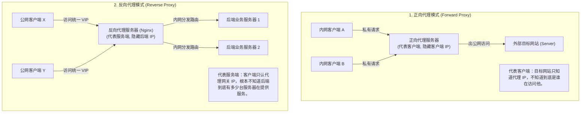
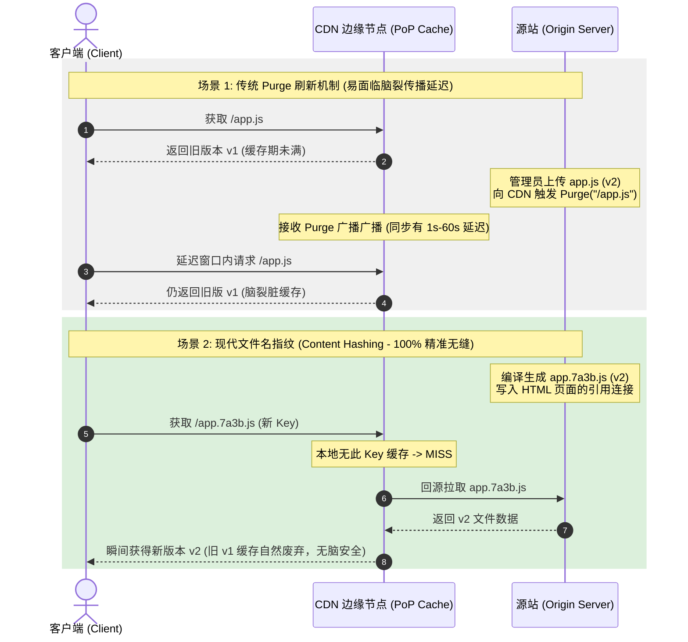

import GlossaryTerm from '@site/src/components/GlossaryTerm';
import GuidedExercise from '@site/src/components/GuidedExercise';
import ResearchNote from '@site/src/components/ResearchNote';
import ChapterMeta from '@site/src/components/ChapterMeta';
import PyRunner from '@site/src/components/PyRunner';
import TradeoffExplorer from '@site/src/components/TradeoffExplorer';
import QuizCard from '@site/src/components/QuizCard';

# M5L4 · 反向代理与 CDN

<ChapterMeta
  time="约 2 小时"
  prereqs={[{label: 'M5L2 API 网关', href: './api-gateway'}, {label: 'M3L5 缓存模式', href: '../data-cache-queue/cache-patterns'}, {label: 'L15 性能与延迟', href: '../foundations/performance-and-latency'}]}
  outcome="能区分正向/反向代理、说清反向代理的职责，并理解 CDN 如何用边缘缓存 + 就近接入把全球用户的延迟降下来。"
  howToUse="先看“跨洲访问慢、源站被静态请求打爆”的痛，再看反向代理和 CDN 怎么解决，最后做边缘缓存 lab。"
/>

:::tip 最快的请求，是根本不用到达你源站的请求
你的服务器在弗吉尼亚，用户在东京——一来一回光速就得几百毫秒（[L15 延迟数字](../foundations/performance-and-latency)）。而且 90% 的请求是图片、JS、视频这类**静态内容**，每次都回源站纯属浪费。反向代理和 CDN 的核心思想：**把内容缓存在离用户更近、且不打扰源站的地方。**
:::

## 一、跨洲很慢，源站被静态请求打爆

两个独立的痛：
1. **物理距离 = 延迟**：东京用户访问弗吉尼亚源站，仅网络往返就 ~150ms+，加上 TLS 握手多个 RTT，首屏慢得明显。
2. **源站做了太多杂事**：海量静态资源请求（图片/视频/CSS）每次都打到源站，挤占了本该处理动态业务的资源。

这两个问题，分别由 CDN 的"就近"和反向代理/CDN 的"缓存"解决。

## 二、三个核心概念（分层）

### 基础：正向代理 vs 反向代理



- <GlossaryTerm term="Forward Proxy" definition="正向代理：代表客户端去访问外部，隐藏的是客户端（如公司上网代理、翻墙代理）。服务端看到的是代理的地址。">正向代理</GlossaryTerm>：替**客户端**出去访问（公司上网代理）。隐藏客户端。
- <GlossaryTerm term="Reverse Proxy" definition="反向代理：代表服务端接收请求再转发给后端，隐藏的是后端服务器。客户端以为在跟它对话。常做 TLS 终止、缓存、负载均衡、压缩。">反向代理</GlossaryTerm>：替**服务端**接收请求再转发给后端（Nginx）。隐藏后端，顺带做 TLS 终止、缓存、压缩、[负载均衡](./load-balancing)。[API 网关](./api-gateway)本质就是一种功能丰富的反向代理。

### 进阶：CDN = 遍布全球的边缘缓存

<GlossaryTerm term="CDN" definition="内容分发网络（Content Delivery Network）：在全球各地部署边缘节点，把静态内容缓存在离用户最近的节点。用户就近获取，既降延迟又减源站压力。" >CDN</GlossaryTerm>是把反向代理 + 缓存**部署到全球几百个边缘节点（PoP）**：

```mermaid
flowchart TD
  UserTokyo["东京客户端 (User in Tokyo)"] -->|1. 请求获取 /logo.png| DNS["CDN Anycast DNS 解析"]
  DNS -->|2. 智能解析到最近PoP节点| TokyoPoP["东京边缘 PoP 缓存节点 <br/>(Tokyo PoP Edge Node)"]
  
  subgraph EdgeCheck["边缘节点判断"]
    TokyoPoP -->|3. 查询本地 KV 缓存| CheckCache{是否命中?}
    CheckCache -->|3a. 命中 HIT| ReturnHit["直接返回 cached 静态内容 <br/>(网络延迟 < 10ms!)"]
    CheckCache -->|3b. 未命中 MISS| PullOrigin["发起跨洲回源拉取"]
  end
  
  ReturnHit --> UserTokyo
  
  subgraph OriginVirginia["美国弗吉尼亚源站 (Origin Server)"]
    Origin["弗吉尼亚应用主机 (Virginia Origin)"]
  end
  
  PullOrigin -->|4. 跨洋网络往返 (RTT ~150ms)| Origin
  Origin -->|5. 返回源站最新图片资源| TokyoPoP
  TokyoPoP -->|6. 写入东京本地缓存库 (带 TTL)| ReturnHit
```

- 用户请求被 [DNS/Anycast](./load-balancing) 导到**最近的边缘节点**（解决距离）。
- 边缘节点缓存了静态内容，**命中就直接返回**，不回源（解决源站压力）。
- 未命中（cache miss）才回源站取一次，然后缓存起来给后续用户。

### 深入（选学）：缓存什么、缓存多久、怎么失效

CDN 的难点和 [M3 缓存](../data-cache-queue/cache-patterns) 一脉相承：
- **可缓存性**：静态资源（图片/JS/视频）天然可缓存；动态/个性化内容默认不缓存，但可用 `Cache-Control`、ESI、边缘计算细化。
- **TTL 与失效**：靠 `Cache-Control`/`max-age` 控制缓存时长；内容更新用<GlossaryTerm term="Cache Purge" definition="缓存清除/刷新：内容更新后主动让 CDN 边缘节点的旧副本失效。常配合内容指纹（文件名带哈希）实现“改了就换 URL”，从根上避免脏缓存。">主动 purge</GlossaryTerm> 或<GlossaryTerm term="Content Hashing" definition="内容指纹：把文件内容的哈希写进文件名（如 app.3f9c.js）。内容一变文件名就变，URL 即新资源，天然绕开旧缓存，无需 purge。">内容指纹文件名</GlossaryTerm>（`app.3f9c.js`，改了就换 URL）。后者是前端构建的标准做法——从根上避免脏缓存（[回扣 M3L6 失效](../data-cache-queue/cache-invalidation)）。


- **回源保护**：大量同时 miss 会一起回源打爆源站（[缓存击穿/惊群，M3L7](../data-cache-queue/cache-problems)）——CDN 用请求合并（collapsed forwarding）应对。

<ResearchNote
  title="把内容推到网络边缘"
  source="Nygren et al. (2010), The Akamai Network；HTTP Caching (RFC 9111)"
  href="https://dl.acm.org/doi/10.1145/1842733.1842736"
  insight="CDN 的核心是“边缘缓存 + 就近接入”：在全球部署节点，用 DNS/Anycast 把用户导到最近节点，命中则不回源。它把延迟从“到源站的距离”降到“到最近边缘的距离”，同时吸收了绝大部分静态流量，保护源站。"
  application="任何面向全球用户、有大量静态/可缓存内容的系统都该上 CDN。用内容指纹文件名 + 合理 Cache-Control 管理失效，用边缘计算处理轻量动态逻辑。这是 Web 性能优化的第一杠杆。"
/>

## 三、跟我做一遍：边缘缓存命中/回源

<PyRunner
  rows={28}
  expect="第二次命中边缘"
  code={`class Origin:                       # 源站：慢（跨洲 + 真生成）
    def __init__(self): self.hits = 0
    def fetch(self, path):
        self.hits += 1
        return "content-of-" + path    # 假装很贵

class EdgeNode:                     # CDN 边缘节点：本地缓存
    def __init__(self, origin): self.origin = origin; self.cache = {}
    def get(self, path):
        if path in self.cache:
            return self.cache[path], "HIT"        # 命中边缘，不回源
        data = self.origin.fetch(path)            # miss -> 回源一次
        self.cache[path] = data
        return data, "MISS"
    def purge(self, path): self.cache.pop(path, None)  # 内容更新后清缓存

origin = Origin()
edge = EdgeNode(origin)
print(edge.get("/logo.png"))       # MISS：回源
print(edge.get("/logo.png"))       # HIT：边缘直接返回
print(edge.get("/app.js"))         # MISS：另一个资源回源
print("源站总回源次数:", origin.hits)   # 2（两个资源各一次，重复请求不回源）

edge.purge("/logo.png")            # logo 更新了，清边缘缓存
print(edge.get("/logo.png"))       # 再次 MISS：拉新版本
print("第二次命中边缘")`}
/>

第一次 miss 回源并缓存，之后命中边缘直接返回——源站只被打了一次。**试试**：模拟"内容指纹"，把更新后的资源用新路径 `/logo.v2.png` 请求（而不是 purge），看它如何天然绕开旧缓存。

## 四、动手 Lab（必做）

打开 `labs/month05/m5l4_edge_cache/`：

```bash
python labs/month05/m5l4_edge_cache/test_edge.py
```

实现一个边缘缓存：命中不回源、miss 回源并缓存、支持 TTL 过期与 purge。

<GuidedExercise
  title="练习指引：实现边缘缓存"
  goal="把“命中/回源/TTL/purge”做成代码，体会 CDN 怎么降延迟、护源站。"
  hints={[
    'cache: path -> (data, expire_at)。',
    'get(path, now)：命中且未过期返回 HIT；否则回源、写缓存、返回 MISS。',
    'TTL 过期视同 miss（要回源拉新）。',
    'purge(path) 主动清除某条缓存。'
  ]}
  steps={[
    '实现 Origin.fetch（计数回源次数）。',
    '实现 EdgeNode：get(path, now) 处理命中/过期/回源。',
    '支持 TTL：过期则回源刷新。',
    '实现 purge。',
    '写测试：重复请求只回源一次、TTL 过期后再回源、purge 后回源、不同资源各回源。'
  ]}
  checks={[
    '你能区分正向代理和反向代理。',
    '你的边缘缓存命中不回源、过期/purge 后回源。',
    '你能解释 CDN 怎么同时降延迟和护源站。',
    '你能说出内容指纹文件名为什么优于 purge。'
  ]}
/>

## 架构师深潜（Staff+ 视角）

### 1. 内容该缓存在哪一层

<TradeoffExplorer
  title="缓存层次（离用户由近到远）"
  dimensions={['延迟最低', '减源站压力', '可缓存动态内容', '失效可控', '成本']}
  options={[
    {
      name: '浏览器缓存',
      scores: [5, 4, 1, 2, 5],
      note: '离用户最近、免费。但失效难控（用户端），只能缓存可公开的静态资源。',
      whenToUse: '带指纹的静态资源，配长 max-age。'
    },
    {
      name: 'CDN 边缘缓存',
      scores: [4, 5, 2, 4, 3],
      note: '全球就近、吸收绝大部分静态流量。动态内容需精细配置。',
      whenToUse: '面向广域用户的静态/半静态内容——几乎必备。'
    },
    {
      name: '源站缓存（Redis，M3L5）',
      scores: [2, 3, 5, 5, 3],
      note: '离数据最近、可缓存个性化/动态结果、失效最可控。但不解决物理距离。',
      whenToUse: '动态查询结果、个性化数据。'
    }
  ]}
/>

### 2. 多级缓存是性能的纵深防御

真实系统是**多级缓存叠加**：浏览器 → CDN 边缘 → 网关缓存 → 应用内 Redis → DB 缓冲池（[M3L1](../data-cache-queue/storage-engines)）。每一级挡掉一部分流量，越往后的越贵、越该被保护。架构师设计读路径时，要想清楚"每类内容缓存在哪一层、TTL 多少、怎么失效"——这与 [M3L10 feed 写扩散](../data-cache-queue/feed-fanout) 是同一条"为读优化"的主线在网络层的延续。

### 3. 真实案例：每个大流量站点的最外层都是 CDN

YouTube/Netflix 的视频、电商的商品图、几乎所有网站的前端资源，都靠 CDN 扛住绝大部分流量；源站只处理真正动态的请求。没有 CDN，源站会被静态请求和跨洲延迟双重压垮。它是面向全球的系统"性能 + 抗压"的第一道、也是最有效的一道防线。

### 4. 架构师深问（给自己 30 分钟）

- 你站点的资源里，哪些能放 CDN（带指纹长缓存）、哪些必须回源（个性化）？怎么用 `Cache-Control` 区分？
- 一次大版本发布，CDN 上还缓存着旧 JS/CSS，用户加载到新旧混合会出错。内容指纹怎么根治这个问题？
- 突发热点（某商品上热搜）导致边缘大量同时 miss 回源，怎么避免把源站打爆（[回扣击穿/惊群](../data-cache-queue/cache-problems)）？

## 自检清单

- [ ] 我能区分正向代理和反向代理。
- [ ] 我能解释 CDN 的"边缘缓存 + 就近接入"。
- [ ] 我的 lab 边缘缓存能命中/过期/purge。
- [ ] 我理解多级缓存的纵深结构。

## 常见误解

- **"反向代理（Reverse Proxy）仅仅就是负载均衡器的另外一个代名词，它们是一回事"**: 概念混淆。反向代理是一个更为宏大的“最外层网关/收口入口”架构概念。它的职责包括但远远不限于流量负载均衡（分发负载）。典型的反向代理（如 Nginx、Envoy）还会处理统一的 SSL/TLS 终止卸载（避免证书分发到所有后端主机）、Gzip/Brotli 响应内容压缩、公共静态资源本地缓存、甚至是基本的 IP 防火墙过滤。
- **"CDN 只能用来分发和存放静态图片、CSS 和视频文件，任何与动态请求或需要鉴权的个性化页面都无法享受 CDN 的红利"**: 认知滞后。现代边缘分发网络（CDN）早已演进出“动态网络加速（Dynamic Route Optimization）”，通过边缘 PoP 节点与源站间建立的常驻 TCP 连接池及 Anycast 最优路由避开公网拥堵；同时，利用“边缘计算（Edge Serverless，如 Cloudflare Workers）”，可以在边缘直接校验 JWT、根据 Cookie 判定进行页面局部渲染，从而实现部分动态逻辑的边缘分开与就近秒开。
- **"我们在部署生产环境的大版本发布更新时，如果代码有改动，只需要对旧的 index.js 发起一次全网 Purge 缓存刷新操作就足够安全了"**: 存在严重的可用性脑裂隐患。Purge 清除指令广播到全球成千上万个 PoP 节点需要一个不可控的时间同步差（从几秒到几分钟不等）。在此期间，用户访问网站可能会拉取到新版的 HTML 却加载了尚未被 purge 完成的旧版 JS/CSS（或反之），直接导致页面报错白屏。采用 **内容指纹文件名（Content Hashing，文件名带 Hash 值）** 重新生成全新 URL 才是从根本上根治脏缓存的现代工业标准做法。

## 常见误解自测

<QuizCard
  questions={[
    {
      q: '正向代理（Forward Proxy）与反向代理（Reverse Proxy）最本质的防线和保护目标有什么不同？',
      options: [
        '正向代理只能用在内网，反向代理只能用在云端。',
        '正向代理‘代表客户端’发起请求，隐藏并保护客户端身份，常用于内网出网控制或科学上网；反向代理‘代表服务端’接收外部请求，隐藏并保护后端真实的物理服务器集群，常用于流量分发、统一 TLS 终止与内容缓存。',
        '正向代理使用 HTTP 协议，反向代理使用 HTTPS 协议。'
      ],
      answer: 1,
      explain: '正向与反向代理的根本角色定位差异。代理总是位于通信双方之间，区分它们只需看‘它在为谁服务’：为客户端代言隐藏客户端即正向；为服务端代言隐藏后端拓扑即反向。'
    },
    {
      q: '为什么说前端工程化构建中普遍采用的‘内容指纹文件名（如 app.7a3b.js）’，在 CDN 缓存失效管理上要比传统的主动刷新（Purge）缓存操作更为优雅且安全？',
      options: [
        '因为内容指纹可以减少文件的传输尺寸。',
        '因为 Purge 操作需要向全球成百上千个 PoP 边缘节点下发清除广播，存在几秒至几分钟的扩散延迟窗口，此期间用户会读到脏数据；而内容指纹由于一改内容文件名即变（URL 变动），对 CDN 而言这属于请求全新的未缓存资源，能实现瞬间 100% 的精准无缝更新，且完美避开脏缓存。',
        '因为指纹文件名哈希算法执行速度比 purge 清理速度快数百倍。'
      ],
      answer: 1,
      explain: 'CDN 缓存失效与内容指纹。URL 是 CDN 查找缓存的唯一 Key。修改文件名指纹（Content Hashing）就是修改 Key，这能确保新旧请求在物理上完全分离，完全规避了 purge 广播同步过程中的脑裂窗口，是现代前端发布的标准动作。'
    },
    {
      q: '在遭遇高并发大促销活动时，如果某款爆品页面的 CDN 缓存正好过期，可能产生何种致命的系统崩溃隐患？CDN 层面该如何防御？',
      options: [
        '会导致 CDN 节点的磁盘损坏空间溢出。',
        '由于大流量在极短时间内穿透已过期的边缘缓存节点，大量并发连接同时打向源站拉取数据，产生‘缓存击穿与惊群效应（Collapsed Forwarding Storm）’，瞬间击垮源站服务器。CDN 边缘节点可以通过‘请求合并（Collapsed Forwarding）’，仅让首个抢占请求回源，其余并发请求排队等待该请求结果，以此保护源站。',
        '会导致用户的浏览器缓存直接被彻底清空。'
      ],
      answer: 1,
      explain: '缓存击穿防线。当极高并发下的缓存 Key 过期时，如果不对回源操作加锁合并，瞬间产生的海量回源请求会发生雪崩式打垮源站（惊群）。CDN 边缘反向代理的 Collapsed Forwarding （请求合并/单锁回源）是极其核心的源站保护屏障。'
    }
  ]}
/>

## 延伸阅读

- [The Akamai Network (2010)](https://dl.acm.org/doi/10.1145/1842733.1842736)
- [MDN: HTTP Caching](https://developer.mozilla.org/en-US/docs/Web/HTTP/Caching)
- [下一课：限流](./rate-limiting)
