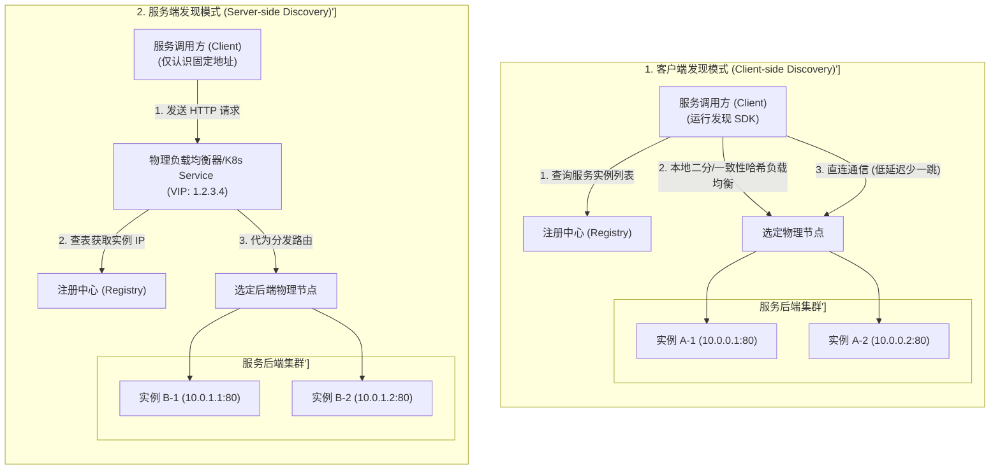
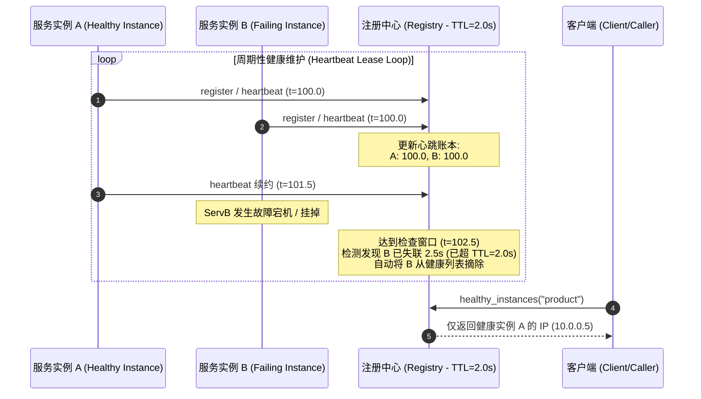
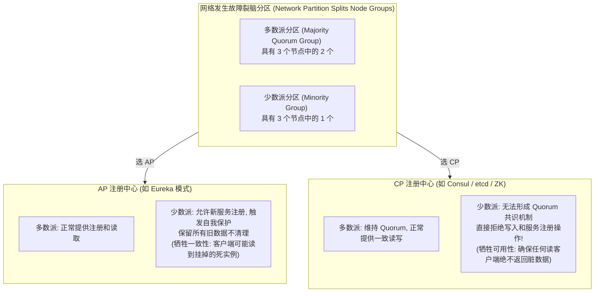

import GlossaryTerm from '@site/src/components/GlossaryTerm';
import GuidedExercise from '@site/src/components/GuidedExercise';
import ResearchNote from '@site/src/components/ResearchNote';
import ChapterMeta from '@site/src/components/ChapterMeta';
import PyRunner from '@site/src/components/PyRunner';
import TradeoffExplorer from '@site/src/components/TradeoffExplorer';
import QuizCard from '@site/src/components/QuizCard';

# M5L3 · 服务发现与注册

<ChapterMeta
  time="约 2 小时"
  prereqs={[{label: 'M5L1 负载均衡', href: './load-balancing'}, {label: 'M2L11 容错', href: '../system-design-bridge/reliability-fault-tolerance'}]}
  outcome="能解释服务发现要解决的问题、区分客户端/服务端发现、并理解健康探活与注册下线为什么是高可用的关键。"
  howToUse="先看“硬编码 IP 一扩容就崩”的痛，再看注册中心怎么动态维护实例表，最后做服务注册表 lab。"
/>

:::tip 云原生时代，实例的地址是“流动”的
在自动扩缩容、容器编排的世界里，实例不断被创建、销毁、重启，IP 随时在变。你**不能再把后端地址写死在配置里**。需要一个机制：实例上线时"报到"、下线/挂掉时被摘除，调用方总能拿到"当前健康的实例列表"。这就是服务发现。
:::

## 一、硬编码 IP，一扩容就崩

老办法：在配置里写死 `product-service = 10.0.0.5:8080`。问题来了：扩容加了 3 台新实例，配置不知道；某台挂了，流量还往它打；容器重启换了 IP，全断。**只要实例集合是动态的（云原生下永远是），硬编码就行不通。** 你需要一个"活的"实例目录。

## 二、三个核心概念（分层）

### 基础：注册中心与服务注册

<GlossaryTerm term="Service Registry" definition="注册中心：一个动态维护“服务名 → 健康实例列表”的数据库。实例启动时注册、退出时注销、定期心跳；调用方查询它获得当前可用实例。" >注册中心（Service Registry）</GlossaryTerm>是核心：一个动态的"服务名 → 健康实例列表"目录。

- **服务注册（registration）**：实例启动时向注册中心登记自己的地址。
- **心跳/续约（heartbeat）**：实例定期上报"我还活着"；超时未报就被摘除。
- **服务发现（discovery）**：调用方查注册中心，拿到当前健康实例列表，再[负载均衡](./load-balancing)选一个调。

### 进阶：客户端发现 vs 服务端发现



- <GlossaryTerm term="Client-side Discovery" definition="客户端发现：调用方直接查注册中心拿到实例列表，自己做负载均衡选一个调。少一跳、更灵活，但每个客户端要内置发现逻辑。">客户端发现</GlossaryTerm>：调用方自己查注册中心 + 自己负载均衡。少一跳，但客户端要内置逻辑（各语言都要 SDK）。
- <GlossaryTerm term="Server-side Discovery" definition="服务端发现：调用方只管把请求发给一个固定的负载均衡器/网关，由它查注册中心并转发。客户端简单，但多一跳、LB 要高可用。">服务端发现</GlossaryTerm>：调用方只发给一个固定 LB/网关，由它查注册中心并转发。客户端简单，但多一跳。Kubernetes Service 就是服务端发现。

### 深入（选学）：健康检查与注册中心自身的 CAP 取舍

发现的正确性取决于**健康检查**：


- **主动探活**：注册中心定期 ping 实例的 `/health`。
- **心跳续约**：实例主动上报，超时即摘（Eureka 模式）。
- 关键难题：**误判**。网络抖动让健康实例被误摘（可用性受损），或挂了的实例没及时摘除（请求被打到死实例）。这就是 [CAP（M2L6）](../system-design-bridge/cap-consistency) 在注册中心的体现——Eureka 选 <GlossaryTerm term="AP Registry" definition="AP 注册中心：指强调高可用性 (Availability) 与分区容错性 (Partition Tolerance) 的服务目录系统（如 Netflix Eureka）。当网络出现故障分裂时，Eureka 会开启自我保护机制，允许短暂的数据不一致，宁可返回过期的实例表，也不拒绝读写请求。">AP 模式</GlossaryTerm>，ZooKeeper/etcd 选 <GlossaryTerm term="CP Registry" definition="CP 注册中心：指强调强一致性 (Consistency) 与分区容错性 (Partition Tolerance) 的服务目录系统（如 Consul、etcd）。网络分区发生时，如果节点群失去半数以上的多数派 Quorum 投票，将直接拒绝新的服务注册与写入，保证已存读取的实例列表绝对精确无脏读。">CP 模式</GlossaryTerm>。架构师要根据"宁可多打几个死实例、还是宁可少服务"来选。



<ResearchNote
  title="服务发现：在动态实例集合上维护可用目录"
  source="Chris Richardson, Microservices Patterns — Service Discovery；Netflix Eureka；HashiCorp Consul / etcd"
  href="https://microservices.io/patterns/server-side-discovery.html"
  insight="服务发现把“服务名→实例”的解析从静态配置变为动态目录。客户端发现少一跳但客户端复杂；服务端发现（如 K8s Service）对客户端透明。注册中心本身要在一致性与可用性间取舍（Eureka 偏 AP，etcd/ZooKeeper 偏 CP）。"
  application="设计微服务通信：用注册中心 + 健康检查替代硬编码地址。K8s 环境默认有服务端发现（Service/DNS）。注意健康检查的误判窗口，以及注册中心自身的高可用与 CAP 选择。"
/>

## 三、跟我做一遍：服务注册表 + 心跳摘除

<PyRunner
  rows={30}
  expect="过期实例被摘除"
  code={`import time

class Registry:
    def __init__(self, ttl=2.0):
        self.ttl = ttl
        self.services = {}    # name -> {addr: last_heartbeat}

    def register(self, name, addr, now):
        self.services.setdefault(name, {})[addr] = now

    def heartbeat(self, name, addr, now):
        if name in self.services and addr in self.services[name]:
            self.services[name][addr] = now    # 续约

    def healthy_instances(self, name, now):
        # 只返回心跳未超时的实例（自动摘除“失联”的）
        insts = self.services.get(name, {})
        return [a for a, last in insts.items() if now - last <= self.ttl]

r = Registry(ttl=2.0)
t = 100.0
r.register("product", "10.0.0.5:8080", t)
r.register("product", "10.0.0.6:8080", t)
print("初始健康实例:", r.healthy_instances("product", t))

# .6 持续心跳，.5 失联（不再续约）
t = 103.0
r.heartbeat("product", "10.0.0.6:8080", t)
print("3 秒后健康实例:", r.healthy_instances("product", t))   # 只剩 .6
print("过期实例被摘除")`}
/>

实例靠心跳续约，超过 <GlossaryTerm term="Time to Live" definition="生存时间 (TTL - Time to Live)：指数据记录或心跳在被认定失效前可以存活的秒数。在服务注册中心里，TTL 决定了一个实例失联多久会被自动摘除剔除，是平衡‘探测实时性’与‘抖动防误摘’的核心常数。">TTL (生存时间)</GlossaryTerm> 未续约就被自动摘除——调用方永远只拿到"当前还活着"的实例。**试试**：让 `.5` 在 t=101 补一次心跳，看它是否重新出现在健康列表；调小 `ttl` 体会"摘得快但误判风险高"的取舍。

## 四、动手 Lab（必做）

打开 `labs/month05/m5l3_registry/`：

```bash
python labs/month05/m5l3_registry/test_registry.py
```

实现服务注册中心：注册、心跳续约、按 TTL 摘除失联实例、查询健康实例。

<GuidedExercise
  title="练习指引：实现服务注册中心"
  goal="把“注册 + 心跳续约 + TTL 摘除 + 查询健康实例”做成代码——这是动态实例目录的核心。"
  hints={[
    'services: name -> {addr: last_heartbeat_time}。',
    'register/heartbeat 都更新 last_heartbeat。',
    'healthy_instances(name, now)：过滤 now - last <= ttl。',
    '注意：摘除是“查询时按时间过滤”，不需要后台线程也能演示。'
  ]}
  steps={[
    '实现 Registry(ttl)。',
    'register(name, addr, now) / heartbeat(name, addr, now)。',
    'healthy_instances(name, now)：只返回未超时实例。',
    'deregister(name, addr)：主动下线。',
    '写测试：注册可见、失联被摘、续约保活、主动下线、未知服务返回空。'
  ]}
  checks={[
    '你能说出服务发现替代硬编码解决什么。',
    '你的注册表能按 TTL 摘除失联实例。',
    '你能区分客户端发现和服务端发现。',
    '你能解释健康检查误判与注册中心的 CAP 取舍。'
  ]}
/>

## 架构师深潜（Staff+ 视角）

### 1. 发现模式怎么选

<TradeoffExplorer
  title="服务发现模式"
  dimensions={['客户端简单', '少一跳/低延迟', '语言无关', '灵活路由', '运维复杂度']}
  options={[
    {
      name: '硬编码/静态配置',
      scores: [4, 5, 5, 1, 2],
      note: '没有发现。改实例要改配置重启。动态环境下不可行。',
      whenToUse: '实例极稳定的小型/遗留系统。'
    },
    {
      name: '客户端发现',
      scores: [2, 5, 2, 5, 3],
      note: '客户端查注册中心+自负载均衡。少一跳、可定制路由，但每语言要 SDK。',
      whenToUse: '需要精细客户端负载均衡、技术栈统一时。'
    },
    {
      name: '服务端发现（K8s Service）',
      scores: [5, 3, 5, 3, 4],
      note: '客户端只认一个稳定地址，平台处理发现。透明、语言无关，但多一跳。',
      whenToUse: '容器编排环境的默认选择——绝大多数现代系统。'
    }
  ]}
/>

### 2. 服务发现是"弹性伸缩"闭环的一环

自动扩缩容（[M2L7](../system-design-bridge/scaling-strategies)）能成立，靠的就是发现：扩容的新实例自动注册→立刻接流量；缩容/故障的实例被摘除→不再接流量。没有服务发现，弹性伸缩就是空话。它和[负载均衡](./load-balancing)、健康检查共同构成"实例动态、流量自动跟随"的闭环——这是云原生弹性的地基。

### 3. 真实案例：从 Eureka 到 Kubernetes

Netflix 用 Eureka（客户端发现 + AP）支撑大规模微服务；Kubernetes 把发现内建为 Service + kube-dns（服务端发现），让开发者几乎无感。理解这层抽象，你才知道 `http://product-service/` 这个看似普通的地址背后，是注册中心、健康检查、负载均衡在协作——以及它在网络分区时会怎么表现。

### 4. 架构师深问（给自己 30 分钟）

- 你的注册中心选 AP（Eureka）还是 CP（etcd）？网络分区时你宁可"多打死实例"还是"少服务"？
- 健康检查 TTL 设多长？太短：抖动误摘（可用性降）；太长：死实例没及时摘（请求失败）。你怎么平衡？
- 实例"优雅下线"（先从注册中心摘、等存量请求处理完再退）怎么做？不做会怎样？

## 自检清单

- [ ] 我能解释服务发现替代硬编码地址的价值。
- [ ] 我的 lab 注册中心能注册/续约/按 TTL 摘除/查询。
- [ ] 我能区分客户端发现和服务端发现。
- [ ] 我理解注册中心的健康检查误判与 CAP 取舍。

## 常见误解

- **"在配置文件（如 application.yml 或 Nginx config）里直接写死物理 IP 就行了，反正我们的后端服务器基本上不重启，重启了再去手动改配置也可以"**: 极其脆弱且落后的反模式。在现代云原生与容器化时代，微服务实例由于自动扩缩容、节点抢占式调度、Kubernetes 声明式调和等机制，随时处于“流动”与生命期短暂的演进中。任何试图静态化 IP 端口的行为都会在机器挂掉或扩容新实例时瞬间导致流量黑洞。必须通过注册中心实现“流量自动跟随”的动态解析。
- **"一个实例只要成功完成注册登记，就说明它在接下来的整个生命周期内都是健康的，可以直接安心调用"**: 典型的静止视角误区。服务注册仅代表节点启动时的瞬间“报到”，不代表它不会在后续运行中发生死锁、OOM 内存溢出、文件句柄耗尽或网络假死。如果缺乏**健康探活机制（Active Probe / Heartbeat Lease）**，网关和客户端将继续向实质已死的僵尸节点疯狂打入流量。健康检查 TTL 的动态驱逐是服务发现高可用不可或缺的防线。
- **"既然服务注册中心代表了全站服务拓扑的目录库，那么为了防脏读，我们应该全面引入强一致性（CP 模式）的注册中心并保证数据绝对实时精确"**: 忽略了 CAP 取舍的代价。在超大规模高频通信的微服务群中，服务实例表的短期瞬时延迟并不致命（客户端重试可以规避）。如果是偏 CP 强一致的注册中心（如 Consul/etcd），一旦遭遇网络分区抖动、少数派节点群共识判定瘫痪，就会直接拒绝所有新服务的上线注册。在大规模微服务系统中，许多架构师更倾向于选择偏 **AP 模式（如 Eureka）**，进入自我保护，哪怕读到老脏实例数据（由客户端熔断和重试处理），也要保证入口可用。

## 常见误解自测

<QuizCard
  questions={[
    {
      q: '在客户端服务发现（Client-side Discovery）与服务端服务发现（Server-side Discovery）的架构设计中，以下关于两者的核心权衡，哪项是正确的？',
      options: [
        '客户端发现必须将所有后端服务地址都硬编码在 APP 包里。',
        '客户端发现少了一跳（调用方直接直连服务实例），延迟最低，且可以在客户端做极其灵活定制的负载均衡策略；但缺点是需要每个开发语言都编写并集成专属发现 SDK，增加了客户端代码复杂度。服务端发现对客户端完全透明，但多了一跳，且负载均衡器本身面临高可用和单点性能瓶颈。',
        '服务端发现完全不需要注册中心的存在。'
      ],
      answer: 1,
      explain: '服务发现的客户端与服务端路线权衡。客户端发现（如 Eureka SDK）是典型的进程内解析路由，去中心化强，但存在客户端 SDK 跨语言维护成本；服务端发现（如 K8s Service + CoreDNS）是完全的中间代理模式，解耦了语言，但多一层网络转发延迟。'
    },
    {
      q: '微服务注册中心在发生“网络分区（Network Partition）”故障时，AP 模式（如 Eureka）与 CP 模式（如 Consul/etcd）的选择会导致何种不同的业务表现？',
      options: [
        'AP 模式的注册中心会立即清空所有注册数据，导致全网瘫痪。',
        'CP 模式注册中心无法在网络分区下对外提供读取解析服务。',
        'AP 模式的注册中心强调可用性，网络分区时会进入自我保护，继续返回可能已经挂掉的过期实例列表（允许短暂不一致，宁可误打不通也不能少给实例）；而 CP 模式注册中心强求一致性，一旦失去过半数（Quorum）共识判定，将直接拒绝新服务写入或注册，确保读写数据的绝对精确防脏读。'
      ],
      answer: 2,
      explain: '注册中心的 CAP 权衡。AP 模式的 Eureka 宁愿相信挂掉的实例还活着，也要保证调用方有节点可用，利用重试来容错；CP 模式的 ZooKeeper/Consul 则绝不容忍脏数据，哪怕写不可用，也要保证全网视图的强一致性。'
    },
    {
      q: '在服务发现系统的健康检查中，‘主动探活（Active Probe）’与‘被动心跳（Passive Heartbeat）’各自的实现特点和挑战是什么？',
      options: [
        '主动探活不需要占用任何网络带宽。',
        '主动探活由注册中心定时轮询发起 ping/http 检测，能够精准控制检测节奏，但当物理节点达数万时，注册中心发出的探针流量会发生剧烈的‘探针风暴’压垮网卡；被动心跳由实例定时上报（续约），压力分摊到各实例，但如果实例假死（进程僵死但心跳线程仍由定时任务发送），可能会造成假活漏判。',
        '被动心跳因为是实例发起，所以不需要设置任何超时失效时间 TTL。'
      ],
      answer: 1,
      explain: '探活与心跳的工程痛点。探针风暴和假活漏判是真实微服务架构中的经典问题。大规模集群一般使用轻量的被动心跳或分布式 gossip 协议来分摊主动探针的 I/O 载荷，防止注册中心自身过载崩溃。'
    }
  ]}
/>

## 延伸阅读

- [Microservices.io: Service Discovery](https://microservices.io/patterns/server-side-discovery.html)
- [Kubernetes Service & DNS](https://kubernetes.io/docs/concepts/services-networking/service/)
- [下一课：反向代理与 CDN](./reverse-proxy-cdn)
