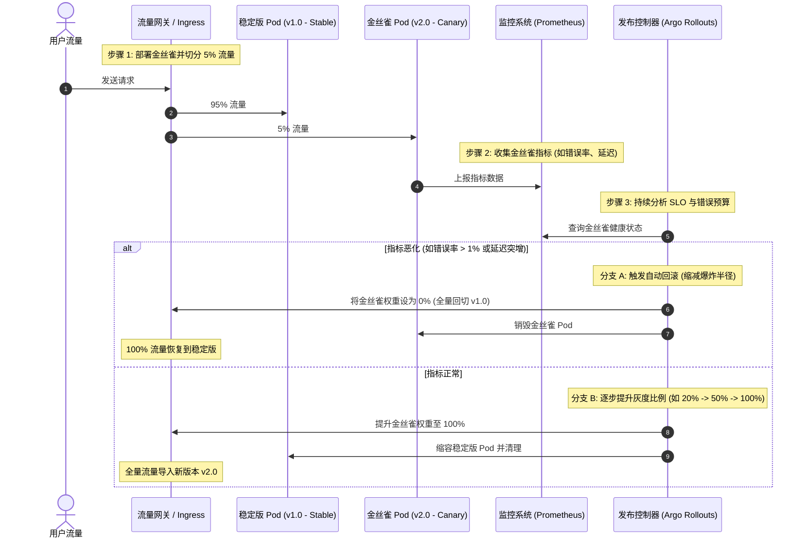

import GlossaryTerm from '@site/src/components/GlossaryTerm';
import GuidedExercise from '@site/src/components/GuidedExercise';
import ResearchNote from '@site/src/components/ResearchNote';
import ChapterMeta from '@site/src/components/ChapterMeta';
import PyRunner from '@site/src/components/PyRunner';
import TradeoffExplorer from '@site/src/components/TradeoffExplorer';
import QuizCard from '@site/src/components/QuizCard';

# M6L4 · 自动伸缩与滚动发布

<ChapterMeta
  time="约 2.5 小时"
  prereqs={[{label: 'M6L2 K8s 调和', href: './kubernetes-basics'}, {label: 'M6L3 探针', href: './config-secrets-probes'}, {label: 'M2L7 扩展策略', href: '../system-design-bridge/scaling-strategies'}]}
  outcome="能用 HPA 按指标自动伸缩副本（含阈值与稳定窗口），并区分滚动更新/蓝绿/金丝雀发布的取舍与回滚方式。"
  howToUse="先看“流量峰谷靠人手动加减机器”的痛，再理解 HPA 和几种发布策略，最后做 HPA 决策 lab。"
/>

:::tip 弹性和安全发布，是云原生最直接的两个回报
[M2L7](../system-design-bridge/scaling-strategies) 讲过水平扩展的思想。云原生把它**自动化**了：流量涨自动加副本、跌了自动减（省钱）——这是自动伸缩。同时，发新版本不再是"停服更新"，而是**逐步替换、随时回滚**——这是滚动发布。两者都建立在 [K8s 调和循环（M6L2）](./kubernetes-basics) 和 [readiness 探针（M6L3）](./config-secrets-probes) 之上。
:::

## 一、人肉运维扛不住峰谷和发版

两个日常痛点：
1. **流量有峰谷**：白天高峰要 20 台、深夜 3 台够。固定按峰值配 = 深夜浪费 6 倍资源；按均值配 = 高峰被打挂。人手动盯着加减？半夜没人、反应也慢。
2. **发版要停服**：老办法停掉服务、换新版本、再启动——中间一段时间用户访问失败。而且新版本有 bug 时，回滚又是一通手忙脚乱。

自动伸缩解决第一个，滚动/金丝雀发布解决第二个——都靠声明式调和自动完成。

## 二、三个核心概念（分层）

### 基础：水平自动伸缩（HPA）

<GlossaryTerm term="Horizontal Pod Autoscaler" definition="水平 Pod 自动伸缩器（HPA）：根据观测到的指标（如 CPU 利用率、QPS）自动调整副本数，使指标维持在目标值附近。属于 K8s 调和循环的一种应用。" >HPA</GlossaryTerm> 按指标自动算副本数：目标"CPU 维持 50%"，当前 10 个副本平均 CPU 80% → 需要 `ceil(10 × 80/50) = 16` 个 → 调和循环把副本扩到 16。公式核心：**期望副本 = 当前副本 × (当前指标 / 目标指标)**。这就是 [M6L2 调和](./kubernetes-basics) 在"副本数"维度的应用——你声明目标指标，HPA 维持它。

#### HPA 控制环路工作原理

```mermaid
graph TD
    subgraph K8s_Control_Plane["Kubernetes 控制平面"]
        HPA["HPA 控制器 (HPA Controller)"]
        Metrics["指标服务器 (Metrics Server / Prometheus)"]
        Deploy["Deployment / ReplicaSet 控制器"]
    end
    
    subgraph Data_Plane["数据平面 (工作节点)"]
        Pods["工作负载 Pod 副本 (Pods)"]
    end

    Pods -->|1. 收集 CPU/内存/自定义指标| Metrics
    HPA -->|2. 定期轮询 (默认 15s)| Metrics
    HPA -->|3. 根据公式计算期望副本数| HPA
    HPA -->|4. 更新 Scale 对象的 replicas 字段| Deploy
    Deploy -->|5. 调和实际副本数 (增/删 Pod)| Pods

    style HPA fill:#0f766e,stroke:#0d9488,stroke-width:2px,color:#f0fdfa
    style Metrics fill:#1e293b,stroke:#475569,stroke-width:1px,color:#e2e8f0
    style Deploy fill:#1e293b,stroke:#475569,stroke-width:1px,color:#e2e8f0
    style Pods fill:#0284c7,stroke:#0284c7,stroke-width:1px,color:#fff
```

### 进阶：抖动抑制与发布策略

- HPA 必须防<GlossaryTerm term="Flapping" definition="抖动 (Flapping)：在自动伸缩系统中，由于指标在阈值边界频繁上下波动，导致系统在极短时间内反复执行扩容和缩容操作，造成容器频繁创建与销毁，消耗大量系统资源并影响服务稳定性。">抖动（flapping）</GlossaryTerm>：指标上下波动一点就反复扩缩会很糟。用<GlossaryTerm term="Stabilization Window" definition="稳定窗口：自动伸缩在做缩容（或扩容）决策时，参考最近一段时间窗口内的指标，避免因瞬时波动而频繁伸缩（抖动）。常对缩容设较长窗口、扩容较短。" >稳定窗口</GlossaryTerm>（缩容慢、扩容快）+ 容忍带（指标在目标 ±10% 内不动）抑制。

#### 稳定窗口与容忍带决策逻辑

```mermaid
flowchart TD
    Start("[定期触发计算 (默认 15s")]) --> ReadMetrics[读取当前度量指标值]
    ReadMetrics --> Calculate["计算期望副本数 = 当前副本数 * (当前指标 / 目标值)"]
    Calculate --> CheckTolerance{期望与当前比率在容忍带内?<br>|ratio - 1.0| <= 容忍度 (默认 0.1)}
    CheckTolerance -->|Yes| KeepCurrent["保持当前副本数 (不动)"]
    CheckTolerance -->|No| CheckScaleType{期望副本数 > 当前副本数?}
    
    CheckScaleType -->|Yes: 扩容| ScaleUp[立即执行扩容]
    CheckScaleType -->|No: 缩容| Window{是否在缩容稳定窗口内?<br>(默认 5 分钟)}
    
    Window -->|Yes: 处于窗口期| GetMax[评估过去 5m 内的所有推荐值<br>选择其中的最大副本数]
    GetMax --> CheckChange{选择的副本数 < 当前副本数?}
    CheckChange -->|No| KeepCurrent
    CheckChange -->|Yes| ApplyScaleDown[执行安全缩容]
    
    Window -->|No / 窗口已过| ApplyScaleDown
    
    ScaleUp --> Apply([调整副本数 spec.replicas])
    ApplyScaleDown --> Apply
    KeepCurrent --> Apply
    
    style Start fill:#1e293b,stroke:#475569,stroke-width:1px,color:#e2e8f0
    style CheckTolerance fill:#0f766e,stroke:#0d9488,stroke-width:2px,color:#f0fdfa
    style CheckScaleType fill:#0f766e,stroke:#0d9488,stroke-width:2px,color:#f0fdfa
    style Window fill:#b45309,stroke:#d97706,stroke-width:2px,color:#fffdfa
```
- 发布策略：
  - <GlossaryTerm term="Rolling Update" definition="滚动更新：逐批用新版本 Pod 替换旧版本，每批先就绪再继续，期间服务始终有可用副本，实现零停机升级。出问题可暂停/回滚。" >滚动更新（rolling update）</GlossaryTerm>：一批批替换，新 Pod [readiness](./config-secrets-probes) 通过才继续，全程有可用副本 → 零停机。
  - <GlossaryTerm term="Blue-Green Deployment" definition="蓝绿发布：同时部署旧（蓝）新（绿）两套完整环境，验证绿环境无误后把流量一次性切过去；出问题切回蓝。切换快、回滚快，但要双份资源。" >蓝绿（blue-green）</GlossaryTerm>：新旧两套并存，验证后流量一次切换，出错切回。
  - <GlossaryTerm term="Canary Deployment" definition="金丝雀发布：先把一小部分流量（如 5%）导到新版本，观察指标正常再逐步放大比例，发现问题及时回滚。把发布风险降到最小。" >金丝雀（canary）</GlossaryTerm>：先放 5% 流量到新版本，观察指标 OK 再逐步放大——风险最小。

#### 渐进式交付：金丝雀发布与自动回滚时序



### 深入（选学）：自动伸缩的边界与发布的本质

- **HPA 不是万能**：它对 CPU/QPS 这类即时指标有效，但扩容有延迟（拉镜像、启动、预热），应对**突发尖峰**不够快——要配合预留缓冲、预热、或基于队列长度/自定义指标伸缩。还有 <GlossaryTerm term="Vertical Pod Autoscaler" definition="纵向 Pod 自动伸缩器 (VPA)：根据容器的实际 CPU 和内存使用率，自动调整 Pod 容器的资源请求（Requests）和限制（Limits）设定，实现单节点内的资源垂直伸缩，通常需要重启 Pod 生效。">VPA（纵向，调单 Pod 资源）</GlossaryTerm> 和集群层面的**节点自动伸缩**（没机器放 Pod 时自动加节点）。
- **冷启动与缩到 0**：Serverless 可缩到 0（省钱）但有冷启动延迟；常规服务通常留最小副本。
- **发布的本质是"控制变更的爆炸半径"**：金丝雀 = 先让一小撮用户承担风险（[呼应 M5L8 爆炸半径](../core-components/bulkhead-isolation)）；配合自动化指标监控，指标一恶化就**自动回滚**——这是 <GlossaryTerm term="Service Level Objective" definition="服务等级目标 (SLO)：根据服务等级指标 (SLI) 设定的具体目标值或范围，用于衡量服务的可靠性。例如‘99.9% 的请求延迟小于 200ms’。">SLO</GlossaryTerm>/错误预算（M6L7） 驱动的<GlossaryTerm term="Progressive Delivery" definition="渐进式交付 (Progressive Delivery)：通过金丝雀发布、蓝绿部署、特征旗（Feature Flags）和自动化监控指标 feedback，将变更逐步且安全地暴露给用户，以便在出现异常时能够自动回滚并最小化爆炸半径。">渐进式交付（progressive delivery）</GlossaryTerm>。
- **数据库变更不能"滚回"**：代码能回滚，schema 改了的数据回不去——所以 schema 变更要向后兼容、分步发布（扩展-迁移-收缩），这是发布里最难的部分。

<ResearchNote
  title="自动伸缩与渐进式发布：用调和 + 指标控制弹性与风险"
  source="Kubernetes HPA 文档；Google SRE — Canarying Releases；Martin Fowler — BlueGreenDeployment / CanaryRelease"
  href="https://kubernetes.io/docs/tasks/run-application/horizontal-pod-autoscale/"
  insight="HPA 把“维持目标指标”变成调和问题：期望副本 = 当前副本 × 当前指标/目标指标，并用稳定窗口抑制抖动。滚动/蓝绿/金丝雀则在“升级时如何控制风险”上取舍——金丝雀 + 自动指标回滚是把发布风险降到最低的现代实践（渐进式交付）。"
  application="为伸缩选对指标（CPU/QPS/队列长度）并设稳定窗口防抖动；为关键服务用金丝雀 + 自动回滚而非一把梭。注意扩容延迟和数据库变更不可回滚——schema 要向后兼容、分步发布。"
/>

## 三、跟我做一遍：HPA 副本决策（含容忍带与上下限）

<PyRunner
  rows={30}
  expect="按指标伸缩且不抖动"
  code={`import math

def desired_replicas(current, metric, target, lo, hi, tolerance=0.1):
    ratio = metric / target
    # 容忍带：指标在目标 ±tolerance 内，不伸缩（防抖动）
    if abs(ratio - 1.0) <= tolerance:
        want = current
    else:
        want = math.ceil(current * ratio)
    return max(lo, min(hi, want))    # 夹在 [min, max] 副本之间

# 目标 CPU 50%，副本范围 [2, 20]
print("CPU 80%:", desired_replicas(10, 80, 50, 2, 20))   # 过载 -> 扩到 16
print("CPU 20%:", desired_replicas(10, 20, 50, 2, 20))   # 空闲 -> 缩到 4
print("CPU 52%:", desired_replicas(10, 52, 50, 2, 20))   # 在容忍带内 -> 不动(10)
print("CPU 99%:", desired_replicas(10, 99, 50, 2, 20))   # 想要 20，撞上限 -> 20
print("CPU 1%:",  desired_replicas(10, 1,  50, 2, 20))   # 想要 1，撞下限 -> 2
print("按指标伸缩且不抖动")`}
/>

副本数随指标自动调整，但容忍带让小波动不触发伸缩、上下限防止失控。**试试**：把目标指标从 CPU 换成"每副本队列长度"，体会用业务指标（而非 CPU）伸缩往往更贴合真实负载。

## 四、动手 Lab（必做）

打开 `labs/month06/m6l4_hpa/`：

```bash
python labs/month06/m6l4_hpa/test_hpa.py
```

实现 HPA 副本决策：按指标比例算副本、容忍带防抖动、夹在 min/max 之间。

<GuidedExercise
  title="练习指引：实现 HPA 决策"
  goal="把“期望副本 = 当前 × 指标/目标 + 容忍带 + 上下限”做成代码——这是弹性伸缩的核心算法。"
  hints={[
    'ratio = metric / target；ceil(current * ratio) 是初步期望。',
    '容忍带：|ratio - 1| <= tolerance 时不伸缩（防抖动）。',
    '最后用 max(min_replicas, min(max_replicas, want)) 夹住。',
    '想想为什么缩容通常比扩容更保守（稳定窗口）。'
  ]}
  steps={[
    '实现 desired_replicas(current, metric, target, lo, hi, tolerance)。',
    '正确处理过载扩容、空闲缩容、容忍带不动、撞上下限。',
    '（选做）加入“缩容需连续 N 次低于阈值才执行”的稳定窗口。',
    '写测试：扩容、缩容、容忍带、上限、下限、稳定窗口。'
  ]}
  checks={[
    '你能写出 HPA 的副本计算公式。',
    '你的 lab 有容忍带防抖动和上下限保护。',
    '你能区分滚动/蓝绿/金丝雀发布及取舍。',
    '你能说出为什么数据库 schema 变更不能简单回滚。'
  ]}
/>

## 架构师深潜（Staff+ 视角）

### 1. 发布策略怎么选

<TradeoffExplorer
  title="发布策略对比"
  dimensions={['零停机', '回滚速度', '风险控制', '资源成本', '实现复杂度']}
  options={[
    {
      name: '停机更新(recreate)',
      scores: [1, 2, 1, 5, 5],
      note: '停旧起新。简单省资源，但有停机窗口、回滚也要再停一次。',
      whenToUse: '内部工具、可接受停机的非关键系统。'
    },
    {
      name: '滚动更新',
      scores: [5, 3, 3, 5, 4],
      note: '逐批替换、零停机、省资源。但新旧版本会短暂共存，回滚需再滚一轮。',
      whenToUse: '多数无状态服务的默认。'
    },
    {
      name: '蓝绿',
      scores: [5, 5, 4, 1, 3],
      note: '一键切换、秒级回滚。但要双份资源、切换瞬间全量承压。',
      whenToUse: '要快速回滚、能承担双份资源时。'
    },
    {
      name: '金丝雀 + 自动回滚',
      scores: [5, 5, 5, 3, 1],
      note: '小流量先试、指标恶化自动回滚。风险最低，但要指标体系和自动化。',
      whenToUse: '高风险/高价值变更——现代最佳实践。'
    }
  ]}
/>

### 2. 弹性 + 安全发布 = 云原生最直接的 ROI

很多团队上云原生的第一波回报就来自这两课：自动伸缩省下大量闲置成本、按需扩容扛住大促；金丝雀 + 自动回滚把"发版如临大敌"变成"每天发好几次还很安心"（高 [DORA 指标](../foundations/testing-and-tdd)）。这两件事都依赖前几课的地基：[不可变镜像](./containers)（可秒级换版本/回滚）+ [调和循环](./kubernetes-basics)（自动维持副本/版本）+ [readiness 探针](./config-secrets-probes)（保证只给就绪的 Pod 流量）。它们环环相扣，缺一不可。

### 3. 真实案例：从"季度发布"到"每天上百次发布"

传统企业一个季度发一次版、停机维护、全员加班守夜。采用容器 + K8s + 金丝雀 + CI/CD（[M6L6](./cicd-pipelines)）后，头部互联网公司能做到一天发布上百次、每次只动一小撮流量、出问题分钟级自动回滚。这种"小步快跑、低风险高频"的能力，正是 [DORA 研究](../foundations/testing-and-tdd) 证明的高效能团队特征——而它的技术底座就是本周这几课。

### 4. 架构师深问（给自己 30 分钟）

- 你的服务该按什么指标伸缩（CPU？QPS？队列长度？）？扩容延迟（拉镜像+启动+预热）多久？能扛住多快的尖峰？
- 你现在怎么发版？有停机吗？回滚要多久、可靠吗？哪些高风险变更值得上金丝雀？
- 你的发布里有数据库 schema 变更吗？怎么做到"代码能回滚而数据不乱"（扩展-迁移-收缩三步法）？

## 自检清单

- [ ] 我能写出 HPA 的副本计算公式并加容忍带/上下限。
- [ ] 我的 lab 按指标伸缩且不抖动。
- [ ] 我能区分滚动/蓝绿/金丝雀发布及取舍。
- [ ] 我理解数据库变更不可简单回滚、要分步兼容。

## 常见误解

- **"既然配置了 HPA 自动伸缩，我们的系统就可以高枕无忧地应对任何突发的秒杀或瞬时流量洪峰"**：自动伸缩存在显著的**滞后性（Cooldown & Spin-up Latency）**。首先，指标采集与决策轮询通常有 15s 到几分钟的间隔；其次，Pod 扩容过程包含拉取 Docker 镜像（几秒到数分钟）、容器启动、应用程序运行预热（例如 JVM 加载 Class、数据库连接池初始化）。在瞬时洪峰下，还没等到新 Pod 准备好，原有 Pod 就会因过载被直接打挂。对于突发尖峰，必须使用**容量预留、冷启动优化、定时预扩容（Scheduled Scaling）**或基于队列深度等前置性指标。
- **"滚动更新（Rolling Update）是 Kubernetes 默认的升级策略，已经足够安全，不需要为了复杂的金丝雀发布折腾复杂的 Ingress 路由或 Service Mesh"**：这是对变更风险控制的不足。滚动更新仅仅保证了“升级过程中业务不停机”，但它无法控制新版本的“爆炸半径”。在滚动更新中，旧 Pod 会被无差别地分批替换为新 Pod。如果新版本代码中存在不易被探针发现的深层 Bug（如内存泄露、特定参数导致崩溃、或者逻辑错误导致订单计算错误），那么所有请求都会被均匀路由到新 Pod，受灾用户比例是 100%。而**金丝雀发布**则可以通过流量网关只将 5% 的用户（例如特定灰度用户或随机请求）导向新版，一旦发现监控指标恶化，立刻秒级回滚，能够将 Bug 造成的业务损失控制在极小范围内。
- **"为了尽可能省钱，我们应该将 HPA 的目标 CPU 利用率设为较高的阈值（如 90% 或 95%），这样可以让资源得到最充分的利用"**：这是极度危险 of 资源边界压榨行为。在高并发服务中，将目标 CPU 设得太高会使系统失去任何容灾缓冲区（Headroom）。CPU 利用率一旦达到 90%，容器很可能已经开始面临线程排队、GC（垃圾回收）卡顿等问题，导致请求处理变慢、API 响应时间（Latency）陡增，甚至使得 Readiness 探针因超时而失效，触发 K8s 的踢出和拉起动作，进而引发恶性循环式的崩溃。通常工业界推荐将 HPA 目标 CPU 设在 **50% - 70%** 之间，保留充足的 Headroom 以应对瞬时波峰及故障调和期间 of 流量分流。

## 常见误解自测

<QuizCard
  questions={[
    {
      q: '在 Kubernetes HPA 中，如果目标 CPU 利用率设为 50%，当前运行的副本数为 5 个，而这些副本当前的平均 CPU 利用率突然飙升到了 85%。若容忍度 tolerance 设为 0.1，HPA 计算出来的期望副本数是多少？它会如何执行？',
      options: [
        '期望副本数是 5 个。因为 85% 还在比率比值计算的舍入差之内，由于容忍度保护，HPA 不会触发伸缩。',
        '期望副本数是 9 个。根据公式 ceil(5 * (85 / 50)) = ceil(8.5) = 9。因为比率比值 1.7 明显超出了容忍度范围 [0.9, 1.1]，HPA 将立即触发扩容，将副本数从 5 增加到 9。',
        '期望副本数是 10 个。因为过载时 K8s 会出于安全考虑自动将副本数翻倍，从而快速缓解流量压力。'
      ],
      answer: 1,
      explain: 'HPA 的标准计算公式为：期望副本数 = ceil(当前副本数 * (当前指标 / 目标指标))。在此题中，当前指标/目标指标 = 85/50 = 1.7。由于 |1.7 - 1.0| = 0.7 > 0.1（超出容忍度带宽），HPA 会计算 ceil(5 * 1.7) = 9 并执行扩容调和。'
    },
    {
      q: 'Kubernetes HPA 默认的缩容稳定窗口（Scale-down Stabilization Window）是 5 分钟，其核心设计意图是什么？如果将该窗口设为 0 会引发什么后果？',
      options: [
        '核心意图是防止缩容时删掉正在处理长连接的 Pod。若设为 0，会导致长连接请求被强行中断。',
        '核心意图是抑制“抖动（Flapping）”。当指标出现瞬时下降（如短暂的流量低谷）时，HPA 会记录缩容建议但不立即执行，而是选择最近 5 分钟内所有计算建议的最大副本数。如果将稳定窗口设为 0，一旦流量出现轻微起伏，系统就会在极短时间内反复执行扩容和缩容，造成频繁的容器销毁和重建，消耗 etcd 与系统资源并带来服务不稳定。',
        '核心意图是留出时间给运维人员手动确认是否同意缩容。若设为 0，系统将无法实现自动化闭环。'
      ],
      answer: 1,
      explain: '稳定窗口是控制自动伸缩系统动力学稳定性的关键。由于扩容和容器启动是有成本的，缩容必须十分保守，通过一段历史窗口（如 5m）来平滑掉短期的指标下降，防止指标刚跌就缩、刚缩又涨导致的 flapping 现象。'
    },
    {
      q: '在设计一个支持自动流量回滚的渐进式灰度发布方案时，如果新发布的服务（v2.0）存在严重的偶发性空指针异常（导致错误率上升），以下哪种发布策略能够以最快的速度、最低的资源成本恢复稳定，并且将受害用户数控制在最低限度？',
      options: [
        '采用默认的滚动更新（Rolling Update），因为它是原生的，不依赖任何第三方 Ingress 和 Service Mesh 工具，回滚也比较简单。',
        '采用蓝绿发布（Blue-Green Deployment），将两套完整环境并存，验证有问题一键切回旧环境。虽然省心，但需要消耗双倍的服务器资源。',
        '采用金丝雀灰度发布（Canary Rollout）并结合基于 Prometheus 错误率的自动回滚策略。先将 5% 流量导流给新版本，监控到 Canary Pod 错误率超标后由发布控制器（如 Argo Rollouts）自动将流量全量回切，并销毁异常容器。这既限制了爆炸半径，又不需要蓝绿发布那样双倍的冗余资源。'
      ],
      answer: 2,
      explain: '金丝雀发布 + 自动化指标回滚是渐进式交付的最佳实践。相比滚动更新，它能通过限制初始流量比例把受害面（爆炸半径）限制在 5% 以内；相比蓝绿发布，它不需要复制一整套 100% 副本的镜像资源，具有极佳的性价比与安全性。'
    }
  ]}
/>

## 延伸阅读

- [Kubernetes HPA](https://kubernetes.io/docs/tasks/run-application/horizontal-pod-autoscale/)
- [Google SRE: Canarying Releases](https://sre.google/workbook/canarying-releases/)
- [下一课：基础设施即代码](./infrastructure-as-code)