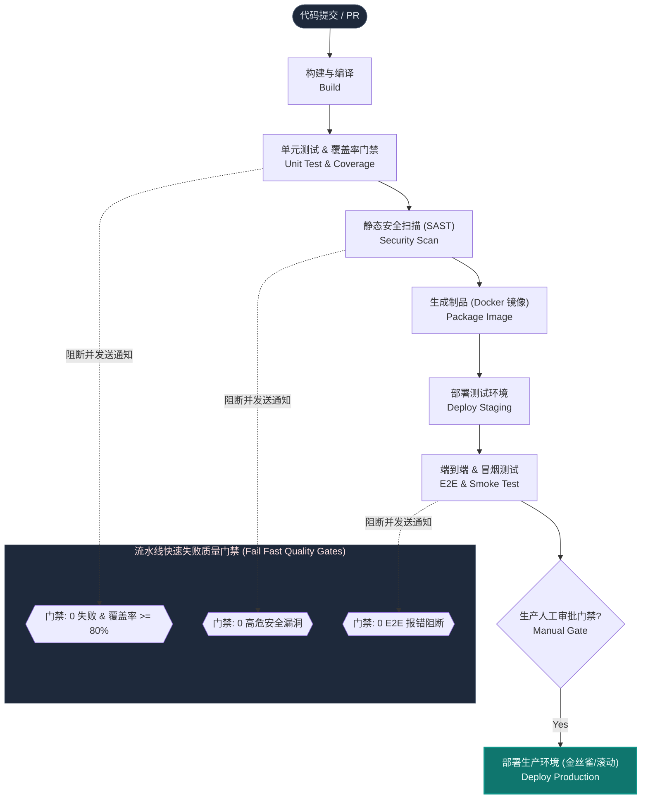
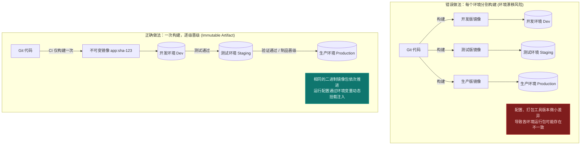
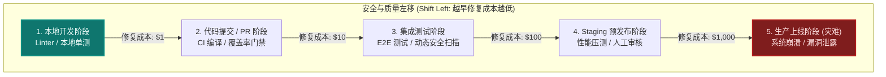

import GlossaryTerm from '@site/src/components/GlossaryTerm';
import GuidedExercise from '@site/src/components/GuidedExercise';
import ResearchNote from '@site/src/components/ResearchNote';
import ChapterMeta from '@site/src/components/ChapterMeta';
import PyRunner from '@site/src/components/PyRunner';
import TradeoffExplorer from '@site/src/components/TradeoffExplorer';
import QuizCard from '@site/src/components/QuizCard';

# M6L6 · CI/CD 流水线

<ChapterMeta
  time="约 2.5 小时"
  prereqs={[{label: 'L13 测试与 TDD', href: '../foundations/testing-and-tdd'}, {label: 'M6L1 不可变镜像', href: './containers'}, {label: 'M6L4 发布策略', href: './autoscaling-rollout'}]}
  outcome="能设计 CI/CD 流水线：构建→测试→门禁→部署各阶段的职责、fail-fast、质量门禁与制品晋级，并理解它如何支撑高频低风险交付。"
  howToUse="先看“手动测试手动部署”的慢与险，再理解流水线的阶段与门禁，最后做流水线编排 lab。"
/>

:::tip 让“从代码到生产”这条路，自动、快速、可重复、可回滚
代码写完只是开始。它要被构建、测试、安全扫描、打成[镜像](./containers)、部署到各环境、最后上生产。手动做这一切又慢又容易漏。CI/CD 把这条路**做成一条自动化流水线**：每次提交自动跑、有问题尽早拦、通过所有关卡才能上线。这是 [DORA 高效能团队](../foundations/testing-and-tdd) 的核心能力。
:::

## 一、手动交付：慢、易错、不敢发

没有流水线的团队：开发本地"应该没问题"就合并；测试靠人手点；部署是某个人 SSH 上去拉代码重启；上线挑周五晚上、全员守着。结果：bug 漏到生产、部署步骤每次不一样、出事不敢回滚、发版频率低到一季度一次。**根因：从代码到生产的每一步都靠人，既慢又不可靠。**

## 二、三个核心概念（分层）

### 基础：CI 与 CD

- <GlossaryTerm term="Continuous Integration" definition="持续集成（CI）：开发者频繁把代码合并到主干，每次合并都自动触发构建和测试，尽早发现集成问题，避免“合并地狱”。" >持续集成（CI）</GlossaryTerm>：每次提交/合并都自动**构建 + 测试**，尽早发现问题（[L13 测试](../foundations/testing-and-tdd) 在这里自动化）。频繁小步合并，避免"几周后大合并炸一片"。
- <GlossaryTerm term="Continuous Delivery/Deployment" definition="持续交付/部署（CD）：CI 通过后，自动把通过验证的制品部署到各环境。持续交付指“随时可一键发布”，持续部署指“自动一路发到生产”。" >持续交付/部署（CD）</GlossaryTerm>：CI 通过后，自动把制品**部署**到各环境。持续交付 = 随时能一键发；持续部署 = 自动一路发到生产。

### 进阶：阶段、门禁与 fail-fast

流水线是一串**阶段（stage）**：`构建 → 单元测试 → 集成测试 → 安全扫描 → 打镜像 → 部署 staging → 端到端测试 → 部署生产`。两个关键原则：
- <GlossaryTerm term="Fail Fast" definition="快速失败：把最快、最便宜的检查放在流水线前面，一旦失败立即停止、不再跑后面昂贵的阶段，尽早给开发者反馈。" >fail-fast</GlossaryTerm>：便宜快的检查（编译、单测）放前面，一失败立刻停，不浪费时间跑后面昂贵的阶段。
- <GlossaryTerm term="Quality Gate" definition="质量门禁：流水线中必须通过才能进入下一阶段的检查（如测试全过、覆盖率达标、无高危漏洞、需人工审批）。不达标就阻断发布。" >质量门禁（quality gate）</GlossaryTerm>：每个阶段是个关卡——测试全过、覆盖率达标、无高危漏洞、（生产前）人工审批，不达标就**阻断**，绝不放行。

#### CI/CD 典型阶段与质量门禁流转



### 深入（选学）：制品晋级、流水线即代码与安全左移

- <GlossaryTerm term="Build Once, Promote" definition="一次构建、逐级晋级：只在 CI 阶段构建一次不可变制品（镜像），然后让同一个制品依次晋级到 dev/staging/prod，而不是每个环境各自重新构建——保证各环境跑的是同一个二进制。" >一次构建、逐级晋级</GlossaryTerm>：只构建一次不可变<GlossaryTerm term="Software Artifact" definition="软件制品 (Software Artifact)：在软件开发生命周期中，由编译、构建等构建过程所产生的可部署二进制包、归档文件或容器镜像。它是一个特定版本代码编译出的不可变输出产物。">制品（镜像）</GlossaryTerm>，让**同一个制品**依次晋级 dev→staging→prod。绝不每个环境各自重新构建（否则各环境跑的不是同一个东西，又回到漂移）。

#### "一次构建，逐级晋级"防漂移镜像晋级对比



- **流水线即代码**：流水线定义本身也是代码（`.gitlab-ci.yml` 等），版本化、可评审——和 [IaC（M6L5）](./infrastructure-as-code) 同理。
- <GlossaryTerm term="Shift Left" definition="安全/质量左移：把测试、安全扫描、合规检查尽量提前到流水线早期（甚至开发者本地），问题越早发现修复越便宜，而不是等上线前才检查。" >安全左移（shift left）</GlossaryTerm>：把测试、安全/依赖扫描、合规检查尽量前移，越早发现越便宜（[呼应 L13 缺陷成本曲线](../foundations/testing-and-tdd)）。

#### 安全与质量左移缺陷修复成本指数曲线



- 部署阶段对接 [M6L4 的发布策略](./autoscaling-rollout)：CD 不是粗暴替换，而是滚动/金丝雀 + 失败自动回滚。

<ResearchNote
  title="CI/CD：把交付变成快速、可重复、低风险的流水线"
  source="Humble & Farley, Continuous Delivery；DORA / Accelerate（四大关键指标）"
  href="https://dora.dev/"
  insight="《Continuous Delivery》确立了流水线、一次构建逐级晋级、自动化测试门禁等实践。DORA 研究用四大指标（部署频率、变更前置时间、变更失败率、恢复时间）证明：高频、小批量、自动化的交付反而更稳定——速度与稳定性正相关，而非取舍。"
  application="建流水线：阶段化 + fail-fast + 质量门禁 + 一次构建逐级晋级 + 安全左移 + 自动回滚。用 <GlossaryTerm term='DORA Metrics' definition='DORA 指标 (DevOps Research and Assessment Metrics)：DevOps 领域公认用于衡量软件交付效能的四个关键指标，包括：部署频率 (Deployment Frequency)、变更前置时间 (Lead Time for Changes)、服务恢复时间 (Time to Restore Service) 以及变更失败率 (Change Failure Rate)。前两个衡量速度，后两个衡量稳定性。'>DORA</GlossaryTerm> 四指标度量交付效能。流水线本身用代码管理。让“发布”从高风险事件变成日常无感操作。"
/>

## 三、跟我做一遍：流水线编排（fail-fast + 门禁）

<PyRunner
  rows={34}
  expect="门禁拦截、fail-fast 生效"
  code={`def run_pipeline(stages, context):
    # 按顺序跑各阶段；任一失败立即停止（fail-fast），后续不再跑
    log = []
    for name, stage_fn in stages:
        ok, msg = stage_fn(context)
        log.append((name, "PASS" if ok else "FAIL", msg))
        if not ok:
            log.append(("PIPELINE", "ABORTED", "在 %s 阶段失败，停止" % name))
            return log
    log.append(("PIPELINE", "SUCCESS", "已部署到生产"))
    return log

# 各阶段：返回 (是否通过, 说明)
def build(ctx):    return (True, "镜像 app:%s" % ctx["sha"])
def unit_test(ctx): return (ctx["tests_pass"], "单元测试")
def coverage_gate(ctx): return (ctx["coverage"] >= 80, "覆盖率 %d%%" % ctx["coverage"])
def security(ctx):  return (ctx["vulns"] == 0, "高危漏洞 %d 个" % ctx["vulns"])
def deploy(ctx):    return (True, "金丝雀发布")

stages = [("build", build), ("unit_test", unit_test),
          ("coverage", coverage_gate), ("security", security), ("deploy", deploy)]

print("== 正常提交 ==")
for row in run_pipeline(stages, {"sha": "a1", "tests_pass": True, "coverage": 90, "vulns": 0}):
    print(row)

print("== 覆盖率不达标 ==")
for row in run_pipeline(stages, {"sha": "b2", "tests_pass": True, "coverage": 60, "vulns": 0}):
    print(row)   # 在 coverage 门禁被拦，security/deploy 不再跑（fail-fast）
print("门禁拦截、fail-fast 生效")`}
/>

覆盖率门禁不达标就在该阶段停下，后面的安全扫描和部署根本不跑——既保证质量，又不浪费时间。**试试**:把 `security` 的 vulns 设为 2，看它在安全门禁被拦；调整阶段顺序，体会为什么便宜的检查要放前面（fail-fast）。

## 四、动手 Lab（必做）

打开 `labs/month06/m6l6_pipeline/`：

```bash
python labs/month06/m6l6_pipeline/test_pipeline.py
```

实现流水线编排器：按序跑阶段、任一门禁失败即 fail-fast 终止、返回执行日志。

<GuidedExercise
  title="练习指引：实现 CI/CD 流水线编排"
  goal="把“阶段化 + 门禁 + fail-fast”做成代码——这是所有 CI/CD 系统的骨架。"
  hints={[
    '每个阶段是 (name, fn)，fn(context) 返回 (ok, msg)。',
    '按顺序执行；任一阶段 ok=False 就立即停止（不跑后续）。',
    '返回执行日志，标明哪个阶段失败、是否 ABORTED。',
    '便宜快的检查放前面（fail-fast 省时间）。'
  ]}
  steps={[
    '实现 run_pipeline(stages, context)。',
    '顺序执行、记录每阶段 PASS/FAIL。',
    '任一失败立即返回（标 ABORTED），全过返回 SUCCESS。',
    '写测试：全过成功、中途门禁失败则后续不执行、记录正确。'
  ]}
  checks={[
    '你能列出典型流水线的阶段。',
    '你的编排器 fail-fast、门禁能阻断。',
    '你能解释“一次构建逐级晋级”为什么重要。',
    '你能说出 DORA 四指标及“速度与稳定性正相关”。'
  ]}
/>

## 架构师深潜（Staff+ 视角）

### 1. 交付成熟度

<TradeoffExplorer
  title="交付方式的成熟度"
  dimensions={['发布频率', '变更风险', '反馈速度', '可重复性', '建设成本']}
  options={[
    {
      name: '手动构建部署',
      scores: [1, 1, 1, 1, 5],
      note: '靠人。慢、易错、不可重复、不敢频繁发。',
      whenToUse: '原型/个人项目。'
    },
    {
      name: 'CI（自动构建测试）',
      scores: [3, 3, 5, 4, 3],
      note: '每次提交自动测，尽早发现问题。但部署仍可能手动。',
      whenToUse: '任何团队的第一步——先把 CI 建起来。'
    },
    {
      name: 'CI/CD（自动部署+门禁+回滚）',
      scores: [5, 4, 5, 5, 2],
      note: '全自动、门禁把关、金丝雀+自动回滚。高频低风险。建设和维护有成本。',
      whenToUse: '追求高效能交付的团队——目标态。'
    }
  ]}
/>

### 2. 速度与稳定性不是取舍，是同向

直觉以为"发得越快越容易出事"，DORA 的大规模研究恰恰相反：**高频、小批量、自动化的团队，部署频率高的同时变更失败率也低、恢复更快。** 原因：小批量变更容易测、容易定位、容易回滚；自动化门禁减少人为失误；频繁发布让"发布"这件事变得熟练无风险。所以架构师推动 CI/CD，不是为了"快"而牺牲"稳"，而是用自动化和小批量**同时**拿到快与稳。这是 [L13 测试](../foundations/testing-and-tdd)、[M6L4 金丝雀](./autoscaling-rollout) 串起来的终点。

### 3. 真实案例：流水线是现代工程团队的中枢神经

头部团队的一次提交会触发：自动构建镜像 → 跑几千个测试（并行）→ 安全/依赖扫描 → 部署预览环境 → 端到端测试 → 金丝雀发布 → 监控指标 → 自动晋级或回滚——全程几乎无人值守。这条流水线就是团队的"中枢神经"：质量标准、安全要求、合规检查全部固化成门禁，新人也能安全地一天发好几次。建设和维护好这条流水线，往往比写业务代码本身对团队效能影响更大。

### 4. 架构师深问（给自己 30 分钟）

- 你的"从提交到生产"现在要多久、多少步是手动的？最慢/最容易出错的是哪一步？
- 你的流水线有哪些质量门禁（测试/覆盖率/安全/审批）？还缺哪些？哪些该左移到本地/早期？
- 各环境跑的是同一个制品吗（一次构建逐级晋级），还是每个环境各自重新构建（隐患）？

## 自检清单

- [ ] 我能设计一条带阶段、门禁、fail-fast 的流水线。
- [ ] 我的 lab 编排器能 fail-fast 并阻断不达标的变更。
- [ ] 我理解“一次构建逐级晋级”和安全左移。
- [ ] 我能用 DORA 四指标度量交付效能。

## 常见误解

- **"搭建了 GitLab CI 或 Jenkins 脚本自动执行 `kubectl apply`，这就代表我们团队已经完全落地了 CI/CD 的工程标准"**：这是用“工具链”代替“工程规范”的典型误区。CI/CD 的精髓绝不在于写了几行流水线脚本，而在于**软件工程的纪律性与反馈速度**。真正的持续集成（CI）要求开发者每天将代码多次合并入主干，并且每次合并都必须在几分钟内给出构建和测试反馈；如果团队依然在跑“长命分支（Long-lived Branches）”且半个月才合并一次，或者流水线挂了无人理会、测试报错就直接用注释绕过，那么即便搭建了最先进的工具链，也根本没有落地 CI。
- **"由于测试环境、预发环境和生产环境的配置文件（如数据库连接、API Endpoint）各不相同，我们应当在流水线的不同环境中，分别使用各自的配置文件重新编译、构建镜像包"**：这是极具破坏性的**反模式（Anti-pattern）**，直接打破了“制品单一性”的铁律。如果在测试环境验证通过后，在发布生产环境时又重新构建了一次镜像，就根本无法保证新构建的包没有因为依赖解析升级、编译器差异或临时网络变更带入新的 Bug。正确的做法是：**应用镜像应当是 100% 环境无关（Environment-agnostic）的**，一次编译终身受用，不同环境的数据库密码、外部地址必须在运行时以环境变量或 K8s ConfigMap/Secret 的形式注入。
- **"持续部署（Continuous Deployment）倡导自动化，因此流水线末端绝对不应该存在‘人工点击审批’或者‘人工测试门槛’，否则就是反自动化的退步"**：混淆了持续交付（Continuous Delivery）与持续部署（Continuous Deployment）的定义界限。在许多受监管约束的企业（如金融、医疗）或具有严格合规要求的场景中，保留一个“人工点击审批”按钮或引入特定的手动预演评估是完全符合持续交付标准的。只要流水线在“从代码到生产发布前”的所有构建、测试、安全门禁全部自动化，应用保持随时可一键上线的就绪状态，就已经是极高水平的 CI/CD 落地。

## 常见误解自测

<QuizCard
  questions={[
    {
      q: '在持续部署（CD）的最佳实践中，为什么极力反对“在部署到 Staging 环境和 Production 环境时，分别使用该环境的分支或不同的 Dockerfile 重新进行镜像构建”？',
      options: [
        '因为这样会导致多次编译耗费不必要的云资源，纯粹是为了省钱和提高流水线速度。',
        '因为多次构建无法保证产物的绝对一致性。例如第三方依赖包版本变化、编译器小版本升级或临时环境变量差异，都会导致在测试环境通过验证的包与生产环境的包出现偏差（环境漂移）。正确做法是“一次构建，逐级晋级”，同一镜像通过不同环境的环境变量挂载运行。',
        '因为 K8s 无法拉取同一个 Docker 镜像，只支持按环境名称命名的镜像名称。'
      ],
      answer: 1,
      explain: '“一次构建，逐级晋级（Build Once, Promote）”是持续交付的底层法则。只有确保开发、测试和生产跑的是 100% 同一个二进制镜像包，测试环境的质量验证才对生产有绝对的保障作用。环境差异应当完全外置，由环境变量注入，而不要打包到镜像内部。'
    },
    {
      q: 'DevOps 研究与评估组织（DORA）提出的度量软件交付效能的四个核心指标（DORA Metrics）分别是什么？根据 DORA 报告，交付“速度”与系统“稳定性”之间是何种关系？',
      options: [
        '四大指标是：代码行数、Bug 数量、工时数、会议频率。报告证明，发版越快 Bug 越多，二者是相互冲突需要折中取舍的关系。',
        '四大指标是：部署频率、变更前置时间、服务恢复时间、变更失败率。研究表明交付速度与稳定性“正相关”——高效能团队不仅发布频率极高、前置时间极短，同时失败率极低且恢复极快，因为小批量发布和自动化流水线同时提升了二者。',
        '四大指标是：CPU 利用率、QPS、网络吞吐、内存占比。报告表明发版越慢系统越稳定。'
      ],
      answer: 1,
      explain: 'DORA Metrics 的四个核心指标分为速度维度（部署频率、变更前置时间）与稳定性维度（服务恢复时间、变更失败率）。DORA 报告彻底打破了“快就容易出错”的传统直觉，证明高效能团队利用自动化流水线、质量门禁与小步快跑，能够做到速度与稳定性兼得。'
    },
    {
      q: '在设计 CI/CD 流水线的“快速失败（Fail Fast）”与“质量门禁（Quality Gate）”时，以下哪种阶段和检查顺序的设计是最科学、最高效的？',
      options: [
        '先进行耗时最长的生产环境端到端（E2E）集成测试，通过后再执行单机编译与代码静态审查。',
        '应该将最快、最便宜的检查（如 Linter 静态扫描、单元测试与覆盖率门禁）放在流水线的最前列，一旦失败立即终止；然后才执行 Docker 镜像打包，并在部署 Staging 环境后跑耗时较长的集成与 E2E 测试。',
        '为了缩短流水线执行时间，应当不设中间任何拦截门禁，将所有构建和测试并行跑完，最后统一生成一份 PDF 报告由人工看。'
      ],
      answer: 1,
      explain: '快速失败（Fail-fast）原则。越便宜、越快的验证越要放前面。如果编译或基础单测没过，就完全没有必要去执行漫长且消耗昂贵算力的 Docker 构建或云端集成测试，这样可以以最快的速度将反馈提供给提交代码的开发者，节省计算资源和等待时间。'
    }
  ]}
/>

## 延伸阅读

- [DORA: DevOps Research and Assessment](https://dora.dev/)
- [Continuous Delivery (Humble & Farley)](https://continuousdelivery.com/)
- [下一课：可观测性进阶](./observability-advanced)
