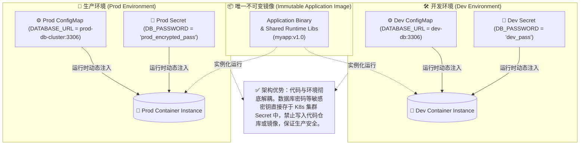
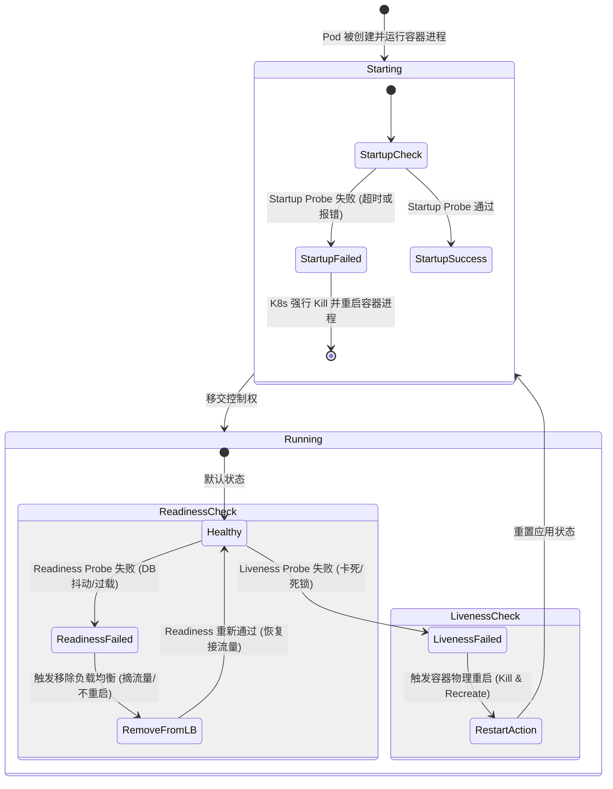
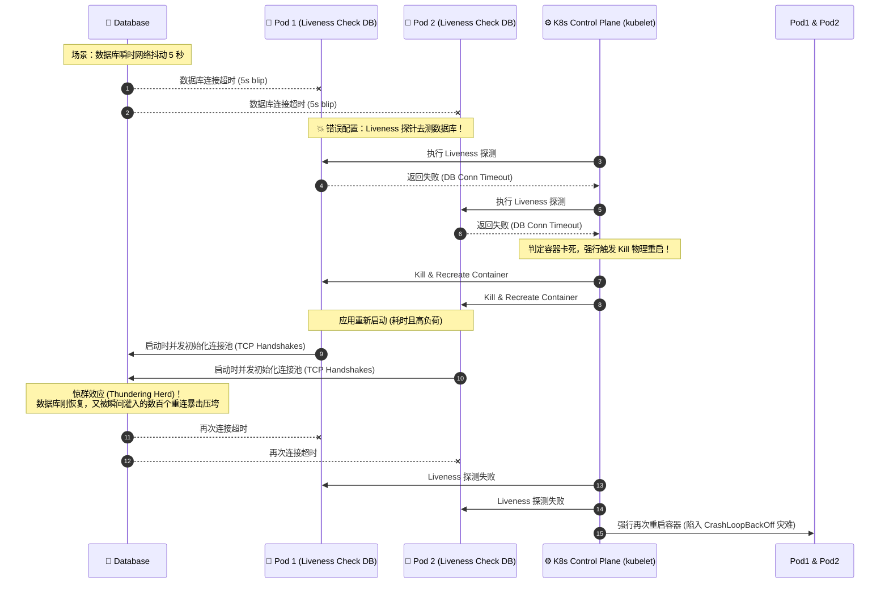

import GlossaryTerm from '@site/src/components/GlossaryTerm';
import GuidedExercise from '@site/src/components/GuidedExercise';
import ResearchNote from '@site/src/components/ResearchNote';
import ChapterMeta from '@site/src/components/ChapterMeta';
import PyRunner from '@site/src/components/PyRunner';
import TradeoffExplorer from '@site/src/components/TradeoffExplorer';
import QuizCard from '@site/src/components/QuizCard';

# M6L3 · 配置、密钥与探针

<ChapterMeta
  time="约 2.5 小时"
  prereqs={[{label: 'M6L2 Kubernetes 基础', href: './kubernetes-basics'}, {label: 'L14 配置与部署', href: '../foundations/config-and-deploy'}, {label: 'M5L3 健康检查', href: '../core-components/service-discovery'}]}
  outcome="能把配置/密钥与镜像分离、说清密钥管理要点，并区分 liveness/readiness/startup 探针各自决定什么。"
  howToUse="先看“配置写死进镜像、密钥进 Git”的坑，再理解配置外置和三种探针，最后做探针状态机 lab。"
/>

:::tip 同一个镜像，要能跑在 dev/staging/prod——靠的是配置外置
[不可变镜像（M6L1）](./containers) 要求“一次构建处处运行”。但 dev 连测试库、prod 连生产库，配置不同——难道每个环境构建一个镜像？不。**镜像不变，配置从外部注入**（[L14 配置与代码分离](../foundations/config-and-deploy) 的 12-Factor 原则）。而密钥（密码、token）更要特殊对待，绝不能进镜像或代码仓库。
:::

## 一、两个常见的部署事故

1. **配置写死进镜像/代码**：数据库地址硬编码，换环境就得改代码重新构建——违背不可变镜像、也无法一个镜像多环境复用。
2. **密钥进了 Git**：把数据库密码、API key 写进配置文件提交到仓库——一旦泄露（仓库被克隆、历史被翻出），全线沦陷。这是最常见也最致命的安全事故之一。

云原生用**配置外置 + 密钥专管 + 健康探针**这三件事来解决配置、安全和自愈。

## 二、三个核心概念（分层）

### 基础：配置外置（ConfigMap）



把“随环境变的配置”从镜像里抽出来，运行时注入。K8s 用 <GlossaryTerm term="ConfigMap" definition="ConfigMap：K8s 中存放非敏感配置（如数据库地址、功能开关、日志级别）的对象。以环境变量或文件挂载方式注入容器，使同一镜像可在不同环境用不同配置运行。">ConfigMap</GlossaryTerm> 存非敏感配置（数据库地址、日志级别、功能开关），以环境变量或挂载文件的方式注入容器。这样**同一个镜像**，dev/prod 注入不同 ConfigMap 就能跑出不同行为——不可变镜像 + 可变配置。

### 进阶：密钥管理（Secret）与三种探针



- <GlossaryTerm term="Secret" definition="Secret：K8s 中存放敏感数据（密码、token、证书、私钥）的对象，与普通配置分开管理，可限制访问权限、加密存储，并避免写入镜像或代码仓库。">Secret</GlossaryTerm>：专门存敏感数据，和普通配置分开、可加密存储、可细粒度授权。生产中常接入专门的密钥管理（Vault、云 KMS）做轮换和审计。**铁律：密钥永远不进镜像、不进代码仓库。**
- K8s 用探针让调和循环知道容器健康状况（[呼应 M5L3 健康检查](../core-components/service-discovery)）：
  - <GlossaryTerm term="Liveness Probe" definition="存活探针：检测容器是否还活着。失败（如死锁、卡死）则 K8s 重启该容器。回答的是“要不要重启它”。">liveness（存活）</GlossaryTerm>：失败 → **重启**容器（它卡死了）。
  - <GlossaryTerm term="Readiness Probe" definition="就绪探针：检测容器是否准备好接收流量。失败则把它从 Service 的负载均衡里摘除（不重启），恢复后再加回。回答的是“要不要给它发流量”。">readiness（就绪）</GlossaryTerm>：失败 → 从 [Service 负载均衡](./kubernetes-basics) **摘除**（不重启，只是暂时别给它流量）。

### 深入（选学）：探针配错会引发灾难



探针的区别极其重要，配错会自伤：
- <GlossaryTerm term="Startup Probe" definition="启动探针：用于启动慢的应用，在它启动期间暂停 liveness 检查，避免“还没启动完就被误判为卡死而重启”的循环。启动成功后才交给 liveness。">startup（启动）探针</GlossaryTerm>：给启动慢的应用一个宽限期，避免“还没起来就被 liveness 当成卡死、反复重启”的死循环。
- **把“依赖不可用”当 liveness 失败**是经典错误：数据库抖动一下，liveness 失败 → 容器被重启 → 重启也连不上 → 进入<GlossaryTerm term="CrashLoopBackOff" definition="崩溃循环退避 (CrashLoopBackOff)：Kubernetes 中的一种 Pod 状态。当容器启动失败或由于探针不通过而反复异常退出并重启时，K8s 为了保护宿主机资源并避免无效重启风暴，会指数级延长每次重启之间的等待间隔时间（从 10s、20s 直至最大 300s 宽限期）。">崩溃退避（CrashLoopBackOff）</GlossaryTerm>死循环，把瞬时抖动放大成了持久的全军覆没。正确做法：依赖问题用 readiness（摘流量、等恢复）+ [熔断/降级（M5L6）](../core-components/circuit-breaker)，而不是 liveness 重启。
- **readiness 让滚动发布安全**：新 Pod 起来后，只有 readiness 通过才被加进流量（[M6L4 滚动发布](./autoscaling-rollout) 靠它实现“先就绪再切流量、零停机”）。
- 这本质是一个**健康状态机**（[回扣 M4L9 状态机](../design-patterns-lld/state-machine-elevator)）：starting → ready（接流量）→ unready（摘流量但不杀）→ dead（重启），不同信号驱动不同动作。

<ResearchNote
  title="配置外置 + 健康信号：让同一镜像安全地多环境运行与自愈"
  source="The Twelve-Factor App（Config）；Kubernetes — ConfigMaps/Secrets/Probes；CNCF Secrets 管理实践"
  href="https://12factor.net/config"
  insight="12-Factor 主张把配置存于环境、与代码严格分离，使同一构建产物可在任意环境运行。K8s 用 ConfigMap/Secret 落地这一点，并用 liveness/readiness/startup 三种探针把“是否重启 / 是否给流量 / 是否还在启动”分开，驱动自愈与零停机发布。"
  application="配置外置（ConfigMap），密钥专管（Secret/Vault/KMS、绝不进仓库）。探针要分清：依赖故障用 readiness 摘流量 + 熔断，别用 liveness 重启；启动慢用 startup 探针。把健康当状态机设计，避免 CrashLoop。"
/>

## 三、跟我做一遍：健康探针状态机

<PyRunner
  rows={30}
  expect="探针正确驱动动作"
  code={`# liveness 决定“重启”，readiness 决定“是否给流量”——分开判断
def decide(liveness_ok, readiness_ok):
    if not liveness_ok:
        return "RESTART"          # 卡死 -> 重启容器
    if not readiness_ok:
        return "REMOVE_FROM_LB"   # 活着但没准备好 -> 摘流量（不重启）
    return "SERVE"                # 健康 -> 正常接流量

print("健康:", decide(True, True))                              # SERVE
print("DB抖动:", decide(liveness_ok=True, readiness_ok=False))  # REMOVE_FROM_LB（摘流量，不重启）
print("卡死:", decide(liveness_ok=False, readiness_ok=False))   # RESTART

# 反例警示：把“依赖不可用”错配成 liveness 会怎样
def bad_decide(db_ok):
    return "RESTART" if not db_ok else "SERVE"   # 错！DB 抖动就重启
print("错误配置后果:", bad_decide(db_ok=False))   # RESTART -> 重启也连不上 -> CrashLoop
print("探针正确驱动动作")`}
/>

依赖抖动用 readiness 摘流量（等它恢复再加回），只有真卡死才用 liveness 重启——把“是否重启”和“是否给流量”分开，是避免 CrashLoop 的关键。**试试**：实现 startup 探针逻辑——启动期内即使 liveness 失败也不重启（给宽限期）。

## 四、动手 Lab（必做）

打开 `labs/month06/m6l3_probes/`：

```bash
python labs/month06/m6l3_probes/test_probes.py
```

实现探针决策状态机：liveness 失败重启、readiness 失败摘流量、startup 期内不被 liveness 误杀。

<GuidedExercise
  title="练习指引：实现探针状态机"
  goal="把“liveness/readiness/startup 分别驱动什么动作”做成代码，避免依赖抖动引发 CrashLoop。"
  hints={[
    'liveness 失败 -> RESTART；readiness 失败（liveness 正常）-> REMOVE_FROM_LB；都正常 -> SERVE。',
    'startup 探针：启动未完成时，即使 liveness 失败也返回 WAIT（不重启）。',
    '依赖（DB）故障应映射到 readiness，而不是 liveness。',
    '把它当状态机：starting/ready/unready/dead。'
  ]}
  steps={[
    '实现 decide(liveness_ok, readiness_ok, started=True)。',
    'started=False 时优先返回 WAIT（启动宽限）。',
    '正确区分 RESTART / REMOVE_FROM_LB / SERVE。',
    '写测试：健康 SERVE、依赖故障摘流量、卡死重启、启动期不被误杀。'
  ]}
  checks={[
    '你能说出 ConfigMap 和 Secret 的区别与用途。',
    '你能区分 liveness/readiness/startup 各驱动什么动作。',
    '你的 lab 不会因依赖抖动而 CrashLoop。',
    '你理解密钥为什么绝不能进镜像/仓库。'
  ]}
/>

## 架构师深潜（Staff+ 视角）

### 1. 配置与密钥的管理方式

<TradeoffExplorer
  title="配置/密钥管理"
  dimensions={['安全性', '可审计/轮换', '多环境复用', '使用简便', '运维成本']}
  options={[
    {
      name: '写死进镜像/代码',
      scores: [1, 1, 1, 5, 5],
      note: '最省事，但换环境要重建、密钥泄露风险极高。',
      whenToUse: '几乎从不（尤其密钥绝对不行）。'
    },
    {
      name: 'ConfigMap + Secret',
      scores: [3, 3, 5, 4, 3],
      note: '配置外置、镜像复用。Secret 默认仅 base64，需开启加密存储。',
      whenToUse: 'K8s 内的标准做法。'
    },
    {
      name: '专用密钥管理(Vault/KMS)',
      scores: [5, 5, 5, 2, 1],
      note: '加密、动态密钥、自动轮换、细粒度审计。但要额外组件和集成。',
      whenToUse: '对密钥安全/合规要求高时（金融、企业）。'
    }
  ]}
/>

### 2. 探针设计是"自愈"成败的关键细节

K8s 的自愈（[M6L2 调和](./kubernetes-basics)）听起来美好，但探针配错会让它"自残"：liveness 太敏感 → 频繁重启；把依赖故障当 liveness → CrashLoop 雪崩；没有 readiness → 滚动发布时流量打到没准备好的 Pod 报错；没有 startup → 慢启动应用永远起不来。架构师要把探针当成**精心设计的健康契约**：明确"什么算活着""什么算能服务""启动要多久"，并和 [M5 熔断/降级](../core-components/circuit-breaker) 配合处理依赖故障，而不是靠重启硬刚。

### 3. 真实案例：一次探针配置引发的雪崩

业界常见事故模式：把"检查数据库连接"放进 liveness 探针。某天 DB 短暂过载，所有 Pod 的 liveness 同时失败 → K8s 同时重启所有 Pod → 重启风暴 + 重连风暴进一步压垮 DB → 整个服务长时间不可用。本可以只是几秒抖动（readiness 摘流量 + 熔断等恢复），却被错误的探针放大成大故障。这印证 [M5L7](../core-components/retry-backoff-timeout) 的教训：自动化的纠正动作如果没有纪律，会放大故障。

### 4. 架构师深问（给自己 30 分钟）

- 你的 liveness 探针检查的是"进程本身健康"还是误把"依赖可用"也算进去了？后者有什么风险？
- 你的服务启动要多久（加载模型、预热缓存）？没有 startup 探针会发生什么？
- 密钥现在放在哪？进过 Git 吗？怎么做轮换和泄露后的快速失效（提示：Secret 引用 + KMS + 短期凭证）？

## 自检清单

- [ ] 我能把配置/密钥与镜像分离（ConfigMap/Secret）。
- [ ] 我能区分 liveness/readiness/startup 探针各驱动什么。
- [ ] 我的 lab 探针状态机不会因依赖抖动 CrashLoop。
- [ ] 我知道密钥绝不进镜像/仓库、要专管轮换。

## 常见误解

- **"配置和密钥理所当然应该跟代码一起存放在配置文件里，并提交到 Git 仓库，方便进行版本管理与追溯"**: 极其初级的研发认知，是绝大多数企业生产密钥泄露事故的罪魁祸首。第一，将私钥、数据库密码提交到 Git 仓库，使得凡是能接触代码的人员都自动获取了数据库所有读写权限，存在巨大的人为数据泄露与勒索安全漏洞；第二，当线上密码过期需要紧急轮换时，若写死在仓库中，便不得不重新提交代码、走一遍漫长的 CI/CD 构建发布流程，严重延误抢修时机。正确的做法是使用 Secret/KMS 存储，将配置外置，保持应用镜像 100% 的环境无关性。
- **"liveness、readiness 以及 startup 三种探针功能都大差不差，为了省事，我应该全部配置成一模一样的探测端口与判断逻辑"**: 极具破坏性的配置习惯，会导致灾难性的自愈副作用。第一，如果把“外部依赖（如 DB）可用性”错误地写进 Liveness 探针中，一旦网络出现一瞬间的抖动，Liveness 失败会导致全网所有容器被 K8s 强行 Kill 重启，引发惊群式的重连雪崩；第二，如果不配置 Startup 探针，仅配置 Liveness 且超时参数较窄，对于一些冷启动慢、预热时间长的应用（如 Java/Pytorch 模型加载），会触发“还没启动完就被判定卡死而重启”的无限重启地狱（CrashLoopBackOff）。
- **"既然我们已经使用了 K8s Secret 存储线上密码，它天然就支持防篡改与高强度加密，数据绝对是安全的"**: 致命的安全漏洞误解。Kubernetes 中默认的 Secret 并没有进行任何密码学加密，而仅仅是用 `Base64` 编码成了可读的纯文本字符串。任何拥有该 Namespace 只读权限（或 etcd 存储读取权限）的人，都可以通过简单的 Base64 Decode 命令（如 `echo -n '...' | base64 -d`）拿到明文密码。要保证 Secret 真正安全，必须启用 Kubernetes etcd 的 **静态加密（Encryption at Rest）**，或者结合外部的 HashiCorp Vault / 厂商云 KMS 服务进行强密钥管理。

## 常见误解自测

<QuizCard
  questions={[
    {
      q: '在 Kubernetes 环境中，将‘依赖数据库断连’这一异常错误，错配给‘存活探针（Liveness Probe）’而非‘就绪探针（Readiness Probe）’，在生产高并发下会引发什么级联灾难？',
      options: [
        '这会导致数据库节点被物理格式化，造成数据丢失。',
        '一旦数据库发生瞬时抖动或轻度过载响应慢，Liveness 探针检测失败会导致 K8s 强行 Kill 应用容器并重启。而在高并发下，所有应用节点齐刷刷重启、重建连接将产生极大的‘惊群效应’，瞬间向数据库灌入排山倒海的初始连接请求，直接将数据库彻底压瘫。同时系统会陷入 CrashLoop 恶性循环，导致小抖动演变成全网崩溃。',
        '这会导致应用直接切换到 AP 模式，继续处理请求但不保存数据。'
      ],
      answer: 1,
      explain: '存活探针（Liveness）与就绪探针（Readiness）经典误区。Liveness 决定要不要‘杀掉进程’，Readiness 决定要不要‘停止发流量’。依赖故障应该让应用保持存活但停止接流，等待依赖恢复，重启进程不仅于事无补，反而会通过瞬间连接风暴雪上加霜。'
    },
    {
      q: '云原生遵循的 Twelve-Factor 规范极力倡导‘将配置与代码/镜像严格分离’。这在实践中如何利用 ConfigMap 和 Secret 落地？同一镜像多环境运行的底层安全准则是什么？',
      options: [
        '将不同环境的配置和私钥提前写死打包在不同的镜像层里，部署时指定不同标签。',
        '应用镜像必须保持 100% 不可变（Immutable Image），即同一个二进制包/镜像运行在开发、预发和生产环境。通过 K8s 在运行时以环境变量或挂载文件（Volume Mounts）将 ConfigMap（存放数据库地址等非敏感配置）和 Secret（存放密码、秘钥等敏感配置）动态注入容器。并且 Secret 应当限制权限，避免任何敏感密钥流入代码仓库或镜像文件系统中。',
        '所有的配置都必须在应用启动后，由开发人员通过 SSH 终端手动敲命令输入进程内存。'
      ],
      answer: 1,
      explain: '配置外置与不可变镜像的工业落地。一次构建，处处运行。如果把敏感数据打包进镜像，相当于将线上所有权限彻底暴露给任何能够读取镜像的开发/运维人员，极易发生泄露灾难。'
    },
    {
      q: '如果你的 Java 或 Python 应用程序启动极其缓慢（例如由于框架加载和缓存预热需要 1 分钟），而你在 K8s 中仅配置了 Liveness 探针（超时为 10 秒），系统会发生什么现象？应当如何引入探针予以解决？',
      options: [
        '应用容器会在 10 秒后正常运行，但无法向外部发送网络数据包。',
        '容器启动尚未完成时，Liveness 探针便会超时失败，K8s 会误判其卡死并强行将其重启，重启后又在 10 秒内超时再次重启，陷入无限重启的死循环。应当引入‘启动探针（Startup Probe）’为慢应用提供较长的启动宽限期，在启动探针通过前，Liveness 和 Readiness 探针都处于暂停状态，成功启动后才移交控制权。',
        'K8s 会自动忽略该超时，并等待无限长时间直至容器自行汇报就绪。'
      ],
      answer: 1,
      explain: '启动探针的引入动因。传统的做法是调大 Liveness 的初始延迟，但这会导致进程在运行中卡死时，K8s 响应重启的速度同样变得极慢。利用 Startup 探针，可以兼顾应用‘启动宽限’与‘运行自愈’的双重目标。'
    }
  ]}
/>

## 延伸阅读

- [The Twelve-Factor App: Config](https://12factor.net/config)
- [Kubernetes: Configure Liveness, Readiness and Startup Probes](https://kubernetes.io/docs/tasks/configure-pod-container/configure-liveness-readiness-startup-probes/)
- [下一课：自动伸缩与滚动发布](./autoscaling-rollout)
