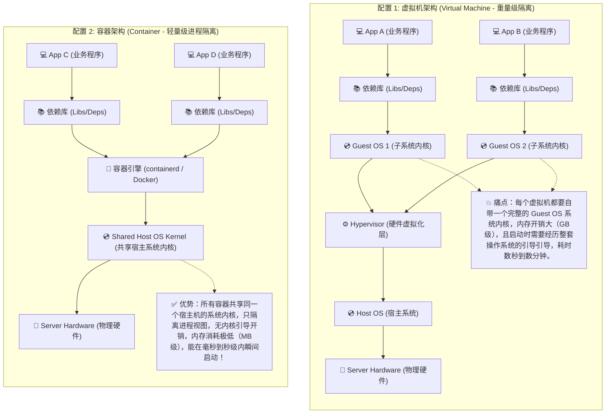
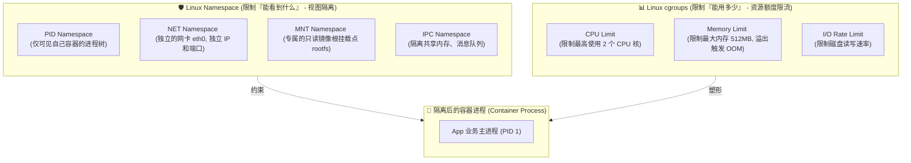
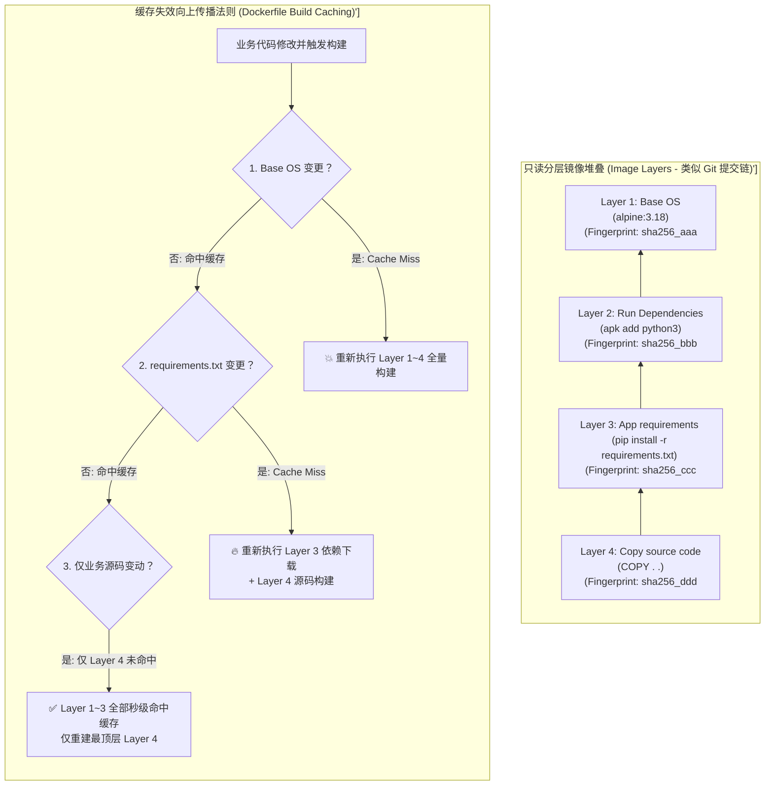

import GlossaryTerm from '@site/src/components/GlossaryTerm';
import GuidedExercise from '@site/src/components/GuidedExercise';
import ResearchNote from '@site/src/components/ResearchNote';
import ChapterMeta from '@site/src/components/ChapterMeta';
import PyRunner from '@site/src/components/PyRunner';
import TradeoffExplorer from '@site/src/components/TradeoffExplorer';
import QuizCard from '@site/src/components/QuizCard';

# M6L1 · 容器化

<ChapterMeta
  time="约 2.5 小时"
  prereqs={[{label: 'L14 配置与部署', href: '../foundations/config-and-deploy'}, {label: 'L5 无状态服务', href: '../foundations/state-and-storage'}]}
  outcome="能说清容器靠什么实现隔离（命名空间/cgroups）、和虚拟机的区别、镜像分层为什么让构建和分发高效，并理解“不可变镜像”如何根治环境漂移。"
  howToUse="先看“本机能跑、上线就崩”的痛，再理解容器和镜像分层，最后做镜像层缓存 lab。"
/>

:::tip 容器解决的是一个古老的痛：“在我机器上是好的啊”
代码在你笔记本上跑得好好的，一上测试环境就崩——因为两边的操作系统、库版本、环境变量、依赖全不一样（[L14 环境漂移](../foundations/config-and-deploy)）。容器的核心思想：**把应用和它需要的一切（运行时、库、配置）打包成一个不可变的镜像，到哪都一模一样地跑。**
:::

## 一、环境漂移：部署最大的隐形杀手

经典灾难：本机 Python 3.11 + 某库 2.0，生产是 3.9 + 某库 1.4；本机有个环境变量生产没有；本机装了某系统库生产缺。结果代码逻辑没问题，却因为**运行环境不一致**而崩。传统解法（写部署文档、手动装依赖）既慢又总出错。容器把"环境"本身也变成可版本化、可复制的产物——**一次构建，处处运行。**

## 二、三个核心概念（分层）

### 基础：容器是什么、和虚拟机的区别



<GlossaryTerm term="Container" definition="容器：把应用及其依赖打包、并与宿主机其它进程隔离运行的轻量单元。它共享宿主机内核，靠命名空间和 cgroups 实现隔离，比虚拟机轻得多、启动快得多。" >容器（Container）</GlossaryTerm>是一个被隔离的进程，自带它需要的依赖。它和<GlossaryTerm term="Virtual Machine" definition="虚拟机：通过 hypervisor 虚拟出完整硬件、运行独立操作系统内核。隔离更强但更重（每台带一个完整 OS），启动慢、占资源多。" >虚拟机（VM）</GlossaryTerm>的关键区别：VM 虚拟出整套硬件 + 跑一个完整操作系统（重、慢、强隔离）；容器**共享宿主机内核**，只隔离进程视图（轻、秒级启动、隔离稍弱）。所以一台机器能跑几十上百个容器，而 VM 只能跑几个。

### 进阶：靠什么隔离——命名空间与 cgroups



容器的"隔离"不是魔法，是 Linux 内核的两个机制：
- <GlossaryTerm term="Namespace" definition="命名空间：Linux 内核机制，让进程看到的资源（进程树、网络、挂载点、主机名、用户）被隔离。容器里 ps 只看到自己的进程、有自己的网络栈，就是命名空间的效果。" >命名空间（namespace）</GlossaryTerm>：隔离**视图**——容器里看到的进程、网络、文件系统挂载、主机名都是自己的一套，看不到宿主机和其它容器。
- <GlossaryTerm term="cgroups" definition="控制组（control groups）：Linux 内核机制，限制和统计一组进程能用的 CPU、内存、IO 等资源。容器靠它做到“最多用 2 核 4G”，防止一个容器吃光宿主机资源。" >cgroups（控制组）</GlossaryTerm>：限制**资源**——这个容器最多用 2 核、4G 内存，防止它吃光宿主机（这正是 [M5L8 舱壁](../core-components/bulkhead-isolation) 在操作系统层的体现）。

### 深入（选学）：镜像分层与不可变性



<GlossaryTerm term="Container Image" definition="容器镜像：一个只读的、分层的应用打包产物，包含运行应用所需的文件系统和元数据。容器是镜像运行起来的实例。镜像不可变、可版本化、可分发。" >镜像（image）</GlossaryTerm>是容器的"模板"，它最精妙的设计是<GlossaryTerm term="Layered Image" definition="镜像分层：镜像由一叠只读层组成（如基础 OS 层、依赖层、应用代码层）。层可被多个镜像共享和缓存；只改动的层需要重建/传输，未变的层直接复用。" >分层（layers）</GlossaryTerm>：
- 镜像由一叠**只读层**堆成：基础 OS 层 → 依赖层 → 应用代码层。
- **构建缓存**：只有变化的层及其之上的层需要重建。改一行业务代码，只重建最上面的代码层，下面的依赖层直接复用——构建从几分钟降到几秒。
- **分发高效**：不同镜像共享相同的基础层，拉取时已有的层不用重传。
- <GlossaryTerm term="Immutable Image" definition="不可变镜像：镜像一旦构建就不再修改；要变就构建新版本、重新部署。配合版本标签，让“部署什么”完全确定、可回滚，根治环境漂移。" >不可变（immutable）</GlossaryTerm>：镜像构建好就不再改，要变就出新版本。配合 [L14 不可变部署](../foundations/config-and-deploy)，"线上跑的到底是哪个版本"完全确定、可回滚。

<ResearchNote
  title="容器：把“环境”变成可版本化的产物"
  source="Merkel (2014), Docker: Lightweight Linux Containers；Linux namespaces & cgroups；<GlossaryTerm term='OCI' definition='OCI (Open Container Initiative): 开放容器计划，是一个致力于建立容器格式和运行时的开放工业标准的 Linux 基金会项目，确保了不同容器引擎（如 Docker、containerd、Podman）之间的镜像和运行时规范的通用与互操作性。'>OCI</GlossaryTerm> 镜像规范"
  href="https://opencontainers.org/"
  insight="容器并非新内核技术，而是把 Linux 早已存在的 namespaces（隔离视图）和 cgroups（限制资源）封装成易用的打包/分发体验。Docker 的关键创新是分层镜像 + 镜像仓库，让“构建一次、处处运行”和高效分发成为现实。<GlossaryTerm term='OCI' definition='OCI (Open Container Initiative): 开放容器计划，是一个致力于建立容器格式和运行时的开放工业标准的 Linux 基金会项目，确保了不同容器引擎（如 Docker、containerd、Podman）之间的镜像和运行时规范的通用与互操作性。'>OCI</GlossaryTerm> 把镜像和运行时标准化。"
  application="把应用容器化是云原生的第一步：依赖随镜像走、环境一致、秒级启动、可版本回滚。设计 Dockerfile 时按“变化频率”排层（依赖在下、代码在上）以最大化缓存命中。容器要无状态（[L5](../foundations/state-and-storage)），状态外移。"
/>

## 三、跟我做一遍：镜像分层构建缓存

<PyRunner
  rows={32}
  expect="只重建变化的层及其之上"
  code={`# 模拟镜像分层构建：每层有内容指纹，未变的层命中缓存、不重建
def build(layers, cache):
    built = []
    invalidated = False     # 一旦某层变了，它之上的层都要重建
    for name, content in layers:
        key = (name, content)
        if not invalidated and cache.get(name) == content:
            built.append((name, "CACHED"))
        else:
            invalidated = True          # 这层变了 -> 之上全部重建
            cache[name] = content
            built.append((name, "BUILD"))
    return built

cache = {}
# 第一次构建：全部 BUILD
layers_v1 = [("base-os", "ubuntu22"), ("deps", "reqs-hash-aaa"), ("code", "app-v1")]
print("首次:", build(layers_v1, cache))

# 只改了业务代码（code 层），依赖没变
layers_v2 = [("base-os", "ubuntu22"), ("deps", "reqs-hash-aaa"), ("code", "app-v2")]
print("改代码:", build(layers_v2, cache))     # base/deps CACHED, code BUILD

# 改了依赖（deps 层）：它和它之上的 code 都要重建，base 仍缓存
layers_v3 = [("base-os", "ubuntu22"), ("deps", "reqs-hash-bbb"), ("code", "app-v2")]
print("改依赖:", build(layers_v3, cache))     # base CACHED, deps/code BUILD
print("只重建变化的层及其之上")`}
/>

未变的层命中缓存直接复用，只有变化的层及其**之上**的层需要重建——这就是为什么 Dockerfile 要把"不常变的依赖"放在"常变的代码"之前。**试试**：把 `deps` 层放到 `code` 之后，看改代码时依赖层是否还能命中缓存（不能了——层顺序错了）。

## 四、动手 Lab（必做）

打开 `labs/month06/m6l1_image_layers/`：

```bash
python labs/month06/m6l1_image_layers/test_layers.py
```

实现镜像分层构建缓存：未变层命中、变化层及其之上重建，并理解层顺序对缓存命中的影响。

<GuidedExercise
  title="练习指引：实现分层构建缓存"
  goal="把“层指纹 + 缓存命中 + 失效传播”做成代码，体会层顺序为什么决定构建速度。"
  hints={[
    '按顺序遍历层；维护一个 invalidated 标志。',
    '某层内容与缓存一致且尚未失效 -> CACHED；否则 BUILD 并置 invalidated=True。',
    '一旦 invalidated，之后所有层都 BUILD（即使内容相同）。',
    '把缓存更新为当前内容，便于下次比较。'
  ]}
  steps={[
    '实现 build(layers, cache)：返回每层 CACHED/BUILD。',
    '正确实现失效向上传播（变化层之上全部重建）。',
    '更新缓存。',
    '写测试：首次全 BUILD、改顶层只重建顶层、改底层导致其上全重建、层顺序影响命中。'
  ]}
  checks={[
    '你能区分容器和虚拟机。',
    '你能说出命名空间和 cgroups 各隔离什么。',
    '你的 lab 正确实现层缓存与失效传播。',
    '你能解释为什么依赖层要放在代码层之前。'
  ]}
/>

## 架构师深潜（Staff+ 视角）

### 1. 隔离方式怎么选

<TradeoffExplorer
  title="应用打包/隔离方式"
  dimensions={['隔离强度', '启动速度', '资源开销', '密度(单机能跑多少)', '环境一致性']}
  options={[
    {
      name: '裸机/直接部署',
      scores: [1, 5, 5, 2, 1],
      note: '直接装在机器上。无开销，但环境漂移严重、依赖冲突、难复制。',
      whenToUse: '极少数性能极致或遗留场景。'
    },
    {
      name: '虚拟机',
      scores: [5, 1, 1, 2, 4],
      note: '完整 OS 隔离、最强。但重、启动慢、密度低。',
      whenToUse: '强隔离/多租户/跑不同内核时。'
    },
    {
      name: '容器',
      scores: [3, 5, 5, 5, 5],
      note: '轻量隔离、秒起、高密度、环境一致。隔离弱于 VM（共享内核）。',
      whenToUse: '云原生默认——绝大多数微服务。'
    }
  ]}
/>

### 2. 容器是云原生这座大厦的地基

后面所有内容都建立在容器之上：[K8s](./kubernetes-basics) 调度的是容器、[CI/CD](./cicd-pipelines) 产出的制品是镜像、[服务网格](./service-mesh) 的 sidecar 是容器、[自动伸缩](./autoscaling-rollout) 增减的是容器副本。容器把"一个可部署单元"标准化了，上层才能在它之上做编排、伸缩、治理。理解容器的不可变性和分层，是理解整个云原生交付链的前提。

### 3. 真实案例：从"部署手册"到"一行 docker run"

容器普及前，部署一个服务要几页操作手册、专人盯着装依赖，新人入职配环境要一天。容器化后，`docker run myapp:v2` 到哪都一样跑，新人 `docker compose up` 几分钟起整套依赖。这种"环境即代码、依赖随镜像走"的转变，是过去十年软件交付效率最大的一次跃升，也让微服务（[Month 5](../core-components/overview)）在运维上变得可行——没有容器，管理几百个服务的环境是噩梦。

### 4. 架构师深问（给自己 30 分钟）

- 你的服务镜像多大？基础镜像选得对吗（用精简基础镜像 vs 全功能）？Dockerfile 层顺序利于缓存吗？
- 容器共享内核 = 隔离弱于 VM。多租户跑不可信代码时，这个隔离够吗？什么时候需要更强隔离（gVisor/Kata/VM）？
- 容器要无状态（[L5](../foundations/state-and-storage)），但有些应用有本地状态——状态该怎么外移？日志、上传文件、缓存分别放哪？

## 自检清单

- [ ] 我能区分容器和虚拟机及取舍。
- [ ] 我能说出命名空间和 cgroups 各隔离什么。
- [ ] 我的 lab 实现了分层构建缓存与失效传播。
- [ ] 我理解不可变镜像如何根治环境漂移。

## 常见误解

- **"容器（Container）本质上就是一种运行速度更快、体积极度精简的‘轻量级虚拟机（VM）’"**: 这是对底层操作系统原理的重大误解。虚拟机拥有独立的操作系统内核并虚拟出完整的物理硬件，其隔离是在硬件虚拟化层实现的。而容器本质上只是宿主机上的一个 **普通受限进程**，没有自己独立的内核，直接共享宿主机的操作系统内核，其隔离完全是在内核层面利用 Namespaces 隔离视图、用 cgroups 限制资源实现的。它绝非虚拟机。
- **"要对应用进行容器化，我的工作就仅仅是写一个能跑起来的 Dockerfile、打包镜像发布即可"**: 肤浅的开发思维。高性能的容器化改造需要深厚的架构眼光：第一，必须合理设计 Dockerfile 的指令顺序，将不易变的步骤（如基础 OS 安装、系统依赖）放在上方，常变的源码 COPY 放在最下方，以最大化利用 **层缓存机制**；第二，容器必须保持 **无状态（Stateless）**，任何本地写入的文件在容器销毁后都会丢失，状态必须外移至对象存储或分布式数据库；第三，要控制镜像体积（使用 alpine 或 distroless 基础镜像）以降低网络分发开销，并关闭 root 权限等安全漏洞。
- **"容器直接共享宿主机内核，因此其隔离安全性与虚拟机完全一样，可以放心地在多租户环境运行不可信的用户代码"**: 极其危险的安全隐患。由于所有容器都直接向同一个宿主机内核发送系统调用（Syscalls），一旦某个容器内的恶意进程发现了宿主机 Linux 内核的安全漏洞（Kernel Vulnerability），它就可以轻易突破 Namespaces 限制，实施 **容器逃逸（Container Escape）** 直接劫持宿主机或物理机器。在需要运行不可信代码的多租户云原生平台中，必须引入如 Google gVisor（进程级沙箱内核）或 Kata Containers（微型硬件级安全隔离虚拟机）进行加固。

## 常见误解自测

<QuizCard
  questions={[
    {
      q: '在 Linux 容器化底层技术中，命名空间（Namespaces）和控制组（cgroups）分别扮演什么角色？',
      options: [
        '命名空间负责限制容器可消耗的物理硬件资源，控制组负责提供虚拟网络驱动。',
        '命名空间负责视图隔离（决定进程能‘看到’什么资源，如独立的 PID 树、网卡等）；控制组（cgroups）负责资源配额限制（决定进程组能‘使用’多少物理资源，如 CPU 核数、内存配额、磁盘 I/O 等）。',
        '命名空间负责对镜像文件进行多层叠加，控制组负责对镜像指纹进行 SHA256 签名校验。'
      ],
      answer: 1,
      explain: 'Linux 进程虚拟化的两大底座。命名空间（Namespace）解决‘看’的问题，如隔离进程、网络、挂载点；控制组（cgroups）解决‘用’的问题，设定资源上限，防止单进程吃光宿主机（舱壁隔离在内核的体现）。'
    },
    {
      q: '在设计 Dockerfile 构建高性能应用镜像时，为什么极力提倡‘将不常变动的系统依赖安装指令（如 apt-get/npm install）排在频繁变动的应用源码复制指令（如 COPY . .）之前’？',
      options: [
        '因为排在后面会导致镜像加载进内存时顺序颠倒，造成程序无法正常启动。',
        '这是为了最大化利用 Docker 的分层缓存（Layer Caching）机制。一旦某一层的内容发生变更导致缓存未命中（Cache Miss），该层及其之上的所有后续镜像层都将被迫重新构建。若将常变源码 COPY 放于依赖安装前，每次修改代码都会导致依赖缓存全部失效，从而引发重复下载依赖，导致构建时间暴增几倍。',
        '因为 Docker 规范强制规定源码文件不能作为镜像的中间层。'
      ],
      answer: 1,
      explain: 'Dockerfile 分层构建的经典守则。层缓存失效会向上方强力传播。为了极致的 CI/CD 构建吞吐率，应该按照‘修改频率由低到高’的顺序自底向上排列指令。'
    },
    {
      q: '容器与虚拟机（Virtual Machines）最根本的物理架构区别是什么？这对高并发微服务扩容速度有何影响？',
      options: [
        '虚拟机不需要硬件支持即可运行，而容器需要昂贵的物理加速卡。',
        '虚拟机拥有独立的操作系统内核并虚拟出完整的硬件层，启动时需要经历完整的 OS 引导过程（数分钟，重度）；容器直接共享宿主机的操作系统内核，本质上只是宿主机上的一个受限隔离进程，不需要引导内核，可以在毫秒到秒级内瞬间启动。这使得容器极度适合高并发微服务的快速弹性伸缩。',
        '容器在物理上不能读写磁盘，所有临时文件都必须保存在远程对象存储中。'
      ],
      answer: 1,
      explain: '微服务的秒级扩容底座。容器因为砍掉了 Guest OS 这层沉重的负担，直接共享宿主机内核，所以资源开销极小，启动极快。这是实现秒级水平自动伸缩（HPA）的基石。'
    }
  ]}
/>

## 延伸阅读

- [Open Container Initiative (OCI)](https://opencontainers.org/)
- [The Twelve-Factor App](https://12factor.net/)
- [下一课：Kubernetes 基础](./kubernetes-basics)