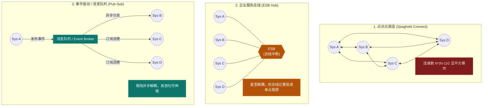
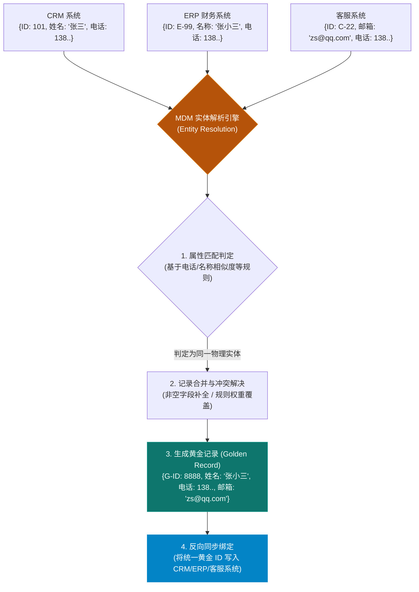
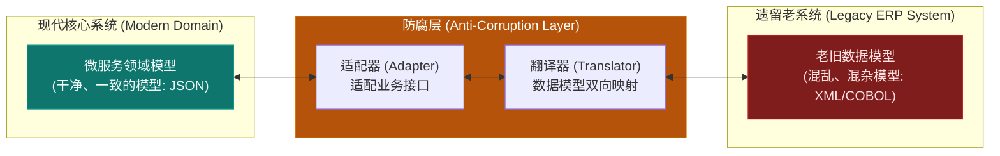

import GlossaryTerm from '@site/src/components/GlossaryTerm';
import GuidedExercise from '@site/src/components/GuidedExercise';
import ResearchNote from '@site/src/components/ResearchNote';
import ChapterMeta from '@site/src/components/ChapterMeta';
import PyRunner from '@site/src/components/PyRunner';
import TradeoffExplorer from '@site/src/components/TradeoffExplorer';
import QuizCard from '@site/src/components/QuizCard';

# M6L10 · 企业应用与 ERP 集成

<ChapterMeta
  time="约 2 小时"
  prereqs={[{label: 'M2L10 通信与解耦', href: '../system-design-bridge/communication-decoupling'}, {label: 'M3L11 数据一致性', href: '../data-cache-queue/consistency-patterns'}, {label: 'L6 幂等', href: '../foundations/idempotency'}]}
  outcome="能说清企业应用复杂在哪（权限/审计/集成/主数据）、几种系统集成模式的取舍，并用幂等 + 主数据去重做可靠的系统对接。"
  howToUse="先看“企业系统为什么又老又复杂”，再理解集成模式和主数据，最后做幂等集成 lab。"
/>

:::tip 企业系统不炫，但 AI 架构师躲不开——AI 最终要嵌进它们
互联网产品光鲜，但全世界大量的关键业务跑在 ERP、CRM、财务、供应链这些“不性感”的企业系统里。它们的复杂不在炫技，而在**权限细、审计严、集成多、数据生命周期长**。企业 AI 系统几乎从不独立存在——它要嵌入这些已有的权限、数据和流程。懂企业架构，是 AI Architect 的必修课。
:::

## 一、企业系统为什么又“老”又复杂

一个典型大企业：核心跑着 SAP 这类 <GlossaryTerm term="ERP" definition="企业资源计划（Enterprise Resource Planning）：整合财务、采购、库存、生产、人力等核心业务流程的企业系统（如 SAP、Oracle）。是大企业的业务中枢，稳定性和数据一致性要求极高。">ERP</GlossaryTerm>，旁边有 CRM、财务、库存、HR、身份系统……几十个系统各管一摊、还要互相对接。复杂度来自：
- **权限极细**：按部门、角色、数据范围、审批链层层控制（不是简单的登录就行）。
- **审计与合规**：每笔操作要留痕、可追溯、满足法规（财务、隐私）。
- **集成多**：几十个系统要交换数据，且很多是十几年的老系统。
- **数据生命周期长**：归档、合规保留、主数据管理。
- **停机代价高**：ERP 停一小时可能全公司业务停摆。

## 二、三个核心概念（分层）

### 基础：系统集成模式

企业的核心难题是“几十个系统怎么可靠地交换数据”。几种模式：
- **点对点**：系统两两直连。少量系统可以，多了变成 <GlossaryTerm term="Integration Spaghetti" definition="集成意大利面：系统两两点对点直连，连接数随系统数平方增长，形成难以维护、改一处牵连一片的混乱网状结构。">集成意大利面</GlossaryTerm>（N² 连接，改一处牵连一片）。
- <GlossaryTerm term="Enterprise Service Bus" definition="企业服务总线（ESB）：传统企业集成的中枢，所有系统接到总线上，由它做路由、协议转换、编排。解决点对点爆炸，但本身可能成为重型瓶颈。">ESB（企业服务总线）</GlossaryTerm>：所有系统接到一条总线，由它路由/转换。解决 N² 问题，但总线本身可能成重型瓶颈。
- **事件驱动 / API + 消息**：现代做法——系统通过 [API 和事件（M2L10）](../system-design-bridge/communication-decoupling) 解耦集成，更轻、更松耦合（[呼应 outbox/CDC M3L11](../data-cache-queue/consistency-patterns)）。

#### 企业系统集成模式拓扑对比



### 进阶：主数据管理与幂等集成

- <GlossaryTerm term="Master Data Management" definition="主数据管理（MDM）：对企业关键实体（客户、产品、供应商、员工）建立单一、权威、一致的数据来源，解决同一实体在多个系统里数据不一致、重复的问题。">主数据管理（MDM）</GlossaryTerm>：同一个“客户”在 CRM、ERP、财务里各有一份，信息还不一致——MDM 建立单一权威来源，解决“谁才是对的”。
- **幂等集成**：系统对接靠消息/批量同步，网络会重发、批量会重跑——所以每条集成消息的处理必须[幂等（L6）](../foundations/idempotency)：同一笔订单同步两次，不能产生两条。靠业务键去重（订单号、外部 ID）。

#### MDM 实体解析与黄金记录流转



### 深入（选学）：企业集成的现实约束

- **数据一致性是最终一致**：跨这么多系统，没有全局事务（[M3L11](../data-cache-queue/consistency-patterns)）——用事件 + 幂等 + 对账（reconciliation）达成<GlossaryTerm term="Eventual Consistency" definition="最终一致性：分布式系统中的一种弱一致性模型。它不保证在任何时刻所有节点的数据都完全相同，但保证在没有新的更新操作前提下，系统数据最终会达到一致状态。在跨系统的企业级集成中，由于缺乏全局事务锁，通常依靠事件异步通知、对账补件等机制达成最终一致。">最终一致性</GlossaryTerm>，并定期跑对账发现并修复漂移。
- **防腐层（ACL）**：对接老旧/外部系统时，用一个<GlossaryTerm term="Anti-Corruption Layer" definition="防腐层（ACL）：在你的系统 and 外部/遗留系统之间加一层翻译，把对方混乱或过时的数据模型隔离在外，保护你的领域模型不被污染。本质是适配器（M4L8）。">防腐层</GlossaryTerm>（本质是[适配器 M4L8](../design-patterns-lld/adapter-decorator)）把对方混乱的数据模型翻译成你干净的模型，别让老系统的烂模型渗进你的核心。

#### 防腐层 (ACL) 屏蔽遗留系统污染架构


- **审计与权限要内建**：企业系统的权限（<GlossaryTerm term="RBAC" definition="基于角色的访问控制 (Role-Based Access Control)：根据用户在组织中所处的角色来分配数据和操作权限。是企业应用中最基础、最普遍采用的安全控制模型。">RBAC</GlossaryTerm>/<GlossaryTerm term="ABAC" definition="基于属性的访问控制 (Attribute-Based Access Control)：一种更高级、细粒度的权限控制模型。根据用户属性、资源属性、环境属性（如IP、时间）等多元条件组合，动态决定是否授予操作权限。">ABAC</GlossaryTerm>）和审计日志不是附加功能，是一等需求——AI 系统接入时必须尊重既有权限边界（不能让 AI 绕过权限读到不该读的数据）和留下审计痕迹。
- **企业 AI 的落点**：AI 通常作为“嵌入既有流程的增强”（如在 ERP 里做智能补货建议、在 CRM 里做客户洞察），而非推倒重来——它要接受人工确认、可审计、可解释，尤其涉及钱和合规时。

<ResearchNote
  title="企业集成：松耦合、幂等、最终一致、防腐"
  source="Hohpe & Woolf, Enterprise Integration Patterns；Eric Evans, DDD（防腐层）；MDM 实践"
  href="https://www.enterpriseintegrationpatterns.com/"
  insight="《企业集成模式》系统化了消息路由、转换、幂等、去重等企业集成手法。现代趋势是从重型 ESB 转向 API + 事件驱动的松耦合集成，配合主数据管理解决一致性、防腐层隔离遗留系统、对账保证最终一致。"
  application="集成多系统时优先 API + 事件而非点对点或重 ESB；每个集成处理点要幂等去重；用 MDM 建权威数据源；用防腐层隔离遗留/外部系统；定期对账。企业 AI 要嵌入既有权限、审计和流程，而非绕过它们。"
/>

## 三、跟我做一遍：幂等的订单集成

<PyRunner
  rows={28}
  expect="重复同步不产生重复"
  code={`# ERP 向下游同步订单：网络会重发、批量会重跑 -> 处理必须幂等（按业务键去重）
class OrderSync:
    def __init__(self):
        self.orders = {}             # 下游系统的订单表
        self.processed_keys = set()  # 已处理的业务键（幂等去重）

    def handle(self, event):
        key = event["order_no"]      # 业务键（不是消息 id）
        if key in self.processed_keys:
            return "DUPLICATE_IGNORED"   # 重复消息：幂等忽略
        self.orders[key] = event["amount"]
        self.processed_keys.add(key)
        return "PROCESSED"

sync = OrderSync()
e = {"order_no": "SO-1001", "amount": 500}
print(sync.handle(e))      # PROCESSED
print(sync.handle(e))      # DUPLICATE_IGNORED（同一订单重发，不重复入账）
print(sync.handle({"order_no": "SO-1002", "amount": 300}))  # PROCESSED
print("下游订单:", sync.orders)
print("重复同步不产生重复")`}
/>

靠业务键（订单号）去重，同一笔订单同步多少次都只入账一次——这是企业集成里最关键的纪律：**集成通道一定会重发，处理必须幂等。试试**：再加一个“金额变更也算新版本”的逻辑（同 order_no 但金额不同时更新而非忽略），体会幂等和“最新值”的区别。

## 四、动手 Lab（必做）

打开 `labs/month06/m6l10_integration/`：

```bash
python labs/month06/m6l10_integration/test_integration.py
```

实现幂等的订单集成 + 主数据去重：按业务键去重、重复消息忽略、同一实体多源合并为单一权威记录。

<GuidedExercise
  title="练习指引：实现幂等集成 + 主数据去重"
  goal="把“按业务键幂等去重 + 主数据合并”做成代码——这是可靠企业集成的核心纪律。"
  hints={[
    'handle：按业务键（order_no）判重，已处理则返回 DUPLICATE_IGNORED。',
    '主数据：同一 customer_id 来自多个源，合并成一条权威记录（如非空字段优先/后到覆盖）。',
    '幂等的关键是用“业务键”而非“消息 id”去重。',
    '想想：重发 vs 真更新怎么区分（内容变了算更新）。'
  ]}
  steps={[
    '实现 OrderSync.handle：业务键去重、重复忽略。',
    '实现 merge_master(records)：把同一实体的多源记录合并成权威记录。',
    '处理“重发”（忽略）和“内容变更”（更新）的区别。',
    '写测试：重复订单只入账一次、不同订单都处理、主数据合并正确。'
  ]}
  checks={[
    '你能说出企业系统复杂在哪（权限/审计/集成/主数据）。',
    '你的集成处理幂等、按业务键去重。',
    '你能解释 MDM 解决什么、防腐层的作用。',
    '你理解企业 AI 要嵌入既有权限/审计/流程。'
  ]}
/>

## 架构师深潜（Staff+ 视角）

### 1. 集成架构怎么选

<TradeoffExplorer
  title="企业系统集成方式"
  dimensions={['松耦合', '可扩展(加系统)', '实现复杂度', '运维瓶颈风险', '现代适用']}
  options={[
    {
      name: '点对点直连',
      scores: [1, 1, 4, 2, 1],
      note: '少量系统简单直接。系统一多变 N² 意大利面，改一处牵连一片。',
      whenToUse: '系统极少（2-3 个）且稳定时。'
    },
    {
      name: '重型 ESB',
      scores: [3, 3, 2, 1, 2],
      note: '总线集中路由/转换，解决 N²。但总线重、易成瓶颈和单点、厂商锁定。',
      whenToUse: '传统大企业既有投资；新建一般不首选。'
    },
    {
      name: 'API + 事件驱动',
      scores: [5, 5, 3, 4, 5],
      note: '松耦合、可独立演进、可扩展。需要幂等/对账保证一致性。',
      whenToUse: '现代企业集成的首选方向。'
    }
  ]}
/>

### 2. 企业架构 = 互联网技术 + 强约束

不要小看企业系统：它把你前几个月学的（[一致性 M3](../data-cache-queue/consistency-patterns)、[解耦 M2L10](../system-design-bridge/communication-decoupling)、[幂等 L6](../foundations/idempotency)）全用上，再叠加互联网产品通常较松的约束——**强权限、强审计、强合规、长数据生命周期、低容错**。架构师在企业环境里，技术功底之外还要懂：权限模型怎么设计、审计怎么不可篡改、主数据谁说了算、和老系统怎么不互相污染。这些"非功能性"约束往往比功能本身更决定成败。

### 3. 真实案例：企业 AI 的真正难点不是模型

很多企业 AI 项目失败，不是模型不够好，而是**集成和约束没解决**：AI 要读 ERP/CRM 的数据但权限对不上、给出的建议无法被审计和追责、和既有审批流程冲突、主数据不一致导致 AI 看到的是脏数据。成功的企业 AI 往往是"小切口嵌入"：在某个既有流程里加一个 AI 增强点（智能补货、合同审查辅助、客服建议），尊重既有权限、保留人工确认、全程可审计。**AI Architect 的价值，恰恰在于让 AI 能干净地嵌进这套复杂的企业肌理里**——这是下一阶段 [Month 7-11 AI 架构](../llm-systems/overview) 落地企业时绕不开的。

### 4. 架构师深问（给自己 30 分钟）

- 你要对接的企业系统，集成是点对点、ESB 还是事件驱动？加一个新系统要改多少处？
- 同一个“客户/产品”在几个系统里一致吗？谁是权威来源（MDM）？不一致时以谁为准？
- 如果让 AI 读写这些企业数据，怎么保证它不越权、留审计、且看到的是干净的主数据？

## 自检清单

- [ ] 我能说出企业系统复杂在哪（权限/审计/集成/主数据）。
- [ ] 我的 lab 集成幂等、按业务键去重、主数据合并正确。
- [ ] 我能区分点对点/ESB/事件驱动集成的取舍。
- [ ] 我理解企业 AI 要嵌入既有权限/审计/流程。

## 常见误解

- **"企业级应用系统（如 ERP、CRM）技术栈老旧落后，相比互联网高并发高容灾架构，这些企业软件没有任何技术含量"**：这是极度浅薄的偏见。互联网架构的核心痛点是“高并发与海量吞吐（Scale-out）”，其业务逻辑通常相对单一；而企业软件的痛点是“极高维度的业务模型复杂度（Domain Complexity）与数据强一致刚性约束”。企业系统处理的是财务账目、库存配额、复杂的跨部门工作流授权，对数据的错误零容忍（不能接受像互联网社交产品那样的局部最终一致性导致短时间错乱）。同时，企业软件在长达数十年的生命周期中，必须承受权限细化到行列级、合规审计追踪（Traceability）、遗留系统兼容集成等极具挑战的“工程脏活与硬核约束”。
- **"当跨系统同步订单数据时，我们只需要让接收端对接收到的消息 ID 进行唯一性去重，就可以完美解决重发导致的重复入账问题"**：这是极易在生产环境造成财务灾难的误区。消息 ID（Message ID）是由消息发送端或消息中间件临时生成的，它只代表“这次传输通道的标识”。如果在网络抖动时，发送端由于未收到确认而执行了“应用层重试（Sender Retry）”，它可能会使用一个全新生成的 Message ID 再次发送同一笔业务订单。如果接收端仅仅依赖 Message ID 去重，就会将该请求视作新请求处理，导致重复入账。正确的**幂等处理必须使用“业务键（Business Key）”**，如订单号（Order No）、外部交易流水号等能唯一标识该业务实体的字段去重。
- **"既然我们公司引进了先进的 AI 智能分析系统，那应该将其部署为一个具有超级管理员权限的独立机器人，这样它就可以无障碍地读取 ERP 和 CRM 的全部数据，给出全局最优方案"**：这是导致企业最高安全级别数据泄漏（如财务内幕、未公开员工薪资、核心客户机密）的灾难性做法。企业应用系统具有极其严密的组织边界和权限（RBAC/ABAC）。AI 大模型本身并不具备权限甄别能力，一旦以“超级管理员”权限运行并提供公共查询接口，低权限员工就可以直接通过提示词工程绕过现有系统的控制，诱导 AI 吐出他不应接触的敏感数据。企业 AI 必须在既有的**用户身份上下文中被调用，严格遵循该用户的既有权限规则，且 AI 做的每一项写入决策都必须记录不可篡改的审计日志**。

## 常见误解自测

<QuizCard
  questions={[
    {
      q: '在领域驱动设计（DDD）中，当我们要将一个新建的现代微服务系统与一个存在了十几年的老旧遗留 ERP 系统进行数据对接时，为什么要设计“防腐层（ACL - Anti-Corruption Layer）”？它的核心职责是什么？',
      options: [
        '防腐层是为了防止遗留 ERP 系统的网络请求中携带恶意软件或木马程序，充当应用防火墙的作用。',
        '老旧系统的业务模型、命名规范及协议（如复杂的 COBOL 字段或庞大的 XML）通常混乱不堪。防腐层在现代系统和老系统之间架起一道双向“翻译器”与“适配器”，将老系统的泥潭模型翻译成现代系统干净的领域模型（JSON/清晰概念），从而保护新系统的核心业务逻辑和代码结构不被老系统的陈旧设计所“污染”。',
        '防腐层是一个定期清理老系统数据库冗余记录的垃圾回收后台程序。'
      ],
      answer: 1,
      explain: '防腐层是 DDD 处理遗留系统集成的核心模式。老系统的糟糕设计就像传染病，直接调用的代码会使新系统也充斥着 legacy 的命名与逻辑。ACL 通过适配器和模型转换器把污染隔绝在外。'
    },
    {
      q: '在可靠的企业级系统集成中，为什么说对“消息传输重发”的去重处理不能仅仅依赖消息 ID（Message ID），而必须依赖业务实体键（Business Key）？',
      options: [
        '因为 Message ID 长度太长，保存在 Redis 中进行布隆过滤器去重会耗费太多内存成本。',
        '因为发送端在遇到网络超时等故障进行重试时，通常会由发送端重构一个包含相同业务内容的请求，并生成一个全新的 Message ID。如果接收端只按 Message ID 去重，就会漏掉这种“同业务订单不同消息 ID”的重试，导致重复入账。因此必须使用订单号（Order No）、支付单号等业务唯一实体键来做全局去重。',
        '因为在不同的云厂商中，Message ID 的格式不统一，无法在多云部署中通用。'
      ],
      answer: 1,
      explain: '这是幂等集成的经典坑。网络层或客户端重试时，Message ID 大多会变化；而订单号、用户ID等 Business Key 代表客观世界的业务实体，无论重试几次都保持不变。使用业务键做幂等键是金融和企业集成的金科玉律。'
    },
    {
      q: '主数据管理（MDM - Master Data Management）的核心任务是为企业关键实体生成“黄金记录（Golden Record）”。在多系统集成的实体解析过程中，当不同系统的数据发生冲突时（例如 ERP 中的地址与 CRM 中的地址不一致），MDM 通常如何处理？',
      options: [
        '由 MDM 引擎随机选择一个地址，并将其他系统的地址自动删除以求一致。',
        '直接报错中断同步，要求企业各部门管理员召开线下联席会议手动修改。',
        'MDM 引擎通过实体解析，利用配置的“数据源可信度权重与规则策略”（例如：合同和法律名称以 ERP 系统为准；联系电话和市场归属以 CRM 系统为准）进行冲突解决与去重合并，融合成一份跨系统权威一致的黄金记录，并反向更新到各源系统中。'
      ],
      answer: 2,
      explain: 'MDM 的实体解析引擎会配置丰富的数据源权威度规则（Survivorship Rules）。不同系统对属性的掌控度不同，MDM 按照“规则优先、非空覆盖、时效优先”等方式自动提取各个源头最正确的字段，形成一份权威记录分发全局。'
    }
  ]}
/>

## 延伸阅读

- [Enterprise Integration Patterns (Hohpe & Woolf)](https://www.enterpriseintegrationpatterns.com/)
- [Anti-Corruption Layer (Microsoft)](https://learn.microsoft.com/en-us/azure/architecture/patterns/anti-corruption-layer)
- [下一课：工业软件与边缘实时](./industrial-edge-realtime)
