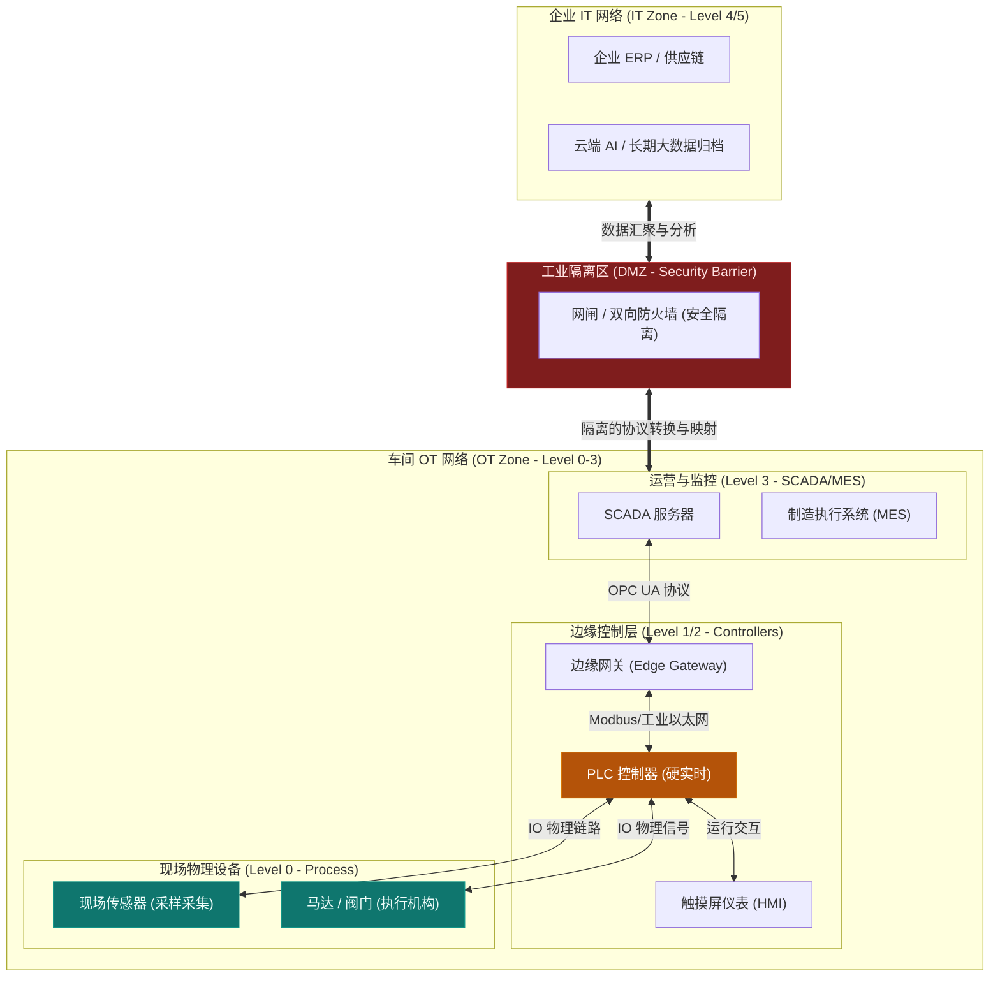
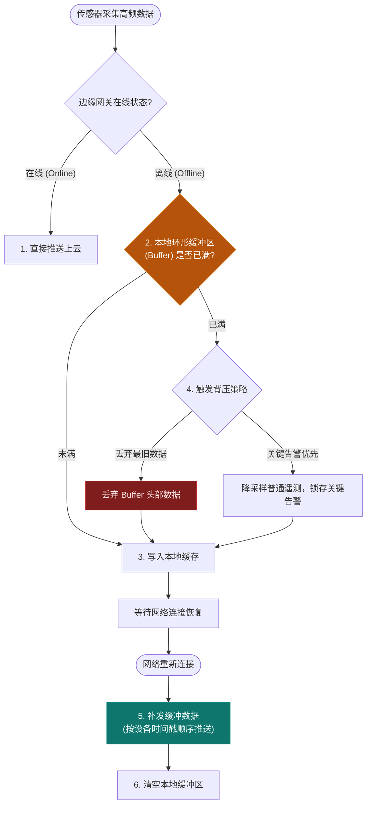
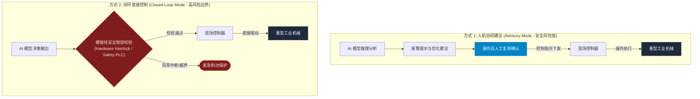

import GlossaryTerm from '@site/src/components/GlossaryTerm';
import GuidedExercise from '@site/src/components/GuidedExercise';
import ResearchNote from '@site/src/components/ResearchNote';
import ChapterMeta from '@site/src/components/ChapterMeta';
import PyRunner from '@site/src/components/PyRunner';
import TradeoffExplorer from '@site/src/components/TradeoffExplorer';
import QuizCard from '@site/src/components/QuizCard';

# M6L11 · 工业软件与边缘实时

<ChapterMeta
  time="约 2 小时"
  prereqs={[{label: 'M3L9 消息队列', href: '../data-cache-queue/message-queues'}, {label: 'M5L4 边缘缓存', href: '../core-components/reverse-proxy-cdn'}, {label: 'L11 异步与超时', href: '../foundations/sync-async-timeout'}]}
  outcome="能说清工业/IoT 系统的特殊约束（离线/抖动/乱序/实时/安全），区分 OT/IT，并用边缘缓冲 + store-and-forward 处理不可靠网络。"
  howToUse="先看“云端那套假设在工厂里全失效”，再理解边缘计算和缓冲，最后做 store-and-forward lab。"
/>

:::tip 工厂车间不是数据中心：网络会断、要实时、出错伤的是物理世界
互联网系统默认网络基本可靠、延迟几十毫秒、出错重试就行。但在工厂、电网、车间，设备会**离线**、网络会**抖动**、数据会**乱序**、控制要**硬实时**、而且出错可能造成**物理后果**（设备损坏、安全事故）。工业软件是<GlossaryTerm term="Cyber-Physical System" definition="信息物理系统：把计算、网络与物理过程深度耦合的系统（如工业控制、自动驾驶、电网）。设计时必须同时考虑实时性、安全性、可靠性和物理后果。">信息物理系统</GlossaryTerm>，云端那套假设在这里很多都要重写。
:::

## 一、云端的假设，在工厂里全失效

把互联网架构直接搬到工业现场会处处碰壁：
- **网络不可靠**：车间网络、偏远设备、移动设备会频繁断连——"假设能连上云"不成立。
- **数据乱序/延迟**：多设备高频采样，数据到达乱序、迟到——"按到达顺序处理"会错。
- **要实时**：控制回路（如急停、调速）要在毫秒级响应——"往返云端再决策"太慢、太危险。
- **安全边界硬**：工业控制网络（OT）和办公/互联网（IT）必须严格隔离——一次入侵可能停产甚至危及人身。

## 二、三个核心概念（分层）

### 基础：OT/IT 融合与工业协议

- <GlossaryTerm term="OT/IT" definition="OT（运营技术）指控制物理设备的系统（PLC、SCADA、传感器）；IT 指传统信息系统（服务器、数据库、云）。工业数字化的核心挑战之一是让两者安全融合而不互相危害。">OT vs IT</GlossaryTerm>：OT（运营技术）是控制物理设备的系统（<GlossaryTerm term="PLC" definition="可编程逻辑控制器（Programmable Logic Controller）：工业现场控制机器和生产线的专用计算机，强实时、高可靠，是 OT 的核心执行单元。">PLC</GlossaryTerm>、<GlossaryTerm term="SCADA" definition="数据采集与监控系统（Supervisory Control and Data Acquisition）：监控和控制工业过程的系统，汇集现场 PLC/传感器数据、供操作员监视和下发控制。">SCADA</GlossaryTerm>、传感器），IT 是传统信息系统。工业数字化的核心就是让两者**安全融合**——让 IT/云能拿到 OT 数据做分析，又绝不让 IT 侧的问题危及 OT 控制。
- 工业系统有自己的协议栈（如 <GlossaryTerm term="OPC UA" definition="OPC 统一架构 (OPC Unified Architecture)：一种面向跨平台、服务导向（SOA）的工业通信标准协议。它提供了信息模型和机器对机器（M2M）通信规范，使得从现场 PLC/传感器直至云端系统的异构设备之间能够进行安全、语义一致的数据交互。">OPC UA</GlossaryTerm>、MQTT、Modbus），为可靠遥测和设备互操作设计。
为了在网络融合时保护物理设备的安全，工业架构设计通常遵循著名的 <GlossaryTerm term="Purdue Model" definition="普渡模型 (Purdue Model)：由普渡大学学者提出、已被采纳为 ISA-95 标准的企业系统分层参考模型。它将工业企业网络结构从下到上划分为 Level 0（物理过程）至 Level 5（企业网络）共 6 层，各层网络通过严密的防火墙及隔离区进行安全边界划分，严防外网安全风险渗透到现场控制设备。">Purdue 模型</GlossaryTerm> 来划分网络分层和安全隔离。

#### 普渡模型下 OT/IT 安全隔离网络分层架构



### 进阶：边缘计算与缓冲

- <GlossaryTerm term="Edge Computing" definition="边缘计算：在靠近设备的本地节点（边缘网关）就近处理数据，而不是全送到云。降低延迟、减少带宽、在断网时仍能本地决策。">边缘计算</GlossaryTerm>：在靠近设备的**边缘网关**就地处理——实时控制、过滤聚合数据、断网时本地决策，只把必要数据上云。解决"实时"和"带宽"。
- <GlossaryTerm term="Store-and-Forward" definition="存储转发：设备/边缘在网络中断时把数据先存在本地缓冲，待网络恢复后再按序补发，保证断网期间的数据不丢失。">存储转发（store-and-forward）</GlossaryTerm>：网络断了，边缘**先把数据缓存在本地**，等恢复了再补发——保证断网期间数据不丢。这正是 [M5L4 边缘](../core-components/reverse-proxy-cdn) 和 [M3L9 队列](../data-cache-queue/message-queues) 思想在工业场景的应用（WhatsApp 的 store-and-forward 也是同一招）。

#### 存储转发与背压缓冲控制流转



### 深入（选学）：实时、乱序与安全的硬约束

- **实时性分级**：硬实时（错过 deadline = 失败/危险，如急停）必须在边缘/PLC 本地保证，绝不依赖云往返；软实时（仪表盘、分析）可以容忍延迟、上云处理。架构师要分清哪些回路是硬实时的。
- **乱序与时间戳**：高频多设备数据会乱序到达——要按**设备侧时间戳**而非到达顺序处理，用窗口聚合容忍迟到数据（[呼应流处理思想](../data-cache-queue/feed-fanout)）。
- **安全是物理安全**：OT 入侵的后果是物理的（停产、设备损毁、人身危险）。所以 OT 网络严格隔离（网闸/单向网关）、最小权限、且任何"AI 自动控制物理设备"都必须有**人工确认 + 安全联锁 + 可审计**——AI 给建议可以，直接控制重型设备要极其谨慎。
- **缓冲要有界**：本地缓冲不能无限（设备存储有限），满了要有策略（丢最旧、降采样、优先级保留关键数据）——[呼应 L11 背压](../foundations/sync-async-timeout) 与有界<GlossaryTerm term="Backpressure" definition="背压 (Backpressure)：在流处理或消息传输中，当消费端处理速度慢于生产端发送速度时，接收端反向向发送端施加压力以减缓其生产速率的机制。在边缘计算中，当网络离线且本地环形缓冲区写满时，背压策略决定了是直接丢弃最旧数据，还是锁定关键告警以防系统崩溃。">背压</GlossaryTerm>。

<ResearchNote
  title="工业系统按信息物理系统设计：实时、可靠、安全、人机协作"
  source="NIST Cyber-Physical Systems Framework；OPC UA 规范；ISA-95 / Purdue 模型（OT/IT 分层）"
  href="https://www.nist.gov/publications/framework-cyber-physical-systems-volume-1-overview"
  insight="信息物理系统把计算、网络与物理过程耦合，设计必须同时满足实时性、可靠性、安全性和人机协作。Purdue/ISA-95 模型把 OT/IT 分层隔离；边缘计算 + store-and-forward 应对不可靠网络；硬实时控制下沉到现场，云端只做分析和监督。"
  application="工业系统：硬实时控制放边缘/PLC、不依赖云往返；用 store-and-forward 缓冲扛断网；按设备时间戳处理乱序；严格隔离 OT/IT 网络；AI 控制物理设备必须人工确认 + 安全联锁 + 审计。把它当信息物理系统而非普通 Web 后端设计。"
/>

## 三、跟我做一遍：边缘 store-and-forward

<PyRunner
  rows={32}
  expect="断网缓冲、恢复补发、不丢数据"
  code={`class EdgeGateway:
    def __init__(self, capacity=5):
        self.buffer = []          # 本地缓冲（有界）
        self.capacity = capacity
        self.cloud = []           # 已上云的数据
        self.online = True

    def emit(self, reading):
        if self.online:
            self.cloud.append(reading)         # 在线：直接上云
        else:
            if len(self.buffer) >= self.capacity:
                self.buffer.pop(0)             # 缓冲满：丢最旧（有界背压）
            self.buffer.append(reading)        # 离线：先缓存本地

    def reconnect(self):
        self.online = True
        # 网络恢复：按序补发缓冲的数据，再清空
        self.cloud.extend(self.buffer)
        self.buffer.clear()

g = EdgeGateway(capacity=5)
g.emit("t=1,temp=20")            # 在线 -> 上云
g.online = False                # 断网！
for i in range(2, 5):
    g.emit("t=%d,temp=%d" % (i, 20 + i))   # 离线 -> 缓冲
print("断网期间已上云:", g.cloud)            # 只有断网前的
print("本地缓冲:", g.buffer)                 # 断网期间的存这里
g.reconnect()                                # 网络恢复
print("恢复后已上云:", g.cloud)              # 补发了缓冲的数据
print("断网缓冲、恢复补发、不丢数据")`}
/>

断网时数据进本地缓冲（满了按策略丢最旧——有界背压），网络恢复后按序补发——断网期间的数据不丢。**试试**：让断网期间产生超过 capacity 条数据，观察最旧的被丢弃（本地存储有限，必须有界）；想想关键告警数据该不该用"优先级保留"而非丢最旧。

## 四、动手 Lab（必做）

打开 `labs/month06/m6l11_edge_buffer/`：

```bash
python labs/month06/m6l11_edge_buffer/test_edge_buffer.py
```

实现边缘 store-and-forward：在线直发、离线有界缓冲、恢复后按序补发、缓冲满按策略丢弃。

<GuidedExercise
  title="练习指引：实现边缘缓冲"
  goal="把“在线直发 / 离线缓冲 / 恢复补发 / 有界丢弃”做成代码——这是工业断网容错的核心。"
  hints={[
    'online 时直接上云；offline 时进有界 buffer。',
    'buffer 满（达 capacity）时丢最旧（pop(0)），保证有界。',
    'reconnect：把 buffer 按序追加到云端，再清空。',
    '想想：关键告警 vs 普通遥测，丢弃策略该一样吗？'
  ]}
  steps={[
    '实现 EdgeGateway(capacity)：emit / reconnect。',
    '在线直发、离线缓冲、缓冲满丢最旧。',
    'reconnect 按序补发并清空缓冲。',
    '写测试：在线直发、离线缓冲、恢复补发顺序正确、缓冲满丢最旧、断网不丢（容量内）。'
  ]}
  checks={[
    '你能说出工业系统的特殊约束（离线/乱序/实时/安全）。',
    '你的 lab 断网缓冲、恢复补发、有界丢弃。',
    '你能区分 OT/IT 及为什么要隔离。',
    '你理解硬实时控制为什么要放边缘而非云。'
  ]}
/>

## 架构师深潜（Staff+ 视角）

### 1. 计算放在哪一层

<TradeoffExplorer
  title="工业数据处理的落点"
  dimensions={['实时性', '断网可用', '算力/复杂分析', '带宽成本', '全局视图']}
  options={[
    {
      name: '现场/PLC（最边缘）',
      scores: [5, 5, 1, 5, 1],
      note: '毫秒级硬实时控制、断网照常。但算力极有限、只见局部。',
      whenToUse: '硬实时控制回路（急停、调速、安全联锁）。'
    },
    {
      name: '边缘网关',
      scores: [4, 4, 3, 4, 2],
      note: '就近过滤/聚合/软实时分析、断网缓冲。算力中等、见单站。',
      whenToUse: '本地预处理、降带宽、断网容错、软实时。'
    },
    {
      name: '云端',
      scores: [1, 1, 5, 1, 5],
      note: '强算力、跨站全局分析、长期存储/AI。但依赖网络、不实时。',
      whenToUse: '大数据分析、跨厂对比、模型训练、长期归档。'
    }
  ]}
/>

### 2. "云-边-端"分层是工业架构的骨架

工业系统几乎都是三层协同：**端**（设备/PLC，硬实时控制）→ **边**（边缘网关，本地处理 + 缓冲 + 软实时）→ **云**（全局分析 + AI + 长期存储）。这和你学过的 [多级缓存（M5L4）](../core-components/reverse-proxy-cdn)、[就近处理] 是同一思想：**把对延迟/可靠性最敏感的处理放在离物理世界最近的地方，把需要算力/全局视图的放云端。** 架构师设计工业 AI 时，要想清楚"模型推理放边缘还是云"——质检视觉模型可能要在边缘实时跑（产线不能等云），而设备故障预测可以云端批量算。

### 3. 真实案例：工业 AI 的边界——建议 vs 控制

工业 AI 落地的铁律：**AI 做"建议/预测/监督"相对安全，AI 直接"控制物理设备"必须极其谨慎。** 预测性维护（提前预警设备故障）、质量检测（视觉识别缺陷）、能耗优化建议——这些 AI 给出结果、人或既有安全系统把关，风险可控。但让 AI 直接调节重型机械、电网、化工流程，一旦出错后果是物理的、不可逆的——必须有[人工确认 + 安全联锁 + 完整审计 + 可回退]。这呼应 [M6L10 企业 AI](./enterprise-erp-integration) 和后续 [AI 平台治理（Month 11）](../production-ai-platform/overview)：**越接近物理世界和金钱，AI 的自主权就要越受约束。**

#### 工业 AI 闭环直接控制 vs 人机协同监督



### 4. 架构师深问（给自己 30 分钟）

- 你的工业场景里，哪些是硬实时回路（必须边缘/本地）、哪些可以上云？分界线在哪？
- 网络断 1 小时，你的边缘要缓冲多少数据？本地存储够吗？满了丢什么、保什么（关键告警 vs 普通遥测）？
- 如果要上工业 AI，它是给建议还是直接控制设备？后者你会加哪些安全约束（人工确认/联锁/审计/回退）？

## 自检清单

- [ ] 我能说出工业系统的特殊约束（离线/乱序/实时/安全/物理后果）。
- [ ] 我的 lab 实现了 store-and-forward（缓冲、补发、有界丢弃）。
- [ ] 我能区分 OT/IT 并理解为什么要隔离。
- [ ] 我理解云-边-端分层和 AI 在工业里"建议 vs 控制"的边界。

## 常见误解

- **"工业互联网项目只要通过部署传感器代理，利用高性能的 WebSockets 保持与公有云的长连接，把数据源源不断地发上云进行实时分析即可完成"**：这是忽略工厂恶劣网络和本地自治需求的典型互联网思维。工业现场的网络断连、抖动、高频磁场干扰、网线断开是家常便饭，绝不可能依赖“随时在线的长连接”。在网络断开的一瞬间，系统如果没有**边缘侧 Store-and-Forward 本地独立存储缓冲**，数据就会瞬间丢失；同时，如果将几万台设备每秒几百次的高频采样直接无脑推向公有云，会带来极其庞大的广域网带宽账单。正确的做法是边缘过滤合并，本地闭环决策，按需上云。
- **"既然强化学习和深度学习模型能比经验丰富的工程师更好地优化机械臂路径和锅炉温度，我们就应当直接让 AI 闭环控制核心执行阀门，实现全自动化车间"**：这是极度危险的冒险行为。软件层面的 AI 推理存在固有的不确定性，且在大模型时代容易发生“幻觉”；即使是小型的强化学习控制，在边缘遇到传感器损坏、网络抖动等输入脏数据时，也可能输出导致物理设备损毁甚至人身伤亡的极端异常指令。**AI 在涉及物理安全的场景中绝不能拥有完全独立的无监督终极控制权**，必须在其下层通过独立的“安全仪表系统（SIS）”或由硬接线继电器组成的“安全联锁（Interlock）”来进行强制数据限幅和紧急制动阻断。
- **"硬实时（Hard Real-time）控制问题只要升级到 5G 工业专网，或者采用 10Gbps 的高带宽光纤网络，就可以把 PLC 控制回路搬到私有云或边缘服务器中运行"**：彻底混淆了“网络高吞吐量/无线低延迟”与“操作系统确定性调度延迟（Determinism）”。高吞吐量网络能够支持大数据传输，但无法保证网卡串行化、广域网多跳路由排队等带来的**延迟上限确定性保证（Deterministic Deadline）**。此外，网络物理性中断的风险永远无法降到 0。硬实时控制回路（如电机伺服闭环、安全阀门急停）的 Deadline 往往在毫秒甚至微秒级，必须在最现场的硬实时控制器（PLC/微控制器）中直接闭环，不能涉及任何广域网网路栈。

## 常见误解自测

<QuizCard
  questions={[
    {
      q: '在工业信息化与 OT/IT 安全隔离的业界规范中，著名的普渡模型（Purdue Model / ISA-95）对网络拓扑是如何规定的？为什么 Level 0-2 的 PLC 与传感器绝对不能直接与 Level 4/5 的企业云相连？',
      options: [
        '因为 PLC 的计算能力太弱，不支持运行 HTTP/HTTPS 协议，所以在网络物理层面上无法与云服务器直接握手。',
        '普渡模型将工业系统划分为严格的层级，并在 IT 网络（ERP/云分析，Level 4/5）与 OT 控制网络（Level 0-3）之间设置工业 DMZ 隔离防火墙和网闸。这是因为一旦允许云端网络直接穿透访问 Level 1/2 的 PLC 控制器，来自外网的网络攻击、木马或云端软件漏洞，就可以直接物理操纵车间设备（如电机过载、阀门过压），造成停产、设备损毁甚至人身伤亡等不可挽回的物理后果。',
        '这是为了节省广域网 IP 地址，通过局域网进行网络转换（NAT）的省钱设计。'
      ],
      answer: 1,
      explain: 'IT 与 OT 隔离是信息物理系统（CPS）的最硬安全边界。IT 入侵只丢数据，OT 被攻破会导致设备物理损坏甚至生命危险。普渡模型通过 DMZ 网闸将 IT 和 OT 严密隔开，数据只能单向异步同步或在 DMZ 中转，禁止任何云端外网流量直接控制底层 PLC。'
    },
    {
      q: '在不可靠的边缘网络现场，存储转发（Store-and-Forward）机制能够防止数据断网丢失。但如果现场发生长达数十天的持续断网，导致边缘网关的本地“有界环形缓冲区（Bounded Buffer）”写满时，架构师应该设计怎样的背压（Backpressure）溢出策略以保证系统安全？',
      options: [
        '本地缓冲写满时，直接阻塞物理传感器的 IO 采集线程，直至网络恢复再继续采样。',
        '一旦写满，立即清空整个缓冲区并触发设备重启，防止内存溢出。',
        '本地存储不可能无限。写满时应触发有界背压机制：最基础的做法是“丢弃最旧数据，存入最新数据”；在关键工业生产中，应采取“按优先级锁存”策略，停止缓存非核心的普通温度/压力遥测数据，甚至在边缘进行降采样（如 100Hz 降到 1Hz），但 100% 优先保留和锁存设备异常警报、故障停机事件等关键告警数据。'
      ],
      answer: 2,
      explain: '本地存储不是无限的，必须保证缓冲区有界以防 OOM。在写满时不能阻塞采集（这会导致设备彻底失控），也不能随便丢光。应当分级处理，降采样或优先保留告警/事件等高优先级数据，丢弃低价值的普通遥测。'
    },
    {
      q: '工业实时控制中，硬实时（Hard Real-time）与软实时（Soft Real-time）的本质区别是什么？对我们设计“云-边-端”三层协同的架构有何指导意义？',
      options: [
        '硬实时是指控制指令必须由金属网线（硬线）传输，软实时是指可以通过无线 Wi-Fi 传输。',
        '硬实时的 Deadline 是绝对刚性的，错过一次 deadline 就会导致灾难性后果（如汽车气囊没弹出、急停失效导致机件相撞），因此这类控制逻辑必须下沉在 Level 1/2 的本地 PLC/端侧硬实时系统，绝对不能依赖云端；软实时（如分析大屏更新、长期维护预测）错过 deadline 只会影响用户体验，不会造成危险，因此可以部署在边缘服务器或云端，以获取更强的算力。',
        '硬实时计算使用的计算公式更复杂，需要使用浮点数；软实时计算只计算简单的整数加减法。'
      ],
      answer: 1,
      explain: '硬实时与软实时的分水岭在于“错过截止时间的物理后果”。凡是涉及安全、物理碰撞等硬实时决策，绝对不能过网（过 WAN 上云），必须在最现场就地闭环（几毫秒内执行完毕）；而无害的报表统计、故障分析和建议，则可以上云慢处理。'
    }
  ]}
/>

## 延伸阅读

- [NIST Cyber-Physical Systems Framework](https://www.nist.gov/publications/framework-cyber-physical-systems-volume-1-overview)
- [OPC Foundation: OPC UA](https://opcfoundation.org/about/opc-technologies/opc-ua/)
- [下一课：Capstone 云原生交付一个服务](./capstone-cloud-native)
