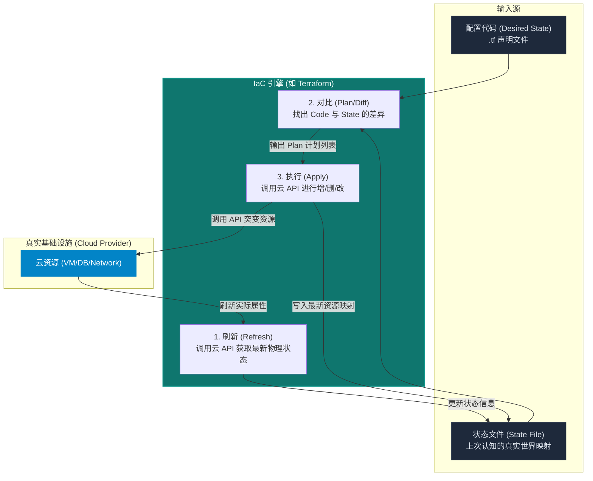
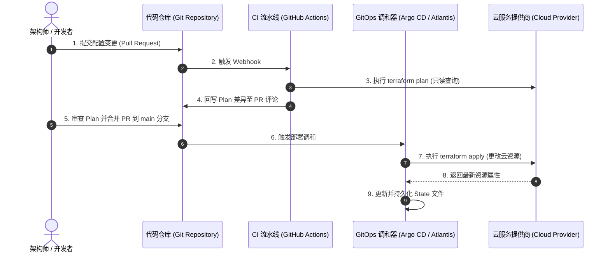

import GlossaryTerm from '@site/src/components/GlossaryTerm';
import GuidedExercise from '@site/src/components/GuidedExercise';
import ResearchNote from '@site/src/components/ResearchNote';
import ChapterMeta from '@site/src/components/ChapterMeta';
import PyRunner from '@site/src/components/PyRunner';
import TradeoffExplorer from '@site/src/components/TradeoffExplorer';
import QuizCard from '@site/src/components/QuizCard';

# M6L5 · 基础设施即代码

<ChapterMeta
  time="约 2.5 小时"
  prereqs={[{label: 'M6L2 声明式调和', href: './kubernetes-basics'}, {label: 'L14 配置与部署', href: '../foundations/config-and-deploy'}, {label: 'L6 幂等', href: '../foundations/idempotency'}]}
  outcome="能解释 IaC 的声明式 + 幂等 + plan/apply 模型、为什么它能根治“环境漂移”和“雪花服务器”，并理解状态文件的作用。"
  howToUse="先看“手点控制台建环境”的痛，再理解 IaC 的 plan/apply 模型，最后做幂等 apply lab。"
/>

:::tip 同样是“声明期望 + 调和”，K8s 管容器，IaC 管云资源
[K8s（M6L2）](./kubernetes-basics) 让你声明"要 3 个副本"，它维持。IaC 把同样的思想用到**基础设施本身**：你声明"要 2 台服务器、1 个数据库、1 个网络"，工具算出差异、自动建出来。手点控制台建环境就像手动启停容器——不可复制、不可审计、迟早出错。
:::

## 一、手点控制台：不可复制的"雪花服务器"

传统建环境：登录云控制台，手动点出服务器、配网络、建数据库、设安全组。问题：
- **复制不出来**：要再建一个一模一样的 staging？凭记忆重点一遍，总有遗漏。
- **没人知道改了啥**：谁什么时候改了哪个安全组规则？没有记录、无法审计、无法回滚。
- <GlossaryTerm term="Snowflake Server" definition="雪花服务器：经过大量手动调整、配置独一无二且无人能完整复现的服务器。一旦损坏就难以重建，是运维脆弱性的根源。" >雪花服务器</GlossaryTerm>：每台机器都被手动改成独一无二、没人能复现的状态，坏了就抓瞎。

IaC 把基础设施变成**代码**：版本化、可评审、可复制、可审计、可回滚。

## 二、三个核心概念（分层）

### 基础：基础设施即代码与声明式

<GlossaryTerm term="Infrastructure as Code" definition="基础设施即代码（IaC）：用代码/配置文件来定义和管理服务器、网络、数据库等基础设施，而不是手动操作控制台。可版本化、评审、复制、审计、回滚。" >IaC</GlossaryTerm>用代码描述基础设施。主流工具（Terraform 等）是<GlossaryTerm term="Declarative IaC" definition="声明式 IaC：你描述“期望的最终状态”（要哪些资源、什么配置），工具负责算出从当前到期望需要创建/修改/删除什么并执行——而不是你写一步步的操作命令。" >声明式</GlossaryTerm>的：你写"我要这些资源长这样"，而不是"先建这个再改那个"的步骤。工具负责对比期望和现状、算出该做什么——和 [K8s 调和（M6L2）](./kubernetes-basics) 同一个模型。

#### IaC 状态调和生命周期



### 进阶：plan / apply 与幂等

IaC 的安全来自两步走：
- <GlossaryTerm term="Plan/Diff" definition="plan（计划/diff）：在真正改动前，先对比“期望状态”和“当前状态”，列出将要创建/修改/删除的资源清单，供人审查确认，避免意外破坏。" >plan（预演 diff）</GlossaryTerm>：**先看**会改什么——"将创建 1 台服务器、修改 1 个安全组、删除 0 个"。审查无误再执行。
- <GlossaryTerm term="Idempotent Apply" definition="幂等 apply：反复执行同一份声明，结果一致——已符合期望的资源不动，只对有差异的执行变更。重复 apply 是安全的。" >幂等 apply</GlossaryTerm>：执行后，**反复 apply 同一份代码结果一致**（[L6 幂等](../foundations/idempotency)）——已经对的不动，只改有差异的。这让"应用配置"变成安全、可重复的操作。

### 深入（选学）：状态文件、漂移与 GitOps

- <GlossaryTerm term="State File" definition="状态文件：IaC 工具记录“它所管理的资源当前是什么样”的映射（资源 -> 真实云资源 ID/属性）。plan 时用它对比期望与现状。状态文件是关键资产，需安全存储和加锁。" >状态文件（state）</GlossaryTerm>：工具靠它记住"我管了哪些资源、它们现在什么样"，才能算 diff。状态是关键资产——要远程存储、加锁（防并发 apply 冲突）、保护（含敏感信息）。
- <GlossaryTerm term="Configuration Drift" definition="配置漂移：实际基础设施被手动改动后，偏离了 IaC 代码声明的状态。下次 plan 会检测到差异；好的实践是禁止手动改、一切通过代码。" >漂移（drift）</GlossaryTerm>：有人手动改了线上资源，实际就偏离了代码。IaC 的 plan 能**检测漂移**（diff 出意外的差异）。纪律：禁止手动改、一切走代码。
- **<GlossaryTerm term="GitOps" definition="GitOps：一种声明式基础设施的管理方法。它将 Git 仓库作为基础设施期望状态的唯一事实来源，通过自动化流水线或调和控制器，使实际运行环境的状态持续收敛到 Git 仓库中所声明的状态。">GitOps</GlossaryTerm>**：把"Git 仓库里的声明"作为唯一事实来源，自动 apply 到环境——基础设施的状态完全由 Git 决定、每次变更都是一个可评审、可回滚的提交。这是"声明式 + 调和 + 版本控制"的集大成。

#### GitOps 持续部署与收敛时序



- **<GlossaryTerm term="Immutable Infrastructure" definition="不可变基础设施 (Immutable Infrastructure)：一种基础设施部署范式。一旦部署了服务器等资源，就绝不对其进行在线修改或打补丁。当需要更新配置或代码时，直接通过 IaC 构建全新的实例进行替换，并销毁旧实例。这能彻底杜绝配置漂移和雪花服务器的产生。">不可变基础设施</GlossaryTerm>**：要改服务器配置？不去改现有的，而是**用新镜像/新配置建新的、替换旧的**（呼应 [M6L1 不可变镜像](./containers)）——避免雪花化。

#### 雪花服务器 vs 不可变基础设施部署对比


<ResearchNote
  title="IaC：把基础设施纳入软件工程的纪律"
  source="Kief Morris, Infrastructure as Code；HashiCorp Terraform 文档；Weaveworks — GitOps"
  href="https://www.terraform.io/intro"
  insight="IaC 把基础设施变成可版本化、可评审、可测试、可复现的代码。声明式工具用“期望状态 + 状态文件 + plan/apply”实现幂等的变更：plan 预演差异、apply 收敛到期望。GitOps 进一步以 Git 为唯一事实来源、自动调和环境。"
  application="一切环境用 IaC 定义，禁止手点控制台（防漂移和雪花化）。变更先 plan 审查再 apply。状态文件远程加锁存储。配合不可变基础设施和 GitOps，让环境可复制、可审计、可回滚。"
/>

## 三、跟我做一遍：plan/apply 幂等收敛

<PyRunner
  rows={34}
  expect="apply 幂等收敛"
  code={`# 简化的 IaC 引擎：对比 desired 和 current（状态），算出 plan，再 apply
def plan(desired, current):
    actions = []
    for name, cfg in desired.items():
        if name not in current:
            actions.append(("CREATE", name, cfg))
        elif current[name] != cfg:
            actions.append(("UPDATE", name, cfg))
    for name in current:
        if name not in desired:
            actions.append(("DELETE", name, None))
    return actions

def apply(actions, current):
    for op, name, cfg in actions:
        if op in ("CREATE", "UPDATE"):
            current[name] = cfg
        elif op == "DELETE":
            current.pop(name, None)
    return current

state = {}   # 状态文件：当前真实资源
desired = {"web": {"size": "small"}, "db": {"engine": "pg"}}

p1 = plan(desired, state)
print("首次 plan:", p1)             # 全部 CREATE
apply(p1, state)

p2 = plan(desired, state)           # 再 plan：已收敛
print("再次 plan:", p2)             # [] —— 无变更（幂等）

# 改个配置 + 加个资源
desired["web"]["size"] = "large"
desired["cache"] = {"type": "redis"}
p3 = plan(desired, state)
print("改动后 plan:", p3)           # UPDATE web, CREATE cache
apply(p3, state)
print("最终状态:", state)
print("apply 幂等收敛")`}
/>

plan 先把"将要发生什么"摆出来给你看，apply 后再 plan 是空的（已收敛、幂等）——这就是 IaC 安全可重复的关键。**试试**：从 desired 删掉 `db`，看 plan 出 `DELETE db`（IaC 也会清理不再声明的资源——这正是它危险又强大的地方，所以要先 plan 审查）。

## 四、动手 Lab（必做）

打开 `labs/month06/m6l5_iac/`：

```bash
python labs/month06/m6l5_iac/test_iac.py
```

实现 IaC 引擎：plan 算出 create/update/delete 差异、apply 收敛、重复 apply 幂等、检测漂移。

<GuidedExercise
  title="练习指引：实现 plan/apply 引擎"
  goal="把“期望 vs 状态 → diff → 幂等 apply”做成代码——这是所有 IaC 工具的核心。"
  hints={[
    'plan：desired 有而 current 无 -> CREATE；都有但配置不同 -> UPDATE；current 有而 desired 无 -> DELETE。',
    'apply：按 plan 修改 current 状态。',
    '幂等：apply 后再 plan 应为空。',
    '漂移：手动改 current 后 plan 应检测到差异。'
  ]}
  steps={[
    '实现 plan(desired, current) 返回 (op, name, cfg) 列表。',
    '实现 apply(actions, current) 更新状态。',
    '验证重复 apply 幂等（第二次 plan 为空）。',
    '写测试：首次全 CREATE、改配置 UPDATE、删声明 DELETE、幂等、漂移检测。'
  ]}
  checks={[
    '你能解释 IaC 怎么根治雪花服务器和环境漂移。',
    '你的 plan/apply 幂等收敛。',
    '你能说出状态文件的作用和风险。',
    '你理解为什么要先 plan 审查再 apply。'
  ]}
/>

## 架构师深潜（Staff+ 视角）

### 1. 基础设施管理方式

<TradeoffExplorer
  title="基础设施管理方式"
  dimensions={['可复制', '可审计/回滚', '防漂移', '上手速度', '协作安全']}
  options={[
    {
      name: '手点控制台',
      scores: [1, 1, 1, 5, 1],
      note: '快速试验方便，但不可复制、无审计、易漂移、易冲突。',
      whenToUse: '一次性试验/学习；生产绝不。'
    },
    {
      name: '脚本（命令式）',
      scores: [3, 2, 2, 3, 2],
      note: '可复制，但命令式脚本重复执行不一定幂等、难表达期望状态。',
      whenToUse: '简单自动化、过渡阶段。'
    },
    {
      name: '声明式 IaC + GitOps',
      scores: [5, 5, 5, 2, 5],
      note: '声明期望、plan/apply 幂等、Git 审计回滚、防漂移。学习曲线和状态管理是成本。',
      whenToUse: '生产环境的标准做法。'
    }
  ]}
/>

### 2. "声明式 + 调和"再次出现——这是云原生的统一心智模型

数一数它出现了几次：[K8s 副本](./kubernetes-basics)、[HPA 伸缩](./autoscaling-rollout)、IaC 资源、GitOps 环境。**全是"声明期望状态 → 工具持续/幂等地调和到它"**。一旦你用这个模型思考所有运维（"我要的最终状态是什么"而非"我要执行哪些步骤"），从容器到云资源到发布全都统一了。这是云原生区别于传统运维最深刻的思维转变，也呼应 [M4L1 封装变化](../design-patterns-lld/change-driven-design)（声明意图、隐藏实现步骤）。

### 3. 真实案例：从"建环境要两周"到"一条命令起一套"

传统企业开一个新环境要提工单、等运维手动配，动辄两周还经常和生产不一致。IaC 化后，`terraform apply` 几分钟起一套和生产完全一致的环境（dev/staging/prod 共用同一份代码、不同变量）。出了问题，`git revert` + apply 就回滚。这种"环境随手可得、完全一致、可审计回滚"的能力，是高效能交付（[DORA](../foundations/testing-and-tdd)）和灾难恢复的基础——重建整个环境只是重新 apply 一次代码。

### 4. 架构师深问（给自己 30 分钟）

- 你的环境现在是手点的还是 IaC 的？能在 10 分钟内复制出一套一模一样的吗？坏了能多快重建？
- 状态文件放在哪？有没有加锁（防两人同时 apply 冲突）？里面有敏感信息吗、怎么保护？
- 有人手动改了线上资源（漂移），你怎么发现和纠正？怎么从制度上禁止手动改（只走 Git/CI）？

## 自检清单

- [ ] 我能解释 IaC 的声明式 + 幂等 + plan/apply 模型。
- [ ] 我的 lab plan/apply 幂等收敛、能检测漂移。
- [ ] 我理解状态文件的作用和风险。
- [ ] 我能把 IaC 和 K8s/GitOps 的"声明+调和"主线联系起来。

## 常见误解

- **"IaC 就是编写一些 Shell 脚本、Python 自动化脚本，甚至是复杂的 Ansible Playbook，用它们来完成环境部署"**：这是极具误导性的狭隘认知。首先，传统的 Shell/Python 命令式脚本是**非幂等（Non-idempotent）**的——如果运行到一半因网络出错中断，再次执行往往会触发“目录已存在”、“资源冲突”等错误，需要编写海量的 if-else 去防错。其次，Ansible 侧重于系统内部的**配置管理（Configuration Management）**，而 Terraform 等声明式 IaC 侧重于云基础设施的**资源配置（Provisioning）**。IaC 的核心本质是“声明期望状态 + 状态文件映射 + 差异调和收敛”，比写命令式执行步骤的自动化脚本在架构心智上高级得多。
- **"既然我们已经写好了 IaC 代码，每次修改完配置直接无脑运行 `terraform apply` 就可以了，完全不需要多此一举地执行 `terraform plan`"**：极其危险的运维行为，很容易导致生产环境资源被无意中物理删除。因为声明式 IaC 具有“收敛清理”的特性——如果你在代码中无意间删掉了某个子模块或删除了一个资源的定义，IaC 引擎会将其视为“期望中不需要该资源”，进而在 apply 时默默执行 `DELETE` 动作。如果不通过 `plan` 进行差异预览和人工双重确认（Peer Review），一个细微的拼写错误或行删除就可能直接销毁生产数据库或核心网络安全组，引发毁灭性的灾难。
- **"状态文件（State File）只是工具内部的临时元数据，并不重要；如果丢失或损坏了，大不了重新 apply 一次代码或者直接在 Git 仓库里跟代码提交到一起"**：致命的安全与架构误区。第一，状态文件丢失意味着 IaC 工具失去了对物理资源的“记忆”，再次 apply 时它无法做 diff，会尝试去物理创建一切，导致与已有云资源发生命名冲突；第二，状态文件必须远程加锁存储以避免并发 apply 冲突（两个管理员同时 apply 会踩坏状态）；第三，状态文件中包含了 IaC 部署时写入的数据库明文密码、秘钥等极端敏感信息，直接提交到 Git 仓库等同于向所有接触代码的人裸奔机密，必须使用 KMS/云 Vault 加密并托管在安全存储（如 AWS S3 bucket / Consul Backend）中。

## 常见误解自测

<QuizCard
  questions={[
    {
      q: '在生产环境的 IaC（如 Terraform）实践中，为什么“状态文件（State File）”是整个系统的核心命脉与最大安全/并发隐患？应该如何安全存储管理它？',
      options: [
        '状态文件只是一份临时的本地缓存，丢失后直接运行 plan 会自动从云端重建，无需备份；可以随意提交到公共 Git 仓库中。',
        '状态文件建立了代码资源与真实云端资源的映射。如果丢失，IaC 将失去所有记忆，下次 apply 会尝试重新创建所有资源，导致严重的冲突或孤儿资源；且它包含数据库密码等敏感明文，极易泄露。因此，严禁提交到 Git，必须存放在支持加密、版本控制且支持并发“状态锁（State Locking）”的远程后端（如 AWS S3 + DynamoDB）。',
        '状态文件必须被编译进不可变容器镜像中，以保证每次运行的完全一致性。'
      ],
      answer: 1,
      explain: '状态文件是 IaC 声明式调和的事实数据库。丢失它意味着系统失去“前置状态记录”，再次运行会引发重建灾难。同时它因包含明文机密，不能存放在明文 Git 仓库中，必须采用带锁的远程后端以防止多人并发 apply 造成状态冲突破坏。'
    },
    {
      q: '如果运维人员因紧急排障，在云服务控制台手动修改了某个安全组的端口（配置漂移），而在 IaC 配置文件中并未做相应修改。当下次 CI/CD 流水线自动执行 `terraform plan` 与 `terraform apply` 时，会发生什么现象？',
      options: [
        'IaC 工具会报错并强行终止执行，要求人工先手动同步云控制台的配置。',
        'IaC 引擎的 plan 阶段会通过比对“代码期望”与“云端最新物理状态”，自动检测到这一“配置漂移（Configuration Drift）”，并列出将要执行的还原修改动作。在 apply 执行后，会将该安全组配置强制覆盖还原为代码声明的状态，确保环境回归期望值。',
        'IaC 工具会自动修改你本地的 Git 代码，将你未提交的配置文件同步更新为控制台上的手动修改值。'
      ],
      answer: 1,
      explain: 'IaC 是声明式最终状态调和系统。手动修改云资源不仅违反了 IaC 纪律，还会在下次 apply 时被覆盖。IaC 会将环境向代码对齐，而非将代码向环境对齐。'
    },
    {
      q: '声明式 IaC 工具（如 Terraform）与传统的命令式配置管理脚本（如手工编写的 Bash 脚本、没有编写幂等判断的 Python 脚本）在执行基础设施基础设施变更时，最根本的差异与优势是什么？',
      options: [
        '声明式 IaC 工具执行速度更快，支持更多的操作系统类型。',
        '传统脚本无法进行多线程加速，而声明式工具天然支持并发创建物理资源。',
        '声明式工具描述的是“最终期望状态”而非“执行步骤”，由引擎自动推算执行路径，且 plan-before-apply 提供了变更预览，结合状态管理天然支持幂等（反复运行结果一致）；而传统的命令式脚本如果没有手工编写复杂的“判断是否存在”逻辑，重复运行极易引发“资源已存在”报错或创建重复的垃圾资源。'
      ],
      answer: 2,
      explain: '声明式与命令式的根本区别。声明式 IaC 能够通过“期望状态 - 状态文件 = 差异行动清单”的数学收敛公式，天然实现多次运行 of 幂等性（Idempotency），而不需要像脚本那样针对各种边缘状态写成百上千个 if-else。'
    }
  ]}
/>

## 延伸阅读

- [Terraform Intro](https://www.terraform.io/intro)
- [Infrastructure as Code (Kief Morris)](https://infrastructure-as-code.com/)
- [下一课：CI/CD 流水线](./cicd-pipelines)
