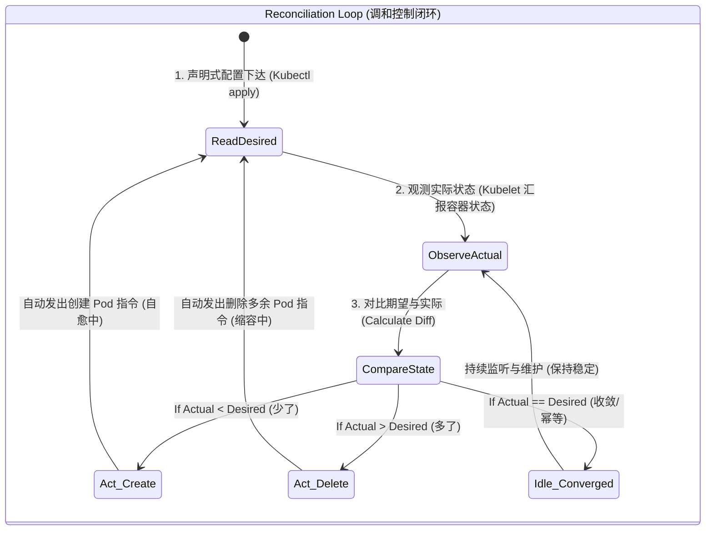

import GlossaryTerm from '@site/src/components/GlossaryTerm';
import GuidedExercise from '@site/src/components/GuidedExercise';
import ResearchNote from '@site/src/components/ResearchNote';
import ChapterMeta from '@site/src/components/ChapterMeta';
import PyRunner from '@site/src/components/PyRunner';
import TradeoffExplorer from '@site/src/components/TradeoffExplorer';
import QuizCard from '@site/src/components/QuizCard';

# M6L2 · Kubernetes 基础

<ChapterMeta
  time="约 3 小时"
  prereqs={[{label: 'M6L1 容器化', href: './containers'}, {label: 'M5L3 服务发现', href: '../core-components/service-discovery'}, {label: 'M5L1 负载均衡', href: '../core-components/load-balancing'}]}
  outcome="能解释 K8s 的声明式 API + 调和循环为什么是它的本质，区分 control plane/data plane，并说清 Pod/Deployment/Service 各管什么。"
  howToUse="先看“手动管几百个容器”的痛，再理解声明式调和这个核心思想，最后做调和循环 lab。"
/>

:::tip Kubernetes 的核心不是容器，是“声明期望状态，让系统自动维持它”
新手学 K8s 容易陷在背 Pod/Service/Deployment 一堆名词里。真正的钥匙只有一句话：**你声明"我想要什么"（3 个副本在跑），K8s 的控制器不断对比"实际是什么"，自动采取行动让现实逼近期望。** 机器挂了？它自动补一个。这叫调和循环（reconciliation loop），是云原生的灵魂。
:::

## 一、手动管几百个容器 = 不可能

[容器（M6L1）](./containers) 解决了"单个应用怎么打包跑起来"。但生产里你有几百个容器、几十台机器，要面对：机器挂了上面的容器怎么办？怎么保证某服务始终有 N 个副本？怎么把流量分给这些会变动的容器（[M5L1/L3](../core-components/service-discovery)）？怎么滚动升级不停服？**人工盯着做这些 = 不可能。** 需要一个"集群操作系统"来自动编排——这就是 Kubernetes。

## 二、三个核心概念（分层）

### 基础：声明式 API 与调和循环



K8s 的工作方式不是命令式（"启动这个、停那个"），而是<GlossaryTerm term="Declarative API" definition="声明式 API：你描述“期望的最终状态”（如 replicas=3），而不是“要执行的步骤”。系统负责算出从现状到期望该做什么并执行。" >声明式</GlossaryTerm>："我想要 3 个副本"。然后<GlossaryTerm term="Reconciliation Loop" definition="调和循环：控制器持续地“读取期望状态 + 观测实际状态 → 算出差异 → 采取行动消除差异”的循环。是 K8s 自愈和自动化的核心机制。" >调和循环</GlossaryTerm>持续运转：**读期望状态 → 看实际状态 → 算差异 → 行动**。期望 3 个、实际 2 个（挂了一个）→ 创建 1 个;期望 3 个、实际 4 个 → 删 1 个。这个"持续逼近期望"的循环就是 K8s 自愈的本质。

### 进阶：control plane vs data plane，核心对象

```mermaid
flowchart TD
  subgraph ControlPlane["🧠 控制面 (Control Plane - 集中决策)"]
    APIServer["🖥️ kube-apiserver <br/>(唯一网关，声明式 API 入口)"]
    etcd[(("💾 etcd <br/>(共识存储期望状态)"))]
    Controller["⚙️ kube-controller-manager <br/>(维持调和循环控制器)"]
    Scheduler["📅 kube-scheduler <br/>(分配 Pod 至物理节点)"]
    
    APIServer <--> etcd
    Controller <--> APIServer
    Scheduler <--> APIServer
  end

  subgraph DataPlane["💪 数据面 (Data Plane - 承载流量与计算)"]
    subgraph Node1["工作节点 Node 1"]
      kubelet1["⚙️ kubelet (代理守护进程)"]
      Proxy1["🔌 kube-proxy (网络负载均衡)"]
      Pod1["📦 Pod A (App Container)"]
      
      kubelet1 <--> Pod1
    end
    
    subgraph Node2["工作节点 Node 2"]
      kubelet2["⚙️ kubelet (代理守护进程)"]
      Proxy2["🔌 kube-proxy (网络负载均衡)"]
      Pod2["📦 Pod B (App Container)"]
      Pod3["📦 Pod C (App Container)"]
      
      kubelet2 <--> Pod2 & Pod3
    end
  end

  APIServer <-->|控制指令与心跳状态| kubelet1 & kubelet2
  Proxy1 & Proxy2 -.->|路由流量| Pod1 & Pod2 & Pod3

  noteCP["⚠️ 解耦设计：所有的外部业务请求包直接打给工作节点（Data Plane）的 Pod，完全不通过控制面，确保元数据开销与数据高并发分离！"]
  ControlPlane -.-> noteCP
```

- <GlossaryTerm term="Control Plane" definition="控制面：K8s 中负责“决定集群该怎么运行”的部分——API Server、调度器、控制器、etcd（存期望状态）。它不处理业务流量。" >控制面（control plane）</GlossaryTerm>：决定集群怎么运行——API Server（接收声明）、etcd（[共识存储期望状态，M5L11](../core-components/consensus-coordination)）、调度器、控制器。
- <GlossaryTerm term="Data Plane" definition="数据面：真正运行业务负载、处理流量的部分——各工作节点（Node）上的 kubelet 和容器。" >数据面（data plane）</GlossaryTerm>：真正跑业务的工作节点（Node）和上面的容器。
- 核心对象：<GlossaryTerm term="Pod" definition="Pod：K8s 最小调度单元，包含一个或多个共享网络和存储的容器。通常一个 Pod 跑一个主容器。Pod 是临时的、可被随时替换。" >Pod</GlossaryTerm>（最小调度单元，一组容器）、<GlossaryTerm term="Deployment" definition="Deployment：声明“我要 N 个某镜像的 Pod 副本”，由控制器维持该数量、并负责滚动更新/回滚。是无状态服务的标准管理对象。" >Deployment</GlossaryTerm>（维持 N 个副本 + 滚动升级）、<GlossaryTerm term="Service" definition="Service：给一组 Pod 一个稳定的虚拟地址和负载均衡入口。Pod 会变动（重建换 IP），Service 提供不变的访问点（服务端发现，见 M5L3）。" >Service</GlossaryTerm>（给一组会变动的 Pod 一个稳定入口 + 负载均衡，正是 [M5L3 服务端发现](../core-components/service-discovery)）。
```mermaid
flowchart TD
  Client["👤 客户端 (Client)"] -->|1. 访问稳定虚拟 IP / DNS 域名| Service["🔌 Service <br/>(Stable Entrance: ClusterIP/NodePort)"]
  
  subgraph DeploymentController["Deployment 控制器声明 (Replicas=3)"]
    Deployment["⚙️ Deployment <br/>(配置模板, 滚动更新)"] -->|控制| RS["⚙️ ReplicaSet <br/>(副本控制器)"]
  end

  RS -->|2. 创建与维护生命周期| Pod1[("📦 Pod 1 <br/>IP: 10.244.1.5 <br/>(Label: app=web)")]
  RS -->|2. 创建与维护生命周期| Pod2[("📦 Pod 2 <br/>IP: 10.244.2.8 <br/>(Label: app=web)")]
  RS -->|2. 创建与维护生命周期| Pod3[("📦 Pod 3 <br/>IP: 10.244.1.9 <br/>(Label: app=web)")]

  Service -->|3. 标签选择器 (Selector: app=web) 动态负载均衡分发| Pod1 & Pod2 & Pod3
```
### 深入（选学）：为什么调和模型如此强大

调和循环（而非一次性脚本）带来几个深远好处：
- **自愈**：任何偏离期望（Pod 崩、节点宕、被误删）都会被下一轮调和自动纠正——不需要人介入。
- **幂等与收敛**：反复 apply 同一份声明是安全的（[L6 幂等](../foundations/idempotency)）；无论当前什么状态，系统都向同一个期望收敛。
- **可扩展（自定义控制器/<GlossaryTerm term="Operator" definition="Operator (自定义控制器)：一种 Kubernetes 设计模式。它将特定领域的复杂应用程序（如数据库、缓存组）的运维管理知识编写为代码，结合自定义资源定义 (CRD) 与调和循环，实现高度定制化的自动化生命周期管理（如自动备份、主从切换等）。">Operator</GlossaryTerm>）**：你可以定义自己的资源类型 + 写一个调和它的控制器，把"运维知识"编码成自动化（如"数据库 Operator"自动处理备份、故障转移）。
- 这套"声明 + 调和"思想不止于 K8s：[IaC（M6L5）](./infrastructure-as-code)、GitOps、[服务网格](./service-mesh) 全是同一模型。**学透它，你就拿到了整个云原生的总钥匙。**

<ResearchNote
  title="Borg 到 Kubernetes：声明式调和的集群操作系统"
  source="Burns et al. (2016), Borg, Omega, and Kubernetes；Kubernetes 官方 Concepts"
  href="https://kubernetes.io/docs/concepts/"
  insight="K8s 源自 Google 内部的 Borg 经验。其核心不是容器技术，而是“以声明式 API 描述期望状态、由控制器调和循环持续逼近”的模型，加上 control plane/data plane 分离、标签选择器、服务抽象。自愈、滚动发布、自动伸缩都是调和模型的自然结果。"
  application="用 K8s 时，思维要从“我去启动/停止”转为“我声明期望、让控制器维持”。把 Deployment（副本+发布）、Service（稳定入口+发现）、ConfigMap/Secret（配置）组合起来。需要把运维逻辑自动化时，写自定义控制器/Operator。"
/>

## 三、跟我做一遍：调和循环

<PyRunner
  rows={32}
  expect="调和到期望状态"
  code={`# K8s 控制器的核心：读期望、看实际、算差异、行动 —— 循环往复
def reconcile(desired, actual):
    actions = []
    # 实际少于期望 -> 创建
    while len(actual) < desired:
        new_pod = "pod-%d" % (len(actual) + 1)
        actual.append(new_pod)
        actions.append("CREATE " + new_pod)
    # 实际多于期望 -> 删除
    while len(actual) > desired:
        removed = actual.pop()
        actions.append("DELETE " + removed)
    return actions

# 期望 3 个副本
actual = []
print("初始调和:", reconcile(3, actual))   # 创建 3 个
print("当前:", actual)

# 一个 Pod 崩了（节点宕机）
actual.remove("pod-2")
print("崩了一个后:", actual)
print("自愈调和:", reconcile(3, actual))   # 自动补 1 个
print("当前:", actual)

# 缩容到 1 个副本
print("缩容调和:", reconcile(1, actual))   # 删 2 个
print("最终:", actual)
print("调和到期望状态")`}
/>

无论实际偏离期望多远（少了、多了），调和循环都会算出动作让它收敛到期望——这就是 K8s "声明即可、自动维持"的本质。**试试**：连续调用两次 `reconcile(3, actual)`，看第二次返回空动作（已收敛，幂等）；这正是声明式的威力。

## 四、动手 Lab（必做）

打开 `labs/month06/m6l2_reconcile/`：

```bash
python labs/month06/m6l2_reconcile/test_reconcile.py
```

实现一个调和控制器：根据期望副本数创建/删除，支持自愈，且重复调和幂等（已收敛则无动作）。

<GuidedExercise
  title="练习指引：实现调和循环"
  goal="把“读期望→看实际→算差异→行动”做成代码——这是 K8s 自愈和声明式的核心。"
  hints={[
    '实际 < 期望 -> 创建补齐；实际 > 期望 -> 删除多余。',
    '返回执行的动作列表，便于断言。',
    '已收敛（实际==期望）时返回空动作（幂等）。',
    '自愈：手动移除一个再调和，应自动补回。'
  ]}
  steps={[
    '实现 reconcile(desired, actual)：创建/删除使 actual 达到 desired。',
    '保证收敛后再调和无动作（幂等）。',
    '模拟 Pod 崩溃（移除）后调和自愈。',
    '写测试：从 0 创建到 N、自愈补齐、缩容删除、已收敛幂等。'
  ]}
  checks={[
    '你能解释声明式 + 调和循环为什么是 K8s 的核心。',
    '你的 lab 能自愈且幂等收敛。',
    '你能区分 control plane 和 data plane。',
    '你能说出 Pod/Deployment/Service 各管什么。'
  ]}
/>

## 架构师深潜（Staff+ 视角）

### 1. 编排方式怎么选

<TradeoffExplorer
  title="容器编排/运行方式"
  dimensions={['自动化/自愈', '弹性伸缩', '生态/可移植', '学习运维成本', '适合规模']}
  options={[
    {
      name: '手动 / docker compose',
      scores: [1, 1, 3, 5, 1],
      note: '单机起几个容器够用。无自愈、无跨机调度、无弹性。',
      whenToUse: '本地开发、单机小应用。'
    },
    {
      name: 'Kubernetes',
      scores: [5, 5, 5, 1, 5],
      note: '声明式、自愈、弹性、生态丰富、可移植。但复杂、运维成本高。',
      whenToUse: '多服务、要弹性/自愈/标准化的生产系统——事实标准。'
    },
    {
      name: '托管容器服务(Serverless 容器)',
      scores: [4, 5, 2, 4, 4],
      note: '云厂商代管，少运维。但可移植性差、定制弱、可能锁定。',
      whenToUse: '想要 K8s 能力但不想自己运维控制面时。'
    }
  ]}
/>

### 2. "声明式 + 调和"是云原生的统一范式

记住这条贯穿全月的主线：你**声明期望**，系统**持续调和**到那个状态。它出现在每一层——K8s（期望副本/配置）、[IaC（M6L5）](./infrastructure-as-code)（期望的云资源）、GitOps（Git 里的声明即期望状态，自动同步到集群）、[服务网格](./service-mesh)（声明流量规则）。一旦你用"期望状态 + 调和"而非"一步步操作"来思考运维，整个云原生世界就通了。这也和 [M4L1 封装变化](../design-patterns-lld/change-driven-design)、[M5 自愈](../core-components/service-discovery) 一脉相承。

### 3. 真实案例：K8s 成为"云的通用底座"

十年间 K8s 从 Google 开源项目变成事实标准:各大云都提供托管 K8s（EKS/GKE/AKS），无数平台（数据库、消息队列、AI 训练、CI）以 Operator 形式跑在 K8s 上。它之所以赢，正是因为"声明式调和 + 可扩展控制器"这套模型足够通用——你能把任何"运维知识"编码成控制器。理解它，你才能读懂现代基础设施，也能判断"什么该上 K8s、什么是过度工程"。

### 4. 架构师深问（给自己 30 分钟）

- 你的小团队/小系统真的需要 K8s 吗？它的运维复杂度值不值（vs 托管 PaaS/Serverless）？什么规模是分水岭？
- etcd 是 K8s 的"单一事实来源"且用[共识（M5L11）](../core-components/consensus-coordination)。它挂了会怎样？为什么它要高可用、要备份？
- 把一个"运维操作"（如定期备份数据库、故障时切主）编码成 Operator/控制器，相比写个 cron 脚本，好在哪、复杂在哪？

## 自检清单

- [ ] 我能解释声明式 API + 调和循环为什么是 K8s 的核心。
- [ ] 我的 lab 调和控制器能自愈、幂等收敛。
- [ ] 我能区分 control plane 和 data plane。
- [ ] 我能说出 Pod/Deployment/Service 各自职责。

## 常见误解

- **"Kubernetes 只是个用来集中启动、停止和管理多个容器的小工具，没有什么大不了的架构创新"**: 极度低估了 K8s 的架构灵魂。K8s 的本质是一套 **分布式集群操作系统**，其核心并不是容器本身，而是 **声明式 API + 调和循环（Reconciliation Loop）**。它将应用部署、生命周期维持、健康检查等工作从传统的人工“命令式”执行，抽象升华为了“期望状态与现实状态持续逼近”的控制理论，容器仅仅是这一套控制环中被调度的具体实体。
- **"我们的应用部署到 K8s 之后，就天然自动获得强一致性与强高可用了，开发人员不需要关心底层任何故障"**: 典型的高可用盲区。K8s 仅在 **基础设施层** 提供容器的自愈和滚动升级。如果你的应用是非幂等的，当 K8s 检测到健康探针失败、将容器强行 Kill 并在其他节点重建时，可能会因为未完成的业务请求导致数据脏写和冲突。同时，如果 Pod 因为物理节点宕机被重新调度，会有数十秒的服务中断期，系统设计上依旧需要依靠 **限流、熔断和重试** 等 Month 5 的系统韧性构件在应用层予以防范。
- **"Kubernetes 整个集群的所有组件（包括 API Server 和 etcd）在任何时刻都会参与直接承载用户业务的 HTTP/TCP 流量"**: 对控制与数据解耦架构的混淆。K8s 拥有严格解耦的 **控制面（Control Plane）与数据面（Data Plane）**。API Server、调度器、Controller Manager 和 etcd 属于控制面，仅负责维护集群配置、状态和决策，绝不路由和处理业务实际流量。业务流量直接在数据面的 kube-proxy 和 Pod 节点上进行处理和分发。这种解耦保障了即使控制面短时瘫痪，线上正在跑的业务也完全不受影响。

## 常见误解自测

<QuizCard
  questions={[
    {
      q: '在 Kubernetes 中，‘声明式 API’与传统的‘命令式命令行脚本’相比，其实现‘自愈（Self-Healing）’的最关键机制是什么？',
      options: [
        '因为声明式 API 会强制锁定服务器的物理磁盘，防止任何误删除。',
        '声明式 API 仅定义‘期望的最终状态’（如指定副本数 replicas=3）。Kubernetes 内部的‘调和循环（Reconciliation Loop）’通过不断比对‘期望状态’与‘实际运行状态’来算出差异，并自动做出动作消除差异（补齐或删除 Pod）。这种以最终状态为导向的不断循环使得系统天然具备了容错和自动愈合能力。',
        '因为声明式 API 在遇到网络分区时会自动转换成 AP 模式来保全节点活性。'
      ],
      answer: 1,
      explain: '调和循环是 K8s 自愈的源泉。命令式脚本（如‘启动容器’）是一次性触发的，如果中途宕机，系统无法恢复；调和循环通过不断比对最终状态与当前状态，确保系统随时逼近期望状态。'
    },
    {
      q: '在 Kubernetes 核心架构中，Pod、Deployment 和 Service 各司其职。若要实现‘客户端访问一个固定的 IP/域名，并且该请求被负载均衡分发给多台在不断重建更新、IP 地址频繁变动的容器’，应当如何组合这三个对象？',
      options: [
        '直接将所有流量发送给 Deployment，再由 Deployment 去动态重写 etcd 配置。',
        '用 Pod 作为容器的最小调度载体；用 Deployment 负责声明并维持 Pod 的副本数量以及安全滚动升级；用 Service 通过标签选择器（Label Selector）与这一组 Pod 绑定，为其提供一个全局稳定的虚拟 IP（ClusterIP）和负载均衡入口。这样即使 Pod 因故障重建换了 IP，客户端访问 Service 依然稳定正常。',
        '放弃 Service，由客户端直接监听 API Server 的 etcd 变动并自己维护负载均衡。'
      ],
      answer: 1,
      explain: 'K8s 服务发现的经典铁三角组合。Pod 是临时易逝的，Deployment 负责其生命周期与水平弹性伸缩，Service 充当稳定入口并动态追踪后端 Pod 的可用 IP 列表，解决服务端服务发现问题。'
    },
    {
      q: '在 Kubernetes 架构设计中，控制面（Control Plane）与数据面（Data Plane）是如何解耦以保障业务吞吐的？',
      options: [
        '控制面负责承载 100% 的用户业务 HTTP 流量，数据面仅用来记录审计日志。',
        '控制面负责做出‘决策’和存储状态（如 etcd 存配置、Scheduler 选调度、API Server 处理交互，均不参与具体的业务包处理）；数据面（Node 节点）承载具体的业务容器进程并直接处理客户端的流量。这种分层保证了即使控制面发生网络阻塞或短暂故障，已经在数据面上运行的业务 Pod 依然可以正常服务、不受干扰。',
        '控制面和数据面共享同一个 CPU 进程，依靠内存锁进行安全解耦。'
      ],
      answer: 1,
      explain: '分布式系统控制与数据解耦的设计典范。控制面专注于控制逻辑与元数据存储，业务实际流量绝不经过控制面，从而保障了极高的业务吞吐量与极强的架构容错度。'
    }
  ]}
/>

## 延伸阅读

- [Kubernetes Concepts](https://kubernetes.io/docs/concepts/)
- [Borg, Omega, and Kubernetes (2016)](https://research.google/pubs/borg-omega-and-kubernetes/)
- [下一课：配置、密钥与探针](./config-secrets-probes)
