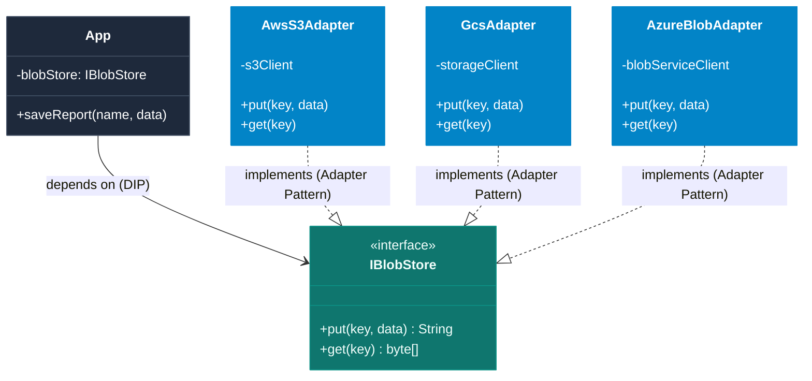
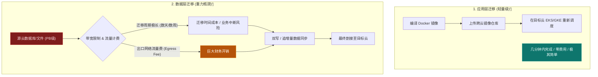

import GlossaryTerm from '@site/src/components/GlossaryTerm';
import GuidedExercise from '@site/src/components/GuidedExercise';
import ResearchNote from '@site/src/components/ResearchNote';
import ChapterMeta from '@site/src/components/ChapterMeta';
import PyRunner from '@site/src/components/PyRunner';
import TradeoffExplorer from '@site/src/components/TradeoffExplorer';
import QuizCard from '@site/src/components/QuizCard';

# M6L9 · 多云与混合云

<ChapterMeta
  time="约 2 小时"
  prereqs={[{label: 'M4L3 依赖倒置', href: '../design-patterns-lld/solid-lsp-isp-dip'}, {label: 'M4L8 适配器', href: '../design-patterns-lld/adapter-decorator'}, {label: 'M6L5 IaC', href: './infrastructure-as-code'}]}
  outcome="能权衡厂商锁定与可移植性的取舍、区分多云/混合云/单云策略，并用抽象层（适配器/DIP）在“可移植”和“用足托管服务”之间找平衡。"
  howToUse="先看“全压一家云”和“强行多云”各自的痛，再理解锁定与可移植的取舍，最后做云抽象层 lab。"
/>

:::tip 多云不是“越多越好”，而是一个有明确代价的战略选择
把全部身家压在一家云：享受它的托管服务很爽，但被**锁定**、议价权弱、它出区域性故障你跟着挂。但强行追求"哪家云都能跑"：你只能用最小公分母、放弃各家最好的托管服务、复杂度翻倍。这一课讲清这个取舍，以及怎么用[抽象层（M4L3/L8）](../design-patterns-lld/adapter-decorator) 务实地保留一定可移植性。
:::

## 一、两个极端的痛

- **全压单云**：用了某云独有的托管服务（专有数据库、消息、AI 服务），深度绑定。好处是开发快、运维省；坏处是<GlossaryTerm term="Vendor Lock-in" definition="厂商锁定：因深度依赖某云厂商的专有服务/API，迁移到别家成本极高，导致议价能力弱、受制于该厂商的价格、可用性和路线图。" >厂商锁定</GlossaryTerm>——想换云？几乎要重写;它涨价/出区域故障/砍服务，你被动挨打。
- **强行多云**：为了"不被锁定"，坚持只用各家都有的通用能力（裸虚拟机、标准 K8s），自己造数据库/消息/监控。结果：放弃了托管服务的省心、复杂度和成本反而暴涨、团队被基础设施拖住。

真相：多云/可移植性是**有代价的保险**，要根据风险和收益理性购买，而不是教条地"必须多云"或"All in 一家"。

## 二、三个核心概念（分层）

### 基础：单云 / 多云 / 混合云

- **单云**：全用一家。最简单、能用足托管服务，但有锁定风险。
- <GlossaryTerm term="Multi-cloud" definition="多云：同时使用多家公有云。可能为了避免锁定、利用各家优势服务、满足合规或就近，也可能只是历史/并购造成。代价是复杂度和运维成本上升。" >多云（multi-cloud）</GlossaryTerm>：同时用多家公有云（避免锁定、各取所长、合规、就近）。
- <GlossaryTerm term="Hybrid Cloud" definition="混合云：公有云与自有数据中心（私有云/本地）结合使用。常见于有合规、数据主权、已有重资产或低延迟本地需求的企业。" >混合云（hybrid cloud）</GlossaryTerm>：公有云 + 自有机房结合（合规、数据主权、已有重资产、低延迟本地需求）。

#### 多云与混合云部署拓扑对比


### 进阶：可移植性靠抽象层

要保留"将来能换"的能力，靠的是 <GlossaryTerm term="DIP" definition="依赖倒置原则 (Dependency Inversion Principle)：SOLID 软件设计原则之一。高层模块不应该依赖低层模块，两者都应该依赖抽象；抽象不应该依赖细节，细节应该依赖抽象。在多云架构中，指业务代码仅依赖中立接口，不直接依赖具体云厂商的 SDK 细节。">DIP（M4L3）</GlossaryTerm>——**业务代码依赖抽象接口，而不是某云的具体 SDK**：
- 定义自己的 `BlobStore`/`Queue`/`Notifier` 接口，给每个云写一个[适配器（M4L8）](../design-patterns-lld/adapter-decorator)。换云 = 换适配器，业务不动。
- 用**云中立的工具**降低锁定：K8s（容器编排到哪都一样）、[IaC（M6L5）](./infrastructure-as-code)（Terraform 跨云）、开源中间件（PostgreSQL 而非专有库）。

#### 依赖倒置与适配器实现云中立存储抽象



### 深入（选学）：可移植性的真实成本与数据引力

抽象不是免费的，要清醒：
- **最小公分母陷阱**：为了可移植只用通用能力，等于放弃各家最强的托管服务（如某云的 <GlossaryTerm term="Serverless" definition="无服务器计算：一种云原生执行模型，云厂商自动管理服务器的分配和缩容，按实际资源消耗计费。在多云架构中，由于各家 Serverless（如 AWS Lambda, Google Cloud Functions）接口和运行方式高度专有且无法跨云对齐，通常会带来极强的厂商绑定效应。">Serverless</GlossaryTerm>、向量库、AI 平台）——可能得不偿失。
- **抽象漏洞**：云服务的语义差异（一致性、限流、错误模型）很难被接口完全抹平，"看起来可移植"实则暗藏陷阱。
- <GlossaryTerm term="Data Gravity" definition="数据引力：数据越大越“重”，吸引应用和服务向它靠拢，且迁移成本（时间、出口流量费）随数据量急剧上升。是云迁移最大的实际障碍之一。" >数据引力（data gravity）</GlossaryTerm>：真正难迁的是**数据**——TB/PB 级数据迁移又慢又贵（出口流量费惊人），应用反而好搬。所以"多云"常常卡在数据上。

#### 数据引力迁移瓶颈流程


- **务实策略**：核心可移植性投资在"计算 + 编排 + IaC"（用 K8s + Terraform），数据和最吃价值的托管服务可以接受一定锁定——这是大多数成熟团队的选择，而非纯粹主义的"全可移植"。

<ResearchNote
  title="多云是风险对冲，不是默认最优"
  source="CNCF / 行业云架构实践；Martin Fowler 团队关于可移植性的讨论；各云 Well-Architected 框架"
  href="https://learn.microsoft.com/en-us/azure/architecture/guide/multicloud/"
  insight="多云/可移植性的价值（抗锁定、抗区域故障、合规、议价）是真实的，但代价（复杂度、放弃托管服务、抽象漏洞、数据引力）同样真实。多数成熟团队采取折中：用 K8s + IaC + 开源中间件保留计算层可移植性，对高价值托管服务和数据接受一定程度的锁定。"
  application="不要教条地“必须多云”或“All in 单云”。按风险定策略：可移植性投资集中在计算/编排/IaC；用 DIP + 适配器隔离云专有服务；评估数据引力——迁数据才是真瓶颈。混合云用于合规/数据主权/已有资产。"
/>

## 三、跟我做一遍：云中立抽象层

<PyRunner
  rows={32}
  expect="换云只换适配器"
  code={`# 业务依赖抽象接口（DIP），不依赖任何具体云 SDK
class App:
    def __init__(self, blob_store):     # 注入存储抽象
        self.store = blob_store
    def save_report(self, name, data):
        return self.store.put(name, data)

# 每个云一个适配器（M4L8），把各自 SDK 翻译成统一 put 接口
class AwsS3Adapter:
    def __init__(self): self.bucket = {}
    def put(self, key, data):           # 内部其实调 s3.put_object(...)
        self.bucket[key] = data
        return "s3://%s" % key

class GcsAdapter:
    def __init__(self): self.bucket = {}
    def put(self, key, data):           # 内部其实调 gcs blob.upload(...)
        self.bucket[key] = data
        return "gs://%s" % key

# 同一个 App，注入不同云的适配器 —— 业务代码一行不改
app_aws = App(AwsS3Adapter())
print("AWS:", app_aws.save_report("q3", "data"))

app_gcp = App(GcsAdapter())             # 换云 = 换适配器
print("GCP:", app_gcp.save_report("q3", "data"))
print("换云只换适配器")`}
/>

业务代码只认 `put` 这个抽象接口，换云只需换注入的适配器——这是 [DIP + 适配器](../design-patterns-lld/adapter-decorator) 在多云的直接应用。**试试**：再加一个 `AzureBlobAdapter`；然后想想——如果各云的"一致性保证"不同，这个统一接口能完全抹平差异吗？（抽象漏洞）

## 四、动手 Lab（必做）

打开 `labs/month06/m6l9_cloud_abstraction/`：

```bash
python labs/month06/m6l9_cloud_abstraction/test_abstraction.py
```

用 DIP + 适配器实现云中立的存储抽象：业务依赖接口、每个云一个适配器、换云不改业务。

<GuidedExercise
  title="练习指引：实现云抽象层"
  goal="用 DIP + 适配器把业务和具体云解耦——保留可移植性的同时，理解它的边界。"
  hints={[
    '定义统一接口（如 put(key, data) / get(key)）。',
    '每个云一个适配器，内部模拟各自 SDK 行为，对外暴露统一接口。',
    '业务类注入抽象，不依赖任何具体云类（DIP，回扣 M4L3）。',
    '想想：各云的 URL 格式/语义不同，接口能抹平到什么程度？'
  ]}
  steps={[
    '实现 App(store)，依赖注入的存储抽象。',
    '实现 2 个云适配器（统一 put/get 接口）。',
    '验证同一 App 注入不同适配器都能工作。',
    '写测试：换适配器业务不变、各适配器行为正确、业务不依赖具体云类。'
  ]}
  checks={[
    '你能权衡厂商锁定与可移植性的取舍。',
    '你的抽象层让换云只需换适配器。',
    '你能解释最小公分母陷阱和抽象漏洞。',
    '你理解数据引力为什么是迁云真正的瓶颈。'
  ]}
/>

## 架构师深潜（Staff+ 视角）

### 1. 云战略怎么选

<TradeoffExplorer
  title="云部署战略"
  dimensions={['开发/运维省心', '抗锁定/议价', '抗区域故障', '复杂度成本', '能用足托管服务']}
  options={[
    {
      name: '单云 All-in',
      scores: [5, 1, 2, 5, 5],
      note: '最省心、能用足托管服务。但锁定深、议价弱、随它故障。',
      whenToUse: '多数中小团队的务实起点——先把业务做出来。'
    },
    {
      name: '单云 + 可移植设计',
      scores: [4, 3, 2, 4, 4],
      note: '主用一家，但用 K8s/IaC/抽象层保留“能换”的能力。折中。',
      whenToUse: '在意未来灵活性、但不想现在承担多云成本时——常见选择。'
    },
    {
      name: '真多云',
      scores: [2, 5, 5, 1, 3],
      note: '抗锁定、抗区域故障、可合规就近。但复杂度/成本最高、放弃部分托管服务。',
      whenToUse: '大企业、强合规、或已被并购历史造成时。'
    }
  ]}
/>

### 2. 锁定不是非黑即白，要按"层"决策

成熟的判断不是"锁定 = 坏"，而是分层权衡：**越底层越该可移植（计算/容器/编排用 K8s、基础设施用 IaC——这些跨云成本低、收益大），越上层/越高价值的托管服务可以接受锁定**（用某云最强的 AI/数据服务能大幅提速，强行可移植反而吃亏）。这正是 [M4 的设计判断力](../design-patterns-lld/change-driven-design) 在云战略层的体现：只为"真正可能变、且换得起"的部分做抽象（DIP），其余务实地接受锁定。把抽象用错地方（给所有云服务都套接口）就是过度设计。

### 3. 真实案例：多云常是"结果"而非"设计"

业界一个反直觉的事实：很多公司的多云不是规划出来的，而是**并购、团队各自选型、合规要求**等历史原因造成的"既成事实"。真正从第一天就设计成"任意云可移植"的系统很少——因为代价太高。更常见且明智的是：主用一家云把业务跑起来，用 K8s + IaC + 关键抽象层保留"未来能迁"的选项，等真有强需求（成本、合规、抗灾）再迁特定部分。**架构师要避免为想象中的"将来要多云"而过度设计**（<GlossaryTerm term="YAGNI" definition="You Aren't Gonna Need It (你不需要它原则)：极限编程（XP）的核心原则之一，强调除非现在确实有强烈的实际需求，否则不要为未来可能用到的功能或架构写代码。在多云设计中，警告架构师不要为想象中换云的需求提前进行昂贵的过度设计。">YAGNI</GlossaryTerm>）。

### 4. 架构师深问（给自己 30 分钟）

- 你的系统现在锁定在哪些云专有服务上？换云的话最难搬的是什么（大概率是数据）？
- 哪些层值得投入做可移植（计算/编排/IaC）、哪些托管服务接受锁定换效率更划算？
- 如果主力云出现区域性大故障，你的业务受影响多大？这个风险值得用多云成本去对冲吗？

## 自检清单

- [ ] 我能权衡厂商锁定与可移植性的取舍。
- [ ] 我的 lab 用 DIP + 适配器实现云中立抽象。
- [ ] 我能区分单云/多云/混合云及适用场景。
- [ ] 我理解数据引力和最小公分母陷阱。

## 常见误解

- **"多云战略能自动带来 100% 的高可用和灾备，只要我们把系统跑在两家公有云上，一家挂了另一家就能瞬间接管业务"**：这是极度理想化的灾备幻觉，多云在提升可用性的同时，其架构复杂度也会呈指数级上升。实际上，跨云的双活或热备面临极其棘手的“跨云网络延迟与数据一致性问题”。如果将数据同步复制，数据库每次写都会因跨云网络往返增加几十毫秒的延迟，直接压垮系统吞吐量；若采用异步复制，在源云崩盘切换时，必定会面临数据丢失与状态不一致。多云甚至会由于运维配置错误、链路分裂（Split-Brain）导致更频繁的宕机故障。对于多数公司，在单云内进行多 Availability Zone (AZ) 或多 Region 灾备是性价比更高、更稳定的选择。
- **"我们的应用服务全部跑在 Kubernetes 容器集群上，并用中立的 Terraform 编写 IaC，因此我们就完全实现了 0 锁定，随时随地可以 100% 无缝迁移到另一家云厂商"**：这属于典型的“计算层可移植性掩盖了数据与基础设施锁定”。虽然 K8s 保证了容器在不同云上的调度逻辑一致，但应用所依赖的专有托管数据库（如 AWS DynamoDB、Google Spanner）、对象存储（GCS/S3 的底层权限 IAM）、负载均衡 Ingress 实现、以及集群周边的日志收集（CloudWatch / Stackdriver）在不同云之间完全不同。一旦试图搬迁，这些周边基础设施的重新配置、权限系统的映射重写、存储卷插件 (CSI) 兼容等，依旧会产生庞大的重构工作量。
- **"作为一名高瞻远瞩的架构师，应该从项目开工的第一天起，就为所有可能用到的云产品（云数据库、消息队列、存储、邮件通知、短信）编写接口抽象层，以防以后面临迁移锁定"**：彻底违背了 YAGNI 原则与最小公分母反模式。对所有云服务进行抽象不仅在项目初期耗费极其宝贵的研发资源，更致命的是它会产生“抽象漏洞”——为了接口能兼容所有云厂商，你只能使用最简单、最平庸的通用接口功能，从而放弃了各厂商在高并发、分布式、冷热数据自动转换等方面的特有高级托管特性（例如放弃了 DynamoDB 的 Stream 触发器或 GCS 的强一致性），直接限制了系统的整体竞争力。

## 常见误解自测

<QuizCard
  questions={[
    {
      q: '在多云架构的选型和抽象设计中，“最小公分母陷阱 (Least Common Denominator Trap)”通常指的是什么？为什么它会降低微服务架构的运行效能？',
      options: [
        '因为多云环境下的计算资源是均分的，这导致每个服务的并发数被局限在各家云能提供的最小服务器规格上。',
        '为了使业务代码做到“100% 跨云中立、无需修改适配器”，架构师只能在自定义的抽象接口中保留所有云厂商都具备的通用、极简功能。这相当于主动放弃了各云厂商独家研发的、极具性能或成本优势的专属高级托管特性（如专有的分布式强一致事务库、Serverless 特有并发伸缩策略），导致为了形式上的移植性牺牲了实际的效率。',
        '多云环境由于使用了多套网络配置，导致跨云通信的最低带宽退化成了各厂商网路链接的最小值。'
      ],
      answer: 1,
      explain: '“最小公分母陷阱”是云抽象层的核心矛盾。高价值的云托管服务通常包含极具专有技术优势的 API；强行抽象意味着磨平这些差异，使系统退化成只依赖最基础的存储/计算功能，丧失了云原生平台的效能红利。'
    },
    {
      q: '多云迁移时，为什么说“数据引力 (Data Gravity)”才是决定迁移成败与成本的决定性因素？作为架构师应该如何应对？',
      options: [
        '数据引力是指数据越大，在硬盘里的重力会物理增加，导致云端硬盘容易受重力影响而损坏，这阻碍了硬盘的移动。',
        '计算容器镜像只有几百MB，可在几分钟内全球调度；而生产库与海量对象存储数据动辄 TB/PB 级别。网络传输速度受光速与物理带宽限制导致迁移周期极长（数周甚至数月），且各云厂商为防止客户流失，通常对“下行流量（Egress）”收取极其高昂的跨云流量费（数据引力效应）。架构师应采取“计算跟随数据”策略，只在计算层保留可移植性，而在核心数据层接受务实的锁定。',
        '因为只要数据一被复制到别的云，原云就会利用版权法起诉，导致迁移失败。'
      ],
      answer: 1,
      explain: '数据是有物理“引力”的。TB/PB 级数据的迁移面临极大的带宽限制、时间延迟和高昂的云厂商出口带宽费用（Egress Cost）。应用代码（无状态计算）容易重新调度发布，而有状态的数据才是真正的重力中心，决定了应用运行的位置。'
    },
    {
      q: '关于如何务实地在“避免厂商锁定”与“享受高质量云托管服务”之间寻找平衡，以下哪种是互联网企业中最为普遍采用的分层决策策略？',
      options: [
        '底层基础设施（容器调度用 Kubernetes、资源初始化用中立的 Terraform IaC）实施标准化，保证计算和编排的可移植性；而对于中上层具有极高商业价值或极大减负效用的专属服务（如数据仓库 BigQuery/Redshift，或专属 AI 模型托管）则务实地接受厂商绑定，用效率换取市场先机。',
        '从不使用任何云厂商提供的关系型数据库或 K8s 服务，全站从底层虚拟机起自建，以求达到绝对的零锁定。',
        '全站所有的应用、数据库、缓存一概无差别地双活运行在 AWS 和 GCP 上，通过自研的全局负载均衡在每次请求时随机路由。'
      ],
      answer: 0,
      explain: '分层锁定决策是 Staff 级架构师必须掌握的平衡艺术。计算层和资源编排标准化门槛低、收益大（K8s/Terraform 几乎无成本对齐）；而数据分析、AI 托管等上层增值服务如果强求中立，会大幅增加研发和运维负担，失去使用云平台的最初意义（用效率换时间）。'
    }
  ]}
/>

## 延伸阅读

- [Azure: Multicloud Architecture](https://learn.microsoft.com/en-us/azure/architecture/guide/multicloud/)
- [Data Gravity (Dave McCrory)](https://datagravitas.com/)
- [下一课：企业应用与 ERP 集成](./enterprise-erp-integration)