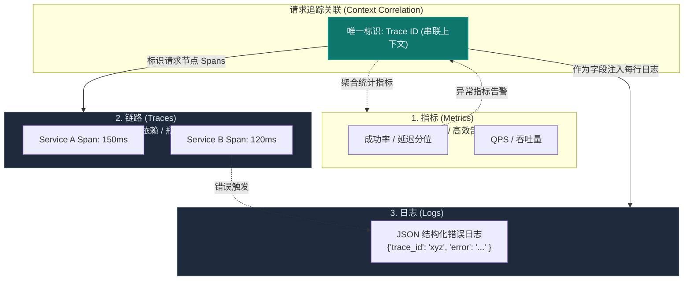
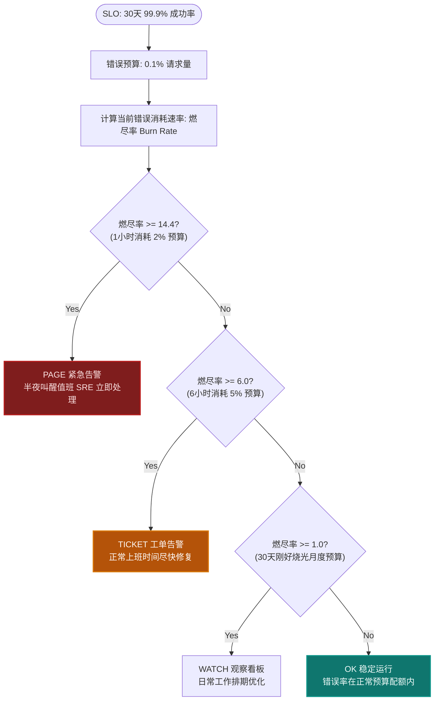
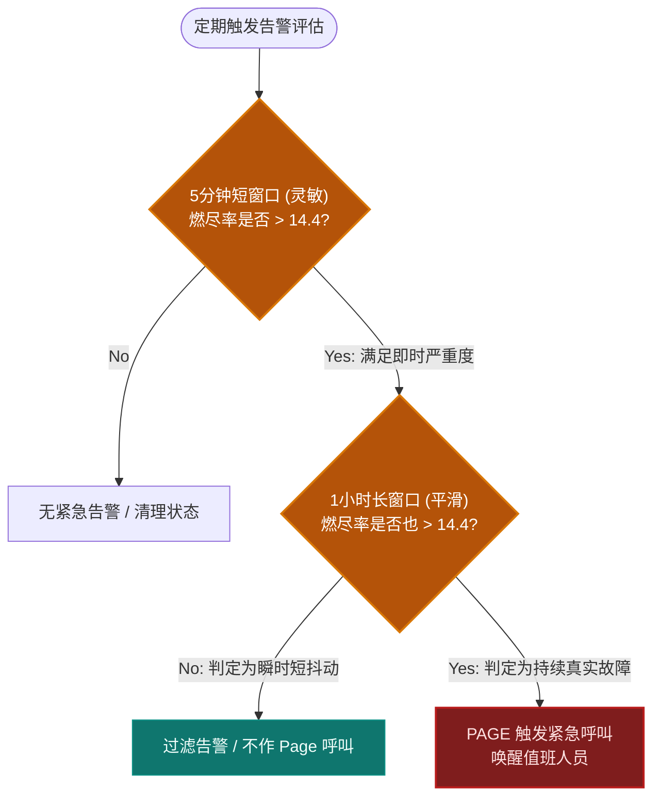

import GlossaryTerm from '@site/src/components/GlossaryTerm';
import GuidedExercise from '@site/src/components/GuidedExercise';
import ResearchNote from '@site/src/components/ResearchNote';
import ChapterMeta from '@site/src/components/ChapterMeta';
import PyRunner from '@site/src/components/PyRunner';
import TradeoffExplorer from '@site/src/components/TradeoffExplorer';
import QuizCard from '@site/src/components/QuizCard';

# M6L7 · 可观测性进阶

<ChapterMeta
  time="约 2.5 小时"
  prereqs={[{label: 'L12 可观测性', href: '../foundations/observability'}, {label: 'M5L12 SLO', href: '../core-components/capstone-resilient-service'}, {label: 'L15 性能与延迟', href: '../foundations/performance-and-latency'}]}
  outcome="能用指标/日志/链路三支柱 + RED/USE 方法系统化监控，并用 SLO + 错误预算燃尽率做“有意义的告警”，而非告警风暴。"
  howToUse="先看“线上出事却两眼一抹黑/告警淹没”的痛，再理解三支柱和 SLO 告警，最后做燃尽率告警 lab。"
/>

:::tip 可观测性不是“收集一堆数据”，是“能回答没预想过的问题”
[L12](../foundations/observability) 学过日志/指标/链路的基础。但海量数据不等于能定位问题。可观测性的真正目标：当线上出现你**从没预想过**的故障，你能靠现有的遥测数据**追问出根因**——而不是淹没在告警和图表里。这一课讲怎么系统化地做到，以及怎么告警才"有意义"。
:::

## 一、两种极端，都让你抓瞎

- **数据太少**：线上变慢了，没有链路追踪，不知道是哪个服务、哪个依赖慢；没有结构化日志，grep 半天找不到那条请求。
- **告警太多**：配了几百条"CPU>70% 就告警"的规则，每天几千条告警，全是噪声，真正的故障淹没其中——<GlossaryTerm term="Alert Fatigue" definition="告警疲劳：告警过多、噪声过大，导致工程师麻木、忽略告警，真正重要的告警反而被淹没。是监控做得“多而无用”的典型症状。" >告警疲劳</GlossaryTerm>，没人再看告警。

好的可观测性要在这两极之间：**数据足够追问根因，告警只在"真的该有人起床"时响。**

## 二、三个核心概念（分层）

### 基础：可观测性三支柱

<GlossaryTerm term="Observability" definition="可观测性：通过系统对外输出的遥测数据（指标、日志、链路）推断其内部状态的能力，重点是能回答事先没预想到的问题，而不只是监控预设的指标。" >可观测性</GlossaryTerm>的三类数据（[L12](../foundations/observability) 的深化）：
- <GlossaryTerm term="Metrics" definition="指标：随时间聚合的数值（QPS、延迟分位、错误率、资源利用率）。便宜、适合趋势和告警，但是聚合的、无法回溯单个请求细节。" >指标（metrics）</GlossaryTerm>：聚合数值，看趋势、做告警。便宜，但丢失个体细节。
- <GlossaryTerm term="Logs" definition="日志：离散的带时间戳事件记录。最好是结构化的（带字段），便于检索特定请求/错误。信息丰富但量大、成本高。" >日志（logs）</GlossaryTerm>：离散事件，查具体请求。要**结构化**（带字段）才好查。
- <GlossaryTerm term="Distributed Tracing" definition="分布式追踪：用统一的 trace id 串起一个请求跨多个服务的完整路径，显示每段耗时，定位“慢在哪个服务/依赖”。" >链路追踪（tracing）</GlossaryTerm>：用 <GlossaryTerm term="Trace ID" definition="Trace ID (链路追踪标识)：在分布式追踪系统中，用于唯一标识单个逻辑请求的唯一字符串标识符。当请求进入系统边界时生成，并通过进程内和进程间通信（如 HTTP Header）向下游所有微服务透传，使得跨越多个独立服务的调用链得以串联成一个完整的调用拓扑图。">Trace ID</GlossaryTerm> 串起一个请求跨服务的全程，定位"慢在哪一跳"（对微服务 [M5](../core-components/overview) 至关重要）。

#### 可观测性三支柱与 Trace ID 关联结构



### 进阶：RED 与 USE 方法

别凭感觉加监控，用成熟方法系统覆盖：
- <GlossaryTerm term="RED Method" definition="RED 方法：面向请求型服务的监控三指标——Rate（请求速率）、Errors（错误率）、Duration（延迟分布）。回答“服务对用户表现如何”。" >RED</GlossaryTerm>（面向服务/请求）：**R**ate（速率）、**E**rrors（错误率）、**D**uration（延迟分布，看 [p95/p99 而非平均，L15](../foundations/performance-and-latency)）。
- <GlossaryTerm term="USE Method" definition="USE 方法：面向资源的监控三指标——Utilization（利用率）、Saturation（饱和度/排队）、Errors（错误）。回答“资源是不是瓶颈”。" >USE</GlossaryTerm>（面向资源）：**U**tilization（利用率）、**S**aturation（饱和度/排队）、**E**rrors。RED 看"用户体验如何"，USE 看"资源是不是瓶颈"，两者互补。

### 深入（选学）：基于 SLO 的告警——只在真正重要时响

传统告警基于"原因"（CPU 高、磁盘满）——但 CPU 高不一定影响用户。现代做法是基于<GlossaryTerm term="SLO-based Alerting" definition="基于 SLO 的告警：不对“原因指标”（CPU/内存）告警，而是对“用户可感知的症状”和 SLO 违约风险告警。让告警与用户影响直接挂钩，减少噪声。" >SLO 的症状告警</GlossaryTerm>（[M5L12 SLO/错误预算](../core-components/capstone-resilient-service)）：
- 对**用户可感知的症状**（成功率、延迟）告警，而非原因。CPU 高但用户没受影响？不必半夜叫醒人。
- <GlossaryTerm term="Error Budget Burn Rate" definition="错误预算燃尽率：当前错误消耗错误预算的速度。燃得快（短时间内会烧光本月预算）才告警，把告警紧迫度和实际风险挂钩，避免对偶发抖动误报。" >错误预算燃尽率（burn rate）</GlossaryTerm>：看"错误预算被消耗的速度"。快速燃尽（几小时就要烧光本月预算）→ 紧急告警、立刻处理;缓慢燃尽 → 工单慢慢修。这让告警的紧迫度和真实风险挂钩，根治告警疲劳。
- 告警要**可执行**：每条告警都该对应"有人能做的具体动作"，否则就是噪声，该删掉。

#### 基于 SLO 错误预算燃尽率的告警流转



<ResearchNote
  title="从监控到可观测性，从原因告警到 SLO 告警"
  source="Google SRE — Monitoring & Alerting on SLOs；Tom Wilkie — RED Method；Brendan Gregg — USE Method；OpenTelemetry"
  href="https://sre.google/workbook/alerting-on-slos/"
  insight="Google SRE 主张对“症状”（用户可感知的 SLI）而非“原因”告警，并用错误预算燃尽率决定告警紧迫度——多窗口多燃尽率告警能兼顾灵敏与少误报。RED（服务）和 USE（资源）方法提供系统化的指标覆盖。OpenTelemetry 统一了三支柱的采集。"
  application="用 RED/USE 系统化覆盖监控；对 SLO 违约风险（燃尽率）告警而非对 CPU 之类原因告警；每条告警都要可执行。用 OpenTelemetry 统一采集指标/日志/链路并用 trace id 关联。目标是少而准的告警 + 足以追问根因的数据。"
/>

## 三、跟我做一遍：错误预算燃尽率告警

<PyRunner
  rows={32}
  expect="按燃尽率分级告警"
  code={`# SLO: 30 天 99.9% 成功 -> 允许错误率 0.1%。看“当前错误率烧预算多快”
SLO = 0.999
budget = 1 - SLO            # 允许的错误比例 = 0.001

def burn_rate(error_rate):
    # 燃尽率 = 当前错误率 / 预算错误率。>1 表示比“刚好烧完一个月”更快
    return error_rate / budget

def alert(error_rate):
    br = burn_rate(error_rate)
    if br >= 14.4:   # 1 小时内烧掉 2% 月预算 -> 紧急（page）
        return ("PAGE", "燃尽率 %.1fx：数小时内将耗尽预算" % br)
    if br >= 6:      # 烧得较快 -> 工单
        return ("TICKET", "燃尽率 %.1fx：需尽快处理" % br)
    if br >= 1:      # 略超但不急
        return ("WATCH", "燃尽率 %.1fx：观察" % br)
    return ("OK", "燃尽率 %.2fx：在预算内" % br)

print("错误率 0.05%:", alert(0.0005))   # 低于预算速率 -> OK
print("错误率 0.3%:",  alert(0.003))    # 3x -> WATCH/TICKET
print("错误率 2%:",    alert(0.02))     # 20x -> PAGE（紧急）
print("错误率 0.1%:",  alert(0.001))    # 正好 1x（刚好一个月烧完）
print("按燃尽率分级告警")`}
/>

同样是"有错误"，燃得慢的进工单慢慢修、燃得快的才半夜叫醒人——告警紧迫度和真实风险挂钩，而不是一有错误就狂响。**试试**：加一个"多窗口"判断（同时看最近 1 小时 and 最近 5 分钟的燃尽率都高才 PAGE），体会怎么兼顾灵敏和少误报。

#### 多窗口多燃尽率过滤算法逻辑



## 四、动手 Lab（必做）

打开 `labs/month06/m6l7_burn_rate/`：

```bash
python labs/month06/m6l7_burn_rate/test_burn_rate.py
```

实现 SLO 燃尽率告警：按错误率算燃尽率、分级（OK/WATCH/TICKET/PAGE），并支持多窗口确认。

<GuidedExercise
  title="练习指引：实现燃尽率告警"
  goal="把“错误预算燃尽率分级告警”做成代码——这是 SRE 式“有意义告警”的核心。"
  hints={[
    'budget = 1 - SLO；burn_rate = error_rate / budget。',
    '燃尽率越高越紧急：分 PAGE / TICKET / WATCH / OK 几档。',
    '多窗口：要求长短两个时间窗的燃尽率都超阈值才 PAGE（减少误报）。',
    '告警要对应可执行的动作，否则是噪声。'
  ]}
  steps={[
    '实现 burn_rate(error_rate, slo)。',
    '实现 alert(error_rate, slo)：按阈值返回分级。',
    '（选做）实现 multi_window_alert(short_rate, long_rate)。',
    '写测试：预算内 OK、略超 WATCH、快速燃尽 PAGE、多窗口需双高才 PAGE。'
  ]}
  checks={[
    '你能说出指标/日志/链路各自适合回答什么问题。',
    '你能用 RED/USE 系统化设计监控。',
    '你的 lab 按燃尽率分级、减少误报。',
    '你能解释为什么对症状/SLO 告警优于对 CPU 等原因告警。'
  ]}
/>

## 架构师深潜（Staff+ 视角）

### 1. 告警策略对比

<TradeoffExplorer
  title="告警策略"
  dimensions={['捕捉真实故障', '减少误报', '与用户影响相关', '实现复杂度', '维护成本']}
  options={[
    {
      name: '阈值告警(CPU>70%)',
      scores: [3, 1, 1, 5, 1],
      note: '简单，但对“原因”告警噪声大、和用户影响脱节、易告警疲劳。',
      whenToUse: '资源容量规划的辅助参考，不该作为主要 page 来源。'
    },
    {
      name: '症状告警(成功率/延迟)',
      scores: [5, 3, 5, 3, 3],
      note: '对用户可感知的 SLI 告警，和影响直接相关。',
      whenToUse: '面向用户服务的主要告警来源。'
    },
    {
      name: '多窗口燃尽率告警',
      scores: [5, 5, 5, 2, 3],
      note: '按预算消耗速度 + 多窗口确认，灵敏且少误报。SRE 推荐。',
      whenToUse: '有明确 SLO 的关键服务。'
    }
  ]}
/>

### 2. 可观测性是分布式系统的"眼睛"

[Month 5](../core-components/overview) 你把系统拆成一堆协作的服务——但拆得越散，"出了问题在哪"就越难答。没有链路追踪，一个跨 10 个服务的慢请求根本无从下手（[呼应尾延迟 L15](../foundations/performance-and-latency)）。可观测性是分布式架构的必要配套：**你拆分系统获得的弹性和扩展性，要靠可观测性来偿还"看不清整体"的代价。** 架构师设计系统时，要把"怎么观测它"和"怎么构建它"同等对待——trace id 贯穿、结构化日志、关键 SLI 埋点，都要在设计阶段就规划。

### 3. 真实案例：从"战争房间"到"五分钟定位"

成熟团队出故障时：告警（基于 SLO 燃尽率）精准响起 → 仪表盘（RED/USE）一眼看出哪个服务异常 → 链路追踪定位到具体慢的那一跳/那个依赖 → 结构化日志查到具体错误 → 几分钟内定位根因、回滚或修复（低 <GlossaryTerm term="Mean Time To Repair" definition="平均故障恢复时间 (MTTR - Mean Time To Repair)：服务发生故障或中断，从被检测/报警开始，到服务完全恢复正常（符合 SLO）所需的平均时间。它是衡量系统弹性和团队运维效率的关键 DORA 指标。">MTTR</GlossaryTerm>/DORA 恢复时间）。而可观测性差的团队，同样的故障要拉一屋子人"战争房间"猜几个小时。这个差距，几乎全由可观测性体系的好坏决定。

### 4. 架构师深问（给自己 30 分钟）

- 线上一个跨多服务的请求变慢，你现在能多快定位到是哪一跳？有没有贯穿的 trace id？
- 你的告警里有多少是"响了也没人能做什么"的噪声？哪些该删、哪些该改成 SLO 燃尽率告警？
- 你的关键服务有明确 SLO 吗？错误预算谁在盯？烧得快时谁被叫醒、做什么？

## 自检清单

- [ ] 我能说出指标/日志/链路各自适合回答什么问题。
- [ ] 我能用 RED/USE 系统化设计监控。
- [ ] 我的 lab 用燃尽率分级告警、减少误报。
- [ ] 我理解对症状/SLO 告警优于对原因告警。

## 常见误解

- **"既然我们要保证 100% 的可观测性，就应该无差别地收集应用所有的指标、最详细的 debug 级别日志，并开启 100% 比例的链路追踪采样"**：这是极不理智的“数据堆积”反模式，会导致灾难性的财务与系统开销。在高并发生产环境中，100% 采样的 Tracing 和无差别的 Debug 日志会产生极其庞大的 I/O 压力，甚至拖慢应用程序自身的响应速度，且会带来数以万计的昂贵存储账单。正确的做法是：**针对性收集高基数（High Cardinality）的核心遥测数据**，在生产中将日志限制在 INFO/WARN/ERROR 级别，对 Tracing 采用动态头/尾部采样（如只采样 1% 的正常请求，但 100% 采样出错和慢请求），实现成本与观测效能的极致平衡。
- **"每当线上系统出现一个偶发性的 API 调用报错或超时，就应该立刻通过邮件/短信/电话通道告警唤醒值班工程师处理，这样才能将 Bug 扼杀在摇篮里"**：这是导致“告警疲劳（Alert Fatigue）”最直接的杀手。对于大型分布式系统，由于网络抖动、临时垃圾回收 GC 等原因，个别偶发性失败属于客观必然。如果每次微小失败都发送高紧迫度告警，会导致值班人员由于长期神经紧绷而产生麻木心理，最终在真正的大型灾难（SLO 级故障）发生时错失黄金排查时机。应当采用**基于 SLO 错误预算消耗速度（燃尽率）的策略**，只有当故障以极快的速度吞噬本月错误预算时才 Page 叫醒工程师，其他偶发波动只应转化为工单在工作时间排查。
- **"可观测性纯粹是运维或 SRE 团队的工作，作为开发人员，我只需要写好业务逻辑，等上线部署后由运维人员在 Grafana 上配置一些大屏和图表即可"**：彻底的开发与运维割裂错误认知。虽然运维可以在部署后通过 Prometheus 监控 CPU 或网络资源，但他们无法隔空知晓系统的“业务逻辑状态”。分布式系统的 Trace 上下文透传（Context Propagation）、核心业务指标定义（如订单流转速率）、关键异常的结构化日志输出，**必须由开发人员在代码编写阶段（架构设计与 LLD 阶段）就作为功能特性实现**。可观测性应当是一等公民的研发功能，而不是事后打的运维补丁。

## 常见误解自测

<QuizCard
  questions={[
    {
      q: '在分布式架构的线上排障中，如果系统变慢，工程师如何利用“可观测性三支柱（Metrics, Logs, Traces）”进行层层定位以找出根本原因？以下哪种分析顺序是最高效的？',
      options: [
        '先通过 Logs 逐条过滤所有服务的日志，找到报错行后去 Trace 中对齐该 ID，最后在 Metrics 看总体趋势。',
        '先通过聚合指标（Metrics）如 P99 延迟异常检测到系统变慢，并触发告警；接着利用分布式链路追踪（Traces）查看调用树，一眼锁定制品调用链中最慢的某一个特定服务（或慢数据库调用）；最后根据该段 Trace ID 检索该服务当时的结构化日志（Logs），查出具体错误堆栈或异常原因。',
        '直接打开容器终端，用 top 命令查看 CPU 使用情况，因为 CPU 高是所有慢请求的唯一根源。'
      ],
      answer: 1,
      explain: '三支柱排障的最佳实践是：指标定位症状、链路定位瓶颈、日志定位细节。聚合的 Metrics 成本低且实时，适合检测并触发告警；Tracing 可以清晰展现跨服务的多跳依赖和每一段的延迟，定位慢在哪；最后结合 Trace ID 精准调出对应故障日志看错误现场，避免了在海量日志中盲目摸鱼。'
    },
    {
      q: 'Google SRE 倡导的基于 SLO 的告警设计中，“错误预算燃尽率（Burn Rate）”发挥着什么作用？为什么相比传统的单阈值（如错误率 > 1% 告警）更具抗噪能力？',
      options: [
        '燃尽率是为了统计程序员写出 Bug 的速度，用于季度绩效评估。',
        '因为单阈值告警在短暂抖动（如网络丢包 2 秒）时会瞬间误报，而在持久小错误（如错误率 0.15% 持续一个月烧光全部预算）时却无法触发。燃尽率将错误率与时间跨度关联，通过多窗口组合（如同时看 5m 短窗和 1h 长窗），只有当错误不仅发生且具有持续性（表明月度预算将在短时间内被烧尽）时才发送紧急报警，兼顾了高灵敏度与极低误报。',
        '燃尽率会自动重启 K8s Pod，因此不需要人工介入，彻底消除了告警通知的必要。'
      ],
      answer: 1,
      explain: '燃尽率表示消耗预算的速率。多窗口多燃尽率告警算法同时兼顾了“灵敏”与“去噪”：短窗口提供快速响应，长窗口确保该消耗并非瞬时偶发毛刺，从而有效解决了传统单一静态阈值告警造成的惊群噪声。'
    },
    {
      q: '系统监控设计中，RED 方法与 USE 方法均是行业经典。作为系统架构师，你应当如何将它们应用到你的微服务集群中？二者的分工与应用对象是什么？',
      options: [
        '二者功能完全重合，应当随机选择一个作为全站监控标准。',
        'RED 方法代表 Rate, Errors, Duration，主要用于面向请求（Request-driven）的应用层与服务层接口（如 HTTP API / gRPC 接口）的性能观测；USE 方法代表 Utilization, Saturation, Errors，主要用于面向系统底层物理/虚拟资源（如 CPU、物理内存、磁盘 I/O、数据库连接池）饱和度的观测。二者互补构成完整体系。',
        'RED 方法只适用于前端浏览器监测，USE 方法只适用于底层裸金属服务器监控。'
      ],
      answer: 1,
      explain: 'RED 面向应用服务，用于衡量“用户体验”；USE 面向底层资源，用于衡量“容量瓶颈”。两者相辅相成，前者告诉你服务表现好不好，后者在你发现服务变慢（RED 延迟变长）时告诉你是否因为资源耗尽（USE 饱和度高）所致。'
    }
  ]}
/>

## 延伸阅读

- [Google SRE: Alerting on SLOs](https://sre.google/workbook/alerting-on-slos/)
- [The RED Method (Tom Wilkie)](https://www.weave.works/blog/the-red-method-key-metrics-for-microservices-architecture/)
- [OpenTelemetry](https://opentelemetry.io/docs/)
- [下一课：服务网格](./service-mesh)