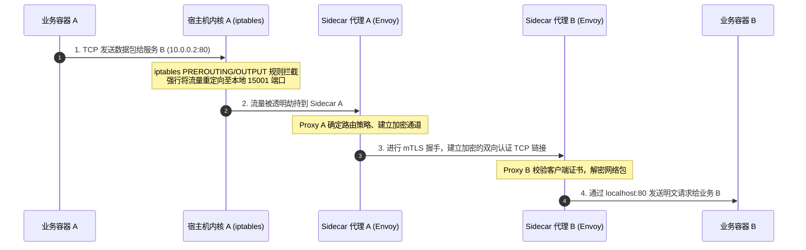
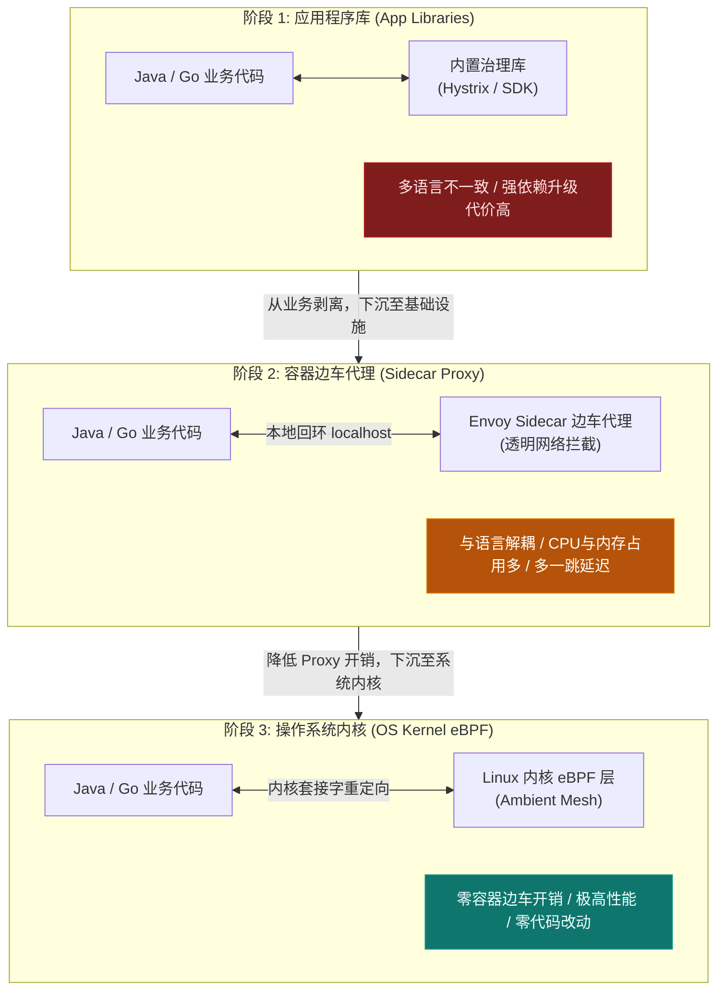

import GlossaryTerm from '@site/src/components/GlossaryTerm';
import GuidedExercise from '@site/src/components/GuidedExercise';
import ResearchNote from '@site/src/components/ResearchNote';
import ChapterMeta from '@site/src/components/ChapterMeta';
import PyRunner from '@site/src/components/PyRunner';
import TradeoffExplorer from '@site/src/components/TradeoffExplorer';
import QuizCard from '@site/src/components/QuizCard';

# M6L8 · 服务网格

<ChapterMeta
  time="约 2.5 小时"
  prereqs={[{label: 'M5 弹性模式', href: '../core-components/circuit-breaker'}, {label: 'M4L8 代理/装饰器', href: '../design-patterns-lld/adapter-decorator'}, {label: 'M6L7 可观测', href: './observability-advanced'}]}
  outcome="能解释服务网格用 sidecar 把流量治理（mTLS/重试/熔断/可观测/灰度）下沉到基础设施的原理，及其 data plane/control plane 结构与取舍。"
  howToUse="先看“每个服务重写一遍弹性逻辑”的痛，再理解 sidecar 模式，最后做 sidecar 流量治理 lab。"
/>

:::tip M5 的弹性逻辑，不该在每个服务、每种语言里各写一遍
[Month 5](../core-components/circuit-breaker) 你学了熔断、重试、超时、mTLS、可观测。但如果有 Java/Go/Python 几十个服务，每个都用各自的库实现一遍这些——重复、不一致、升级噩梦。服务网格的思路：**把这些"服务间通信的横切能力"从业务代码里抽出来，下沉到每个服务旁边的一个代理（sidecar）里。**
:::

## 一、弹性逻辑散落在每个服务、每种语言

[M5 的弹性组合拳](../core-components/circuit-breaker)（重试、熔断、超时、隔离）+ 服务间 mTLS 加密 + [可观测埋点（M6L7）](./observability-advanced)，如果靠每个服务自己用库实现：
- **重复**：几十个服务各写一遍同样的逻辑。
- **不一致**：Java 用 Resilience4j、Go 用另一个库、Python 又一个，行为/配置各不同。
- **升级噩梦**：要统一改个重试策略或加 mTLS，得改几十个服务、重新发布。
- **多语言税**：每多一种语言就要再实现一套。

这些都是"服务间通信"的横切关注点——能不能像 [M4L8 装饰器/代理](../design-patterns-lld/adapter-decorator) 那样，统一包一层、与业务解耦？

## 二、三个核心概念（分层）

### 基础：sidecar 模式

<GlossaryTerm term="Sidecar Pattern" definition="边车模式：在每个服务实例旁部署一个伴随容器（sidecar），接管该服务的网络进出流量，处理与业务无关的横切能力（加密、重试、熔断、遥测），业务容器无感。" >sidecar（边车）模式</GlossaryTerm>：给每个服务实例旁边部署一个**代理容器**，接管它所有进出的网络流量。业务容器只管发请求，sidecar 在中间自动加上 mTLS、重试、熔断、超时、遥测——业务代码**一行不用改**，也不管用什么语言。这就是 [M4L8 代理模式](../design-patterns-lld/adapter-decorator) 在基础设施层的体现：透明地包一层。

#### iptables 网络重定向与 Sidecar 双向 mTLS 加密时序



### 进阶：data plane 与 control plane

<GlossaryTerm term="Service Mesh" definition="服务网格：管理服务间通信的专用基础设施层。由一组 sidecar 代理（数据面，处理实际流量）和一个控制面（下发路由/安全/策略配置）组成，把流量治理从业务代码中剥离。" >服务网格（service mesh）</GlossaryTerm>由两部分组成（[呼应 M6L2 的二分](./kubernetes-basics)）：
- <GlossaryTerm term="Mesh Data Plane" definition="网格数据面：所有 sidecar 代理的集合，真正处理服务间的每一个请求（加密、路由、重试、熔断、采集遥测）。" >数据面（data plane）</GlossaryTerm>：所有 sidecar 代理，真正处理每一个服务间请求。
- <GlossaryTerm term="Mesh Control Plane" definition="网格控制面：集中管理和下发配置（路由规则、安全策略、流量切分）给所有 sidecar 的组件。你改一处策略，它推给全网格。" >控制面（control plane）</GlossaryTerm>：集中下发配置（路由规则、mTLS 策略、灰度比例）给所有 sidecar。你在控制面改一处，全网格生效。

#### API 网关与服务网格南北/东西向控制拓扑

```mermaid
graph TD
    subgraph Control_Plane["控制面 (Control Plane - Istiod)"]
        CP_Config["策略/配置规则 (YAML)"]
        CP_CA["CA 证书管理 (证书轮换)"]
        CP_Config -->|分发路由与安全配置 (xDS API)| SidecarA
        CP_Config -->|分发路由与安全配置 (xDS API)| SidecarB
        CP_CA -->|分发 mTLS 证书密钥| SidecarA
        CP_CA -->|分发 mTLS 证书密钥| SidecarB
    end

    subgraph Data_Plane["数据面 (Data Plane - 东西向流量治理)"]
        subgraph Pod_A["Pod A (服务 A)"]
            AppA["业务容器 A<br>(Application A)"]
            SidecarA["边车代理 A<br>(Envoy Sidecar)"]
        end
        
        subgraph Pod_B["Pod B (服务 B)"]
            AppB["业务容器 B<br>(Application B)"]
            SidecarB["边车代理 B<br>(Envoy Sidecar)"]
        end
    end

    Ingress["API 网关 (Ingress Gateway - 南北向入口)"] -->|1. 外部流量路由| SidecarA
    AppA -->|2. 发送普通 HTTP 请求| SidecarA
    SidecarA -->|3. 加密双向认证 (mTLS)| SidecarB
    SidecarB -->|4. 解密后转发普通 HTTP 请求| AppB

    style Control_Plane fill:#1e293b,stroke:#475569,stroke-width:1px,color:#fee2e2
    style SidecarA fill:#0f766e,stroke:#0d9488,stroke-width:2px,color:#f0fdfa
    style SidecarB fill:#0f766e,stroke:#0d9488,stroke-width:2px,color:#f0fdfa
    style AppA fill:#0284c7,stroke:#0284c7,stroke-width:1px,color:#fff
    style AppB fill:#0284c7,stroke:#0284c7,stroke-width:1px,color:#fff
```

### 深入（选学）：网格能力、代价与取舍

网格统一提供：
- <GlossaryTerm term="mTLS" definition="双向 TLS：服务间通信双方都用证书互相验证身份并加密。服务网格可自动为所有服务间流量启用 mTLS，实现“零信任”网络而无需改业务代码。" >自动 mTLS</GlossaryTerm>（零信任网络，服务间全加密、互验身份）、统一的重试/熔断/超时、**流量切分**（金丝雀 [M6L4](./autoscaling-rollout) 按比例路由）、统一遥测（自动生成服务间 [RED 指标和链路 M6L7](./observability-advanced)）。
- **代价**：每个 Pod 多一个 sidecar = 额外的 CPU/内存和**每跳多一点延迟**（请求要过两次代理）；整个网格的运维复杂度高；调试多了一层。
- **取舍**：服务少时，网格的复杂度可能盖过收益——直接用库（[M5 的方式](../core-components/circuit-breaker)）更简单。服务多、多语言、需要统一安全/治理时，网格才划算。新趋势如**无 sidecar 网格（ambient mesh）**试图降低 sidecar 的开销。
- 与网关的关系：[API 网关（M5L2）](../core-components/api-gateway) 管<GlossaryTerm term="North-South Traffic" definition="南北向流量：在云原生架构中，指从集群外部（如客户端、App 端、浏览器端）通过边缘网关、负载均衡器流向集群内部服务的流量。主要解决边缘路由、限流认证、SSL 卸载等南北向通信问题。">南北向（外部进来的流量）</GlossaryTerm>，服务网格管<GlossaryTerm term="East-West Traffic" definition="东西向流量：在微服务与容器网络中，指运行在集群内部不同微服务实例、容器 Pod 之间相互调用的网络通信流量。主要关注服务发现、动态负载均衡、安全加密 mTLS、熔断重试等东西向治理。">东西向（内部服务之间的流量）</GlossaryTerm>。

<ResearchNote
  title="服务网格：把服务间通信的横切能力下沉到基础设施"
  source="Istio / Linkerd / Envoy 文档；William Morgan — The Service Mesh；CNCF Service Mesh 实践"
  href="https://istio.io/latest/about/service-mesh/"
  insight="服务网格用 sidecar 代理（数据面）+ 控制面，把 mTLS、重试、熔断、超时、流量切分、遥测从各语言业务代码中剥离，做到统一、透明、可集中配置。代价是额外的资源开销、每跳延迟和运维复杂度，因此小规模未必划算；ambient/无 sidecar 模式在尝试降低开销。"
  application="多语言、多服务、需要统一安全（mTLS）和流量治理时考虑服务网格。它管东西向流量、网关管南北向。评估 sidecar 的延迟/资源开销与运维成本，规模不够时直接用库更简单。"
/>

## 三、跟我做一遍：sidecar 透明治理

<PyRunner
  rows={34}
  expect="sidecar 透明加治理"
  code={`# 业务服务：只管业务逻辑，完全不知道 mTLS/重试/遥测的存在
class BusinessService:
    def __init__(self): self.calls = 0
    def handle(self, req):
        self.calls += 1
        if self.calls < 2 and req.get("trigger_fail"):
            raise RuntimeError("瞬时故障")
        return "业务结果: " + req["path"]

# sidecar：在业务前后透明地加横切能力（mTLS/重试/遥测）—— 代理模式
class Sidecar:
    def __init__(self, app, max_retries=2):
        self.app = app; self.max_retries = max_retries; self.metrics = {"requests": 0, "retries": 0}
    def handle(self, req):
        self.metrics["requests"] += 1
        req = dict(req); req["mtls_verified"] = True        # 自动 mTLS（业务无感）
        last = None
        for attempt in range(self.max_retries + 1):
            try:
                return self.app.handle(req)                 # 委托给业务
            except Exception as e:
                last = e
                self.metrics["retries"] += 1                # 自动重试 + 采集遥测
        raise last

app = BusinessService()
mesh = Sidecar(app)
# 业务代码没有任何重试/mTLS 逻辑，sidecar 全包了
print(mesh.handle({"path": "/order", "trigger_fail": True}))  # 第一次失败 -> sidecar 重试 -> 成功
print("遥测:", mesh.metrics)                                   # sidecar 自动采集
print("业务被调用次数:", app.calls)
print("sidecar 透明加治理")`}
/>

业务服务里没有一行重试/mTLS/遥测代码，全由 sidecar 透明地加上——换种语言重写业务，这些治理能力照样自动生效。**试试**:给 sidecar 加一个熔断（[M5L6](../core-components/circuit-breaker)）逻辑，体会"弹性能力下沉到 sidecar、所有服务统一获得"。

## 四、动手 Lab（必做）

打开 `labs/month06/m6l8_sidecar/`：

```bash
python labs/month06/m6l8_sidecar/test_sidecar.py
```

实现一个 sidecar 代理：透明地为业务服务加上重试 + 遥测采集（业务代码无感），并支持加权流量切分。

<GuidedExercise
  title="练习指引：实现 sidecar 治理代理"
  goal="把“横切能力下沉到 sidecar、业务无感”做成代码——这是服务网格数据面的核心。"
  hints={[
    'Sidecar 持有业务 app，handle 时在调用前后加横切能力（代理模式）。',
    '重试：捕获异常重试若干次，并采集遥测（请求数/重试数）。',
    '业务服务本身不含任何重试/遥测逻辑。',
    '（选做）流量切分：按权重把请求路由到 v1/v2 两个后端（金丝雀）。'
  ]}
  steps={[
    '实现 BusinessService（纯业务，无横切逻辑）。',
    '实现 Sidecar(app)：透明加重试 + 采集 metrics。',
    '（选做）实现按权重的流量切分到多个版本。',
    '写测试：瞬时失败被 sidecar 重试成功、遥测被采集、业务代码无横切逻辑、流量按权重分配。'
  ]}
  checks={[
    '你能解释 sidecar 怎么让横切能力与业务/语言解耦。',
    '你的 sidecar 透明加治理、业务无感。',
    '你能区分网格的 data plane 和 control plane。',
    '你能说出网格的代价、以及它和网关的分工（东西/南北向）。'
  ]}
/>

## 架构师深潜（Staff+ 视角）

### 1. 弹性/治理能力放在哪一层

<TradeoffExplorer
  title="服务间治理能力的落点"
  dimensions={['多语言一致', '统一升级/配置', '性能开销', '运维复杂度', '小规模适用']}
  options={[
    {
      name: '业务代码内嵌库(M5 方式)',
      scores: [1, 1, 5, 5, 5],
      note: '每服务用库实现。无额外延迟，但多语言重复、难统一升级。',
      whenToUse: '服务少、技术栈统一、规模不大时——最简单。'
    },
    {
      name: '服务网格(sidecar)',
      scores: [5, 5, 2, 2, 1],
      note: '统一、透明、多语言一致、可集中配置。但有 sidecar 开销和运维复杂度。',
      whenToUse: '服务多、多语言、需统一安全/治理时。'
    },
    {
      name: '无 sidecar 网格(ambient)',
      scores: [5, 5, 3, 3, 2],
      note: '保留网格能力、降低 per-pod sidecar 开销。较新、生态在成熟中。',
      whenToUse: '想要网格能力但在意 sidecar 开销时。'
    }
  ]}
/>

### 2. 服务网格是"横切关注点下沉"的极致

回看这条主线：[M4L8 装饰器/中间件](../design-patterns-lld/adapter-decorator)（进程内横切）→ [M5L2 API 网关](../core-components/api-gateway)（入口横切）→ 服务网格（服务间横切下沉到基础设施）。**同一个思想——把"人人都要、与业务无关"的能力抽出来统一处理——在不断往下沉：从代码里的装饰器，到网关，到每个服务旁的 sidecar，最后到内核（<GlossaryTerm term="eBPF" definition="eBPF (Extended Berkeley Packet Filter)：Linux 内核的一项革命性技术。它允许在 Linux 内核沙盒中安全、动态地运行沙盒程序，无需修改内核源码或加载内核模块。在服务网格中（如 Ambient Mesh），eBPF 可在内核套接字层直接重定向数据包，彻底免去 Sidecar 代理在用户态与内核态之间频繁上下文切换的性能损耗。">eBPF</GlossaryTerm>）。** 架构师要判断：在你的规模 and 复杂度下，这个能力该落在哪一层最划算。不是越下沉越好——下沉换来一致性，但也带来开销和复杂度。

#### 流量治理与横切关注点下沉演进关系



### 3. 真实案例：网格解决"微服务治理"的规模痛点

当一家公司的服务从几十涨到几百、技术栈从单一变成多语言，"每个服务自己搞定 mTLS/重试/可观测"就崩了——配置漂移、安全漏洞、升级瘫痪。Istio/Linkerd 这类网格正是为这个规模痛点而生：安全团队在控制面统一开启 mTLS（零信任），SRE 统一配重试/熔断策略，平台统一拿到所有服务间的黄金指标和拓扑。但很多团队也踩过"过早上网格"的坑——服务才十几个就上 Istio，运维复杂度盖过收益。**判断时机，是架构师的关键决策。**

### 4. 架构师深问（给自己 30 分钟）

- 你的服务数量、语言种类到了需要网格的程度吗？还是用库（M5 方式）更简单？分水岭在哪？
- 网格每跳加的延迟和每 Pod 的 sidecar 资源开销，你的系统能接受吗？怎么评估？
- mTLS（零信任）对你的安全要求有多重要？不用网格，你怎么统一服务间加密和身份？

## 自检清单

- [ ] 我能解释 sidecar 怎么让治理能力与业务/语言解耦。
- [ ] 我的 lab sidecar 透明加重试/遥测、业务无感。
- [ ] 我能区分网格的 data plane 和 control plane。
- [ ] 我能判断何时该上网格、何时用库更合适。

## 常见误解

- **"既然我们已经上网格治理东西向流量，那么微服务架构中就不再需要部署边缘 API 网关了，二者能力重合且服务网格能全包"**：这是对通信边界划分的严重混淆。API 网关与服务网格处于不同的控制平面，分工明确：**API 网关负责“南北向流量”**（客户端到集群的入口），主要处理外部协议适配、流量计费、单端限流、OAuth2 外部安全认证、SSL/TLS 卸载以及防 DDoC 恶意攻击；而**服务网格则接管“东西向流量”**（集群内部服务到服务的互调），侧重于内部零信任双向认证（mTLS）、灰度放量路由、分布式链路追踪关联。网关无法细粒度穿透到内部每个 Pod，网格也不适合直接暴露到公网处理外网连接。
- **"上了服务网格，依靠 Envoy 的高性能反向代理，我们系统的网络性能和并发处理速度会得到整体提升"**：恰恰相反。服务网格是用**性能与资源成本去换取业务研发效率与多语言一致的治理能力**。网络流量从原先的“App A ──(网络)──> App B”变成了“App A ──> Sidecar A ──(网络/mTLS)──> Sidecar B ──> App B”。每次请求都多出了两次完整的用户态与内核态套接字拷贝，以及数据包的序列化与反序列化，必然会给每次调用增加 1ms 到数毫秒的**每跳附加延迟**，并且每个 Pod 中运行的 Envoy 容器都会消耗 50MB - 1GB 不等的 CPU 和内存。小规模集群上网格会导致得不偿失的性能倒退。
- **"Sidecar 边车代理之所以能够自动完成重试、熔断和 RED 指标收集，是因为它在 K8s 中可以直接读取并监控业务应用容器的代码内存状态"**：这是对容器网络边界的根本性认知偏差。Sidecar 代理在逻辑上是**与业务完全隔离的独立用户态进程**，它绝不可能也没有权限去读取业务进程的内存空间。它是通过修改 Pod 所在 Network Namespace 中的 Linux 内核 **iptables 规则**，强行把进出业务容器网络接口的 TCP/UDP 网络套接字流量“劫持”重定向给 Sidecar 监听的端口。它治理由且仅由网络数据包的内容（L4 字节流或 L7 HTTP 协议内容）决定，对业务内部的代码执行状态完全透明。

## 常见误解自测

<QuizCard
  questions={[
    {
      q: '在 Kubernetes 环境中运行的服务网格（如 Istio），Sidecar 边车代理（Envoy）究竟是如何在业务代码“不改动一行、不知道代理存在”的前提下，做到透明拦截进出网络流量的？',
      options: [
        'Sidecar 代理利用操作系统的调试接口（ptrace）实时劫持并注入业务进程的内存，修改其 socket 系统调用。',
        '在 Pod 初始化阶段，通过 initContainer 执行特权命令，修改 Pod 内部 Network Namespace 的 Linux 内核 iptables 规则。所有进出该 Pod 的 TCP 流量都会被内核拦截并强制重定向到 Sidecar 代理所监听的本地端口（如 15001/15006），实现数据包在套接字层的透明转接。',
        '业务服务代码必须在编译期引入 Envoy SDK，显式把网络发送函数替换为 Envoy 专用的通信协议。'
      ],
      answer: 1,
      explain: '服务网格数据面透明劫持的底层技术是 iptables 规则链配置。在 Pod 启动前，K8s 调度 initContainer 注入一系列封包转发规则，使内核在处理 TCP 发送和接收时自动重定向到 sidecar 的端口。业务程序因此可以像平时一样读写常规的 TCP/HTTP 连接，无需引入任何特殊的网格专用 SDK。'
    },
    {
      q: '随着微服务架构的演进，系统开发中的“横切关注点（mTLS、熔断、可观测遥测等）”呈现出不断“下沉”的技术趋势。关于下沉到不同层级的取舍，以下哪项叙述是正确的？',
      options: [
        '横切关注点应当尽可能保留在业务代码库中，这样可以获得最高的可复制性与多语言支持。',
        '下沉到 Sidecar 容器中是一劳永逸的最佳方案，不需要任何物理和网络开销。',
        '横切关注点从代码层（Java/Go SDK）下沉到基础设施容器层（Envoy Sidecar）解决了多语言配置的一致性，但带来了每跳网络延迟和 per-pod 的内存资源消耗。最新的趋势是进一步下沉到 Linux 操作系统内核层（利用 eBPF 技术，如 Ambient Mesh），实现零 per-pod Sidecar 代理的高性能无侵入治理。'
      ],
      answer: 2,
      explain: '“横切关注点下沉”的演进脉络。从软件设计模式的 Decorator（代码内横切）到 Sidecar（容器基础设施层横切），再到最新的内核层 eBPF 技术（网络内核层横切）。下沉的深度越深，业务代码的纯粹度和语言一致性就越高，但需要在延迟、CPU开销与技术成熟度（运维成本）之间进行折中。'
    },
    {
      q: '在现代云原生架构设计中，API 网关（API Gateway）与服务网格（Service Mesh）分别扮演什么角色？应该如何协调分工？',
      options: [
        'API 网关与服务网格分别处理南北向（外部入口）流量与东西向（内部互调）流量。API 网关工作在集群边界，主要处理安全组、限流计费、SSL 卸载以及多端路由适配；服务网格工作在集群内部服务之间，依靠 sidecar 进行双向 mTLS 加密、微服务熔断恢复及精细的灰度流量切分。二者各司其职，相辅相成。',
        '服务网格可以完全取代 API 网关，只需要直接把网格的 Ingress Gateway 暴露给所有终端用户，不需要任何 API 网关功能。',
        'API 网关既管外部流量，也可以直接替代服务网格在集群内部对每一个 Pod 间进行 mTLS 证书的分发与加密拦截。'
      ],
      answer: 0,
      explain: 'API网关（管南北向）与服务网格（管东西向）是分工协作关系。如果把内部网格复杂的动态路由策略和 mTLS 身份校验直接暴露给公网，会极度增加系统边缘的攻击面并降低响应速度；反之，在内部成百上千个微服务 Pod 间如果全部通过庞大的 API 网关进行中转调用，会造成网关的性能吞吐瓶颈。'
    }
  ]}
/>

## 延伸阅读

- [Istio: What is a Service Mesh?](https://istio.io/latest/about/service-mesh/)
- [The Service Mesh (William Morgan / Linkerd)](https://linkerd.io/what-is-a-service-mesh/)
- [下一课：多云与混合云](./multi-cloud)