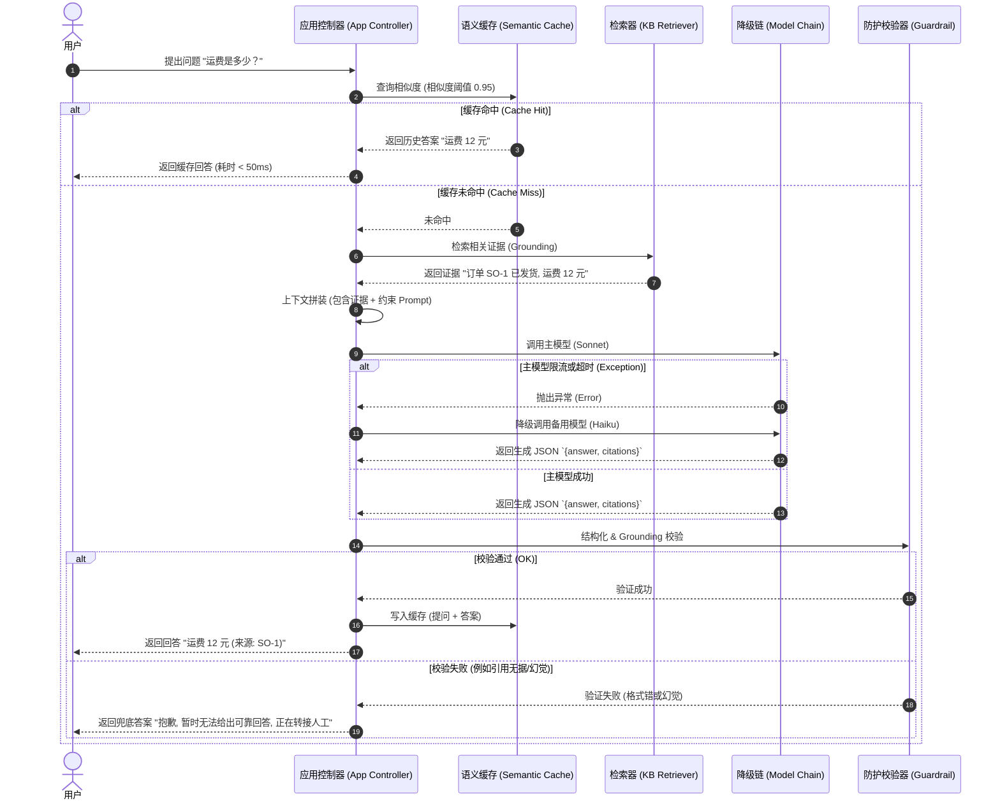
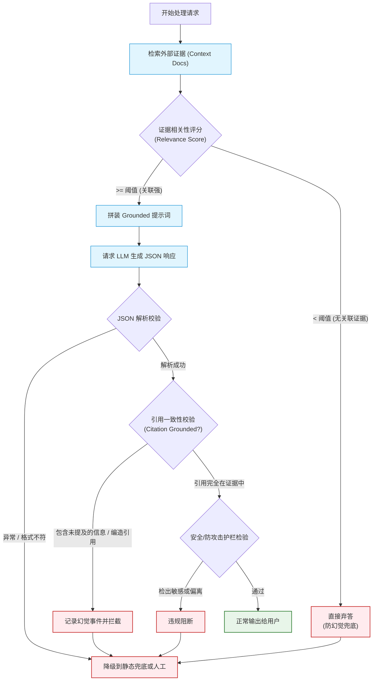

import GlossaryTerm from '@site/src/components/GlossaryTerm';
import GuidedExercise from '@site/src/components/GuidedExercise';
import ResearchNote from '@site/src/components/ResearchNote';
import ChapterMeta from '@site/src/components/ChapterMeta';
import PyRunner from '@site/src/components/PyRunner';
import TradeoffExplorer from '@site/src/components/TradeoffExplorer';
import StepFlow from '@site/src/components/StepFlow';
import QuizCard from '@site/src/components/QuizCard';

# M7L12 · Capstone：构建一个 LLM 应用

<ChapterMeta
  time="约 3.5 小时"
  prereqs={[{label: 'Month 7 全部', href: './overview'}]}
  outcome="能把本月所有 LLM 工程组装成一个端到端可靠的 LLM 功能（即构建一条高内聚的 <GlossaryTerm term='Reliability Pipeline' definition='可靠性管道：通过检索证据、设定模板、限制随机性、执行结构化校验、多级降级等一系列确定性工程手段包裹不确定的语言模型，从而产出高可用、低幻觉、可监控服务的整体架构。'>可靠性管道 Reliability Pipeline</GlossaryTerm>）：上下文拼装 → 结构化调用（缓存+降级）→ 校验防护 → 评测 → 成本追踪，并讲清每一环。"
  howToUse="把它当一道完整 LLM 功能设计题：拿一个真实需求，串起本月的全部组件，并用 lab 把核心管道跑通。"
/>

:::tip 月末综合题：把一个会幻觉、又贵又慢的模型，包成一个生产级可靠功能
本月你逐个学了 token、采样、提示、成本、工具、上下文、幻觉防护、评测、缓存降级。现在把它们**组装**成一个端到端的 LLM 功能管道。这正是 AI Architect 的核心活：**不是让模型更强，而是用工程把不可靠的模型包成可靠的产品功能。**
:::

## 一、需求：一个“基于知识库的客服问答”功能

做一个客服 AI：用户问问题，系统基于公司知识库给出**有据、准确、可控成本**的回答。要求：
- 回答必须**基于知识库**（通过 <GlossaryTerm term="Grounding" definition="检索接地 (Grounding)：在提问模型前，先通过检索获取确凿的本地知识或外部事实作为上下文，强制模型以此为限制进行回答，是根治幻觉的核心工程手段。">检索接地 Grounding</GlossaryTerm>）、并引用来源。
- 成本和延迟可控（高频调用，建议引入 <GlossaryTerm term="Semantic Cache" definition="语义缓存：利用向量相似度（Embedding Matching）匹配当前问题与历史请求，当提问的语义极其接近时直接返回历史答案，从而省去大模型调用、控制延迟 and Token 成本。">语义缓存 Semantic Cache</GlossaryTerm> 过滤高频请求）。
- 模型/API 故障时服务整体不挂（设计高可用 <GlossaryTerm term="Model Fallback Chain" definition="模型降级链：高可用架构设计，当主模型因限流、网络超时或服务异常不可用时，流式引擎自动按顺序尝试调用性能稍弱但更稳定/廉价的备选模型，直至静态安全回复。">模型降级链 Fallback Chain</GlossaryTerm> 进行兜底）。
- 改 prompt/换模型有评测兜底，防止线上质量退化。

这把本月所有内容都用上了。

## 二、组装端到端管道

为了把不可靠的大模型包装成符合企业生产级要求的服务，我们需要构建一条由多个确定性步骤组成的 <GlossaryTerm term="Reliability Pipeline" definition="可靠性管道：通过检索证据、设定模板、限制随机性、执行结构化校验、多级降级等一系列确定性工程手段包裹不确定的语言模型，从而产出高可用、低幻觉、可监控服务的整体架构。">可靠性管道 (Reliability Pipeline)</GlossaryTerm>。

### 基础：输入到输出的主管道

一次问答的完整流程（每一步对应本月一课）：
1. **上下文拼装（[M7L8/L2](./context-memory)）**：检索知识库相关片段以进行 <GlossaryTerm term="Grounding" definition="检索接地 (Grounding)：在提问模型前，先通过检索获取确凿的本地知识或外部事实作为上下文，强制模型以此为限制进行回答，是根治幻觉的核心工程手段。">检索接地 (Grounding)</GlossaryTerm>（为 [Month 8 RAG](../rag/overview) 铺路）+ 历史 + 问题，在 [token 预算](./tokenization-context)内组装。
2. **构造 prompt（[M7L4](./prompting-basics)）**：system 定角色（“只根据资料答，无据说不知道”）+ 要求进行 <GlossaryTerm term="Output Schema Validation" definition="输出模式校验：使用 JSON Schema 或强类型库校验模型返回的文本，确保其符合标准的 JSON 格式及约定的字段类型，防止下游系统解析出错。">输出模式校验 (Output Schema Validation)</GlossaryTerm>（[M7L6](./structured-output-tools)）（定义 `{answer, citations}` 的 JSON Schema）。
3. **调用模型（[M7L5/L3](./llm-api-cost-latency)）**：选合适档位、低温采样以确保生成确定性、设置 API 超时与重试。

### 进阶：可靠性与成本层

4. **缓存 + 降级（[M7L11](./llm-caching-resilience)）**：先查 <GlossaryTerm term="Semantic Cache" definition="语义缓存：利用向量相似度（Embedding Matching）匹配当前问题与历史请求，当提问的语义极其接近时直接返回历史答案，从而省去大模型调用、控制延迟和 Token 成本。">语义缓存 (Semantic Cache)</GlossaryTerm>；未匹配到则流转至下层，并启用可配置的 [模型降级链](./llm-caching-resilience)（主→备→兜底）以抵御 API 熔断与网络波动。
5. **校验 + 防护（[M7L9/L6](./hallucination-guardrails)）**：严格进行 schema 格式校验、幻觉防护（核对 citation 是否在检索出的原文中）、输入输出有害内容过滤，若校验失败且无法自愈则安全弃答转人工。
6. **成本追踪（[M7L5/L11](./llm-api-cost-latency)）**：记录每一轮的 prompt & completion tokens 消耗并累加成本，防范账户额度超限。

### 深入（选学）：评测、观测与持续演进

7. **评测（[M7L10](./llm-evaluation)）**：构建本地 Golden Set 并设置回归指标，将评测融入 [CI/CD 自动化流水线（M6L6）](../cloud-enterprise-industrial/cicd-pipelines)，防范 prompt 调整引发质量倒退。
8. **观测（[M6L7](../cloud-enterprise-industrial/observability-advanced)）**：监控服务的平均延迟、流量成本分布、幻觉率、缓存命中率及降级触发频率。
9. **整体是一个“可靠性管道”**：没有任何单点假设模型完美，这正是 [M7L9 “把不可靠组件用可靠”](./hallucination-guardrails) 的总实践。

---

### 三、管道架构深度图解 (Deep Dive Diagrams)

#### 1. 架构拓扑：端到端可靠 LLM 问答系统 (Topology)

```mermaid
graph TD
    classDef client fill:#e1f5fe,stroke:#0288d1,stroke-width:1.5px;
    classDef gate fill:#ffebee,stroke:#c62828,stroke-width:1px;
    classDef cache fill:#e8f5e9,stroke:#2e7d32,stroke-width:1px;
    classDef model fill:#fff9c4,stroke:#fbc02d,stroke-width:1px;
    classDef database fill:#eceff1,stroke:#607d8b,stroke-width:1px;

    User["用户提问 (Question)"]:::client --> CacheCheck{"1. 语义缓存检索 <br/>(Semantic Cache)"}:::cache
    
    CacheCheck -- 匹配成功 (Hit) --> ReturnCache["直接返回缓存答案"]:::client
    CacheCheck -- 匹配失败 (Miss) --> RetrieveKB["2. 知识库检索 <br/>(Grounding Retrieval)"]:::database
    
    KB[("企业本地知识库 <br/>(Knowledge Base)")] -.-> RetrieveKB
    
    RetrieveKB --> GroundingCheck{"是否有相关证据?"}
    GroundingCheck -- 否 (No Grounding) --> RefuseAnswer["3. 弃答 / 安全转人工"]:::gate
    GroundingCheck -- 是 (Has Grounding) --> PromptAssemble["4. 上下文拼装 <br/>(Prompt Construction)"]
    
    PromptAssemble --> ModelCall["5. 模型降级调用链 <br/>(Model Fallback Chain)"]:::model
    
    subgraph Fallback Chain [模型降级链]
        ModelCall --> MainModel["主模型 (例如 Claude 3.5 Sonnet)"]:::model
        MainModel -- 异常 / 限流 --> BackupModel["备用模型 (例如 Claude 3.5 Haiku)"]:::model
        BackupModel -- 异常 / 限流 --> RuleFallback["本地规则兜底 (Static Fallback)"]:::gate
    end
    
    MainModel --> ValidateOutput["6. 校验与防护 <br/>(Schema & Grounding Guard)"]:::gate
    BackupModel --> ValidateOutput
    
    ValidateOutput -- 校验通过 --> SuccessReturn["输出可信答案"]:::client
    ValidateOutput -- 校验失败 (格式/幻觉) --> RefuseAnswer
    
    SuccessReturn -.-> CacheUpdate["更新语义缓存"]:::cache
    
    subgraph 监控与治理 (Observability)
        CostTracker["Token 成本追踪 (Cost Monitor)"]
        EvalSystem["评测与回归 (CI/CD Eval)"]
    end
    
    PromptAssemble -.-> CostTracker
    SuccessReturn -.-> EvalSystem
```

#### 2. 交互时序：缓存未命中与降级生命周期 (Sequence)



#### 3. 自适应决策：幻觉控制与置信度过滤 (Decision Flow)



---

### 四、落地实践：客服问答管道执行步骤

为了直观地展示在真实的生产级“财务助手/客服 AI”中各步骤的运行机制，请跟随以下交互式步骤图景进行推演：

<StepFlow
  steps={[
    {
      title: '1. 语义缓存匹配 (Semantic Cache Check)',
      desc: '应用收到用户提问（如“运费是多少”）。计算提问的向量特征并在语义缓存中匹配。若命中历史相似度 > 0.95 的问题，则立即返回缓存，彻底免除模型调用开销。',
      diagram: '用户问题 ──> 相似度计算 ──> 命中缓存则直接返回 (延迟 < 50ms)'
    },
    {
      title: '2. 检索接地过滤 (Grounding Search)',
      desc: '缓存未命中时，提取核心词并在企业知识库中检索关联的条款证据。若未检索到任何证据，判定无法接地回答，不再调用大模型，直接弃答以杜绝事实幻觉。',
      diagram: '知识检索 ──> 发现无证据 ──> 直接拦截并安全弃答 (防胡说八道)'
    },
    {
      title: '3. 上下文模板拼装 (Context Construction)',
      desc: '如果证据存在，将检索到的片段、对话历史以及当前问题，填入系统提示词中。明确要求“模型只能依据所给资料作答”，并指定按强 Schema 约束输出。',
      diagram: '证据片段 + 约束 System Prompt + 问题 ──> Token 裁剪 ──> 提示词'
    },
    {
      title: '4. 并发调用与降级链熔断 (Fallback Invocation)',
      desc: '请求模型时配置降级路由。主模型限流或超时异常时，自动秒级无缝降级到廉价备选模型或本地过滤逻辑，实现整体服务的“高可用性”。',
      diagram: '调用主模型 ──> [429/超时异常] ──> 自动秒级降级至备用模型'
    },
    {
      title: '5. 输出模式与引用双重校验 (Validation & Gating)',
      desc: '校验返回数据是否符合 JSON 规范。进一步校验模型输出中的 Citation 引用标识是否真实包含于第二步检索出的证据原文中，拦截格式错和强行伪造引用的幻觉。',
      diagram: '模型返回 ──> JSON 强校验 ──> 引用真实性核对 ──> 最终安全输出'
    }
  ]}
/>

---

<ResearchNote
  title="生产级 LLM 应用 = 模型 + 一整套工程管道"
  source="LLM 应用工程综合实践；RAG（Lewis et al., 2020）；Google SRE / DORA（可靠性与交付）"
  href="https://docs.anthropic.com/en/docs/build-with-claude/define-success"
  insight="可靠的 LLM 功能不是“调一次模型”，而是一条管道：检索 grounding + 上下文拼装 + 结构化提示 + 合档调用 + 缓存降级 + 校验护栏 + 成本追踪 + 评测回归 + 观测。模型只是其中一环，可靠性来自包裹它的工程，与传统系统工程一脉相承。"
  application="设计任何 LLM 功能：画出从输入到输出的完整管道，在每一环放对应组件（grounding/拼装/提示/调用/缓存/降级/校验/成本/评测/观测）。先定成功标准和评测，再迭代。把模型当一个会出错、要被工程包裹的组件。"
/>

## 五、跟我做一遍：可靠 LLM 问答管道

<PyRunner
  rows={40}
  expect="管道跑通：有据回答或安全弃答"
  code={`def retrieve(q_words, kb):                  # 1) grounding：检索知识库（Month 8 细讲）
    return [d for d in kb if any(w in d for w in q_words)]

def build_prompt(q_words, evidence):        # 2) 结构化提示
    return "只根据资料答,无据说不知道。资料:%s 问题:%s" % (evidence, q_words)

cache = {}
def cached_call(prompt, model_chain):       # 3-4) 缓存 + 模型降级链
    if prompt in cache:
        return ("CACHE", cache[prompt])
    for name, fn in model_chain:
        try:
            ans = fn(prompt); cache[prompt] = ans; return (name, ans)
        except Exception:
            continue
    return ("FALLBACK", {"answer": "暂时无法回答,请转人工", "citations": []})

def validate_and_guard(resp, evidence):     # 5) 校验 + grounding 护栏
    if not isinstance(resp.get("answer"), str):
        return (False, "格式错")
    for c in resp.get("citations", []):
        if c not in evidence:               # 引用必须真实存在于证据
            return (False, "引用无据")
    return (True, "ok")

def answer(q_words, kb, model_chain, cost):  # 主管道
    ev = retrieve(q_words, kb)
    if not ev:                               # 无证据 -> 弃答(不幻觉)
        return {"answer": "知识库无相关信息,请转人工", "grounded": False}
    name, resp = cached_call(build_prompt(q_words, ev), model_chain)
    cost["tokens"] += len(build_prompt(q_words, ev))   # 6) 成本追踪(简化)
    ok, reason = validate_and_guard(resp, ev)
    if not ok:
        return {"answer": "无法给出可靠回答(%s),转人工" % reason, "grounded": False}
    return {"answer": resp["answer"], "via": name, "grounded": True}

kb = ["订单 SO-1 已发货,运费 12 元", "退货需 7 天内申请"]
def good_model(p): return {"answer": "运费 12 元", "citations": ["订单 SO-1 已发货,运费 12 元"]}
def bad_model(p): raise RuntimeError("限流")
cost = {"tokens": 0}

print(answer(["运费"], kb, [("opus", bad_model), ("sonnet", good_model)], cost))  # 主挂->备->有据
print(answer(["天气"], kb, [("opus", good_model)], cost))    # 无证据 -> 安全弃答
print("累计 token:", cost["tokens"])
print("管道跑通：有据回答或安全弃答")`}
/>

主模型限流自动退备用；有证据才答、引用必须真实存在、无证据安全弃答（不幻觉）；全程追踪成本——一条把不确定层层收口的可靠管道。**试试**：让两个模型都挂，看走到 FALLBACK 兜底；构造一个模型返回"引用无据"的响应，看校验拦下它转人工。

## 六、动手 Lab（必做）

打开 `labs/month07/m7l12_llm_app/`：

```bash
python labs/month07/m7l12_llm_app/test_llm_app.py
```

把本月组件组装成可靠问答管道：检索 grounding → 缓存/降级调用 → schema+grounding 校验 → 无据弃答 → 成本追踪。

<GuidedExercise
  title="练习指引：组装可靠 LLM 应用管道"
  goal="把本月全部组件串成一个端到端 LLM 功能，体会“可靠性来自包裹模型的工程”。"
  hints={[
    'retrieve 无结果 -> 直接弃答（不调模型、不幻觉）。',
    'cached_call：命中缓存跳过；否则降级链；全失败兜底。',
    'validate_and_guard：格式校验 + 引用必须在证据里。',
    '每次调用累加 token/成本。'
  ]}
  steps={[
    '实现 retrieve / build_prompt / cached_call / validate_and_guard / answer。',
    '无证据弃答、主模型失败降级、引用无据拦截转人工。',
    '追踪累计 token/成本。',
    '写测试：有据回答、主挂降级、无证据弃答、引用无据被拦、缓存命中、成本累加。'
  ]}
  checks={[
    '你能画出一个 LLM 功能从输入到输出的完整可靠性管道。',
    '你的 lab 有据才答、故障降级、无据弃答、成本可追踪。',
    '你能说出每一环收口了哪种不确定/风险。',
    '你理解 AI 可靠性来自工程包裹，而非模型完美。'
  ]}
/>

## 架构师深潜（Staff+ 视角）

### 1. LLM 应用的成熟度

<TradeoffExplorer
  title="LLM 应用工程成熟度"
  dimensions={['可靠性', '成本可控', '可演进(评测)', '抗故障', '建设成本']}
  options={[
    {
      name: '裸调模型',
      scores: [1, 1, 1, 1, 5],
      note: '直接调 API 把输出返给用户。能做 demo，但会幻觉、贵、脆、无法安全迭代。',
      whenToUse: '原型验证想法。'
    },
    {
      name: '加 grounding + 校验 + 缓存',
      scores: [4, 4, 2, 3, 3],
      note: '基于证据答、校验输出、缓存省钱。可靠性和成本大幅改善。',
      whenToUse: '多数生产 LLM 功能的基线。'
    },
    {
      name: '全管道(含降级+评测+观测)',
      scores: [5, 5, 5, 5, 1],
      note: '降级链保可用、评测防退化、观测兜底。生产级，能安全快速迭代。建设成本高。',
      whenToUse: '关键/高频/高风险的生产 AI 功能。'
    }
  ]}
/>

### 2. 这条管道就是 AI 架构的"通用骨架"

记住本月这条管道——它适用于几乎所有 LLM 功能，也是后面几个月的基础：**[RAG（Month 8）](../rag/overview)** 是把"检索 grounding"那一环做深；**[Agent（Month 9）](../agent-architectures/overview)** 是把"调用"那一环变成"循环 + 工具调用 + 记忆"；**[Multi-Agent（Month 10）](../multi-agent-protocols/overview)** 是多个这样的管道协作；**[AI 平台治理（Month 11）](../production-ai-platform/overview)** 是把"评测 + 观测 + 防护"做成平台级能力。所以这个 Capstone 不只是月末作业，是你整个 AI 架构阶段的"主干"——后面都是在这条管道上加深、扩展。

### 3. 真实案例：从 demo 到生产的鸿沟

无数 AI 项目"demo 惊艳、上线翻车"，鸿沟就在本月这条管道：demo 裸调模型看着不错，一上生产就暴露幻觉（没 grounding/校验）、成本爆炸（没缓存/路由/上限）、一限流就全挂（没降级）、改个 prompt 就退化（没评测）、出问题查不到（没观测）。能跨过这道鸿沟的团队，靠的不是更强的模型，而是这套**把模型工程化**的能力。这就是为什么本课说：AI Architect 的核心价值，是"把不可靠的模型包成可靠的产品"——这是模型能力之外、真正稀缺的工程功夫。

### 4. 架构师深问（给自己 30 分钟）

- 给你负责的一个 LLM 功能，画出它从输入到输出的完整管道。哪一环现在是缺的（grounding？校验？降级？评测？观测？）？
- 它的"成功标准"是什么？有评测集衡量吗？改动靠什么保证不退化？
- 最坏情况：模型幻觉 + 限流 + 成本激增同时发生，你的功能会怎样？每一种你都有兜底吗？

## 七、自检清单

- [ ] 我能画出一个 LLM 功能从输入到输出的完整可靠性管道。
- [ ] 我的 lab 有据才答、故障降级、无据弃答、成本可追踪。
- [ ] 我能说出每一环收口了哪种不确定/风险。
- [ ] 我理解这条管道是 RAG/Agent/平台的共同骨架。

## 八、章末自测

为了检验你对本章 LLM 管道设计、可靠性策略与高可用演进核心理念的掌握情况，请完成以下自测题目：

<QuizCard
  questions={[
    {
      q: '在一个端到端的高并发客服 AI 系统中，为了在保障回答的“真实无幻觉”前提下实现延迟和成本的最优，以下哪项处理顺序最为合理？',
      options: [
        'A. 用户提问 ──> 调用大模型 ──> 检索知识库证据 ──> 输出格式校验 ──> 幻觉拦截',
        'B. 用户提问 ──> 语义缓存检索 ──> 匹配失败则进行知识库证据检索 ──> 若无相关证据则直接弃答/转人工 ──> 拼装上下文调用大模型 ──> 对模型输出进行格式与引用校验',
        'C. 用户提问 ──> 拼装上下文调用大模型 ──> 语义缓存检索 ──> 从模型输出中抽取关键词去检索知识库校验',
        'D. 用户提问 ──> 进行知识库检索 ──> 调用主模型 ──> 格式校验 ──> 主模型失败直接报错提示用户重试'
      ],
      answer: 1,
      explain: '这是典型的可靠性管道。为了省钱和低延迟，应该先查语义缓存（命中则直接返回）。未命中时，先做检索，如果没有相关证据，此时调模型必发生幻觉，因此应当直接弃答，这能避免不必要的 LLM 费用与幻觉风险。有了证据后，拼装上下文调模型，最后还要校验输出格式和引用的 grounding。选项 B 是最优且最严密的顺序。'
    },
    {
      q: '当模型降级链（Model Fallback Chain）在主模型出现 HTTP 429 限流或超时（Timeout）时被触发，我们需要确保备用模型返回的输出与主模型一致。在系统架构层面，我们主要依靠什么技术手段来保证这种格式一致性？',
      options: [
        'A. 依靠对备用模型设置更高的 Temperature 参数，使其自由生成',
        'B. 依靠在提示词中多写几遍“请输出 JSON 格式”',
        'C. 依靠强约束的结构化输出配置（如 JSON Schema / Tool Definition）并结合输出模式校验器进行校验',
        'D. 依靠大模型本身的智能性，假设它们在任何情况下都会输出相同的 JSON 结构'
      ],
      answer: 2,
      explain: '仅在提示词中宣称格式并不完全可靠。生产级的降级链设计中，主模型和备用模型都应配置相同的结构化 schema（例如 JSON Mode 或 Function Calling 定义），并通过应用层进行输出模式校验（Output Schema Validation）。若备用模型返回的格式损坏，校验器会拦截并进入本地规则或人工兜底，以此防止下游系统解析崩溃。'
    },
    {
      q: '在客服 AI 系统的置信度控制中，“有据才答（Grounded Answer）”的底层逻辑是什么？',
      options: [
        'A. 模型本身具有完备的道德感，遇到不知道的知识会自动拒绝回答',
        'B. 模型的回答完全限制在检索回来的上下文片段中，且回答的每一条陈述都可以追溯到原文中具体引用的来源（Citations），若无相关来源则拒绝回答',
        'C. 通过在外部使用搜索引擎去校验大模型生成的每一句话',
        'D. 强制将模型的 Temperature 设为 1.0 以生成更有创造力的文字'
      ],
      answer: 1,
      explain: 'Grounded Answer（接地回答）意味着所有生成陈述都必须以检索到的上下文证据为事实基础。系统通过强约束 Prompt 和在应用层校验 Citation（核对生成的引用标识是否在证据集合中），来确保模型输出字字有据。若检索无果或模型编造了证据以外的事实，系统直接拦截或拒绝回答。这是工程上消除大模型幻觉最核心、最有效的策略。'
    }
  ]}
/>

## 九、常见误解

- **“LLM 应用 = 直接调用大模型并返回”**：这是玩具 demo 的做法；生产级的商业 AI 功能需要精心设计一条包含 Grounding 检索、语义缓存、降级策略、多级校验与监控观测的确定性工程管道。
- **“模型越强、智能度越高，系统就越不需要防御和校验”**：哪怕是最先进的模型也有极大的事实幻觉风险与偶发限流（429）。系统的可靠性来自于围绕大模型建立的“防御纵深”管道，而非模型本身的完美度。
- **“这只是个简单的月末总结作业”**：本章展示的端到端管道实则是所有高级 AI 系统设计的“骨架”——Month 8 的 RAG 重点是做深检索环节；Month 9 的 Agent 重点是把调用模型扩展为循环智能体；Month 11 的平台治理是对这套管道的全面工程化。
- **“语义缓存只需判断文本字面是否完全相等”**：字面完全相等的缓存命中率极低。必须使用向量数据库计算相似度，支持近义词和多语言语义相似度匹配（如阈值 0.95），才能在保证不答非所问的前提下最大化缓存价值。

## 十、延伸阅读

- [Anthropic: Define your success criteria](https://docs.anthropic.com/en/docs/build-with-claude/define-success)
- [Month 7 总览](./overview)
- [进入 Month 8：RAG 与知识系统](../rag/overview)
