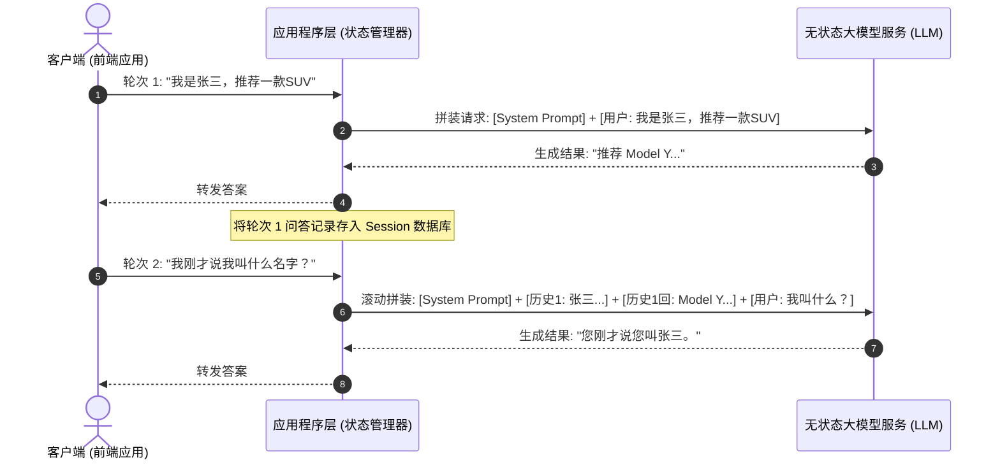
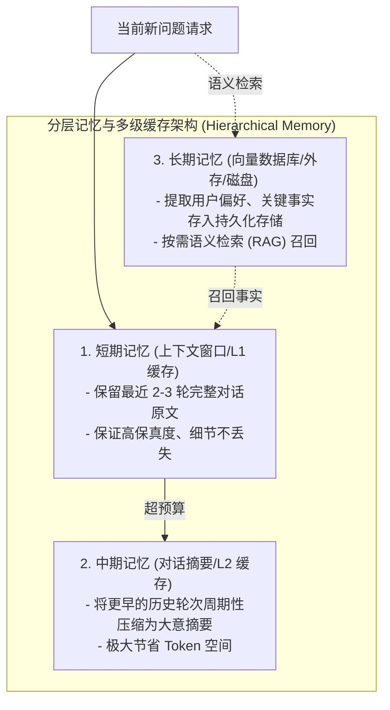
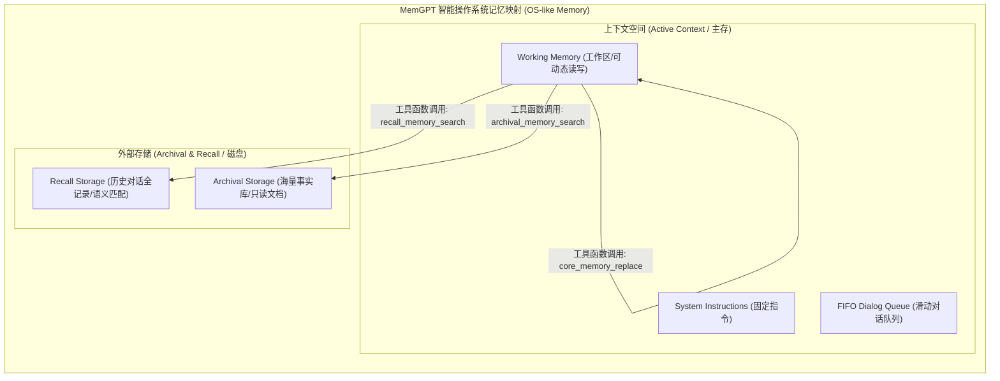

import GlossaryTerm from '@site/src/components/GlossaryTerm';
import GuidedExercise from '@site/src/components/GuidedExercise';
import ResearchNote from '@site/src/components/ResearchNote';
import ChapterMeta from '@site/src/components/ChapterMeta';
import PyRunner from '@site/src/components/PyRunner';
import TradeoffExplorer from '@site/src/components/TradeoffExplorer';
import StepFlow from '@site/src/components/StepFlow';
import QuizCard from '@site/src/components/QuizCard';

# M7L8 · 上下文管理与记忆

<ChapterMeta
  time="约 2.5 小时"
  prereqs={[{label: 'M7L2 上下文窗口', href: './tokenization-context'}, {label: 'M5L4 缓存/淘汰', href: '../core-components/reverse-proxy-cdn'}, {label: 'M3L5 缓存模式', href: '../data-cache-queue/cache-patterns'}]}
  outcome="能为多轮对话/长任务设计上下文管理：在 token 预算内拼装相关上下文，用截断/摘要/记忆策略让模型“记住”关键信息。"
  howToUse="先看“LLM 其实没有记忆”，再学上下文拼装和记忆策略，最后做带摘要淘汰的对话记忆 lab。"
/>

:::tip LLM 是“无状态”的——它的全部“记忆”，就是你这次塞进上下文窗口的东西
一个反直觉的事实：[LLM 本身没有记忆（M7L1）](./transformer-autoregression)，它不记得上一句你说了什么。多轮对话之所以“连贯”，是因为**每次调用你都把之前的对话历史重新塞进上下文窗口**。这意味着“记忆”是你的系统要负责管理的工程问题——而[窗口有限（M7L2）](./tokenization-context)，所以要在“记住什么”和“预算多少”之间精心取舍。
:::

## 一、“它怎么不记得我刚说的”

新手常困惑：明明上一轮告诉过模型我的名字，这一轮它怎么不知道了？因为你这一轮的调用里没把上一轮的内容带上——**模型是<GlossaryTerm term="Stateless" definition="无状态 (Stateless)：大模型推理服务不在服务器端保留任何关于客户端历史会话的信息，每次推理都是纯函数式的、仅依赖于单次请求中携带的全部输入。">无状态</GlossaryTerm>的，每次调用都是独立的、只看你这次给的上下文**。所以多轮对话的“记忆”完全靠你的系统：每次把历史对话拼进 prompt。但对话一长，历史就超出[上下文窗口](./tokenization-context)、又贵又慢——这就需要上下文管理。



## 二、三个核心概念（分层）

### 基础：上下文是每次“现拼”的

每次调用，你要在 token 预算内拼装这次需要的全部上下文（[M7L2](./tokenization-context)）：system prompt + 相关历史 + 检索资料（[RAG，Month 8](../rag/overview)）+ 当前问题 + 输出预留。<GlossaryTerm term="Context Assembly" definition="上下文拼装：每次 LLM 调用前，按 token 预算把所需信息（系统提示、历史、检索内容、当前输入）组装成一个上下文。因为模型无状态，每次都要现拼。">上下文拼装</GlossaryTerm>是每个 LLM 应用每次调用都在做的事。关键认知：**“记忆”不是模型的属性，是你拼装上下文的策略。**

### 进阶：对话历史的管理——截断与摘要

对话一长，历史塞不下，几种策略：
- **<GlossaryTerm term="Sliding Window" definition="滑动窗口 (Sliding Window)：一种对话记忆管理策略。仅保留最新的 N 轮对话作为上下文，将更早的历史直接丢弃，计算开销恒定，但会丢失更早的所有细节。">滑动窗口</GlossaryTerm>截断**：只保留最近 N 轮，丢掉更早的。简单，但会忘掉早期重要信息。
- <GlossaryTerm term="Conversation Summarization" definition="对话摘要：把较早的对话历史用模型压缩成一段简短摘要，替代原始长文本保留在上下文里，既省 token 又保住大意。代价是丢细节、且摘要本身要额外调用。">对话摘要</GlossaryTerm>：把较早的历史**压缩成摘要**，保留主旨、省 token。代价是丢细节、且摘要要额外一次模型调用。
- **混合**：最近几轮保留原文（细节重要）+ 更早的摘要成一段（保大意）——这是常见实践，类似 [M5L4 缓存的多级/淘汰](../core-components/reverse-proxy-cdn) 思想。



### 深入（选学）：长期记忆与记忆架构

短期（一次对话）之外，还有跨会话的长期记忆：
- <GlossaryTerm term="Long-term Memory" definition="长期记忆：把跨会话需要记住的信息（用户偏好、关键事实）存到外部存储（数据库/向量库），需要时检索回来拼进上下文，而非塞满每次对话。">长期记忆</GlossaryTerm>：用户偏好、历史关键事实等，存到外部（数据库 / [向量库，Month 8](../rag/overview)），**需要时检索回来**拼进上下文——而不是把所有历史都塞进窗口。这本质就是 RAG 用在“记忆”上。
- **记忆的取舍**：记什么、记多久、何时检索、何时遗忘——和 [缓存淘汰策略（M5L4/M3L5）](../data-cache-queue/cache-patterns) 是同一类问题（容量有限下的取舍）。
- **结构化记忆 vs 原文**：有些记忆适合存成结构化字段（用户名、偏好语言），有些存原文片段。结构化的更可靠、可校验。
- **记忆是 [Agent（Month 9）](../agent-architectures/overview) 的关键组件**：长任务的 Agent 要记住目标、已做的步骤、中间结果——否则会在循环里“忘了自己在干嘛”。
- **别过度**：不是所有应用都需要复杂记忆。很多场景滑动窗口 + 必要时检索就够了（[YAGNI](../design-patterns-lld/change-driven-design)）；上来就搞复杂记忆架构是过度设计。



<ResearchNote
  title="上下文管理：在有限窗口里组织“模型该看到什么”"
  source="LLM 应用工程实践（对话摘要、记忆）；MemGPT（Packer et al., 2023，分层记忆）；RAG（Lewis et al., 2020）"
  href="https://arxiv.org/abs/2310.08560"
  insight="LLM 无状态，多轮连贯靠每次重新拼装上下文。窗口有限，需用滑动窗口、摘要压缩管理历史；跨会话长期记忆则存外部、按需检索（RAG 的延伸）。MemGPT 等探索了类操作系统的分层记忆（主存=上下文、外存=检索）。核心是“在有限窗口里决定该看到什么”的取舍。"
  application="多轮应用要主动管理上下文：最近原文 + 更早摘要 + 必要时检索长期记忆，都在 token 预算内拼装。把记忆当“容量有限下的取舍”（类缓存淘汰）来设计。结构化记忆更可靠。按需求选择复杂度，别过早上复杂记忆架构。"
/>

## 三、跟我做一遍：带摘要淘汰的对话记忆

为了让大家更直观地体验多轮对话在预算受限时，系统如何进行“短期-中期-长期”分层记忆更新与摘要淘汰，下面是一个交互式步骤演示：

<StepFlow
  steps={[
    {
      title: '步骤 1: 评估新输入与 Token 占用',
      desc: '用户发送新提问：“请推荐适合我预算的车型”（占用 20 Tokens）。系统拦截请求并启动记忆拼装。'
    },
    {
      title: '步骤 2: 检索长期记忆 (Recall)',
      desc: '系统从数据库中语义召回该用户的长期偏好偏好：“用户预算约 30 万元，偏好纯电 SUV”（占用 50 Tokens）。'
    },
    {
      title: '步骤 3: 检查短期历史并判断预算溢出',
      desc: '当前滑动窗口内包含最近 2 轮完整问答历史（共计 220 Tokens）。加上系统预留与当前提问，总预测 Token 达到 290，已超设定的 250 预算线。'
    },
    {
      title: '步骤 4: 触发中期记忆压缩 (Summarize) 与淘汰',
      desc: '为了腾出空间，系统将最早的第一轮对话原文丢弃，并调用大模型提取其关键信息：“用户正在对比 Tesla Model Y 和蔚来 ES6”（仅占 15 Tokens）。'
    },
    {
      title: '步骤 5: 上下文拼装组装与最终请求',
      desc: '组装符合预算的安全 Context：[System Prompt] + [中期摘要: 对比Model Y和ES6...] + [长期偏好: 预算30万纯电...] + [最近一轮对话原文] + [用户新提问]。总计 210 Tokens，未超预算，完美作答！'
    }
  ]}
/>

<PyRunner
  rows={36}
  expect="超预算时摘要旧对话"
  code={`def est_tokens(text):  # 粗略估算（M7L2）
    cn = sum(1 for c in text if ord(c) > 0x4e00)
    return int(cn / 1.5 + (len(text) - cn) / 4) + 1

def summarize(turns):  # 模拟“摘要”：把多轮压成一句（真实是调一次模型）
    return "【摘要】之前聊了：" + "；".join(t["text"][:6] for t in turns)

class ConversationMemory:
    def __init__(self, budget, keep_recent=2):
        self.budget = budget; self.keep_recent = keep_recent
        self.summary = ""; self.turns = []
    def add(self, role, text):
        self.turns.append({"role": role, "text": text})
        self._compact()
    def _compact(self):
        # 超预算时：把“较早的轮次”摘要掉，只保留最近 keep_recent 轮原文
        while self._tokens() > self.budget and len(self.turns) > self.keep_recent:
            old = self.turns[:len(self.turns) - self.keep_recent]
            base = [{"text": self.summary}] if self.summary else []
            self.summary = summarize(base + old)
            self.turns = self.turns[len(self.turns) - self.keep_recent:]
    def _tokens(self):
        return est_tokens(self.summary) + sum(est_tokens(t["text"]) for t in self.turns)
    def context(self):
        parts = ([self.summary] if self.summary else []) + [t["text"] for t in self.turns]
        return "\\n".join(parts)

mem = ConversationMemory(budget=40, keep_recent=2)
for i in range(6):
    mem.add("user", "这是第%d轮比较长的对话内容用来撑爆预算啊啊啊" % i)
print("摘要:", mem.summary[:40], "...")
print("保留最近原文轮数:", len(mem.turns))
print("当前 token:", mem._tokens(), "(预算 40)")
print("超预算时摘要旧对话")`}
/>

预算撑爆时，较早的对话被摘要压缩、只保留最近几轮原文——既不超预算，又保住了"之前聊过什么"的大意。**试试**：把 `keep_recent` 调大，看保留更多原文但更容易超预算；把 `budget` 调大到能装下全部，看摘要不触发。

## 四、动手 Lab（必做）

打开 `labs/month07/m7l8_memory/`：

```bash
python labs/month07/m7l8_memory/test_memory.py
```

实现带摘要淘汰的对话记忆：超预算时摘要较早轮次、保留最近 N 轮原文、始终不超预算。

<GuidedExercise
  title="练习指引：实现对话记忆管理"
  goal="把“最近原文 + 更早摘要 + token 预算”做成代码——多轮 LLM 应用的记忆核心。"
  hints={[
    'add 后调用 compact：只要超预算且原文轮数 > keep_recent，就把较早的摘要掉。',
    '摘要要把“已有摘要 + 被淘汰的轮次”一起压（避免丢掉更早的摘要）。',
    '保留最近 keep_recent 轮原文（细节重要）。',
    'context() 返回 摘要 + 最近原文 的拼装。'
  ]}
  steps={[
    '实现 est_tokens 和 summarize（模拟）。',
    '实现 ConversationMemory：add / _compact / _tokens / context。',
    '超预算时摘要较早轮、保留最近 N 轮。',
    '写测试：不超预算时不摘要、超预算触发摘要、最近 N 轮原文保留、压缩后不超预算。'
  ]}
  checks={[
    '你能解释 LLM 无状态、记忆靠上下文拼装。',
    '你的 lab 能在预算内用摘要管理长对话。',
    '你能区分短期上下文和长期记忆（外部检索）。',
    '你理解记忆是“容量有限下的取舍”，别过度设计。'
  ]}
/>

## 架构师深潜（Staff+ 视角）

### 1. 历史/记忆管理策略

<TradeoffExplorer
  title="对话历史与记忆管理"
  dimensions={['保真度', 'token 成本', '实现复杂度', '适合长对话', '适合跨会话']}
  options={[
    {
      name: '全量历史',
      scores: [5, 1, 5, 1, 1],
      note: '把所有历史塞进去。最保真，但很快超窗口、又贵又慢。',
      whenToUse: '短对话、历史很重要时。'
    },
    {
      name: '滑动窗口截断',
      scores: [2, 5, 5, 3, 1],
      note: '只留最近 N 轮。省钱简单，但忘掉早期信息。',
      whenToUse: '多数对话场景的务实默认。'
    },
    {
      name: '摘要 + 检索记忆',
      scores: [4, 4, 2, 5, 5],
      note: '<GlossaryTerm term="Hierarchical Memory" definition="分层记忆 (Hierarchical Memory)：受操作系统多级缓存启发，将记忆分为短期上下文（缓存）、中期摘要与长期向量库（外存），以在有限的窗口预算内取得信息保真度的最大化。">分层记忆</GlossaryTerm>（近期原文+早期摘要+外部长期记忆检索）。保真省钱可扩展，但实现复杂。',
      whenToUse: '长对话/长任务/需跨会话记忆时（Agent）。'
    }
  ]}
/>

### 2. "记忆"是 LLM 系统的状态管理问题

回到 [L5 <GlossaryTerm term="Stateless" definition="无状态 (Stateless)：大模型推理服务不在服务器端保留任何关于客户端历史会话的信息，每次推理都是纯函数式的、仅依赖于单次请求中携带的全部输入。">无状态</GlossaryTerm>服务](../foundations/state-and-storage)：LLM 调用本身是无状态的，状态（对话历史、长期记忆）必须**外移到你的系统**来管理——存数据库/向量库、按需拼装。这和传统 Web 应用把会话状态外移到 Redis 是同构的。架构师要把"记忆"当成一个明确的状态管理 + 容量取舍问题（[呼应缓存淘汰 M3L5/M5L4](../data-cache-queue/cache-patterns)）：存哪里、怎么检索、何时压缩/遗忘、token 预算怎么分。把它和"模型的智能"分开——记忆做得好坏，是工程问题，不是模型问题。

### 3. 真实案例：上下文管理决定长对话/长任务的成败

两类常见问题：(1) **对话越长越笨/越贵**——没做上下文管理，要么塞爆窗口（贵、慢、迷失在中间）、要么粗暴截断（忘了关键信息）。(2) **Agent 长任务跑偏**——没有好的记忆，Agent 在多步循环里忘了目标、重复已做的事、丢失中间结果。成熟做法是**分层**：当前任务/最近对话放上下文（短期），关键事实/用户偏好/任务进度存外部按需检索（长期）。这套"上下文工程"正在成为 LLM 应用的核心竞争力之一——同样的模型，上下文管理好的应用体验和成本都好得多。

### 4. 架构师深问（给自己 30 分钟）

- 你的多轮应用现在怎么管历史？全量塞、截断还是摘要？对话长了会怎样（变贵/变笨/忘事）？
- 哪些信息需要跨会话记住（用户偏好、关键事实）？存哪里、怎么检索回来？
- 你的记忆方案会不会过度设计？现阶段滑动窗口 + 必要检索是不是就够了？

## 自检清单

- [ ] 我能解释 LLM 无状态、记忆靠每次上下文拼装。
- [ ] 我的 lab 能在 token 预算内用摘要管理长对话。
- [ ] 我能区分短期上下文和长期记忆（外部检索）。
- [ ] 我把记忆当状态管理 + 容量取舍问题，按需选复杂度。

## 常见误解

- **"模型会记得之前的对话"**：模型无状态，连贯靠你每次重新拼装历史进上下文。
- **"窗口够大就把全部历史塞进去"**：贵、慢、迷失在中间；要截断/摘要/检索。
- **"记忆是模型能力"**：它是你的系统的状态管理和容量取舍工程问题。
- **"随着大模型上下文窗口（Context Window）扩大到 100 万到 200 万 Token（如 Gemini 1.5 Pro），我们就不再需要任何上下文历史管理，全部无脑塞进去即可"**：大错特错。虽然长上下文免去了物理截断的焦虑，但在架构上“无脑塞全量历史”极具破坏性：(1) **成本与延迟黑洞**：由于 Prefill 阶段（[M7L7](./kv-cache-serving)）的耗时与输入 Token 数量成正比，百万 Token 意味着首包延迟（TTFT）将飙升至几秒甚至十几秒，且调用成本将随着每次对话呈几何级数爆炸。(2) **“迷失在中间 (Lost in the Middle)”**：研究表明，尽管大模型窗口很大，但在大海捞针 of 超长 Prompt 中，位于中间位置的事实召回率和推理准确度会发生断崖式下跌。架构师必须将“上下文管理”视为不可动摇的工程红线，在能使用滑动窗口或分层摘要解决的场景，绝不滥用超长窗口。

## 常见误解自测

<QuizCard
  questions={[
    {
      q: '为什么在设计多轮对话系统时，架构师必须把“记忆”当作应用程序端的状态管理（State Management）问题，而不是模型自身的问题？',
      options: [
        '因为大模型的参数是在训练时固化的。每一次调用都是独立的、完全无状态（Stateless）的纯函数计算，如果不从外部 Session 数据库中取出历史消息拼装进 Prompt，模型便无法获得任何多轮对话的上下文线索。',
        '因为大模型在回答完用户的提问后，会立刻自动擦除其 GPU 显存中的参数。',
        '因为模型只有在联网状态下才能访问其本地的缓存数据库，离线状态下就失去了记忆。'
      ],
      answer: 0,
      explain: '这正是大模型“无状态（Stateless）”的核心本质。多轮对话的连贯性是一个典型的软件工程状态拼接问题，与传统 Web 服务将 Session 外移至 Redis 缓存层是完全同构的。'
    },
    {
      q: '在管理超长多轮对话上下文历史时，“滑动窗口截断”与“对话摘要（Summarization）”两种策略最核心的架构折舍（Tradeoff）是什么？',
      options: [
        '滑动窗口截断实现复杂但保真度极高；对话摘要实现极其简单但 Token 开销更大。',
        '滑动窗口截断会导致 Token 成本以平方级速度暴涨；对话摘要可以让系统永远没有任何细节丢失。',
        '滑动窗口截断实现极其简单且计算开销恒定，但会彻底丢掉早期对话的所有关键信息；对话摘要能以极低 Token 空间保住历史大意，但会丢失技术细节，且每次压缩摘要都需要额外调用一次大模型，增加了运行成本与耗时。'
      ],
      answer: 2,
      explain: '这反映了容量限制下的经典工程取舍。滑动窗口是粗暴的丢弃，而摘要是信息压缩。在工业实践中，通常会将最近 2-3 轮历史保留原文，而将更早的历史级联压缩为一小段摘要（即分层记忆设计）。'
    },
    {
      q: 'MemGPT 等新型智能 Agent 分层记忆系统，其借鉴的经典计算机系统隐喻是什么？',
      options: [
        '借鉴了关系型数据库的 ACID 强一致性事务控制。',
        '借鉴了操作系统的虚拟内存与多级缓存换入换出机制。将模型的有限上下文窗口作为“主存”，外部向量数据库或关系型数据库作为“磁盘（外存）”，由模型通过工具调用（Tool Calling）决定何时将信息从外存“读取”到主存中，或将主存的脏数据“刷盘”写入外存。',
        '借鉴了计算机网络的 TCP 滑动窗口拥塞控制算法。'
      ],
      answer: 1,
      explain: 'MemGPT 的核心创新在于打破了传统的静态 Prompt 限制。它像操作系统管理虚拟内存一样，让大模型可以通过 Tool 动态调配其有限的工作空间（Working Memory）与无限的外部事实库（Recall/Archival Memory），是高级 Agent 架构的基石。'
    }
  ]}
/>

## 延伸阅读

- [MemGPT (2023)](https://arxiv.org/abs/2310.08560)
- [下一课：幻觉、可靠性与防护](./hallucination-guardrails)
