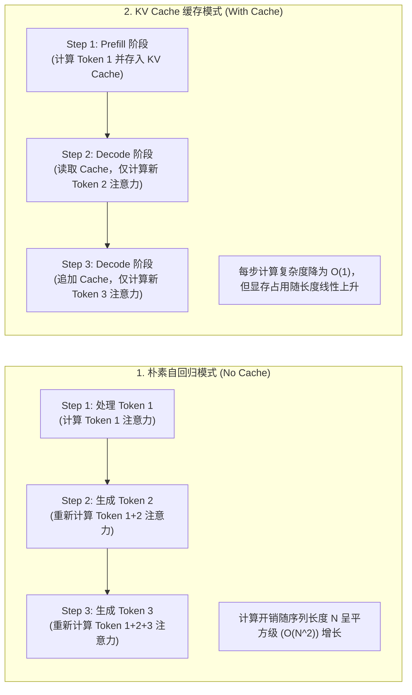
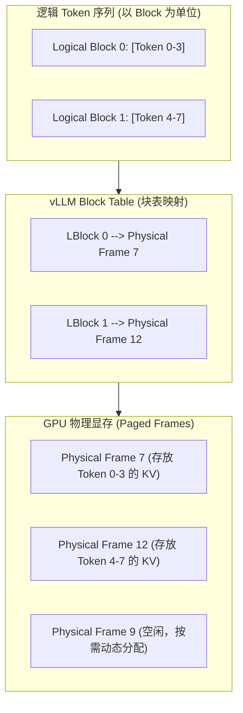

import GlossaryTerm from '@site/src/components/GlossaryTerm';
import GuidedExercise from '@site/src/components/GuidedExercise';
import ResearchNote from '@site/src/components/ResearchNote';
import ChapterMeta from '@site/src/components/ChapterMeta';
import PyRunner from '@site/src/components/PyRunner';
import TradeoffExplorer from '@site/src/components/TradeoffExplorer';
import StepFlow from '@site/src/components/StepFlow';
import QuizCard from '@site/src/components/QuizCard';

# M7L7 · KV cache 与推理服务

<ChapterMeta
  time="约 2.5 小时"
  prereqs={[{label: 'M7L1 自回归', href: './transformer-autoregression'}, {label: 'M5L1 负载均衡', href: '../core-components/load-balancing'}, {label: 'ChatGPT 架构案例', href: '../atlas/chatgpt'}]}
  outcome="能解释 KV cache 为什么是 LLM 推理的关键优化、prefill/decode 两阶段、连续批处理如何提吞吐，并理解推理服务的成本结构。"
  howToUse="先看“每生成一个字都要重算全部前文”的浪费，再理解 KV cache 和批处理，最后做前缀缓存 lab。"
/>

:::tip 自回归的“重复计算”，是 LLM 推理最大的浪费——KV cache 就是来消除它的
[M7L1](./transformer-autoregression) 说每生成一个 token 都要"看全部前文"。朴素实现下，生成第 100 个 token 时要把前 99 个 token 重新算一遍注意力——生成第 101 个再重算前 100 个……巨量重复计算。**KV cache 把前文算过的中间结果存下来复用**，让每步只算新 token。理解它（以及连续批处理），你就懂了 LLM 推理服务的成本和吞吐从哪来。
:::

## 一、朴素自回归的惊人浪费

回忆 [M7L1](./transformer-autoregression)：生成是逐 token 的，每步都要基于"目前全部 token"算注意力。朴素实现下，生成长度 N 的序列，第 k 步要处理 k 个 token 的注意力——总计算量随 N **平方级**增长，而且**前面 token 的计算被一遍遍重复**。对一个要生成几百上千 token 的回答，这是巨大的浪费。推理服务的核心优化，就是消除这种重复、并把昂贵的 GPU 喂满。



## 二、三个核心概念（分层）

### 基础：KV cache

注意力计算中，每个 token 会产生 Key 和 Value 向量。<GlossaryTerm term="KV Cache" definition="KV 缓存：在自回归生成中，把已处理 token 的 Key/Value 向量缓存起来，生成下一个 token 时直接复用，无需重新计算整个前文。把每步的计算量从“随序列长度增长”降到“只算新 token”。">KV cache</GlossaryTerm> 把已处理 token 的 K/V 向量**缓存在显存里**，生成下一个 token 时直接复用这些缓存、只计算新 token 的部分。效果：**每步计算量从"随前文长度增长"降到"只算一个新 token"**，生成速度大幅提升。代价：缓存占显存，且**显存占用随上下文长度和并发数增长**——这成了推理服务的主要资源瓶颈。

### 进阶：prefill / decode 两阶段

LLM 推理分两个阶段（[呼应 M7L5 的两段延迟](./llm-api-cost-latency)）：
- <GlossaryTerm term="Prefill" definition="预填充阶段：一次性处理整个输入 prompt，计算并填充它的 KV cache。计算密集、可高度并行，决定首 token 延迟（TTFT）。">prefill（预填充）</GlossaryTerm>：一次性处理整个输入 prompt、建好它的 KV cache。计算密集、可并行，决定 [TTFT](./llm-api-cost-latency)。
- <GlossaryTerm term="Decode" definition="解码阶段：逐 token 生成输出，每步复用 KV cache 只算一个新 token。受显存带宽限制、难并行，决定每 token时延（TPOT）。">decode（解码）</GlossaryTerm>：逐 token 生成输出，每步复用 KV cache。受<GlossaryTerm term="Memory Bandwidth" definition="显存带宽 (Memory Bandwidth)：GPU 芯片从显存中读取或写入数据的速度。在 Decode（解码）阶段，频繁读取已保存的 KV cache 使得显存带宽成为推理吞吐的最大性能瓶颈。">显存带宽</GlossaryTerm>限制、本质串行，决定 [TPOT](./llm-api-cost-latency)。
- 两阶段特性不同（prefill 算力密集、decode 带宽密集），这是推理服务调度优化的基础。

### 深入（选学）：连续批处理与前缀复用

把昂贵的 GPU 喂满、把缓存用足，是推理服务的两大杠杆：
- <GlossaryTerm term="Continuous Batching" definition="连续批处理：推理服务动态地把多个请求的生成步骤打包到一起喂给 GPU，且请求可随时加入/完成，而非等一整批同时开始结束。大幅提升 GPU 利用率和吞吐。">连续批处理（continuous batching）</GlossaryTerm>：GPU 一次能并行算很多 token，所以把多个请求的生成步骤**动态打包**一起算，且请求可随时进出（不必等一整批同步）——大幅提升 GPU 利用率 and 吞吐。这是 LLM 服务能扛高并发的关键。
- <GlossaryTerm term="Prefix Caching" definition="前缀缓存：多个请求若共享相同的前缀（如相同的 system prompt），可复用该前缀已算好的 KV cache，跳过重复的 prefill，节省算力和首 token 延迟。">前缀缓存（prefix caching）</GlossaryTerm>：很多请求共享相同前缀（如同一个长 system prompt、同一段少样本示例）——把这段前缀的 KV cache 复用，跳过重复 prefill，省算力、降 TTFT。这就是为什么"固定的 system prompt 放前面、变化的内容放后面"能更省（[呼应 M6L1 镜像分层](../cloud-enterprise-industrial/containers) 把不变的放下面同理）。

```mermaid
graph TD
    Request["新请求到达: System Prompt + 用户提问"] --> Hash["1. 计算 System Prompt 哈希值"]
    Hash --> CheckCache{"2. 检测 GPU 前缀缓存哈希表"}
    
    CheckCache -->|哈希命中 (Hit)| Hit["3. 直接复用已有 KV Cache"]
    CheckCache -->|哈希未命中 (Miss)| Miss["3. 对 System Prompt 运行完整 Prefill 计算"]
    
    Hit --> PrefillUser["4. 仅对新增的『用户提问』进行 Prefill (TTFT 暴降)"]
    Miss --> CacheNew["4. 缓存该 System Prompt 的 KV 并标记哈希"]
    
    PrefillUser --> Decode["5. 进入 Decode 阶段流式输出"]
    CacheNew --> Decode
```

- <GlossaryTerm term="PagedAttention" definition="PagedAttention：像操作系统分页管理内存那样管理 KV cache 显存，按需分配小块、减少碎片和浪费，让同样显存能服务更多并发请求（vLLM 提出）。">PagedAttention</GlossaryTerm>：像 OS 分页那样管理 KV cache 显存，减少碎片、提升并发（<GlossaryTerm term="vLLM" definition="vLLM：一款高性能开源大模型推理引擎，通过提出 PagedAttention 显存物理分页分配机制，极大地消存在显存碎片，大幅拉高了系统的并发吞吐量。">vLLM</GlossaryTerm> 提出）。



- 这些优化共同决定了推理服务的**吞吐、并发数、单 token 成本**——也解释了 [ChatGPT 架构案例](../atlas/chatgpt) 里"服务架构"那条线。作为应用架构师，你不必自己实现，但要理解它们，才能正确选型推理方案、估算成本、优化 prompt 结构。

<ResearchNote
  title="LLM 推理服务：KV cache + 连续批处理 + 显存管理"
  source="Kwon et al. (2023), Efficient Memory Management for LLM Serving (vLLM / PagedAttention)；Orca（连续批处理）"
  href="https://arxiv.org/abs/2309.06180"
  insight="KV cache 消除自回归的重复计算，但其显存占用随上下文长度和并发增长，成为瓶颈。vLLM 用 PagedAttention 像 OS 分页那样管理 KV 显存，大幅减少碎片、提升并发吞吐；连续批处理动态打包请求喂满 GPU。前缀缓存复用共享前缀的 KV。这些共同决定推理的吞吐与单 token 成本。"
  application="应用架构师不必自研推理引擎，但要理解：KV cache 让生成可行、显存是瓶颈、连续批处理提吞吐、前缀缓存让共享 system prompt 更省。据此选推理方案（自托管 vLLM vs 托管 API）、估成本、把固定前缀放前面以利前缀缓存、控制上下文长度以省显存。"
/>

## 三、跟我做一遍：KV cache 前缀复用

为了让大家更直观地体验前缀缓存（Prefix Caching）在工程实践中如何通过复用 KV Cache 来优化首包时延，下面是一个交互式步骤演示：

<StepFlow
  steps={[
    {
      title: '步骤 1: 共享前缀注入与初次 Prefill',
      desc: '系统配置了一段长达 1000 Tokens 的客服知识库作为 System Prompt。当第一个用户发起提问时，推理引擎对该 Prompt 运行完整的 Prefill 运算，并将生成的 KV Cache 存入显存，标记其哈希。'
    },
    {
      title: '步骤 2: 第二个用户提问到达',
      desc: '用户 B 提问“退货地址是什么”。该请求同样携带了前面那段 1000 Tokens 的 System Prompt，以及 20 Tokens 的新增提问。'
    },
    {
      title: '步骤 3: 前缀缓存哈希检索命中',
      desc: 'vLLM 推理网关接收到请求，对前 1000 Tokens 计算哈希值，并在显存哈希表中检索，成功命中步骤 1 缓存好的物理页面。'
    },
    {
      title: '步骤 4: 跳过重复 Prefill，直接加载缓存',
      desc: '引擎直接将 1000 Tokens 的 KV Cache 指针映射给当前请求。GPU 仅需对新增的 20 Tokens 的提问进行矩阵计算。首包延迟（TTFT）从原先的 600ms 直接缩短为 15ms。'
    },
    {
      title: '步骤 5: 自回归增量 Decode 输出',
      desc: '进入 Decode 阶段，自回归逐字生成。每步生成 1 个 Token（TPOT = 15ms）并将新生成的 KV 动态写入物理显存页，整个过程相比无缓存状态省下了巨大算力。'
    }
  ]}
/>

<PyRunner
  rows={34}
  expect="复用前缀，省下重复计算"
  code={`# 模拟：处理 token 要“算注意力”。朴素实现每步重算全部前文；KV cache 只算新 token
class NaiveModel:
    def __init__(self): self.compute = 0
    def generate(self, prompt_tokens, n_out):
        seq = list(prompt_tokens)
        for _ in range(n_out):
            self.compute += len(seq)   # 朴素：每步重算“全部前文”
            seq.append("x")
        return self.compute

class KVCachedModel:
    def __init__(self): self.compute = 0; self.cache_len = 0
    def generate(self, prompt_tokens, n_out, shared_prefix_len=0):
        # 前缀缓存：共享前缀已算过，跳过它的 prefill
        self.compute += len(prompt_tokens) - shared_prefix_len   # 只 prefill 新增部分
        for _ in range(n_out):
            self.compute += 1          # decode：每步只算 1 个新 token（复用 KV cache）
        return self.compute

prompt = ["t"] * 50   # 50 token 输入（含一段共享 system prompt）
naive = NaiveModel(); kv = KVCachedModel()
print("朴素 总计算:", naive.generate(prompt, 100))                 # 巨大（平方级）
print("KV cache 总计算:", kv.generate(prompt, 100))               # 线性，省很多
kv2 = KVCachedModel()
print("KV+前缀缓存(共享40):", kv2.generate(prompt, 100, shared_prefix_len=40))  # 再省 prefill
print("复用前缀，省下重复计算")`}
/>

朴素实现的计算量随前文平方级膨胀；KV cache 让每步只算新 token（线性）；前缀缓存再跳过共享前缀的重复 prefill。**试试**：把输出 token 数从 100 调到 500，看朴素 vs KV cache 的差距如何拉大；把 `shared_prefix_len` 调大，体会共享长 system prompt 时前缀缓存省得越多。

## 四、动手 Lab（必做）

打开 `labs/month07/m7l7_kv_cache/`：

```bash
python labs/month07/m7l7_kv_cache/test_kv_cache.py
```

模拟 KV cache 与前缀缓存的计算量：对比朴素 vs KV cache、量化前缀复用节省的 prefill。

<GuidedExercise
  title="练习指引：模拟 KV cache 计算量"
  goal="用计算量模型量化 KV cache 和前缀缓存的收益，理解 LLM 推理成本从哪来。"
  hints={[
    '朴素：每生成一步加上“当前序列长度”（重算全部前文）。',
    'KV cache：prefill 加 prompt 长度，decode 每步只加 1。',
    '前缀缓存：prefill 只算 (prompt_len - shared_prefix_len)。',
    '对比三者的总计算量，体会线性 vs 平方、前缀复用的节省。'
  ]}
  steps={[
    '实现 naive_compute(prompt_len, n_out)。',
    '实现 kv_compute(prompt_len, n_out, shared_prefix_len=0)。',
    '验证 KV cache 远小于朴素、前缀缓存进一步减少。',
    '写测试：KV < 朴素、输出越长差距越大、前缀缓存省下 prefill、shared=prompt_len 时 prefill 为 0。'
  ]}
  checks={[
    '你能解释 KV cache 为什么必要、省了什么。',
    '你的 lab 量化了 KV cache 和前缀缓存的收益。',
    '你能区分 prefill 和 decode 两阶段。',
    '你理解显存是推理瓶颈、连续批处理提吞吐。'
  ]}
/>

## 架构师深潜（Staff+ 视角）

### 1. 推理方案怎么选

<TradeoffExplorer
  title="LLM 推理部署方案"
  dimensions={['上手速度', '成本可控', '数据私有', '运维负担', '吞吐优化空间']}
  options={[
    {
      name: '托管 API(调云端模型)',
      scores: [5, 3, 2, 5, 2],
      note: '直接调用、零运维、按 token 付费。但数据外发、单价由厂商定、优化空间小。',
      whenToUse: '绝大多数应用的起点——先用托管 API 验证。'
    },
    {
      name: '自托管推理(vLLM 等)',
      scores: [2, 4, 5, 1, 5],
      note: '自己用开源模型 + 推理引擎。数据私有、高并发下成本可摊薄、可深度优化。但运维重、要 GPU。',
      whenToUse: '量大、数据敏感、要极致成本/定制时。'
    },
    {
      name: '混合(托管+自托管路由)',
      scores: [3, 5, 4, 2, 4],
      note: '简单/敏感任务走自托管小模型，难任务走托管强模型。最优成本，但复杂。',
      whenToUse: '规模化、对成本和隐私都敏感时。'
    }
  ]}
/>

### 2. 懂推理原理，才能做对应用层决策

你可能不自己跑推理引擎，但理解 KV cache / prefill-decode / 前缀缓存能让你在应用层做对决策：**把固定的 system prompt 和示例放在 prompt 最前面**（利于前缀缓存复用、省钱降 TTFT）；**控制上下文长度和并发**（显存是瓶颈）；**理解为什么输出越长越慢**（decode 串行）；**理解为什么批量/高并发场景单 token 更便宜**（连续批处理摊薄）。这些应用层的"小动作"，背后都是推理机制。这正是 [ChatGPT 案例](../atlas/chatgpt) 强调"模型架构 vs 服务架构"两条线的意义——作为架构师，服务架构这条线也要懂。

### 3. 真实案例：推理优化决定 AI 产品的毛利

LLM 推理的 GPU 成本极高，推理效率直接决定 AI 产品能不能赚钱。vLLM 等用 PagedAttention + 连续批处理把同样的 GPU 吞吐提升数倍，意味着同样成本能服务几倍的用户——这是 AI 基础设施层最激烈的竞争点。对应用架构师，启示是：**单 token 成本不是固定的，取决于推理方案和你的使用方式**。同样调用大模型，会用前缀缓存、批处理、合理上下文长度的团队，成本可能是不会用的几分之一。理解这层，你才能把 [M7L5 的成本估算](./llm-api-cost-latency) 做准、把优化做到位。

### 4. 架构师深问（给自己 30 分钟）

- 你的 prompt 结构有没有把固定前缀（system prompt、示例）放最前面以利前缀缓存？变动部分放后面了吗？
- 你的功能是托管 API 够用，还是量大到值得自托管推理（vLLM）？盈亏平衡点大概在哪？
- 为什么高并发批量场景的单 token 成本比低频零散调用低？这对你的架构（批处理 vs 实时）有什么启示？

## 自检清单

- [ ] 我能解释 KV cache 为什么必要、省了什么。
- [ ] 我能区分 prefill 和 decode 两阶段及其特性。
- [ ] 我的 lab 量化了 KV cache 和前缀缓存的收益。
- [ ] 我能据推理原理在应用层做对决策（前缀顺序、上下文长度、方案选型）。

## 常见误解

- **"模型生成每个字成本一样"**：朴素下随前文增长；KV cache 后才线性。显存随上下文/并发涨。
- **"推理就是跑一次模型"**：分 prefill（算输入）和 decode（逐 token 生成）两阶段，特性不同。
- **"单 token 成本是固定的"**：取决于推理方案、批处理、前缀缓存和你的使用方式。
- **"KV Cache 纯粹是一个底层硬件或推理引擎的运维优化，对上层应用开发者的代码或 Prompt 结构没有任何要求"**：大错特错。懂原理的架构师在应用层可以做出极具性价比的决策。例如：(1) **固化 System Prompt 和 Prompt 模板头部**：前缀缓存（Prefix Caching）是按字符和哈希进行完全前置匹配的。如果你把变动的参数（如“当前时间”、“用户提问”）放在 Prompt 最前面，而把固定的系统规则和 Sample 放在最后，那么由于头部哈希每次都变，前缀缓存将彻底失效。必须遵循“不变的放最前，变动的塞最后”的黄金法则。(2) **控制上下文膨胀**：由于 KV Cache 的空间开销与并发和长度成正比，过长的历史消息会迅速榨干 GPU 显存，导致连续批处理（Continuous Batching）能容纳的并发 QPS 呈断崖式下跌。

## 常见误解自测

<QuizCard
  questions={[
    {
      q: '为什么随着对话上下文长度的增长和大并发调用，大模型推理服务的性能瓶颈会由“算力（FLOPS）受限”转变为“显存/带宽（Memory）受限”？',
      options: [
        '因为计算注意力矩阵在任何时候都不消耗 GPU 算力。',
        '...因为在 Decode（解码）阶段，GPU 必须自回归地逐字生成。为了生成下一个字，它不需要做大量并行的矩阵乘法，但必须从显存中读取之前缓存的、随着上下文长度线性膨胀的全部 KV Cache 数据，这导致 GPU 的大部分时钟步都在等待显存读写完成。',
        '因为大模型的权重文件实在太大了，显存里塞不下，必须频繁和主板内存进行 swapping。'
      ],
      answer: 1,
      explain: '自回归 Decode 是典型的 memory-bound 任务。每一次 Token 的串行迭代都需要将庞大的 KV Cache 重新从 GPU 显存搬运到 SRAM 寄存器中，搬运速度（显存带宽）决定了生成速度。'
    },
    {
      q: 'vLLM 引擎提出的 PagedAttention 机制，核心解决了传统推理引擎在显存管理上的什么痛点？',
      options: [
        '解决了 Transformer 无法在多张 GPU 卡上进行张量并行计算的局限。',
        '解决了由于预先静态分配最大上下文显存而产生的巨大显存碎片与过度预留浪费。它像操作系统内存分页一样，将 KV Cache 拆成固定大小 of 物理页并按需映射，让同一块 GPU 能处理比原先多出数倍的并发请求。',
        '解决了 CPU 内存到 GPU 显存之间 PCIe 数据传输带宽严重不足的问题。'
      ],
      answer: 1,
      explain: 'PagedAttention 通过虚拟内存的思想，动态分配非连续的物理页面，彻底根治了静态预分配导致高达 60%-80% 显存空置碎片的顽疾，极大拉高了推理服务的并发上限。'
    },
    {
      q: '为了能最大化利用云服务商或自托管 vLLM 引擎的“前缀缓存 (Prefix Caching)”优化，架构师应该如何设计 Prompt 模板？',
      options: [
        '将经常变动的信息（如当前时间、随机 Session ID）置于 Prompt 最前部，固定不变的 System Prompt 置于尾部。',
        '在每次请求中随机打乱 Prompt 的字段排布，使大模型获得新鲜感。',
        '将绝对固定的长 System Prompt 和少样本 Few-shot 示例等内容放置在 Prompt 的最前部，并保持字符串完全一致；把用户每次不同的提问放在 Prompt 最末尾，确保前缀哈希能稳定命中。'
      ],
      answer: 2,
      explain: '前缀缓存是基于严格前缀字符串哈希匹配的。只要前缀发生一丁点字符变动，后面的缓存就全部失效。因此必须遵循“不变的在前，变动的在后”的设计规范。'
    }
  ]}
/>

## 延伸阅读

- [vLLM / PagedAttention (2023)](https://arxiv.org/abs/2309.06180)
- [ChatGPT 架构案例（服务架构线）](../atlas/chatgpt)
- [下一课：上下文管理与记忆](./context-memory)
