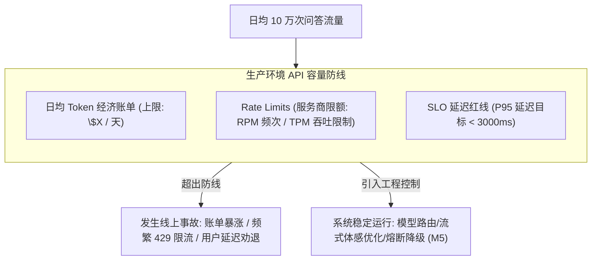
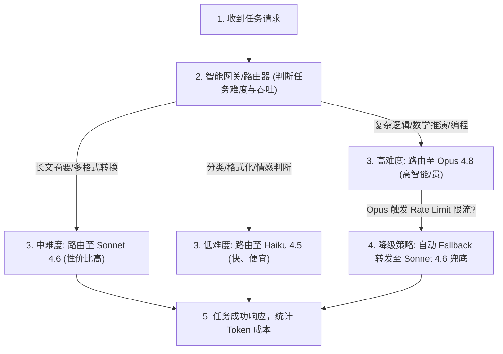

import GlossaryTerm from '@site/src/components/GlossaryTerm';
import GuidedExercise from '@site/src/components/GuidedExercise';
import ResearchNote from '@site/src/components/ResearchNote';
import ChapterMeta from '@site/src/components/ChapterMeta';
import PyRunner from '@site/src/components/PyRunner';
import TradeoffExplorer from '@site/src/components/TradeoffExplorer';
import StepFlow from '@site/src/components/StepFlow';
import QuizCard from '@site/src/components/QuizCard';

# M7L5 · LLM API、成本与延迟

<ChapterMeta
  time="约 2.5 小时"
  prereqs={[{label: 'M7L2 token', href: './tokenization-context'}, {label: 'M2L3 容量估算', href: '../system-design-bridge/capacity-estimation'}, {label: 'L15 延迟', href: '../foundations/performance-and-latency'}]}
  outcome="能估算 LLM 功能的 token 成本和延迟、区分首 token 延迟与生成延迟、用流式改善体感，并按成本/延迟/能力选对模型档位。"
  howToUse="先把 LLM 当一个有计费和延迟的云 API，再学怎么估算和优化，最后做成本/延迟估算 lab。"
/>

:::tip 把 LLM 当云 API：它有价目表、有延迟 SLA、有限额——都要算进设计
调用一次大模型不是免费、不是瞬时。它按 [token（M7L2）](./tokenization-context) 收费、延迟以秒计且波动大、还有速率限额。一个 demo 跑得通不代表能上生产——**高频调用下，token 成本和延迟会决定你的功能能不能活、赚不赚钱。** 架构师上线前必须像 [M2L3 容量估算](../system-design-bridge/capacity-estimation) 那样把这两个数算清楚。
:::

## 一、demo 能跑 ≠ 能上生产

你做了个 AI 客服 demo，效果不错。但上线前要回答：每天 10 万次问答，token 成本多少钱？高峰期延迟会不会让用户等到崩溃？供应商的速率限额够不够？用最强的模型还是便宜的？这些不算清楚就上线，可能账单爆炸、或者慢到没人用、或者被限流打挂。**LLM 是个有明确成本和延迟特性的组件，要用工程方法对待。**



## 二、三个核心概念（分层）

### 基础：token 计费模型

LLM API 几乎都<GlossaryTerm term="Token-based Pricing" definition="按 token 计费：调用成本 = 输入 token 数 × 输入单价 + 输出 token 数 × 输出单价。输出通常比输入贵（因为逐 token 串行生成）。不同模型档位单价差异很大。">按 token 计费</GlossaryTerm>：`成本 = 输入 token × 输入单价 + 输出 token × 输出单价`。两个关键点：**输出通常比输入贵**（[输出是串行生成的 M7L1](./transformer-autoregression)）；**模型档位差价很大**（强模型可能比小模型贵一个数量级）。所以单次成本 = 输入量、输出量、模型档位三者共同决定——优化任一个都能省钱。

### 进阶：延迟的两个维度与流式

LLM 延迟不是一个数，是两段：

```mermaid
gantt
    title LLM 推理延迟阶段划分与计算时间轴
    dateFormat X
    axisFormat %s
    
    section 客户端
    发送请求     :active, c1, 0, 1
    接收首 Token  :milestone, m1, 4, 0
    流式渲染输出 :active, c2, 4, 10
    
    section 推理服务器 (GPU)
    Prefill 阶段 (处理 Prompt / 并行计算) :crit, s1, 1, 4
    Decode 阶段 (串行生成后续 Token - 逐字吐出) :active, s2, 4, 10
```

- <GlossaryTerm term="Time To First Token" definition="首 token 延迟（TTFT）：从发出请求到收到第一个输出 token 的时间，主要由输入处理（prefill）决定。影响用户“开始看到响应”的体感。">首 token 延迟（TTFT）</GlossaryTerm>：从请求到吐出第一个字的时间（主要由处理输入决定）。
- <GlossaryTerm term="Time Per Output Token" definition="每输出 token 时延（TPOT）：生成阶段平均每个输出 token 的耗时。总生成时间 ≈ TTFT + 输出 token 数 × TPOT。输出越长越慢。">每 token 时延（TPOT）</GlossaryTerm>：之后每个字的间隔。**总时间 ≈ TTFT + 输出长度 × TPOT**，所以输出越长越慢。
- <GlossaryTerm term="Streaming" definition="流式输出：服务端边生成边把 token 推给客户端，让用户在首 token 后就能逐字看到响应，大幅改善体感延迟（虽然总时长不变）。">流式（streaming）</GlossaryTerm>：边生成边推送，用户在 TTFT 后就开始看到内容——**总时长不变，但体感快很多**（[呼应 M7L1 逐 token 生成](./transformer-autoregression)）。



### 深入（选学）：成本/延迟优化与模型档位选择

把 LLM 成本和延迟当系统约束来优化：
- **选对模型档位**：不是所有任务都要最强模型。简单任务（分类、抽取、格式化）用快而便宜的小模型（如 Haiku 4.5 `claude-haiku-4-5-20251001`），复杂推理用强模型（如 Opus 4.8 `claude-opus-4-8`），中间用均衡档（如 Sonnet 4.6 `claude-sonnet-4-6`）。这叫<GlossaryTerm term="Model Routing" definition="模型路由：根据任务难度把请求分发到不同档位的模型——简单任务用便宜快的小模型，难任务用强模型——在质量、成本、延迟间取平衡。">模型路由</GlossaryTerm>。



- **省 token**：精简 prompt、压缩历史、控制输出长度（让它只输出必要结果）、[缓存重复内容（M7L11）](./llm-caching-resilience)。
- **省延迟**：流式改善体感、并行调用独立子任务、缓存命中跳过调用、小模型更快。
- **批处理（batching）**：离线场景把多个请求一起处理（[呼应 M7L7 连续批处理](./kv-cache-serving)）提升<GlossaryTerm term="Throughput" definition="吞吐量 (Throughput)：指系统在单位时间内成功处理的请求数或 Token 数量，是评估 LLM 推理服务容量的关键指标。">吞吐量</GlossaryTerm>、摊薄成本。
- **限额与可靠性**：API 有速率限额，要配 [限流/退避/熔断/降级（M5）](../core-components/rate-limiting)——LLM 调用就是一个会慢、会失败、会被限流的远程依赖。

<ResearchNote
  title="LLM 推理经济学：token 成本与两段延迟"
  source="各 LLM 服务商定价与延迟文档；vLLM / 推理服务延迟分析（TTFT/TPOT）"
  href="https://docs.anthropic.com/en/docs/about-claude/models"
  insight="LLM 调用成本由输入/输出 token 数和模型档位决定，输出通常更贵。延迟分首 token（TTFT，受输入长度/prefill 影响）和每 token（TPOT，受输出长度影响）两段，总时延随输出长度线性增长。流式可改善体感但不改变总时长。"
  application="上线前估算 token 成本（按峰值 QPS × 平均输入输出 token × 单价）和延迟（TTFT + 输出×TPOT）。用模型路由把简单任务下放小模型、控制输出长度、缓存、流式、批处理来优化。把 LLM 当会限流会失败的远程依赖，配限流/退避/熔断/降级。选模型默认从最新最强档位起，按成本/延迟需求向下选。"
/>

## 三、跟我做一遍：成本与延迟估算

制造一个交互式步骤演示，展示流式输出体感时延优化：

<StepFlow
  steps={[
    {
      title: '步骤 1: 客户端发起 API 请求',
      desc: '用户在前端提交提问，携带着 System Prompt 及 RAG 检索出来的背景资料（共 1000 Tokens）。'
    },
    {
      title: '步骤 2: 服务端 Prefill 阶段并行计算',
      desc: 'GPU 一次性处理这 1000 Tokens 的输入并计算其 KV Cache。此阶段耗时 300ms，是决定首包延迟的主要因素。'
    },
    {
      title: '步骤 3: 吐出首个 Token 并触发 TTFT 渲染',
      desc: '300ms 时，服务器吐出第一个输出字符。客户端在收到该字符后，屏幕上立即渲染出首字（首字延迟 TTFT = 300ms）。用户感觉系统几乎是瞬间作答。'
    },
    {
      title: '步骤 4: 自回归 Decode 阶段逐字推送 (TPOT)',
      desc: '进入后续 Token 的串行计算。每生成 1 个 Token 耗时 15ms（TPOT）。服务器通过 Server-Sent Events (SSE) 持续将新字推向浏览器。'
    },
    {
      title: '步骤 5: 响应生成结束与总延时结算',
      desc: '模型共输出 100 个 Tokens。最终物理耗时为 300ms + (100 * 15ms) = 1800ms（1.8秒）。虽然总时间近 2 秒，但用户在 300ms 时就开始顺畅阅读，毫无卡顿感。'
    }
  ]}
/>

<PyRunner
  rows={36}
  expect="算清成本与延迟"
  code={`# 模型档位（单价为相对示意值：每 1K token 的“成本单位”，非真实报价）
TIERS = {
    "small":  {"in": 0.25, "out": 1.25, "tpot_ms": 5,  "ttft_ms": 200},   # 快而便宜
    "mid":    {"in": 3.0,  "out": 15.0, "tpot_ms": 12, "ttft_ms": 400},
    "large":  {"in": 15.0, "out": 75.0, "tpot_ms": 25, "ttft_ms": 700},   # 强但贵
}

def cost_per_call(tier, in_tokens, out_tokens):
    t = TIERS[tier]
    return (in_tokens / 1000 * t["in"]) + (out_tokens / 1000 * t["out"])

def latency_ms(tier, out_tokens):
    t = TIERS[tier]
    return t["ttft_ms"] + out_tokens * t["tpot_ms"]   # 总延迟 ≈ TTFT + 输出×TPOT

# 场景：每天 10 万次问答，平均输入 800 token、输出 200 token
calls = 100_000
for tier in ("small", "mid", "large"):
    c = cost_per_call(tier, 800, 200) * calls
    lat = latency_ms(tier, 200)
    print("%-6s 日成本单位: %8.0f   单次延迟: %5.0f ms" % (tier, c, lat))

# 优化：把输出从 200 砍到 80（只要关键结果）+ 用 small 档
opt = cost_per_call("small", 800, 80) * calls
print("优化后(small+短输出) 日成本单位:", round(opt))
print("算清成本与延迟")`}
/>

同样的量，模型档位差出几十倍成本和数倍延迟；砍输出长度 + 选小模型能再省一大截。**试试**：把输入从 800 砍到 300（精简 prompt / 少塞上下文），看成本变化；想想哪些任务真的需要 large 档、哪些用 small 就够。

## 四、动手 Lab（必做）

打开 `labs/month07/m7l5_cost_latency/`：

```bash
python labs/month07/m7l5_cost_latency/test_cost.py
```

实现成本与延迟估算 + 模型路由：按 token 和档位算成本、按输出长度算延迟、按任务难度路由到合适档位。

<GuidedExercise
  title="练习指引：实现成本/延迟估算 + 模型路由"
  goal="把“按 token×档位算成本、按输出算延迟、按难度路由模型”做成代码——上线前的必备估算。"
  hints={[
    'cost = in/1000*in_price + out/1000*out_price（输出通常更贵）。',
    'latency ≈ ttft + out_tokens * tpot。',
    '模型路由：简单任务 -> small，复杂 -> large，其余 mid。',
    '估日成本 = 单次成本 × 日调用量。'
  ]}
  steps={[
    '实现 cost_per_call(tier, in_tokens, out_tokens)。',
    '实现 latency_ms(tier, out_tokens)。',
    '实现 route(task_difficulty) 选档位。',
    '写测试：成本随 token/档位增长、输出更贵、延迟随输出增长、路由按难度选档。'
  ]}
  checks={[
    '你能估算一个 LLM 功能的日成本和单次延迟。',
    '你能区分 TTFT 和 TPOT、解释流式改善什么。',
    '你的 lab 能按难度做模型路由。',
    '你把 LLM 当会限流/失败的远程依赖来配弹性。'
  ]}
/>

## 架构师深潜（Staff+ 视角）

### 1. 成本/延迟优化手段

<TradeoffExplorer
  title="LLM 成本与延迟优化"
  dimensions={['省成本', '降延迟', '保质量', '实现复杂度', '通用性']}
  options={[
    {
      name: '模型路由(按难度选档)',
      scores: [5, 4, 4, 3, 5],
      note: '简单任务下放小模型。省钱又降延迟，但要会判断难度、可能要分级评测。',
      whenToUse: '任务难度差异大、量大时——性价比很高。'
    },
    {
      name: '精简 token(prompt/输出/上下文)',
      scores: [4, 4, 3, 2, 5],
      note: '减少输入输出 token。直接省钱降延迟，但要小心别砍掉必要信息。',
      whenToUse: '所有场景的基本功。'
    },
    {
      name: '缓存(M7L11)',
      scores: [5, 5, 4, 3, 3],
      note: '命中则跳过调用，成本延迟归零。但只对可复用/确定性输出有效。',
      whenToUse: '有重复或相似请求时。'
    }
  ]}
/>

### 2. token 经济学决定 AI 功能的商业可行性

一个传统功能的边际成本接近零；一个 LLM 功能每次调用都要花真金白银。这意味着架构师要做**单位经济学（unit economics）**计算：每次调用成本 × 调用量 vs 这个功能创造的价值。如果一个高频功能用最强模型、塞满上下文、输出长篇大论，成本可能高到商业上不成立。优化 token（路由 + 精简 + 缓存）不只是技术问题，是**让 AI 功能商业可行**的问题。这是 AI Architect 区别于"会调 API 的人"的关键判断——和 [M2L3 容量估算](../system-design-bridge/capacity-estimation)、[M6L7 成本意识] 一脉相承。

### 3. 真实案例：成本失控与延迟劝退

两个极易翻车：(1) **成本失控**——团队用最强模型 + 大上下文做一个高频功能，月账单远超预期，被迫紧急优化或下线。(2) **延迟劝退**——功能要等十几秒才出结果（输出太长 + 没流式 + 大模型），用户没耐心、流失。成熟做法是上线前就建立"成本/延迟预算"（[呼应 <GlossaryTerm term="SLO" definition="服务水平目标 (Service Level Objective, SLO)：指由服务提供者与消费者达成的、关于某些服务指标（如首 token 延迟必须小于 500ms）的目标性规范。">SLO（M6L7）</GlossaryTerm>](../cloud-enterprise-industrial/observability-advanced)）：每次调用成本上限、p95 延迟目标，并用模型路由、流式、缓存、token 精简守住它。**先算账、再上线**，是 LLM 工程的纪律。

### 4. 架构师深问（给自己 30 分钟）

- 估算你的 LLM 功能：峰值 QPS × 平均输入/输出 token × 单价 = 日/月成本是多少？商业上划算吗？
- 你的功能 p95 延迟多少？瓶颈是大模型、长输出还是没流式？怎么降到用户能接受？
- 哪些请求其实用小模型就够？做模型路由能省多少？怎么验证小模型的质量够用（M7L10 评测）？

## 自检清单

- [ ] 我能估算 LLM 功能的 token 成本和延迟。
- [ ] 我能区分 TTFT 和 TPOT、解释流式的作用。
- [ ] 我的 lab 能算成本/延迟并按难度路由模型。
- [ ] 我把 LLM 当会限流/失败的远程依赖配弹性。

## 常见误解

- **"demo 能跑就能上线"**：要先算清高频下的 token 成本、延迟和限额。
- **"延迟就是一个数"**：分 TTFT 和 TPOT；流式改善体感但不改总时长。
- **"都用最强模型最省心"**：成本可能高到不可行；按难度做模型路由。
- **"要让用户体感速度变快，唯一的做法是去堆更高规格的 GPU，把物理耗时压下去"**：大错特错。升级硬件确实能缩短 TPOT 和 TTFT，但在工程侧的优化空间同样巨大：(1) **精简输出长度**：因为自回归是串行的，总耗时随输出 Token 数量线性增长。让模型只输出核心结论，直接能将生成延迟砍掉大半。(2) **精简输入上下文**：通过精细的 RAG 检索而不是塞满整本手册，能极大地缩短 Prefill（首包）时间。(3) **缓存技术**：利用 KV Cache 前缀复用（[M7L7](./kv-cache-serving)）或语义缓存（[M7L11](./llm-caching-resilience)）可以让高频请求直接绕过推理，延迟和成本双双归零。

## 常见误解自测

<QuizCard
  questions={[
    {
      q: '在设计一个对延迟极其敏感（例如实时搜索摘要）的 AI 系统时，为什么仅仅监控“API 的总耗时”是不够的？',
      options: [
        '因为 API 定价只与 Token 数量挂钩，与耗时无关。',
        '因为总耗时是首包延迟（TTFT）与生成包长乘以每字时延（TPOT）的叠加。如果系统没有使用流式（Streaming）传输，用户就必须在后台干等完所有的 1.8 秒总耗时；而如果采用流式渲染，用户在 300ms 时就能阅读。因此架构师必须将 TTFT 与流式体验列为独立的核心监控指标（SLO）。',
        '因为首包延迟通常是由客户端本地的网络状况唯一决定的。'
      ],
      answer: 1,
      explain: '流式输出 Streaming 的核心价值就在于解耦了“物理生成时长”与“用户体感等待时间”。监控 TTFT 才能最真实地还原用户的体感反应速度。'
    },
    {
      q: '大模型的推理过程中，关于 Prefill（首包）阶段与 Decode（生成）阶段计算特性的描述，以下正确的是？',
      options: [
        'Prefill 阶段必须串行计算每个输入词，因而比 Decode 更加缓慢。',
        'Prefill 阶段由于所有输入 Token 均已知，可以在 GPU 上实现高度并行的矩阵乘法计算，属于 compute-bound；而 Decode 阶段必须利用前一次的输出作为下一次的输入，导致在时钟步上只能串行，且需要反复从显存读取 KV Cache，属于 memory-bound。',
        '两阶段在硬件底层的计算逻辑和并行度是完全一致的，无须分开关注。'
      ],
      answer: 1,
      explain: '这解释了为什么 TTFT 和 TPOT 的性能瓶颈和硬件利用率完全不同：Prefill 跑的是矩阵并行运算，GPU 利用率高；Decode 跑的是串行显存搬运，GPU 算力利用率相对极低，属于显存带宽受限。'
    },
    {
      q: '某电商平台需要上线“智能客服工单分发”功能（包含情感分类、意图识别与核心信息提取）。日均调用量高达 100 万次。为了降低运营成本并控制响应延迟，架构师应当采用何种方案？',
      options: [
        '全部直接接入最强规格模型（如 Claude Opus），确保分类万无一失。',
        '设计多级模型路由（Model Routing）方案。利用专门的评测集验证，发现小模型（如 Haiku）对分类/提取等简单任务的准确率完全合格，因此 90% 的低难度任务直接用便宜且飞快的小模型处理，仅 10% 疑难杂症分发给强模型，并在大模型限流时自动降级 fallback。',
        '不进行任何过滤，利用 prompt 要求模型自动生成 1000 字的长篇解析再做分发。'
      ],
      answer: 1,
      explain: '这是模型路由的经典实践。根据单位经济学（Unit Economics）和任务难度梯队分布，将高吞吐、低难度的任务下放到轻量小模型处理，能直接为业务节省几倍到十几倍的 API 费用，并大幅度拉低平均响应延迟。'
    }
  ]}
/>

## 延伸阅读

- [Anthropic: Models overview](https://docs.anthropic.com/en/docs/about-claude/models)
- [LLM Inference Performance (TTFT/TPOT)](https://docs.nvidia.com/nim/benchmarking/llm/latest/metrics.html)
- [下一课：结构化输出与工具调用](./structured-output-tools)
