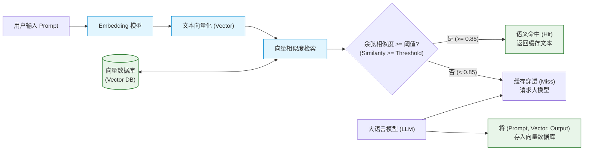
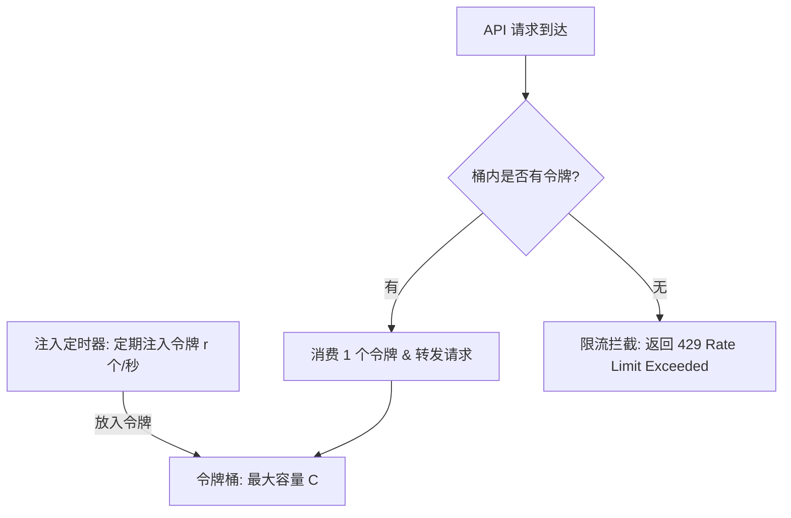
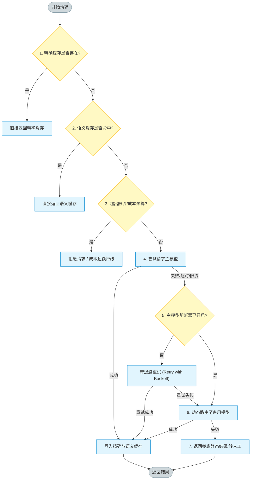

---

sidebar_position: 13

title: M7L11 - 缓存、限流与降级

description: LLM 调用又贵又慢又会失败。把 M5 的弹性模式用到 LLM：语义缓存省钱、限流防超支、模型降级链保可用。

---


import GlossaryTerm from '@site/src/components/GlossaryTerm';

import GuidedExercise from '@site/src/components/GuidedExercise';

import ResearchNote from '@site/src/components/ResearchNote';

import ChapterMeta from '@site/src/components/ChapterMeta';

import PyRunner from '@site/src/components/PyRunner';

import TradeoffExplorer from '@site/src/components/TradeoffExplorer';

import StepFlow from '@site/src/components/StepFlow';

import QuizCard from '@site/src/components/QuizCard';

import SystemSimulator from '@site/src/components/SystemSimulator';


# M7L11 · 缓存、限流与降级


<ChapterMeta

  time="约 2.5 小时"

  prereqs={[{label: 'M5 弹性模式', href: '../core-components/circuit-breaker'}, {label: 'M3L5 缓存', href: '../data-cache-queue/cache-patterns'}, {label: 'M7L5 成本延迟', href: './llm-api-cost-latency'}]}

  outcome="能把 M5 的弹性模式用到 LLM：用（语义）缓存省钱降延迟、用限流防成本失控、用模型降级链在故障/限流时保可用。"

  howToUse="先看“LLM 是个又贵又慢又会限流的依赖”，再把前面学的缓存/限流/降级套上来，最后做语义缓存 + 降级链 lab。"

/>


:::tip 好消息：LLM 是个远程依赖，你前面学的弹性模式全用得上

[Month 5](../core-components/circuit-breaker) 你学了缓存、限流、熔断、重试、降级。LLM## 二、三个核心概念（分层）


### 基础：LLM 缓存（精确 + 语义）


- <GlossaryTerm term="Exact Cache" definition="精确缓存：完全相同的 Prompt 和参数输入时，直接返回缓存结果。仅在模型输出确定（如温度为0）且对时效性不敏感的场景适用。">精确缓存</GlossaryTerm>：相同输入（同 prompt + 同参数）直接返回缓存结果——前提是[低温/确定性输出（M7L3）](./sampling-decoding) 才有意义。命中就**完全跳过调用**（成本和延迟归零）。

- <GlossaryTerm term="Semantic Cache" definition="语义缓存：用向量相似度判断新请求是否和缓存过的某个请求语义相近，相近就复用缓存答案。比精确匹配命中率高得多（运费多少 和 运费几块 能命中同一条），但要设相似度阈值、防误命中。">语义缓存</GlossaryTerm>：很多问法不同但意思相同（“运费多少” vs “运费几块钱”）。语义缓存用[向量相似度（Month 8）](../rag/overview) 判断“够不够像”，像就复用——命中率远高于精确匹配。代价：要设相似度阈值，太松会误命中（返回不对的答案）。





在实际的内存级/分布式缓存机制中，你可以通过以下模拟器，动手调整并体验传统精确缓存机制在 LRU 驱逐策略下的状态变化（如 M3L5 缓存基础）：


<SystemSimulator type="cache-lru" />


### 进阶：限流、预算与成本护栏


- **限流**（[M5L5](../core-components/rate-limiting)）：限制调用频率，防滥用、防触达 API 限额、防成本失控。常见的算法如 <GlossaryTerm term="Token Bucket" definition="令牌桶：限流中常用的一种算法。桶内按固定速率放入令牌，请求到达时必须消耗令牌才能执行，令牌耗尽则拒绝或排队。">令牌桶算法（Token Bucket）</GlossaryTerm>，可以使用以下模拟器运行观察：


<SystemSimulator type="token-bucket" />




- <GlossaryTerm term="Cost Budget / Spend Cap" definition="成本预算/支出上限：给 LLM 调用设每用户/每功能/每天的花费上限，逼近上限时降级或拒绝，防止 bug 或流量激增导致账单失控。">成本预算 / 支出上限</GlossaryTerm>：给每用户/每功能/每天设花费上限，逼近就降级或拒绝——这是 LLM 特有的、必须有的“成本护栏”（普通依赖很少需要，但 LLM 的钱是按调用烧的）。


### 深入（选学）：模型降级链与完整弹性


把 [M5 的弹性组合拳](../core-components/circuit-breaker) 套到 LLM：

- <GlossaryTerm term="Model Fallback Chain" definition="模型降级链：主模型失败/超时/限流/超预算时，依次回退到备选（更便宜/更快/其它供应商的模型），最后回退到缓存/默认答/人工，保证服务不整体挂。">模型降级链</GlossaryTerm>：主模型（如 Opus 4.8 `claude-opus-4-8`）失败/限流/超时 → 退到备选（如 Sonnet 4.6 `claude-sonnet-4-6`，甚至换供应商）→ 再退到缓存的旧答案/模板答/转人工。结合[熔断（M5L6）](../core-components/circuit-breaker)（某模型持续失败就跳闸）、[重试+退避（M5L7）](../core-components/retry-backoff-timeout)（应对瞬时错误和限流）、[超时（M5L7）](../core-components/retry-backoff-timeout)（别让慢调用拖死）。





- **降级也可以是“降质量换可用”**：高峰期把难任务也路由到[小模型（M7L5）](./llm-api-cost-latency)、缩短上下文、关掉非核心 AI 功能——有损服务好过无服务（[呼应 M5L5](../core-components/rate-limiting)）。

- **缓存 + 流式 + 路由 + 降级**共同构成 LLM 的“成本与可用性”工程：缓存省重复、流式改体感、路由按难度选档、降级保底线。

- **观测**（[M6L7](../cloud-enterprise-industrial/observability-advanced)）：监控 token 用量、成本、命中率、各模型成功率/延迟、降级触发率——LLM 系统的可观测重点和传统系统不同（多了 token 和成本维度）。）。语义缓存用[向量相似度（Month 8）](../rag/overview) 判断“够不够像”，像就复用——命中率远高于精确匹配。代价：要设相似度阈值，太松会误命中（返回不对的答案）。


### 进阶：限流、预算与成本护栏


- **限流**（[M5L5](../core-components/rate-limiting)）：限制调用频率，防滥用、防触达 API 限额、防成本失控。

- <GlossaryTerm term="Cost Budget / Spend Cap" definition="成本预算/支出上限：给 LLM 调用设每用户/每功能/每天的花费上限，逼近上限时降级或拒绝，防止 bug 或流量激增导致账单失控。">成本预算 / 支出上限</GlossaryTerm>：给每用户/每功能/每天设花费上限，逼近就降级或拒绝——这是 LLM 特有的、必须有的“成本护栏”（普通依赖很少需要，但 LLM 的钱是按调用烧的）。


### 深入（选学）：模型降级链与完整弹性


把 [M5 的弹性组合拳](../core-components/circuit-breaker) 套到 LLM：

- <GlossaryTerm term="Model Fallback Chain" definition="模型降级链：主模型失败/超时/限流/超预算时，依次回退到备选（更便宜/更快/其它供应商的模型），最后回退到缓存/默认答/人工，保证服务不整体挂。">模型降级链</GlossaryTerm>：主模型（如 Opus 4.8 `claude-opus-4-8`）失败/限流/超时 → 退到备选（如 Sonnet 4.6 `claude-sonnet-4-6`，甚至换供应商）→ 再退到缓存的旧答案/模板答/转人工。结合[熔断（M5L6）](../core-components/circuit-breaker)（某模型持续失败就跳闸）、[重试+退避（M5L7）](../core-components/retry-backoff-timeout)（应对瞬时错误和限流）、[超时（M5L7）](../core-components/retry-backoff-timeout)（别让慢调用拖死）。

- **降级也可以是“降质量换可用”**：高峰期把难任务也路由到[小模型（M7L5）](./llm-api-cost-latency)、缩短上下文、关掉非核心 AI 功能——有损服务好过无服务（[呼应 M5L5](../core-components/rate-limiting)）。

- **缓存 + 流式 + 路由 + 降级**共同构成 LLM 的“成本与可用性”工程：缓存省重复、流式改体感、路由按难度选档、降级保底线。

- **观测**（[M6L7](../cloud-enterprise-industrial/observability-advanced)）：监控 token 用量、成本、命中率、各模型成功率/延迟、降级触发率——LLM 系统的可观测重点和传统系统不同（多了 token 和成本维度）。


<ResearchNote

  title="把弹性工程套到 LLM：缓存 + 限流 + 降级 + 预算"

  source="Month 5 弹性模式；GPTCache（语义缓存）；各家 LLM 网关/代理实践"

  href="https://github.com/zilliztech/GPTCache"

  insight="LLM 是又贵又慢又会限流失败的远程依赖，因此缓存（精确/语义）、限流、重试退避、熔断、模型降级链、成本预算等弹性模式价值被放大。语义缓存用向量相似度提升命中率；模型降级链在故障/限流/超预算时回退到更便宜模型或缓存/人工，保证可用。"

  application="给 LLM 调用配齐：语义缓存（省钱降延迟）+ 限流和成本上限（防超支）+ 超时/重试退避/熔断（抗故障限流）+ 模型降级链（保可用）+ token/成本/命中率观测。把 M5 弹性模式针对 LLM 的贵和慢做加强。"

/>


### 实战指南：搭建生产级大模型弹性治理链路


要在大规模业务中安全、低成本地部署大模型，我们需要分层构建弹性安全网络。点击下方步骤可以了解落地实施流程：


<StepFlow

  steps={[

    {

      title: '接入网关与多模型配置',

      desc: '自建或使用开源 LLM 代理网关，配置主备模型（如 Opus 与 Sonnet）和多云 API 备用密钥，以解决单点故障与单供应商限流问题。',

      diagram: 'Client ──> LLM Gateway (管理多模型路由 & 多云 Key 轮询)'

    },

    {

      title: '部署双层缓存架构',

      desc: '在网关前置 Redis 精确缓存（完全相同输入零开销），后置基于 Redis Vector / Milvus 的语义缓存，阈值设在 0.85 左右，在命中率与误判率间取得平衡。',

      diagram: '输入 Prompt ──> 精确匹配 (Redis) ──(未命中)──> 向量搜索 (向量库) ──(未命中)──> LLM'

    },

    {

      title: '实现滑动窗口限流与成本护栏',

      desc: '对 API Key 或用户级别设置滑动窗口 Token 限制；建立 Daily Cost Budget 控制器，在调用总额逼近设定预算（如每日 100 美元）时，自动降级至 Haiku 模型或拒绝非核心请求。',

      diagram: '请求 ──> 验证 Token 令牌桶 & 滑动窗口 ──> 校验今日累计 API 消耗金额 ──> 放行'

    },

    {

      title: '配置故障转移与熔断降级链',

      desc: '为每一个模型调用配置熔断器（Circuit Breaker）。主模型连续超时或报 429 时进入熔断，自动路由至降级回退链（Opus ──> Sonnet ──> 静态兜底 ──> 人工）。',

      diagram: 'API 429/超时 ──> 触发熔断 ──> 自动跳闸 ──> 降级指向备用模型'

    },

    {

      title: '搭建可观测性看板',

      desc: '在 Prometheus/Grafana 或 OpenTelemetry 控制台打通 Token 成本、LLM 延迟、各层缓存命中率、熔断状态和模型降级率的指标大盘，确保财务与技术风险完全可见。',

      diagram: '实时收集 Metrics ──> 监控 Token 计费 & 降级比率 ──> 异常告警'

    }

  ]}

/>


## 三、跟我做一遍：语义缓存 + 模型降级链


<PyRunner

  rows={38}

  expect="缓存命中省调用、故障降级保可用"

  code={`# 简化“语义相似”：归一化后字符集合的 Jaccard 重叠（真实用向量相似度，Month 8）

def similar(a, b):

    sa = set(a.replace("?", "").replace("？", ""))

    sb = set(b.replace("?", "").replace("？", ""))

    if not sa or not sb:

        return 0.0

    return len(sa & sb) / len(sa | sb)


class SemanticCache:

    def __init__(self, threshold=0.6):

        self.store = []; self.threshold = threshold

    def get(self, q):

        for cq, ans in self.store:

            if similar(q, cq) >= self.threshold:

                return ans                       # 语义命中，复用

        return None

    def put(self, q, ans):

        self.store.append((q, ans))


def call_chain(q, models, cache):

    hit = cache.get(q)

    if hit is not None:

        return ("CACHE", hit)                    # 命中：跳过所有模型调用

    for name, fn in models:                      # 模型降级链

        try:

            ans = fn(q); cache.put(q, ans); return (name, ans)

        except Exception:

            continue                             # 此模型失败 -> 退下一个

    return ("FALLBACK", "暂时无法回答，请稍后或转人工")  # 全失败 -> 兜底


cache = SemanticCache(threshold=0.6)

def primary(q): raise RuntimeError("主模型限流")  # 模拟主模型挂

def backup(q): return "运费是 12 元"


print(call_chain("运费多少钱?", [("opus", primary), ("sonnet", backup)], cache))  # 主挂->备答

print(call_chain("运费多少?", [("opus", primary), ("sonnet", backup)], cache))    # 与上句高度重叠->命中缓存

print("缓存命中省调用、故障降级保可用")`}

/>


主模型限流时自动退到备用模型；语义相近的问法命中缓存、完全跳过调用——省钱、降延迟、保可用一次拿到。**试试**：把 `threshold` 调到 0.9（更严），看"运费几块"是否还命中；让 backup 也抛异常，看是否走到 FALLBACK 兜底。


## 四、动手 Lab（必做）


打开 `labs/month07/m7l11_cache_resilience/`：


```bash

python labs/month07/m7l11_cache_resilience/test_resilience.py

```


实现语义缓存 + 模型降级链：相似命中复用、主模型失败退备用、全失败兜底，并支持成本上限拒绝。


<GuidedExercise

  title="练习指引：实现 LLM 缓存 + 降级链"

  goal="把“语义缓存 + 模型降级链 + 成本上限”做成代码——LLM 成本与可用性工程的核心。"

  hints={[

    'SemanticCache：相似度 >= 阈值则命中复用。',

    'call_chain：先查缓存命中；否则依次尝试模型，失败退下一个；全失败兜底。',

    '成功的结果写回缓存。',

    '（选做）加成本上限：累计花费超 cap 时直接降级/拒绝。'

  ]}

  steps={[

    '实现 similar 和 SemanticCache（get/put）。',

    '实现 call_chain(q, models, cache)：缓存 -> 降级链 -> 兜底。',

    '（选做）加 spend_cap：超预算返回降级。',

    '写测试：精确/相似命中、主失败退备用、全失败兜底、写回缓存、超预算降级。'

  ]}

  checks={[

    '你能把缓存/限流/降级套到 LLM 调用上。',

    '你的 lab 语义命中复用、故障降级保可用。',

    '你能解释成本上限为什么是 LLM 特有的必备护栏。',

    '你知道 LLM 观测要多看 token/成本/命中率维度。'

  ]}

/>


## 架构师深潜（Staff+ 视角）


### 1. LLM 成本与可用性手段


<TradeoffExplorer

  title="LLM 成本/可用性工程手段"

  dimensions={['省成本', '降延迟', '保可用', '实现复杂度', '风险']}

  options={[

    {

      name: '语义缓存',

      scores: [5, 5, 3, 3, 3],

      note: '命中则零成本零延迟。命中率高，但阈值太松会返回不对的答案。',

      whenToUse: '有重复/相似请求、输出较确定时。'

    },

    {

      name: '模型降级链 + 熔断',

      scores: [3, 3, 5, 3, 2],

      note: '主模型故障/限流时退备用/缓存/人工，保可用。需管理多模型和一致性。',

      whenToUse: '对可用性要求高的生产功能。'

    },

    {

      name: '限流 + 成本上限',

      scores: [4, 1, 3, 2, 1],

      note: '防滥用和账单失控。会拒绝部分请求，但守住成本底线。',

      whenToUse: '所有对外/高频 LLM 功能——必备护栏。'

    }

  ]}

/>


### 2. AI 工程 = AI 能力 + 你前六个月学的全部工程


这一课最该带走的认知：**做可靠的 LLM 系统，靠的不是什么 AI 新魔法，而是把你前六个月的工程功底用到 LLM 这个新组件上。** 缓存（[M3/M5](../data-cache-queue/cache-patterns)）、限流熔断降级（[M5](../core-components/circuit-breaker)）、可观测（[M6L7](../cloud-enterprise-industrial/observability-advanced)）、评测门禁（[M6L6/M7L10](./llm-evaluation)）、校验防护（[L3/M7L9](./hallucination-guardrails)）——一个都不少。区别只在于 LLM 特别贵、特别慢、不确定、会幻觉，所以这些工程手段的价值被放大了。**这正是"AI Architect"而非"调 API 的人"的分野**：你能把一个不可靠、昂贵的概率组件，用扎实的系统工程包裹成生产级可靠功能。


### 3. 真实案例：LLM 网关层的兴起


随着 LLM 应用增多，业界涌现出"LLM 网关/代理"层（[呼应 M5L2 API 网关](../core-components/api-gateway)），把这些横切能力统一收口：语义缓存、限流、成本预算、多模型路由与降级、重试熔断、统一观测、密钥管理。这和 [M6L8 服务网格](../cloud-enterprise-industrial/service-mesh) 把弹性下沉到 sidecar 是同一思想——**把"调 LLM"这件事的横切关注点抽出来统一治理**，而不是每个功能各写一遍。架构师设计 LLM 系统时，要么用现成的 LLM 网关，要么自建这一层——总之这些能力必须有，不能让每次裸调 LLM。


### 4. 架构师深问（给自己 30 分钟）


- 你的 LLM 功能有缓存吗？精确还是语义？命中率多少、能省多少成本？

- 主模型挂了/限流了，你的功能会整体崩还是能降级（备用模型/缓存/人工）？降级路径设计了吗？

- 你有成本上限护栏吗？一个 bug 导致疯狂调用，账单会失控到什么程度？怎么熔断？


## 自检清单


- [ ] 我能把缓存/限流/降级套到 LLM 调用上。

- [ ] 我的 lab 语义命中复用、故障降级保可用。

- [ ] 我理解成本上限是 LLM 特有的必备护栏。

- [ ] 我能把前六个月的工程能力迁移到 LLM 组件上。


## 章末自测


为了检验你对本章 LLM 缓存、限流、熔断与降级等弹性设计理念的掌握情况，请完成以下自测题目：


<QuizCard

  questions={[

    {

      q: '对于语义缓存（Semantic Cache），如果把相似度阈值（Similarity Threshold）设置得过低（例如 0.45），会产生什么后果？',

      options: [

        'A. 缓存完全失效，所有相似的问法都无法命中缓存，被迫直接调用大模型',

        'B. 缓存命中率升高，但极易将语义不相关的请求误判为命中，导致向用户返回完全错误的历史答案',

        'C. 模型生成的响应延迟大幅翻倍，且向量计算变得极其缓慢',

        'D. 大模型的单次调用 Token 成本会自动增加一倍'

      ],

      answer: 1,

      explain: '语义缓存依赖向量余弦相似度来进行模糊匹配。如果阈值过低，两个语义完全相左或无关的 Prompt（例如“我要买机票” vs “我要退机票”）就会被误判为相似，造成严重的内容张冠李戴（即“缓存污染”与“幻觉”）。一般生产环境的语义相似度阈值建议设定在 0.85~0.92 之间。'

    },

    {

      q: '模型降级链（Model Fallback Chain）在解决大模型调用被限流（API Rate Limited）或服务宕机时，其主要架构原则是？',

      options: [

        'A. 当请求遇到瞬时错误时立即无限重试，直至大模型返回 200 OK 响应',

        'B. 在主模型挂掉时将请求直接作废，向终端用户抛出内部 HTTP 500 报错',

        'C. 遵循“有损服务”的降级设计，当高级主模型失败或超时时，自动退避路由至备选的、更便宜的或跨云的模型，最后回退至兜底静态答案',

        'D. 自动重构 Prompt，将用户提问缩减为单个词汇后重新强制发往主模型'

      ],

      answer: 2,

      explain: '模型降级链贯彻了传统微服务架构中“降级换可用”的设计哲学：Opus (主) ──> Sonnet (备) ──> Haiku (轻量) ──> 缓存/静态兜底/转人工。通过退避到备用模型或不同供应商的 API，在主服务部分故障时依然保障用户基本功能的连续性。'

    },

    {

      q: '在 LLM 系统架构中，关于“成本上限护栏（Spend Cap）”的说法，以下哪项最准确？',

      options: [

        'A. 它是为了限制底层大模型的内部参数规模，防止显存溢出',

        'B. 它是针对按 Token 计费的大模型 API 专门设计的核心业务护栏，用于防止死循环 Bug 或恶意刷流量导致企业产生灾难性的天价账单',

        'C. 设置成本上限后，系统底层的向量数据库搜索吞吐量将自动被限额 50%',

        'D. 成本上限应当由财务部门在月度报表中手工维护，不需要通过网关层代码做阻断'

      ],

      answer: 1,

      explain: '不同于传统的内存、CPU 仅占用物理资源，大模型调用是按使用量（Token 数量）实时产生资金损耗的。如果系统发生代码死循环、遭受爬虫 DDoS 攻击或遭遇恶意刷量，短短几小时内就可能烧掉成千上万美元。必须在 LLM 网关层对单用户、单 Key、单应用实施每日/每小时的累计资金支出限额（Spend Cap）和自动阻断。'

    }

  ]}

/>


## 常见误解


- **"LLM 应用无非就是调个 API，不需要什么复杂的后端架构"**：极度危险。裸调大模型 API 在高并发和生产环境下极其脆弱。由于 API 极其昂贵、响应缓慢且经常限流，大模型应用必须要用 LLM 网关包裹，并配齐语义缓存、分布式限流、故障熔断、降级回退链以及成本护栏等弹性架构手段。

- **"缓存对 LLM 应用没用，因为模型的生成都是随机和动态的"**：错误认知。通过降低温度（Temperature -> 0）可以使特定业务生成趋向确定。使用“精确缓存”能实现常见分类与重复请求的零延迟；而“语义缓存”通过向量搜索，能把拼写不同但逻辑相同的海量相似查询拦截在网关层，节省大量 API 开销。

- **"只要大模型足够聪明，就可以不需要设计模型降级链"**：偏颇。再聪明的模型也无法规避网络波动、云供应商故障、单账号并发配额限制（Rate Limit Block）或突发的账单爆表。大模型本身的智力与其服务的系统可用性是两码事，模型降级链和熔断器是系统可用性的物理保障。

- **"大模型的观测指标和传统微服务是一样的，看 CPU/内存/QPS 就行"**：漏掉了关键维度。除了常规微服务指标外，LLM 的可观测性重点是按 Token 计算的消费额度、语义缓存命中率（Cache Hit Rate）、长字符的首字响应时间（TTFT - Time-to-First-Token）、累计消费成本（Spend Rate）等专有指标。


## 延伸阅读


- [GPTCache (语义缓存)](https://github.com/zilliztech/GPTCache)

- [Month 5：弹性模式](../core-components/circuit-breaker)

- [下一课：Capstone 构建一个 LLM 应用](./capstone-llm-app)
