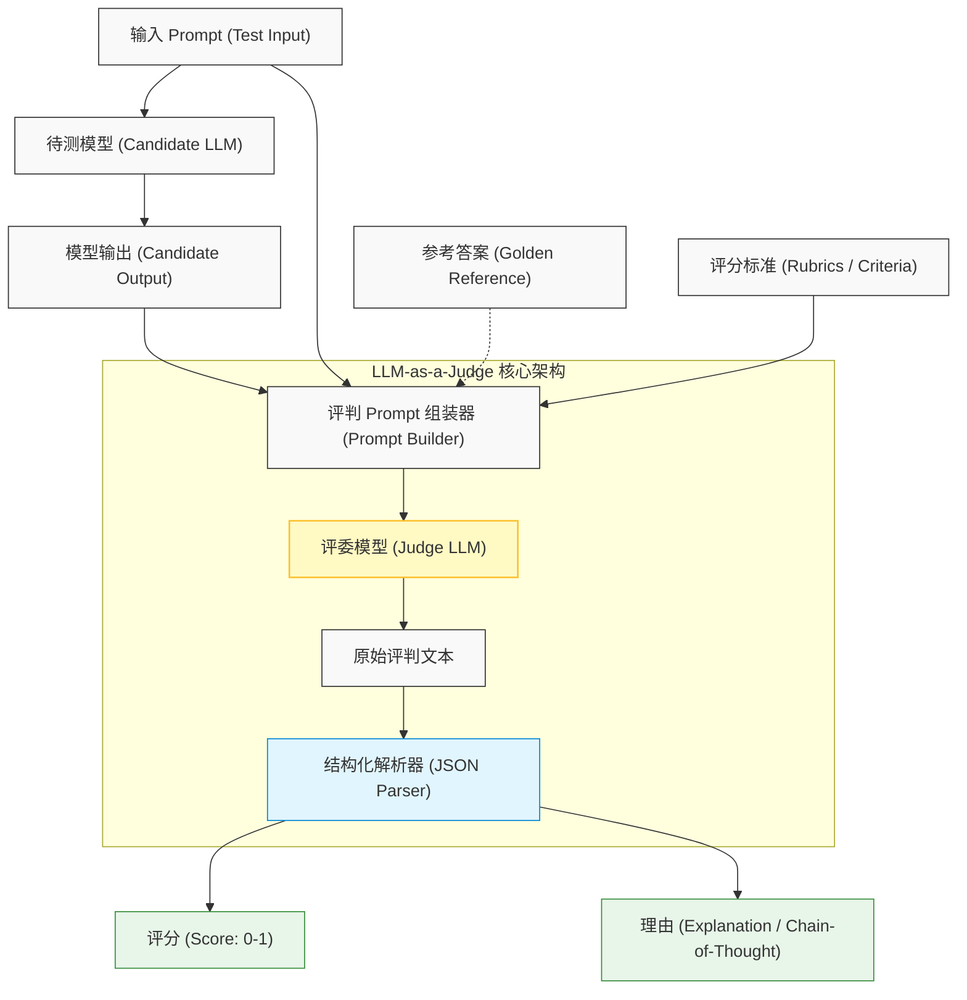
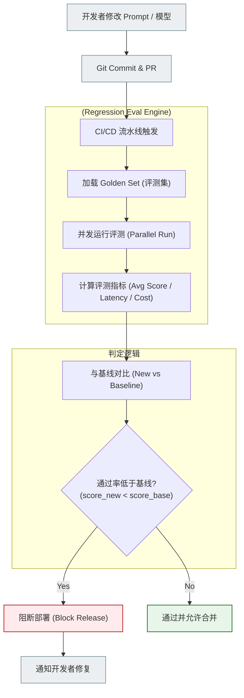
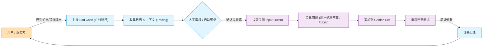

import GlossaryTerm from '@site/src/components/GlossaryTerm';
import GuidedExercise from '@site/src/components/GuidedExercise';
import ResearchNote from '@site/src/components/ResearchNote';
import ChapterMeta from '@site/src/components/ChapterMeta';
import PyRunner from '@site/src/components/PyRunner';
import TradeoffExplorer from '@site/src/components/TradeoffExplorer';
import StepFlow from '@site/src/components/StepFlow';
import QuizCard from '@site/src/components/QuizCard';

# M7L10 · LLM 评测

<ChapterMeta
  time="约 2.5 小时"
  prereqs={[{label: 'L13 测试与 TDD', href: '../foundations/testing-and-tdd'}, {label: 'M7L3 非确定性', href: './sampling-decoding'}, {label: 'M6L6 CI 门禁', href: '../cloud-enterprise-industrial/cicd-pipelines'}]}
  outcome="能为 LLM 功能建评测集、用规则/LLM-as-judge 打分、跑回归防止改 prompt/换模型导致退化，并把评测接进 CI 门禁。"
  howToUse="先看“凭感觉调 prompt”的危险，再学评测方法，最后做评测打分 lab。"
/>

:::tip 没有评测，你对 LLM 系统的每次改动都是在赌博
传统代码靠[测试（L13）](../foundations/testing-and-tdd) 保证改动不退化。但 LLM 输出[不确定（M7L3）](./sampling-decoding)、没有唯一正确答案，没法用 `assert 输出 == 期望`。于是很多团队靠“我试了几条感觉变好了”来调 prompt、换模型——**这是赌博**。LLM 评测就是给 AI 系统装上“测试”：用评测集 + 打分 + 回归，让“变好还是变坏”变成可度量、可对比的事实。
:::

## 一、“感觉变好了”靠不住

你改了 prompt，试了三条 case 觉得不错就上线——结果另一类输入悄悄退化了，线上才发现。或者换了个更便宜的模型，“看起来差不多”，实际某些场景质量明显下降。**靠手试几条、凭感觉判断，既不全面也不可复现。** 你需要的是：一组有代表性的测试用例 + 一套打分标准 + 每次改动都跑一遍对比——就像代码的[回归测试（L13）](../foundations/testing-and-tdd)。

## 二、三个核心概念（分层）

### 基础：评测集与评分方式

<GlossaryTerm term="Eval Set" definition="评测集：一组有代表性的测试用例（输入 + 期望/评分标准），覆盖典型场景、边界、易错情况。是衡量 LLM 系统质量、对比不同 prompt/模型的基准。">评测集（eval set）</GlossaryTerm>：精心挑选的一组用例，也常被称为 <GlossaryTerm term="Golden Set" definition="黄金数据集：经过人工校验、高质量、有代表性的基准测试用例集，是评测系统的核心资产。">黄金数据集（Golden Set）</GlossaryTerm>（包括输入 + 期望或评分标准），覆盖典型、边界、易错场景。
需要注意的是，企业内部的业务评测集通常不同于通用的 <GlossaryTerm term="LLM Benchmarks" definition="大模型基准测试：如 MMLU、GSM8K、MT-Bench 等公开的、通用的行业标准评测集，用来衡量模型底座的通用能力。">行业基准测试（Benchmarks）</GlossaryTerm>（如 MMLU、GSM8K、MT-Bench 等），后者用于测试模型底层通用能力，而前者专门针对具体业务场景。

评分方式分几类：
- **精确/规则匹配**：答案是否等于/包含标准答案、是否符合格式、数值是否正确——适合有明确答案的任务（分类、抽取）。
- **语义/相似度**：答案和参考答案语义是否接近——适合开放问答。
- **人工评分**：人按标准打分——最准但慢、贵、不可复现。

### 进阶：LLM-as-judge

对开放性输出（没有唯一答案），一个强力方法是<GlossaryTerm term="LLM-as-Judge" definition="用 LLM 当评判：让一个（通常更强的）模型按给定评分标准（rubric）给被测输出打分或两两比较。可规模化、比纯规则更懂语义，但本身也可能有偏差，需校准和抽样人工核对。">LLM-as-judge（用模型当评委）</GlossaryTerm>：让一个（通常更强的）模型按 <GlossaryTerm term="Rubric" definition="评分细则/标准：给 LLM-as-judge 提供的一套明确、多维度的打分说明，限制模型评判的主观性与偏差。">评分标准（rubric）</GlossaryTerm> 给输出打分或两两对比。它能规模化、比规则更懂语义。



但要警惕：评委模型本身也有偏差（如偏好长答案、偏好特定风格），需要校准、抽样人工核对、用清晰 rubric 约束。

### 深入（选学）：回归、CI 门禁与评测驱动开发

把评测变成工程纪律：
- <GlossaryTerm term="Regression Eval" definition="回归评测：每次改动（prompt、模型、参数、检索）后，在固定评测集上重写打分，和基线对比，确保没让已通过的用例退化。是 LLM 系统的回归测试。">回归评测</GlossaryTerm>：每次改 prompt/换模型/调参，都在评测集上重跑、和基线对比——**通过率掉了就别上线**（[呼应 M6L6 质量门禁](../cloud-enterprise-industrial/cicd-pipelines)）。这把“感觉”变成“数字对比”。
- **接进 CI**：评测作为流水线的一个门禁阶段，prompt/模型变更要过评测才能合并/发布（[M6L6](../cloud-enterprise-industrial/cicd-pipelines)）——prompt 是代码，要测试（[M7L4](./prompting-basics)）。



- **评测集会演进**：线上发现的 bad case 要加进评测集（防止再犯）——和[特征测试（M4L11）](../design-patterns-lld/code-smells-refactoring) 一个思路。


- **多维度评测**：不只看“对不对”，还要看[幻觉率、引用准确率（M7L9）](./hallucination-guardrails)、[成本、延迟（M7L5）](./llm-api-cost-latency)、安全合规——综合权衡，不能只优化一个维度。
- **线上评测**：除了离线评测集，还要在线监控真实流量的质量（用户反馈、抽样 LLM-judge、关键指标），因为评测集覆盖不了所有真实输入。

<ResearchNote
  title="评测：让 AI 系统的质量变化可度量、可回归"
  source="Liang et al. (2022), HELM；Zheng et al. (2023), MT-Bench / LLM-as-a-Judge；OpenAI/Anthropic 评测实践"
  href="https://arxiv.org/abs/2306.05685"
  insight="LLM 输出不确定且常无唯一答案，需用评测集 + 多种评分（规则/语义/LLM-judge/人工）来衡量质量。研究表明强模型当评委与人类判断有较高一致性，但存在位置/长度/风格偏差，需校准。把评测做成回归 + CI 门禁，是 LLM 系统可靠演进的基础。"
  application="为每个 LLM 功能建评测集（覆盖典型/边界/线上 bad case）；按任务选评分方式（规则/语义/LLM-judge/人工）；每次改动跑回归对比基线、接进 CI 门禁；多维度（质量/幻觉/成本/延迟/安全）综合评估；离线评测 + 线上质量监控并行。"
/>

### 实战演练：企业级 LLM 评测落地五步法

为了将评测理念真正落实到企业生产环境，我们可以拆解为以下五步工作流。通过点击下面的交互组件可以查看每一步的运作图景：

<StepFlow
  steps={[
    {
      title: '构建黄金数据集 (Build Golden Set)',
      desc: '整理线上真实 Bad Case，通过人工校验和泛化，形成覆盖典型业务场景与边界条件的评测用例集（通常在 50~100 条左右即可起步）。',
      diagram: '用户反馈/Bad Case ──> 人工泛化 ──> 黄金数据集 (Golden Set)'
    },
    {
      title: '制定评分细则与标准 (Define Rubrics)',
      desc: '针对特定生成任务，定义明确的打分指标（如格式准确度、信息真实度等）。为 LLM Judge 编写带有具体示例的 Prompt 及打分标准细则。',
      diagram: '评分维度 (例如相关性、有害度) + 分数说明 ──> 结构化 Rubric'
    },
    {
      title: '流水线并发运行 (Run Eval Pipeline)',
      desc: '在 CI/CD 或定时触发的流水线中，拉取最新的 Prompts 与测试模型，对黄金数据集中的所有用例发起并发 API 调用，收集输出结果。',
      diagram: '代码提交 ──> 并发调用 LLM 接口 ──> 聚合待评测 Raw Outputs'
    },
    {
      title: '自动化打分与回归检测 (Automated Gating)',
      desc: '运行规则检查器或调用 Judge 模型为输出进行自动化评估，计算出本轮的平均得分，并与 Baseline 基线分数对比。若分数倒退则在 CI 中阻断。',
      diagram: '输出结果 ──> LLM Judge / 规则匹配 ──> 计算通过率 ──> 触发回归告警'
    },
    {
      title: '评判模型校准与优化 (Calibrate Judge)',
      desc: '定期对 Judge 模型的评估结果进行人工盲审抽查，计算 Judge 与人类专家评分的一致性（如 Kappa 系数），从而不断微调优化评分 Prompt。',
      diagram: '人类评分对比 Judge 评分 ──> 发现偏差 ──> 迭代 Rubric 提示词'
    }
  ]}
/>

## 三、跟我做一遍：评测集打分 + 回归对比

<PyRunner
  rows={36}
  expect="算出通过率、检测回归"
  code={`# 评测集：每条 = 输入 + 评分函数（这里用规则评分；开放任务可换 LLM-judge）
def exact(expected):
    return lambda out: 1.0 if out.strip() == expected else 0.0

def contains(keyword):
    return lambda out: 1.0 if keyword in out else 0.0

EVAL_SET = [
    {"input": "1+1=?", "score": exact("2")},
    {"input": "法国首都?", "score": contains("巴黎")},
    {"input": "把 SO-1 状态格式化", "score": contains("shipped")},
]

def run_eval(system_fn):
    total, detail = 0.0, []
    for case in EVAL_SET:
        out = system_fn(case["input"])
        s = case["score"](out)
        total += s
        detail.append((case["input"], s))
    return total / len(EVAL_SET), detail

def system_v1(inp):
    return {"1+1=?": "2", "法国首都?": "巴黎", "把 SO-1 状态格式化": "shipped"}.get(inp, "")
def system_v2(inp):  # 改了 prompt 后第 3 题退化
    return {"1+1=?": "2", "法国首都?": "巴黎", "把 SO-1 状态格式化": "已发货"}.get(inp, "")

base, _ = run_eval(system_v1)
new, detail = run_eval(system_v2)
print("基线通过率:", round(base, 2))
print("新版通过率:", round(new, 2), detail)
print("回归检测:", "退化，别上线!" if new < base else "OK")
print("算出通过率、检测回归")`}
/>

评测集把"质量"变成一个通过率数字；改动后重跑、和基线对比，立刻看出第 3 题退化了——这就是回归评测拦住坏改动的方式。**试试**：给 `system_v2` 修好第 3 题，看回归检测变 OK；再往评测集加一条线上发现的 bad case，体会评测集如何演进。

## 四、动手 Lab（必做）

打开 `labs/month07/m7l10_eval/`：

```bash
python labs/month07/m7l10_eval/test_eval.py
```

实现评测框架：评测集打分（精确/包含/数值）、算通过率、回归对比（新版低于基线则判退化）。

<GuidedExercise
  title="练习指引：实现评测 + 回归"
  goal="把“评测集 + 打分 + 回归对比”做成代码——给 LLM 系统装上回归测试。"
  hints={[
    '评分函数返回 0~1 的分数（精确、包含、数值范围等）。',
    'run_eval：对每个用例打分、返回平均分（通过率）。',
    '回归：新版通过率 < 基线则判定退化。',
    '支持往评测集追加用例（线上 bad case）。'
  ]}
  steps={[
    '实现几种评分器（exact / contains / numeric_close）。',
    '实现 run_eval(system_fn, eval_set) 返回通过率 + 明细。',
    '实现 is_regression(base, new)。',
    '写测试：全对得 1.0、部分对得分数、检测退化、加用例后重跑。'
  ]}
  checks={[
    '你能为一个 LLM 功能设计评测集和评分方式。',
    '你的 lab 能算通过率并检测回归。',
    '你能说出 LLM-as-judge 的用途和偏差风险。',
    '你能把评测接进 CI 门禁、用线上 bad case 扩充评测集。'
  ]}
/>

## 架构师深潜（Staff+ 视角）

### 1. 评分方式怎么选

<TradeoffExplorer
  title="LLM 输出评分方式"
  dimensions={['客观可复现', '适合开放输出', '规模化', '成本', '准确度']}
  options={[
    {
      name: '规则/精确匹配',
      scores: [5, 1, 5, 5, 3],
      note: '快、便宜、可复现。但只适合有明确答案的任务，开放输出无能为力。',
      whenToUse: '分类、抽取、格式、数值等有标准答案的任务。'
    },
    {
      name: 'LLM-as-judge',
      scores: [3, 5, 4, 3, 4],
      note: '懂语义、可评开放输出、可规模化。但有偏差、要校准、本身有成本。',
      whenToUse: '开放问答、文案、对话等无唯一答案的任务。'
    },
    {
      name: '人工评分',
      scores: [2, 5, 1, 1, 5],
      note: '最准、是金标准。但慢、贵、不可复现、规模不了。',
      whenToUse: '校准自动评分、抽样核对、高风险最终把关。'
    }
  ]}
/>

### 2. 评测是 AI 系统的"测试金字塔"

[L13](../foundations/testing-and-tdd) 的测试金字塔在 AI 系统里有了新形态：底层是**确定性单元测试**（校验逻辑、工具、解析——这些仍是普通代码，照常测）；中层是**离线评测集**（用规则 + LLM-judge 衡量模型输出质量，跑回归）；顶层是**线上评测**（真实流量的质量监控、用户反馈、A/B）。三层互补：单测保证管道不崩、评测集保证质量不退、线上监控发现评测集没覆盖的真实问题。一个成熟的 AI 团队，评测体系的投入往往和模型/prompt 本身一样多——因为**没有评测，就没有可靠的迭代**。

### 3. 真实案例：评测体系是 AI 团队的护城河

强 AI 团队和弱团队的关键差距之一，是评测体系。弱团队改 prompt 靠拍脑袋、换模型靠"感觉"、出了问题靠用户投诉发现；强团队每个功能有评测集、每次改动跑回归、线上 bad case 自动进评测集、模型升级前先在评测集上对比。这让他们能**快速且安全地迭代**——敢频繁改 prompt、敢试新模型，因为有评测兜底（[呼应 M6 DORA 高频低风险](../cloud-enterprise-industrial/cicd-pipelines)）。评测能力直接决定一个 AI 产品的迭代速度和质量稳定性，是真正的护城河。这也是 [Month 11 AI 平台治理](../production-ai-platform/overview) 的核心。

### 4. 架构师深问（给自己 30 分钟）

- 你的 LLM 功能有评测集吗？改 prompt/换模型时，你怎么知道是变好还是变坏？
- 你的任务该用规则、LLM-judge 还是人工评分？怎么校准 LLM-judge 的偏差？
- 线上出现的 bad case，有没有机制自动进评测集防止再犯？评测有没有进 CI 门禁？

## 自检清单

- [ ] 我能为 LLM 功能建评测集并选对评分方式。
- [ ] 我的 lab 能算通过率、检测回归。
- [ ] 我理解 LLM-as-judge 的用途和偏差风险。
- [ ] 我能把评测做成回归 + CI 门禁 + 线上监控。

## 章末自测

为了检验你对本章 LLM 评测与回归测试核心理念的掌握情况，请完成以下自测题目：

<QuizCard
  questions={[
    {
      q: '为什么在 LLM 系统开发中，传统的 “assert output == expected” 单元测试方法不再适用？',
      options: [
        'A. 因为 LLM API 调用的网络延迟过长，单元测试无法在 CI/CD 中并发执行',
        'B. 因为 LLM 输出具有随机性且表达多样（没有唯一答案），精确规则匹配会导致极高误报率',
        'C. 因为大模型具备自愈能力，即使输出错误也会在下一次调用中自行纠正',
        'D. 因为 LLM 输出的格式一定是 JSON，而传统断言库无法解析复杂的 JSON 对象'
      ],
      answer: 1,
      explain: 'LLM 输出具有不确定性（stochastic nature），即使语义完全正确，每次生成的文字表达也可能有细微差异。因此传统的精确相等断言会导致大量误报。我们需要使用更具弹性的规则（如包含关键词、格式验证）、语义相似度（如向量距离）或 LLM-as-a-Judge 机制来进行软性评分。'
    },
    {
      q: '在使用 LLM-as-a-Judge（以模型作为评委）时，以下哪项最属于评委模型的常见系统性偏差（Bias）？',
      options: [
        'A. 位置偏差（倾向给排在前面的选项打高分）和长度偏差（倾向给冗长繁琐的答案打高分）',
        'B. 计算偏差（无法正确进行基本的十进制四则运算）',
        'C. 语言偏差（完全无法理解和评审非英语生成的答案）',
        'D. 逻辑偏差（只会给出 0 分或 100 分的极端二分类评分）'
      ],
      answer: 0,
      explain: '大量研究和工程实践表明，LLM 评委存在明显偏差：如位置偏差（对选项顺序敏感）、长度倾向（Verbosity Bias，更容易给冗长而显得“丰富”的回答评高分）、自恋偏差（更喜欢自己同款模型生成的回答）。这需要架构师通过限制输入长度、随机化候选项顺序，以及提供极度细致的多维度 Rubric 规则进行约束和校准。'
    },
    {
      q: '在 LLM 应用的 CI/CD 自动化回归流水线中，如果发现新 prompt 版本的评测通过率比基线有所下降，应采取什么策略？',
      options: [
        'A. 直接将当前评测集从 CI 中移除，保证构建快速变绿通过',
        'B. 忽略平均分的微弱下降直接合并部署，让线上用户真实体验并收集反馈',
        'C. 触发部署阻断（Block Gate），提取发生退化的 Case，由开发团队评估 Prompt 泛化问题或校准评测集',
        'D. 自动回滚整个代码库至最原始的版本，且不再允许对此功能进行任何 prompt 调优'
      ],
      answer: 2,
      explain: '在生产级 AI 架构中，回归评测必须作为强力的质量门禁。一旦新版通过率低于基线，必须阻断部署，并提取失败的 bad cases 进行人工或自动化审计。这能避免“感觉变好了”但实际上在边缘场景发生严重功能退化的情况发生。'
    }
  ]}
/>

## 常见误解

- **"LLM 输出是不可控的，因此根本没法做测试"**：错误。我们确实无法用硬编码的 `assert ==`，但可以通过精心构建的“黄金数据集（Golden Set）”，结合规则检测、语义度量与 LLM-as-a-Judge 来进行可度量的回归评测，把随机性框定在可控范围内。
- **"调优 Prompt 时，只要我手测了 5-10 条 Case 没问题，就可以放心上线"**：危险。LLM 是高维非线性的，改动 Prompt 去修复 A 场景的 Bug，极易悄悄导致 B 场景产生严重的质量倒退。没有自动化回归评测，就是在给生产环境埋雷。
- **"LLM-as-a-Judge 完全公正可信，直接用它给业务评测打分就万事大吉"**：偏颇。Judge 模型也是 LLM，它同样具备上述的长度偏差、位置偏差和幻觉风险。企业中需要使用细化评分细则（Rubric）、控制最大长度、定期做“人机一致性”校准盲审，才能建立稳固的法官可信度。
- **"开源的通用 Benchmarks（如 MMLU）拿了高分，就证明模型在我们的垂直业务场景同样优秀"**：错误。通用基准只能说明底座的学科知识储备和基础推理能力，业务核心痛点（如特定 API 调用、企业专有格式、隐私合规等）必须依靠企业团队自己收集、演进的业务 Golden Set 进行回归。

## 延伸阅读

- [LLM-as-a-Judge / MT-Bench (2023)](https://arxiv.org/abs/2306.05685)
- [HELM: Holistic Evaluation of Language Models (2022)](https://arxiv.org/abs/2211.09110)
- [下一课：缓存、限流与降级](./llm-caching-resilience)
