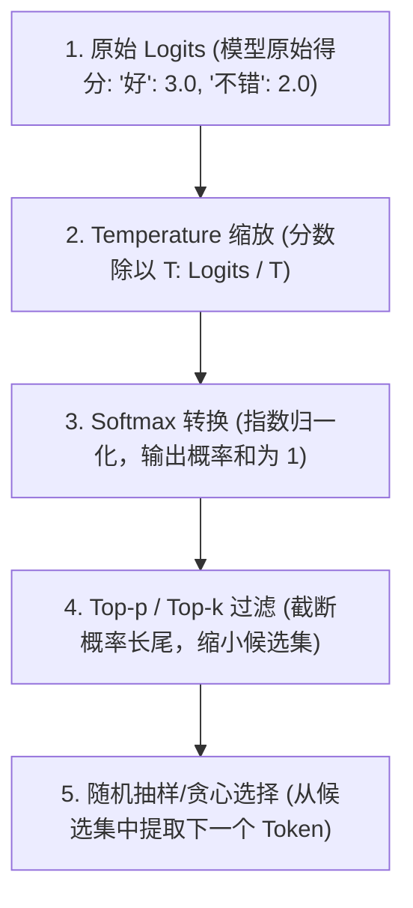
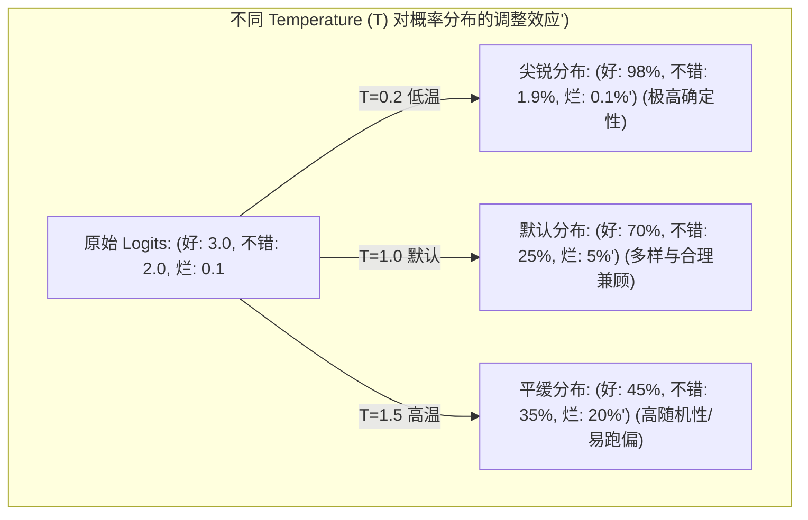
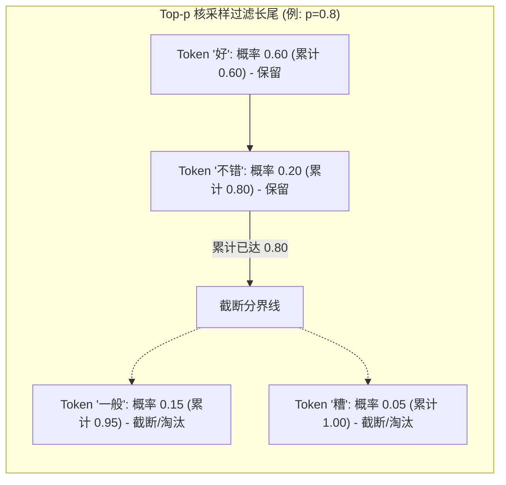

import GlossaryTerm from '@site/src/components/GlossaryTerm';
import GuidedExercise from '@site/src/components/GuidedExercise';
import ResearchNote from '@site/src/components/ResearchNote';
import ChapterMeta from '@site/src/components/ChapterMeta';
import PyRunner from '@site/src/components/PyRunner';
import TradeoffExplorer from '@site/src/components/TradeoffExplorer';
import StepFlow from '@site/src/components/StepFlow';
import QuizCard from '@site/src/components/QuizCard';

# M7L3 · 采样与解码

<ChapterMeta
  time="约 2 小时"
  prereqs={[{label: 'M7L1 自回归生成', href: './transformer-autoregression'}, {label: 'L6 幂等', href: '../foundations/idempotency'}]}
  outcome="能解释模型每步输出的是概率分布、采样策略（temperature/top-p/贪心）如何影响随机性与质量，并据此为不同任务选对参数。"
  howToUse="先看“为什么同样输入答案会变”，再理解几种采样策略，最后做采样 lab。"
/>

:::tip 模型每一步给的是“概率分布”，是采样策略决定了最终吐出哪个 token
[M7L1](./transformer-autoregression) 说模型预测"下一个 token"——更准确地说，它输出的是**所有可能 token 的概率分布**。到底吐哪个，由**采样策略**决定。同样输入每次答案不同，不是模型"善变"，而是采样里有随机性。理解这些"随机性旋钮"，你才能让模型在该确定时确定、该有创造力时有创造力。
:::

## 一、同样的问题，两次不同的答案

你问模型同一个问题两次，得到了措辞不同的两个答案。这让人困惑：它到底"知不知道"答案？真相是：模型每步算出一个概率分布（"好"60%、"不错"20%…），然后**从这个分布里随机抽**一个。抽样有随机性，所以输出会变。这种<GlossaryTerm term="Non-determinism" definition="非确定性：相同输入可能产生不同输出。LLM 的非确定性主要来自采样的随机性（也有数值/并发等因素）。它影响可测试性、可复现性和缓存。">非确定性</GlossaryTerm>对习惯了"相同输入相同输出"（[L6 幂等](../foundations/idempotency)）的工程师是个新挑战——但它是可控的。



## 二、三个核心概念（分层）

### 基础：从概率分布到一个 token

模型每步输出每个候选 token 的<GlossaryTerm term="Logits" definition="logits：模型对每个候选 token 输出的原始分数，经 softmax 归一化成概率分布。采样就是在这个分布上选出下一个 token。">分数（logits）</GlossaryTerm>，经 <GlossaryTerm term="Softmax" definition="Softmax：一种将多分类原始分数 (logits) 转化为概率分布的激活函数。它对每个 logits 做指数幂计算后归一化，使所有项概率之和为 1。">Softmax</GlossaryTerm> 归一化成概率分布。怎么从分布选一个：
- <GlossaryTerm term="Greedy Decoding" definition="贪心解码：每步直接选概率最高的 token。确定性强、可复现，但可能重复、呆板，且“每步最优”不等于“整句最优”。">贪心解码</GlossaryTerm>：永远选概率最高的。确定、可复现，但容易呆板、重复。
- **采样**：按概率随机抽（高概率的更可能被选，但低概率的也有机会）→ 更多样、更自然，但不确定。

### 进阶：temperature 与 top-p

两个最常用的旋钮：
- <GlossaryTerm term="Temperature" definition="温度：缩放概率分布的参数。温度越低（趋近 0）分布越尖锐、越接近贪心（确定、保守）；越高（>1）分布越平、越随机（多样、可能离谱）。">temperature（温度）</GlossaryTerm>：调节分布的"尖锐度"。低温（→0）让高概率 token 几乎垄断，输出趋于确定、保守；高温让分布变平，输出更随机、更有创造力（也更容易跑偏）。
- <GlossaryTerm term="Top-p Sampling" definition="Top-p 采样：只在累计概率达到 p 的最小 token 集合里采样，动态截掉长尾的低概率 token。">top-p</GlossaryTerm>（<GlossaryTerm term="Nucleus Sampling" definition="核采样 (Nucleus Sampling)：即 Top-p 采样。与 Top-k 固定保留前 K 个词不同，它动态保留累计概率之和达到阈值 p 的最小 Token 集合，能根据概率分布的胖瘦自适应调整保留的 Token 数量。">核采样</GlossaryTerm>）：只在"累计概率前 p"的那批最可能 token 里采样，砍掉长尾的离谱选项。比 temperature 更稳地控制"别选到太离谱的词"。（还有 top-k：只在概率前 k 个里选。）





### 深入（选学）：为不同任务选对参数，以及非确定性的工程影响

- **任务决定参数**：要**确定、可复现、事实性**的任务（分类、抽取、代码、JSON 输出）→ 低温（甚至 0）/ 贪心；要**创造性、多样性**的任务（头脑风暴、文案、对话）→ 较高温 + top-p。用错会糟：高温做数据抽取会出幺蛾子，低温写创意会枯燥重复。
- **非确定性的代价**：相同输入不同输出，意味着——测试要容忍变化（不能精确断言，[M7L10 评测](./llm-evaluation)用更宽松的判定）、[缓存（M7L11）](./llm-caching-resilience)对随机输出意义下降、复现 bug 难。**对话/创意场景**接受非确定；**关键决策/可审计场景**应尽量降温 + 校验，甚至要求结构化输出（[M7L6](./structured-output-tools)）。
- **即使 temperature=0 也未必完全确定**：实际系统里因数值精度、并发批处理等，低温也可能有细微波动——所以正确性要靠[校验和评测](./hallucination-guardrails)兜底，而非假设"调到 0 就绝对一致"。

<ResearchNote
  title="采样策略：在多样性与质量之间调节"
  source="Holtzman et al. (2020), The Curious Case of Neural Text Degeneration（提出 top-p / nucleus sampling）"
  href="https://arxiv.org/abs/1904.09751"
  insight="纯贪心/低温采样会导致重复、退化的文本；纯随机采样又会选到离谱低概率词。Top-p（核采样）只在累计概率达 p 的“核”内采样，动态适应分布形状，在多样性和连贯性间取得更好平衡。temperature 则缩放分布尖锐度。"
  application="按任务选采样参数：事实性/结构化/可复现任务用低温或贪心；创造性/多样性任务用适中温度 + top-p。理解非确定性对测试、缓存、可审计的影响，关键路径配结构化输出 + 校验，别假设“温度调到 0 就绝对确定”。"
/>

## 三、跟我做一遍：temperature 与 top-p 采样

为了让大家更直观地体验从 Logits 到采样输出的解码全流程，下面是一个交互式步骤演示：

<StepFlow
  steps={[
    {
      title: '步骤 1: 原始 Logits 计算',
      desc: '大模型前向传播结束后，计算出下一个 Token 的原始非归一化得分（Logits）。例如：{"好": 3.0, "不错": 2.0, "一般": 1.0, "烂": 0.1}。'
    },
    {
      title: '步骤 2: 施加 Temperature 温度缩放',
      desc: '对 logits 进行缩放（Logits / T）。低温度（如 T=0.2）会将分值差距急剧放大，使最高概率项极度突出；高温度（如 T=1.5）则会拉近分数差距。'
    },
    {
      title: '步骤 3: Softmax 转换为概率分布',
      desc: '经过 Softmax 变换，将缩放后的数值映射为相加等于 1 的概率区间。以 T=0.2 为例，"好"的概率被放大到 95% 以上，而 T=1.5 下概率则被熨平。'
    },
    {
      title: '步骤 4: Top-p 核采样截断过滤',
      desc: '将概率降序排列并累加。若设定 p=0.8，累加到“好”和“不错”（0.6 + 0.2 = 0.8）即达到阈值，低于此的“一般”和“烂”会被丢弃，避免选到离谱词。'
    },
    {
      title: '步骤 5: 最终概率区间随机抽样',
      desc: '在保留的候选词集合（“好”、“不错”）中，根据归一化后的概率进行随机轮盘赌抽样，吐出最终确定的 Token 结果。'
    }
  ]}
/>

<PyRunner
  rows={36}
  expect="低温更确定、高温更随机"
  code={`import random, math

logits = {"好": 3.0, "不错": 2.0, "一般": 1.0, "糟": 0.5, "烂透了": 0.1}

def softmax(logits, temp):
    # 温度缩放：temp 越小分布越尖锐（趋向贪心）
    t = max(temp, 1e-6)
    exps = {k: math.exp(v / t) for k, v in logits.items()}
    s = sum(exps.values())
    return {k: v / s for k, v in exps.items()}

def sample(logits, temp, top_p, rng):
    probs = softmax(logits, temp)
    ordered = sorted(probs.items(), key=lambda kv: -kv[1])
    # top-p：只保留累计概率达 top_p 的最小集合
    pool, cum = [], 0
    for k, p in ordered:
        pool.append((k, p)); cum += p
        if cum >= top_p:
            break
    # 在 pool 内归一化后采样
    s = sum(p for _, p in pool)
    r = rng.random() * s; acc = 0
    for k, p in pool:
        acc += p
        if r <= acc:
            return k
    return pool[-1][0]

# 低温：几乎总选“好”（确定、保守）
lo = [sample(logits, temp=0.2, top_p=1.0, rng=random.Random(i)) for i in range(10)]
print("低温(0.2):", lo)
# 高温：分布变平，结果更多样
hi = [sample(logits, temp=1.5, top_p=1.0, rng=random.Random(i)) for i in range(10)]
print("高温(1.5):", hi)
# top-p=0.7：砍掉长尾，避免选到“烂透了”这种离谱词
tp = [sample(logits, temp=1.5, top_p=0.7, rng=random.Random(i)) for i in range(10)]
print("高温+top_p0.7:", tp)
print("低温更确定、高温更随机")`}
/>

低温几乎总选最高概率的"好"（确定），高温让结果五花八门（多样），top-p 在高温下仍砍掉"烂透了"这种长尾离谱词。**试试**：把 temp 设成 0.01（接近贪心），看是否每次都一样；再把 top_p 设很小（如 0.3），观察候选被收窄。

## 四、动手 Lab（必做）

打开 `labs/month07/m7l3_sampling/`：

```bash
python labs/month07/m7l3_sampling/test_sampling.py
```

实现 temperature 缩放 + top-p 采样：低温趋向确定、高温更随机、top-p 截断长尾，给定种子可复现。

<GuidedExercise
  title="练习指引：实现采样策略"
  goal="把 temperature 缩放和 top-p 截断做成代码，亲手验证它们如何控制随机性与质量。"
  hints={[
    'softmax(logits, temp)：先除以 temp 再做 softmax；temp 越小越尖锐。',
    'top-p：按概率降序累加，取累计达 p 的最小集合，截掉长尾。',
    '在保留集合内归一化后用注入的 rng 采样（可复现）。',
    '低温 + 固定种子应高度一致；高温应更分散。'
  ]}
  steps={[
    '实现 softmax(logits, temp)。',
    '实现 sample(logits, temp, top_p, rng)：温度缩放 + top-p 截断 + 采样。',
    '验证低温趋向贪心、高温更随机、top-p 收窄候选。',
    '写测试：低温集中于最高概率项、top-p 排除长尾、固定种子可复现。'
  ]}
  checks={[
    '你能解释模型输出的是概率分布、采样决定最终 token。',
    '你的 lab 用 temperature/top-p 控制随机性。',
    '你能为分类/抽取 vs 创意/对话选对参数。',
    '你理解非确定性对测试/缓存/审计的影响。'
  ]}
/>

## 架构师深潜（Staff+ 视角）

### 1. 任务 → 采样参数

<TradeoffExplorer
  title="不同任务的采样选择"
  dimensions={['确定/可复现', '多样/创造', '事实可靠', '适合结构化输出', '适合对话/创意']}
  options={[
    {
      name: '贪心 / 极低温(≈0)',
      scores: [5, 1, 4, 5, 1],
      note: '几乎确定、可复现。适合分类、抽取、代码、JSON。但呆板、可能重复。',
      whenToUse: '事实性、结构化、需可复现的任务。'
    },
    {
      name: '中温 + top-p',
      scores: [2, 4, 3, 2, 5],
      note: '多样自然、避免长尾离谱。适合对话、文案、头脑风暴。',
      whenToUse: '创造性、多样性优先的任务。'
    },
    {
      name: '高温(无 top-p)',
      scores: [1, 5, 1, 1, 3],
      note: '最发散，但容易跑偏、出离谱内容。',
      whenToUse: '极少数要极致多样/探索时；一般配 top-p 收口。'
    }
  ]}
/>

### 2. 非确定性逼你重新设计"正确性"

传统系统：相同输入 → 相同输出 → 可精确断言、可缓存、可幂等（[L6](../foundations/idempotency)）。LLM 打破了这个前提。架构师要相应调整：**测试**从"精确相等"转向"语义/规则判定"（[M7L10 评测](./llm-evaluation)）；**缓存**对确定性任务（低温）才有意义（[M7L11](./llm-caching-resilience)）；**关键路径**用低温 + [结构化输出 + 校验（M7L6/M7L9）](./structured-output-tools) 把不确定性收口到可控范围。把"非确定"当成 LLM 组件的固有属性来设计，而不是当 bug 去消除。

### 3. 真实案例：参数错配是常见线上事故

一个常见的真实问题：团队用默认（偏高）temperature 做"从合同里抽取金额/日期"这类结构化任务，结果偶尔抽错、格式飘——因为高温引入了不必要的随机。把温度降到接近 0 + 要求 JSON 输出 + schema 校验，问题大幅减少。反过来，用极低温做创意文案会得到千篇一律的无聊输出。**采样参数不是"调着玩的旋钮"，而是要根据任务性质明确设定的工程参数**——这是 LLM 应用最容易被忽视、又最容易出错的细节之一。

### 4. 架构师深问（给自己 30 分钟）

- 你的 LLM 功能是事实性/结构化的还是创造性的？现在用的 temperature 合适吗？
- 你怎么测试一个非确定的输出？是放宽断言、用规则校验、还是用 LLM 评判（M7L10）？
- 关键决策路径上，你怎么把不确定性收口（低温 + 结构化 + 校验 + 人工确认）？

## 自检清单

- [ ] 我能解释模型输出概率分布、采样决定最终 token。
- [ ] 我能说清 temperature 和 top-p 各自怎么影响输出。
- [ ] 我的 lab 实现了温度缩放 + top-p 采样且可复现。
- [ ] 我能为不同任务选对采样参数。

## 常见误解

- **"模型答案变来变去是它不可靠"**：是采样的随机性，可用低温/贪心让它稳定。
- **"temperature 越高越聪明"**：高温只是更随机，事实性任务反而更易出错。
- **"温度调到 0 就绝对确定"**：实际仍可能有细微波动。在高并发批处理（Batching）、多 GPU 并行推理（Tensor Parallelism）或者浮点数数值计算微小舍入误差的影响下，即使 T=0 或使用 Greedy Decoding，模型也有可能生成不同的 token。因此，不能在软件架构中强行假设“只要温度是 0 输出就永恒不变”，仍需要对关键逻辑配以 schema 校验和后置评测兜底。

## 常见误解自测

<QuizCard
  questions={[
    {
      q: '在数值上，大模型是如何利用 Temperature 旋钮来调节生成文本的随机性或创造性的？',
      options: [
        '它是通过调节输入模型的 Prompt 字符数量来间接控制输出复杂度的。',
        '它是通过在 Softmax 之前对每个候选 Token 的 Logits 分数进行除法缩放（Logits / T）。温度越趋近 0，数值差异越大，Softmax 归一化后的概率分布就越尖锐，越趋向于确定性的贪心选择；温度越高（>1），数值拉得越平，概率分布越平缓，从而增加了中低概率 Token 被采样的可能性。',
        '它是通过直接增加 GPU 的浮点数运算精度（如从 FP16 切换到 FP32）来动态影响输出随机性的。'
      ],
      answer: 1,
      explain: '这就是 Temperature 作用的数学直觉。缩放公式中 Logits 处于除数的位置。当 T 极小时，原先的差距在指数映射后会被无限放大，反之则会被熨平。'
    },
    {
      q: '为什么在现代 LLM 推理工程中，Top-p（核采样）要比 Top-k 采样更具自适应优势？',
      options: [
        '因为 Top-p 总是保留固定数量 of Token，因此能显著减少 GPU 的显存占用。',
        '因为 Top-k 是截取概率前 k 个固定位置的 Token，在模型概率分布很平缓（候选词多）或极尖锐（候选词少）时容易出现保留太少（呆板）或保留太多（容易选到长尾离谱词）的毛病；而 Top-p 动态截取累计概率达 p 的最小集合，能根据模型生成当前步概率分布的“胖瘦”自适应调整保留的 Token 数量，兼顾质量和多样性。',
        '因为 Top-p 不需要用到任何 Softmax 函数，所以比 Top-k 的计算延迟更低。'
      ],
      answer: 1,
      explain: 'Top-p（核采样）是 Holtzman et al. (2020) 针对 Neural Text Degeneration（文本退化）提出的革命性优化，其核心就在于自适应性：如果模型对下一个词非常笃定，可能 1 个 token 概率就达到了 0.9，那候选池只有 1 个；如果模型很犹豫，候选池就会自动变大。'
    },
    {
      q: '某个应用需要在高吞吐状态下，通过 API 自动从大篇幅合同中抽取“合同签订日期（格式: YYYY-MM-DD）”并生成结构化的 JSON 数据。如果为了将抽取结果的出错概率降至最低，以下哪组采样参数是架构师应当首选的？',
      options: [
        'Temperature = 1.8，不配置 Top-p。',
        'Temperature = 0 或采用 Greedy Decoding 模式。',
        'Temperature = 0.8，Top-p = 0.95。'
      ],
      answer: 1,
      explain: '事实抽取和结构化数据生成（如 JSON schema 映射）是典型的事实性/确定性任务，任何不必要的随机性都会增加格式损坏或幻觉的风险。设置极低温度（趋近于 0）或贪心解码能最大限度压缩随机性，提高数据抓取的可靠性与复现性。'
    }
  ]}
/>

## 延伸阅读

- [The Curious Case of Neural Text Degeneration (top-p, 2020)](https://arxiv.org/abs/1904.09751)
- [下一课：提示工程基础](./prompting-basics)