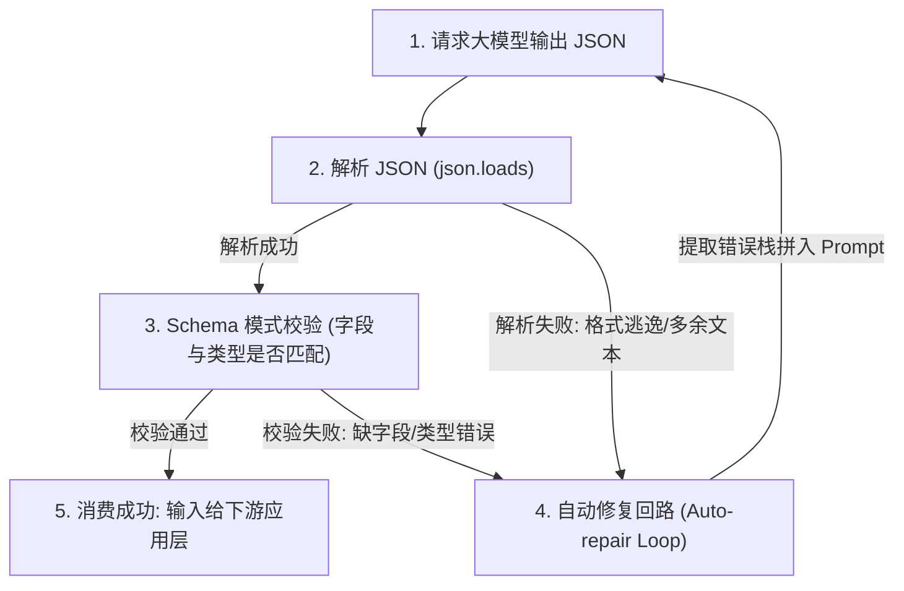
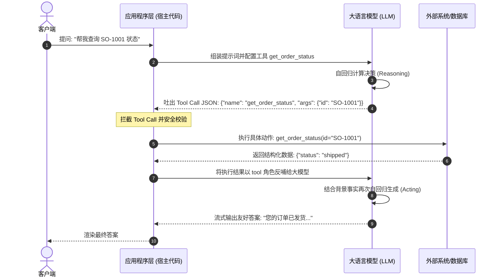
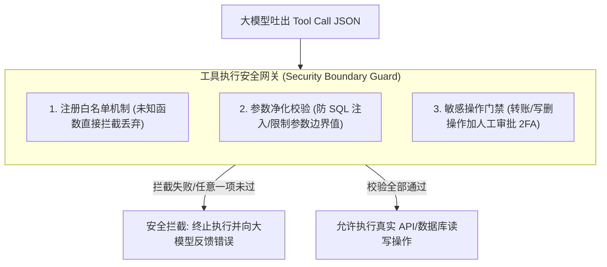

import GlossaryTerm from '@site/src/components/GlossaryTerm';
import GuidedExercise from '@site/src/components/GuidedExercise';
import ResearchNote from '@site/src/components/ResearchNote';
import ChapterMeta from '@site/src/components/ChapterMeta';
import PyRunner from '@site/src/components/PyRunner';
import TradeoffExplorer from '@site/src/components/TradeoffExplorer';
import StepFlow from '@site/src/components/StepFlow';
import QuizCard from '@site/src/components/QuizCard';

# M7L6 · 结构化输出与工具调用

<ChapterMeta
  time="约 2.5 小时"
  prereqs={[{label: 'M7L4 提示工程', href: './prompting-basics'}, {label: 'L3 输入校验', href: '../foundations/input-validation'}, {label: 'M4L6 工厂', href: '../design-patterns-lld/factory-pattern'}]}
  outcome="能让 LLM 稳定输出可被程序消费的结构化数据（JSON + schema 校验 + 修复），并用工具/函数调用让模型去执行真实操作。"
  howToUse="先看“自由文本没法接进系统”的痛，再学结构化输出和工具调用，最后做 schema 校验 + 工具分发 lab。"
/>

:::tip 自由文本是给人看的，系统要的是结构化数据和动作
LLM 默认吐自由文本——人能读，但程序没法可靠地解析。要把 LLM 接进系统，需要两件事：(1) **结构化输出**——让它吐程序能解析的 JSON；(2) **工具调用**——让它能调用你的函数去查数据库、发请求、算数。这两件事，把 LLM 从"会聊天的"变成"能干活的系统组件"。
:::

## 一、"看起来对"但程序读不了

你让模型返回订单信息，它回："好的，订单 SO-1001 的金额是 500 元，状态是已发货 😊"。人能看懂，但你的代码要从这句话里**可靠地**抠出金额和状态？措辞每次都变、可能加表情、可能漏字段——正则和字符串解析会脆得一塌糊涂。系统需要的是 `{"order_no":"SO-1001","amount":500,"status":"shipped"}` 这种**契约明确、可校验**的结构化数据（[呼应 L3 校验](../foundations/input-validation)、[L2 契约](../foundations/modules-and-contracts)）。

## 二、三个核心概念（分层）

### 基础：结构化输出 + schema 校验

<GlossaryTerm term="Structured Output" definition="结构化输出：让 LLM 按预定义的格式（通常是 JSON，符合某个 schema）输出，使结果能被程序可靠解析和校验，而非自由文本。">结构化输出</GlossaryTerm>：在 prompt 里规定输出格式（[M7L4](./prompting-basics)），很多 API 还支持强制 JSON 模式 / 按 schema 约束输出。但**模型不保证 100% 合规**——所以拿到输出后必须做<GlossaryTerm term="Schema Validation" definition="模式校验：用预定义的 schema（字段、类型、取值范围）检查 LLM 输出是否合法。不合法则拒绝、重试或修复，绝不能直接信任模型输出。">schema 校验</GlossaryTerm>：字段齐不齐、类型对不对、取值在不在允许范围。校验失败就重试或修复，**绝不直接信任**（[L3 不信任输入](../foundations/input-validation) 的延伸——LLM 输出也是不可信输入）。



### 进阶：工具调用（function calling）

<GlossaryTerm term="Tool Calling" definition="工具调用 / 函数调用：你向模型描述一组可用的工具（函数名、参数 schema），模型在需要时输出“调用哪个工具、传什么参数”，由你的代码执行后把结果回传给模型。让 LLM 能查数据、做动作。">工具调用（function calling）</GlossaryTerm>：你告诉模型"你有这些工具可用"（每个工具有名字 + 参数 schema），模型在需要时**不直接回答，而是输出"我要调 `get_order(order_no='SO-1001')`"**。你的代码执行这个调用、把结果回传给模型、它再继续。这让 LLM 能查数据库、调 API、算数——突破"只会基于训练知识空谈"的限制。注意：**模型只是"决定调什么"，真正执行的是你的代码**——所以工具的权限、校验、安全由你把关。



### 深入（选学）：工具调用的工程要点

工具调用是 [Agent（Month 9）](../agent-architectures/overview) 的基础，工程上要注意：
- **工具描述就是给模型的"API 文档"**：名字、用途、参数 schema 要写清楚（像给人写文档），模型才知道何时用、怎么传参。这是一种特殊的 [prompt 工程](./prompting-basics)。
- **参数也要校验**：模型可能传错参数类型/缺参/传危险值——执行前必须按 schema 校验（[L3](../foundations/input-validation)），就像校验任何外部输入。
- **工具要安全、最小权限**：模型决定调用、你的代码执行——所以**危险操作（删数据、转账、发邮件）必须加权限校验、人工确认、审计**，绝不能让模型的输出直接触发不可逆动作（[呼应 M6L11 工业 AI 边界](../cloud-enterprise-industrial/industrial-edge-realtime Ganz)）。
- **多工具分发**：用一个注册表把"工具名 → 实现"映射起来（[正是 M4L6 工厂/注册表](../design-patterns-lld/factory-pattern)），按模型选的名字分发执行。
- **错误处理**：工具执行失败（查不到、超时）要把错误回传给模型，让它换策略或如实告知——而不是崩溃。



<ResearchNote
  title="结构化输出与工具调用：让 LLM 可被系统消费、可执行动作"
  source="Anthropic / OpenAI 的 tool use / function calling 文档；JSON Schema；ReAct（Yao et al., 2022，推理+行动）"
  href="https://docs.anthropic.com/en/docs/build-with-claude/tool-use"
  insight="结构化输出（JSON + schema）让 LLM 的结果能被程序可靠消费；工具调用让模型输出“调用哪个工具、传什么参数”，由宿主代码执行并回传结果。两者把 LLM 从自由对话变成可编排的系统组件，是 Agent 的基础。模型负责决策，执行与安全由代码把关。"
  application="凡是要把 LLM 输出接进系统：要求结构化输出 + 严格 schema 校验（失败重试/修复，绝不盲信）。要让模型查数据/做动作：用工具调用 + 参数校验 + 最小权限 + 危险操作人工确认 + 审计。工具分发用注册表（工厂模式）。"
/>

## 三、跟我做一遍：schema 校验 + 工具分发

为了让大家更直观地体验用户通过 LLM 工具调用（ReAct 循环）解决问题的交互链路，下面是一个交互式步骤演示：

<StepFlow
  steps={[
    {
      title: '步骤 1: 用户输入与请求拦截',
      desc: '用户在界面提问：“帮我查看我的订单 SO-1001 发货没有”。应用程序捕获该请求。'
    },
    {
      title: '步骤 2: 大模型决策工具调用 (Reasoning)',
      desc: '模型分析语义，确定自己无法直接获取实时数据库，决定调用工具。输出特定的 JSON 动作指示：`{"name": "get_order_status", "args": {"id": "SO-1001"}}`。'
    },
    {
      title: '步骤 3: 系统层白名单与参数防注入校验',
      desc: '系统层（宿主代码）拦截该 JSON。首先检查 `get_order_status` 是否处于已注册工具白名单中；随后对参数 `id` 进行参数化查询和 SQL 注入防范过滤。'
    },
    {
      title: '步骤 4: 执行物理数据库调用与结果反哺',
      desc: '安全校验通过，宿主代码连接真实的订单数据库。查询得出订单状态为 `{"status": "shipped", "date": "2026-07-07"}`。随后，系统将该 JSON 作为 tool 结果回传给模型。'
    },
    {
      title: '步骤 5: 模型汇总生成最终友好解答 (Acting)',
      desc: '模型获得事实证据，结合上下文信息自回归生成。输出：“您的订单 SO-1001 已经于今天（7月7日）完成发货，请您注意查收。”'
    }
  ]}
/>

<PyRunner
  rows={38}
  expect="校验通过并执行工具"
  code={`# ---- 1) 结构化输出 + schema 校验：绝不盲信模型输出 ----
def validate_order(obj):
    errors = []
    if not isinstance(obj.get("order_no"), str): errors.append("order_no 缺失/类型错")
    if not isinstance(obj.get("amount"), (int, float)): errors.append("amount 缺失/类型错")
    if obj.get("status") not in ("pending", "shipped", "done"): errors.append("status 非法")
    return (len(errors) == 0, errors)

good = {"order_no": "SO-1001", "amount": 500, "status": "shipped"}
bad = {"order_no": "SO-1001", "amount": "五百", "status": "已发货"}
print("合法输出:", validate_order(good))
print("非法输出:", validate_order(bad))    # 校验拦下，触发重试/修复

# ---- 2) 工具调用：模型“决定调什么”，你的代码执行（注册表分发 = M4L6 工厂）----
def get_order(order_no): return {"order_no": order_no, "amount": 500, "status": "shipped"}
def get_weather(city): return {"city": city, "temp": 22}

TOOLS = {"get_order": get_order, "get_weather": get_weather}

def dispatch(tool_call):
    name, args = tool_call["name"], tool_call["args"]
    if name not in TOOLS:
        return {"error": "未知工具: " + name}     # 安全：只允许注册过的工具
    try:
        return TOOLS[name](**args)
    except TypeError as e:
        return {"error": "参数错误: %s" % e}       # 参数校验/错误处理

# 模型输出的“工具调用”（实际由模型生成，这里模拟）
print(dispatch({"name": "get_order", "args": {"order_no": "SO-1001"}}))
print(dispatch({"name": "get_weather", "args": {"city": "上海"}}))
print(dispatch({"name": "drop_table", "args": {}}))   # 未注册 -> 拒绝
print("校验通过并执行工具")`}
/>

结构化输出必须过 schema 校验（拦下"五百"和"已发货"这种脏数据）；工具调用用注册表分发、只允许注册过的工具、参数出错有兜底。**试试**：给 `get_order` 传错参数名（如 `id` 而非 `order_no`），看错误被捕获回传而非崩溃；想想 `drop_table` 这种危险工具该怎么加权限/确认。

## 四、动手 Lab（必做）

打开 `labs/month07/m7l6_structured_tools/`：

```bash
python labs/month07/m7l6_structured_tools/test_structured.py
```

实现 schema 校验 + 工具注册分发：校验结构化输出、只执行注册工具、参数错误兜底、未知工具拒绝。

<GuidedExercise
  title="练习指引：实现结构化校验 + 工具分发"
  goal="把“校验 LLM 输出 + 安全地分发工具调用”做成代码——LLM 接进系统的两块基石。"
  hints={[
    'validate：逐字段检查存在性、类型、取值范围，返回 (ok, errors)。',
    'TOOLS 注册表把工具名映射到函数（M4L6 工厂/注册表）。',
    'dispatch：未知工具拒绝；参数错误捕获返回错误，不崩溃。',
    '把 LLM 输出当不可信输入（L3）：先校验再用。'
  ]}
  steps={[
    '实现 validate_order(obj)：字段/类型/取值校验。',
    '实现 TOOLS 注册表与 dispatch(tool_call)。',
    '未知工具拒绝、参数错误兜底。',
    '写测试：合法输出过、非法输出被拦、已注册工具执行、未知工具拒绝、参数错误不崩溃。'
  ]}
  checks={[
    '你能让 LLM 输出结构化并严格校验。',
    '你的工具分发只执行注册工具、参数有兜底。',
    '你能说出工具调用里“模型决策 vs 代码执行”的分工。',
    '你理解危险工具要加权限/确认/审计。'
  ]}
/>

## 架构师深潜（Staff+ 视角）

### 1. 让 LLM 输出可被系统消费的手段

<TradeoffExplorer
  title="获取可消费输出的方式"
  dimensions={['可靠性', '实现简单', '灵活性', '需校验', '适合复杂结构']}
  options={[
    {
      name: '解析自由文本',
      scores: [1, 2, 3, 5, 1],
      note: '从自然语言里抠数据。极脆、措辞一变就崩。',
      whenToUse: '几乎从不——除非临时探索。'
    },
    {
      name: 'Prompt 要求 JSON + 校验',
      scores: [4, 4, 5, 5, 4],
      note: '提示规定格式 + 拿到后 schema 校验/修复。通用、可靠性好。',
      whenToUse: '大多数结构化输出场景。'
    },
    {
      name: '原生结构化输出/约束解码',
      scores: [5, 3, 3, 4, 5],
      note: 'API 强制按 schema 生成。最可靠，但依赖模型/接口支持、灵活性略低。',
      whenToUse: '需要强格式保证、接口支持时——优先用。'
    }
  ]}
/>

### 2. 工具调用是 LLM 通向"能做事"的桥

纯 LLM 只能基于训练知识"说"，不能"做"，也不知道实时信息。工具调用打破这个边界：能查数据库（实时数据）、调 API（[呼应 RAG Month 8 检索](../rag/overview)）、执行计算、操作系统。这是从"聊天机器人"到"[Agent（Month 9）](../agent-architectures/overview)"的关键一跃——Agent 本质就是"LLM 在循环里反复决策调用工具"。但要牢记分工：**模型负责"决定调什么"，你的代码负责"安全地执行"。** 所有安全、权限、校验、审计都在代码侧，绝不能因为"是 AI 决定的"就放松——这正是 [M6/M11 治理](../production-ai-platform/overview) 的核心。

### 3. 真实案例：盲信 LLM 输出的事故

常见翻车：直接把模型返回的 JSON `json.loads` 后就用，结果模型偶尔多输出一句解释、或字段名拼错、或编造了枚举值，导致下游解析崩溃或写入脏数据。更严重的是工具调用不设防——让模型的输出直接拼进 SQL（发生 <GlossaryTerm term="SQL Injection" definition="SQL 注入：一种将恶意 SQL 代码拼入输入中，以控制数据库执行非授权操作的攻击手段。大模型的工具参数必须参数化或强校验以防止此类注入风险。">SQL注入</GlossaryTerm>）、直接触发删除/支付。**铁律：LLM 输出是不可信输入**（[L3](../foundations/input-validation)），结构化输出要校验、工具参数要校验、危险动作要人工确认。把模型当成一个"很聪明但可能犯错、甚至可能被用户诱导"的下游，用工程手段把它的输出收口到安全范围。

### 4. 架构师深问（给自己 30 分钟）

- 你的功能怎么从 LLM 拿结构化数据？有没有 schema 校验？校验失败怎么办（重试/修复/降级）？
- 你给模型开放了哪些工具？每个工具的权限够小吗？危险工具有没有人工确认和审计？
- 用户输入会通过工具参数流到你的系统吗？怎么防注入（参数校验、参数化查询、最小权限）？

## 自检清单

- [ ] 我能让 LLM 输出结构化并严格 schema 校验。
- [ ] 我的 lab 工具分发安全（只执行注册工具、参数兜底）。
- [ ] 我能说出工具调用里模型决策与代码执行的分工。
- [ ] 我把 LLM 输出当不可信输入、危险工具加防护。

## 常见误解

- **"让模型输出 JSON 就够了"**：模型不保证合规，必须 schema 校验 + 失败处理。
- **"工具调用是模型自己执行"**：模型只决定调什么，执行和安全在你的代码。
- **"AI 决定的就可信"**：LLM 输出是不可信输入，危险动作要校验 + 人工确认 + 审计。
- **"既然工具调用支持查数据库和调外部 API，这意味着大模型已经拥有了高度危险的系统操作权限，必须在服务器物理隔离"**：错。这属于对工具调用的典型心理恐慌。工具调用的核心本质是**模型只出主意（输出参数 JSON），程序执行动作（代码中执行）**。大模型没有独立执行网络请求或数据库写入的能力。所有的系统权限、认证 Token 和安全阻断完全控制在你的**本地工程代码**中。你可以极其自由地在本地代码中对大模型“想要做的事”进行细粒度的参数拦截、白名单过滤和人工二步确认（2FA），从而在大模型与真实系统之间建立一道无坚不摧的隔离防火墙。

## 常见误解自测

<QuizCard
  questions={[
    {
      q: '为什么说在架构上，“大模型吐出的 JSON 数据”必须与来自互联网的外部用户输入一样，被当作“不可信输入（Untrusted Input）”对待？',
      options: [
        '因为大模型的输出是非结构化的自由文本，无法用标准代码解析。',
        '因为大模型是基于概率生成的，即使在 Prompt 中做出了 100% 格式约定，依然会发生“格式逃逸”或者字段编造。如果不加 Schema 校验就直接传递给下游（例如直接解析存库），极易导致下游崩溃或产生脏数据。因此必须使用 JSON Schema 等工具进行硬校验并配置自动修复回路。',
        '因为大模型会主动通过输出 JSON 来对我们的应用服务器进行 SQL 注入和端口扫描攻击。'
      ],
      answer: 1,
      explain: '大模型输出包装依然是不可信的生成结果，属于输入校验（Input Validation）思想的自然延伸。只有在宿主代码层对输出进行强类型的格式校验与清洗，才能确保核心业务系统的逻辑安全。'
    },
    {
      q: '在 Tool Calling（工具调用）生命周期中，关于大模型与宿主应用程序代码（App Code）之间的职责分工，以下描述正确的是？',
      options: [
        '大模型负责安全隔离和执行，App Code 仅负责收集用户的初始提问。',
        '大模型完全基于其生成决策负责“决定使用哪个工具、并组装参数 JSON”；而宿主 App Code 才是工具的真正“执行者”，并全权承担参数防注入校验、白名单控制和安全审批。',
        '大模型在决定调用工具后，会自动在后台通过 Python 的 eval 函数直接解释运行对应工具。'
      ],
      answer: 1,
      explain: '模型不具备自主计算和与现实世界物理交互的能力，它只是一个“决策大脑”。真正的执行动作、安全隔离、异常捕获完全掌控在工程师手写的宿主代码中。'
    },
    {
      q: '如果一个 Agent 系统包含“重置数据库”或“给用户转账 $1000”这类的敏感高危工具，架构师该如何构筑安全防线以避免模型因提示词注入攻击产生灾难性决策？',
      options: [
        '在 System Prompt 中使用大写字母写上 5 遍“绝对不允许误调用转账工具”。',
        '不在大模型侧进行任何防备，相信模型一定会根据上下文做出理性判断。',
        '对敏感工具采用“最小权限”设计，并且在宿主 App Code 执行该工具前强行引入“人工确认门禁（Human-in-the-loop）”，要求用户进行二次弹窗确认（或 2FA 校验），从而将最终决定权归还给人类。'
      ],
      answer: 2,
      explain: '对于有副作用（Side Effects）的高危敏感操作，绝对不能单点依赖模型的概率生成。必须在物理代码层构筑门禁防线，引入人工确认，实现 Human-in-the-loop（人机协同守卫），这是工业 AI 应用的安全底线。'
    }
  ]}
/>

## 延伸阅读

- [Anthropic: Tool use](https://docs.anthropic.com/en/docs/build-with-claude/tool-use)
- [ReAct: Synergizing Reasoning and Acting (2022)](https://arxiv.org/abs/2210.03629)
- [下一课：KV cache 与推理服务](./kv-cache-serving)
