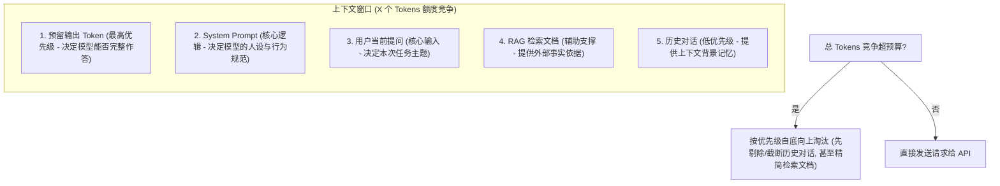
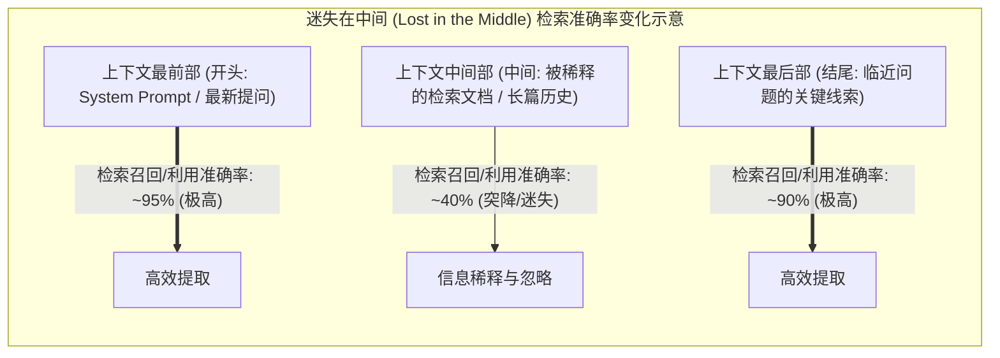

import GlossaryTerm from '@site/src/components/GlossaryTerm';
import GuidedExercise from '@site/src/components/GuidedExercise';
import ResearchNote from '@site/src/components/ResearchNote';
import ChapterMeta from '@site/src/components/ChapterMeta';
import PyRunner from '@site/src/components/PyRunner';
import TradeoffExplorer from '@site/src/components/TradeoffExplorer';
import StepFlow from '@site/src/components/StepFlow';
import QuizCard from '@site/src/components/QuizCard';

# M7L2 · 分词与上下文窗口

<ChapterMeta
  time="约 2 小时"
  prereqs={[{label: 'M7L1 自回归生成', href: './transformer-autoregression'}, {label: 'L15 性能与延迟', href: '../foundations/performance-and-latency'}]}
  outcome="能解释分词（tokenization）、为什么 token≠字符≠词、上下文窗口是什么，并在 token 预算下对输入做截断/取舍。"
  howToUse="先看“为什么按 token 算钱”，再理解分词和上下文窗口，最后做 token 预算截断 lab。"
/>

:::tip token 是 AI 系统的“三合一单位”：容量、成本、延迟
你给模型的每一样东西——system prompt、历史对话、检索到的文档、用户问题、模型的输出——最终都变成 token。**token 数决定了能不能装下（上下文窗口）、花多少钱（按 token 计费）、要等多久（[逐 token 生成 M7L1](./transformer-autoregression)）。** 所以管理 token，是 LLM 工程的核心功夫之一。
:::

## 一、为什么是"按 token"而不是"按字"

你可能以为模型按字符或单词处理文本，其实都不是。模型用一套固定的<GlossaryTerm term="Tokenizer" definition="分词器：把文本切成 token 序列（再映射成数字 ID）的组件。常用子词算法（如 BPE），常见词是一个 token，生僻词被拆成多个，英文一个 token 约 4 个字符，中文常一字一或多 token。">分词器（tokenizer）</GlossaryTerm>把文本切成 token。规律：常见词往往是一个 token，生僻词/长词被拆成几个 token，标点和空格也算。粗略地说，**英文约 4 个字符 ≈ 1 个 token，中文常常 1 个字 ≈ 1～2 个 token**。所以"按 token 计费"比按字符或按词更贴近模型真实的计算量。


## 二、三个核心概念（分层）

### 基础：分词（tokenization）

<GlossaryTerm term="Tokenization" definition="分词：把文本切分成模型能处理的 token 序列的过程。主流用子词（subword）算法如 BPE，在“词表大小”和“序列长度”间取平衡：常见词整体成 token，罕见词拆成子词片段。">分词</GlossaryTerm>主流用**子词（subword）**算法（如 BPE）：在"词表别太大"和"序列别太长"之间折中——常见词整体作一个 token，罕见词拆成子词片段（所以模型也能处理没见过的词）。关键工程含义：**同样一句话，不同语言、不同写法的 token 数差别很大**（中文、代码、JSON 往往比等长英文耗更多 token），这直接影响你的成本和能塞进多少内容。

### 进阶：上下文窗口是"工作记忆"上限

<GlossaryTerm term="Context Window" definition="上下文窗口：模型一次推理能接收的最大 token 数（输入 + 输出共享或分别计）。它是模型的“工作记忆”上限，超出部分必须靠截断、摘要或检索来取舍。">上下文窗口（context window）</GlossaryTerm>是模型一次能"看到"的 token 总量上限。它不是无限记忆——**所有要给模型的内容必须塞进这个窗口**：system prompt + 历史 + 检索资料 + 用户问题 + 预留给输出的空间。窗口满了，就得做取舍（截断旧对话、摘要、只放最相关的资料）。现代模型窗口越来越大（几十万 token），但"大"不等于"该塞满"——见深入。



### 深入（选学）：token 预算与"大窗口不等于随便塞"

把上下文当成一个有限预算来管理：
- <GlossaryTerm term="Token Budget" definition="token 预算：为一次调用分配的 token 上限，需在 system prompt、历史、检索内容、用户输入、输出预留之间分配。超预算要靠截断、摘要、检索筛选来取舍。">token 预算</GlossaryTerm>：明确给各部分分配额度，留足输出空间，超了按优先级裁剪（如先砍最旧对话）。
- **大窗口的三个代价**：(1) **更贵**——按 token 收费，塞满几十万 token 一次调用很烧钱；(2) **更慢**——注意力随长度增长（[M7L1](./transformer-autoregression)）；(3) <GlossaryTerm term="Lost in the Middle" definition="“迷失在中间”：研究发现模型对超长上下文里中间位置的信息利用较差，开头和结尾的信息更容易被用上。所以塞太多无关内容反而稀释了关键信息。">迷失在中间</GlossaryTerm>——塞太多无关内容会稀释关键信息、模型反而抓不住重点。
- 所以正解不是"窗口够大就把所有文档塞进去"，而是**只放与当前任务最相关的内容**——这正是 <GlossaryTerm term="RAG" definition="检索增强生成 (Retrieval-Augmented Generation, RAG)：通过检索外部知识库获取与问题相关的证据片段，再将其作为前文塞入 LLM 上下文窗口以指导生成。">RAG（Month 8）</GlossaryTerm> 的核心价值：把"所有材料"变成"最相关的证据"。
- 输出长度也吃预算且最贵（[输出 token 串行生成 M7L1](./transformer-autoregression)）——能让模型只输出必要结果就别让它长篇大论。



<ResearchNote
  title="分词与上下文：LLM 工程的容量与成本基础"
  source="Sennrich et al. (2016), BPE 子词分词；Liu et al. (2023), Lost in the Middle"
  href="https://arxiv.org/abs/2307.03172"
  insight="子词分词（BPE 等）在词表大小与序列长度间取平衡，是现代 LLM 的标准输入处理。上下文窗口是硬上限；研究还发现模型对长上下文“中间位置”的信息利用较弱（Lost in the Middle），说明“塞得多”不等于“用得好”。"
  application="按 token（而非字符/词）估算容量和成本；为不同语言/格式（中文、代码、JSON 更耗 token）留余量。把上下文当预算分配，留足输出空间，超了按优先级裁剪。优先放最相关内容（靠 RAG 筛选）而非塞满窗口——既省钱又避免“迷失在中间”。"
/>

## 三、跟我做一遍：token 预算下的上下文拼装

为了让大家更直观地体验 token 预算下的上下文裁剪逻辑，下面是一个交互式步骤演示：

<StepFlow
  steps={[
    {
      title: '步骤 1: 预算初始化与预留',
      desc: '总上下文窗口限制为 100 Token。首先为模型输出保留 20 Token 额度。此时输入可用预算还剩 80 Token。'
    },
    {
      title: '步骤 2: 拼装最高优先级内容',
      desc: '载入 system 提示词（15 Tokens）和 user_question 当前问题（25 Tokens）。已占用 40 Tokens，剩余预算：40 Tokens。'
    },
    {
      title: '步骤 3: 拼装中等优先级内容',
      desc: '载入检索到的文档 retrieved_doc（30 Tokens）。已占用 70 Tokens，剩余预算：10 Tokens。'
    },
    {
      title: '步骤 4: 评估并淘汰低优先级内容',
      desc: '尝试载入历史对话 old_history（需 50 Tokens）。由于剩余预算仅剩 10 Tokens，无法完整装下。上下文组装器执行淘汰策略，截断或放弃老旧历史。'
    },
    {
      title: '步骤 5: 生成最终拼装上下文',
      desc: '拼装完成，最终向 API 发送 system + user_question + retrieved_doc，总大小为 70 Tokens，完美运行在安全预算内。'
    }
  ]}
/>

<PyRunner
  rows={34}
  expect="按预算裁剪、保住关键内容"
  code={`# 简化 token 估算：英文约 4 字符/token，中文约 1.5 字符/token（粗略）
def est_tokens(text):
    cn = sum(1 for c in text if ord(c) > 0x4e00)
    other = len(text) - cn
    return int(cn / 1.5 + other / 4) + 1

# 上下文按优先级拼装，总预算有限，超了从低优先级砍
def assemble(parts, budget):
    # parts: [(priority, name, text)]，priority 小=更重要
    kept, used = [], 0
    for prio, name, text in sorted(parts, key=lambda p: p[0]):
        t = est_tokens(text)
        if used + t <= budget:
            kept.append(name); used += t
        # 否则丢弃这块（低优先级先被丢）
    return kept, used

parts = [
    (0, "system", "你是一个严谨的客服助手，只根据资料回答。"),
    (1, "user_question", "我的订单 SO-1001 什么时候发货？"),
    (2, "retrieved_doc", "订单 SO-1001 已于今日打包，预计明天发出。" * 1),
    (3, "old_history", "用户：你好。助手：你好，有什么可以帮您？" * 20),  # 很长的旧对话
]
budget = 80
kept, used = assemble(parts, budget)
print("预算:", budget, "已用:", used)
print("保留:", kept)             # system/问题/资料留下，超预算的旧对话被砍
print("按预算裁剪、保住关键内容")`}
/>

预算有限时，按优先级保住 system、用户问题、相关资料，先砍掉最不重要的（冗长旧对话）——这就是上下文管理的雏形（[M7L8 细讲](./context-memory)）。**试试**：把 `budget` 调大到能装下旧对话；或给检索资料更高优先级，观察拼装结果变化。

## 四、动手 Lab（必做）

打开 `labs/month07/m7l2_token_budget/`：

```bash
python labs/month07/m7l2_token_budget/test_budget.py
```

实现 token 估算 + 预算内上下文拼装：按优先级保留、超预算裁剪低优先级、留足输出空间。

<GuidedExercise
  title="练习指引：实现 token 预算拼装"
  goal="把“估 token + 按优先级在预算内拼装上下文”做成代码——这是每个 LLM 应用都要做的事。"
  hints={[
    'est_tokens：粗略估算即可（中文和英文系数不同）。',
    'assemble：按优先级排序，能装下就保留、装不下就跳过（低优先级先被砍）。',
    '记得为输出预留预算（总窗口 - 输出预留 = 输入可用预算）。',
    '高优先级（system、用户问题）应总是保留。'
  ]}
  steps={[
    '实现 est_tokens(text) 粗略估算。',
    '实现 assemble(parts, budget)：按优先级在预算内拼装。',
    '（选做）加入 output_reserve 参数，从总预算中扣除。',
    '写测试：预算充足全保留、超预算砍低优先级、高优先级总保留、输出预留生效。'
  ]}
  checks={[
    '你能解释为什么按 token 而非字符/词计量。',
    '你的 lab 能在预算内按优先级拼装上下文。',
    '你能说出上下文窗口大的三个代价。',
    '你理解“塞满窗口”不如“放最相关内容”。'
  ]}
/>

## 架构师深潜（Staff+ 视角）

### 1. 上下文不够用时怎么办

<TradeoffExplorer
  title="超出上下文窗口的应对"
  dimensions={['保真度', '成本', '实现复杂度', '适合长历史', '适合大知识库']}
  options={[
    {
      name: '截断（丢旧内容）',
      scores: [2, 5, 5, 3, 1],
      note: '简单粗暴丢掉超出部分。省钱省事，但会丢信息。',
      whenToUse: '历史不重要、或只关心最近内容时。'
    },
    {
      name: '摘要压缩',
      scores: [3, 3, 3, 5, 2],
      note: '把旧内容摘要成短文再保留。省 token、留主旨，但摘要会丢细节、要额外调用。',
      whenToUse: '长对话需要保留大意时（M7L8）。'
    },
    {
      name: '检索（RAG）',
      scores: [5, 4, 2, 3, 5],
      note: '只取与当前问题最相关的片段放进上下文。保真、可扩展到海量知识。但要建检索系统。',
      whenToUse: '知识库远大于窗口时——Month 8 主题。'
    }
  ]}
/>

### 2. token 经济学是 AI 系统的成本核心

传统系统的成本单位是 CPU/内存/带宽；LLM 系统多了一个**主导性的成本单位：token**。一次调用的成本 ≈ 输入 token × 输入单价 + 输出 token × 输出单价（输出通常更贵，因为[串行生成 M7L1](./transformer-autoregression)）。这意味着架构师要像优化数据库查询那样优化 token：**精简 prompt、压缩历史、只检索最相关内容、缓存重复内容、选对模型档位、控制输出长度。** 一个高频 AI 功能，token 用量优化好坏可能差几倍成本——这是 [M7L5 成本](./llm-api-cost-latency) 和 [M7L11 缓存](./llm-caching-resilience) 的基础。

### 3. 真实案例：大窗口的"甜蜜陷阱"

模型厂商不断推出更大的上下文窗口（从几千到几十万甚至上百万 token），很多团队的第一反应是"太好了，把所有文档都塞进去，不用做 RAG 了"。这是个甜蜜陷阱：塞满大窗口**又慢又贵**，还会"迷失在中间"导致效果不升反降。成熟的做法仍是 **RAG 精选 + 适度上下文**，大窗口用来"放下足够多的相关证据"而非"放下全部"。架构师要抵制"窗口够大就偷懒"的诱惑，理解大窗口是放宽了约束、不是取消了约束。

### 4. 架构师深问（给自己 30 分钟）

- 估算你的 LLM 功能一次调用的 token 构成：system/历史/检索/问题/输出各占多少？哪块最该压缩？
- 你的内容里有中文/代码/JSON 吗？它们比等长英文多耗多少 token？对成本影响多大？
- 如果对话很长，你用截断、摘要还是检索来管理历史？各自会丢什么、省多少？

## 自检清单

- [ ] 我能解释分词、为什么 token≠字符≠词。
- [ ] 我能说清上下文窗口是什么、要装哪些东西。
- [ ] 我的 lab 能在 token 预算内按优先级拼装上下文。
- [ ] 我理解大窗口的代价（贵/慢/迷失在中间）。

## 常见误解

- **"token 就是单词"**：是子词单位，常见词一个 token、生僻词拆多个，中文/代码更耗 token。
- **"上下文窗口 = 无限记忆"**：是硬上限，超了必须截断/摘要/检索取舍。
- **"窗口大就把所有资料塞进去"**：又贵又慢还会迷失在中间，应只放最相关内容。
- **"既然模型厂商把上下文窗口做到了 100 万 (1M) token，说明 RAG（检索增强生成）技术已经过时了，我们不需要再做知识库检索"**：错。100 万 token 确实能装下多本长篇小说，但大窗口并不意味着你应该装满它。首先，输入 100 万 token 产生的 API 成本极其高昂，且单次请求的 TTFT（首包延迟）和计算时长会变得无法忍受。其次，根据“迷失在中间”现象，模型在海量上下文中极难精准捕捉中间位置的某一条关键线索。RAG 的本质是**信息过滤与精选**，即使在大窗口时代，RAG 也是保证高响应速度、低成本、高利用精度的核心手段。

## 常见误解自测

<QuizCard
  questions={[
    {
      q: '为什么同样的中文文本在分词后产生的 Token 数量往往明显多于等长度的英文文本？',
      options: [
        '因为中文每个字包含的笔画比英文英文字母多，导致计算机处理时的字符占用大。',
        '输入中文由于词汇密度高、且在词表中的覆盖率相对较低，常常需要将 1 个汉字拆分为 1 到 2 个 Token，甚至生僻汉字需要拆分为多个 Token，导致中文的“Token 乘数”更高。',
        '因为大模型的 API 计费系统故意调高了中文的 Token 算法以进行商业限制。'
      ],
      answer: 1,
      explain: '这与分词器的词表（Vocabulary）设计有关。BPE 词表中英文单词覆盖全，而中文往往需要被切成单字或偏旁部首组合，因此在计算 token 时，中文的密度远高于英文，这也是为什么中文调用 LLM 成本通常更高。'
    },
    {
      q: '当大模型的上下文窗口满了以后，以下哪种管理上下文的方法能在高保真度的前提下，最适合扩展到远超窗口容量的超大型知识库？',
      options: [
        '截断法（直接丢弃旧的上下文内容，只保留最新输入）。',
        '摘要压缩法（每次调用前，调用另一个轻量模型把超出部分进行摘要浓缩）。',
        '检索增强生成（RAG）技术（通过向量检索只选出最相关的几百个 Token 证据，精准塞入当前上下文窗口）。'
      ],
      answer: 2,
      explain: 'RAG 允许我们在数亿字的庞大知识库中，通过向量检索只挑出最精确的证据片段。这既保护了原文档的细节（保真度高），又极大地节省了 Token 开销（比塞满大窗口更便宜、更快）。'
    },
    {
      q: '如何理解“迷失在中间 (Lost in the Middle)”这一大模型架构中的工程痛点？',
      options: [
        '模型在推理到一半时会因为 GPU 显存溢出而自动中断运行。',
        '当输入上下文非常长时，模型更容易关注并提取开头（System Prompt、早前输入）和结尾（临近的提问）的信息，而对位于输入序列中段（中间位置）的信息抓取能力会大幅度下降。',
        '如果用户在对话过程中修改了问题，模型会产生混乱而导致输出格式损坏。'
      ],
      answer: 1,
      explain: 'Liu et al. (2023) 的研究证明了这一点。当输入的上下文越长，模型对其两端（开头和结尾）信息的记忆越清晰，而对深埋在中间的文档细节提取准确率会形成一条“U型曲线”下降。因此，控制上下文长度，并将最重要的内容放在两端是优化 prompt 结构的关键。'
    }
  ]}
/>

## 延伸阅读

- [Lost in the Middle (2023)](https://arxiv.org/abs/2307.03172)
- [Byte Pair Encoding (Sennrich et al., 2016)](https://arxiv.org/abs/1508.07909)
- [下一课：采样与解码](./sampling-decoding)
