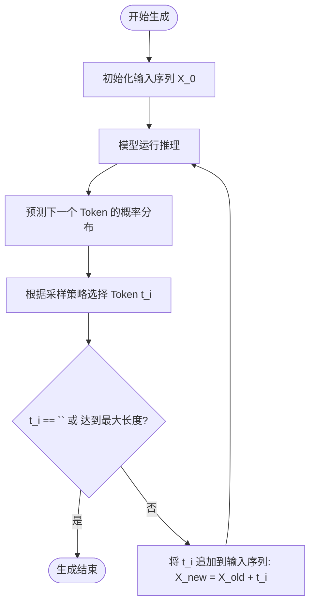
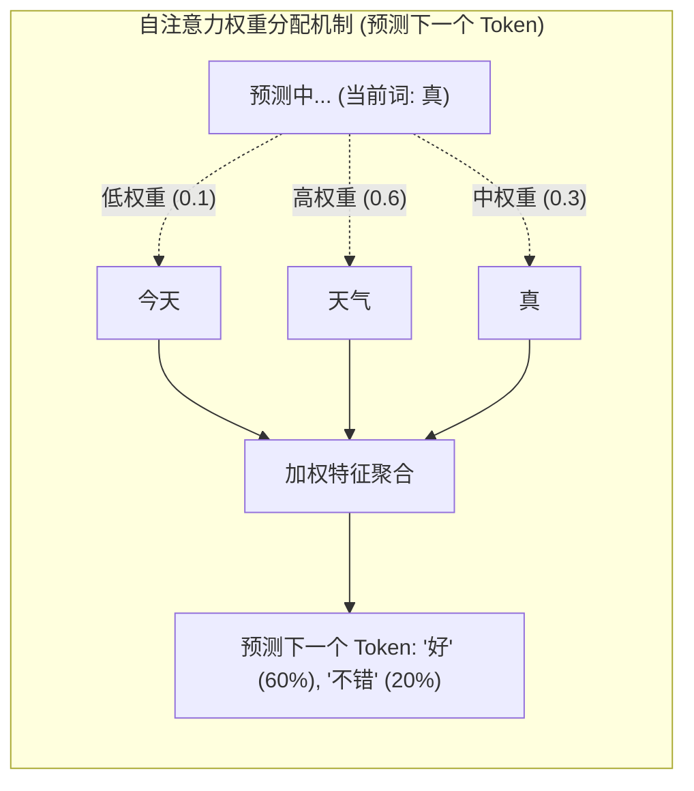
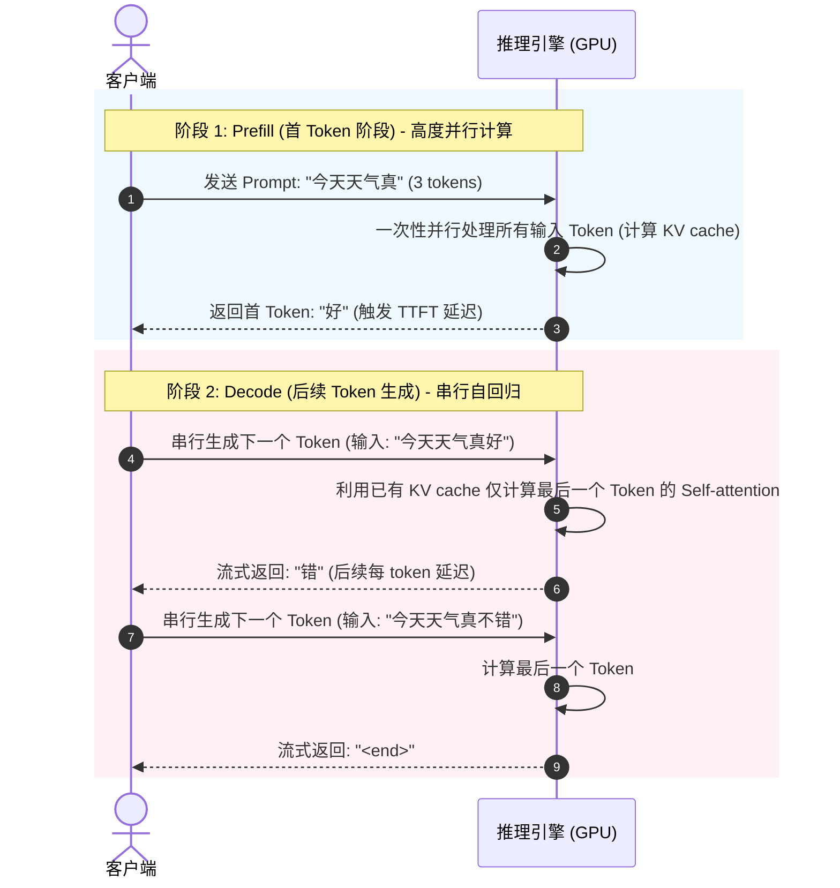

import GlossaryTerm from '@site/src/components/GlossaryTerm';
import GuidedExercise from '@site/src/components/GuidedExercise';
import ResearchNote from '@site/src/components/ResearchNote';
import ChapterMeta from '@site/src/components/ChapterMeta';
import PyRunner from '@site/src/components/PyRunner';
import TradeoffExplorer from '@site/src/components/TradeoffExplorer';
import StepFlow from '@site/src/components/StepFlow';
import QuizCard from '@site/src/components/QuizCard';

# M7L1 · Transformer 与自回归生成

<ChapterMeta
  time="约 2.5 小时"
  prereqs={[{label: '完成 Month 1-6', href: '../cloud-enterprise-industrial/overview'}, {label: 'ChatGPT 架构案例', href: '../atlas/chatgpt'}]}
  outcome="能用“逐 token 预测下一个”的自回归模型解释 LLM 的生成过程，理解注意力的直觉，并由此推出延迟、流式输出、上下文依赖等工程性质。"
  howToUse="先破除“LLM 在思考”的误解，再理解自回归生成，最后做一个能跑的 next-token 生成器 lab。"
/>

:::tip LLM 没有在“思考”，它在做一件极简单的事：猜下一个 token
祛魅是理解 LLM 的第一步。再强的大模型，核心动作只有一个：**给定前面所有 token，预测下一个最可能的 token，然后把它接上去，再预测下一个……** 周而复始。这叫自回归（autoregressive）生成。看懂这一点，LLM 的延迟、流式输出、为什么会"顺着说下去甚至越说越偏"，全都解释得通。
:::

## 一、一个会接龙的概率机器

把一句话喂给 LLM："今天天气真"，它会算出下一个 token 的概率分布："好"(60%)、"不错"(20%)、"糟"(5%)……选一个（比如"好"），接上去变成"今天天气真好"，再以此为输入预测下一个 token。**它不是先想好整句话再输出，而是一个 token 一个 token 地、基于前文滚动生成。** 这个朴素的"接龙"机制，配上海量参数 and 训练，就涌现出了看似智能的能力——但底层动作始终是"预测下一个 token"。



为了让大家更直观地体验这个接龙的过程，下面是一个交互式步骤演示：

<StepFlow
  steps={[
    {
      title: '步骤 1: 初始输入',
      desc: '用户输入 Prompt: "今天"，模型将其转换为初始 Token。此时输入序列为：["今天"]。'
    },
    {
      title: '步骤 2: 预测并生成首个 Token',
      desc: '模型计算下一个 Token 的概率：“天气”(70%)、“心情”(30%)。采样选择“天气”，将其追加到前文。新序列为：["今天", "天气"]。'
    },
    {
      title: '步骤 3: 循环预测第二个 Token',
      desc: '以新序列为输入进行第二轮预测。概率分布为：“真”(60%)、“不”(40%)。采样选择“真”，追加前文。新序列为：["今天", "天气", "真"]。'
    },
    {
      title: '步骤 4: 循环预测第三个 Token',
      desc: '以新序列进行第三轮预测。概率分布为：“好”(80%)、“糟”(20%)。采样选择“好”，追加前文。新序列为：["今天", "天气", "真", "好"]。'
    },
    {
      title: '步骤 5: 结束符触发',
      desc: '对新序列进行第四轮预测。概率分布表明下一个最可能是结束符 "<end>" (100%)。生成循环正式停止，最终输出结果。'
    }
  ]}
/>

## 二、三个核心概念（分层）

### 基础：token 与自回归生成

- <GlossaryTerm term="Token" definition="token：模型处理文本的基本单位，可能是一个词、词的一部分或符号。模型的输入输出都是 token 序列，按 token 计费、按 token 限制上下文长度。">token</GlossaryTerm>：模型眼里的文本最小单位（下一课细讲）。模型读 token、吐 token。
- <GlossaryTerm term="Autoregressive Generation" definition="自回归生成：模型基于已有的全部 token 预测下一个 token，把它追加到序列后，再以新序列为输入预测下一个，循环直到结束。LLM 文本生成的基本机制。">自回归生成</GlossaryTerm>：核心循环 = `预测下一个 token → 追加 → 再预测`。每生成一个 token 都要把"目前为止的全部 token"重新过一遍模型。这直接决定了：**输出是逐字蹦出来的（所以能流式）、生成越长越慢、且每个 token 都依赖前面所有 token。**

### 进阶：注意力的直觉

Transformer 凭什么预测得准？靠<GlossaryTerm term="Self-Attention" definition="自注意力：模型在预测下一个 token 时，让当前位置“关注”输入序列中所有相关的 token，按相关性加权地聚合信息。它让模型能捕捉长距离依赖，是 Transformer 的核心。">自注意力（self-attention）</GlossaryTerm>：预测下一个 token 时，模型让当前位置**关注前文中所有相关的 token**，按相关性加权地综合信息。比如预测"它"指代谁时，注意力会聚焦到前面的那个名词。你不需要推导数学，但要记住直觉：**注意力让模型能把"前文里相关的部分"加权地纳入当前预测**——这就是它能处理长距离依赖、理解上下文的关键。



### 深入（选学）：从机制推出工程性质

把自回归 + 注意力想透，一堆工程现象就自然导出：
- **延迟 = 逐 token 串行**：生成 N 个 token 要串行跑 N 次模型，所以**输出越长越慢**；<GlossaryTerm term="TTFT" definition="首 token 延迟 (Time to First Token, TTFT)：从用户发送请求到模型输出第一个 token 的时间，取决于 Prefill 阶段处理全部输入 prompt 的并行计算时间。">首 token 延迟（TTFT）</GlossaryTerm>和后续每 token 延迟是两个不同指标（[L15 延迟](../foundations/performance-and-latency)）。


- **流式输出**：因为是一个个生成的，可以边生成边推给用户（streaming），改善体感延迟。
- **每步要看全部前文**：注意力的计算量随上下文长度增长（约平方级），所以**上下文越长越慢越贵**——这引出了 [KV cache（M7L7）](./kv-cache-serving) 这个关键优化。
- **"越说越偏"**：每个 token 基于前面已生成的 token，一旦开了个错头，后面会顺着错下去（<GlossaryTerm term="Error Accumulation" definition="错误累积：在自回归生成中，一步预测错会导致该错误被作为下一步的输入前文，从而使后面的生成越来越偏离预定轨道。">错误累积</GlossaryTerm>）——这也是为什么[采样策略（M7L3）](./sampling-decoding) 和[防护（M7L9）](./hallucination-guardrails)重要。
- **本质是概率**：它预测的是"最可能接什么"，不是"什么是对的"——这是[幻觉（M7L9）](./hallucination-guardrails)的根源。

<ResearchNote
  title="Transformer：用注意力替代循环，让序列建模可并行、可扩展"
  source="Vaswani et al. (2017), Attention Is All You Need；Radford et al., GPT 系列（decoder-only 自回归语言模型）"
  href="https://arxiv.org/abs/1706.03762"
  insight="Transformer 用自注意力替代 RNN 的循环结构，使训练能在序列上并行、并有效捕捉长距离依赖。GPT 系列用 decoder-only 架构做自回归语言建模——预测下一个 token——配合规模化，涌现出通用语言能力。生成阶段仍是逐 token 自回归的，因此推理是串行瓶颈。"
  application="架构上不必推导数学，但要吃透：生成是逐 token 自回归（决定延迟/流式/错误累积）、注意力随上下文长度增长（决定成本/KV cache 必要性）、本质是概率预测（决定幻觉与评测的必要）。这些性质贯穿后面所有 LLM 工程课。"
/>

## 三、跟我做一遍：一个能跑的自回归生成器

<PyRunner
  rows={34}
  expect="自回归逐 token 生成"
  code={`import random

# 一个极简“语言模型”：基于前一个词，预测下一个词的概率分布（bigram）
# 真实 LLM 是看“全部前文”的高维版本，但核心循环一模一样
model = {
    "今天": {"天气": 0.7, "心情": 0.3},
    "天气": {"真": 0.6, "不": 0.4},
    "真": {"好": 0.8, "糟": 0.2},
    "不": {"错": 1.0},
    "心情": {"很": 1.0},
    "很": {"好": 1.0},
    "错": {"<end>": 1.0}, "好": {"<end>": 1.0}, "糟": {"<end>": 1.0},
}

def predict_next(token, rng):
    dist = model.get(token, {"<end>": 1.0})
    r = rng.random(); cum = 0
    for tok, p in dist.items():
        cum += p
        if r <= cum:
            return tok
    return "<end>"

def generate(start, rng, max_tokens=10):
    seq = [start]
    for _ in range(max_tokens):
        nxt = predict_next(seq[-1], rng)   # 自回归：基于已生成的，预测下一个
        if nxt == "<end>":
            break
        seq.append(nxt)                    # 追加，再以新序列继续
    return seq

rng = random.Random(7)
print("生成:", "".join(generate("今天", rng)))   # 逐 token 接龙
print("再生成:", "".join(generate("今天", random.Random(42))))  # 换种子 -> 可能不同
print("自回归逐 token 生成")`}
/>

这个 bigram 玩具和真正的 LLM 共享**完全相同的核心循环**——预测下一个、追加、再预测。区别只在：真 LLM 看的是"全部前文"（而非只看前一个词）、用注意力 + 海量参数算概率。**试试**：把 `max_tokens` 调小，看生成被截断；换不同随机种子，观察同一开头生成出不同结果（这正是下一课"采样"的伏笔）。

## 四、动手 Lab（必做）

打开 `labs/month07/m7l1_autoregress/`：

```bash
python labs/month07/m7l1_autoregress/test_autoregress.py
```

实现自回归生成器：基于转移概率逐 token 生成、遇到结束符停止、达上限截断、给定种子可复现。

<GuidedExercise
  title="练习指引：实现自回归生成"
  goal="把“预测下一个 token → 追加 → 再预测”的核心循环做成代码，亲手体会 LLM 生成的本质。"
  hints={[
    'predict_next：从当前 token 的概率分布里按概率抽样下一个。',
    'generate：循环预测并追加，遇到 <end> 或达 max_tokens 停止。',
    '用注入的随机源（seed）保证可复现（测试需要确定性）。',
    '想想：为什么生成越长越慢？（每步都要再跑一次预测。）'
  ]}
  steps={[
    '实现 predict_next(token, rng)：按概率分布抽样。',
    '实现 generate(start, rng, max_tokens)：自回归循环。',
    '正确处理结束符和长度上限。',
    '写测试：固定种子结果可复现、遇 <end> 停止、达上限截断、未知 token 安全结束。'
  ]}
  checks={[
    '你能用自己的话解释自回归生成。',
    '你的生成器逐 token 生成、能停止、可复现。',
    '你能从自回归推出延迟/流式/错误累积。',
    '你能说出注意力让模型“看前文相关部分”的直觉。'
  ]}
/>

## 架构师深潜（Staff+ 视角）

### 1. 序列建模架构的演进

<TradeoffExplorer
  title="序列建模架构"
  dimensions={['长距离依赖', '训练可并行', '上下文成本', '生成速度', '通用能力']}
  options={[
    {
      name: 'RNN/LSTM（前 Transformer）',
      scores: [2, 1, 4, 3, 2],
      note: '循环结构、按时间步串行，难并行训练、长依赖易丢失。',
      whenToUse: '历史方案；某些超长/流式低资源场景仍有研究价值。'
    },
    {
      name: 'Transformer（注意力）',
      scores: [5, 5, 2, 3, 5],
      note: '注意力捕捉长依赖、训练高度并行、通用能力强。但注意力随上下文约平方级增长。',
      whenToUse: '当今 LLM 的事实标准。'
    },
    {
      name: '高效注意力/状态空间(新方向)',
      scores: [4, 4, 5, 4, 4],
      note: '试图把上下文成本从平方降到近线性（如 SSM/线性注意力）。生态仍在成熟。',
      whenToUse: '超长上下文、对成本/延迟极敏感的前沿场景。'
    }
  ]}
/>

### 2. 理解内部机制，才能做对工程决策

为什么架构师要懂自回归？因为几乎所有 LLM 工程决策都从它导出：**为什么流式能改善体感**（逐 token）、**为什么要控制输出长度**（输出 token 串行、又贵又慢）、**为什么上下文不能无限塞**（注意力平方成本）、**为什么要 KV cache**（避免重复计算前文）、**为什么会幻觉**（概率预测而非检索真相）。不懂机制的人只能试错调 prompt；懂机制的人能预判系统的成本、延迟、失败模式，从架构上解决。这正是 [ChatGPT 架构案例](../atlas/chatgpt) 里"模型架构 vs 服务架构"两条线的起点。

### 3. 真实案例：从一篇论文到一个时代

2017 年的《Attention Is All You Need》最初是为机器翻译设计的；它的 decoder-only 变体（GPT 系列）发现"把预测下一个 token 这件事做到极致 + 规模化"就能涌现通用能力，催生了 ChatGPT/Claude 等。理解这条线，你就明白：今天所有大模型，无论多强，推理时都还在做那个朴素动作——**自回归地预测下一个 token**。所有的工程挑战（延迟、成本、KV cache、批处理）都是在"如何高效地大规模做这件事"上。

### 4. 架构师深问（给自己 30 分钟）

- 用自回归解释：为什么让模型"先输出推理过程再给答案"（<GlossaryTerm term="Chain of Thought" definition="思维链 (CoT)：通过让模型生成中间推理步骤来解决复杂推理任务。由于自回归的逐 token 生成性质，它会显著增加输出 token 数，进而带来高延迟与高成本。">思维链</GlossaryTerm>）会更慢更贵？为什么也可能更准？
- 你的功能需要模型输出很长内容吗？输出 token 是串行生成的——能不能改成只输出关键结果、减少输出长度？
- 流式输出对你的产品体验重要吗？它改善的是"首 token 延迟"还是"总时长"？

## 自检清单

- [ ] 我能用自己的话解释自回归逐 token 生成。
- [ ] 我的 lab 生成器逐 token 生成、能停止、可复现。
- [ ] 我能从机制推出延迟/流式/上下文成本/错误累积/幻觉。
- [ ] 我理解注意力"加权关注相关前文"的直觉。

## 常见误解

- **"LLM 在思考/理解"**：它在基于概率预测下一个 token；表现像理解，机制是接龙。
- **"它一次性想好整句"**：它逐 token 生成，前文决定后文，会错误累积。
- **"上下文窗口大就能随便塞"**：注意力随长度约平方级增长，越长越慢越贵（下一课细讲）。
- **"既然思维链（CoT）能让模型生成更准，那么在所有场景下我们都应该默认开启思维链"**：错。思维链的原理是通过生成冗长的推理步骤（中间 token）来换取更高的准确率。但是，因为自回归推理是逐 token 串行的，多生成一个 token 就会多产生一次模型前向传播的延迟，并且按输出 token 数量计费。如果对延迟敏感（如实时搜索、聊天机器人首包时间要求高）或对成本极敏感，盲目开启思维链会使系统延迟和账单急剧上升。架构师必须在“准确率”与“延迟/成本”之间进行严谨的折中（Trade-off）。

## 常见误解自测

<QuizCard
  questions={[
    {
      q: '为什么大语言模型的文本生成无法像图像生成或目标检测那样在 GPU 上实现高度并行的输出？',
      options: [
        '因为大模型的参数量太大，GPU 显存装不下，所以必须使用 CPU 串行计算。',
        '因为大语言模型采用的是自回归（Autoregressive）生成模式。每个新 Token 的生成都必须以之前所有已生成的 Token 作为输入。这种“前文决定后文”的依赖关系导致模型只能一个 Token 接一个 Token 地串行推理，无法在输出方向上并行。',
        '因为现代网络传输协议（如 HTTP）不支持并行传输字符，只能通过 SSE 流式依次发送。'
      ],
      answer: 1,
      explain: '自回归生成的核心特征就是“逐 token 接龙”。因为第 N 个 token 的预测输入里包含第 N-1 个 token 的输出结果，这种时间步上的数据依赖（Data Dependency）决定了它在推理时必须串行。'
    },
    {
      q: '在评估 LLM 的延迟指标时，为什么通常要将“首 token 延迟 (TTFT)”和“后续每 token 延迟”分开来统计？',
      options: [
        '因为首 token 是由云端服务器计算的，而后续 token 是在客户端本地浏览器渲染的。',
        '因为 Prefill 阶段（处理用户输入的 Prompt）可以并行计算所有输入 Token 的注意力，而 Decode 阶段（自回归生成后续 Token）必须串行循环。两者的计算模式、并行度以及 GPU 利用方式完全不同，因此在架构上需要作为两个核心指标分别监控与优化。',
        '因为首 token 往往最贵，而后续 token 是免费的。'
      ],
      answer: 1,
      explain: '处理输入 prompt 时，所有 token 都是已知的，GPU 可以并行计算；而在生成后续 token 时，每次只能计算一个新 token 且要读取之前的 KV cache，属于 memory-bound 的串行计算。这两阶段的性能瓶颈 and 优化手段完全不同。'
    },
    {
      q: '从自回归生成的工程代价来看，架构师在引入思维链（CoT, Chain-of-Thought）技术时必须做出什么权衡（Trade-off）？',
      options: [
        '思维链会使模型训练速度变慢，但推理速度和成本不受影响。',
        '思维链通过生成中间推理步骤显著提升了复杂任务的准确率；但由于自回归逐 token 生成的特性，生成大量中间 token 会导致推理延迟（首尾总时间）显著上升，且 API 成本（按 token 计费）成倍增加。',
        '思维链会让模型完全失去流式输出（Streaming）的能力。'
      ],
      answer: 1,
      explain: 'CoT 是一种“用时间换空间/准确率”的典型折中。它确实能通过一步步推导得出正确答案，但代价是输出的 token 数量剧增，直接转嫁为用户体感的延迟增加以及高额的 token 计费账单。'
    }
  ]}
/>

## 延伸阅读

- [Attention Is All You Need (2017)](https://arxiv.org/abs/1706.03762)
- [The Illustrated Transformer (Jay Alammar)](https://jalammar.github.io/illustrated-transformer/)
- [ChatGPT 架构案例](../atlas/chatgpt)
- [下一课：分词与上下文窗口](./tokenization-context)