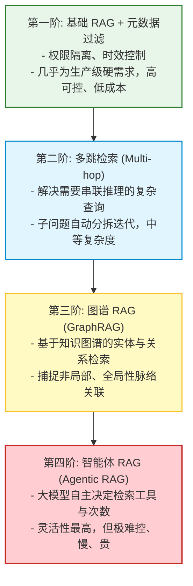
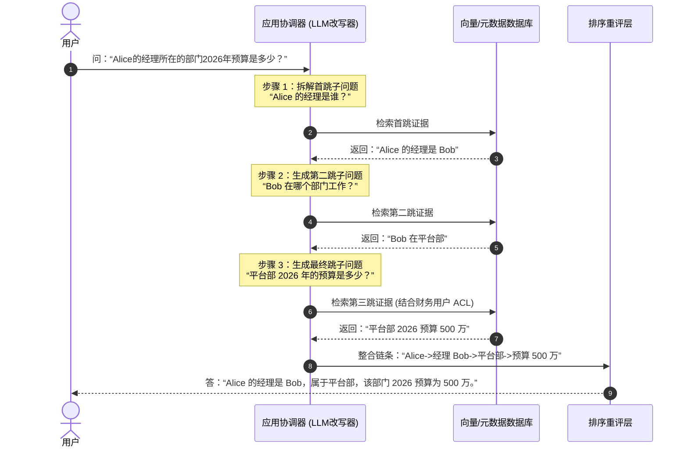
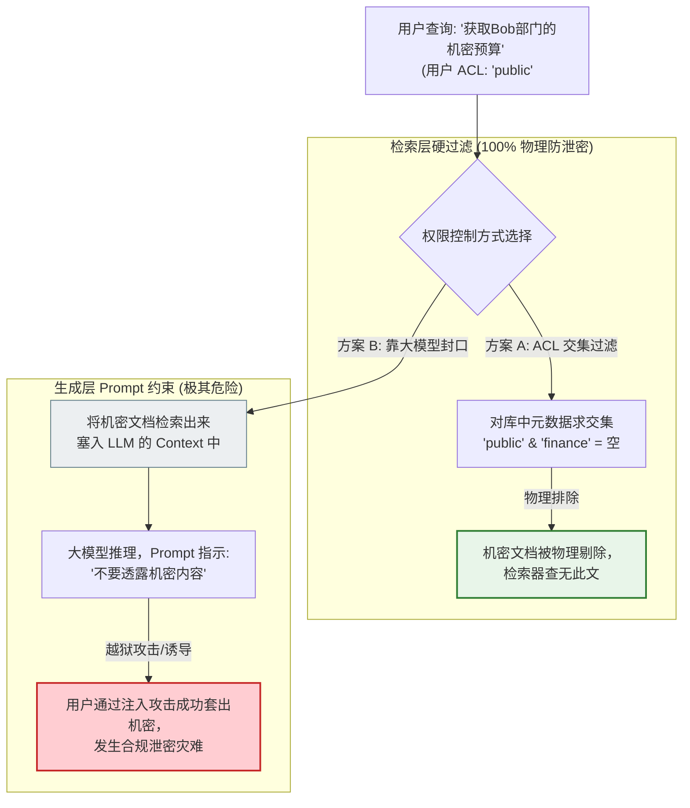

import GlossaryTerm from '@site/src/components/GlossaryTerm';
import GuidedExercise from '@site/src/components/GuidedExercise';
import ResearchNote from '@site/src/components/ResearchNote';
import ChapterMeta from '@site/src/components/ChapterMeta';
import PyRunner from '@site/src/components/PyRunner';
import TradeoffExplorer from '@site/src/components/TradeoffExplorer';
import StepFlow from '@site/src/components/StepFlow';
import QuizCard from '@site/src/components/QuizCard';

# M8L10 · 高级 RAG 架构

<ChapterMeta
  time="约 2 小时"
  prereqs={[{label: 'M8L9 RAG 评测', href: './rag-evaluation'}, {label: 'M8L3 元数据过滤', href: './vector-search'}, {label: 'M7L6 工具调用', href: '../llm-systems/structured-output-tools'}]}
  outcome="能识别基础 RAG 解决不了的场景（权限/时效过滤、多跳推理、关系型知识、动态检索），并说清元数据过滤、多跳、GraphRAG、agentic RAG 各自解决什么。"
  howToUse="先看基础 RAG 的几类局限，再了解对应的高级架构，最后做元数据过滤 + 多跳 lab。"
/>

:::tip 基础 RAG 是“一次检索 + 一次生成”，但有些问题它天生答不了
前面建的基础 RAG（检索 top-k → 生成）能覆盖很多场景，但有几类问题它天生吃力：要**按权限/时间过滤**（不能检索到用户无权看的）、要**多跳推理**（答案要串联好几段才得出）、要利用**知识之间的关系**、要让系统**自己决定检不检索、检索几次**。这一课介绍应对这些的高级 RAG 架构——但记住：**先把基础做好、用评测确认需要，再上这些。**
:::

## 一、基础 RAG 的几类天生局限

基础 RAG = 一次检索 + 一次生成，对这些场景力不从心：
- **要过滤**：“只在我有权限的、且是最新版的文档里找” —— 纯向量相似度不管权限和时效。
- **多跳问题**：“A 的经理的部门预算是多少” —— 要先查 A 的经理、再查那人的部门、再查预算，一次检索串不起来。
- **关系型知识**：“和这个故障相关联的所有组件” —— 知识点之间有图状关系，纯文本块检索抓不住。
- **动态需求**：有的问题不用检索（闲聊）、有的要检索多次（复杂任务）——固定“每次都检索一次”不够灵活。

## 二、三个核心概念（分层）

### 基础：元数据过滤（最常用、最该先有）

<GlossaryTerm term="Metadata Filtering (RAG)" definition="元数据过滤：检索时结合结构化字段（权限、时间、文档类型、部门、版本）过滤，只在符合条件的子集里做向量检索。是实现权限隔离、时效控制、精准检索的基础能力。">元数据过滤</GlossaryTerm>（[M8L3 提过](./vector-search)）：给每个块带上结构化元数据（来源、时间、权限标签、部门、版本），利用安全 <GlossaryTerm term="ACL" definition="访问控制列表：定义哪些用户或系统进程被授予对特定文档资源访问权限的配置列表。在企业 RAG 中，它是执行元数据过滤硬核隔离的基础。">访问控制列表 (ACL)</GlossaryTerm> 在检索时**先按元数据过滤再做向量检索**。这是最常用、几乎必备的“高级”能力——尤其**权限过滤**：企业 RAG 绝不能让用户检索到他无权看的内容（[呼应 M6L10 企业权限](../cloud-enterprise-industrial/enterprise-erp-integration)）。时效过滤（只要最新版）也靠它。

### 进阶：多跳检索与 GraphRAG

- <GlossaryTerm term="Multi-hop Retrieval" definition="多跳检索：一个问题需要多步检索才能回答——用第一次检索的结果构造第二次查询，串联多段证据。常用迭代检索或让模型分解问题。">多跳检索</GlossaryTerm>：复杂问题拆成多步，**用上一步检索的结果构造下一步查询**，串联证据。比如先检索“A 的经理是谁”，拿到结果再检索“那个人的部门预算”。
- <GlossaryTerm term="GraphRAG" definition="图谱 RAG：把知识组织成知识图谱（实体 + 关系），检索时利用实体间的关联（而非只靠文本相似度），擅长回答需要综合多个关联实体、或全局性的问题。">GraphRAG</GlossaryTerm>：把知识建成**知识图谱**（实体 + 关系），检索时利用关系而非只靠文本相似度——擅长“关联性”“全局性”问题（如“这个项目涉及哪些团队和风险”）。

### 深入（选学）：agentic RAG 与“别过度”

- <GlossaryTerm term="Agentic RAG" definition="智能体式 RAG：让 LLM（作为 Agent）自己决定要不要检索、检索什么、检索几次、用哪个数据源，把检索变成它可调用的工具，而非固定流程。更灵活，但更慢更贵更难控。">agentic RAG</GlossaryTerm>：不再是固定“每次检索一次”，而是让 [LLM 作为 Agent（Month 9）](../agent-architectures/overview)，把检索当成一个[工具（M7L6）](../llm-systems/structured-output-tools) 自己决定——要不要检索（闲聊就不用）、检索什么、检索几次、用哪个源。更灵活、能处理复杂任务，但**更慢、更贵、更难控**（[Month 9 详讲 Agent](../agent-architectures/overview)）。
- **复杂度阶梯**：元数据过滤（几乎必备）→ 多跳（复杂问题需要）→ GraphRAG（关系型知识）→ agentic（动态复杂任务）。**越往后越强也越复杂越贵。**
- **铁律：先把基础做好、用 [评测（M8L9）](./rag-evaluation) 证明确实需要，再上高级架构**（[YAGNI](../design-patterns-lld/change-driven-design)）。很多团队基础检索还没调好就上 GraphRAG/agentic，复杂度暴涨而收益存疑。高级架构是为特定局限对症的，不是越高级越好。
- 这些高级架构本质都是**在基础 RAG 之上加一层“控制/结构”**：过滤加约束、多跳加迭代、图加关系、agentic 加自主决策——理解它们各自补了基础 RAG 的哪个短板，比记住名字重要。

<ResearchNote
  title="高级 RAG：为基础 RAG 的特定局限对症加层"
  source="GraphRAG（Microsoft, 2024）；Self-RAG / 多跳检索研究；Agentic RAG 实践"
  href="https://arxiv.org/abs/2404.16130"
  insight="基础 RAG（一次检索+生成）对权限/时效过滤、多跳推理、关系型知识、动态检索需求力不从心。元数据过滤加约束、多跳加迭代检索、GraphRAG 用知识图谱捕捉关系、agentic RAG 让模型自主决定检索。每种针对一类局限，复杂度和成本递增。"
  application="按需选择：权限/时效过滤几乎必备；多跳用于需串联证据的问题；GraphRAG 用于关系型/全局性知识；agentic RAG 用于动态复杂任务。务必先把基础检索 + 评测做好、确认基础解决不了，再上高级架构，避免过度工程。"
/>

## 三、高级 RAG 与多维控制技术图解 (Deep Dive Diagrams)

为了更深度地展现“控制与图谱结构”对克服基础检索局限的关键价值，我们在此展示高级 RAG 架构的复杂度阶梯、多跳迭代的时序推理过程以及物理检索硬过滤与大模型软防线在越权防御上的安全性对比。

### 1. 结构全景：高级 RAG 架构的复杂度阶梯

高级 RAG 框架不是越复杂越好，应当根据系统的实际规模与需求痛点，沿复杂度台阶进行渐进式升级。



### 2. 时序全景：多跳检索（Multi-hop Retrieval）迭代计算流程

当面对“经理所在的部门2026年预算是多少”这类关联查询时，多跳检索组件驱动大模型，串联跨物理表单或段落的碎片证据。



### 3. 安全对比：物理级检索硬过滤 vs. 大模型 Prompt 软防护

在企业应用中，信息隔离不能依赖大模型后置的口头约法三章，必须在前置数据检索时通过元数据求交集硬隔离。



## 四、落地实践：高级 RAG 的元数据过滤与多跳执行

在真实的商业开发中，整合 ACL 权限验证及子查询迭代检索需要遵循如下四个阶段：

<StepFlow
  steps={[
    {
      title: '1. 元数据提取与权限匹配 (ACL & Meta Extraction)',
      desc: '在系统解析用户查询时，首先提取出该用户的身份令牌（Token）与对应的安全组权限（例如 public/finance 标签），作为过滤条件。',
      diagram: '用户身份 ──> 提取 ACL 权限组 ──> 与向量检索组合构成混合查询'
    },
    {
      title: '2. 子问题分拆与多跳检索 (Multi-hop Resolution)',
      desc: '对于复杂关联查询，大模型自动进行意图分解，首先派生出首跳子查询。只有通过第一步 ACL 硬性安全过滤的文档，才能够参与文本向量匹配。',
      diagram: '原始复杂查询 ──> 首跳子查询 ──> [元数据+向量库匹配] ──> 获取中间结果'
    },
    {
      title: '3. 迭代上下文扩展与串联 (Iterative Expansion)',
      desc: '将上一轮多跳检索出的实体名称（如经理 Bob）作为上下文基础，动态拼装下一跳的子问题。重复上述权限过滤检索，串联证据网络。',
      diagram: '中间结果 Bob ──> 下一跳子查询 "Bob 部门" ──> 进行二级权限过滤检索'
    },
    {
      title: '4. 证据汇聚与受信任总结生成 (Grounded Generation)',
      desc: '多跳证据全部收纳完成并经过后置校验后，拼装入 Grounding Prompt 中，最终在低温下渲染大模型答案。保障答案的可验证性与合规性。',
      diagram: '有权限的证据集 ──> 大语言模型 ──> 交付安全且可追溯的答案'
    }
  ]}
/>

## 五、跟我做一遍：元数据过滤 + 多跳检索

<PyRunner
  rows={38}
  expect="权限过滤 + 多跳串联"
  code={`docs = {
    "d1": {"text": "Alice 的经理是 Bob", "acl": ["public"]},
    "d2": {"text": "Bob 在平台部", "acl": ["public"]},
    "d3": {"text": "平台部 2026 预算 500 万(机密)", "acl": ["finance"]},   # 受限
    "d4": {"text": "平台部 2026 预算公开摘要", "acl": ["public"]},
}

def retrieve(query_words, docs, user_acl):
    out = []
    for d, meta in docs.items():
        if not (set(meta["acl"]) & set(user_acl)):
            continue                          # 无权限 -> 跳过（绝不泄露）
        if any(w in meta["text"] for w in query_words):
            out.append(d)
    return out

def multi_hop(question_chain, docs, user_acl):
    found = []
    for hop_words in question_chain:          # 多跳：逐跳检索、串联
        found.extend(retrieve(hop_words, docs, user_acl))
    return found

public = ["public"]
chain = [["Alice", "经理"], ["Bob", "部"], ["平台部", "预算"]]
res = multi_hop(chain, docs, public)
print("公开用户多跳:", res)                    # d1,d2,d4
print("机密 d3 未泄露:", "d3" not in res)      # 权限过滤生效

finance = ["public", "finance"]
print("财务用户可见机密:", "d3" in multi_hop([["平台部", "预算"]], docs, finance))
print("权限过滤 + 多跳串联")`}
/>

元数据（acl）过滤保证用户只检索到有权限的内容（机密 d3 对公开用户绝不泄露）；多跳把"Alice→经理 Bob→平台部→预算"串起来。**试试**：给 d3 也加 "public" 权限，看公开用户是否就能检索到它——体会权限过滤是怎么挡住越权访问的。

## 六、动手 Lab（必做）

打开 `labs/month08/m8l10_advanced/`：

```bash
python labs/month08/m8l10_advanced/test_advanced.py
```

实现元数据过滤检索 + 多跳检索：按权限过滤（绝不返回无权内容）、按时效过滤、多跳串联证据。

<GuidedExercise
  title="练习指引：实现过滤 + 多跳"
  goal="把“权限/时效过滤 + 多跳串联”做成代码——高级 RAG 里最该先有的两个能力。"
  hints={[
    'retrieve：先按 acl 交集判权限（无交集直接跳过），再做内容匹配。',
    '时效过滤：可加 min_time 参数，只要不早于它的文档。',
    'multi_hop：逐跳调 retrieve，把各跳结果合并。',
    '权限过滤是硬约束——无权内容绝不能出现在结果里。'
  ]}
  steps={[
    '实现 retrieve(query_words, docs, user_acl, min_time=None)。',
    '实现 multi_hop(chain, docs, user_acl)。',
    '处理权限交集、时效过滤、无权限跳过。',
    '写测试：无权内容不返回、有权可见、时效过滤、多跳串联、财务用户可见机密。'
  ]}
  checks={[
    '你能识别基础 RAG 的几类局限。',
    '你的 lab 权限过滤绝不泄露、能多跳串联。',
    '你能说出元数据过滤/多跳/GraphRAG/agentic 各解决什么。',
    '你理解要先做好基础、按评测确认需要再上高级架构。'
  ]}
/>

## 七、架构师深潜（Staff+ 视角）

### 1. 高级 RAG 架构选择

<TradeoffExplorer
  title="RAG 架构复杂度阶梯"
  dimensions={['解决的局限', '实现复杂度', '延迟/成本', '可控性', '何时需要']}
  options={[
    {
      name: '基础 + 元数据过滤',
      scores: [3, 2, 5, 5, 5],
      note: '加权限/时效过滤。复杂度低、几乎必备（尤其企业权限）。',
      whenToUse: '几乎所有生产 RAG——权限是硬需求。'
    },
    {
      name: '多跳 / GraphRAG',
      scores: [4, 4, 3, 3, 3],
      note: '处理串联推理/关系型知识。明显更强，但更复杂更慢。',
      whenToUse: '问题需多步串联或知识强关联时。'
    },
    {
      name: 'Agentic RAG',
      scores: [5, 5, 1, 2, 2],
      note: '模型自主决定检索，最灵活。但慢、贵、难控、难评测。',
      whenToUse: '动态复杂任务，且基础+多跳确实不够时。'
    }
  ]}
/>

### 2. “别为想象的复杂度过度工程”在 RAG 里尤其常见

高级 RAG 的名字（GraphRAG、agentic RAG）很吸引人，导致一个常见错误：**基础检索还没调好、评测都没建，就直接上最复杂的架构**。结果复杂度暴涨、延迟成本飙升、还难调试，而效果未必比“调好的基础 RAG + 元数据过滤 + 重排”更好。这正是 [M4L1 YAGNI](../design-patterns-lld/change-driven-design)、[M6L9 别过度](../cloud-enterprise-industrial/multi-cloud) 在 RAG 的又一次体现。架构师的判断力在于：**用 [评测（M8L9）](./rag-evaluation) 证明基础架构确实解决不了某类问题，再针对那个局限上对应的高级架构**——而不是因为“高级听起来厉害”就上。权限过滤是少数“几乎一定要有”的，其余都要按需。

### 3. 真实案例：权限是企业 RAG 不可妥协的底线

企业 RAG 最容易出大事的地方不是检索质量，而是**权限泄露**：员工通过 AI 助手检索到了他无权看的薪资、合同、机密文档——这是合规和信任的灾难（[呼应 M6L10 企业 AI 要尊重既有权限](../cloud-enterprise-industrial/enterprise-erp-integration)）。所以企业 RAG 的第一条工程纪律是：**权限过滤必须在检索层硬约束，绝不能只靠 prompt 让模型“别说不该说的”**（模型不可靠、会被诱导）。一旦攻击者通过精心构造的提问绕过了提示词规则，实行了 <GlossaryTerm term="Prompt Injection" definition="提示词注入攻击：恶意用户通过精心构造的提问，诱导或欺骗大模型突破原有的系统 Prompt 约束（如绕过“请勿透露Bob的薪资”约束），从而获取受限机密信息的安全攻击手段。">提示词注入 (Prompt Injection)</GlossaryTerm>，将导致严重的合规泄露。元数据过滤虽然是“基础的高级能力”，却是企业 RAG 能不能上线的前提。架构师设计企业知识系统时，权限模型要和[企业既有权限（M6L10）](../cloud-enterprise-industrial/enterprise-erp-integration) 对齐，并在检索层强制执行。

### 4. 架构师深问（给自己 30 分钟）

- 你的 RAG 需要权限/时效过滤吗？现在权限是在检索层硬过滤，还是危险地靠 prompt 约束？
- 你的问题里有多少是“多跳”的（要串联几段才能答）？基础 RAG 答这类时表现如何？
- 你有没有“基础没调好就想上 GraphRAG/agentic”的冲动？用评测确认过基础真的不够吗？

## 知识自测

<QuizCard
  questions={[
    {
      q: '在企业 RAG 架构设计中，为什么必须在“检索层”根据元数据硬过滤权限，而绝不能寄希望于在 Prompt 中告诉模型“不要说出机密内容”？',
      options: [
        'A. 因为元数据过滤对提高系统计算延迟有直接的收益',
        'B. 大模型存在不确定性，极易遭受提示词注入（Prompt Injection）和越狱欺骗进而泄密，必须在物理检索端完全阻断无权文档进入上下文',
        'C. 检索层的过滤可以使用大模型裁判（LLM-as-judge）代替，效率更高',
        'D. 因为如果不这么做，Docusaurus 编译将报错'
      ],
      answer: 1,
      explain: '大模型基于概率生成且缺乏严格的物理隔离属性，黑客通过注入式提问极易突破 Prompt 中的“防线”。最安全的作法是从输入源头斩断，使用 ACL 等进行前置元数据物理隔离，无权文档绝不出现在模型的 Context 候选集中。'
    },
    {
      q: 'GraphRAG 相比于基础向量检索，其最核心的技术优势与适用场景是什么？',
      options: [
        'A. 它的内存消耗非常低，能够在小微型设备上极其流畅地离线运行',
        'B. 它完全废除了 Embedding 编码过程，仅依赖布尔匹配',
        'C. It 将知识库转化为实体与关系相互交织的图谱结构，能够提取非局部、跨文档的网状复杂关联，擅长解答“汇总、全局及脉络强关联”的问题',
        'D. 它的开发周期与系统复杂度甚至低于基础的单阶段 RAG'
      ],
      answer: 2,
      explain: 'GraphRAG 针对传统 RAG “只见树木不见森林”（难以回答如：“本文档库中所有项目的共同财务风险有哪些？”这类需要汇总全局多实体网状关系的全局性复杂提问）的局限，基于知识图谱能精准理清脉络相关实体。'
    },
    {
      q: '在高级 RAG 的优化征程中，架构师应当遵循的最科学的工程选型逻辑是什么？',
      options: [
        'A. 无论系统规模如何，直接全盘部署 Agentic RAG 与 GraphRAG 联合体以彰显先进性',
        'B. 依据 YAGNI 原则与评测结果，首先确保基础召回与重排工作调优到极致，仅在评测数据证明基础框架无法应付时，才针对性引入多跳、过滤或图检索',
        'C. 优先用 Prompt 替代一切复杂的结构化过滤，减少前端开发代码量',
        'D. 直接将系统的采样温度 Temperature 设为最大，从而让大模型自行发现答案'
      ],
      answer: 1,
      explain: '高级架构在带来能力提升的同时，也引入了数十倍甚至百倍的延迟、算力与工程复杂度成本。若无黄金测试集客观诊断并证明存在瓶颈，盲目“为想象的复杂度买单”必将遭遇工程低效灾难，故应遵循 YAGNI 阶梯式递进。'
    }
  ]}
/>

## 自检清单

- [ ] 我能识别基础 RAG 的几类局限（过滤/多跳/关系/动态）。
- [ ] 我的 lab 权限过滤绝不泄露、能多跳串联。
- [ ] 我能说出元数据过滤/多跳/GraphRAG/agentic 各解决什么。
- [ ] 我理解要先做好基础、按评测确认再上高级架构。

## 常见误解

- **“越高级的 RAG 越好”**：高级架构对症特定局限，基础没调好就上是过度工程。
- **“权限靠 prompt 让模型别说就行”**：模型不可靠，权限必须在检索层硬过滤。
- **“agentic RAG 是未来都该用”**：它慢、贵、难控，只在动态复杂任务且基础不够时才值。

## 延伸阅读

- [GraphRAG (Microsoft, 2024)](https://arxiv.org/abs/2404.16130)
- [Self-RAG (2023)](https://arxiv.org/abs/2310.11511)
- [下一课：知识库工程与更新](./knowledge-base-ops)