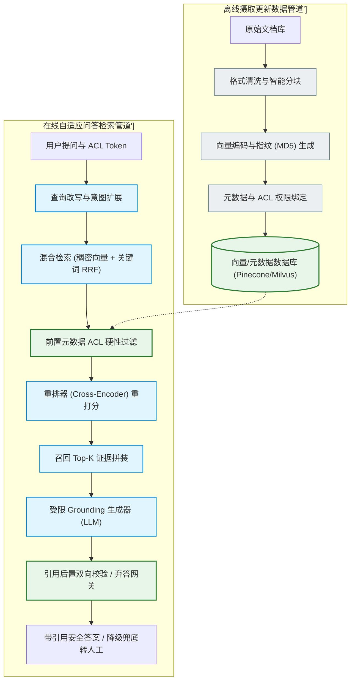
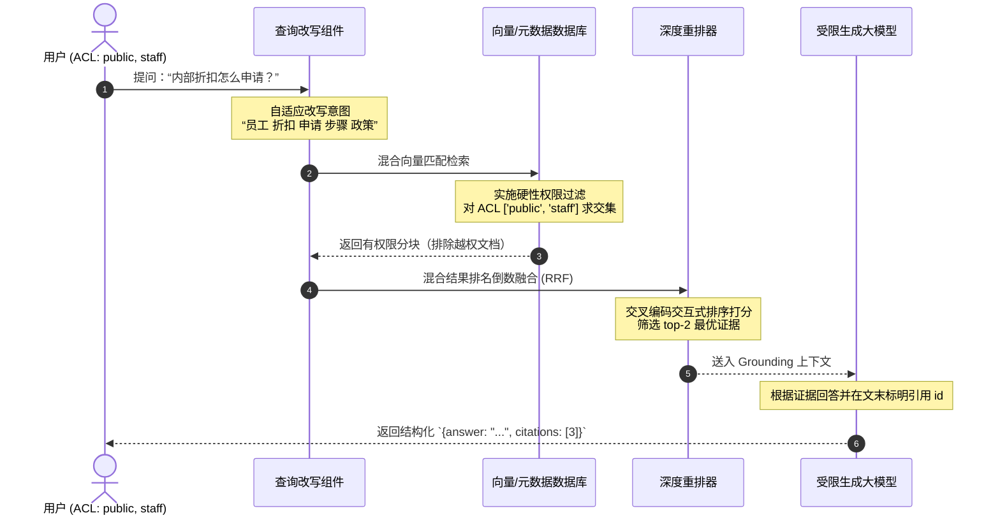
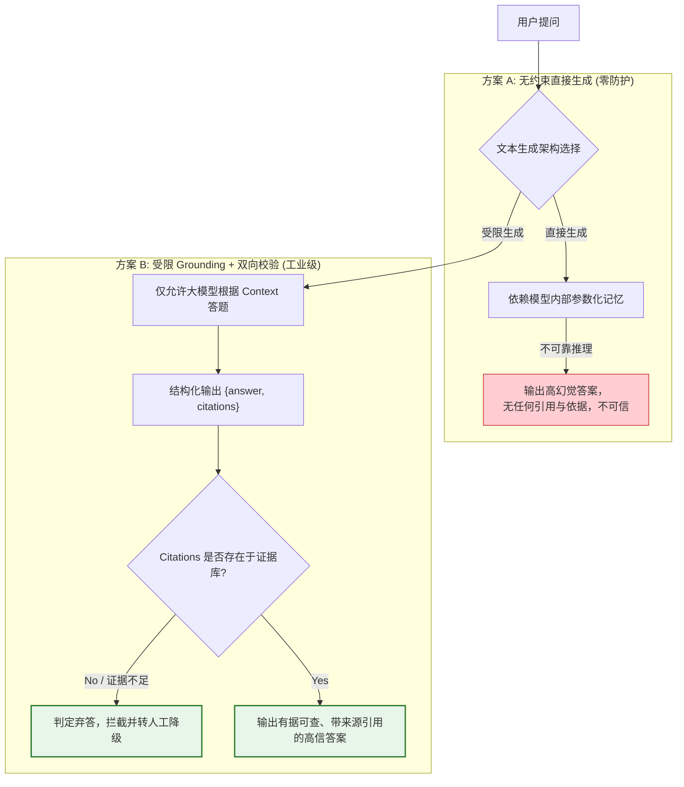

import GlossaryTerm from '@site/src/components/GlossaryTerm';
import GuidedExercise from '@site/src/components/GuidedExercise';
import ResearchNote from '@site/src/components/ResearchNote';
import ChapterMeta from '@site/src/components/ChapterMeta';
import PyRunner from '@site/src/components/PyRunner';
import TradeoffExplorer from '@site/src/components/TradeoffExplorer';
import StepFlow from '@site/src/components/StepFlow';
import QuizCard from '@site/src/components/QuizCard';

# M8L12 · Capstone：构建一个 RAG 系统

<ChapterMeta
  time="约 3.5 小时"
  prereqs={[{label: 'Month 8 全部', href: './overview'}, {label: 'M7L12 LLM 应用管道', href: '../llm-systems/capstone-llm-app'}]}
  outcome="能把本月所有 RAG 工程组装成端到端系统：摄取分块 → 检索（混合+重排+权限过滤）→ grounding 生成带引用 → 弃答 → 评测定位，并讲清每一环。"
  howToUse="把它当一道完整 RAG 系统设计题：拿一个知识库需求，串起本月全部组件，并用 lab 把端到端管道跑通。"
/>

:::tip 月末综合题：把本月的检索工程，接到 M7 的可靠生成管道上
[M7L12](../llm-systems/capstone-llm-app) 你建了一条可靠 LLM 管道，其中“检索 grounding”那一环当时是占位。这个月把它做深了——[分块](./chunking)、[向量检索](./vector-search)、[混合](./hybrid-search)、[重排](./reranking)、[查询改写](./query-transformation)、[权限过滤](./advanced-rag)、[评测](./rag-evaluation)、[知识库运维](./knowledge-base-ops)。现在把这套检索工程，**接回 M7 的可靠生成管道**，组成一个完整的、可评测、可运维的 RAG 系统。
:::

## 一、需求：一个企业知识库问答系统

做一个内部知识库 AI：员工提问，系统从公司文档里找证据、生成有据可引用的答案。要求把本月所有内容用上：
- **检索准**：混合检索 + 重排，召回全、精排准。
- **权限安全**：只检索员工有权看的内容（绝不泄露）。
- **答案可信**：基于证据、带引用、无据弃答（不幻觉）。
- **可评测、可运维**：能定位是检索还是生成问题；知识能增量更新。

## 二、组装端到端 RAG 管道

### 基础：离线摄取 + 在线检索

- **离线摄取（[M8L11/L4](./knowledge-base-ops)）**：文档 → 解析清洗 → [分块](./chunking) → 向量化 → 入库 + 打[元数据（权限/时间）](./advanced-rag)。支持[增量更新](./knowledge-base-ops)。
- **在线检索**：[查询改写（M8L7）](./query-transformation) → [混合检索（M8L5）](./hybrid-search)（向量+关键词 <GlossaryTerm term="RRF" definition="互惠排名融合：一种通过将多个检索渠道（如关键词检索和稠密向量检索）的排名倒数进行加权累加，以获得全局统一检索排序结果的混合检索融合算法。">RRF</GlossaryTerm>）→ [权限过滤（M8L10）](./advanced-rag) → [重排（M8L6）](./reranking) → 取 top-k。

### 进阶：grounding 生成 + 弃答

- **生成（[M8L8](./rag-generation)）**：证据编号拼装 → <GlossaryTerm term="Grounding" definition="确定性挂载 / 地面锚定：指使大模型的文本生成过程严格约束在给定的外部检索证据（Context）内，仅根据已知证据进行回答，防止其使用内部参数化记忆进行“天马行空”的幻觉生成。">grounding</GlossaryTerm> prompt（只据证据答）→ [结构化输出 `{answer, citations}`（M7L6）](../llm-systems/structured-output-tools) → 校验引用真实存在 → 证据不足[弃答（M7L9）](../llm-systems/hallucination-guardrails)。
- **接 M7 可靠层**：[缓存/降级（M7L11）](../llm-systems/llm-caching-resilience)、[低温（M7L3）](../llm-systems/sampling-decoding)、[成本追踪（M7L5）](../llm-systems/llm-api-cost-latency)——RAG 的生成端就是 [M7L12 管道](../llm-systems/capstone-llm-app) 接上检索证据。

### 深入（选学）：评测闭环与持续运维

- **评测（[M8L9](./rag-evaluation)）**：分维度（检索召回/精确、生成忠实/相关）评测、定位问题环节、跑回归、接 [CI 门禁（M6L6）](../cloud-enterprise-industrial/cicd-pipelines)。
- **观测与运维（[M8L11/M6L7](./knowledge-base-ops)）**：监控检索质量、答案质量、新鲜度、成本；知识库增量更新保新鲜。
- **整条 RAG = 检索工程 + M7 可靠生成 + 评测运维**：它继承了 [M7L12 “把不可靠模型包成可靠功能”](../llm-systems/capstone-llm-app) 的全部思想，再加上“把海量知识精准供给模型”的检索工程。每一环都对应前面一课——这个 Capstone 是 Month 7+8 的总集成，也是后面 [Agent（Month 9）](../agent-architectures/overview) 的重要工具（[agentic RAG](./advanced-rag)）。

<ResearchNote
  title="生产级 RAG = 摄取 + 检索 + grounding 生成 + 评测运维"
  source="Lewis et al. (2020), RAG；RAGAS；本月各环节综合"
  href="https://arxiv.org/abs/2005.11401"
  insight="可靠的 RAG 系统是一条端到端管道：离线摄取（解析-分块-向量化-元数据-增量更新）+ 在线检索（查询改写-混合-权限过滤-重排）+ grounding 生成（证据拼装-引用校验-弃答）+ 评测运维（分维度评测-定位-回归-新鲜度）。检索负责精准供给证据，生成负责忠实使用，评测负责持续可靠。"
  application="设计 RAG：画出离线摄取和在线问答两条链，每环放对应组件；权限在检索层硬过滤；生成端 grounding+引用+弃答；用分维度评测定位优化、跑回归；知识库增量更新保新鲜。把它当 M7 可靠管道 + 检索工程 + 数据运维的总和。"
/>

## 三、生产级端到端 RAG 控制机制图解 (Deep Dive Diagrams)

本节展示端到端 RAG 在运行期间如何将权限隔离、自适应改写、混合检索以及证据生成后置双向校验串联成完整数据回路。

### 1. 结构全景：企业级生产 RAG 端到端全景控制链

企业级生产 RAG 划分为离线摄取更新管道与在线自适应问答检索管道，形成闭环数据流网络。



### 2. 流程全景：支持权限隔离与自适应改写的检索时序

在线检索期间，用户的意图与安全标签被多级流转，以保障高召回与高物理安全性。



### 3. 比较全景：无约束直接生成 vs. 受限 Grounding + 引用 + 弃答校验

严格的 Grounding 生成能够保证内容可追溯、防幻觉，并在缺乏充足证据时启动弃答机制。



## 四、落地实践：企业端到端 RAG 系统的执行链路控制

要组装一个完全可靠的生产级 RAG 问答系统，系统需要在运行期间严密控制如下四个执行阶段：

<StepFlow
  steps={[
    {
      title: '1. 查询改写与意图理解 (Query Reformulation)',
      desc: '在线接受用户提问后，通过查询改写器生成同义词扩展和子意图，提高后续匹配的语义召回覆盖度。',
      diagram: '用户原始输入 ──> 意图扩展/子句生成 ──> 形成改写检索词集'
    },
    {
      title: '2. 混合检索与前置 ACL 隔离 (Hybrid Search & Meta Filtering)',
      desc: '向量检索与经典关键字检索同时下发，并在检索源头前置结合用户的 ACL Token，将越权的文档彻底剔除出检索范围。',
      diagram: '改写词集 ──> 向量 + 关键字 ──> [元数据权限交集过滤] ──> 获取安全结果'
    },
    {
      title: '3. 深度重排打分 (Cross-Encoder Reranking)',
      desc: '对于混合检索检索出的召回项，使用重排模型（Reranker）计算查询词与分块的深层交互打分，筛选出 top-k 最相关的高质量证据集。',
      diagram: '混合召回候选项 ──> 重排器二次评估打分 ──> 排序截断 ──> 输出 Top-K 证据'
    },
    {
      title: '4. 受限 Grounding 生成与引用拦截 (Grounded Abstention & Verification)',
      desc: '将 Top-k 证据塞入 grounding prompt 送入大模型，并在后置校验器中对citations执行校验。若校验失败或证据冲突，则触发弃答。',
      diagram: 'Top-K 证据 ──> LLM 结构化生成 ──> 引用真实性校验 ──> 判定安全输出或弃答'
    }
  ]}
/>

## 五、跟我做一遍：端到端 RAG 系统

<PyRunner
  rows={42}
  expect="检索-权限-重排-生成-弃答 全通"
  code={`KB = [
    {"text": "退货需在签收后 7 天内申请", "acl": ["public"]},
    {"text": "退款 3-5 个工作日到账", "acl": ["public"]},
    {"text": "员工内部折扣 8 折", "acl": ["staff"]},          # 受限
]

def retrieve(q_words, kb, user_acl):                # 检索 + 权限过滤 + 简化重排
    out = []
    for i, c in enumerate(kb):
        if not (set(c["acl"]) & set(user_acl)):
            continue                                # 无权限 -> 跳过(绝不泄露)
        score = sum(1 for w in q_words if w in c["text"])
        if score > 0:
            out.append((i, score, c["text"]))
    return sorted(out, key=lambda x: -x[1])         # 按命中数精排

def rag_answer(q_words, kb, user_acl, model, min_hits=1):
    hits = retrieve(q_words, kb, user_acl)
    if not hits or hits[0][1] < min_hits:           # 无证据/无权限 -> 弃答
        return {"answer": "知识库无相关信息(或无权限),请转人工", "grounded": False}
    evidence = [{"id": i + 1, "text": t} for i, _, t in hits[:2]]
    resp = model(q_words, evidence)
    valid = {e["id"] for e in evidence}
    if any(c not in valid for c in resp["citations"]):           # 引用校验
        return {"answer": "引用无据,已拦截转人工", "grounded": False}
    return {"answer": resp["answer"], "citations": resp["citations"], "grounded": True}

def model(q, ev):
    return {"answer": ev[0]["text"], "citations": [ev[0]["id"]]}

print("公开-退货:", rag_answer(["退货", "几天"], KB, ["public"], model))
print("公开-内部折扣:", rag_answer(["内部", "折扣"], KB, ["public"], model))      # 无权限->弃答
print("员工-内部折扣:", rag_answer(["内部", "折扣"], KB, ["public", "staff"], model))  # 有权限
print("检索-权限-重排-生成-弃答 全通")`}
/>

一条端到端 RAG：检索 + 权限过滤（公开用户问内部折扣被弃答、绝不泄露 staff 内容）+ 精排 + grounding 生成 + 引用校验 + 无据弃答。**试试**：让 model 返回越界引用，看被拦；给公开用户也加 staff 权限，看内部折扣能否被检索到——体会权限过滤是怎么在检索层硬挡的。

## 六、动手 Lab（必做）

打开 `labs/month08/m8l12_rag_system/`：

```bash
python labs/month08/m8l12_rag_system/test_rag_system.py
```

组装端到端 RAG：检索 + 权限过滤 + 精排 + grounding 生成 + 引用校验 + 弃答，验证权限不泄露、无据不答、引用真实。

<GuidedExercise
  title="练习指引：组装端到端 RAG 系统"
  goal="把本月全部组件串成一个可靠 RAG：检索准、权限安全、答案可信、能弃答。"
  hints={[
    'retrieve：先按 acl 硬过滤（无权限绝不返回），再打分排序。',
    'rag_answer：无证据/命中不足 -> 弃答；取 top-k 证据编号拼装。',
    '引用校验：模型给的 citations 必须都在证据编号范围内。',
    '权限过滤是硬约束，绝不能靠 prompt 让模型“别说”。'
  ]}
  steps={[
    '实现 retrieve(q_words, kb, user_acl)：权限过滤 + 打分排序。',
    '实现 rag_answer：弃答判断、证据拼装、调用、引用校验。',
    '处理无权限、无证据、越界引用三种情况。',
    '写测试：有权有据回答、无权限弃答(不泄露)、无证据弃答、越界引用被拦、有权用户可见受限内容。'
  ]}
  checks={[
    '你能画出 RAG 的离线摄取和在线问答两条链。',
    '你的 lab 权限不泄露、无据不答、引用真实。',
    '你能说出每一环对应本月哪一课、解决什么。',
    '你能用分维度评测定位 RAG 问题并对症优化。'
  ]}
/>

## 七、架构师深潜（Staff+ 视角）

### 1. RAG 系统的成熟度

<TradeoffExplorer
  title="RAG 系统工程成熟度"
  dimensions={['检索质量', '权限安全', '答案可信', '可评测运维', '建设成本']}
  options={[
    {
      name: '纯向量 + 直接生成',
      scores: [2, 1, 2, 1, 5],
      note: '向量检索 top-k 直接喂模型。能做 demo，但漏召回、无权限、会幻觉、难定位。',
      whenToUse: '原型验证。'
    },
    {
      name: '混合+重排+grounding+引用',
      scores: [4, 4, 4, 3, 3],
      note: '检索质量和可信度大幅提升、有权限过滤和引用。生产基线。',
      whenToUse: '多数生产 RAG。'
    },
    {
      name: '全管道(+评测+增量运维)',
      scores: [5, 5, 5, 5, 1],
      note: '分维度评测定位、回归门禁、增量更新保新鲜。可持续可靠演进。',
      whenToUse: '企业级/关键知识系统。'
    }
  ]}
/>

### 2. RAG 是 Month 7+8 的总集成，也是 AI 系统的“知识底座”

这个 Capstone 把两个月串成了一个完整能力：**Month 7 教你“把不可靠的模型包成可靠功能”，Month 8 教你“把海量知识精准供给模型”**——合起来就是一个能基于特定知识、可靠回答、可引用、可运维的 AI 系统。这套“RAG 知识底座”是绝大多数企业 AI 应用的核心：客服、文档助手、法规/合规问答、内部知识检索，乃至 [Agent（Month 9）](../agent-architectures/overview) 获取知识的工具，都建立在它之上。架构师掌握了这个端到端 RAG 的设计 and 优化（尤其是用[评测定位、对症优化](./rag-evaluation) 的方法论），就掌握了 AI 应用最常用、最吃工程功力的一块。

### 3. 真实案例：RAG 项目成败的分水岭

回顾本月反复出现的“成败分水岭”：(1) **数据工程**——分块、解析、增量更新做得好不好，决定长期质量（[M8L4/L11](./chunking)）；(2) **检索质量**——是否混合、重排、按需查询改写，决定召回精度（[M8L5/L6/L7](./hybrid-search)）；(3) **生成可信**——grounding、引用、弃答，决定能不能用于严肃场景（[M8L8](./rag-generation)）；(4) **权限安全**——检索层硬过滤，决定能不能上企业（[M8L10](./advanced-rag)）；(5) **评测运维**——能不能定位问题、持续改进、保持新鲜（[M8L9/L11](./rag-evaluation)）。能把这五件事都做扎实的 RAG，才是生产级的。**很多 RAG 项目失败，不是某一处不行，而是只做了“检索 top-k + 生成”这条最细的线，缺了其余四条**。这个 Capstone 的价值，就是让你看到完整的五条线、并知道怎么用评测驱动地把它们都做好。

### 4. 架构师深问（给自己 30 分钟）

- 给你负责的 RAG，画出离线摄取和在线问答两条完整链。哪一环现在是缺的或薄弱的？
- 你的权限是在检索层硬过滤，还是危险地靠 prompt？答案有引用、能溯源吗？
- 你能用分维度评测说清当前 RAG 的瓶颈在检索还是生成、在召回还是精排吗？下一步该优化哪里？

## 知识自测

<QuizCard
  questions={[
    {
      q: '在企业生产级 RAG 架构中，为什么“混合检索 + 重排（Hybrid + Reranking）”相比于单一的向量库相似度检索能大幅提升召回与精准度？',
      options: [
        'A. 向量相似度检索擅长捕捉语义模糊的长尾意图，但在面对专用名词、序列代号等精准词匹配时效果不佳；引入关键词检索可补足精准短板，再通过重排模型做深度交互排序，能极大改善供给大模型的 Context 质量',
        'B. 重排能够使用极小体量的参数直接在向量库的内存中进行分布式排序',
        'C. 混合检索只适用于中文环境，向量检索只适用于英文环境',
        'D. 这样做可以使得最终生成的文本长度减少 50%'
      ],
      answer: 0,
      explain: '稠密向量检索在捕捉同义词、宽泛意图上性能优良，但遇到特定的 SKU 编码或专有名词时常会出现误判或漏召回，必须用基于字面精准匹配的倒排索引（关键词检索）双管齐下；再采用重排器利用 Cross-Encoder 深度打分过滤噪音，最大化 Top-k 质量。'
    },
    {
      q: 'RAG 管道中“引用真实性校验（Citation Verification）”这一后置校验器的最核心职能是什么？',
      options: [
        'A. 计算当前大模型的 API 消耗费用是否超出财务限额',
        'B. 在生成后置环节，逐一验证大模型给出的引用标签（如[1], [2]）所对应的实际内容，是否真实包含在检索层送入的 Context 证据集中，若大模型凭空捏造了未包含在证据里的编号引用，则启动拦截或弃答',
        'C. 统计大模型输出中包含的标点符号数量',
        'D. 让模型将所生成的回答翻译为系统默认的语言'
      ],
      answer: 1,
      explain: '即使加了 grounding 约束，大模型依然有可能编造没有事实基础的编号标签。通过后置校验器比对模型输出引用的 ID 是否完全在当前输送证据的 ID 闭集内，若存在越界引用则属于幻觉泄密，系统必须拦截并启动降级弃答机制。'
    },
    {
      q: '作为一个合格的系统架构师，要如何科学定位一个线上 RAG 应用发生的“回答不正确”的故障原因？',
      options: [
        'A. 马上将采样温度（Temperature）调到最高，然后重试',
        'B. 建立分维度评测机制（如 RAGAS 框架），首先检测检索召回率与重排质量是否失信；其次在检索完全正确时评估大模型的忠实度与相关性，绝不能混为一谈导致优化路径跑偏',
        'C. 立即将向量检索更改为普通的布尔正则表达式匹配',
        'D. 删掉所有的分块策略，直接把整本书送入大模型 context'
      ],
      answer: 1,
      explain: 'RAG 的质量瓶颈是由检索段（召回率、上下文精确率）和生成段（忠实度、答案相关性）多重因素交织决定的。必须用分维度的 RAG 评测科学把脉，找出具体是检索端漏了关键信息还是大模型在生成时发生了幻觉，从而对症下药。'
    }
  ]}
/>

## 自检清单

- [ ] 我能画出 RAG 的离线摄取和在线问答完整管道。
- [ ] 我的 lab 权限不泄露、无据不答、引用真实可校验。
- [ ] 我能说出每一环对应本月哪一课、解决什么问题。
- [ ] 我能用评测定位 RAG 瓶颈、对症优化。

## 常见误解

- **“RAG 就是检索 top-k + 生成”**：那只是最细的一条线，缺了数据工程/检索质量/可信生成/权限/评测就不是生产级。
- **“权限靠提示模型别说”**：必须检索层硬过滤，模型不可信。
- **“RAG 上线就完成了”**：要持续评测、增量更新、监控新鲜度，是要运营的系统。

## 延伸阅读

- [RAG (Lewis et al., 2020)](https://arxiv.org/abs/2005.11401)
- [Month 8 总览](./overview)
- [进入 Month 9：Agent Loop 与工具边界](../agent-architectures/overview)