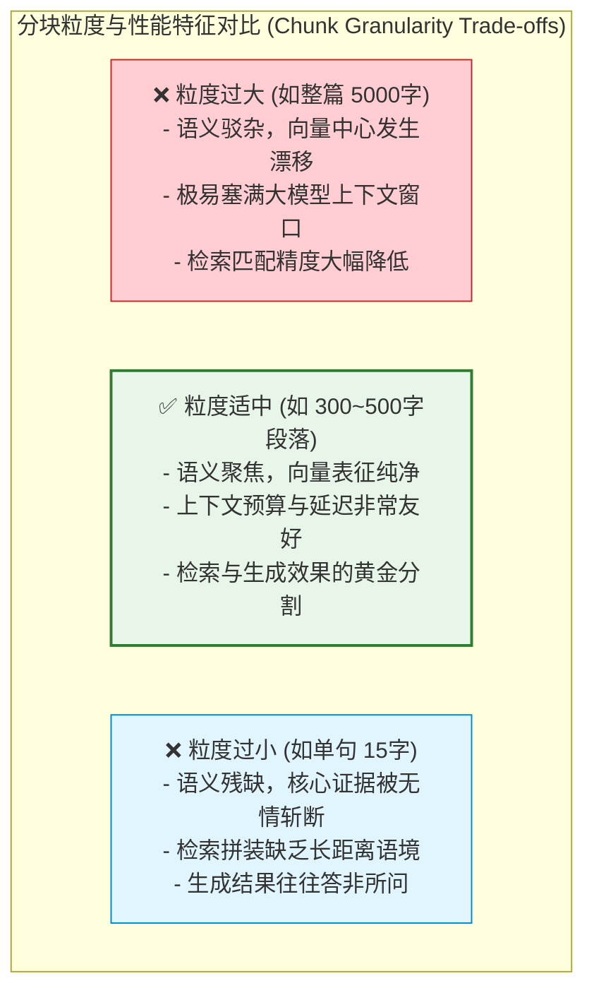
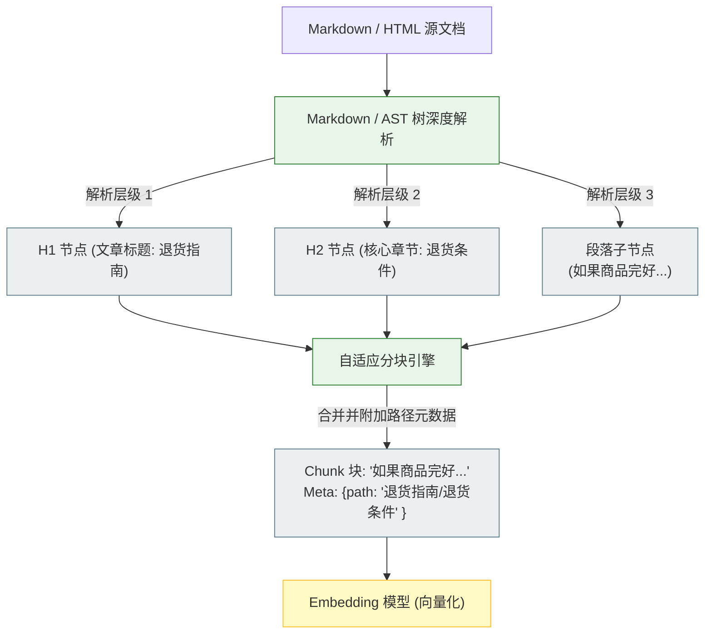

import GlossaryTerm from '@site/src/components/GlossaryTerm';
import GuidedExercise from '@site/src/components/GuidedExercise';
import ResearchNote from '@site/src/components/ResearchNote';
import ChapterMeta from '@site/src/components/ChapterMeta';
import PyRunner from '@site/src/components/PyRunner';
import TradeoffExplorer from '@site/src/components/TradeoffExplorer';
import StepFlow from '@site/src/components/StepFlow';
import QuizCard from '@site/src/components/QuizCard';

# M8L4 · 文档分块

<ChapterMeta
  time="约 2.5 小时"
  prereqs={[{label: 'M8L2 embedding', href: './embeddings'}, {label: 'M8L3 向量检索', href: './vector-search'}, {label: 'M7L2 token', href: '../llm-systems/tokenization-context'}]}
  outcome="能解释为什么要分块、chunk 大小与重叠的取舍、按语义/结构分块的好处，并实现带重叠的分块。"
  howToUse="先看“整篇文档不能直接检索”，再理解 chunk 大小/重叠/语义分块，最后做分块 lab。"
/>

:::tip 分块是 RAG 里最朴素、却最常被低估的质量杠杆
你不能把整篇 100 页文档当成一个向量去检索——太粗，检索回来一大坨、还塞不进上下文。得把文档**切成块（chunk）**，每块单独向量化、检索。但怎么切大有学问：**切太大检索不精准、塞不下；切太小丢失上下文、答案被割裂。** 很多 RAG 效果差，根因就在分块没做好——它是个隐形但关键的杠杆。
:::

## 一、整篇文档不能直接检索

回顾流程：文档 → 切块 → 每块 [embedding（M8L2）](./embeddings) → 存[向量库（M8L3）](./vector-search) → 查询时检索最相关的块。为什么要切？因为检索的粒度就是块的粒度：
- 如果一块是整篇文档：检索回来太大、[塞爆上下文（M7L2）](../llm-systems/tokenization-context)、且一个向量代表整篇太"模糊"、检索不准。
- 如果一块是一句话：上下文太碎，答案常常跨句、检索回单句不完整。

所以**怎么切块，直接决定检索回来的内容质量**——而这恰恰是新手最容易忽略、随手按字数一切了事的地方。

## 二、三个核心概念（分层）

### 基础：chunk 大小的取舍

<GlossaryTerm term="Chunking" definition="分块：把长文档切成较小的片段（chunk），每块单独向量化和检索。块的大小和切法直接影响检索精度和上下文完整性。">分块（chunking）</GlossaryTerm>的第一参数是**块大小**（按 token 或字符算）：
- **太大**：一块含多个主题，向量"语义不纯"、检索精度差；检索回来占用大量上下文预算。
- **太小**：上下文被割裂，一个完整意思被切成几块，检索回单块不足以回答。
- 经验：按内容类型定（FAQ 一问一答可小、技术文档一节一块、叙述性文本中等），并用 [M8L9 评测](./rag-evaluation) 在你的数据上调出最佳值。**没有万能大小，要按数据测。**

### 进阶：重叠（overlap）

<GlossaryTerm term="Chunk Overlap" definition="块重叠：相邻 chunk 之间共享一部分内容（如末尾 N 个 token 也放进下一块开头）。避免把一个完整意思正好切在块边界而被割裂，提升检索召回。">重叠（overlap）</GlossaryTerm>：让相邻块**共享一小段内容**（如每块末尾的 50 token 也放进下一块开头）。为什么需要：硬切可能正好把一个关键句/一个完整意思切在边界上，两块都不完整。重叠保证"跨边界的内容"至少在某一块里是完整的，提升召回。代价是存储和 token 略增（有冗余）。

### 深入（选学）：语义/结构分块与元数据

按固定大小切是基线，更好的做法是**顺着内容的自然边界切**：
- <GlossaryTerm term="Semantic / Structural Chunking" definition="语义/结构分块：按文档的自然结构（标题、段落、列表、章节）或语义边界切块，而非机械按字数切，使每块是一个相对完整的意思单元，检索更准。">语义/结构分块</GlossaryTerm>：按标题、段落、章节、列表等自然结构切，让每块是一个**完整的意思单元**——比机械按字数切检索质量高得多。
- **保留结构与<GlossaryTerm term="Metadata" definition="元数据：附加在文档块上的结构化辅助信息（如文档 ID、创建时间、归属部门、文章来源及标题层级等）。既可用于检索时的过滤筛选，也常用于在生成答案时输出引用依据。">元数据</GlossaryTerm>**：每块带上它的标题路径、来源文档、章节、时间、权限标签等元数据——既能在生成时给出处（[M8L8 引用](./rag-generation)），又能[元数据过滤检索（M8L3/M8L11）](./vector-search)。
- **文档解析是上游隐患**：PDF 表格、图片、页眉页脚、乱码会污染块（[旧占位提到的四大失败点之一]）——分块质量先取决于解析质量，脏数据进、脏检索出。
- **小块检索、大块喂给模型**：一种进阶技巧——用小块做精准检索命中，再把它所在的大块（或父文档相关部分）喂给模型，兼顾检索精度和上下文完整（<GlossaryTerm term="Small-to-big Retrieval" definition="Small-to-big 检索：一种进阶 RAG 技巧，检索时通过较小的向量分块（语义精确、噪音少）进行精准匹配定位，命中后将与之关联的更大文档父上下文块提取出来喂给模型，兼顾检索精度与语义完整性。">small-to-big 检索</GlossaryTerm>）。
- 牢记：**分块是 RAG 里性价比极高的优化点**，但也别过早搞复杂语义分块——先按结构 + 合理大小 + 重叠做好基线，按评测再优化。

<ResearchNote
  title="分块：在检索精度和上下文完整性之间切"
  source="RAG 工程实践（chunk size/overlap 调优）；LangChain/LlamaIndex 文档；small-to-big 检索"
  href="https://www.pinecone.io/learn/chunking-strategies/"
  insight="分块策略（大小、重叠、按结构/语义切）显著影响 RAG 质量：块太大语义不纯、占上下文；太小丢上下文、割裂答案；重叠避免边界割裂；按文档结构切让每块是完整意思单元。没有万能参数，需按数据和评测调，且依赖上游解析质量。"
  application="基线：按文档结构（标题/段落/章节）切 + 合理大小（按内容类型，用评测调）+ 适度重叠 + 每块带元数据（来源/标题/权限）。先保证解析干净。需要时用 small-to-big（小块检索、大块供模型）。把分块当可评测、可迭代的参数，而非随手按字数切。"
/>

## 三、分块技术与管道图解 (Deep Dive Diagrams)

为了更具象化地表达分块对于语义检索精度的影响，我们将在此剖析分块尺寸取舍、块重叠防护以及基于语法树的自适应结构分块链路。

### 1. 粒度天平：分块尺寸的黄金分割点

下面的图表展示了如果块切得太大或过碎，在 RAG 计算中带来的典型工程缺陷，明确了合理分块的平衡意义。



### 2. 重叠滑动：防止边界打断的冗余设计

块重叠（Overlap）通过在相邻的滑动窗口间共享特定字符，保证了处于分界线上的句子能被至少一个块完整容纳，从而消除了物理分割产生的信息孤岛。

```mermaid
graph LR
    classDef normal fill:#eceff1,stroke:#607d8b,stroke-width:1px;
    classDef overlap fill:#fff9c4,stroke:#fbc02d,stroke-width:2px;

    subgraph SlidingWindow ["滑动窗口切分机制 (Size: 100, Overlap: 30)"]
        Block1["Chunk 1: 字符 0 ~ 100<br/>'我们公司对电子产品的退货政策是支持15天无理由退换。'"]:::normal
        Block1Overlap["重叠区: 70 ~ 100<br/>'支持15天无理由退换。'"]:::overlap
        Block1 --- Block1Overlap
        
        Block2["Chunk 2: 字符 70 ~ 170<br/>'支持15天无理由退换。但是运费由消费者自理。'"]:::normal
        Block2Overlap["重叠区: 70 ~ 100<br/>'支持15天无理由退换。'"]:::overlap
        Block2Overlap --- Block2
    end
    
    Note over Block1Overlap, Block2Overlap: 重叠区使得跨边界的关键句<br/>“支持15天无理由退换。”<br/>在两端都有完整的物理存在，防止被切断。
```

### 3. 结构感知：基于语法树层级的智能分块

优秀的摄取机制绝不按字数一刀切，而是基于 HTML/Markdown AST 语法树层级，将整个层级路径作为元数据父节点注入最终的密集块中。



## 四、落地实践：文档分块与摄取流水线

在真实的知识库构建流水线（Data Ingestion Pipeline）中，分块与解析的处理过程要遵循如下四个步骤：

<StepFlow
  steps={[
    {
      title: '1. 上游源数据解析 (Ingestion & Cleaning)',
      desc: '摄取原始 PDF/Markdown 文本，过滤脏字符、移除重复的页眉页脚和空白行，防止污染后续的分块结果。',
      diagram: '原始包含乱码和页码的 PDF ──> 清理与提取纯净文本'
    },
    {
      title: '2. 语义树层次构建 (Structural AST Extraction)',
      desc: '通过解析 Markdown 或 HTML 标记，将文本拆解为层级化的抽象语法树（AST），明确文章的标题层级（H1、H2、H3）与物理段落。',
      diagram: '提取层级: 标题 H1 > 章节 H2 > 段落 Paragraph'
    },
    {
      title: '3. 约束滑动窗口切分 (Constrained Sliding Window)',
      desc: '以段落边界为基准进行大小计算，若段落超出目标容量（如 400 tokens），则按固定大小切分，并向后滑动设置一定的重叠字符（如 50 tokens）。',
      diagram: '设定滑动步长 = (块大小 - 块重叠) ──> 循环滚动切块'
    },
    {
      title: '4. 元数据附加与标记 (Metadata Annotation)',
      desc: '为每一个切出的文档块附加丰富的辅助元数据（包括来源路径、最近更新时间、访问权限标签等），确保在下游支持元数据过滤检索。',
      diagram: '块文本 + { doc_id: 101, parent_header: "退款流程" } ──> 向量库存储'
    }
  ]}
/>

## 五、跟我做一遍：带重叠的分块

<PyRunner
  rows={34}
  expect="按大小切且块间重叠"
  code={`def chunk_fixed(text, size, overlap):
    # 按字符切，相邻块重叠 overlap 个字符
    chunks = []
    step = size - overlap
    i = 0
    while i < len(text):
        chunks.append(text[i:i+size])
        if i + size >= len(text):
            break
        i += step
    return chunks

def chunk_by_paragraph(text, max_size):
    # 结构分块：先按段落（空行）切，再把过大的段落按大小切
    out = []
    for para in text.split("\\n\\n"):
        para = para.strip()
        if not para:
            continue
        if len(para) <= max_size:
            out.append(para)
        else:
            out.extend(chunk_fixed(para, max_size, overlap=0))
    return out

doc = "退货政策第一段，讲条件。" * 3 + "\\n\\n" + "退款时效第二段，讲到账时间。" * 3

fixed = chunk_fixed(doc.replace("\\n\\n", ""), size=20, overlap=5)
print("固定分块(size20,overlap5):", len(fixed), "块")
for c in fixed[:3]:
    print("  |", c)
print("相邻块重叠示例:", fixed[0][-5:], "==", fixed[1][:5])  # 末尾=下块开头

para = chunk_by_paragraph(doc, max_size=100)
print("\\n结构分块:", len(para), "块（按段落，每块是完整意思）")
print("按大小切且块间重叠")`}
/>

固定分块保证块大小一致、相邻块重叠（边界内容不丢）；结构分块按段落切、每块是完整意思——后者通常检索质量更好。**试试**：把 overlap 设为 0，看相邻块是否还重叠；把段落 max_size 调很小，看长段落被进一步切开。

## 六、动手 Lab（必做）

打开 `labs/month08/m8l4_chunking/`：

```bash
python labs/month08/m8l4_chunking/test_chunking.py
```

实现带重叠的固定分块 + 按段落的结构分块：块大小可控、相邻重叠、过大段落再切、不产生空块。

<GuidedExercise
  title="练习指引：实现分块"
  goal="把“固定大小+重叠”和“按结构切”做成代码，体会分块对检索粒度的影响。"
  hints={[
    'chunk_fixed：step = size - overlap，滑动窗口切；注意最后一块和避免死循环（overlap < size）。',
    'chunk_by_paragraph：先按空行切段，过大的段再用 chunk_fixed 切。',
    '去掉空块、首尾空白。',
    '重叠让相邻块末尾=下块开头，避免边界割裂。'
  ]}
  steps={[
    '实现 chunk_fixed(text, size, overlap)。',
    '实现 chunk_by_paragraph(text, max_size)。',
    '处理边界：overlap>=size 报错、空段跳过、最后一块。',
    '写测试：块大小符合、相邻重叠正确、结构分块按段落、无空块、长段被切。'
  ]}
  checks={[
    '你能解释 chunk 太大/太小各自的问题。',
    '你的 lab 实现了固定+重叠和结构分块。',
    '你能说出重叠解决什么、为什么要带元数据。',
    '你理解分块要按数据和评测调、依赖解析质量。'
  ]}
/>

## 七、架构师深潜（Staff+ 视角）

### 1. 分块策略

<TradeoffExplorer
  title="分块策略"
  dimensions={['检索精度', '上下文完整', '实现简单', '通用性', '需要好解析']}
  options={[
    {
      name: '固定大小(无重叠)',
      scores: [2, 2, 5, 5, 2],
      note: '机械按字数切。最简单，但易割裂意思、边界丢信息。',
      whenToUse: '快速基线、内容均匀时。'
    },
    {
      name: '固定大小+重叠',
      scores: [3, 3, 4, 5, 2],
      note: '加重叠缓解边界割裂。简单有效，是常用基线。',
      whenToUse: '多数场景的务实默认。'
    },
    {
      name: '语义/结构分块(+元数据)',
      scores: [5, 5, 2, 3, 4],
      note: '按标题/段落/语义切、每块完整意思、带元数据。质量最好，但实现复杂、依赖好解析。',
      whenToUse: '对检索质量要求高、文档结构清晰时。'
    }
  ]}
/>

### 2. 分块是"被低估的 RAG 杠杆"

新手优化 RAG，往往盯着换更强的 embedding 模型、加重排——却忽略了最上游的分块。但**分块决定了检索的粒度和每块的语义纯度**，它没做好，后面全是补救。一个常见的真实改进：把"机械按 500 字切"换成"按文档章节结构切 + 重叠 + 带标题元数据"，检索质量大幅提升，而成本几乎为零。架构师做 RAG 优化时，应该把分块和解析放在很靠前的位置检查（[配合 M8L9 评测](./rag-evaluation) 看是检索问题还是分块问题）——**便宜的杠杆先拉满，再上昂贵的手段**。

### 3. 真实案例：脏解析毁掉一切

RAG 翻车的一大隐形元凶在最上游：文档解析。PDF 里的表格被解析成乱序文字、页眉页脚混进正文、扫描件 OCR 出错、Markdown 的代码块被打散——这些脏数据进了块、向量化、检索，"垃圾进垃圾出"，再好的模型也救不回。成熟的 RAG 工程把**数据摄取和解析质量**当成一等公民（[M8L11 知识库工程](./knowledge-base-ops) 细讲），在分块前就清洗、保结构。很多团队"RAG 效果差"，根因不在检索算法，而在最不起眼的解析和分块。这提醒架构师：**AI 系统的质量，常常由最上游的数据工程决定，而非最下游的模型。**

### 4. 架构师深问（给自己 30 分钟）

- 你的文档是什么结构（FAQ？技术手册？合同？）？该按什么粒度切？用 M8L9 评测试几个 chunk 大小了吗？
- 你的分块带元数据（来源、标题、权限、时间）吗？没有的话怎么给出处、怎么按权限过滤？
- 你的文档解析干净吗？表格/页眉页脚/乱码有没有污染块？解析质量是不是你 RAG 的隐形瓶颈？

## 知识自测

<QuizCard
  questions={[
    {
      q: '为什么在设计分块算法时，机械地“每 500 个字符强制切一块”不是生产环境的最佳选择？',
      options: [
        'A. 因为大模型无法处理刚好 500 字符的块',
        'B. 因为机械切分可能会将一句完整的核心语义硬生生切断，从而导致这一语义块在向量检索时无法被完整匹配',
        'C. 因为 500 字符的向量比对速度比 400 字符慢很多',
        'D. 因为向量数据库只支持段落，不支持按字数切分的向量'
      ],
      answer: 1,
      explain: '机械硬切没有考虑文本的语义和语境结构，极易在关键信息点（如“不可退货的产品有：...”）中间切断，导致前后两个块都不完整，向量化的语义被稀释，检索质量随之崩塌。'
    },
    {
      q: '重叠（Overlap）在分块中主要用来解决什么工程隐患？',
      options: [
        'A. 解决向量检索的速度太慢问题',
        'B. 解决相邻分块因边界分割导致语义被物理打断、信息丢失的问题',
        'C. 解决向量维度不匹配的问题',
        'D. 解决关系型数据库元数据读取慢的问题'
      ],
      answer: 1,
      explain: '块重叠让相邻的分块共享一小部分内容。这样一来，若某个关键句子刚好落在前一块的尾部，重叠机制能保证它在下一块的开头被完整保留，从而消除了硬切分带来的信息孤岛效应。'
    },
    {
      q: '当面临“检索精度”和“上下文背景完整度”的矛盾时，哪种工程架构是解决该矛盾的标准进阶设计？',
      options: [
        'A. 直接使用微调完全取代分块和检索',
        'B. 使用 Small-to-big 检索策略（小块做向量相似度匹配，匹配后提取关联的大父节点喂给模型）',
        'C. 放弃向量检索，退回纯关键词匹配',
        'D. 无限制增大上下文窗口，直到不需要分块'
      ],
      answer: 1,
      explain: 'Small-to-big（例如 Parent Document Retriever）将匹配和生成进行了解耦：计算相似度时使用较小的 Chunk，避免噪音干扰；当选中后，则获取该 Chunk 所属的更宽大块甚至整篇文档注入上下文，兼顾了精准度与长上下文的语义理解。'
    }
  ]}
/>

## 自检清单

- [ ] 我能解释为什么要分块、太大/太小各自的问题。
- [ ] 我的 lab 实现了固定+重叠和结构分块。
- [ ] 我理解重叠、元数据、语义分块的作用。
- [ ] 我知道分块要按数据评测调、且依赖上游解析质量。

## 常见误解

- **"按固定字数切就行"**：易割裂意思；按结构切 + 重叠 + 元数据质量高得多。
- **"分块不重要，模型够强就行"**：分块决定检索粒度，是被低估的关键杠杆。
- **"RAG 效果差是模型问题"**：常常是上游解析/分块的脏数据导致，先查数据工程。

## 延伸阅读

- [Chunking Strategies (Pinecone)](https://www.pinecone.io/learn/chunking-strategies/)
- [下一课：混合检索](./hybrid-search)
