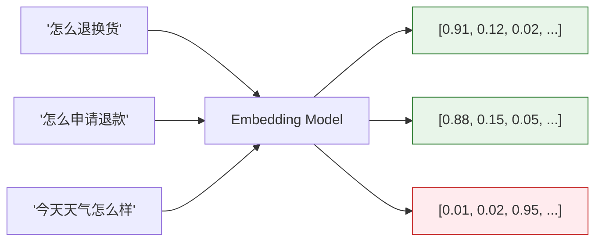
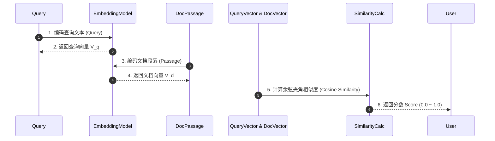
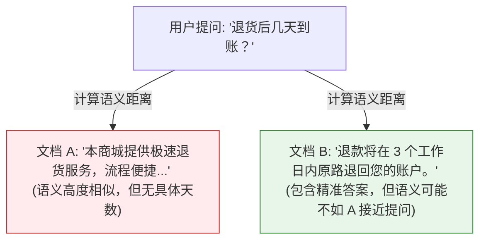

import GlossaryTerm from '@site/src/components/GlossaryTerm';
import GuidedExercise from '@site/src/components/GuidedExercise';
import ResearchNote from '@site/src/components/ResearchNote';
import ChapterMeta from '@site/src/components/ChapterMeta';
import PyRunner from '@site/src/components/PyRunner';
import TradeoffExplorer from '@site/src/components/TradeoffExplorer';
import StepFlow from '@site/src/components/StepFlow';
import QuizCard from '@site/src/components/QuizCard';

# M8L2 · Embedding 与向量表示

<ChapterMeta
  time="约 2.5 小时"
  prereqs={[{label: 'M8L1 为什么 RAG', href: './why-rag'}, {label: 'M7L2 token', href: '../llm-systems/tokenization-context'}]}
  outcome="能解释 embedding 把文本映射为语义向量、用余弦相似度衡量语义接近、并理解“语义相似≠能回答问题”的关键区别。"
  howToUse="先看“关键词匹配的局限”，再理解 embedding 和余弦相似度，最后做相似度检索 lab。"
/>

:::tip 关键词匹配不懂“意思”，embedding 才懂
用户问"怎么退货"，知识库里写的是"退换货流程"——关键词不重合，纯字符匹配就找不到。但它们**意思相近**。怎么让机器懂"意思"？把文本映射成一个高维向量（embedding），让**意思相近的文本，向量也相近**。这样"找意思相关的内容"就变成了"找距离近的向量"——这是整个语义检索的地基。
:::

## 一、字面不同，意思相同

检索的根本难题：人会用不同的词表达同一个意思。"退货" vs "退换货" vs "把买的东西退回去"——字面差别大，意思几乎一样。基于关键词的检索（[下节会讲它仍有用](./hybrid-search)）对这种"换了说法"无能为力。要捕捉"意思"而非"字面"，需要一种能表示**语义**的方式——这就是 embedding。

## 二、三个核心概念（分层）

### 基础：什么是 embedding

<GlossaryTerm term="Embedding" definition="嵌入：把文本（或图像等）映射成一个固定长度的数值向量，使语义相近的内容在向量空间中距离也相近。是语义检索、聚类、推荐的基础表示。">embedding（嵌入）</GlossaryTerm>：用一个专门的模型，把一段文本变成一个固定长度的数值向量（比如 1024 个数）。关键性质：**语义相近的文本，向量在空间里也靠得近**。"退货"和"退换货"的向量很近，和"今天天气"的向量很远。于是"判断两段话意思像不像"就变成了"算两个向量距离"——一个机器能高效计算的问题。



### 进阶：余弦相似度

衡量两个向量"有多像"，最常用<GlossaryTerm term="Cosine Similarity" definition="余弦相似度：用两个向量夹角的余弦衡量方向是否一致，取值 -1~1，越接近 1 越相似。只看方向不看长度，是语义相似度最常用的度量。">余弦相似度</GlossaryTerm>：看两个向量**方向**的夹角余弦，范围 -1~1，越接近 1 越相似。它只关心方向、不关心长度（所以通常先把向量归一化）。"找最相关的 k 段"就是"找余弦相似度最高的 k 个向量"——这就是<GlossaryTerm term="Semantic Search" definition="语义检索：把查询和文档都转成 embedding，用向量相似度找出语义最相关的内容，而非依赖关键词字面匹配。">语义检索</GlossaryTerm>的核心动作。



### 深入（选学）：embedding 的工程要点与陷阱

- **语义相似 ≠ 能回答问题**：embedding 找的是"语义相近"，但"和问题相近的内容"不一定"包含答案"。比如问"退货要几天"，一段大谈退货流程但没提天数的文本可能相似度很高却答不了——这是 RAG 检索的核心难点，要靠[重排（M8L6）](./reranking)、[评测（M8L9）](./rag-evaluation) 来缓解。


- **embedding 模型要匹配任务和语言**：不同 embedding 模型质量差别大；中文要用支持中文的模型；有的针对"问答检索"专门优化（query 和 doc 分别编码）。选错模型，检索质量从根上就差。
- **同一套模型编码 query 和 doc**：检索时查询和文档必须用**同一个** embedding 模型编码，否则向量不在同一空间、距离无意义。
- **维度与成本**：维度越高表达力可能越强，但存储和计算成本也高；要权衡。
- **不只文本**：图像、音频也能 embedding，支撑多模态检索——但本月聚焦文本。

<ResearchNote
  title="Embedding：把语义变成可计算的几何距离"
  source="Mikolov et al. (2013), word2vec；Reimers & Gurevych (2019), Sentence-BERT；现代句向量/检索模型"
  href="https://arxiv.org/abs/1908.10084"
  insight="从 word2vec 到 Sentence-BERT 再到现代检索 embedding，核心思想一致：把文本映射到向量空间，使语义关系对应几何关系（相近的意思→相近的向量）。句级/段级 embedding + 余弦相似度成为语义检索的标准。检索专用模型常对 query 和 passage 做非对称优化。"
  application="用匹配任务和语言的 embedding 模型把文档和查询编码到同一空间，用余弦相似度做语义检索。牢记“语义相似≠含答案”，需重排和评测补足。选模型看检索质量、语言支持、维度/成本。query 和 doc 必须同模型编码。"
/>

## 五、跟我做一遍：余弦相似度语义检索

<PyRunner
  rows={34}
  expect="找到语义最相近的文档"
  code={`import math

# 玩具“embedding”：手工给几段文本编一个 3 维语义向量（真实由模型生成、上千维）
# 维度可理解为 [退货相关, 物流相关, 天气相关]
docs = {
    "退换货流程说明":       [0.9, 0.2, 0.0],
    "快递配送与物流跟踪":   [0.2, 0.9, 0.0],
    "今日天气预报":         [0.0, 0.0, 1.0],
    "无理由退货的条件":     [0.85, 0.1, 0.0],
}
query_vec = {"怎么退货": [0.9, 0.15, 0.0]}["怎么退货"]   # 查询的向量

def cosine(a, b):
    dot = sum(x*y for x, y in zip(a, b))
    na = math.sqrt(sum(x*x for x in a)); nb = math.sqrt(sum(y*y for y in b))
    return dot / (na * nb) if na and nb else 0.0

ranked = sorted(docs.items(), key=lambda kv: cosine(query_vec, kv[1]), reverse=True)
for name, vec in ranked:
    print("%.3f  %s" % (cosine(query_vec, vec), name))
print("---")
print("最相关:", ranked[0][0])     # “怎么退货”虽字面不含“退换货”，却语义命中
print("找到语义最相近的文档")`}
/>

"怎么退货"和"退换货流程""无理由退货的条件"字面不同，但向量方向相近、余弦相似度高，被排在前面——这就是语义检索胜过关键词的地方。**试试**：把 query 改成偏物流的向量 `[0.2,0.9,0]`，看排序如何变；想想为什么"天气预报"永远排最后。

## 六、动手 Lab（必做）

打开 `labs/month08/m8l2_embeddings/`：

```bash
python labs/month08/m8l2_embeddings/test_embeddings.py
```

实现余弦相似度 + top-k 语义检索：对给定查询向量，按相似度排出最相关的文档。

<GuidedExercise
  title="练习指引：实现语义相似检索"
  goal="把“余弦相似度 + top-k 排序”做成代码——语义检索的最核心动作。"
  hints={[
    'cosine(a,b) = 点积 / (模a * 模b)；空向量返回 0。',
    'top_k：对所有文档算相似度，降序取前 k。',
    'query 和 doc 向量必须同一空间（同模型编码）。',
    '相似度高 ≠ 一定含答案——记住这个局限。'
  ]}
  steps={[
    '实现 cosine(a, b)。',
    '实现 search(query_vec, docs, k)：返回 top-k (name, score)。',
    '处理零向量、k 大于文档数等边界。',
    '写测试：语义相近排前、不相关排后、top-k 数量正确、零向量安全。'
  ]}
  checks={[
    '你能解释 embedding 把语义变成向量距离。',
    '你的 lab 用余弦相似度做 top-k 检索。',
    '你能说出“语义相似≠含答案”的局限。',
    '你知道 query/doc 要同模型编码、模型要匹配语言任务。'
  ]}
/>

## 七、架构师深潜（Staff+ 视角）

### 1. 相似度/检索表示方式

<TradeoffExplorer
  title="文本相似度的表示"
  dimensions={['懂语义(换说法)', '精确匹配术语', '实现简单', '计算成本', '需要模型']}
  options={[
    {
      name: '关键词重叠(字面)',
      scores: [1, 5, 5, 5, 1],
      note: '统计共同词。对精确术语/专名很强、零模型。但完全不懂同义改写。',
      whenToUse: '精确匹配（产品号、专有名词、代码）——与向量互补（M8L5）。'
    },
    {
      name: 'Embedding + 余弦(语义)',
      scores: [5, 2, 3, 3, 5],
      note: '懂换说法/同义。但对精确术语/罕见专名可能不如关键词，依赖好模型。',
      whenToUse: '语义检索主力——绝大多数 RAG。'
    },
    {
      name: '混合(关键词+向量)',
      scores: [5, 5, 2, 2, 5],
      note: '两者融合，兼顾语义和精确。但更复杂（M8L5 细讲）。',
      whenToUse: '生产 RAG 的常见选择。'
    }
  ]}
/>

### 2. embedding 是 RAG 检索质量的"地基"

整个 RAG 的检索效果，从根上取决于 embedding 的质量：模型选得好（匹配语言、领域、问答任务），语义检索就准；选得差，后面的重排、查询改写都救不回来。架构师要把"选 embedding 模型 + 评测它在你数据上的检索效果"当成 RAG 项目的第一步（[用 M8L9 的检索指标](./rag-evaluation) 评测不同 embedding 模型）。同时记住它的固有局限——**语义相似不等于含答案、对精确术语不如关键词**——这正是为什么生产 RAG 要[混合检索（M8L5）](./hybrid-search) 和[重排（M8L6）](./reranking)，而不是只靠向量相似度。

### 3. 真实案例：向量是 AI 时代的新数据类型

embedding 不只用于 RAG：推荐系统（相似商品/内容）、去重（相似文档）、聚类、分类、[语义缓存（M7L11）](../llm-systems/llm-caching-resilience)、异常检测——本质都是"把对象变成向量，用距离做判断"。所以"向量"正成为和"文本/数字"并列的一种基础数据类型，[向量库（M8L3）](./vector-search) 成为新的基础设施。理解 embedding，你掌握的不只是 RAG 的一环，而是 AI 应用里一种通用的"语义计算"能力——这也是为什么本月把它放在检索基础的第一位。

### 4. 架构师深问（给自己 30 分钟）

- 你的知识库是什么语言、什么领域？现成 embedding 模型在你的数据上检索准吗？怎么用 M8L9 指标验证？
- 你的查询里有很多精确术语/产品号/专名吗？纯向量可能漏掉它们——是否需要[混合检索（M8L5）](./hybrid-search)？
- "语义相似但不含答案"在你的场景会造成什么问题？怎么用重排/评测发现和缓解？

## 知识自测

<QuizCard
  questions={[
    {
      q: '为什么说“语义相似不等于包含答案”是 RAG 系统的核心难点？',
      options: [
        'A. 因为 Embedding 模型无法计算相似度',
        'B. 因为相似度算法只衡量语义特征的几何相近，而不能判断文本中是否包含解决问题的事实细节',
        'C. 因为向量数据库无法存储长文本',
        'D. 因为大语言模型无法理解向量'
      ],
      answer: 1,
      explain: '余弦相似度只保证文本在话题或语义方向上是契合的（比如“退货”与“退款条件”），但不能判定它是否包含了回答用户特定问题的证据（如是否包含“运费谁付”的具体条款）。这需要后续的重排（Reranking）或评估机制来进一步甄别。'
    },
    {
      q: '在进行向量检索时，为什么必须使用“同一套 Embedding 模型”对 Query 和 Document 进行编码？',
      options: [
        'A. 为了降低 API 调用成本',
        'B. 为了防止大模型因为格式不同而拒绝回答',
        'C. 因为不同模型生成的向量处于不同的几何流形/数学空间中，跨空间的相似度计算没有任何物理意义',
        'D. 仅仅是行业惯例，实际上混用也是可行的'
      ],
      answer: 2,
      explain: '每个 Embedding 模型在训练时所构建的高维语义空间的基底与流形都是独一无二的。如果使用不同的模型，它们的维度和空间方向定义完全不同，计算出的相似度没有任何数学或实际意义。'
    },
    {
      q: '在评估 Embedding 模型时，如果发现模型在你的业务专属术语（如特殊产品型号、公司独有内部系统代号）上召回率极低，最直接高效的改进手段是什么？',
      options: [
        'A. 直接微调基础 LLM 模型',
        'B. 引入混合检索（Hybrid Search），将关键词匹配（BM25）与向量检索融合成 RRF 排序',
        'C. 盲目增加 Embedding 向量维度，比如从 768 提到 3072',
        'D. 更换其他不支持中文的英文 Embedding 模型'
      ],
      answer: 1,
      explain: 'Embedding 模型对生僻、专属术语（Out-Of-Vocabulary 词汇）可能缺乏敏感度，极易计算出错。此时，引入混合检索（Hybrid Search，下节 M8L5 详解）结合关键词检索（对专有名词精确匹配）是解决该问题最标准、性价比最高的方式。'
    }
  ]}
/>

## 自检清单

- [ ] 我能解释 embedding 把语义映射成向量距离。
- [ ] 我能用余弦相似度做 top-k 语义检索。
- [ ] 我理解"语义相似≠含答案"的局限。
- [ ] 我知道选 embedding 要匹配语言/任务、query 和 doc 同模型编码。

## 常见误解

- **"检索就是关键词匹配"**：语义检索用 embedding 懂"换说法"，但精确术语仍靠关键词（互补）。
- **"相似度高就是答案"**：语义相近不等于包含答案，要靠重排和评测补。
- **"随便挑个 embedding 模型都行"**：要匹配语言/领域/任务，选错从根上拉低检索质量。

## 延伸阅读

- [Sentence-BERT (2019)](https://arxiv.org/abs/1908.10084)
- [MTEB: 文本嵌入基准](https://huggingface.co/spaces/mteb/leaderboard)
- [下一课：向量检索与向量库](./vector-search)
