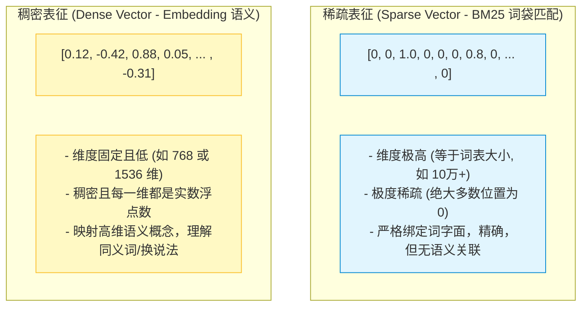
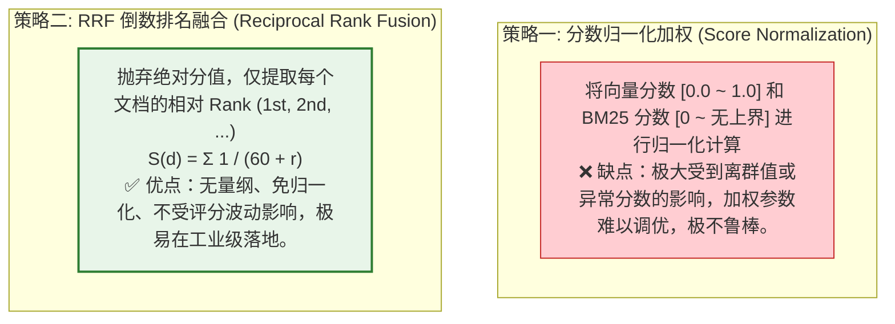

import GlossaryTerm from '@site/src/components/GlossaryTerm';
import GuidedExercise from '@site/src/components/GuidedExercise';
import ResearchNote from '@site/src/components/ResearchNote';
import ChapterMeta from '@site/src/components/ChapterMeta';
import PyRunner from '@site/src/components/PyRunner';
import TradeoffExplorer from '@site/src/components/TradeoffExplorer';
import StepFlow from '@site/src/components/StepFlow';
import QuizCard from '@site/src/components/QuizCard';

# M8L5 · 混合检索

<ChapterMeta
  time="约 2.5 小时"
  prereqs={[{label: 'M8L2 embedding', href: './embeddings'}, {label: 'M8L3 向量检索', href: './vector-search'}, {label: 'M3L2 索引', href: '../data-cache-queue/indexing'}]}
  outcome="能解释向量检索和关键词检索各自的强弱、用 RRF 把两路结果融合，做出比单一方法更稳的混合检索。"
  howToUse="先看“向量漏掉精确术语”的痛，再理解关键词检索和 RRF 融合，最后做混合检索 lab。"
/>

:::tip 向量和关键词各有盲区，最好的检索是“两个一起用”
[向量检索（M8L2/L3）](./embeddings) 懂语义、能匹配"换了说法"的内容，但它有个盲区：**对精确术语、产品型号、专有名词、罕见词，常常不如老老实实的关键词匹配。** 反过来关键词匹配抓得住精确术语，却完全不懂同义改写。聪明的做法不是二选一，而是**两路都检索、再把结果融合**——这就是混合检索，生产 RAG 的常见标配。
:::

## 一、向量检索的盲区

向量检索强在语义，但会在这些地方栽跟头：
- **精确术语/型号**：用户搜"错误码 E1042"，向量可能把它和一堆"错误处理"的泛泛内容混在一起，反而漏掉那条正好讲 E1042 的。
- **专有名词/罕见词**：人名、产品名、缩写——embedding 对低频词表示弱。
- **要求字面精确的场景**：法律条款编号、API 函数名、代码符号。

这些恰恰是**关键词匹配**的强项（[M3L2 倒排索引](../data-cache-queue/indexing) 的老本行）。所以把两者结合，能互补盲区。

## 二、三个核心概念（分层）

### 基础：关键词检索（BM25）

经典的关键词检索算法是 <GlossaryTerm term="BM25" definition="BM25：经典的关键词检索打分算法，基于词频（TF）和逆文档频率（IDF），并对文档长度归一化。擅长精确术语/罕见词匹配，是稀疏检索的代表。">BM25</GlossaryTerm>：基于词频（一个词在文档里出现多少次）和逆文档频率（这个词有多罕见、多有区分度），并对文档长度做归一化打分。它属于<GlossaryTerm term="Sparse Retrieval" definition="稀疏检索：基于词项匹配的检索（如 BM25），文档表示为高维稀疏向量（大部分维度为 0）。擅长精确/罕见词，但不懂语义改写。">稀疏检索</GlossaryTerm>（对应向量的<GlossaryTerm term="Dense Retrieval" definition="稠密检索：基于 embedding 向量相似度的检索，文档表示为低维稠密向量。懂语义改写，但对精确术语/罕见词较弱。">稠密检索</GlossaryTerm>）。对精确术语、罕见词，BM25 往往比向量更准。

### 进阶：混合检索与 RRF 融合

<GlossaryTerm term="Hybrid Search" definition="混合检索：同时用稠密（向量）和稀疏（关键词/BM25）两路检索，再把两路结果融合排序，兼顾语义理解和精确匹配，通常比单一方法更稳更准。">混合检索</GlossaryTerm>：两路并行检索，再融合。怎么融合两个排名？最常用、最稳健的是 <GlossaryTerm term="Reciprocal Rank Fusion" definition="倒数排名融合（RRF）：把每个文档在各路结果里的排名转成分数（1/(k+rank)）再相加，排名越靠前贡献越大。无需各路分数可比，简单稳健，是融合多路检索的常用方法。">RRF（倒数排名融合）</GlossaryTerm>：一个文档在某路排第 r 名，就得 `1/(k+r)` 分（排名越靠前分越高），把它在各路的得分相加再排序。RRF 的妙处：**不需要让向量相似度和 BM25 分数可比**（它们量纲完全不同），只看排名，简单又稳。

### 深入（选学）：混合检索的工程要点

- **为什么 RRF 比"加权分数"好**：向量余弦相似度（0~1）和 BM25 分数（无上界）没法直接加权相加——量纲不一致、分布不同。RRF 只用排名，绕开了归一化难题，所以成为默认选择。当然也可以做更精细的分数归一化加权，但 RRF 性价比最高。
- **两路的召回要够宽**：每路各取 top-N（N 比最终要的 k 大），融合后再取 top-k——给融合留出"互相补救"的空间。
- **混合检索常作为重排前的召回层**：混合检索负责"广撒网、别漏"（高召回），[重排（M8L6）](./reranking) 负责"精挑细选"（高精度）——两者配合是生产 RAG 的典型两/三阶段架构。
- **不是所有场景都需要**：如果你的查询和文档几乎没有精确术语（纯自然语言问答），单向量可能就够；术语密集（技术文档、代码、法律）混合收益大。按 [M8L9 评测](./rag-evaluation) 决定是否值得加这层复杂度（[YAGNI](../design-patterns-lld/change-driven-design)）。

<ResearchNote
  title="混合检索：稠密 + 稀疏，用 RRF 融合"
  source="Robertson & Zaragoza (2009), BM25；Cormack et al. (2009), Reciprocal Rank Fusion；现代 RAG 混合检索实践"
  href="https://plg.uwaterloo.ca/~gvcormack/cormacksigir09-rrf.pdf"
  insight="稠密检索（向量）懂语义但弱于精确术语；稀疏检索（BM25）强于精确/罕见词但不懂改写。两者互补，混合检索普遍优于单一方法。RRF 用排名的倒数相加来融合多路结果，无需分数可比，简单稳健，成为融合默认方案。"
  application="术语密集或混合查询场景用混合检索：向量 + BM25 各取较宽 top-N，用 RRF 融合再取 top-k，常作为重排前的召回层。纯自然语言问答单向量可能够用。是否加混合，用评测在你的数据上验证收益。"
/>

## 三、混合检索技术图解 (Deep Dive Diagrams)

为了更清晰地表达混合检索的底层数学原理与多路融合的设计，我们在此拆解稀疏表征与稠密表征的维度特征、RRF 排序计算机制以及归一化加权策略的弊端。

### 1. 特征对比：稀疏向量 (Sparse) 与稠密向量 (Dense)

稀疏与稠密不仅代表检索算法的不同，本质上是两种完全相反的数据结构表示法，其维度与承载语义有根本的差异。



### 2. 多路合并：RRF 倒数排名融合计算过程

RRF 算法将每个候选文档在两路队列中的排序转为倒数分数相加。在这个模型中，即便某个文档在其中一路没有很高的语义分，它也可能凭借极高的字面匹配度被拉进 Top-K。

```mermaid
graph TD
    classDef step fill:#e8f5e9,stroke:#2e7d32,stroke-width:1.5px;
    classDef doc fill:#fff9c4,stroke:#fbc02d,stroke-width:1px;
    
    Query["用户查询: 'E1042 故障处理'"] --> Sparse["路 1: 稀疏检索 (BM25)"]
    Query --> Dense["路 2: 稠密检索 (向量)"]

    subgraph SparseRank ["BM25 召回排名"]
        S1["1st: 文档 d3 (精确命中 E1042)"]:::doc
        S2["2nd: 文档 d1 (含故障)"]:::doc
    end
    Sparse --> SparseRank

    subgraph DenseRank ["向量召回排名"]
        D1["1st: 文档 d1 (语义高相关)"]:::doc
        D2["2nd: 文档 d2 (语义相关)"]:::doc
        D3["3rd: 文档 d3 (语义低相关)"]:::doc
    end
    Dense --> DenseRank

    SparseRank --> MergeRRF["RRF 融合打分计算 (常数 k=60)"]:::step
    DenseRank --> MergeRRF

    subgraph MergeCalc ["RRF 分数叠加"]
        M1["d1: 1/(60+2) [BM25"] + 1/(60+1) [向量] = 0.0325"]:::doc
        M2["d3: 1/(60+1) [BM25"] + 1/(60+3) [向量] = 0.0322"]:::doc
        M3["d2: 0 [BM25"] + 1/(60+2) [向量] = 0.0161"]:::doc
    end
    MergeRRF --> MergeCalc

    MergeCalc --> FinalOutput["最终混合排序结果: [d1, d3, d2"]"]:::step
```

### 3. 稳健底座：分数归一化加权 vs RRF 图解

在融合两路结果时，直接做分数的归一化极度受到异常最大/最小值的扰动，这也是工业级架构师为什么首选 RRF 这个无量纲鲁棒策略的原因。



## 四、落地实践：混合检索与 RRF 融合闭环

在真实的 RAG 架构设计中，一条包含过滤属性的混合检索请求，要经历以下四步处理流程：

<StepFlow
  steps={[
    {
      title: '1. 多路检索分发 (Multi-Query Ingestion)',
      desc: '在线层接收用户提问，同步将提问转化为稀疏特征（关键词集合）与稠密特征（Embedding 向量）。并发分发到稀疏引擎和向量引擎中。',
      diagram: '提问 "E1042错误怎么修" ──> [BM25 检索] & [向量检索] 并发执行'
    },
    {
      title: '2. 召回宽列表提取 (Recall Generation)',
      desc: '两路检索各独立返回一个候选列表，为了后续融合留足空间，通常两路召回的范围 N 应该大于最终展现数 K（例如设置 N=50, K=10）。',
      diagram: 'BM25 召回 Top-50 ──> | RRF 融合层 | <── 向量召回 Top-50'
    },
    {
      title: '3. 倒数排名融合计算 (RRF Scoring)',
      desc: '在融合层中提取出各候选文档在各自队列中的排位索引。应用公式 1/(k + rank) 计算得分。将文档在稠密、稀疏两路的得分做相加合并。',
      diagram: '文档 d3 ──> 稀疏排 1st (1/61), 稠密排 3rd (1/63) ──> 分数相加 = 0.0322'
    },
    {
      title: '4. 融合重新排序与截断 (Truncation & Context)',
      desc: '对累加后的 RRF 得分按降序重新排列，取最靠前的 Top-K 篇文档作为检索结果，并注入 Prompt 上下文送入大模型生成最终回答。',
      diagram: '排序结果 [d1, d3, d2, ...] ──> 取前 K 个 ──> 构建 RAG 回答'
    }
  ]}
/>

## 五、跟我做一遍：BM25 简版 + 向量 + RRF 融合

<PyRunner
  rows={38}
  expect="混合融合兼顾语义和术语"
  code={`# 文档：每条有 关键词集合 和 一个语义向量（玩具）
docs = {
    "d1": {"kw": {"退货", "流程"}, "vec": [0.9, 0.1]},
    "d2": {"kw": {"退款", "时效"}, "vec": [0.8, 0.2]},
    "d3": {"kw": {"错误码", "E1042", "排查"}, "vec": [0.1, 0.2]},  # 精确术语文档
    "d4": {"kw": {"配送", "物流"}, "vec": [0.2, 0.9]},
}

def keyword_rank(query_kw, docs):              # 稀疏：按关键词重叠排名
    scored = [(d, len(query_kw & docs[d]["kw"])) for d in docs]
    return [d for d, s in sorted(scored, key=lambda x: -x[1]) if s > 0]

def vector_rank(qvec, docs):                   # 稠密：按向量点积排名（简化）
    scored = [(d, sum(a*b for a,b in zip(qvec, docs[d]["vec"]))) for d in docs]
    return [d for d, s in sorted(scored, key=lambda x: -x[1])]

def rrf(rankings, k=60):                        # RRF 融合多路排名
    score = {}
    for ranking in rankings:
        for rank, doc in enumerate(ranking):
            score[doc] = score.get(doc, 0) + 1.0 / (k + rank + 1)
    return [d for d, _ in sorted(score.items(), key=lambda x: -x[1])]

# 查询：“错误码 E1042 怎么处理” —— 含精确术语
q_kw = {"错误码", "E1042"}
q_vec = [0.85, 0.15]                            # 语义偏“退货/流程”那一类

kw = keyword_rank(q_kw, docs)
vec = vector_rank(q_vec, docs)
print("纯关键词:", kw)        # d3 靠前（精确命中 E1042）
print("纯向量:", vec)         # d3 靠后（语义不突出）
print("RRF 融合:", rrf([kw, vec]))   # d3 被关键词拉上来，兼顾两者
print("混合融合兼顾语义和术语")`}
/>

纯向量会漏掉精确命中"E1042"的 d3（语义不突出），纯关键词又不懂语义；RRF 融合把两路的优势合起来，d3 被关键词那路拉上来。**试试**：把查询改成纯语义的（去掉术语），看融合结果如何更偏向向量那路；调 RRF 的 k 值看排名变化。

## 六、动手 Lab（必做）

打开 `labs/month08/m8l5_hybrid/`：

```bash
python labs/month08/m8l5_hybrid/test_hybrid.py
```

实现关键词排名 + 向量排名 + RRF 融合：两路各自检索、用 RRF 合并、兼顾精确术语和语义。

<GuidedExercise
  title="练习指引：实现混合检索 + RRF"
  goal="把“稠密 + 稀疏两路检索 + RRF 融合”做成代码——生产 RAG 的常见召回层。"
  hints={[
    'keyword_rank：按关键词重叠数降序（重叠为 0 的可不返回）。',
    'vector_rank：按相似度/点积降序。',
    'rrf：每路里排名 r（从 0 起）贡献 1/(k+r+1)，各路相加再排序。',
    'RRF 只用排名，不需要两路分数可比——这是它的关键好处。'
  ]}
  steps={[
    '实现 keyword_rank(query_kw, docs)。',
    '实现 vector_rank(qvec, docs)。',
    '实现 rrf(rankings, k=60)。',
    '写测试：精确术语文档在融合后上升、纯语义查询偏向量、RRF 分数计算正确、空路安全。'
  ]}
  checks={[
    '你能说出向量和关键词检索各自的强弱。',
    '你的 lab 用 RRF 融合两路、兼顾语义和术语。',
    '你能解释 RRF 为什么用排名而非分数。',
    '你知道混合常作召回层、配重排、按评测决定是否用。'
  ]}
/>

## 七、架构师深潜（Staff+ 视角）

### 1. 检索方式对比

<TradeoffExplorer
  title="检索方式"
  dimensions={['懂语义/改写', '精确术语/罕见词', '实现简单', '召回稳健', '额外成本']}
  options={[
    {
      name: '纯向量(稠密)',
      scores: [5, 2, 4, 3, 3],
      note: '懂换说法。但漏精确术语/型号/专名，对罕见词弱。',
      whenToUse: '纯自然语言问答、术语不多时。'
    },
    {
      name: '纯关键词(BM25/稀疏)',
      scores: [1, 5, 4, 3, 2],
      note: '抓精确术语/罕见词、可解释。但完全不懂同义改写。',
      whenToUse: '术语/代码/编号为主、语义需求低时。'
    },
    {
      name: '混合(向量+关键词+RRF)',
      scores: [5, 5, 2, 5, 4],
      note: '兼顾语义和精确、召回最稳。但要维护两套索引、更复杂。',
      whenToUse: '术语密集或混合查询的生产 RAG——常见标配。'
    }
  ]}
/>

### 2. "互补的弱模型组合 > 单个强模型"

混合检索体现了一个通用的工程智慧：**与其指望一个方法解决所有情况，不如把几个各有盲区、但盲区互补的方法组合起来。** 向量的盲区（精确术语）正是关键词的强项，反之亦然，所以它们的组合比任何单一方法都稳。这和 [M5 的冗余/多副本](../core-components/replication)、[集成学习] 是同一思想。架构师在 RAG（乃至更广的 AI 系统）里要善用这种"互补组合"：混合检索、[多查询（M8L7）](./query-transformation)、[多模型降级（M7L11）](../llm-systems/llm-caching-resilience)、[多路 Agent] 都是它的体现。关键是确保组合的成员**盲区不同**——否则只是冗余而无互补。

### 3. 真实案例：纯向量 RAG 的"找不到精确答案"之痛

一个反复出现的真实问题：团队上了向量 RAG，大部分问答不错，但用户一搜具体的产品型号、错误码、合同条款编号、API 名，就经常找不到——因为这些精确 token 正是向量的盲区。加上 BM25 混合检索后，这类查询的命中率显著回升。这就是为什么成熟的生产 RAG（尤其面向技术文档、企业知识、代码、法律）几乎都是混合检索，而不是教程里常见的"纯向量"。架构师要预判你的查询里有多少"精确匹配"需求，据此决定要不要混合——这是个常被新手漏掉、却影响很大的设计点。

### 4. 架构师深问（给自己 30 分钟）

- 你的用户查询里，有多少是精确术语/型号/编号/代码？纯向量会漏掉它们吗？
- 加 BM25 混合要多维护一套关键词索引——这个复杂度，用 [M8L9 评测](./rag-evaluation) 量化收益值不值？
- 混合作召回层（高召回）+ 重排作精排（高精度）——你的两/三阶段检索架构怎么设计？

## 知识自测

<QuizCard
  questions={[
    {
      q: '稀疏检索（如 BM25）与稠密检索（如向量相似度）相比，其最显著的优势体现在哪里？',
      options: [
        'A. 稀疏检索能够理解复杂的同义词替换',
        'B. 在遇到精确的产品序列号、错误码、特定 API 函数名等对字符有字面精确匹配要求的场景时，召回率极高',
        'C. 稀疏检索的向量维度非常低，消耗极少的内存',
        'D. 稀疏检索在英文问答上的准确率远远高于中文'
      ],
      answer: 1,
      explain: 'BM25 基于精确词项匹配和 IDF（逆文档频率）打分，对于低频、罕见且字面精确的术语（如 E1042 错误码）能进行精确的检索，完美弥补了向量检索在表征此类词汇时容易产生的语义稀释问题。'
    },
    {
      q: 'RRF（Reciprocal Rank Fusion）倒数排名融合算法中，引入常数参数 k（默认通常为 60）的主要目的是什么？',
      options: [
        'A. 限制最终融合后输出的文档数量为 60',
        'B. 为了防止处于非常靠后排名的项的微小变动对最终融合结果产生过大的权重偏置，并且平滑各路检索低名次位置的得分权重',
        'C. 为了减少向量库的查询 QPS',
        'D. 为了防止 API 调用超时而设定的最大连接数限制'
      ],
      answer: 1,
      explain: '如果 k 过小，低名次排名的微小波动（比如从 10 降到 11）会对倒数分值产生非常强烈的拉扯影响；加上常数 k=60 可以使分母整体偏大，有效平滑掉低名次排位波动对总分的影响，保证检索系统的鲁棒性。'
    },
    {
      q: '在搭建生产级混合检索系统时，如果我们将两路召回的候选范围 N 设得与最终需要的展现数 K 一致（例如 N = K = 5），会带来什么工程隐患？',
      options: [
        'A. 向量数据库会发生分片错误',
        'B. 导致合并打分时发生内存溢出错误',
        'C. 可能会导致在融合阶段，部分在一个维度上极强而在另一个维度上稍微落后的核心文档由于没被召回（即未进入各自的 Top-5 候选集），从而错失了在融合后进入前 5 名的机会，导致混合检索优势荡然无存',
        'D. 强制导致 RRF 的 k 自动被重置为 0'
      ],
      answer: 2,
      explain: '如果召回候选集 N 过小，多路融合就失去了“互相补救”的意义。比如文档 A 虽然在向量通道上排第 6 名（未进入前 5 召回集），但在 BM25 上排第 1，如果 N=5，融合层在向量队列里就完全找不到该文档，无法对其累加分数，最终使其可能落榜。因此通常要放宽候选提取（如 N >= 3 * K）。'
    }
  ]}
/>

## 自检清单

- [ ] 我能说出向量(稠密)和关键词(稀疏/BM25)各自的强弱盲区。
- [ ] 我的 lab 用 RRF 融合两路检索。
- [ ] 我理解 RRF 为什么用排名而非分数。
- [ ] 我知道混合常作召回层、配重排、按评测决定是否采用。

## 常见误解

- **"向量检索全面碾压关键词"**：向量漏精确术语/罕见词，关键词在这些上更强，互补。
- **"融合就是把分数相加"**：向量和 BM25 分数量纲不同没法直接加；RRF 用排名更稳。
- **"RAG 都该用纯向量"**：术语密集场景纯向量漏召回严重，混合才稳。

## 延伸阅读

- [Reciprocal Rank Fusion (Cormack et al., 2009)](https://plg.uwaterloo.ca/~gvcormack/cormacksigir09-rrf.pdf)
- [BM25 (Robertson & Zaragoza, 2009)](https://www.staff.city.ac.uk/~sbrp622/papers/foundations_bm25_review.pdf)
- [下一课：重排序](./reranking)