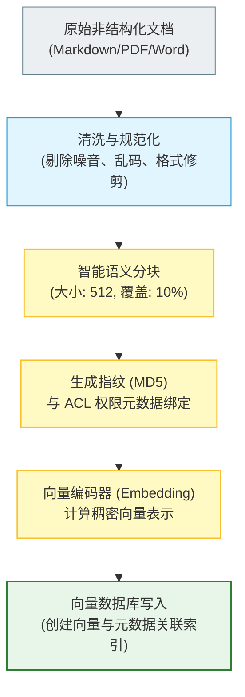
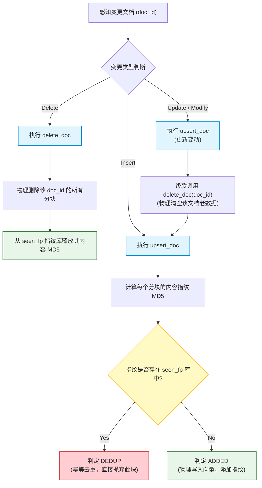
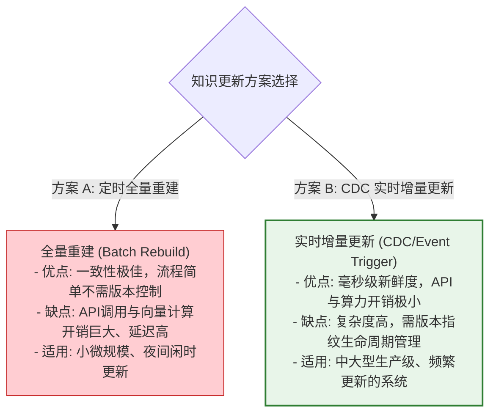

import GlossaryTerm from '@site/src/components/GlossaryTerm';
import GuidedExercise from '@site/src/components/GuidedExercise';
import ResearchNote from '@site/src/components/ResearchNote';
import ChapterMeta from '@site/src/components/ChapterMeta';
import PyRunner from '@site/src/components/PyRunner';
import TradeoffExplorer from '@site/src/components/TradeoffExplorer';
import StepFlow from '@site/src/components/StepFlow';
import QuizCard from '@site/src/components/QuizCard';

# M8L11 · 知识库工程与更新

<ChapterMeta
  time="约 2 小时"
  prereqs={[{label: 'M8L4 分块', href: './chunking'}, {label: 'M6L10 增量/幂等集成', href: '../cloud-enterprise-industrial/enterprise-erp-integration'}, {label: 'M8L10 元数据', href: './advanced-rag'}]}
  outcome="能把知识库当成持续运维的数据管道：设计摄取流程、增量更新（增/改/删）、去重、新鲜度管理、权限元数据，而非一次性灌数据。"
  howToUse="先看“知识库不是灌一次就完”，再理解摄取管道和增量更新，最后做增量索引 lab。"
/>

:::tip RAG 的“知识”会变——知识库是要持续运维的数据管道，不是一次性导入
教程里的 RAG 往往是“把一批文档灌进向量库就完事”。但真实知识库是**活的**：文档会新增、修改、删除、过期，还可能有重复、有权限。如果只灌一次不维护，知识很快就**过时、矛盾、有脏数据**——RAG 答的还是旧政策、已删除的内容、重复的条目。知识库的本质是一个**要持续运维的数据管道**（[呼应 M6L10 企业集成](../cloud-enterprise-industrial/enterprise-erp-integration)），这是 RAG 工程里最像“传统数据工程”的一环。
:::

## 一、灌一次就不管，知识很快烂掉

只做一次性导入的知识库，会慢慢腐烂：
- **过时**：公司政策改了，但知识库还是旧版，RAG 答错（还可能很自信）。
- **矛盾**：新旧文档都在库里，检索回来互相打架，模型不知信谁。
- **重复**：同一份文档导入多次、或多个来源有重复内容，检索结果冗余、挤占名额。
- **僵尸内容**：已删除/作废的文档还能被检索到，泄露或误导。
- **权限漂移**：文档权限变了，但索引里的权限标签没更新。

所以知识库需要**摄取管道 + 增量更新 + 去重 + 新鲜度 + 权限管理**——把它当一个持续运维的系统。

## 二、三个核心概念（分层）

### 基础：摄取管道

<GlossaryTerm term="Ingestion Pipeline" definition="摄取管道：把原始数据源转成可检索知识的流水线——解析、清洗、分块、向量化、写入向量库并打元数据。是知识库的上游数据工程，质量决定检索质量。">摄取管道（ingestion pipeline）</GlossaryTerm>：从数据源到可检索知识的流水线——**解析（清洗脏数据）→ [分块（M8L4）](./chunking) → 向量化 → 写入向量库 + 打[元数据（M8L10）](./advanced-rag)**。这是知识库的“上游数据工程”，[解析质量决定一切（M8L4 强调过）](./chunking)。它和 [M6 的数据管道、CI/CD](../cloud-enterprise-industrial/cicd-pipelines) 同理：要可重复、可监控、可重跑。

### 进阶：增量更新与去重

知识变了不能每次全量重建（慢、贵），要<GlossaryTerm term="Incremental Update" definition="增量更新：知识库只对变化的文档做增/改/删，而非全量重建。需要追踪文档版本/指纹，识别新增、变更、删除，并同步更新向量索引。">增量更新</GlossaryTerm>：
- **新增**：新文档 → 解析分块向量化 → 加入索引。
- **修改**：文档变了 → 删掉它的旧块、加入新块（靠文档 ID 关联）。
- **删除**：文档作废 → 从索引删掉它的所有块（避免僵尸内容）。
- <GlossaryTerm term="Deduplication" definition="去重：识别并合并/丢弃重复的文档或块（靠内容指纹/哈希），避免同一内容多次进索引，造成检索冗余和名额浪费。">去重</GlossaryTerm>：靠内容指纹（哈希）识别重复，避免同一内容多次入库（[呼应 M6L10 幂等集成](../cloud-enterprise-industrial/enterprise-erp-integration)：基于数据流的 <GlossaryTerm term="Idempotency" definition="幂等性：指一个操作被多次重复执行，其系统最终状态与仅执行一次时完全相同。在知识库数据工程中，指同一内容重复导入不会在向量索引中产生任何多余重复的分块。">幂等性 (Idempotency)</GlossaryTerm> 原则，重复导入不产生重复块）。

### 深入（选学）：新鲜度、权限同步与运维

- <GlossaryTerm term="Freshness" definition="新鲜度：知识库内容与真实来源的同步及时程度。靠定时/事件触发的增量更新、给块打时间戳、检索时按时效过滤旧版本来保证。">新鲜度（freshness）</GlossaryTerm>：怎么保证库跟得上来源？定时重新摄取、或由数据源 <GlossaryTerm term="CDC" definition="变更数据捕获：通过监听底层数据源或文件系统的事务日志，实时捕获并发布数据变更（增、改、删）的技术。在高级知识库更新中用来触发近实时的增量更新。">变更数据捕获 (CDC)</GlossaryTerm>（[M3L11](../data-cache-queue/consistency-patterns)）事件实时触发增量更新；给块打时间戳，[检索时过滤旧版本（M8L10）](./advanced-rag)。新鲜度要求越高，更新机制越要实时。
- **权限同步**：源文档权限变了，索引里的[权限元数据（M8L10）](./advanced-rag) 必须同步更新——否则会泄露或误拒。这是企业 RAG 的运维难点。
- **冲突与版本**：同一知识有多版本时，靠元数据（时间、版本号）让检索优先返回最新/权威版，或在生成时提示冲突（[M8L8](./rag-generation)）。
- **可观测**：监控知识库的覆盖率、新鲜度（最旧内容多久没更新）、摄取失败率、重复率——[像 M6L7 观测系统](../cloud-enterprise-industrial/observability-advanced) 那样观测知识库的健康。
- **本质是数据工程**：知识库运维和传统的[数据管道、ETL、数据质量](../cloud-enterprise-industrial/enterprise-erp-integration) 是一回事——RAG 的“AI”在检索生成，但知识库这层是扎实的数据工程，往往是 RAG 长期质量的决定因素。

<ResearchNote
  title="知识库是持续运维的数据管道，不是一次性导入"
  source="数据工程/ETL 实践；增量索引与 CDC（M3L11）；企业知识管理"
  href="https://www.pinecone.io/learn/series/rag/"
  insight="生产 RAG 的知识库需要摄取管道（解析-清洗-分块-向量化-写入+元数据）、增量更新（增/改/删，靠文档 ID/指纹）、去重（内容哈希）、新鲜度（定时/事件触发更新 + 时间戳过滤）、权限同步。它本质是数据工程，质量和新鲜度往往比检索算法更决定 RAG 的长期表现。"
  application="把知识库当持续运维的数据管道：建可重跑的摄取管道、用文档 ID/指纹做增量增改删、内容哈希去重、定时/CDC 保新鲜、同步权限元数据、监控覆盖率/新鲜度/失败率。摄取幂等（重复导入不产生重复）。先把这层数据工程做扎实。"
/>

## 三、知识运维与数据流管道控制图解 (Deep Dive Diagrams)

本节展示知识库从静态文件转变为高新鲜度、无冗余、动态生命周期管理的数据管道控制逻辑。

### 1. 结构全景：知识摄取与清洗加工数据管道

原始的业务非结构化文档，需要经过摄取加工流水线的多个环节加工清洗，最终成为具有丰富元数据的高可用分块，持久化到向量库。



### 2. 流程全景：文档增量变更（增、改、删）处理管道

当数据源（如 ERP、知识网）变更时，增量同步系统通过内容哈希与文档 ID 对比，确保仅对变动内容做精确的增删改，并彻底释放去重指纹池。



### 3. 比较全景：定时全量重建 vs. 实时增量更新对比

在选择知识更新机制时，需要在更新延迟、计算费用与系统复杂性之间进行系统级取舍。



## 四、落地实践：知识库自动更新与时效控制流水线

在真实的工程落地中，保障大语言模型获取的知识保持新鲜、防冗余且不被泄露，需在管道中实现如下四个步骤：

<StepFlow
  steps={[
    {
      title: '1. 变更感知与指纹生成 (CDC & Hash Tracking)',
      desc: '源系统文档变更触发变更捕获（CDC）系统，为所有新分块计算短哈希作为指纹，与数据库关联。',
      diagram: '文档数据库变更 ──> CDC 监听事件 ──> 触发数据管道 ──> 生成内容指纹 MD5'
    },
    {
      title: '2. 幂等去重与防冗余拦截 (Idempotent De-duplication)',
      desc: '在解析阶段利用 seen_fp 过滤掉内容一致的重复分块，确保不因多次上传导致库内出现重复块、挤占上下文名额。',
      diagram: '新建分块指纹 ──> 全局 seen_fp 哈希碰撞比对 ──> 存在则判定 DEDUP 丢弃'
    },
    {
      title: '3. 级联老数据物理清理 (Cascaded Purge)',
      desc: '对于修改的文档，在执行写入前必须调用清理网关，将该 doc_id 在向量数据库里的所有旧分块和旧指纹完全删除，不留遗留物。',
      diagram: '执行 upsert_doc ──> 级联清除历史块与 seen_fp 指纹 ──> 写入新块与指纹'
    },
    {
      title: '4. 时效时间戳标记与检索过滤 (Freshness Filtering Gateway)',
      desc: '为写入向量库的每个分块标记更新时间戳，当前台检索发生时，通过元数据过滤将过时文档前置屏蔽，强制召回最新版本。',
      diagram: '物理块写入成功 ──> 标记最新 epoch 时间戳 ──> 前台检索器时效加权过滤召回'
    }
  ]}
/>

## 五、跟我做一遍：增量索引更新 + 去重

<PyRunner
  rows={38}
  expect="增改删 + 去重 + 不留僵尸"
  code={`import hashlib

def fingerprint(text):
    return hashlib.md5(text.encode()).hexdigest()[:8]

class KnowledgeBase:
    def __init__(self):
        self.index = {}       # chunk_id -> {doc_id, text, fp}
        self.seen_fp = set()  # 已入库内容指纹（去重）
        self._n = 0

    def _add_chunk(self, doc_id, text):
        fp = fingerprint(text)
        if fp in self.seen_fp:
            return "DEDUP"                     # 内容重复，跳过
        self._n += 1
        self.index[self._n] = {"doc_id": doc_id, "text": text, "fp": fp}
        self.seen_fp.add(fp)
        return "ADDED"

    def upsert_doc(self, doc_id, chunks):
        self.delete_doc(doc_id)                # 改 = 先删旧块再加新块
        return [self._add_chunk(doc_id, c) for c in chunks]

    def delete_doc(self, doc_id):
        removed = [cid for cid, c in self.index.items() if c["doc_id"] == doc_id]
        for cid in removed:
            self.seen_fp.discard(self.index[cid]["fp"])
            del self.index[cid]
        return len(removed)

kb = KnowledgeBase()
print("新增 docA:", kb.upsert_doc("A", ["退货 7 天内", "退款 3-5 天"]))
print("重复导入同一块:", kb._add_chunk("A", "退款 3-5 天"))           # DEDUP
print("修改 docA(政策改了):", kb.upsert_doc("A", ["退货 14 天内", "退款 3-5 天"]))  # 删旧加新
print("当前内容:", [c["text"] for c in kb.index.values()])          # 已是新版,无旧"7天"
kb.delete_doc("A")
print("删除 docA 后:", len(kb.index), "块(无僵尸内容)")
print("增改删 + 去重 + 不留僵尸")`}
/>

修改文档时先删旧块再加新块（库里只剩新政策"14 天"，没有旧的"7 天"矛盾内容）；重复内容被去重；删除文档清空它的所有块（无僵尸）。**试试**：重复导入整个 docA 两次，看第二次全是 DEDUP；想想如果不做"改=先删后加"，库里会同时存在新旧两版导致检索矛盾。

## 六、动手 Lab（必做）

打开 `labs/month08/m8l11_kb_ops/`：

```bash
python labs/month08/m8l11_kb_ops/test_kb_ops.py
```

实现增量知识库：新增/修改(upsert)/删除文档、内容去重、修改时不留旧块、删除不留僵尸。

<GuidedExercise
  title="练习指引：实现增量知识库"
  goal="把“增/改/删 + 去重 + 不留僵尸”做成代码——知识库持续运维的核心。"
  hints={[
    '每个块记 doc_id 和内容指纹（哈希）。',
    'upsert_doc = 先 delete_doc(同 doc_id) 再加新块（改 = 删旧加新）。',
    'delete_doc 删该 doc 的所有块、并清理其指纹。',
    '去重：内容指纹已存在则跳过（DEDUP）。'
  ]}
  steps={[
    '实现 fingerprint 和 KnowledgeBase（index/seen_fp）。',
    '实现 _add_chunk（去重）、upsert_doc（删旧加新）、delete_doc。',
    '保证改文档后无旧块、删文档后无僵尸、重复内容被去重。',
    '写测试：新增、去重、修改不留旧版、删除清空、删后指纹释放可再加。'
  ]}
  checks={[
    '你能把知识库当持续运维的数据管道。',
    '你的 lab 支持增/改/删、去重、不留僵尸。',
    '你能说出新鲜度、权限同步怎么保证。',
    '你理解知识库本质是数据工程、决定 RAG 长期质量。'
  ]}
/>

## 七、架构师深潜（Staff+ 视角）

### 1. 知识库更新策略

<TradeoffExplorer
  title="知识库更新策略"
  dimensions={['新鲜度', '成本', '实现复杂度', '一致性', '适合规模']}
  options={[
    {
      name: '一次性导入(不更新)',
      scores: [1, 5, 5, 1, 1],
      note: '灌一次就不管。最省事，但很快过时、矛盾、有僵尸内容。',
      whenToUse: '一次性/静态知识、demo。'
    },
    {
      name: '定时全量重建',
      scores: [3, 2, 3, 4, 2],
      note: '定期重灌全部。简单、一致性好。但慢、贵、有更新延迟，大库不可行。',
      whenToUse: '小知识库、更新频率低时。'
    },
    {
      name: '增量更新(增/改/删)',
      scores: [4, 4, 2, 4, 5],
      note: '只动变化的、可配 CDC 近实时。高效、可扩展。但要追踪版本/指纹、处理一致性。',
      whenToUse: '生产知识库、需新鲜度和规模时。'
    }
  ]}
/>

### 2. RAG 的长期质量，由知识库运维决定

短期看，RAG 质量取决于检索算法（embedding、混合、重排）；**长期看，取决于知识库的运维质量**。一个检索算法很先进、但知识三个月没更新、满是矛盾旧版和僵尸内容的 RAG，远不如一个检索一般、但知识新鲜准确的。这正是 [M8L4 “RAG 质量常由上游数据决定”](./chunking) 的延续，也呼应 [M6L10 企业 AI 难在数据/集成而非模型](../cloud-enterprise-industrial/enterprise-erp-integration)。架构师做 RAG，要把相当一部分精力放在这个“不性感”的数据工程上——摄取管道、增量更新、新鲜度、权限同步、监控——因为它是 RAG 能长期可靠的地基。**AI 系统的质量，往往由最不起眼的数据管道决定。**

### 3. 真实案例：知识不新鲜 = RAG 慢性死亡

一个常见的真实衰退：RAG 上线时效果不错，几个月后用户抱怨越来越多——因为知识库还是上线时灌的那批，公司政策、产品、流程都变了，RAG 还在自信地答旧答案。更糟的是有人发现它引用了已经删除的文档。根因不是模型退化，而是**知识库没有运维机制**：没有增量更新、没有新鲜度监控、删除的内容没从索引清掉。修复方式就是本课内容：建摄取管道、接数据源变更（[CDC，M3L11](../data-cache-queue/consistency-patterns)）做增量更新、给内容打时间戳过滤旧版、监控新鲜度。**RAG 不是上线就完成，而是一个要持续喂养和维护的系统**——这是从“做出 RAG demo”到“运营 RAG 产品”的关键认知。

### 4. 架构师深问（给自己 30 分钟）

- 你的知识库怎么更新？一次性灌的还是有增量管道？源文档改了/删了，多久同步到索引？
- 删除的文档还能被检索到吗（僵尸内容）？同一知识的新旧版会同时被检索回来打架吗？
- 你监控知识库新鲜度吗（最旧内容多久没更新、覆盖率、重复率）？权限变更怎么同步到索引？

## 知识自测

<QuizCard
  questions={[
    {
      q: '在长周期的生产级 RAG 系统中，以下哪一项通常是决定其长期可靠度与回答质量的真正基石？',
      options: [
        'A. 是否购买了最昂贵的闭源大模型推理 API 服务',
        'B. 扎实的知识库工程运维（包括增量更新、幂等去重和时效新鲜度控制），如果数据源头陈旧污染，先进的检索算法也无济于事',
        'C. 将向量数据库的分块大小设置为一个固定的超大值',
        'D. 在 Prompt 中放置大量“相信我的知识库”的强暗示词'
      ],
      answer: 1,
      explain: '检索算法再先进，如果知识库里充斥着三年前的过期规定、已作废文档（僵尸内容）以及同一政策的十个不同冲突版本，大模型在召回证据时也会彻底被冗余矛盾的上下文淹没。因此，知识库的底层工程运营质量决定了 RAG 的上限。'
    },
    {
      q: '修改知识库中的某篇已有文档时，为什么要采用“级联调用 delete_doc 完全清空旧块，再追加新分块”的覆写模式？',
      options: [
        'A. 因为向量库不允许对现有向量的元数据字段执行增量变更操作',
        'B. 为了物理清除旧版本的冗余碎片和指纹，防止检索时同时召回新旧冲突证据，彻底避免大模型在回答时产生混乱与矛盾',
        'C. 级联清空仅是为了重置分块的自增 ID',
        'D. 这样可以使 Embedding 编码器免除计算向量的开销'
      ],
      answer: 1,
      explain: '如果修改文档仅采用“追加新块”而保留旧分块，不仅会极快耗尽向量空间，还会导致新旧不同版本描述并存于索引中，检索时极易产生新旧混杂打架的情况。级联清空（Cascaded Purge）可保障内容的唯一确定性。'
    },
    {
      q: '在构建近乎实时的企业知识库数据管道时，为了保障最高的水准的“数据新鲜度 (Freshness)”，架构师最理想的接入方案是？',
      options: [
        'A. 依靠前台用户在检索发现异常时，手动点击提交报错 of 纠错反馈单',
        'B. 每天夜间进行一次持续数小时的离线全量数据索引重建',
        'C. 采用变更数据捕获（CDC）系统实时监听源数据库事务日志，以事件驱动触发毫秒级的数据指纹 upsert 增量同步管道',
        'D. 缩短用户的查询句子的字数，提高检索召回率'
      ],
      answer: 2,
      explain: '全量重建在面对大规模海量库时在时间、算力与 API 消耗上具有极差的扩展性。采用 CDC 监听日志的事件驱动增量管道，能够实现针对性更新，兼顾近乎实时的知识新鲜度与极低的系统运算成本。'
    }
  ]}
/>

## 自检清单

- [ ] 我能把知识库当持续运维的数据管道设计。
- [ ] 我的 lab 支持增/改/删、去重、不留僵尸内容。
- [ ] 我理解新鲜度、权限同步、冲突版本怎么处理。
- [ ] 我知道知识库这层数据工程决定 RAG 的长期质量。

## 常见误解

- **“知识灌进去就完事了”**：知识会变，要增量更新、去重、保新鲜，否则很快腐烂。
- **“改文档直接加新块就行”**：不删旧块会导致新旧版同时被检索、互相矛盾。
- **“RAG 质量靠检索算法”**：长期质量更取决于知识库运维（新鲜、准确、无僵尸）。

## 延伸阅读

- [Pinecone: RAG series](https://www.pinecone.io/learn/series/rag/)
- [M6L10 企业集成（幂等/主数据）](../cloud-enterprise-industrial/enterprise-erp-integration)
- [下一课：Capstone 构建一个 RAG 系统](./capstone-rag)
