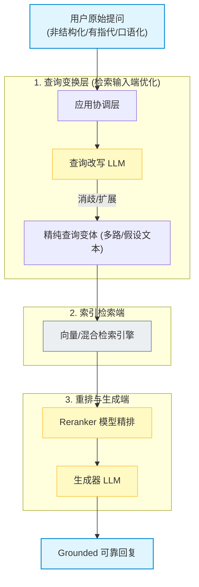
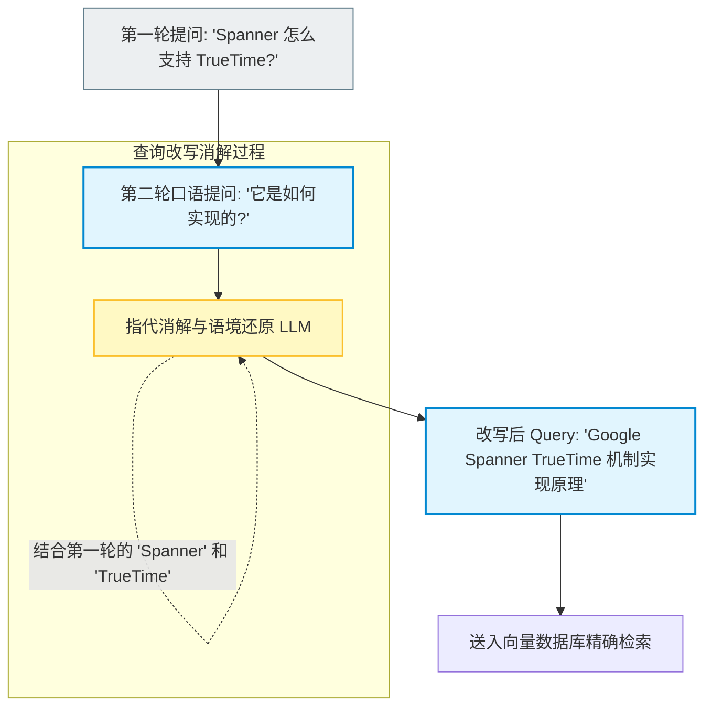
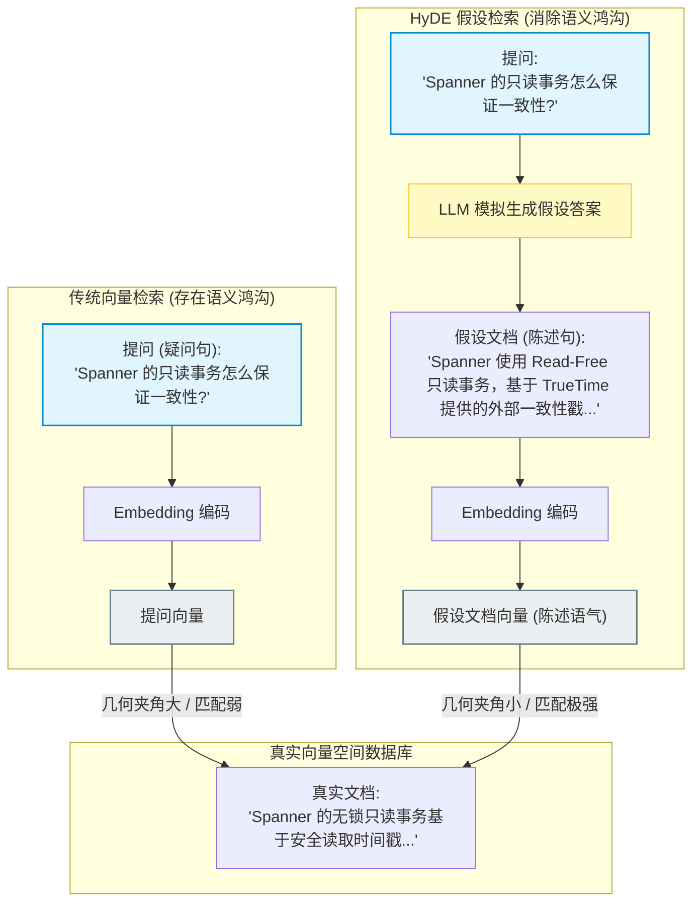

import GlossaryTerm from '@site/src/components/GlossaryTerm';
import GuidedExercise from '@site/src/components/GuidedExercise';
import ResearchNote from '@site/src/components/ResearchNote';
import ChapterMeta from '@site/src/components/ChapterMeta';
import PyRunner from '@site/src/components/PyRunner';
import TradeoffExplorer from '@site/src/components/TradeoffExplorer';
import StepFlow from '@site/src/components/StepFlow';
import QuizCard from '@site/src/components/QuizCard';

# M8L7 · 查询改写与扩展

<ChapterMeta
  time="约 2 小时"
  prereqs={[{label: 'M8L2 embedding', href: './embeddings'}, {label: 'M8L5 混合检索', href: './hybrid-search'}, {label: 'M7L4 提示工程', href: '../llm-systems/prompting-basics'}]}
  outcome="能识别“用户问法不利于检索”的问题，用查询改写、多查询扩展、HyDE 等手段在检索前优化查询，提升召回。"
  howToUse="先看“用户原话检索不到”的痛，再理解几种查询变换，最后做多查询扩展 lab。"
/>

:::tip 检索质量不只取决于文档，也取决于“问得好不好”
前几课都在优化"库这边"（[分块](./chunking)、[混合](./hybrid-search)、[重排](./reranking)）。但还有"问这边"：用户的原始问法常常**不利于检索**——太口语、有指代、有歧义、缺关键词、或一个问题其实包含多个意图。**在检索前先把查询"调好"**（改写、扩展、生成假设答案再检索），往往能显著提升召回——这是常被忽略的一环。
:::

## 一、用户的原话，常常检索不到

真实用户的查询很"不规整"：
- **太口语/啰嗦**："那个啥，我上次买的东西想退了咋整啊" —— 关键信息淹没在废话里。
- **有指代/依赖上下文**："它支持这个吗？" —— "它""这个"指什么，要结合对话历史才知道。
- **有歧义/多意图**："苹果怎么样" —— 水果还是公司？"对比 A 和 B 的价格和性能" —— 两个对象、两个维度。
- **缺关键词**：用户用的词和文档里的术语对不上（[M8L2 的语义鸿沟](./embeddings)）。

直接拿原话检索，召回质量差。解法：在检索前，用一步处理把查询变得更利于检索。

## 二、三个核心概念（分层）

### 基础：查询改写

<GlossaryTerm term="Query Rewriting" definition="查询改写：在检索前用 LLM 把用户的原始问法改写得更利于检索——消除指代、补全上下文、提炼关键词、规范术语。提升检索召回。">查询改写（query rewriting）</GlossaryTerm>：用 LLM 把用户原话改写成更适合检索的形式——消解指代（"它"→"产品X"，结合[对话历史 M7L8](../llm-systems/context-memory)）、去掉废话提炼关键词、把口语换成文档里的术语。比如把"我上次买的东西想退了咋整"改写成"退货流程 申请条件"。改写后再检索，命中率大幅提升。

### 进阶：多查询扩展与 HyDE

- <GlossaryTerm term="Multi-query Expansion" definition="多查询扩展：用 LLM 把一个查询改写成多个不同角度的查询，分别检索后合并去重结果。覆盖更多相关文档，提升召回，尤其对有歧义或多意图的问题。">多查询扩展</GlossaryTerm>：让 LLM 把一个查询生成**多个不同角度**的变体，分别检索、合并去重（[用 RRF 融合，M8L5](./hybrid-search)）。覆盖更全，尤其适合有歧义或多意图的问题。
- <GlossaryTerm term="HyDE" definition="假设文档嵌入（Hypothetical Document Embeddings）：先让 LLM 针对问题生成一个“假设的答案”，再用这个假设答案（而非原始问题）去做向量检索。因为答案和真正的文档在语义/措辞上更接近，常能提升召回。">HyDE（假设文档嵌入）</GlossaryTerm>：反直觉但有效——先让 LLM **生成一个假设的答案**，再用这个假设答案去检索。因为"答案"和库里真正的文档在措辞/语义上更接近（都是陈述句、用类似术语），比用"问题"去检索召回更准。

### 深入（选学）：查询变换的取舍与组合

- **代价是多一次 LLM 调用**：改写/多查询/HyDE 都要在检索前先调一次 LLM——增加延迟和成本（[M7L5](../llm-systems/llm-api-cost-latency)）。要权衡：召回提升值不值这次额外调用？简单清晰的查询可能不需要。
- **多意图要拆解**："对比 A 和 B" 这类，拆成"A 的信息""B 的信息"分别检索再合并，比一次检索好。
- **结合对话历史做改写**：多轮场景里，"它/这个"的指代必须结合[历史（M7L8）](../llm-systems/context-memory) 才能改写对——这是多轮 RAG 的关键。
- **别过度**：和前面一样，先把基础检索 + 评测做好，按 [M8L9 评测](./rag-evaluation) 发现"召回不行是因为查询问法"时再加查询变换（[YAGNI](../design-patterns-lld/change-driven-design)）。查询变换主要救"召回"问题，对"排序/生成"问题无效。
- 这一步本质是**把 LLM 用在检索的输入端**——和[重排把模型用在中间、生成把模型用在输出端](./rag-generation) 一起，构成"LLM 增强检索的全链路"。

<ResearchNote
  title="查询变换：在检索前用 LLM 优化“问法”"
  source="Gao et al. (2022), HyDE；Query Rewriting for RAG；Multi-query / RAG-Fusion 实践"
  href="https://arxiv.org/abs/2212.10496"
  insight="检索质量不只取决于文档侧，也取决于查询侧。查询改写消歧/补全/提炼关键词；多查询扩展从多角度覆盖；HyDE 用 LLM 生成的假设答案去检索（答案与文档更同质）。这些用 LLM 优化查询的手段能显著提升召回，代价是检索前多一次模型调用。"
  application="当评测显示召回差是因为查询问法（口语/指代/歧义/多意图/术语不符）时，加查询变换：改写（消歧+提炼）、多查询（覆盖广、RRF 融合）、HyDE（用假设答案检索）。多轮场景结合历史消解指代。权衡额外 LLM 调用的成本，按需使用。"
/>

## 三、查询变换技术图解 (Deep Dive Diagrams)

为了更深度地展现查询端优化所能带来的召回率提升，我们在此剖析查询变换在整个 RAG 漏斗中的定位、多轮对话中的指代还原路径以及 HyDE 检索的物理嵌入比对。

### 1. 结构全景：查询变换在 RAG 全链路中的位置

大语言模型（LLM）不仅用于最终的文本生成，也可以部署在最上游的输入端，用来消除用户提问中的口语歧义与废话。



### 2. 指代还原：多轮历史语境消解流程

多轮对话中最忌讳拿着用户的当前句（如：“它是如何实现的？”）直接检索向量库。改写器基于滑动历史窗口，将问题补全为实体相关的精纯查询。



### 3. 语义拉近：HyDE 假设文档的几何对齐机制

用户提问（疑问句）与库中文档（陈述句）具有天然的几何偏置。HyDE 模拟生成假设性的理想答案并对其编码，拉近了它们在语义空间的物理距离。



## 四、落地实践：多查询扩展与检索管道

在真实的 RAG 检索流水线中，在线查询改写与扩展召回的执行需要遵循如下四个阶段：

<StepFlow
  steps={[
    {
      title: '1. 意图拆解与多角度变体生成 (Variant Generation)',
      desc: '用户原始提问输入后，首先调用轻量级 LLM 对查询进行改写。生成 3-5 个用词不同、角度互补的查询变体（例如：结合同义词和专业术语）。',
      diagram: '原始 Query "怎么退货" ──> 生成变体 ["退货政策流程", "15天无理由退货", "退换货申请条件"]'
    },
    {
      title: '2. 并发多路检索召回 (Parallel Multi-Retrieval)',
      desc: '将生成的多个查询变体，并发地分发给底层的向量检索数据库，分别独立提取出各个变体的 Top-N 召回列表。',
      diagram: '变体 1, 2, 3 ──> [并发向量检索] ──> 获取三路 Top-30 结果'
    },
    {
      title: '3. 结果汇总与去重排序 (RRF Fusion & Deduplication)',
      desc: '多路结果返回后，执行合并去重，并可以应用 RRF 算法根据各个变体队列中排名对文档进行累加合并评分，重新排序。',
      diagram: '合并去重文档集 ──> 基于 RRF 重构总体名次排名'
    },
    {
      title: '4. Top-K 截断与精排送出 (Top-K Context Delivery)',
      desc: '提取出全局排名最靠前的 Top-K 篇文档段落，输出给后续的重排层或直接构建 Prompt 上下文，交给生成器模型。',
      diagram: '混合最佳结果 ──> 注入 LLM 上下文 ──> 保障极佳的召回率'
    }
  ]}
/>

## 五、跟我做一遍：多查询扩展 + 融合

<PyRunner
  rows={36}
  expect="多查询覆盖更全"
  code={`docs = {
    "d1": "苹果公司发布了新款手机",
    "d2": "苹果这种水果富含维生素",
    "d3": "iPhone 的电池续航说明",
    "d4": "如何挑选新鲜的苹果(水果)",
}

def retrieve(query_words, docs, k=2):           # 简化检索：关键词重叠
    q = set(query_words)
    scored = [(d, len(q & set(docs[d]))) for d in docs]
    return [d for d, s in sorted(scored, key=lambda x: -x[1])[:k] if s > 0]

# 单查询：歧义“苹果”，只检索一次，可能偏一边
print("单查询['苹果']:", retrieve(["苹果"], docs))

# 多查询扩展：LLM 把模糊查询拆成多个明确角度（这里手工模拟 LLM 的产出）
def expand(query):
    return {"苹果": [["苹果", "公司", "手机"], ["苹果", "水果", "维生素"]]}.get(query, [[query]])

def multi_query_retrieve(query, docs, k=2):
    results = []
    for variant in expand(query):
        for d in retrieve(variant, docs, k):
            if d not in results:
                results.append(d)               # 合并去重（可用 RRF 排序，M8L5）
    return results

print("多查询['苹果']:", multi_query_retrieve("苹果", docs))  # 覆盖公司和水果两面
print("多查询覆盖更全")`}
/>

单查询对歧义的"苹果"只能偏一边，多查询扩展把它拆成"苹果公司/手机"和"苹果水果/维生素"两个角度分别检索、合并，覆盖更全。**试试**：给 expand 再加一个角度；想想这多出来的覆盖，值不值"多一次 LLM 调用"的成本。

## 六、动手 Lab（必做）

打开 `labs/month08/m8l7_query/`：

```bash
python labs/month08/m8l7_query/test_query.py
```

实现查询改写（去停用词/提炼）+ 多查询扩展（多角度检索合并去重），提升召回。

<GuidedExercise
  title="练习指引：实现查询变换"
  goal="把“改写 + 多查询扩展 + 合并去重”做成代码，体会优化“问法”如何提升召回。"
  hints={[
    'rewrite：去掉停用词/口语词、保留关键词（模拟 LLM 提炼）。',
    'expand：把一个查询变成多个角度的词集合（模拟 LLM 生成）。',
    'multi_query_retrieve：每个变体各检索，合并去重。',
    '合并可用 RRF（M8L5）排序，这里去重即可。'
  ]}
  steps={[
    '实现 rewrite(query, stopwords)：提炼关键词。',
    '实现 multi_query_retrieve(variants, docs, k)：多路检索合并去重。',
    '组合：原始查询 -> 改写/扩展 -> 多路检索 -> 合并。',
    '写测试：改写去掉停用词、多查询覆盖更全、合并去重、单查询作为退化情形。'
  ]}
  checks={[
    '你能识别“用户问法不利于检索”的几种情况。',
    '你的 lab 能改写和多查询扩展提升召回。',
    '你能解释 HyDE 为什么用假设答案检索更准。',
    '你知道查询变换的代价（多一次 LLM 调用）和适用边界。'
  ]}
/>

## 七、架构师深潜（Staff+ 视角）

### 1. 查询变换手段

<TradeoffExplorer
  title="查询变换手段"
  dimensions={['提升召回', '处理歧义/多意图', '额外成本', '实现简单', '多轮适用']}
  options={[
    {
      name: '查询改写',
      scores: [4, 3, 2, 3, 5],
      note: '消歧/补全/提炼关键词。多轮里消解指代尤其重要。一次额外 LLM 调用。',
      whenToUse: '口语化、多轮、术语不符时。'
    },
    {
      name: '多查询扩展',
      scores: [5, 5, 1, 3, 3],
      note: '多角度覆盖、RRF 融合。对歧义/多意图最有效。但要多次检索 + 一次 LLM。',
      whenToUse: '查询有歧义或包含多个意图时。'
    },
    {
      name: 'HyDE',
      scores: [4, 2, 2, 3, 2],
      note: '用假设答案检索，答案与文档更同质。提升召回，但生成的假设可能带偏。',
      whenToUse: '问题与文档措辞差异大、纯向量召回差时。'
    }
  ]}
/>

### 2. RAG 优化要"全链路"看，别只盯一处

到这里，RAG 的优化点已经覆盖了全链路：**查询端**（本课：改写/扩展/HyDE）→ **索引端**（[分块 M8L4](./chunking)）→ **召回端**（[向量 M8L3](./vector-search) + [混合 M8L5](./hybrid-search)）→ **精排端**（[重排 M8L6](./reranking)）→ **生成端**（[下一课](./rag-generation)）。架构师做 RAG 优化的关键能力，是**用评测（[M8L9](./rag-evaluation)）定位问题出在哪一环**，再针对性优化，而不是盲目地什么都上。召回不行可能是查询问法（→查询变换）、可能是分块（→重新分块）、可能是 embedding（→换模型）、可能是缺精确匹配（→混合）；排序不行才上重排。**先诊断、再对症**，是 RAG 工程的核心方法论。

### 3. 真实案例：多轮对话里的"它"

多轮 RAG 最常见的翻车点：用户第二轮问"它的价格呢？"，系统直接拿"它的价格呢"去检索——"它"没有指代、检索一团糟。修法就是查询改写：结合[对话历史（M7L8）](../llm-systems/context-memory)把"它"解析成上一轮提到的具体对象（"产品X的价格"）再检索。几乎所有像样的多轮 RAG/对话式知识助手，都在检索前有一步"结合历史改写查询"。这看似小细节，却是多轮场景能不能用的分水岭——也再次说明 RAG 不只是"检索"，而是检索 + LLM 在多个环节的配合。

### 4. 架构师深问（给自己 30 分钟）

- 你的用户查询有多口语化/多歧义/多轮指代？直接拿原话检索召回如何？改写能提升多少？
- 查询变换要多一次 LLM 调用——这个延迟和成本，对你的高频场景可接受吗？哪些查询值得变换、哪些不必？
- 你能用评测区分"召回差是查询问法问题"还是"分块/embedding/缺精确匹配问题"吗？对症的手段分别是什么？

## 知识自测

<QuizCard
  questions={[
    {
      q: '在多轮 RAG 对话系统中，如果用户在第二轮问出“它的价格是多少？”，直接将该查询向量化送入向量库可能会导致什么严重的检索后果？',
      options: [
        'A. 会导致向量库的读写冲突错误（EBUSY）',
        'B. 因为代词“它”没有具体的向量物理表征，导致检索出大量完全无关的杂乱噪音，使 RAG 发生严重幻觉',
        'C. 会使得大模型的推理费用翻倍',
        'D. 检索出的文档只包含“价格”两个字，缺失其他所有信息'
      ],
      answer: 1,
      explain: '在多轮 RAG 检索中，如果不结合历史对话上下文将指代词“它”还原为上一轮所指代的产品实体（即“指代消解”），极易导致匹配出来的文档毫无关联。必须先通过 Query Rewriting 补全实体。'
    },
    {
      q: 'HyDE（假设文档嵌入）算法能够显著提升检索效果，其最核心的前提和原理是什么？',
      options: [
        'A. 纯向量检索的性能太差，HyDE 可以提升 CPU 运算效率',
        'B. 用户提问的疑问句与知识库的陈述句存在“语义鸿沟”，而 LLM 模拟生成的“假设答案”与真实库中文档在措辞与语义分布上高度同质，几何距离更近',
        'C. 假设答案 100% 必须包含完全正确的事实细节',
        'D. HyDE 不需要使用任何 Embedding 模型进行二次编码'
      ],
      answer: 1,
      explain: '用户提问（“怎么修E1042？”）和答案陈述（“当遇到E1042，需执行...”）字面和语法截然不同，存在语义鸿沟。LLM 预先模拟生成一个“假设的答案”，其行文风格与知识库极其类似。将其 Embedding 编码后匹配成功率大大增加。'
    },
    {
      q: '在生产环境中引入查询改写（Query Rewriting）或多查询扩展，最大的工程代价与痛点是什么？',
      options: [
        'A. 使得向量数据库的存储容量扩充数倍',
        'B. 会多出一次（或多次）LLM API 推理调用，从而显著增加了用户请求的整体延迟（TTFT）与 Token 费用',
        'C. 彻底破坏了 Reranker 模型的效果',
        'D. 会导致 Markdown 格式编译失败'
      ],
      answer: 1,
      explain: '查询改写（或多查询）需要在检索前先调一次 LLM 吐出改写或扩展后的 Query。这一步骤处于整个在线检索管道的最上游，其额外的网络与模型延迟（通常在数百毫秒到 1 秒以上）会直接累加到用户最终看到字的首字延迟上，需要根据场景权衡。'
    }
  ]}
/>

## 自检清单

- [ ] 我能识别用户问法不利于检索的几种情况。
- [ ] 我的 lab 能改写和多查询扩展提升召回。
- [ ] 我理解 HyDE、多查询、改写各自适用场景。
- [ ] 我能从全链路定位 RAG 问题、对症优化。

## 常见误解

- **"直接拿用户原话检索就行"**：口语/指代/歧义/多意图会拖垮召回，需在检索前优化查询。
- **"查询变换万能"**：它主要救召回；排序问题靠重排、生成问题靠 prompt，对症才有效。
- **"多轮直接检索当前问题"**：指代不消解（"它"）会乱，必须结合历史改写。

## 延伸阅读

- [HyDE (Gao et al., 2022)](https://arxiv.org/abs/2212.10496)
- [下一课：RAG 生成与引用](./rag-generation)
