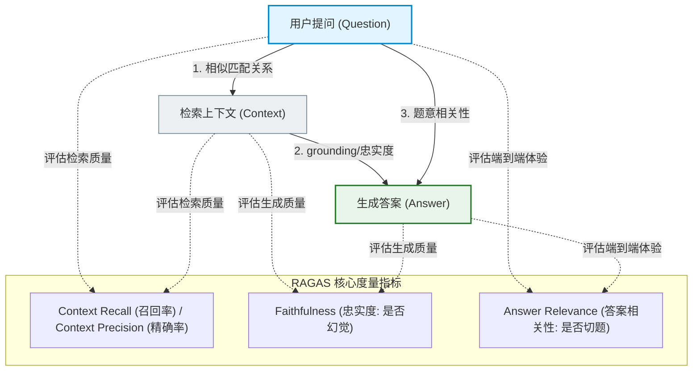
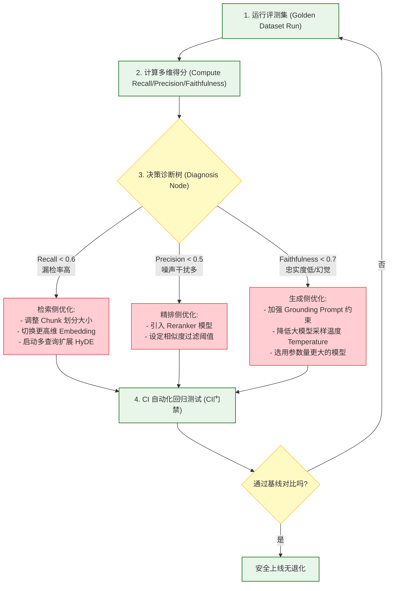
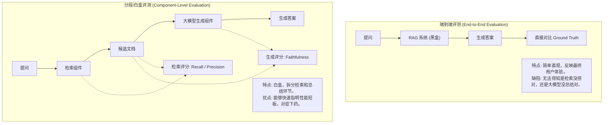

import GlossaryTerm from '@site/src/components/GlossaryTerm';
import GuidedExercise from '@site/src/components/GuidedExercise';
import ResearchNote from '@site/src/components/ResearchNote';
import ChapterMeta from '@site/src/components/ChapterMeta';
import PyRunner from '@site/src/components/PyRunner';
import TradeoffExplorer from '@site/src/components/TradeoffExplorer';
import StepFlow from '@site/src/components/StepFlow';
import QuizCard from '@site/src/components/QuizCard';

# M8L9 · RAG 评测

<ChapterMeta
  time="约 2.5 小时"
  prereqs={[{label: 'M7L10 LLM 评测', href: '../llm-systems/llm-evaluation'}, {label: 'M8L6 重排', href: './reranking'}, {label: 'M8L8 RAG 生成', href: './rag-generation'}]}
  outcome="能把 RAG 评测拆成检索质量（精确率/召回率）和生成质量（忠实度/答案相关性），据此定位错误出在哪一环、对症优化。"
  howToUse="先看“RAG 答错了不知道改哪”，再学分层评测指标，最后做 RAG 指标计算 lab。"
/>

:::tip RAG 答错时，先问一句：是没找到，还是找到了没用好？
[M7L10](../llm-systems/llm-evaluation) 你学了给 LLM 装评测。RAG 的评测有个**特有且关键**的维度：它是个两段管道（检索 + 生成），答错了可能是**检索失败**（没找到对的证据）或**生成失败**（找到了但模型没用好）——**两者的修法完全不同**。不分清就盲目调，往往白费力。RAG 评测的核心，就是把质量拆开、定位到具体环节。
:::

## 一、答错了，但不知道改哪

你的 RAG 答错了一个问题。该怎么办？换更强的 embedding？重新分块？加重排？改 prompt？换模型？——**如果不先搞清错在哪一环，这些都是瞎猜。** 同样是"答错"，根因可能完全不同：
- 相关文档**根本没被检索到**（检索失败）→ 改分块/embedding/混合/查询改写。
- 检索到了，但模型**没用好/无视它/编造**（生成失败）→ 改 prompt/grounding/换模型。

RAG 评测的第一要务：**把"对不对"拆成可定位的多个维度**，让你知道该动哪里。

## 二、三个核心概念（分层）

### 基础：检索质量指标

衡量“有没有找对证据”（[呼应 M8L3 召回率](./vector-search)）：
- <GlossaryTerm term="Context Recall" definition="上下文召回率：回答所需的相关证据，有多少被检索到了。低召回意味着“没找到”，要改分块/embedding/混合检索/查询改写。">上下文召回率（recall）</GlossaryTerm>：该找到的相关证据，找到了多少。低 = 漏检（[改检索侧 M8L4/L5/L7](./chunking)）。
- <GlossaryTerm term="Context Precision" definition="上下文精确率：检索回来的内容里，有多少是真正相关的。低精确率意味着噪声多，会干扰生成、浪费上下文，要改重排/过滤。">上下文精确率（precision）</GlossaryTerm>：检索回来的里，真正相关的占多少。低 = 噪声多（[改重排 M8L6](./reranking)）。

### 进阶：生成质量指标

衡量“有没有用好证据”：
- <GlossaryTerm term="Faithfulness" definition="忠实度：答案中的每个说法是否都能由检索到的证据支撑（没有编造、没有超出证据）。低忠实度 = 模型在幻觉或无视证据。">忠实度（faithfulness）</GlossaryTerm>：答案的每句话是否都有证据支撑、没编造。低 = 模型幻觉/无视证据（[改 grounding prompt/换模型 M8L8](./rag-generation)）。
- <GlossaryTerm term="Answer Relevance" definition="答案相关性：答案是否切题地回应了用户的问题（而非答非所问或答了无关的内容）。低 = 答非所问，可能是 prompt 或问题理解问题。">答案相关性（answer relevance）</GlossaryTerm>：答案是否切题地回答了问题。低 = 答非所问。
- 这套“检索 + 生成”分维度的框架，正是 <GlossaryTerm term="RAGAS" definition="RAGAS：一个 RAG 评测框架，把质量拆成忠实度、答案相关性、上下文精确率、上下文召回率等维度，让你定位问题出在检索还是生成。">RAGAS</GlossaryTerm> 等 RAG 评测框架的核心思路。

### 深入（选学）：用评测驱动 RAG 优化

- **定位 → 对症**：评测各维度的得分组合直接指向修法。召回低→检索侧；精确率低→重排/过滤；忠实度低→生成侧（grounding/模型）；答案相关性低→prompt/查询理解。**这是 RAG 工程最重要的方法论**——先量化定位，再针对性优化，而非盲目堆技术。
- **建评测集**：和 [M7L10](../llm-systems/llm-evaluation) 一样，要有代表性的（问题 + 期望证据 + 期望答案）评测集，覆盖典型/边界/线上 bad case。建评测集是 RAG 项目的早期投资，不是事后补。
- **自动评测**：检索指标可由“标注的相关文档”自动算；生成指标（忠实度/相关性）常用 <GlossaryTerm term="LLM-as-judge" definition="大模型裁判：使用大语言模型（如 GPT-4）代替人类评估者，对生成式任务的输出进行自动化打分或定性分析的技术，它能有效提高自动化评测的效率与覆盖率。">大模型裁判 (LLM-as-judge)</GlossaryTerm>（[M7L10](../llm-systems/llm-evaluation)）自动打分（注意其偏差）。
- **回归 + CI**：改任何一环（分块/embedding/重排/prompt/模型）都跑评测对比基线，接 CI 门禁（[M6L6](../cloud-enterprise-industrial/cicd-pipelines)），结合软件交付可靠性的 <GlossaryTerm term="DORA" definition="DORA 指标：用于衡量软件交付团队效率和可靠性的四项核心指标。在 RAG 开发中，它启发我们通过评测 and CI 自动化保证检索系统的交付可靠性。">DORA 指标</GlossaryTerm>，防止“改好一处、退化一片”。
- **端到端 + 分段都要测**：既测最终答案质量（用户感知），也测中间的检索质量（定位用）——两者缺一不可。

<ResearchNote
  title="RAG 评测：拆成检索与生成两类、定位到环节"
  source="Es et al. (2023), RAGAS；检索评测（recall/precision/MRR/nDCG）；M7L10 LLM 评测"
  href="https://arxiv.org/abs/2309.15217"
  insight="RAG 是检索+生成的管道，评测必须拆维度：上下文召回/精确率衡量检索，忠实度/答案相关性衡量生成。各维度得分组合能定位错误出在哪一环，从而对症优化。RAGAS 等框架用 LLM-as-judge 自动化这些维度的打分。"
  application="为 RAG 建评测集（问题+期望证据+期望答案）；分别算检索指标（召回/精确率）和生成指标（忠实度/相关性）；用得分组合定位问题环节再优化；改任一环跑回归对比、接 CI；端到端和分段评测并行。"
/>

## 三、RAGAS 评测三元组与错误定位图解 (Deep Dive Diagrams)

为了更深度地展现“分段评测”对于诊断和优化 RAG 系统的关键作用，我们在此剖析 RAGAS 的三元定位框架、决策诊断逻辑树以及端到端与分段白盒评测的边界特性。

### 1. 结构对比：RAGAS 评测维度三元图解与错误对齐

通过将数据拆解为用户提问、检索上下文和生成答案三者间的比对，我们可以独立判定检索器与生成器的局限性。



### 2. 决策树：评测驱动的“测量-定位-对症-验证”闭环管道

分维度得分不仅是客观描述，更是系统修复行动的诊断依据。



### 3. 特征对比：端到端评测 (End-to-End) 与分段白盒评测 (Component-Level)

选择端到端还是分段，是评测效率与根因分析精度的权衡。



## 四、落地实践：RAG 诊断决策与闭环优化

在真实的生产开发中，基于指标发现故障后执行针对性调优需要遵循如下四个阶段：

<StepFlow
  steps={[
    {
      title: '1. 建立黄金评测集 (Golden Dataset Selection)',
      desc: '挑选出 100-500 个具有代表性的真实用户提问，手动标注好每个提问期望检索到的“黄金证据片段（Ground Truth Docs）”与“参考标准答案”。',
      diagram: '构建测试包：{ Question, Gold_Context, Ground_Truth_Answer }'
    },
    {
      title: '2. 评测指标计算与数据分流 (Metrics Execution)',
      desc: '系统自动运行测试，将大模型实际生成的答案、实际捞出来的 Context 进行文本解析，分别计算上下文召回率、精确率以及忠实度得分。',
      diagram: '对比三元：[实际 Context vs 黄金 Context] ──> [实际 Answer vs 实际 Context]'
    },
    {
      title: '3. 诊断决策树分析与对症修复 (Diagnostic Repair)',
      desc: '结合三大核心维度的得分：召回低则修改分块与向量扩展，精确率低则追加 Cross-Encoder 重排，忠实度低则收紧 Grounding Prompt 防幻觉。',
      diagram: '定位故障节点 ──> 指向具体的 Month 8 优化处方'
    },
    {
      title: '4. CI 回归门禁验证与安全发布 (CI/CD Regression Check)',
      desc: '在发布前在流水线中跑一遍评测集回归。确保优化某一部分（如增加了改写）不会导致其他查询意图的检索或生成指标发生大范围退化。',
      diagram: '生成对比雷达图 ──> 确认无退化 ──> 自动合入 master 并上线'
    }
  ]}
/>

## 五、跟我做一遍：RAG 分维度评测

<PyRunner
  rows={36}
  expect="定位是检索还是生成问题"
  code={`def context_recall(retrieved, relevant):
    # 该找到的相关证据，找到了多少
    if not relevant: return 1.0
    return len(set(retrieved) & set(relevant)) / len(set(relevant))

def context_precision(retrieved, relevant):
    # 检索回来的里，真正相关的占多少
    if not retrieved: return 0.0
    return len(set(retrieved) & set(relevant)) / len(set(retrieved))

def faithfulness(answer_claims, evidence_facts):
    # 答案的说法里，有多少能被证据支撑
    if not answer_claims: return 1.0
    return sum(1 for c in answer_claims if c in evidence_facts) / len(answer_claims)

def diagnose(recall, precision, faith):
    if recall < 0.6: return "检索失败：相关证据没找到 -> 改分块/embedding/混合/查询改写"
    if precision < 0.5: return "检索噪声多 -> 加重排/过滤"
    if faith < 0.7: return "生成失败：模型没忠于证据 -> 改 grounding/换模型"
    return "质量良好"

# 案例 A：检索到了相关证据，但模型编造（忠实度低）
relevant = {"c1", "c3"}; retrieved = {"c1", "c3"}
recall = context_recall(retrieved, relevant); prec = context_precision(retrieved, relevant)
faith = faithfulness({"编造的说法"}, {"c1事实", "c3事实"})
print("案例A 召回:%.2f 精确:%.2f 忠实:%.2f" % (recall, prec, faith))
print("  诊断:", diagnose(recall, prec, faith))

# 案例 B：相关证据根本没检索到（召回低）
retrieved2 = {"c9", "c8"}
print("案例B 召回:%.2f -> %s" % (context_recall(retrieved2, relevant), diagnose(context_recall(retrieved2, relevant), 0, 1)))
print("定位是检索还是生成问题")`}
/>

案例 A 检索对了但忠实度低 → 生成问题（改 prompt/模型）；案例 B 召回低 → 检索问题（改检索侧）。同样是"答错"，分维度评测立刻指出该动哪里。**试试**：构造一个精确率低（检索回一堆噪声）的案例，看诊断指向"加重排"。

## 六、动手 Lab（必做）

打开 `labs/month08/m8l9_rag_eval/`：

```bash
python labs/month08/m8l9_rag_eval/test_eval.py
```

实现 RAG 分维度评测：上下文召回/精确率、忠实度，并根据指标组合诊断问题环节。

<GuidedExercise
  title="练习指引：实现 RAG 分维度评测"
  goal="把“检索指标 + 生成指标 + 诊断”做成代码——RAG 优化最重要的方法论工具。"
  hints={[
    'context_recall = |检索∩相关| / |相关|（相关为空返回 1）。',
    'context_precision = |检索∩相关| / |检索|（检索为空返回 0）。',
    'faithfulness = 有证据支撑的说法数 / 总说法数。',
    'diagnose：按召回<阈值→检索失败、精确率低→噪声、忠实度低→生成失败 的顺序判断。'
  ]}
  steps={[
    '实现 context_recall / context_precision / faithfulness。',
    '实现 diagnose(recall, precision, faith) 返回问题定位。',
    '处理空集合等边界。',
    '写测试：召回/精确率/忠实度计算正确、诊断分别指向检索/噪声/生成问题。'
  ]}
  checks={[
    '你能把 RAG 质量拆成检索和生成两类指标。',
    '你的 lab 能算各维度指标并诊断问题环节。',
    '你能根据诊断说出对症的优化手段。',
    '你理解评测要建评测集、跑回归、接 CI。'
  ]}
/>

## 七、架构师深潜（Staff+ 视角）

### 1. RAG 评测维度与对应修法

<TradeoffExplorer
  title="RAG 指标 → 问题环节 → 修法"
  dimensions={['衡量检索', '衡量生成', '可自动算', '定位精度', '建集成本']}
  options={[
    {
      name: '上下文召回/精确率',
      scores: [5, 1, 5, 5, 3],
      note: '衡量检索。召回低→漏检(改检索侧)、精确率低→噪声(加重排)。可由标注自动算。',
      whenToUse: '定位“是不是检索的锅”——必备。'
    },
    {
      name: '忠实度/答案相关性',
      scores: [1, 5, 4, 4, 3],
      note: '衡量生成。忠实度低→幻觉/无视证据、相关性低→答非所问。常用 LLM-judge。',
      whenToUse: '定位“是不是生成的锅”——必备。'
    },
    {
      name: '端到端答案正确性',
      scores: [3, 3, 4, 2, 4],
      note: '用户最终感知。直观但不定位环节，要配分段指标才知道改哪。',
      whenToUse: '衡量整体效果 + 回归门禁。'
    }
  ]}
/>

### 2. "先诊断、再下药"是 RAG 工程的核心方法论

这一课其实给了你整个 Month 8 的"使用说明书"：前面学的所有技术（[分块 M8L4](./chunking)、[混合 M8L5](./hybrid-search)、[重排 M8L6](./reranking)、[查询改写 M8L7](./query-transformation)、[生成 M8L8](./rag-generation)）都是"药"，而评测是"诊断"。**没有诊断就下药，是 RAG 工程最常见的低效**——盲目换 embedding、堆重排、调 prompt，可能根本没对准病灶。正确流程：建评测集 → 跑分维度评测 → 定位是检索还是生成、是召回还是精确、是忠实还是相关 → 针对性地用对应的"药" → 再评测验证。这套"测量-定位-优化-验证"的闭环，和 [系统性能优化](../foundations/performance-and-latency)、[M6 DORA 改进](../cloud-enterprise-industrial/cicd-pipelines) 是同一种工程素养：**先测量、再优化，别凭感觉。**

### 3. 真实案例：评测让 RAG 优化从"玄学"变"工程"

很多团队的 RAG 优化是"玄学"：听说某个 embedding 好就换、看到重排能提升就加，但说不清到底解决了什么、有没有引入新问题。建立分维度评测后，优化变成工程：发现"召回 0.9 但精确率 0.4"→ 明确是噪声问题 → 加重排 → 精确率升到 0.7、答案质量随之改善，数字说话。更重要的是有了**回归保护**——换 embedding 前先在评测集上比，避免"提升了 A 类问题、退化了 B 类"还不自知。能不能把 RAG 优化做成"可测量、可回归、可定位"的工程，是区分专业团队和碰运气团队的关键，也是 [Month 11 AI 平台](../production-ai-platform/overview) 要平台化的能力。

### 4. 架构师深问（给自己 30 分钟）

- 你的 RAG 有评测集吗？答错时你能分清是检索没找到、还是找到了没用好吗？
- 你最近一次 RAG 优化（换 embedding/加重排/改 prompt），有没有用评测验证它真的提升了、且没退化别的？
- 检索指标（召回/精确）和生成指标（忠实/相关）你都在测吗？还是只看最终答案、无法定位环节？

## 知识自测

<QuizCard
  questions={[
    {
      q: '在 RAGAS 评测指标中，上下文精确率（Context Precision）和上下文召回率（Context Recall）分别针对什么故障表现进行诊断？',
      options: [
        'A. Context Recall 针对的是答案所需的关键证据漏检；Context Precision 针对的是检索出太多无关的杂乱噪音干扰生成',
        'B. Context Recall 针对的是模型回答答非所问；Context Precision 针对的是模型回答发生了编造',
        'C. Context Recall 针对的是数据库硬件延迟；Context Precision 针对的是内存锁死',
        'D. 它们都用来衡量大模型的逻辑推理深度，不针对检索'
      ],
      answer: 0,
      explain: 'Context Recall（召回率）衡量的是有多少期望文档被找回了（越接近 100% 漏检越少）；Context Precision（精确率）衡量的是召回结果中真正相关的比重（分值越低说明混入的无关噪声垃圾越多，需要重排过滤）。'
    },
    {
      q: 'RAG 系统运行中发现“最终答案的忠实度（Faithfulness）分值很低”，架构师应该优先从哪里开始排查？',
      options: [
        'A. 排查向量库，检查分块的 overlap 重叠范围是否足够大',
        'B. 排查生成端，分析 Grounding Prompt 是否约束不够强、大模型是否发生幻觉，或者应当更换更强、采样温度调至最低的模型',
        'C. 优先修改最前端的查询改写模板',
        'D. 更换 Embedding 模型以提高其相似度几何投影精度'
      ],
      answer: 1,
      explain: 'Faithfulness（忠实度）度量的是生成答案是否完全源自于给定背景上下文证据（不编造不添油加醋）。忠实度低下说明生成器 LLM “出轨”了，跑出了限定范围，应当首先在生成端收紧 Prompt Grounding 约束。'
    },
    {
      q: '为什么在严肃生产级 RAG 项目中，不能仅靠“端到端答案正确性（Answer Correctness）”这一个指标来指导整个系统的架构迭代？',
      options: [
        'A. 端到端指标会强行阻塞 CI 流水线',
        'B. 因为端到端指标属于黑盒评测，即使发现答案错了，也无法得知究竟是检索器没有找到正确文档，还是生成器在拥有证据的前提下做出了错误推理',
        'C. 端到端评测的 API 费用必定比白盒分段评测贵出百倍',
        'D. 因为 Docusaurus v4 已经废除了端到端自动化测试标准'
      ],
      answer: 1,
      explain: '只测端到端正确性无法提供瓶颈定位。通过将 RAG 拆为“检索侧（Recall / Precision）”与“生成侧（Faithfulness / Relevance）”的分段白盒指标，才能精确定位错误到底出在管道的哪一截，从而对症下药修复。'
    }
  ]}
/>

## 自检清单

- [ ] 我能把 RAG 质量拆成检索和生成两类指标。
- [ ] 我的 lab 能算召回/精确率/忠实度并诊断环节。
- [ ] 我能根据诊断对症选优化手段。
- [ ] 我理解 RAG 优化要"先诊断、再下药"、配回归。

## 常见误解

- **"RAG 答错就换更强的模型/embedding"**：先诊断是检索还是生成问题，对症才有效。
- **"只看最终答案对不对"**：那定位不了环节，要分段测检索和生成指标。
- **"评测是事后的事"**：评测集是早期投资，是优化的前提和回归的保护。

## 延伸阅读

- [RAGAS (Es et al., 2023)](https://arxiv.org/abs/2309.15217)
- [M7L10 LLM 评测](../llm-systems/llm-evaluation)
- [下一课：高级 RAG 架构](./advanced-rag)
