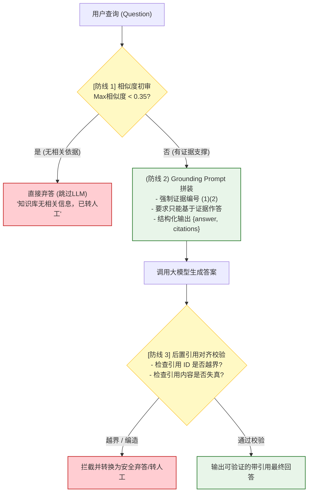
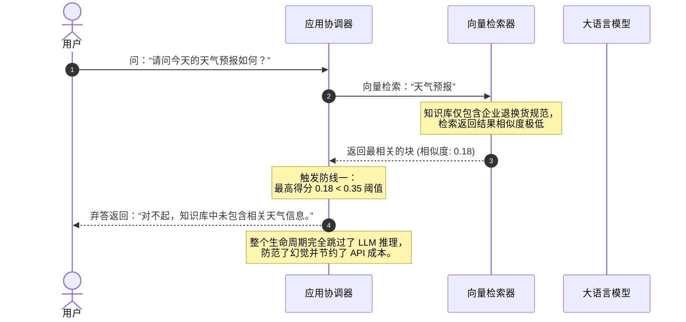
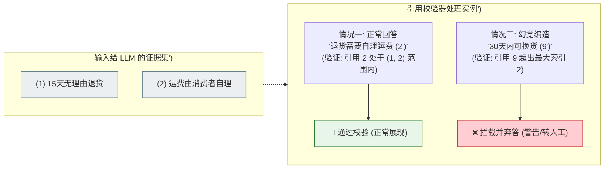

import GlossaryTerm from '@site/src/components/GlossaryTerm';
import GuidedExercise from '@site/src/components/GuidedExercise';
import ResearchNote from '@site/src/components/ResearchNote';
import ChapterMeta from '@site/src/components/ChapterMeta';
import PyRunner from '@site/src/components/PyRunner';
import TradeoffExplorer from '@site/src/components/TradeoffExplorer';
import StepFlow from '@site/src/components/StepFlow';
import QuizCard from '@site/src/components/QuizCard';

# M8L8 · RAG 生成与引用

<ChapterMeta
  time="约 2.5 小时"
  prereqs={[{label: 'M8L6 重排', href: './reranking'}, {label: 'M7L9 grounding/幻觉', href: '../llm-systems/hallucination-guardrails'}, {label: 'M7L4 提示', href: '../llm-systems/prompting-basics'}]}
  outcome="能把检索到的证据组织进上下文、用 prompt 约束模型只据证据回答、产出带引用的答案，并在证据不足时正确弃答。"
  howToUse="先看“检索对了但答得不对”，再学生成端的拼装/引用/弃答，最后做带引用的 grounding 生成 lab。"
/>

:::tip 检索是“找对证据”，生成是“用好证据”——两件事都做对，RAG 才成立
前面几课把"找对证据"做到了极致（[分块/混合/重排/查询变换](./reranking)）。但 RAG 还有最后一环：**把证据交给模型、让它只基于证据回答、给出引用、找不到就说不知道。** 这一环没做好，前面找得再准也白搭——模型可能无视证据胡说、或编造引用、或在没证据时硬答。这就是 [M7L9 grounding](../llm-systems/hallucination-guardrails) 在 RAG 里的落地。
:::

## 一、检索对了，不等于答对了

RAG 的失败分两类（[M8L9 会系统化](./rag-evaluation)）：**检索失败**（没找到对的证据）和**生成失败**（找到了但没用好）。这一课管后者。即使检索完美，生成端仍可能出错：
- 模型**无视证据**，凭自己的记忆答（可能是过时/错误的）。
- 模型**编造引用**，说"根据文档X"但文档X根本没这内容。
- 证据里**没有答案**时，模型不肯说"不知道"，硬编一个（[幻觉 M7L9](../llm-systems/hallucination-guardrails)）。
- 多段证据**冲突**时，模型乱选或拼凑。

所以生成端要专门设计：怎么拼装证据、怎么约束模型、怎么产出可验证的引用、怎么弃答。

## 二、三个核心概念（分层）

### 基础：上下文拼装与 grounding prompt

把检索到的 top-k 证据组织进 prompt（[拼装 M7L8](../llm-systems/context-memory)）：给每段证据**编号**、附**来源**，然后用 [system prompt（M7L4）](../llm-systems/prompting-basics) 明确约束：**"只根据下面的资料回答；资料里没有就说不知道；答案要标注引用了哪几段。"** 这就是 <GlossaryTerm term="Grounding" definition="Grounding：将大模型的文本生成过程，严格锚定在给定的、可信赖的外部事实证据上，从而限制模型仅根据提供的内容作答，能最大程度消除幻觉。">grounding（锚定）</GlossaryTerm> 的具体实现——把模型的回答“锚定”在给定证据上，而非它的参数记忆。这也直接影响到 RAG 的首字生成延迟 <GlossaryTerm term="TTFT" definition="TTFT：大模型从接收到 prompt 输入，到输出第一个 token 字符所耗费的延迟时间。在 RAG 生成端，越复杂的 prompt 约束和越长的上下文，都会导致 TTFT 增加。">TTFT</GlossaryTerm>。

### 进阶：引用与可验证性

<GlossaryTerm term="Citation / Attribution" definition="引用/溯源：让 RAG 答案标注它用了哪些检索到的证据片段（如 [1][3]），使答案可被追溯和验证。是 RAG 相比纯生成的关键优势，也是降幻觉的手段。">引用（citation）</GlossaryTerm>：让答案标注“这句话来自第 [1] 段、那句来自第 [3] 段”。好处：(1) 用户/系统可**验证**答案是否真有据；(2) 倒逼模型基于证据答（要标引用就不能凭空说）；(3) 出错时能定位是哪段证据的问题。关键工程动作：**校验引用真实存在**——模型说引用了 [3]，就检查 [3] 真实在检索结果里、且内容支撑该说法（[呼应 M7L9 grounding 校验](../llm-systems/hallucination-guardrails)）。编造的引用要拦下。

### 深入（选学）：弃答、冲突与生成端工程

- **证据不足要弃答**：检索回来的证据若不足以回答（相似度都很低、或都不相关），应让模型/系统说“知识库里没有相关信息”并转人工，实行主动的 <GlossaryTerm term="Abstained" definition="弃答：当系统评估所检索到的外部证据不足以支持生成可信答案时，主动放弃调用大模型或者调用大模型直接返回“无法回答”的防御策略。">弃答（Abstained）</GlossaryTerm>（[M7L9 弃答](../llm-systems/hallucination-guardrails)），**绝不硬编**。可以用“最高相似度低于阈值就直接弃答、不调生成”来兜底。
- **证据冲突**：多段证据矛盾时（如新旧政策），靠元数据（时间、版本、权威性）排序或提示模型说明冲突——别让它随便选一个。
- **答案 vs 证据的忠实度**：即使有引用，也要校验答案是否**忠于**证据（没有添油加醋）——这是 [M8L9 评测](./rag-evaluation) 指导下的 <GlossaryTerm term="Faithfulness" definition="忠实度：评估生成的答案在多大程度上忠实于给定的参考上下文证据，即没有包含证据之外的额外虚假陈述或推理跳跃。是评测生成质量的核心指标。">忠实度 (Faithfulness)</GlossaryTerm> 指标。
- **生成端也是可靠管道的一环**：它要接 [M7 的结构化输出（M7L6）](../llm-systems/structured-output-tools)（输出 `{answer, citations}`）、[校验/护栏（M7L9）](../llm-systems/hallucination-guardrails)、[低温（M7L3）](../llm-systems/sampling-decoding)（事实任务）——RAG 的生成端就是 [M7L12 可靠 LLM 管道](../llm-systems/capstone-llm-app) 接上检索证据。
- **别让证据"迷失在中间"**：[M7L2](../llm-systems/tokenization-context) 提过，重要证据放上下文开头/结尾，别埋在中间一大堆里。

<ResearchNote
  title="RAG 生成：grounding + 引用 + 弃答"
  source="Lewis et al. (2020), RAG；归因/引用生成研究；M7L9 grounding 实践"
  href="https://arxiv.org/abs/2005.11401"
  insight="RAG 的生成端要把检索证据编号入上下文，用 prompt 约束模型只据证据回答、产出可验证引用、证据不足时弃答。引用既提升可验证性又抑制幻觉。关键是把模型输出当不可信、校验引用真实存在与答案忠实于证据，而非盲信。"
  application="生成端：证据编号+来源入上下文；system prompt 约束“只据资料答、标引用、无据说不知道”；结构化输出 {answer, citations}；校验引用存在且答案忠实；相似度过低直接弃答；低温；重要证据放首尾。这就是把 M7 可靠管道接上检索。"
/>

## 三、生成端防护与校验技术图解 (Deep Dive Diagrams)

为了更清晰地表达生成端如何忠实地利用检索证据、给出真实引用并执行安全防御，我们在此展示“三道防线”防御纵深架构、首道防线（证据不足直接弃答）的控制流以及后置引用校验器的纠错拦截逻辑。

### 1. 防御纵深：RAG 生成端“三道防线”安全架构

为了将幻觉降到最低，生成端不能仅依赖单一的 Prompt 约束，而需要建立起从相似度过滤、大模型限制到后置合规门禁的纵深防御体系。



### 2. 首道防线：证据不足直接弃答的控制流

当检索结果的最大相似度极低时，说明数据库完全不包含相关背景。系统在此层直接短路拦截，不再调用昂贵且易幻觉的 LLM 生成端。



### 3. 终道防线：引用校验器 (Citation Validator) 的越界拦截机制

即使在 Prompt 中做出了限制，模型在生成时仍可能为了应付输出格式而强行编造越界的引用 ID。后置校验器核对所有 ID 的合法性以做最后合规把关。



## 四、落地实践：带引用的 RAG 安全生成四阶段

在真实的生产级 RAG 问答中，从检索获取证据到交付给用户一个安全的、带引用的答案，要经历以下四步处理流程：

<StepFlow
  steps={[
    {
      title: '1. 检索相似度初审与弃答判定 (Abstain Assessment)',
      desc: '获取检索召回的段落块后，系统首先扫描其最高相关性评分（相似度）。若评分低于安全阈值（如 0.35），则立刻启动首层弃答，阻止模型硬答。',
      diagram: '最高相似度 0.22 ──> 触发防线一 ──> 直接拦截并友好弃答'
    },
    {
      title: '2. 证据编号拼装与上下文注入 (Context Annotation)',
      desc: '若相似度达标，则对召回的 Top-N 证据进行降序排位、标明编号（如 [1] [2]），附带来源路径元数据，全部拼接组装入 Prompt 模板中。',
      diagram: '将块文本分别包裹为 "[1] ..." "[2] ..." 并传入 System Prompt'
    },
    {
      title: '3. 大模型结构化推理输出 (Structured Generation)',
      desc: '在低温（如 temperature=0.0）与强限制提示词下调用 LLM。要求模型仅以给定的编号段落为基准生成回复，并输出带引用的结构化 JSON 对象。',
      diagram: 'LLM 执行推理 ──> 结构化输出 { "answer": "...", "citations": [1] }'
    },
    {
      title: '4. 后置引用对齐校验与防护栏 (Attribution Validation)',
      desc: '校验器接收到 JSON，逐一审核 citations 数组中的编号。若发现模型编造了不存在的编号（如召回 2 段却引用了 9），立即予以拦截并转人工。',
      diagram: '校验引用合法性 ──> 若合法则渲染引用跳转 ──> 交付给用户'
    }
  ]}
/>

## 五、跟我做一遍：带引用的 grounding 生成

<PyRunner
  rows={38}
  expect="有据答+引用，无据弃答"
  code={`def assemble(evidence):                          # 证据编号 + 入上下文
    return "\\n".join("[%d] %s" % (i+1, e["text"]) for i, e in enumerate(evidence))

def generate(question, evidence, model, min_score=0.3):
    # 证据不足（最高相似度过低）-> 直接弃答，不调模型
    if not evidence or max(e["score"] for e in evidence) < min_score:
        return {"answer": "知识库无相关信息,请转人工", "citations": [], "grounded": False}
    ctx = assemble(evidence)
    resp = model(question, ctx)                  # 模型基于证据生成 {answer, citations}
    # 校验：引用必须真实存在于证据编号范围
    valid_ids = set(range(1, len(evidence)+1))
    if any(c not in valid_ids for c in resp["citations"]):
        return {"answer": "答案引用无据,已拦截转人工", "citations": [], "grounded": False}
    return {"answer": resp["answer"], "citations": resp["citations"], "grounded": True}

# 模拟模型：基于证据答并给引用
def good_model(q, ctx): return {"answer": "退货需 7 天内申请", "citations": [1]}
def hallucinating_model(q, ctx): return {"answer": "退货 30 天内", "citations": [9]}  # 编造引用[9]

ev = [{"text": "退货需在签收后 7 天内申请", "score": 0.9}]
print("正常:", generate("退货期限", ev, good_model))            # 有据 + 引用[1]
print("编造引用:", generate("退货期限", ev, hallucinating_model)) # 引用[9]不存在 -> 拦下
print("无证据:", generate("天气", [{"text": "x", "score": 0.1}], good_model))  # 相似度低 -> 弃答
print("有据答+引用，无据弃答")`}
/>

正常时基于证据答并给真实引用；模型编造引用 [9]（不存在）被校验拦下；证据相似度过低直接弃答不调模型——三种情况都安全。**试试**：让 good_model 引用 [1] 和 [2]（但只有 1 段证据），看校验拦下越界引用；调 min_score 看弃答阈值的影响。

## 六、动手 Lab（必做）

打开 `labs/month08/m8l8_generation/`：

```bash
python labs/month08/m8l8_generation/test_generation.py
```

实现 RAG 生成端：证据编号拼装、引用校验（必须真实存在）、证据不足弃答、返回 grounded 标志。

<GuidedExercise
  title="练习指引：实现带引用的 grounding 生成"
  goal="把“证据拼装 + 引用校验 + 弃答”做成代码——把检索和生成接好的最后一环。"
  hints={[
    'assemble：给证据编号（[1][2]...）入上下文。',
    'generate：最高相似度 < 阈值或无证据 -> 弃答（不调模型）。',
    '校验：模型给的 citations 必须都在 1..len(evidence) 范围内，否则拦截。',
    '返回 grounded 标志，便于上层判断是否可信。'
  ]}
  steps={[
    '实现 assemble(evidence)。',
    '实现 generate(question, evidence, model, min_score)：弃答 + 调用 + 引用校验。',
    '处理无证据、低相似度、越界引用三种情况。',
    '写测试：正常带引用、编造引用被拦、证据不足弃答、grounded 标志正确。'
  ]}
  checks={[
    '你能把检索证据编号拼装进上下文并约束模型据此回答。',
    '你的 lab 校验引用真实存在、证据不足弃答。',
    '你能区分检索失败和生成失败。',
    '你理解 RAG 生成端就是 M7 可靠管道接上检索证据。'
  ]}
/>

## 七、架构师深潜（Staff+ 视角）

### 1. 生成端的可靠性手段

<TradeoffExplorer
  title="RAG 生成端策略"
  dimensions={['降幻觉', '可验证', '召回不足时安全', '实现复杂度', '用户体验']}
  options={[
    {
      name: '直接把证据塞进去生成',
      scores: [2, 1, 1, 5, 3],
      note: '给证据但不约束、不校验、不弃答。比裸生成好，但仍会无视证据/编造/硬答。',
      whenToUse: '原型；生产不够。'
    },
    {
      name: 'grounding prompt + 引用',
      scores: [4, 5, 3, 3, 4],
      note: '约束只据证据答 + 标引用 + 校验引用存在。可验证、降幻觉。',
      whenToUse: '生产 RAG 的基线。'
    },
    {
      name: '+ 弃答 + 忠实度校验',
      scores: [5, 5, 5, 2, 3],
      note: '再加证据不足弃答、答案忠实度校验。最可靠，但更复杂、可能更多“不知道”。',
      whenToUse: '高风险/低容错（医疗/法律/金融）。'
    }
  ]}
/>

### 2. RAG = 检索 + 生成，两端都要对

很多人以为 RAG 难在检索，其实**生成端同样关键且容易被忽略**。检索负责"把对的证据找来"，生成负责"忠实地用好证据、可验证、不硬答"——两端任一出问题，RAG 都不可靠。这也是为什么 [M8L9 评测](./rag-evaluation) 要把指标拆成"检索质量"和"生成质量"两类、出错时先分清是哪端的问题。架构师要把 RAG 看成一个**两端协同的管道**，而不是只盯检索。生成端的 grounding/引用/弃答，直接复用了 [Month 7 的全部可靠性工程](../llm-systems/capstone-llm-app)——RAG 不过是给那条可靠管道接上了一个高质量的"检索证据"来源。

### 3. 真实案例：引用让 RAG 可信、可用

为什么企业级 RAG（法规问答、医疗助手、客服）几乎都要求"答案带出处"？因为**没有引用的 AI 答案，在严肃场景里不可用**——用户/合规无法验证它是不是编的。带引用后：用户能点开看原文核实、出错能追溯到具体证据、模型也被"要标引用"逼着基于证据答。这是 RAG 相比纯 LLM 生成的核心价值之一（[M8L1](./why-rag) 提过）。能不能产出"忠实、可验证的带引用答案"，往往是一个 RAG 产品能不能进入严肃业务的分水岭——这也呼应 [M6L10 企业 AI 要可审计](../cloud-enterprise-industrial/enterprise-erp-integration)。

### 4. 架构师深问（给自己 30 分钟）

- 你的 RAG 答案有引用吗？引用是否被校验"真实存在且支撑该说法"，还是模型说啥就信啥？
- 检索回来的证据不足以回答时，你的系统会弃答还是硬编？弃答阈值怎么定？
- 一个错误答案出现时，你能快速判断是"检索没找到证据"还是"找到了但生成没用好"吗？

## 知识自测

<QuizCard
  questions={[
    {
      q: '在 RAG 生成端工程中，为什么说“相似度过低时在系统层直接弃答，不调用 LLM”是一个极具性价比的防幻觉工程手段？',
      options: [
        'A. 它能自动清理向量数据库中的无关文件',
        'B. 它可以直接阻断大模型在零事实证据背景下的“无中生有”强答胡编，同时免去了一次昂贵且缓慢的大模型 API 推理，节约算力成本',
        'C. 它能强行提高大模型的首字生成延迟（TTFT）',
        'D. 它可以直接修改大模型的底座权重参数'
      ],
      answer: 1,
      explain: '如果召回的最高相似度很低（如 0.22），说明知识库中根本没有支撑用户问题的事实依据。在此情况下，调用 LLM 极易导致模型编造胡说。直接在最前端系统拦截弃答，不仅最安全防幻觉，更免去了不必要的模型调用成本。'
    },
    {
      q: 'RAG 输出校验器在拦截“编造的引用（Hallucinated Citation）”时，最核心的校验动作是什么？',
      options: [
        'A. 检查返回的答案字符长度是否刚好为 100 字',
        'B. 核实模型返回的引用 ID 必须在输入给它的证据编号范围 [1, N] 内，且对应段落文本在语义上确实支撑该表述',
        'C. 强制对模型生成的语句进行重新翻译',
        'D. 直接将用户的 IP 地址拉入黑名单'
      ],
      answer: 1,
      explain: '大语言模型在输出带引用的内容时，极易编造越界的引用编号（如只提供了 2 个证据却标出引用 [9]）。后置校验器通过核验 citations 列表的每一个编号是否在 1..N 范围内，可以轻量级拦截掉明显的幻觉编造。'
    },
    {
      q: '如果大语言模型在回答时直接忽略了给定的背景文档，而继续使用它在训练阶段的浮点数参数记忆来回答问题，以下哪项不是合理的约束优化方向？',
      options: [
        'A. 在 System Prompt 中写入强约束，要求其必须“仅且只能”基于给定证据作答',
        'B. 调高模型的 Temperature（采样温度，例如设为 1.5）以提高其创造力',
        'C. 设定更清晰的 XML 标签或 JSON Schema 将问题与背景段落进行物理区隔',
        'D. 引入后置忠实度（Faithfulness）大模型二次检验门禁'
      ],
      answer: 1,
      explain: '调高 Temperature 会增加生成的随机性和创造力，这在事实性问答（Fact-based Q&A）场景中会极大地放大幻觉和泛化偏离，完全反方向操作。事实任务必须把 Temperature 调为 0.0。'
    }
  ]}
/>

## 自检清单

- [ ] 我能把检索证据编号拼装进上下文、约束模型据此回答。
- [ ] 我的 lab 校验引用真实存在、证据不足时弃答。
- [ ] 我能区分检索失败和生成失败。
- [ ] 我理解 RAG 生成端 = M7 可靠管道 + 检索证据。

## 常见误解

- **"检索对了答案就对了"**：生成端可能无视证据/编造引用/硬答，要专门约束和校验。
- **"给了证据模型就会用"**：要 prompt 强约束 + 校验引用 + 弃答，不能盲信。
- **"引用是可选的装饰"**：在严肃场景，可验证的引用是 RAG 能否被采用的关键。

## 延伸阅读

- [RAG (Lewis et al., 2020)](https://arxiv.org/abs/2005.11401)
- [M7L9 幻觉与 grounding](../llm-systems/hallucination-guardrails)
- [下一课：RAG 评测](./rag-evaluation)