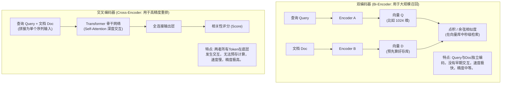
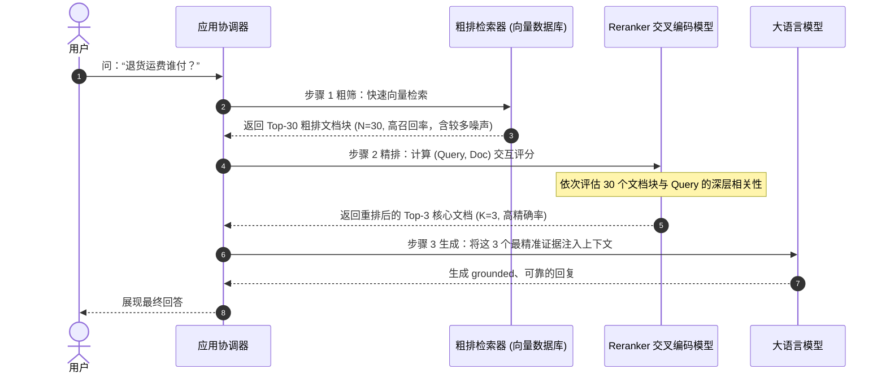

import GlossaryTerm from '@site/src/components/GlossaryTerm';
import GuidedExercise from '@site/src/components/GuidedExercise';
import ResearchNote from '@site/src/components/ResearchNote';
import ChapterMeta from '@site/src/components/ChapterMeta';
import PyRunner from '@site/src/components/PyRunner';
import TradeoffExplorer from '@site/src/components/TradeoffExplorer';
import StepFlow from '@site/src/components/StepFlow';
import QuizCard from '@site/src/components/QuizCard';

# M8L6 · 重排序

<ChapterMeta
  time="约 2.5 小时"
  prereqs={[{label: 'M8L2 embedding', href: './embeddings'}, {label: 'M8L5 混合检索', href: './hybrid-search'}, {label: 'M7L2 上下文预算', href: '../llm-systems/tokenization-context'}]}
  outcome="能解释两阶段检索（召回 + 重排）、cross-encoder 重排为什么更准但更慢，并实现一个重排把最相关的结果排到前面。"
  howToUse="先看“召回 top-20 但只能放 top-3”的取舍，再理解重排，最后做两阶段检索 lab。"
/>

:::tip 召回要“广”，进上下文要“精”——中间这一步精排，就是重排
检索（[向量 M8L3](./vector-search) / [混合 M8L5](./hybrid-search)）为了不漏，往往召回 top-20、top-50 个"大致相关"的。但[上下文预算有限（M7L2）](../llm-systems/tokenization-context)，只能放 top-3、top-5 进去喂给模型。怎么从召回的一堆里挑出**真正最相关**的几个？用一个**更准但更慢**的重排模型，对召回结果重新打分排序。这就是两阶段检索的精度关键。
:::

## 一、召回得多，但能用的少

检索的两难：
- **召回要广**：第一阶段检索为了"别漏掉答案所在的块"，会放宽召回 top-20 甚至更多。但召回是用**快速但较粗**的方法（向量相似度/BM25），里面混着不少"看着相关其实没用"的。
- **进上下文要精**：[上下文窗口和成本有限（M7L2/M7L5）](../llm-systems/tokenization-context)，[塞太多还会"迷失在中间"](../llm-systems/tokenization-context)。只能放最相关的 3~5 个。

矛盾在于：召回阶段的排序不够准（[向量相似≠含答案，M8L2](./embeddings)），直接取它的 top-3 可能漏掉真正最相关的。需要一个更准的"二次排序"——重排。

## 二、三个核心概念（分层）

### 基础：两阶段检索

<GlossaryTerm term="Two-stage Retrieval" definition="两阶段检索：第一阶段用快速方法（向量/BM25）召回较多候选（高召回），第二阶段用更准但更慢的重排模型对候选精排，取 top-k 进上下文（高精度）。兼顾速度和质量。">两阶段检索</GlossaryTerm>：
1. **召回（retrieve）**：用快的方法从海量文档里捞出 top-N 候选（N=20~100），重点是**高召回**（别漏）。
2. **重排（rerank）**：用更准的方法给这 N 个候选重新打分，取 top-k（k=3~5）进上下文，重点是**高精度**（挑对）。
"快方法广撒网 + 慢方法精挑选"——既不让慢方法跑遍全库（太贵），又用它的精度修正召回的粗排。

### 进阶：bi-encoder vs cross-encoder

为什么重排更准？关键在打分方式：
- <GlossaryTerm term="Bi-encoder" definition="双编码器：把查询和文档分别独立编码成向量，再算相似度。文档向量可预先算好、检索快，适合召回阶段。但 query 和 doc 没有交互，精度有限。">bi-encoder（双编码器）</GlossaryTerm>：[召回用的向量检索](./embeddings)就是这种——query 和 doc **各自独立**编码成向量再比相似度。文档向量可预先算好存库，**检索快**，但 query 和 doc 之间没有"交互"，精度有上限。
- <GlossaryTerm term="Cross-encoder" definition="交叉编码器：把查询和文档拼在一起送入模型，让两者充分交互后直接输出相关性分数。精度高得多，但每个候选都要现算、无法预存，慢，只适合对少量候选重排。">cross-encoder（交叉编码器）</GlossaryTerm>：把 query 和 doc **拼在一起**送进模型，让两者充分交互后直接输出相关性分数。**精度高得多**，但每个候选都要现场算（无法预存）、**慢**——所以只能用来重排少量候选，不能跑遍全库。两阶段正是为了让 cross-encoder 只在 top-N 上跑。

### 深入（选学）：重排的工程要点

- **重排是性价比很高的质量提升**：在向量检索基础上加一层重排，常能明显提升"喂给模型的内容质量"，进而提升答案质量——而只对 top-N 重排，延迟和成本可控。
- **也可以用 LLM 重排**：让 LLM 给候选打相关性分（[LLM-as-judge 的变体，M7L10](../llm-systems/llm-evaluation)）——更灵活、能理解复杂相关性，但更贵更慢。专用 reranker 模型通常是性价比之选。
- **召回 N 和重排 k 是要调的参数**：N 太小召回不够（重排也救不回漏掉的）、太大重排变慢变贵；用 [M8L9 评测](./rag-evaluation) 调。
- **三阶段也常见**：[混合召回（M8L5）](./hybrid-search) → 重排 → 取 top-k。混合负责高召回、重排负责高精度，配合最佳。
- **重排只能优化召回里有的**：如果答案所在的块根本没被第一阶段召回，重排无能为力——所以召回的高召回率是前提，[诊断时先看召回再看重排（M8L9）](./rag-evaluation)。

<ResearchNote
  title="两阶段检索：快召回 + 精重排"
  source="Nogueira & Cho (2019), Passage Re-ranking with BERT；Sentence-Transformers Cross-Encoders；现代 reranker 实践"
  href="https://arxiv.org/abs/1901.04085"
  insight="bi-encoder（双塔）可预存向量、检索快但精度有限；cross-encoder 让 query-doc 充分交互、精度高但慢、无法预存。两阶段检索用 bi-encoder/BM25 高召回出 top-N，再用 cross-encoder 精排出 top-k，兼顾速度与质量，是高质量 RAG 的标准做法。"
  application="高质量 RAG 用两/三阶段：混合检索高召回出 top-N（20~100）→ cross-encoder/LLM 重排精排出 top-k（3~5）进上下文。调 N 和 k 用评测。记住重排只能从召回结果里挑，召回率是前提。专用 reranker 通常比 LLM 重排更划算。"
/>

## 三、重排技术与两阶段检索图解 (Deep Dive Diagrams)

为了更深度地展现精排所能带来的精度红利，我们在此剖析双塔/交叉编码器的底层拓扑差异、两阶段执行的生命周期时序以及精排上限天花板的限制机制。

### 1. 结构对比：双塔编码 (Bi-Encoder) 与交叉编码 (Cross-Encoder)

召回和精排对应的网络结构有着本质的不同。双编码器由于提取后独立运算而无法捕捉微观特征，而交叉编码器通过内部 Token 级全交互实现了极高的对齐精度。



### 2. 时序全景：两阶段检索的粗筛与精挑

用户提问发出后，两阶段检索的生命周期先调用轻量级的粗排（如向量库）捞出较宽列表，再使用重排器（Cross-Encoder）进行精确洗牌。



### 3. 短板瓶颈：重排器对未召回数据的无奈

重排的核心前提是**答案文档必须在召回候选中**。如果粗排阶段由于字符不匹配或向量偏移导致文档落榜，精排层将永远无法看到并拉升它。

```mermaid
graph TD
    classDef target fill:#e8f5e9,stroke:#2e7d32,stroke-width:2px;
    classDef candidate fill:#fff9c4,stroke:#fbc02d,stroke-width:1px;
    classDef missed fill:#ffcdd2,stroke:#c62828,stroke-width:1px;

    subgraph DbList ["全库 1,000,000 文档分布"]
        DocIdeal["真实包含答案文档 A<br/>(排第 45 名)"]:::missed
        DocNoise["粗筛出的各种不含答案噪声文档<br/>(1st ~ 30th)"]:::candidate
    end

    subgraph RecallWindow ["粗排召回窗口 (N = 30)"]
        RecallQueue["召回候选集: [Doc1, Doc2, ... , Doc30]"]:::candidate
    end

    subgraph RerankLayer ["重排模型 (Reranker)"]
        RerankerRun["对候选集进行 Cross-Encoder 评估"]
    end

    DbList -->|1. 粗排检索截断| RecallWindow
    RecallWindow -->|2. 输入给重排模型| RerankLayer
    RerankLayer -->|3. 输出 Top-3| FinalLLMContext["大模型最终上下文 (K=3)"]

    Note over DocIdeal: 答案文档 A 落在 30名开外！<br/>它无法进入 Recall 召回集，<br/>重排模型没有输入它，<br/>最终大模型绝对无法获取答案。
```

## 四、落地实践：重排执行与上下文排序闭环

在真实的 RAG 架构设计中，重排精排流程的执行过程需要遵循如下四个阶段：

<StepFlow
  steps={[
    {
      title: '1. 快速粗排召回 (Retrieve Top-N)',
      desc: '使用极其快速的向量库最近邻（ANN）或混合检索，从百万级文本段落里快速捞出 N 个（例如 30 个）可能相关的候选文档，优先保障召回率。',
      diagram: '用户 Query ──> 快速匹配 ──> 获取 Top-30 宽候选列表'
    },
    {
      title: '2. 交叉样本对构建 (Cross-Pair Concatenation)',
      desc: '将用户的查询 Query 与这 N 个候选文档分别两两拼接，构建出 (Query, Doc1), (Query, Doc2) ... 交互序列对，作为重排模型的输入样本。',
      diagram: '拼接 Query 与 Doc1, Doc2 ... ──> 生成交叉样本对列表'
    },
    {
      title: '3. 自注意力打分推理 (Cross-Attention Scoring)',
      desc: '将拼接好的交互样本依次送入 Cross-Encoder 模型（如 bge-reranker），模型基于 Self-Attention 评估两者字里行间的真实语义相关度，输出分数。',
      diagram: '样本序列 ──(Transformer推理)──> 获得精确的语义匹配得分'
    },
    {
      title: '4. Top-K 截断与注入 (Truncation & Injection)',
      desc: '依据精排评分对 N 个候选重新做降序排列，截取分数最高的前 K 个（例如前 3 个）文档，作为证据注入 Prompt，送达 LLM 渲染最终答案。',
      diagram: 'Top-3 文档 ──> 拼装 Context ──> 大语言模型生成 (Grounded Response)'
    }
  ]}
/>

## 五、跟我做一遍：两阶段检索（召回 + 重排）

<PyRunner
  rows={38}
  expect="重排把真正相关的提到前面"
  code={`docs = {
    "d1": "退货政策概述与适用范围",
    "d2": "退货需在签收后 7 天内申请，需保持商品完好",   # 真正含“几天”答案
    "d3": "退款将在审核通过后 3-5 个工作日到账",
    "d4": "配送范围与物流时效说明",
    "d5": "退货运费由谁承担的说明",
}

# 第一阶段：快速召回（简化为关键词重叠，重点是“别漏”，召回多一些）
def recall(query, docs, n):
    q = set(query)
    scored = [(d, len(q & set(docs[d]))) for d in docs]
    return [d for d, s in sorted(scored, key=lambda x: -x[1])[:n] if s > 0]

# 第二阶段：精排（模拟 cross-encoder：query 和 doc 一起看，给“是否真的回答了问题”打分）
def rerank(query_intent, candidates, docs):
    # query_intent 表达“想要什么”，给每个候选一个相关性分（玩具：含关键信息词加分）
    def score(d):
        text = docs[d]
        s = 0
        for kw, w in query_intent.items():
            if kw in text:
                s += w
        return s
    return sorted(candidates, key=score, reverse=True)

query = "退货 几天 期限"
cands = recall(query, docs, n=4)              # 召回 top-4（广）
print("召回(广):", cands)
# 重排：真正想知道“天数/期限”，d2 含“7 天内”最相关
intent = {"7 天": 5, "天内": 5, "申请": 2, "退货": 1}
top = rerank(query, cands, docs)
print("重排(精):", top)
print("进上下文 top-2:", top[:2])             # d2 被提到最前
print("重排把真正相关的提到前面")`}
/>

召回阶段广撒网捞出 4 个候选（含粗排噪声），重排阶段用"是否真的回答了问题"精排，把真正含"7 天内"答案的 d2 提到最前——只把 top-2 进上下文。**试试**：把召回 n 调成 2，看如果真正相关的没进召回，重排也救不回来（召回是前提）。

## 六、动手 Lab（必做）

打开 `labs/month08/m8l6_rerank/`：

```bash
python labs/month08/m8l6_rerank/test_rerank.py
```

实现两阶段检索：第一阶段召回 top-N、第二阶段用更细的打分重排取 top-k，并验证"重排救不回没召回的"。

<GuidedExercise
  title="练习指引：实现两阶段检索"
  goal="把“高召回 + 精重排”做成代码，体会两阶段如何兼顾速度和精度、以及召回率为什么是前提。"
  hints={[
    'recall：用快方法取 top-N（N 较大，重高召回）。',
    'rerank：用更细的打分函数对候选重排，取 top-k。',
    'rerank 只能从 recall 的结果里挑——没召回的救不回。',
    'N 太小漏召回、太大重排慢，是要调的权衡。'
  ]}
  steps={[
    '实现 recall(query, docs, n)：快速召回 top-N。',
    '实现 rerank(candidates, scorer)：按更细的分数重排。',
    '组合成 two_stage(query, docs, n, k)。',
    '写测试：重排把真正相关的提前、top-k 数量、未召回的无法被重排救回、N 影响召回。'
  ]}
  checks={[
    '你能解释两阶段检索（召回+重排）的分工。',
    '你能区分 bi-encoder 和 cross-encoder 的快慢/精度。',
    '你的 lab 重排提升精度、且受召回率限制。',
    '你知道 N/k 要调、三阶段（混合+重排）的配合。'
  ]}
/>

## 七、架构师深潜（Staff+ 视角）

### 1. 检索架构的阶段数

<TradeoffExplorer
  title="RAG 检索架构"
  dimensions={['检索质量', '延迟', '成本', '实现复杂度', '适合规模']}
  options={[
    {
      name: '单阶段(纯向量取 top-k)',
      scores: [2, 5, 5, 5, 3],
      note: '直接取向量 top-k。快、简单，但精度受限、易漏或带噪。',
      whenToUse: '原型、质量要求不高时。'
    },
    {
      name: '两阶段(召回+重排)',
      scores: [4, 3, 3, 3, 5],
      note: '召回广 + 重排精。质量明显提升，重排只跑 top-N 成本可控。',
      whenToUse: '多数生产 RAG 的质量基线。'
    },
    {
      name: '三阶段(混合召回+重排)',
      scores: [5, 2, 2, 2, 5],
      note: '混合高召回 + 重排高精度。质量最好，但延迟/成本/复杂度最高。',
      whenToUse: '对检索质量要求高、术语密集的关键系统。'
    }
  ]}
/>

### 2. 召回与精度是两件事，要分开优化

重排这一课点出了检索的一个核心架构思想：**召回（recall，别漏）和精度（precision，别带噪）是两个不同的目标，用不同的手段、在不同的阶段优化。** 召回阶段求全（宽召回、混合检索补盲区），重排阶段求准（精排、cross-encoder）。把它们混在一个阶段做，往往两头不讨好。这种"分阶段、各管一个目标"的思路，和 [M6L6 流水线分阶段门禁](../cloud-enterprise-industrial/cicd-pipelines)、[M5 分层防护](../core-components/bulkhead-isolation) 一脉相承——**复杂目标拆成职责单一的阶段串联**（[呼应 M4 SRP](../design-patterns-lld/solid-srp-ocp)）。

### 3. 真实案例：加一层重排，RAG 质量明显回升

一个常见的真实改进路径：团队的纯向量 RAG 答案质量一般，诊断（[M8L9](./rag-evaluation)）发现"相关文档其实在召回的 top-20 里，但没进喂给模型的 top-3"——典型的"召回到了但精排没排对"。加一层 reranker 后，把真正相关的提到前面，答案质量明显提升，而成本只增加了"对 20 个候选跑一次重排"。这是 RAG 优化里性价比很高的一步，也说明：**很多时候问题不在召回不到，而在排序不对**——重排正是对症的药。诊断清楚是召回问题还是排序问题，才能用对手段。

### 4. 架构师深问（给自己 30 分钟）

- 你的 RAG 现在是几阶段？纯向量取 top-k，还是加了重排？诊断过"相关内容召回到了但没排进 top-k"吗？
- 召回 N 和重排 k 设多少？用评测调过吗？N 够大保证不漏、又不让重排太慢吗？
- 该用专用 reranker 还是 LLM 重排？延迟/成本/质量怎么权衡？

## 知识自测

<QuizCard
  questions={[
    {
      q: 'Cross-Encoder（交叉编码器）比 Bi-Encoder（双编码器）在语义匹配精度上高得多的根本原因是什么？',
      options: [
        'A. Cross-Encoder 能够直接缩短文档的字数，去除噪音',
        'B. Cross-Encoder 将查询和文档拼在一起送入模型，让两者的每个 token 在 Transformer 的自注意力机制（Self-Attention）下进行极其充分的交叉计算，而 Bi-Encoder 在计算相似度前两个向量是完全独立的',
        'C. Cross-Encoder 支持离线将全库向量计算好，直接缓存',
        'D. Cross-Encoder 的计算复杂度远远小于 Bi-Encoder'
      ],
      answer: 1,
      explain: 'Bi-Encoder 将 Query 和 Doc 独立编码，无法捕捉到词语之间的微观交互（如对否定词、逻辑词的精细对齐）；Cross-Encoder 拼在一起送入，每一层的 Self-Attention 都在让 Query 和 Doc 的 Token 互相“关注”和交互，这带来了极高的语义对齐精度。'
    },
    {
      q: '如果在生产环境中发现“用户的问题其实已经在数据库中了，但 Reranker 重排后返回的 Top-3 却始终不包含正确文档”，架构师在诊断时应该优先排查什么？',
      options: [
        'A. 直接升级 Reranker 模型的参数大小',
        'B. 优先排查第一阶段的粗排（向量/混合检索）召回列表（Top-N）。若粗排根本没有捞上这个文档，精排模型无论多么优秀也无能为力',
        'C. 将重排输出的 K 值从 3 强制调成 1',
        'D. 更换 Embedding 模型以支持稀疏向量查询'
      ],
      answer: 1,
      explain: '这就是重排算法的“短板效应”：精排重排器只能在粗排漏斗筛选出的 Top-N 候选里挑。如果粗排召回率太低，把正确文档排除在 N 之外，重排层对它也是不可见的。必须先提升粗排召回率。'
    },
    {
      q: '关于召回候选集 N 和最终精排输出 k 的配置取舍，以下哪项是最务实的工程实践？',
      options: [
        'A. 设定 N = K，使得召回与重排阶段合并，降低复杂度',
        'B. 设定 N 足够大（如 500），以绝不遗漏文档，无视模型计算延迟',
        'C. N 应放宽（如取 20~50）以保障较高的召回率，k 应收紧（如取 3~5）以配合上下文预算，并通过评测折中系统延迟与生成质量',
        'D. 将 k 设得比 N 更大，确保精排后召回的元素更多'
      ],
      answer: 2,
      explain: 'N 控制了第一阶段的容错空间，放宽（如 20~50）可保证召回率；但因为 Cross-Encoder 算力消耗高，N 不能设得太大（如 500 会导致接口超时）；K 控制了最终喂给 LLM 的 Token 量，收紧（如 3~5）可防“迷失在中间”并节省 API 成本。因此需要两阶段配合并用评测指标寻找平衡点。'
    }
  ]}
/>

## 自检清单

- [ ] 我能解释两阶段检索（召回+重排）的分工。
- [ ] 我能区分 bi-encoder 和 cross-encoder 的快慢与精度。
- [ ] 我的 lab 实现了重排且理解它受召回率限制。
- [ ] 我能分开优化召回（别漏）和精度（别带噪）。

## 常见误解

- **"召回 top-k 直接喂模型就行"**：召回粗排不够准，重排能把真正相关的提前。
- **"重排能解决所有检索问题"**：重排只能从召回结果里挑，没召回的救不回，召回率是前提。
- **"cross-encoder 又准就全程用它"**：它慢、无法预存，只能对少量候选重排，不能跑全库。

## 延伸阅读

- [Passage Re-ranking with BERT (2019)](https://arxiv.org/abs/1901.04085)
- [Sentence-Transformers: Cross-Encoders](https://www.sbert.net/examples/applications/cross-encoder/README.html)
- [下一课：查询改写与扩展](./query-transformation)
