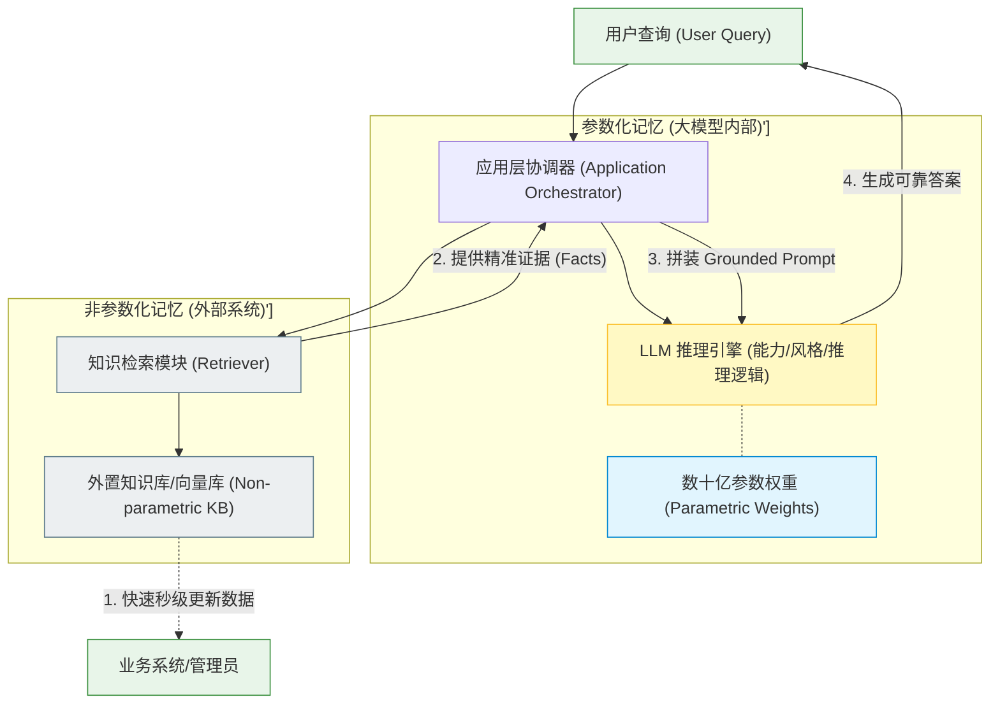
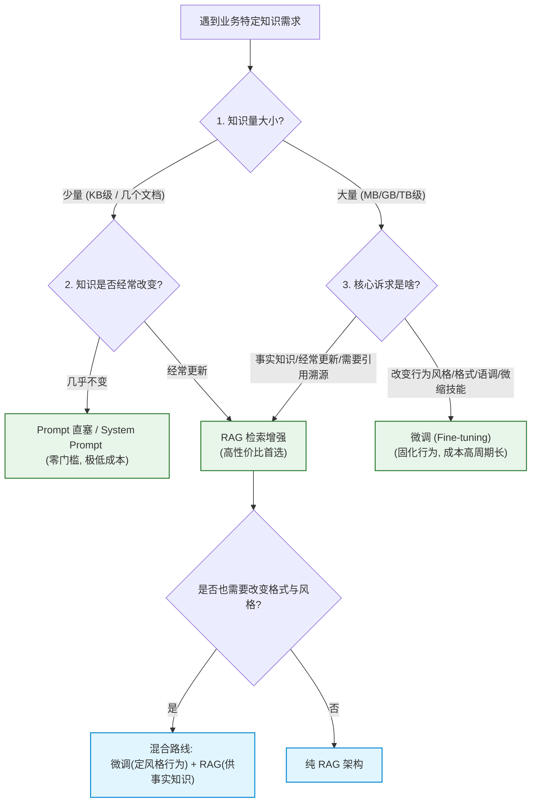

import GlossaryTerm from '@site/src/components/GlossaryTerm';
import GuidedExercise from '@site/src/components/GuidedExercise';
import ResearchNote from '@site/src/components/ResearchNote';
import ChapterMeta from '@site/src/components/ChapterMeta';
import PyRunner from '@site/src/components/PyRunner';
import TradeoffExplorer from '@site/src/components/TradeoffExplorer';
import StepFlow from '@site/src/components/StepFlow';
import QuizCard from '@site/src/components/QuizCard';

# M8L1 · 为什么需要 RAG

<ChapterMeta
  time="约 2 小时"
  prereqs={[{label: 'M7L9 幻觉与 grounding', href: '../llm-systems/hallucination-guardrails'}, {label: 'M7L2 上下文窗口', href: '../llm-systems/tokenization-context'}, {label: 'M7L4 提示/微调取舍', href: '../llm-systems/prompting-basics'}]}
  outcome="能区分让 LLM 用上特定知识的四条路（prompt 直塞 / 长上下文 / 微调 / RAG），说清各自取舍，并判断何时该用 RAG。"
  howToUse="先看“模型不懂我的知识”的痛，再对比四种方案，最后做方案选择 lab。"
/>

:::tip “让模型懂我的知识”有四条路，RAG 往往是性价比最高的那条
你想让 LLM 回答"我们公司的退货政策""这份合同的条款""最新的产品文档"——但模型训练时根本没见过这些。有四种办法：① 把知识直接写进 prompt；② 用超长上下文一次塞很多；③ 微调模型；④ RAG（检索后再答）。这一课讲清四者的取舍——**为什么对"大量、会变、要引用"的知识，RAG 通常最划算。**
:::

## 一、模型不知道"你的"知识

LLM 的知识来自训练数据，有两个边界：**时间上**停在训练截止点（不知道之后的事）、**范围上**只有公开数据（不知道你的私有文档、内部政策、实时数据）。所以你直接问"我们的退货政策是什么"，它要么说不知道、要么[幻觉编造一个（M7L9）](../llm-systems/hallucination-guardrails)。要让它正确回答，就得想办法把"你的知识"喂给它。问题是：知识可能很多（塞不进[上下文窗口 M7L2](../llm-systems/tokenization-context)）、会变（今天改了政策）、还要能引用（出处可查）。

## 二、三个核心概念（分层）

### 基础：四条路线

- **prompt 直塞**：把相关知识写进 prompt。简单，但只适合**少量、固定**的知识（[M7L4](../llm-systems/prompting-basics)）。
- **长上下文**：用大窗口一次塞很多文档。虽然省去了复杂的外部检索工程，但容易在超长输入中发生 <GlossaryTerm term="Lost in the Middle" definition="迷失在中间：大模型处理超长上下文时的一个局限性现象，即模型更容易关注输入段落的最开头和最末尾，而极易忽略处于中间段落的核心证据。">迷失在中间 (Lost in the Middle)</GlossaryTerm> 现象，且伴随着极高的 Token 成本与推理延迟。
- <GlossaryTerm term="Fine-tuning" definition="微调：用领域数据继续训练模型，把知识/风格“固化”进参数。能改变模型行为和风格，但成本高、迭代慢、知识更新要重训、且难引用来源、仍可能幻觉。">微调</GlossaryTerm>：用你的数据再训练模型。微调属于在模型的 <GlossaryTerm term="Parametric Memory" definition="参数化记忆：大模型训练完成后，固化在数十亿个浮点权重参数中的语言生成、推理和泛化能力。">参数化记忆 (Parametric Memory)</GlossaryTerm> 中固化知识，能够深层改写其**风格/格式/技能**，但对于频繁变动的事实数据则代价过于高昂，且模型依然会发生事实性幻觉，无法标记出处。
- <GlossaryTerm term="RAG" definition="检索增强生成（Retrieval-Augmented Generation）：回答前先从外部知识源检索最相关的片段，再把这些证据放进上下文让模型基于它生成答案。把“知识”从模型参数里解耦到可更新、可引用的外部检索系统。">RAG</GlossaryTerm>：回答前**先检索最相关的几段**，再让模型基于它们答。它将事实知识外置于大模型的参数之外，构筑起易于秒级更新、支持精准溯源的 <GlossaryTerm term="Non-parametric Memory" definition="非参数化记忆：外置于大模型参数之外、可独立读写和实时更新的知识库系统（如向量数据库、文档索引、传统关系型数据库）。">非参数化记忆 (Non-parametric Memory)</GlossaryTerm>。

### 进阶：RAG 为什么适配"事实知识"

RAG 的关键洞察：**把"知识"从模型参数里解耦出来，放到一个可更新、可检索、可引用的外部系统**（[呼应 M7L8 长期记忆](../llm-systems/context-memory)）。对"大量、会变、要溯源"的事实知识，这正好对症：
- 知识更新 = 更新知识库（秒级），不用重训模型。
- 每次只取最相关的几段进上下文，避开窗口限制和“迷失在中间”现象。
- 答案能附出处（[grounding + 引用，M7L9/M8L8](../llm-systems/hallucination-guardrails)），可验证、降幻觉。

### 深入（选学）：四者不是互斥，而是组合

成熟系统常**组合**使用，按"知识的性质"分配：
- **怎么说（风格/格式/领域语气/固定技能）** → 微调或好的 [system prompt（M7L4）](../llm-systems/prompting-basics)。
- **答什么（大量、易变的事实知识）** → RAG。
- **少量稳定的核心规则** → 直接写进 prompt。
- 典型组合："微调/精调 prompt 定风格 + RAG 供事实 + prompt 放核心规则"。
- **长上下文 vs RAG 不是非此即彼**：大窗口让 RAG 能放下更多相关证据（召回更宽松），但不取代检索——你仍需"从海量知识里选出相关的"这一步。"大窗口=不用 RAG"是常见误区（[M7L2](../llm-systems/tokenization-context)）。
- 判断顺序（[呼应 M7L4 由轻到重](../llm-systems/prompting-basics)）：**prompt → RAG → 微调**，越往后越贵越慢，先用够前面的。

---

### 三、技术路线深度图解 (Deep Dive Diagrams)

#### 1. 架构解耦：能力归模型，事实归外部 (Decoupled Memory)



#### 2. 决策流图：知识引入路线的选择树 (Decision Tree)



#### 3. 知识更新路径对比：微调 vs RAG (Update Flow Comparison)


---

### 四、落地实践：架构决策的闭环推演

在实际的软件系统升级过程中，大模型架构师需要通过严密的决策链来选取最合理的数据与模型集成方式。以下展示了典型的决策流程：

<StepFlow
  steps={[
    {
      title: '1. 需求评估与分类 (Analyze Requirements)',
      desc: '深入梳理知识的属性。区分这是需要动态查询的“事实型知识”（如价格、条款、日志），还是需要调整输出范式、表达语气或语法特征的“技能风格”（如模仿特定病历书写规范）。',
      diagram: '业务需求 ──> 提取指标 (量、更新频率、需要引用吗?) ──> 分类事实与风格'
    },
    {
      title: '2. 优先测试 Prompt 直塞 (Test Prompts First)',
      desc: '遵循 YAGNI 极简原则。若知识体量能缩减进几千个 Tokens (如三条安全红线)，且几乎不改变，直接通过硬编码 System Prompt 写入，无需其他基础设施。',
      diagram: '微量静态知识 ──> 编写 System Prompt ──> 零部署成本快速交付'
    },
    {
      title: '3. 事实解耦至 RAG 系统 (Decouple Facts via RAG)',
      desc: '若知识具有“大量”、“频繁变动”（秒级更新）、或“严肃场景必须溯源给出处”的特点，立刻采用 RAG。将事实剥离至外部非参数化数据库，保持底座模型的纯净性。',
      diagram: '海量易变要溯源事实 ──> 构建外部向量库 ──> 实时检索注入上下文'
    },
    {
      title: '4. 特殊场景结合微调 (Apply Fine-tuning if Needed)',
      desc: '若模型在格式遵循、复杂内部推理（如特定长文本摘要步骤）上表现不佳，或需要降低调用延迟（小模型微调代替大模型提示词），才启动微调。必要时实施微调与 RAG 混合架构。',
      diagram: '高阶行为风格限制 ──> 精洗专有数据集 ──> 离线训练微调模型'
    }
  ]}
/>

---

<ResearchNote
  title="RAG：把可更新知识从模型参数中解耦出来"
  source="Lewis et al. (2020), Retrieval-Augmented Generation；行业“RAG vs 微调”实践对比"
  href="https://arxiv.org/abs/2005.11401"
  insight="RAG 把参数化记忆（模型权重里的语言能力）和非参数化记忆（外部可检索知识）结合：模型负责理解和生成，检索负责提供准确、可更新、可引用的知识。对知识密集型任务，这比把知识硬塞进参数（微调）更新更快、更可溯源、更少幻觉。"
  application="按知识性质选路线：风格/技能用微调或 system prompt；大量易变的事实用 RAG；少量稳定规则直接进 prompt。长上下文是放大 RAG 容量而非替代检索。决策顺序 prompt→RAG→微调，先用够便宜的。"
/>

## 五、跟我做一遍：方案选择决策

<PyRunner
  rows={32}
  expect="按知识性质选对方案"
  code={`def choose(knowledge):
    # knowledge: dict 描述这份知识的性质
    if knowledge["type"] == "style":          # 风格/语气/格式/固定技能
        return "微调 或 system prompt"
    if knowledge["volume"] == "small" and knowledge["changes"] == "rarely":
        return "直接写进 prompt"               # 少量且稳定
    if knowledge["volume"] == "large" and knowledge["needs_citation"]:
        return "RAG"                          # 大量、要引用 -> RAG
    if knowledge["changes"] == "often":
        return "RAG"                          # 经常更新 -> RAG（改库即可）
    return "RAG"                              # 默认事实知识用 RAG

cases = [
    {"name": "公司退货政策(几百页,常更新,要引用)", "type": "facts", "volume": "large", "changes": "often", "needs_citation": True},
    {"name": "固定的回复语气/品牌口吻",          "type": "style", "volume": "small", "changes": "rarely", "needs_citation": False},
    {"name": "3 条核心安全规则(基本不变)",        "type": "facts", "volume": "small", "changes": "rarely", "needs_citation": False},
    {"name": "实时产品库存/价格",               "type": "facts", "volume": "large", "changes": "often", "needs_citation": True},
]
for c in cases:
    print("%-28s -> %s" % (c["name"][:28], choose(c)))
print("按知识性质选对方案")`}
/>

知识的性质（风格 vs 事实、量大小、变不变、要不要引用）决定方案——风格用微调/prompt、少量稳定写进 prompt、大量易变要引用用 RAG。**试试**：加一个"内部代码库的编码规范（量中等、偶尔变、要引用）"，想想它该走哪条路、为什么。

## 六、动手 Lab（必做）

打开 `labs/month08/m8l1_choose/`：

```bash
python labs/month08/m8l1_choose/test_choose.py
```

实现方案选择决策：按知识的类型/量/更新频率/是否要引用，选 prompt / 微调 / RAG。

<GuidedExercise
  title="练习指引：实现方案选择决策"
  goal="把“按知识性质选 prompt/微调/RAG”做成决策逻辑——架构师面对 AI 知识需求的第一判断。"
  hints={[
    '风格/语气/格式/固定技能 -> 微调或 system prompt。',
    '少量且基本不变 -> 直接进 prompt。',
    '大量、易变、要引用的事实 -> RAG。',
    '默认事实知识倾向 RAG（更新快、可引用、降幻觉）。'
  ]}
  steps={[
    '实现 choose(knowledge) 按性质返回方案。',
    '处理风格、少量稳定、大量易变要引用、经常更新几类。',
    '写测试：风格->微调/prompt、少量稳定->prompt、大量要引用->RAG、常更新->RAG。'
  ]}
  checks={[
    '你能区分 prompt/长上下文/微调/RAG 四条路。',
    '你能按知识性质选对方案。',
    '你能解释 RAG 为什么适配大量易变的事实知识。',
    '你理解四者可组合、长上下文不取代检索。'
  ]}
/>

## 七、架构师深潜（Staff+ 视角）

### 1. 四种方案对比

<TradeoffExplorer
  title="让 LLM 用上特定知识的方案"
  dimensions={['知识更新快', '可引用溯源', '降幻觉', '成本低', '适合大量知识']}
  options={[
    {
      name: 'prompt 直塞',
      scores: [5, 3, 3, 4, 1],
      note: '改 prompt 即更新、零训练。但只装得下少量知识。',
      whenToUse: '少量、相对稳定的核心知识/规则。'
    },
    {
      name: '长上下文',
      scores: [4, 3, 3, 1, 2],
      note: '一次塞很多、省检索。但贵、慢、迷失在中间，量大仍不够。',
      whenToUse: '中等量、单次任务、不想建检索时。'
    },
    {
      name: '微调',
      scores: [1, 1, 2, 1, 3],
      note: '固化风格/技能。但贵、慢、知识更新要重训、难引用、仍幻觉。',
      whenToUse: '改风格/格式/固定技能，不适合易变事实。'
    },
    {
      name: 'RAG',
      scores: [5, 5, 5, 4, 5],
      note: '知识外置、更新快、可引用、降幻觉、省 token。需建检索系统。',
      whenToUse: '大量、易变、要溯源的事实知识——最常用。'
    }
  ]}
/>

### 2. "知识"和"能力"要分开放

架构师面对 AI 知识需求时，最该想清的是：**这是"知识"还是"能力/风格"？** 知识（事实、文档、数据）会变、要准、要溯源——放外部用 RAG；能力/风格（怎么推理、什么口吻、什么格式）相对稳定——靠模型本身 + prompt + 必要时微调。把两者混在一起（比如想靠微调让模型"记住"会变的事实）是常见错误：知识一变就得重训、还是会幻觉、也无法引用。**知识放可更新的外部、能力靠模型**——这个分离是 AI 系统架构的基本功，也呼应整个课程"把会变的和不变的分开"（[M4L1](../design-patterns-lld/change-driven-design)）的主线。

### 3. 真实案例：微调的幻灭与 RAG 的兴起

AI 应用早期，很多团队第一反应是"微调一个懂我们业务的模型"。结果踩坑：微调成本高、周期长，更致命的是**知识一更新就过时、还是会幻觉、且答不出"出处"**。后来业界普遍转向 RAG：知识放向量库/数据库，改库即更新，答案带引用可验证。如今的共识是——**微调用来调"怎么说"，RAG 用来供"答什么"**。理解这个教训，能帮你避开"一上来就微调"的弯路，把精力放在更对的地方（检索质量、评测、数据工程）。

### 4. 架构师深问（给自己 30 分钟）

- 你的 AI 需求里，哪些是"知识"（该 RAG/外置）、哪些是"风格/能力"（该 prompt/微调）？
- 你的知识多久变一次？如果用微调，每次变都重训受得了吗？RAG 改库就行，省多少？
- 你的场景要不要"答案带出处"？要的话基本只能 RAG（微调答不出可靠出处）。

## 八、自检清单

- [ ] 我能区分 prompt/长上下文/微调/RAG 四条路及取舍。
- [ ] 我的 lab 能按知识性质选对方案。
- [ ] 我能解释 RAG 为什么适配大量易变要引用的事实知识。
- [ ] 我理解“知识外置、能力靠模型”的解耦架构设计原则。

## 九、章末自测

为了检验你对本章 RAG 起源、知识解耦以及不同技术路线优劣取舍等核心理念的掌握情况，请完成以下自测题目：

<QuizCard
  questions={[
    {
      q: '某电商平台希望上线一个 AI 助手提供“实时商品价格与库存查询”服务。由于平台商品上百万，价格和库存因秒杀活动频繁闪变，且业务要求必须标注价格来源（如链接或政策），请问最适合使用哪种架构路线？',
      options: [
        'A. 对平台所有商品信息进行每日微调（Fine-tuning）',
        'B. 采用 RAG 架构，将商品价格与实时库存放入外部向量库/缓存数据库中，回答前进行检索接地 (Grounding)',
        'C. 将所有商品信息拼接成一个 10M tokens 的超大 System Prompt 塞入长上下文窗口',
        'D. 仅通过普通的 Few-shot 提示工程让大模型自己估算商品价格'
      ],
      answer: 1,
      explain: '商品数据量庞大（上百万商品）且闪变频繁，微调训练完全赶不上数据的更新速度，且微调无法输出可信的溯源出处；将全部数据塞入 Prompt 会导致天价的 Token 账单与灾难级的延迟。而 RAG 能将事实数据与模型解耦，支持秒级数据库更新且原生支持出处引用，是最完美的解决方案。'
    },
    {
      q: '关于长上下文窗口（Long Context Windows，例如 1M+ tokens）与 RAG 的关系，以下哪项理解最为准确？',
      options: [
        'A. 随着上下文窗口的增大，检索增强（RAG）将变得毫无必要，因为所有文档都可以直接塞入上下文',
        'B. 即使窗口足够大，将海量无关文档直接塞入模型依然会导致极高的 Token 成本、推理延迟，以及因为“迷失在中间”而忽略关键证据的风险',
        'C. 长上下文窗口只适合微调场景，不能用于零样本（Zero-shot）推理',
        'D. RAG 只能与小窗口模型配合，无法使用大窗口模型的语义理解能力'
      ],
      answer: 1,
      explain: '“大窗口 = 不用 RAG”是行业中典型的误区。虽然大窗口能装下很多内容，但直塞会导致两个严重问题：一是成本呈线性/平方级暴涨，且首字延迟（TTFT）大幅增加；二是模型在海量上下文中寻找中段信息的召回率会严重下降（Lost in the Middle 现象）。因此 RAG 依然是过滤无关噪声、精简输入的核心屏障。'
    },
    {
      q: '大模型架构师在设计 AI 知识系统时提倡“知识放外部，能力靠模型”。这里的“能力”具体指的是什么？',
      options: [
        'A. 模型脑中储存的某个产品的实时价格',
        'B. 模型对特定结构化格式的解析、复杂长文本的逻辑推理与语言表达语调风格',
        'C. 外部关系型数据库中的表关联关系与 SQL 查询语句',
        'D. 从互联网上检索到的最新新闻事件数据'
      ],
      answer: 1,
      explain: '大模型的强项在于其泛化的推理逻辑、强大的文本压缩/抽取能力以及语调语言控制。这些属于“能力/风格”，适合通过模型权重 and Prompt 约束来塑造。而事实、条款、数字等具体的业务“知识”，则应保持外置在检索系统（RAG）中，从而以最低的成本维持数据的准确性与实时性。'
    }
  ]}
/>

## 十、常见误解

- **“想让模型懂业务就微调”**：微调适合改造模型的能力边界和回复语调风格；如果是频繁更新的业务事实，微调更新极慢且昂贵，仍会发生编造幻觉。
- **“窗口够大就不用 RAG，把整个 PDF 直塞最省事”**：超大窗口虽然省去了切块和匹配等工程，但直塞会导致 Token 计费急剧飙升，并且因为“迷失在中间 (Lost in the Middle)”使得模型对中段关键信息的捕捉准确率大打折扣。
- **“RAG 和微调是竞争二选一的关系”**：二者通常组合使用。例如先通过微调固定好符合法律合规和专业格式规范的输出“技能/风格”，再通过 RAG 实时灌入“事实案例证据”，以达到最佳效果。
- **“微调可以作为 RAG 知识检索失败的备用兜底”**：错误。微调训练是“软性写入”，模型无法保证输出 100% 准确的事实。将微调作为事实性知识的兜底会极大增加排查幻觉的复杂性。

## 十一、延伸阅读

- [RAG (Lewis et al., 2020)](https://arxiv.org/abs/2005.11401)
- [Anthropic: Retrieval / context](https://docs.anthropic.com/en/docs/build-with-claude/context-windows)
- [下一课：Embedding 与向量表示](./embeddings)